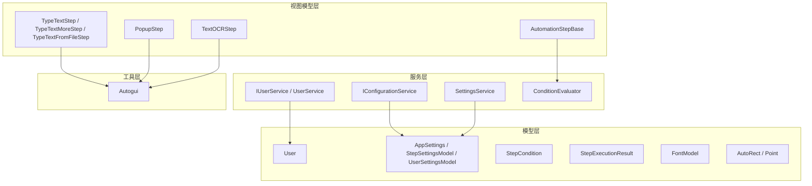
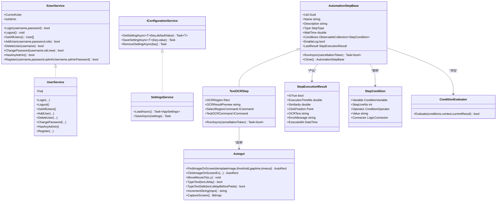
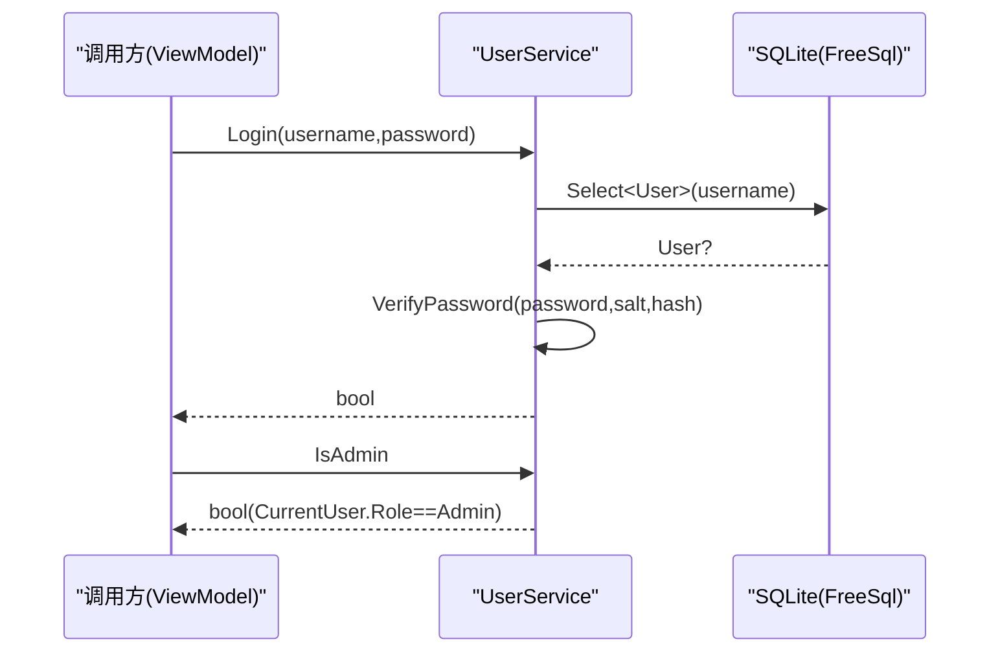
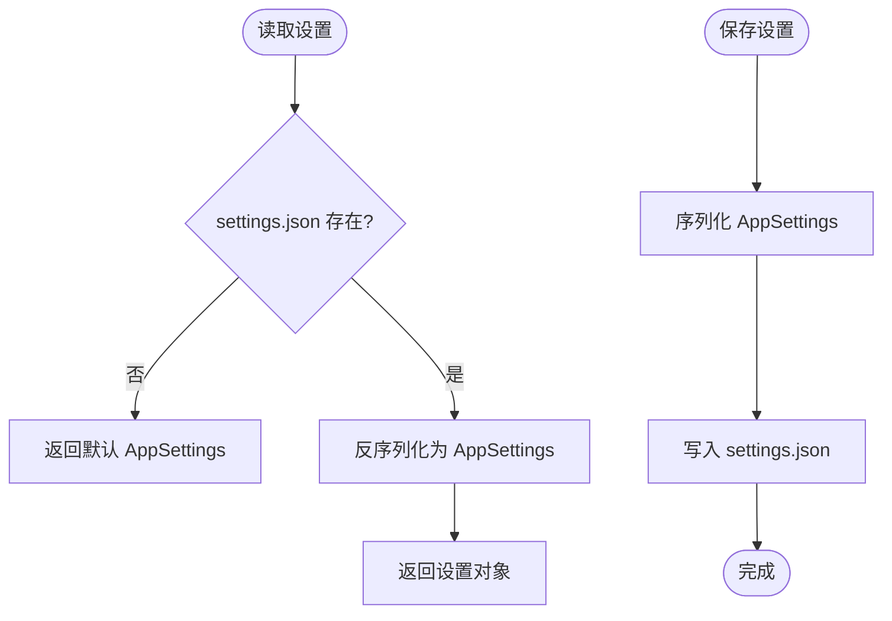
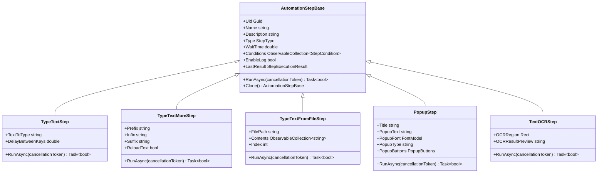
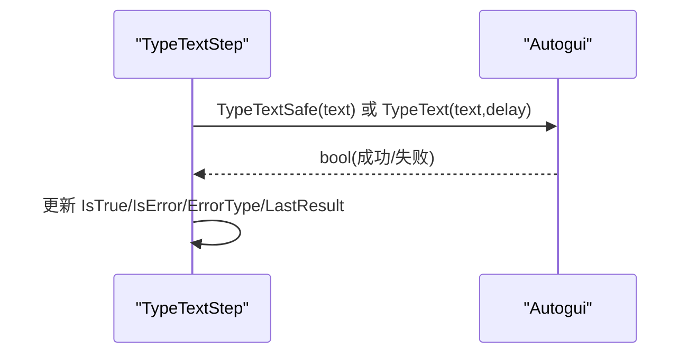
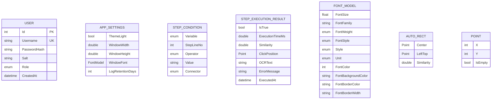
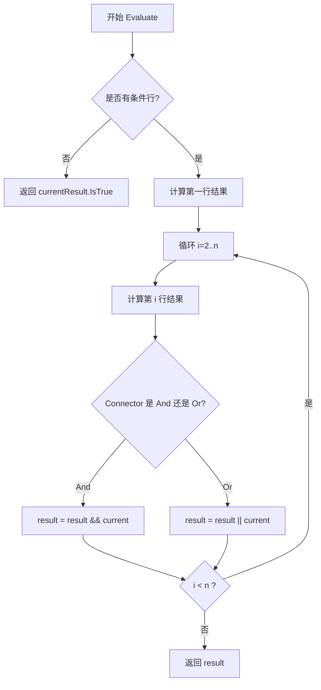
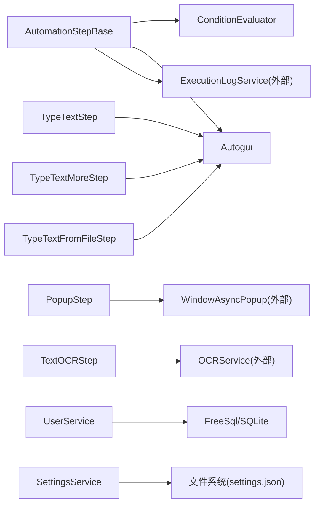

# API 参考

<cite>
**本文引用的文件**   
- [IUserService.cs](file://ShaoLu/Services/IUserService.cs)
- [User.cs](file://ShaoLu/Models/User.cs)
- [UserService.cs](file://ShaoLu/Services/UserService.cs)
- [IConfigurationService.cs](file://ShaoLu/Services/IConfigurationService.cs)
- [Settings.cs](file://ShaoLu/Models/Settings.cs)
- [SettingsService.cs](file://ShaoLu/Services/SettingsService.cs)
- [AutomationStep.cs](file://ShaoLu/Viewmodels/AutomationStep.cs)
- [TextOCRStep.cs](file://ShaoLu/Viewmodels/TextOCRStep.cs)
- [Autogui.cs](file://ShaoLu/Utils/Autogui.cs)
- [AutomationStepModel.cs](file://ShaoLu/Models/AutomationStepModel.cs)
- [StepCondition.cs](file://ShaoLu/Models/StepCondition.cs)
- [StepExecutionResult.cs](file://ShaoLu/Models/StepExecutionResult.cs)
- [FontModel.cs](file://ShaoLu/Models/FontModel.cs)
- [AutoguiModel.cs](file://ShaoLu/Models/AutoguiModel.cs)
- [ConditionEvaluator.cs](file://ShaoLu/Services/ConditionEvaluator.cs)
</cite>

## 目录
1. [简介](#简介)
2. [项目结构](#项目结构)
3. [核心组件](#核心组件)
4. [架构总览](#架构总览)
5. [详细组件分析](#详细组件分析)
6. [依赖关系分析](#依赖关系分析)
7. [性能考虑](#性能考虑)
8. [故障排查指南](#故障排查指南)
9. [结论](#结论)
10. [附录：API 速查与示例](#附录api-速查与示例)

## 简介
本参考文档面向 ShaoLu 自动化流程引擎的使用者与扩展开发者，系统化梳理并说明以下能力：
- 服务接口定义与用法：IUserService、IConfigurationService 等
- 步骤基类与自定义步骤开发：AutomationStepBase 的继承与实现要点
- Autogui 工具类：图像识别、文本输入、鼠标键盘模拟等核心方法
- 数据模型：AutomationStepModel（枚举）、User、Settings、StepCondition、StepExecutionResult、FontModel、AutoguiModel（AutoRect/Point）等
- 事件与回调机制、异步处理模式（CancellationToken、Task）
- 完整使用示例与最佳实践

## 项目结构
ShaoLu 采用分层组织方式：
- Models：领域模型与配置实体
- Services：业务服务（用户、条件评估、设置持久化等）
- Viewmodels：自动化步骤与视图模型
- Utils：系统级工具（Autogui 等）
- Views：UI 窗口与控件

图表来源
- [IUserService.cs:1-20](file://ShaoLu/Services/IUserService.cs#L1-L20)
- [User.cs:1-33](file://ShaoLu/Models/User.cs#L1-L33)
- [Settings.cs:1-76](file://ShaoLu/Models/Settings.cs#L1-L76)
- [SettingsService.cs:1-38](file://ShaoLu/Services/SettingsService.cs#L1-L38)
- [AutomationStep.cs:1-800](file://ShaoLu/Viewmodels/AutomationStep.cs#L1-L800)
- [TextOCRStep.cs:1-181](file://ShaoLu/Viewmodels/TextOCRStep.cs#L1-L181)
- [Autogui.cs:1-584](file://ShaoLu/Utils/Autogui.cs#L1-L584)
- [StepCondition.cs:1-122](file://ShaoLu/Models/StepCondition.cs#L1-L122)
- [StepExecutionResult.cs:1-46](file://ShaoLu/Models/StepExecutionResult.cs#L1-L46)
- [FontModel.cs:1-46](file://ShaoLu/Models/FontModel.cs#L1-L46)
- [AutoguiModel.cs:56-115](file://ShaoLu/Models/AutoguiModel.cs#L56-L115)

章节来源
- [IUserService.cs:1-20](file://ShaoLu/Services/IUserService.cs#L1-L20)
- [IConfigurationService.cs:1-12](file://ShaoLu/Services/IConfigurationService.cs#L1-L12)
- [AutomationStep.cs:1-800](file://ShaoLu/Viewmodels/AutomationStep.cs#L1-L800)
- [Autogui.cs:1-584](file://ShaoLu/Utils/Autogui.cs#L1-L584)

## 核心组件
本节概述关键服务与模型，便于快速定位 API。

- IUserService：用户登录、登出、用户管理、管理员校验、注册等
- IConfigurationService：键值型配置的异步读写
- SettingsService：AppSettings 的 JSON 持久化
- AutomationStepBase：所有自动化步骤的抽象基类，提供通用属性、执行框架与结果记录
- Autogui：屏幕截图、模板匹配、鼠标键盘模拟、剪贴板安全输入、字符串自增等
- StepCondition / ConditionEvaluator：条件规则行与评估器
- StepExecutionResult：步骤执行结果的数据载体
- FontModel / AppSettings：字体与全局设置
- AutoRect / Point：图像识别返回的位置与相似度信息

章节来源
- [IUserService.cs:1-20](file://ShaoLu/Services/IUserService.cs#L1-L20)
- [IConfigurationService.cs:1-12](file://ShaoLu/Services/IConfigurationService.cs#L1-L12)
- [SettingsService.cs:1-38](file://ShaoLu/Services/SettingsService.cs#L1-L38)
- [AutomationStep.cs:1-800](file://ShaoLu/Viewmodels/AutomationStep.cs#L1-L800)
- [Autogui.cs:1-584](file://ShaoLu/Utils/Autogui.cs#L1-L584)
- [StepCondition.cs:1-122](file://ShaoLu/Models/StepCondition.cs#L1-L122)
- [StepExecutionResult.cs:1-46](file://ShaoLu/Models/StepExecutionResult.cs#L1-L46)
- [FontModel.cs:1-46](file://ShaoLu/Models/FontModel.cs#L1-L46)
- [AutoguiModel.cs:56-115](file://ShaoLu/Models/AutoguiModel.cs#L56-L115)

## 架构总览
下图展示服务、模型与步骤之间的交互关系，以及 Autogui 在 UI 自动化中的位置。

图表来源
- [IUserService.cs:1-20](file://ShaoLu/Services/IUserService.cs#L1-L20)
- [UserService.cs:1-239](file://ShaoLu/Services/UserService.cs#L1-L239)
- [IConfigurationService.cs:1-12](file://ShaoLu/Services/IConfigurationService.cs#L1-L12)
- [SettingsService.cs:1-38](file://ShaoLu/Services/SettingsService.cs#L1-L38)
- [AutomationStep.cs:1-800](file://ShaoLu/Viewmodels/AutomationStep.cs#L1-L800)
- [TextOCRStep.cs:1-181](file://ShaoLu/Viewmodels/TextOCRStep.cs#L1-L181)
- [Autogui.cs:1-584](file://ShaoLu/Utils/Autogui.cs#L1-L584)
- [StepExecutionResult.cs:1-46](file://ShaoLu/Models/StepExecutionResult.cs#L1-L46)
- [StepCondition.cs:1-122](file://ShaoLu/Models/StepCondition.cs#L1-L122)
- [ConditionEvaluator.cs:1-187](file://ShaoLu/Services/ConditionEvaluator.cs#L1-L187)

## 详细组件分析

### 服务接口：IUserService 与 UserService
- 职责：用户认证、会话状态、用户 CRUD、管理员权限判断、注册审批流程
- 关键点：
  - CurrentUser/IsAdmin 暴露当前登录态与角色
  - Login/Logout 维护会话
  - AddUser/DeleteUser/ChangePassword/HasAnyAdmin/Register 覆盖常见用户管理场景
  - 密码采用盐值+PBKDF2(SHA256)哈希存储，比较使用常量时间算法防止时序攻击

图表来源
- [UserService.cs:76-93](file://ShaoLu/Services/UserService.cs#L76-L93)
- [UserService.cs:30-31](file://ShaoLu/Services/UserService.cs#L30-L31)
- [User.cs:12-31](file://ShaoLu/Models/User.cs#L12-L31)

章节来源
- [IUserService.cs:1-20](file://ShaoLu/Services/IUserService.cs#L1-L20)
- [UserService.cs:1-239](file://ShaoLu/Services/UserService.cs#L1-L239)
- [User.cs:1-33](file://ShaoLu/Models/User.cs#L1-L33)

### 配置服务：IConfigurationService 与 SettingsService
- IConfigurationService：定义通用的异步配置存取接口（泛型 T 为引用类型）
- SettingsService：基于 JSON 文件的 AppSettings 持久化，提供 LoadAsync/SaveAsync

图表来源
- [SettingsService.cs:20-37](file://ShaoLu/Services/SettingsService.cs#L20-L37)
- [Settings.cs:7-68](file://ShaoLu/Models/Settings.cs#L7-L68)

章节来源
- [IConfigurationService.cs:1-12](file://ShaoLu/Services/IConfigurationService.cs#L1-L12)
- [SettingsService.cs:1-38](file://ShaoLu/Services/SettingsService.cs#L1-L38)
- [Settings.cs:1-76](file://ShaoLu/Models/Settings.cs#L1-L76)

### 自动化步骤基类：AutomationStepBase 与具体步骤
- AutomationStepBase：
  - 统一属性：名称、描述、类型、等待时间、条件集合、日志开关、错误信息、执行结果等
  - 执行入口：RunAsync(CancellationToken)，派生类需实现；同时提供同步 Run()
  - 克隆：Clone() 用于复制步骤实例
  - 条件：支持多行条件与 AND/OR 组合
- 内置步骤：
  - TypeTextStep：单条文本输入
  - TypeTextMoreStep：带前缀/中缀/后缀拼接与自增
  - TypeTextFromFileStep：从文件或 Excel 逐行读取输入
  - PopupStep：弹出确认框，支持取消与按钮选择
- 自定义步骤：
  - 继承 AutomationStepBase
  - 实现 Clone() 与 RunAsync(CancellationToken)
  - 通过 LastResult 记录执行结果，必要时抛出异常或设置 IsError/ErrorType

图表来源
- [AutomationStep.cs:25-205](file://ShaoLu/Viewmodels/AutomationStep.cs#L25-L205)
- [AutomationStep.cs:209-279](file://ShaoLu/Viewmodels/AutomationStep.cs#L209-L279)
- [AutomationStep.cs:281-435](file://ShaoLu/Viewmodels/AutomationStep.cs#L281-L435)
- [AutomationStep.cs:437-602](file://ShaoLu/Viewmodels/AutomationStep.cs#L437-L602)
- [AutomationStep.cs:606-752](file://ShaoLu/Viewmodels/AutomationStep.cs#L606-L752)
- [TextOCRStep.cs:17-142](file://ShaoLu/Viewmodels/TextOCRStep.cs#L17-L142)

章节来源
- [AutomationStep.cs:1-800](file://ShaoLu/Viewmodels/AutomationStep.cs#L1-L800)
- [TextOCRStep.cs:1-181](file://ShaoLu/Viewmodels/TextOCRStep.cs#L1-L181)

### Autogui 工具类：图像识别、输入与模拟
- 图像识别：
  - FindImageOnScreen：模板匹配，返回 AutoRect（含中心点、左上角、相似度），支持超时与间隔重试
  - ClickImageOnScreen/ClickImageOnScreenEx：查找并点击，支持多次点击、偏移量、等待时间
- 屏幕与坐标：
  - CaptureScreen：全屏截图
  - MoveMouseTo：移动到指定坐标或区域锚点（中心/四角）并可叠加像素偏移
- 文本输入：
  - TypeText：逐字符按键模拟
  - TypeTextSafe：基于剪贴板的“安全”粘贴，自动切换线程并恢复剪贴板
- 其他：
  - IncrementString：对字符串末尾数字或字母进行递增（固定位数或进位扩展）
  - ConvertImageSourceToBitmap：WPF ImageSource 转 GDI+ Bitmap

图表来源
- [Autogui.cs:59-122](file://ShaoLu/Utils/Autogui.cs#L59-L122)
- [Autogui.cs:256-306](file://ShaoLu/Utils/Autogui.cs#L256-L306)
- [Autogui.cs:497-579](file://ShaoLu/Utils/Autogui.cs#L497-L579)
- [AutomationStep.cs:253-278](file://ShaoLu/Viewmodels/AutomationStep.cs#L253-L278)

章节来源
- [Autogui.cs:1-584](file://ShaoLu/Utils/Autogui.cs#L1-L584)

### 数据模型：User、Settings、StepCondition、StepExecutionResult、FontModel、AutoRect/Point
- User：用户实体（用户名、密码哈希、盐、角色、创建时间）
- AppSettings：应用设置（主题、窗口尺寸、字体、日志保留天数等）
- StepSettingsModel：步骤默认参数（相似度阈值、等待/超时、点击次数、快捷键等）
- StepCondition：条件规则行（变量、运算符、值、连接器）
- StepExecutionResult：执行结果（是否成功、耗时、相似度、点击位置、OCR 文本、错误信息、时间戳）
- FontModel：字体样式与颜色等
- AutoRect/Point：图像识别返回的矩形与点（支持隐式转换与运算）

图表来源
- [User.cs:12-31](file://ShaoLu/Models/User.cs#L12-L31)
- [Settings.cs:7-68](file://ShaoLu/Models/Settings.cs#L7-L68)
- [StepCondition.cs:76-120](file://ShaoLu/Models/StepCondition.cs#L76-L120)
- [StepExecutionResult.cs:8-44](file://ShaoLu/Models/StepExecutionResult.cs#L8-L44)
- [FontModel.cs:6-44](file://ShaoLu/Models/FontModel.cs#L6-L44)
- [AutoguiModel.cs:89-115](file://ShaoLu/Models/AutoguiModel.cs#L89-L115)

章节来源
- [User.cs:1-33](file://ShaoLu/Models/User.cs#L1-L33)
- [Settings.cs:1-76](file://ShaoLu/Models/Settings.cs#L1-L76)
- [StepCondition.cs:1-122](file://ShaoLu/Models/StepCondition.cs#L1-L122)
- [StepExecutionResult.cs:1-46](file://ShaoLu/Models/StepExecutionResult.cs#L1-L46)
- [FontModel.cs:1-46](file://ShaoLu/Models/FontModel.cs#L1-L46)
- [AutoguiModel.cs:56-115](file://ShaoLu/Models/AutoguiModel.cs#L56-L115)

### 条件评估器：ConditionEvaluator
- 功能：按行评估 StepCondition 列表，结合 AND/OR 得到最终布尔结果
- 变量解析：支持常量、当前步骤自身、引用其他步骤行号（StepLineNo）
- 比较逻辑：支持布尔、数值、字符串（相等/包含/空检查等）

图表来源
- [ConditionEvaluator.cs:22-50](file://ShaoLu/Services/ConditionEvaluator.cs#L22-L50)
- [ConditionEvaluator.cs:55-76](file://ShaoLu/Services/ConditionEvaluator.cs#L55-L76)
- [ConditionEvaluator.cs:81-142](file://ShaoLu/Services/ConditionEvaluator.cs#L81-L142)

章节来源
- [ConditionEvaluator.cs:1-187](file://ShaoLu/Services/ConditionEvaluator.cs#L1-L187)
- [StepCondition.cs:1-122](file://ShaoLu/Models/StepCondition.cs#L1-L122)

## 依赖关系分析
- 服务与模型：UserService 依赖 FreeSql 与 User 模型；SettingsService 依赖 AppSettings 模型
- 步骤与服务：步骤在执行时可能调用 Autogui、OCRService（由 TextOCRStep 使用）、ExecutionLogService（由部分步骤记录日志）
- 条件评估：AutomationStepBase 持有 StepCondition 列表，运行时通过 ConditionEvaluator 评估

图表来源
- [AutomationStep.cs:1-800](file://ShaoLu/Viewmodels/AutomationStep.cs#L1-L800)
- [TextOCRStep.cs:1-181](file://ShaoLu/Viewmodels/TextOCRStep.cs#L1-L181)
- [UserService.cs:1-239](file://ShaoLu/Services/UserService.cs#L1-L239)
- [SettingsService.cs:1-38](file://ShaoLu/Services/SettingsService.cs#L1-L38)

章节来源
- [AutomationStep.cs:1-800](file://ShaoLu/Viewmodels/AutomationStep.cs#L1-L800)
- [TextOCRStep.cs:1-181](file://ShaoLu/Viewmodels/TextOCRStep.cs#L1-L181)
- [UserService.cs:1-239](file://ShaoLu/Services/UserService.cs#L1-L239)
- [SettingsService.cs:1-38](file://ShaoLu/Services/SettingsService.cs#L1-L38)

## 性能考虑
- 图像识别：
  - 合理设置 threshold、gaptime、timeout，避免频繁截图与匹配
  - 批量匹配时使用 FindImagesOnScreen，减少重复初始化
- 文本输入：
  - 大段文本优先使用 TypeTextSafe（剪贴板粘贴），降低按键开销
  - 调整 DelayBetweenKeys 平衡稳定性与速度
- 条件评估：
  - 将复杂表达式拆分为多行，利用 AND/OR 短路特性提升可读性与性能
- 异步与取消：
  - 始终传递 CancellationToken，确保长时间操作可被及时中断
  - 避免在 UI 线程执行阻塞 IO 或 CPU 密集任务

[本节为通用指导，不直接分析具体文件]

## 故障排查指南
- 图像未找到：
  - 检查模板图片质量与阈值；适当增大 timeout/gaptime
  - 确认目标窗口处于前台且未被遮挡
- 文本输入失败：
  - 使用 TypeTextSafe 替代 TypeText，确保剪贴板线程安全
  - 检查目标输入框焦点是否正确
- 弹窗取消：
  - PopupStep 支持取消，若需要捕获取消行为，请检查返回值与 IsTrue
- 条件评估异常：
  - 检查 StepCondition.Variable 与 StepLineNo 是否有效
  - 注意字符串/数值类型的比较边界情况

章节来源
- [Autogui.cs:59-122](file://ShaoLu/Utils/Autogui.cs#L59-L122)
- [Autogui.cs:497-579](file://ShaoLu/Utils/Autogui.cs#L497-L579)
- [AutomationStep.cs:606-752](file://ShaoLu/Viewmodels/AutomationStep.cs#L606-L752)
- [ConditionEvaluator.cs:55-76](file://ShaoLu/Services/ConditionEvaluator.cs#L55-L76)

## 结论
ShaoLu 提供了完善的自动化步骤框架与底层 Autogui 能力，配合清晰的服务接口与数据模型，能够高效构建稳定的 UI 自动化流程。建议遵循异步与取消规范、合理使用条件评估与日志记录，以获得更好的可维护性与可观测性。

[本节为总结，不直接分析具体文件]

## 附录：API 速查与示例

### IUserService 方法与参数说明
- Login(username, password)：验证并登录
- Logout()：清除当前用户
- GetAllUsers()：获取全部用户
- AddUser(username, password, role)：新增用户
- DeleteUser(username)：删除用户（保护最后一个管理员）
- ChangePassword(username, oldPassword, newPassword)：修改密码
- HasAnyAdmin()：是否存在管理员
- Register(username, password, adminUsername=null, adminPassword=null)：注册新用户（可能需要管理员审批）

章节来源
- [IUserService.cs:6-18](file://ShaoLu/Services/IUserService.cs#L6-L18)
- [UserService.cs:76-236](file://ShaoLu/Services/UserService.cs#L76-L236)

### IConfigurationService 方法与参数说明
- GetSettingAsync<T>(key, defaultValue=default)：异步读取配置
- SaveSettingAsync<T>(key, value)：异步保存配置
- RemoveSettingAsync(key)：异步删除配置

章节来源
- [IConfigurationService.cs:5-10](file://ShaoLu/Services/IConfigurationService.cs#L5-L10)
- [SettingsService.cs:20-37](file://ShaoLu/Services/SettingsService.cs#L20-L37)

### AutomationStepBase 使用要点
- 继承后必须实现 Clone() 与 RunAsync(CancellationToken)
- 通过 WaitTime 控制步骤间等待；通过 EnableLog 控制日志输出
- 使用 Conditions 与 ConditionMode 配置条件分支
- 在 RunAsync 中设置 LastResult 以记录执行结果

章节来源
- [AutomationStep.cs:25-205](file://ShaoLu/Viewmodels/AutomationStep.cs#L25-L205)
- [StepExecutionResult.cs:8-44](file://ShaoLu/Models/StepExecutionResult.cs#L8-L44)

### Autogui 常用方法
- FindImageOnScreen(templateImage, threshold=0.8, gaptime=0.2, timeout=3)：模板匹配
- ClickImageOnScreen/ClickImageOnScreenEx(...)：查找并点击
- MoveMouseTo(x,y) 或 MoveMouseTo(rect, position, clickoffset)：移动鼠标
- TypeText(text, delayBetweenKeys=0)：按键输入
- TypeTextSafe(text, delayBeforePaste=50)：剪贴板安全输入
- IncrementString(input)：字符串自增
- CaptureScreen()：全屏截图

章节来源
- [Autogui.cs:59-122](file://ShaoLu/Utils/Autogui.cs#L59-L122)
- [Autogui.cs:256-306](file://ShaoLu/Utils/Autogui.cs#L256-L306)
- [Autogui.cs:497-579](file://ShaoLu/Utils/Autogui.cs#L497-L579)
- [Autogui.cs:355-495](file://ShaoLu/Utils/Autogui.cs#L355-L495)

### 数据模型字段概览
- User：Id、Username、PasswordHash、Salt、Role、CreatedAt
- AppSettings：App、Step、UserSettings
- StepSettingsModel：ShowErrorPopup、MinimizeOnRun、DefaultSelfReferenceLimit、ConfirmBeforeRun、DefaultSimilarityThreshold、DefaultWaitTime、DefaultTimeout、DefaultClicks、StartHotKey、StopHotKey
- StepCondition：Variable、StepLineNo、Operator、Value、Connector
- StepExecutionResult：IsTrue、ExecutionTimeMs、Similarity、ClickPosition、OCRText、ErrorMessage、ExecutedAt
- FontModel：FontSize、FontFamily、FontWeight、FontStyle、Style、Unit、FontColor、FontBackgroundColor、FontBorderColor、FontBorderWidth
- AutoRect/Point：Center、LeftTop、Similarity、X、Y、IsEmpty

章节来源
- [User.cs:12-31](file://ShaoLu/Models/User.cs#L12-L31)
- [Settings.cs:7-68](file://ShaoLu/Models/Settings.cs#L7-L68)
- [StepCondition.cs:76-120](file://ShaoLu/Models/StepCondition.cs#L76-L120)
- [StepExecutionResult.cs:8-44](file://ShaoLu/Models/StepExecutionResult.cs#L8-L44)
- [FontModel.cs:6-44](file://ShaoLu/Models/FontModel.cs#L6-L44)
- [AutoguiModel.cs:89-115](file://ShaoLu/Models/AutoguiModel.cs#L89-L115)

### 常见用法模式（示例路径）
- 文本输入：
  - 直接使用 TypeTextStep.RunAsync，或通过 Autogui.TypeTextSafe 实现稳定粘贴
  - 参考：[TypeTextStep.RunAsync:253-278](file://ShaoLu/Viewmodels/AutomationStep.cs#L253-L278)、[Autogui.TypeTextSafe:551-579](file://ShaoLu/Utils/Autogui.cs#L551-L579)
- 图像点击：
  - 使用 Autogui.ClickImageOnScreenEx 获取 AutoRect，再根据 Position 与偏移点击
  - 参考：[ClickImageOnScreenEx:265-306](file://ShaoLu/Utils/Autogui.cs#L265-L306)
- OCR 识别：
  - 配置 TextOCRStep.OCRRegion，调用 RunAsync 获取 OCRText
  - 参考：[TextOCRStep.RunAsync:102-142](file://ShaoLu/Viewmodels/TextOCRStep.cs#L102-L142)
- 条件分支：
  - 配置 StepCondition 列表与 Connector，运行前由 ConditionEvaluator.Evaluate 评估
  - 参考：[ConditionEvaluator.Evaluate:22-50](file://ShaoLu/Services/ConditionEvaluator.cs#L22-L50)

[本节为示例指引，不直接展示代码内容]