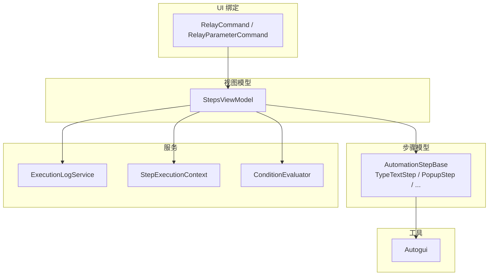
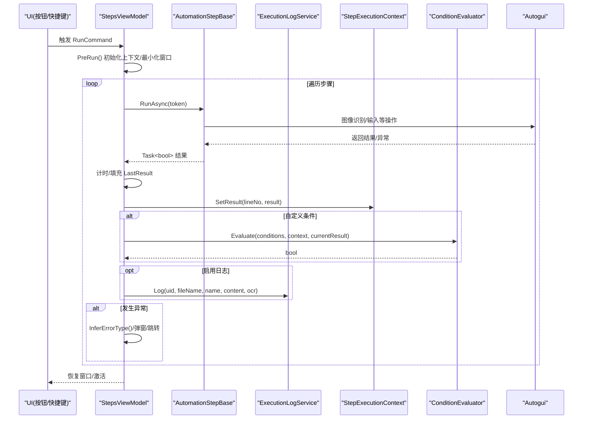
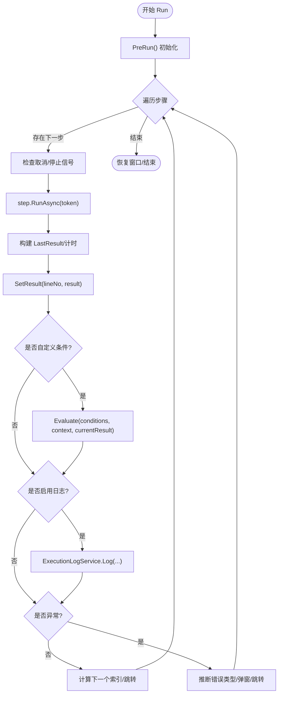
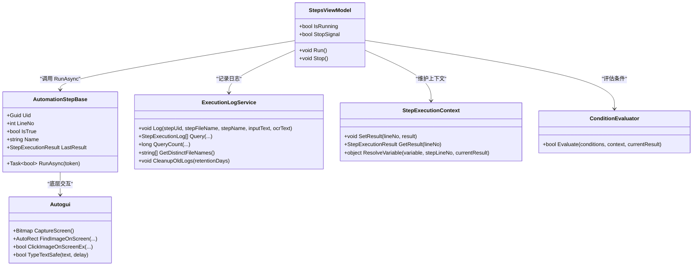

# 事件与回调

<cite>
**本文引用的文件**   
- [ShaoLu/Utils/RelayCommand.cs](file://ShaoLu/Utils/RelayCommand.cs)
- [ShaoLu/Tools/ImageEdit/ViewModels/RelayCommand.cs](file://ShaoLu/Tools/ImageEdit/ViewModels/RelayCommand.cs)
- [ShaoLu/Viewmodels/StepsViewModel.cs](file://ShaoLu/Viewmodels/StepsViewModel.cs)
- [ShaoLu/Viewmodels/AutomationStep.cs](file://ShaoLu/Viewmodels/AutomationStep.cs)
- [ShaoLu/Services/ExecutionLogService.cs](file://ShaoLu/Services/ExecutionLogService.cs)
- [ShaoLu/Models/StepExecutionResult.cs](file://ShaoLu/Models/StepExecutionResult.cs)
- [ShaoLu/Models/StepExecutionLog.cs](file://ShaoLu/Models/StepExecutionLog.cs)
- [ShaoLu/Services/StepExecutionContext.cs](file://ShaoLu/Services/StepExecutionContext.cs)
- [ShaoLu/Services/ConditionEvaluator.cs](file://ShaoLu/Services/ConditionEvaluator.cs)
- [ShaoLu/Utils/Autogui.cs](file://ShaoLu/Utils/Autogui.cs)
- [ShaoLu/Viewmodels/ImagesRecognition.cs](file://ShaoLu/Viewmodels/ImagesRecognition.cs)
- [ShaoLu/Viewmodels/ImageRecognition.cs](file://ShaoLu/Viewmodels/ImageRecognition.cs)
- [ShaoLu/Models/AutomationStepModel.cs](file://ShaoLu/Models/AutomationStepModel.cs)
- [ShaoLu/Readme.md](file://ShaoLu/Readme.md)
</cite>

## 目录
1. [简介](#简介)
2. [项目结构](#项目结构)
3. [核心组件](#核心组件)
4. [架构总览](#架构总览)
5. [详细组件分析](#详细组件分析)
6. [依赖关系分析](#依赖关系分析)
7. [性能考量](#性能考量)
8. [故障排查指南](#故障排查指南)
9. [结论](#结论)
10. [附录](#附录)

## 简介
本文件面向 ShaoLu 项目的“事件与回调”机制，聚焦 MVVM 中的命令模式实现（RelayCommand）、异步命令执行、应用程序生命周期事件（步骤开始/结束、错误处理、进度更新等）的触发时机与参数格式，以及日志服务的回调接口与最佳实践。文档同时提供事件流图与代码级示例路径，帮助读者快速理解并正确使用该机制。

## 项目结构
围绕事件与回调的关键位置：
- 命令层：通用 RelayCommand 与带参数的 RelayParameterCommand，用于 UI 绑定与业务逻辑解耦
- 视图模型层：StepsViewModel 编排自动化流程，负责生命周期事件与异常处理
- 步骤模型层：AutomationStepBase 及其派生类定义 RunAsync 异步执行契约
- 服务层：ExecutionLogService 记录执行日志；StepExecutionContext 维护执行上下文；ConditionEvaluator 评估条件
- 工具层：Autogui 封装屏幕交互与 OCR 辅助能力

**图表来源** 
- [ShaoLu/Utils/RelayCommand.cs](file://ShaoLu/Utils/RelayCommand.cs)
- [ShaoLu/Viewmodels/StepsViewModel.cs](file://ShaoLu/Viewmodels/StepsViewModel.cs)
- [ShaoLu/Viewmodels/AutomationStep.cs](file://ShaoLu/Viewmodels/AutomationStep.cs)
- [ShaoLu/Services/ExecutionLogService.cs](file://ShaoLu/Services/ExecutionLogService.cs)
- [ShaoLu/Services/StepExecutionContext.cs](file://ShaoLu/Services/StepExecutionContext.cs)
- [ShaoLu/Services/ConditionEvaluator.cs](file://ShaoLu/Services/ConditionEvaluator.cs)
- [ShaoLu/Utils/Autogui.cs](file://ShaoLu/Utils/Autogui.cs)

**章节来源**
- [ShaoLu/Readme.md](file://ShaoLu/Readme.md)

## 核心组件
- 命令模式（MVVM）
  - RelayCommand：无参命令，支持 CanExecute 判断与事件通知
  - RelayCommand<T>：泛型有参命令
  - RelayParameterCommand：线程安全的参数命令，RaiseCanExecuteChanged 自动跨线程调度到 UI 线程
- 异步命令执行
  - StepsViewModel.Run() 作为入口，使用 CancellationTokenSource 控制取消
  - 每个步骤实现 RunAsync(CancellationToken)，由引擎统一调度
- 生命周期事件
  - 步骤开始：进入循环体前设置 SelectedStep、计时器启动
  - 步骤结束：计算耗时、填充 LastResult、写入上下文、可选自定义条件评估、可选日志记录
  - 错误处理：捕获异常、推断错误类型、弹窗提示（可配置）、根据 FalseGoto 决定是否继续
  - 进度更新：IsRunning、StopSignal、SelectedStep 变化驱动 UI 状态刷新
- 日志服务回调
  - ExecutionLogService.Log(...) 将 StepExecutionLog 持久化到 SQLite
  - 失败时通过 NLog 记录错误，保证不中断主流程

**章节来源**
- [ShaoLu/Utils/RelayCommand.cs](file://ShaoLu/Utils/RelayCommand.cs)
- [ShaoLu/Viewmodels/StepsViewModel.cs](file://ShaoLu/Viewmodels/StepsViewModel.cs)
- [ShaoLu/Viewmodels/AutomationStep.cs](file://ShaoLu/Viewmodels/AutomationStep.cs)
- [ShaoLu/Services/ExecutionLogService.cs](file://ShaoLu/Services/ExecutionLogService.cs)
- [ShaoLu/Models/StepExecutionResult.cs](file://ShaoLu/Models/StepExecutionResult.cs)
- [ShaoLu/Models/StepExecutionLog.cs](file://ShaoLu/Models/StepExecutionLog.cs)

## 架构总览
下图展示从 UI 命令到步骤执行、结果回传、日志记录的完整调用链。

**图表来源** 
- [ShaoLu/Viewmodels/StepsViewModel.cs](file://ShaoLu/Viewmodels/StepsViewModel.cs)
- [ShaoLu/Viewmodels/AutomationStep.cs](file://ShaoLu/Viewmodels/AutomationStep.cs)
- [ShaoLu/Services/ExecutionLogService.cs](file://ShaoLu/Services/ExecutionLogService.cs)
- [ShaoLu/Services/StepExecutionContext.cs](file://ShaoLu/Services/StepExecutionContext.cs)
- [ShaoLu/Services/ConditionEvaluator.cs](file://ShaoLu/Services/ConditionEvaluator.cs)
- [ShaoLu/Utils/Autogui.cs](file://ShaoLu/Utils/Autogui.cs)

## 详细组件分析

### 命令模式与 RelayCommand
- 无参命令：RelayCommand(Action execute, Func<bool> canExecute)
  - Execute 直接调用委托；CanExecute 基于 canExecute 判定；RaiseCanExecuteChanged 触发 UI 刷新
- 泛型命令：RelayCommand<T>(Action<T>, Func<T,bool>)
  - 适合需要传递参数的场景
- 线程安全参数命令：RelayParameterCommand(Action<object>, Func<bool>)
  - RaiseCanExecuteChanged 内部检查当前线程，必要时通过 Dispatcher.BeginInvoke 切换到 UI 线程，避免跨线程异常

使用建议
- 在 ViewModel 中暴露 ICommand 属性，绑定到 UI 控件
- 对于可能从后台线程调用的命令，优先使用 RelayParameterCommand，确保 UI 线程安全

**章节来源**
- [ShaoLu/Utils/RelayCommand.cs](file://ShaoLu/Utils/RelayCommand.cs)
- [ShaoLu/Tools/ImageEdit/ViewModels/RelayCommand.cs](file://ShaoLu/Tools/ImageEdit/ViewModels/RelayCommand.cs)

### 异步命令执行与步骤生命周期
- 入口：StepsViewModel.Run()
  - 创建 CancellationTokenSource，循环遍历 AutomationStepBases
  - 每步开始前检查取消信号与 StopSignal
  - 计时执行 step.RunAsync(token)
  - 构建 StepExecutionResult，写入 StepExecutionContext
  - 若启用自定义条件，调用 ConditionEvaluator.Evaluate
  - 若启用日志，调用 ExecutionLogService.Log
  - 捕获异常，推断错误类型，按策略弹窗或跳转
- 步骤基类：AutomationStepBase
  - 抽象方法 RunAsync(CancellationToken) 定义异步执行契约
  - 各具体步骤（如 TypeTextStep、PopupStep）实现各自逻辑

流程图（Run 主循环）

**图表来源** 
- [ShaoLu/Viewmodels/StepsViewModel.cs](file://ShaoLu/Viewmodels/StepsViewModel.cs)
- [ShaoLu/Viewmodels/AutomationStep.cs](file://ShaoLu/Viewmodels/AutomationStep.cs)

**章节来源**
- [ShaoLu/Viewmodels/StepsViewModel.cs](file://ShaoLu/Viewmodels/StepsViewModel.cs)
- [ShaoLu/Viewmodels/AutomationStep.cs](file://ShaoLu/Viewmodels/AutomationStep.cs)

### 应用程序生命周期事件
- 步骤执行开始
  - 触发点：进入 for 循环体，选中步骤赋值，计时器启动
  - 参数：step.LineNo、step.Name、token
- 步骤执行结束
  - 触发点：step.RunAsync 完成后
  - 参数：LastResult（包含 IsTrue、ExecutionTimeMs、Similarity、ClickPosition、OCRText、ErrorMessage、ExecutedAt）
- 错误处理
  - 触发点：catch (Exception ex)
  - 参数：ex.Message、InferErrorType(ex)、是否弹窗、FalseGoto 跳转目标
- 进度更新
  - 触发点：IsRunning、StopSignal、SelectedStep 变化
  - 参数：布尔状态、当前步骤引用

最佳实践
- 所有长耗时操作必须使用 async/await + CancellationToken
- 对 UI 状态的变更必须在 UI 线程进行（WPF 要求）
- 错误处理要区分用户取消与系统异常，避免误报

**章节来源**
- [ShaoLu/Viewmodels/StepsViewModel.cs](file://ShaoLu/Viewmodels/StepsViewModel.cs)
- [ShaoLu/Models/StepExecutionResult.cs](file://ShaoLu/Models/StepExecutionResult.cs)

### 日志服务回调接口
- 接口：ExecutionLogService.Log(Guid stepUid, string stepFileName, string stepName, string inputText, string ocrText = null)
- 数据模型：StepExecutionLog（Id、StepUid、StepFileName、StepName、InputText、OCRText、ExecutedAt）
- 异步写入：内部使用 FreeSql 插入，异常被捕获并通过 NLog 记录，不影响主流程
- 查询与清理：Query、QueryCount、GetDistinctFileNames、CleanupOldLogs

使用建议
- 在步骤成功执行后且 EnableLog 为真时调用
- 尽量聚合关键信息（相似度、OCR 文本）以便后续分析

**章节来源**
- [ShaoLu/Services/ExecutionLogService.cs](file://ShaoLu/Services/ExecutionLogService.cs)
- [ShaoLu/Models/StepExecutionLog.cs](file://ShaoLu/Models/StepExecutionLog.cs)

### 条件评估与上下文
- StepExecutionContext：保存每一步的执行结果，支持变量解析（Self_* 与 Step_*）
- ConditionEvaluator：对多行条件进行 AND/OR 组合评估，支持数值、字符串、布尔比较

使用建议
- 在步骤结束后立即 SetResult，再评估自定义条件
- 合理设计变量引用，避免循环依赖

**章节来源**
- [ShaoLu/Services/StepExecutionContext.cs](file://ShaoLu/Services/StepExecutionContext.cs)
- [ShaoLu/Services/ConditionEvaluator.cs](file://ShaoLu/Services/ConditionEvaluator.cs)

### 图像识别与输入工具
- Autogui：封装截图、模板匹配、鼠标移动/点击、文字输入（含剪贴板安全模式）
- ImageRecognition/ImagesRecognition：实现 ClickImage/FindImage 等多图识别逻辑，填充 LastResult

使用建议
- 超时与间隔参数需根据实际 UI 响应时间调整
- 大量图片识别时注意内存释放与线程池占用

**章节来源**
- [ShaoLu/Utils/Autogui.cs](file://ShaoLu/Utils/Autogui.cs)
- [ShaoLu/Viewmodels/ImageRecognition.cs](file://ShaoLu/Viewmodels/ImageRecognition.cs)
- [ShaoLu/Viewmodels/ImagesRecognition.cs](file://ShaoLu/Viewmodels/ImagesRecognition.cs)

## 依赖关系分析

**图表来源** 
- [ShaoLu/Viewmodels/StepsViewModel.cs](file://ShaoLu/Viewmodels/StepsViewModel.cs)
- [ShaoLu/Viewmodels/AutomationStep.cs](file://ShaoLu/Viewmodels/AutomationStep.cs)
- [ShaoLu/Services/ExecutionLogService.cs](file://ShaoLu/Services/ExecutionLogService.cs)
- [ShaoLu/Services/StepExecutionContext.cs](file://ShaoLu/Services/StepExecutionContext.cs)
- [ShaoLu/Services/ConditionEvaluator.cs](file://ShaoLu/Services/ConditionEvaluator.cs)
- [ShaoLu/Utils/Autogui.cs](file://ShaoLu/Utils/Autogui.cs)

**章节来源**
- [ShaoLu/Models/AutomationStepModel.cs](file://ShaoLu/Models/AutomationStepModel.cs)

## 性能考量
- 异步与取消
  - 所有 I/O 与图像处理均使用 Task.Run 与 await，避免阻塞 UI 线程
  - 使用 CancellationToken 支持中途取消，提升用户体验
- 资源管理
  - 图像转换与截图使用 using 块释放资源
  - 批量识别时注意内存峰值，避免频繁大对象分配
- 日志写入
  - 日志写入采用独立事务与异常隔离，避免影响主流程
  - 定期清理旧日志，控制数据库体积

[本节为通用指导，不直接分析具体文件]

## 故障排查指南
常见问题与定位要点
- 步骤执行失败
  - 查看 Step.IsError、Step.ErrorMessage、Step.ErrorType
  - 检查 Autogui 相关参数（阈值、超时、间隔）
- 无法取消执行
  - 确认 CancellationToken 是否正确传播到子任务
  - 检查 UI 线程上的弹窗关闭逻辑
- 日志未写入
  - 检查 ExecutionLogService 的数据库路径与权限
  - 查看 NLog 输出是否有写入异常

参考路径
- 异常处理与错误类型推断：[ShaoLu/Viewmodels/StepsViewModel.cs](file://ShaoLu/Viewmodels/StepsViewModel.cs)
- 日志写入与异常隔离：[ShaoLu/Services/ExecutionLogService.cs](file://ShaoLu/Services/ExecutionLogService.cs)
- 弹窗与取消流程：[ShaoLu/Viewmodels/AutomationStep.cs](file://ShaoLu/Viewmodels/AutomationStep.cs)

**章节来源**
- [ShaoLu/Viewmodels/StepsViewModel.cs](file://ShaoLu/Viewmodels/StepsViewModel.cs)
- [ShaoLu/Services/ExecutionLogService.cs](file://ShaoLu/Services/ExecutionLogService.cs)
- [ShaoLu/Viewmodels/AutomationStep.cs](file://ShaoLu/Viewmodels/AutomationStep.cs)

## 结论
ShaoLu 的事件与回调机制以 MVVM 命令模式为核心，结合异步执行与统一的步骤生命周期管理，实现了高内聚、低耦合的自动化流程编排。通过 ExecutionLogService 与 StepExecutionContext，系统在运行期具备完善的可观测性与可回溯性。遵循本文的最佳实践，可有效提升稳定性与可维护性。

[本节为总结，不直接分析具体文件]

## 附录
- 事件订阅与取消订阅最佳实践
  - 使用弱事件或一次性订阅，避免内存泄漏
  - 在 ViewModel 析构或页面关闭时显式取消订阅
- 事件处理中的异常处理策略
  - 区分用户取消与系统异常，分别记录日志与提示
  - 对 UI 操作进行线程安全检查，必要时使用 Dispatcher
- 代码示例路径（不含具体代码内容）
  - 命令定义与使用：[ShaoLu/Utils/RelayCommand.cs](file://ShaoLu/Utils/RelayCommand.cs)
  - 步骤执行入口与生命周期：[ShaoLu/Viewmodels/StepsViewModel.cs](file://ShaoLu/Viewmodels/StepsViewModel.cs)
  - 步骤异步执行契约：[ShaoLu/Viewmodels/AutomationStep.cs](file://ShaoLu/Viewmodels/AutomationStep.cs)
  - 日志服务接口：[ShaoLu/Services/ExecutionLogService.cs](file://ShaoLu/Services/ExecutionLogService.cs)
  - 执行结果模型：[ShaoLu/Models/StepExecutionResult.cs](file://ShaoLu/Models/StepExecutionResult.cs)
  - 执行日志模型：[ShaoLu/Models/StepExecutionLog.cs](file://ShaoLu/Models/StepExecutionLog.cs)
  - 上下文与条件评估：[ShaoLu/Services/StepExecutionContext.cs](file://ShaoLu/Services/StepExecutionContext.cs), [ShaoLu/Services/ConditionEvaluator.cs](file://ShaoLu/Services/ConditionEvaluator.cs)
  - 图像识别与输入工具：[ShaoLu/Utils/Autogui.cs](file://ShaoLu/Utils/Autogui.cs), [ShaoLu/Viewmodels/ImageRecognition.cs](file://ShaoLu/Viewmodels/ImageRecognition.cs), [ShaoLu/Viewmodels/ImagesRecognition.cs](file://ShaoLu/Viewmodels/ImagesRecognition.cs)

[本节为补充说明，不直接分析具体文件]