# 数据模型

<cite>
**本文引用的文件**   
- [AutomationStepModel.cs](file://ShaoLu/Models/AutomationStepModel.cs)
- [User.cs](file://ShaoLu/Models/User.cs)
- [Settings.cs](file://ShaoLu/Models/Settings.cs)
- [StepCondition.cs](file://ShaoLu/Models/StepCondition.cs)
- [StepExecutionLog.cs](file://ShaoLu/Models/StepExecutionLog.cs)
- [StepExecutionResult.cs](file://ShaoLu/Models/StepExecutionResult.cs)
- [AutoguiModel.cs](file://ShaoLu/Models/AutoguiModel.cs)
- [FontModel.cs](file://ShaoLu/Models/FontModel.cs)
- [AutomationStep.cs](file://ShaoLu/Viewmodels/AutomationStep.cs)
</cite>

## 目录
1. [简介](#简介)
2. [项目结构](#项目结构)
3. [核心组件](#核心组件)
4. [架构总览](#架构总览)
5. [详细组件分析](#详细组件分析)
6. [依赖关系分析](#依赖关系分析)
7. [性能考虑](#性能考虑)
8. [故障排查指南](#故障排查指南)
9. [结论](#结论)
10. [附录](#附录)

## 简介
本文件为 ShaoLu 项目的数据模型 API 文档，覆盖自动化步骤、用户与权限、应用设置、条件判断、执行日志与结果等关键实体。重点说明：
- AutomationStepModel 的步骤类型与错误类型枚举，以及步骤配置结构（通过基类与具体步骤实现）
- User 用户的角色与权限字段
- Settings 应用程序的配置项
- StepCondition 条件判断的数据结构与运算规则
- StepExecutionLog 执行日志的持久化格式
- StepExecutionResult 执行结果的状态码与结构化字段
并提供实体关系图、JSON 序列化示例、数据验证规则、数据库映射说明及迁移与版本兼容性建议。

## 项目结构
数据模型主要位于 Models 目录，部分视图模型与步骤实现位于 Viewmodels 目录，用于承载步骤运行时的行为与属性扩展。

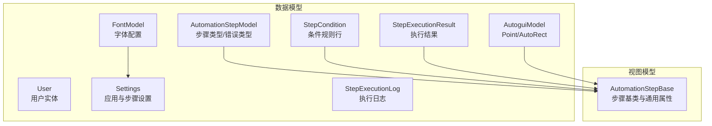

图表来源
- [AutomationStepModel.cs:9-41](file://ShaoLu/Models/AutomationStepModel.cs#L9-L41)
- [User.cs:6-31](file://ShaoLu/Models/User.cs#L6-L31)
- [Settings.cs:7-75](file://ShaoLu/Models/Settings.cs#L7-L75)
- [StepCondition.cs:76-120](file://ShaoLu/Models/StepCondition.cs#L76-L120)
- [StepExecutionLog.cs:6-45](file://ShaoLu/Models/StepExecutionLog.cs#L6-L45)
- [StepExecutionResult.cs:8-44](file://ShaoLu/Models/StepExecutionResult.cs#L8-L44)
- [AutoguiModel.cs:3-144](file://ShaoLu/Models/AutoguiModel.cs#L3-L144)
- [FontModel.cs:6-44](file://ShaoLu/Models/FontModel.cs#L6-L44)
- [AutomationStep.cs:25-200](file://ShaoLu/Viewmodels/AutomationStep.cs#L25-L200)

章节来源
- [AutomationStepModel.cs:9-41](file://ShaoLu/Models/AutomationStepModel.cs#L9-L41)
- [User.cs:6-31](file://ShaoLu/Models/User.cs#L6-L31)
- [Settings.cs:7-75](file://ShaoLu/Models/Settings.cs#L7-L75)
- [StepCondition.cs:76-120](file://ShaoLu/Models/StepCondition.cs#L76-L120)
- [StepExecutionLog.cs:6-45](file://ShaoLu/Models/StepExecutionLog.cs#L6-L45)
- [StepExecutionResult.cs:8-44](file://ShaoLu/Models/StepExecutionResult.cs#L8-L44)
- [AutoguiModel.cs:3-144](file://ShaoLu/Models/AutoguiModel.cs#L3-L144)
- [FontModel.cs:6-44](file://ShaoLu/Models/FontModel.cs#L6-L44)
- [AutomationStep.cs:25-200](file://ShaoLu/Viewmodels/AutomationStep.cs#L25-L200)

## 核心组件
本节概述各实体的职责与关键字段，便于快速理解数据模型全貌。

- 步骤类型与错误类型
  - StepType：定义自动化步骤的种类（如点击图像、输入文本、OCR、弹窗等），用于区分不同步骤的行为与参数。
  - StepErrorType：定义步骤执行过程中的错误分类，便于统一上报与展示。

- 用户实体
  - User：包含用户名、密码哈希、盐值、角色与创建时间；使用 FreeSql 注解进行数据库映射。

- 应用设置
  - AppSettings：顶层配置容器，包含应用、步骤、用户相关设置。
  - AppSettingsModel：主题、窗口尺寸、字体、日志保留天数等。
  - StepSettingsModel：错误弹窗、最小化运行、自引用限制、确认运行、默认相似度阈值、默认等待/超时、默认点击次数、快捷键等。
  - HotKeySetting：修饰键与主键组合。

- 条件判断
  - StepCondition：单条条件规则，包含变量来源、目标步骤行号、运算符、比较值、逻辑连接器。
  - ConditionMode：默认模式（使用自身执行结果）与自定义模式（使用规则行）。
  - ConditionVariable：支持常量、当前步骤自身、引用其他步骤的属性。
  - ConditionOperator：相等、不等、大小比较、包含、空判断等。
  - LogicConnector：And/Or 连接多行条件。

- 执行日志
  - StepExecutionLog：记录步骤唯一标识、文件名、名称、输入文本、OCR 文本、执行时间。

- 执行结果
  - StepExecutionResult：布尔结果、耗时、相似度、点击位置、OCR 文本、错误信息、执行时间。

- 几何与字体
  - Point/AutoRect：坐标与矩形封装，支持多种构造方式与隐式转换。
  - FontModel：字体族、大小、粗细、样式、颜色、边框等。

章节来源
- [AutomationStepModel.cs:9-41](file://ShaoLu/Models/AutomationStepModel.cs#L9-L41)
- [User.cs:6-31](file://ShaoLu/Models/User.cs#L6-L31)
- [Settings.cs:7-75](file://ShaoLu/Models/Settings.cs#L7-L75)
- [StepCondition.cs:76-120](file://ShaoLu/Models/StepCondition.cs#L76-L120)
- [StepExecutionLog.cs:6-45](file://ShaoLu/Models/StepExecutionLog.cs#L6-L45)
- [StepExecutionResult.cs:8-44](file://ShaoLu/Models/StepExecutionResult.cs#L8-L44)
- [AutoguiModel.cs:3-144](file://ShaoLu/Models/AutoguiModel.cs#L3-L144)
- [FontModel.cs:6-44](file://ShaoLu/Models/FontModel.cs#L6-L44)

## 架构总览
下图展示了数据模型在系统中的交互关系：步骤基类聚合条件与执行结果，设置模块提供默认值，用户实体用于鉴权，日志用于审计。

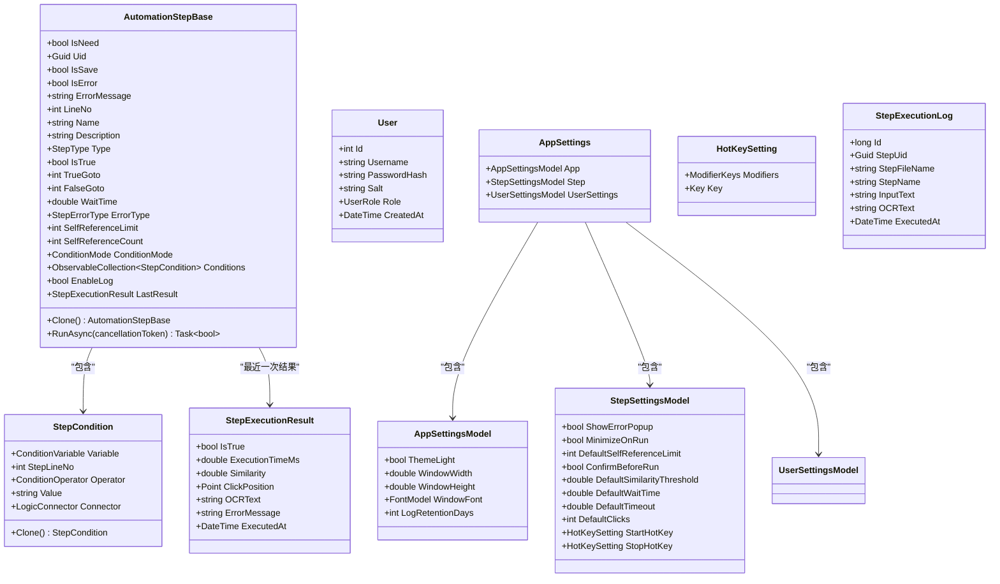

图表来源
- [AutomationStep.cs:25-200](file://ShaoLu/Viewmodels/AutomationStep.cs#L25-L200)
- [StepCondition.cs:76-120](file://ShaoLu/Models/StepCondition.cs#L76-L120)
- [StepExecutionResult.cs:8-44](file://ShaoLu/Models/StepExecutionResult.cs#L8-L44)
- [User.cs:6-31](file://ShaoLu/Models/User.cs#L6-L31)
- [Settings.cs:7-75](file://ShaoLu/Models/Settings.cs#L7-L75)
- [StepExecutionLog.cs:6-45](file://ShaoLu/Models/StepExecutionLog.cs#L6-L45)

## 详细组件分析

### 步骤模型与配置结构（AutomationStepModel 与 AutomationStepBase）
- 步骤类型与错误类型
  - StepType：Empty、ClickImage、TypeText、FindImage、ClickImages、FindImages、TypeTextMore、TypeTextFromFile、TextOCR、Popup 等，用于区分步骤行为。
  - StepErrorType：None、ImageNotFound、ImageLoadFailed、ImageMatchFailed、TextEmpty、FileNotFound、FileReadError、ExecutionTimeout、SelfReferenceLimit、CancelledByUser、PopupError、ConversionError、IndexOutOfRange、OCRError、Unknown。

- 步骤基类（AutomationStepBase）
  - 通用属性：IsNeed、Uid、IsSave、IsError、ErrorMessage、LineNo、Name、Description、Type、IsTrue、TrueGoto、FalseGoto、WaitTime、ErrorType、SelfReferenceLimit、SelfReferenceCount、ConditionMode、Conditions、EnableLog、LastResult。
  - 条件判断：支持默认模式与自定义模式，Conditions 为 StepCondition 集合。
  - 执行接口：RunAsync 抽象方法，供具体步骤实现异步执行。

- 具体步骤实现（示例：TypeTextStep）
  - 属性：TextToType、DelayBetweenKeys。
  - 行为：按延迟或无延迟输入文本，更新 IsTrue/ErrorType，并在启用日志时记录。

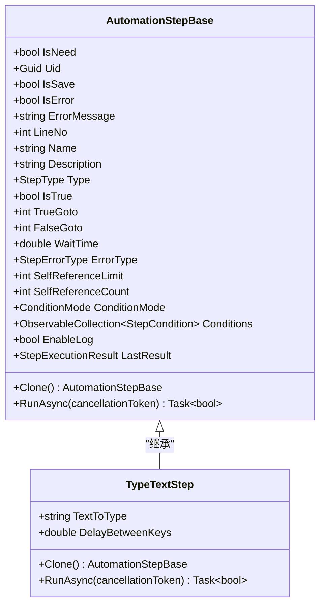

图表来源
- [AutomationStep.cs:25-200](file://ShaoLu/Viewmodels/AutomationStep.cs#L25-L200)
- [AutomationStep.cs:209-272](file://ShaoLu/Viewmodels/AutomationStep.cs#L209-L272)

章节来源
- [AutomationStepModel.cs:9-41](file://ShaoLu/Models/AutomationStepModel.cs#L9-L41)
- [AutomationStep.cs:25-200](file://ShaoLu/Viewmodels/AutomationStep.cs#L25-L200)
- [AutomationStep.cs:209-272](file://ShaoLu/Viewmodels/AutomationStep.cs#L209-L272)

### 用户与权限（User）
- 字段
  - Id：自增主键
  - Username：用户名，非空，最大长度 128
  - PasswordHash：密码哈希
  - Salt：盐值
  - Role：角色（Admin/User）
  - CreatedAt：创建时间

- 数据库映射
  - 表名：app_user
  - 主键：Id（自增）
  - 字符串字段长度约束由 Column 注解指定

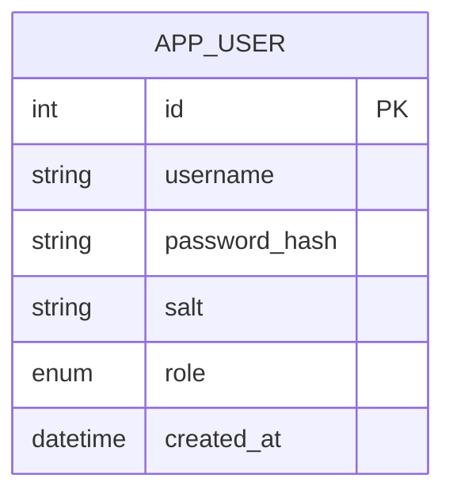

图表来源
- [User.cs:12-31](file://ShaoLu/Models/User.cs#L12-L31)

章节来源
- [User.cs:6-31](file://ShaoLu/Models/User.cs#L6-L31)

### 应用设置（Settings）
- AppSettings：包含 App、Step、UserSettings 三个子配置对象。
- AppSettingsModel：ThemeLight、WindowWidth、WindowHeight、WindowFont、LogRetentionDays。
- StepSettingsModel：ShowErrorPopup、MinimizeOnRun、DefaultSelfReferenceLimit、ConfirmBeforeRun、DefaultSimilarityThreshold、DefaultWaitTime、DefaultTimeout、DefaultClicks、StartHotKey、StopHotKey。
- HotKeySetting：Modifiers、Key。

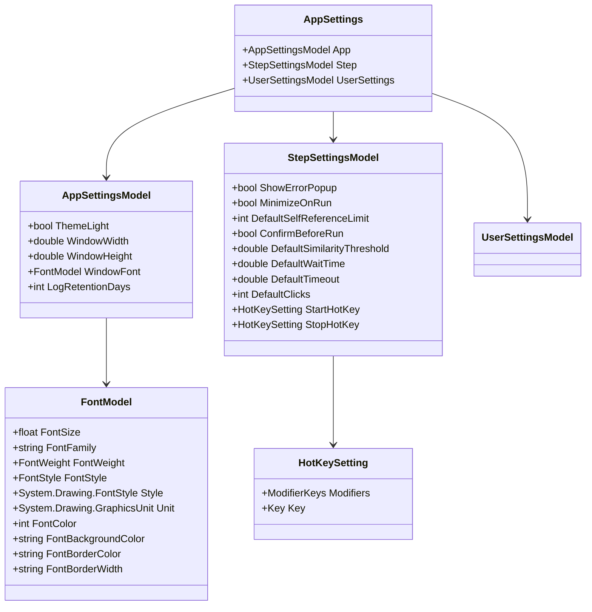

图表来源
- [Settings.cs:7-75](file://ShaoLu/Models/Settings.cs#L7-L75)
- [FontModel.cs:6-44](file://ShaoLu/Models/FontModel.cs#L6-L44)

章节来源
- [Settings.cs:7-75](file://ShaoLu/Models/Settings.cs#L7-L75)
- [FontModel.cs:6-44](file://ShaoLu/Models/FontModel.cs#L6-L44)

### 条件判断（StepCondition）
- 条件变量（ConditionVariable）
  - 常量：ConstantTrue、ConstantFalse
  - 当前步骤自身：Self_IsTrue、Self_Similarity、Self_ExecutionTimeMs、Self_ClickX、Self_ClickY、Self_OCRText
  - 引用其他步骤：Step_* 系列，配合 StepLineNo 指定目标行

- 运算符（ConditionOperator）
  - Equal、NotEqual、GreaterThan、LessThan、GreaterOrEqual、LessOrEqual、Contains、NotContains、IsEmpty、IsNotEmpty

- 逻辑连接器（LogicConnector）
  - And、Or

- 规则行（StepCondition）
  - Variable、StepLineNo、Operator、Value、Connector
  - Clone 方法用于复制规则

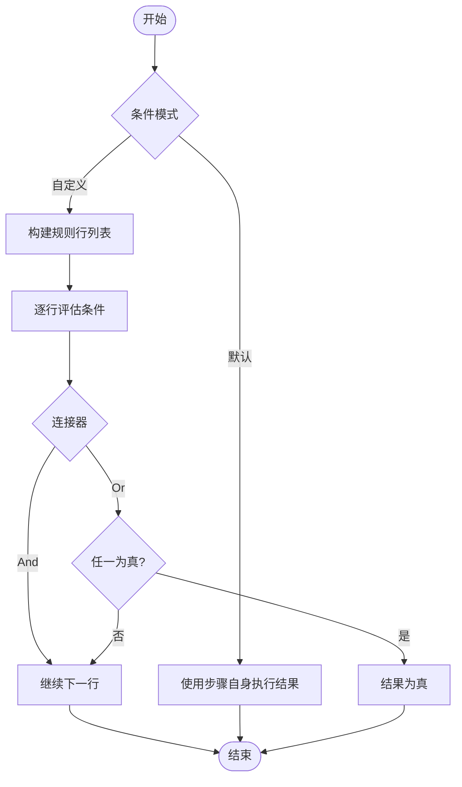

图表来源
- [StepCondition.cs:76-120](file://ShaoLu/Models/StepCondition.cs#L76-L120)

章节来源
- [StepCondition.cs:76-120](file://ShaoLu/Models/StepCondition.cs#L76-L120)

### 执行日志（StepExecutionLog）
- 字段
  - Id：自增主键
  - StepUid：步骤唯一标识
  - StepFileName：步骤文件名（无扩展名）
  - StepName：步骤名称
  - InputText：本次执行的输入内容
  - OCRText：OCR 识别结果
  - ExecutedAt：执行时间

- 数据库映射
  - 表名：step_execution_log
  - 主键：Id（自增）
  - 长文本字段：InputText、OCRText（长度 -1）

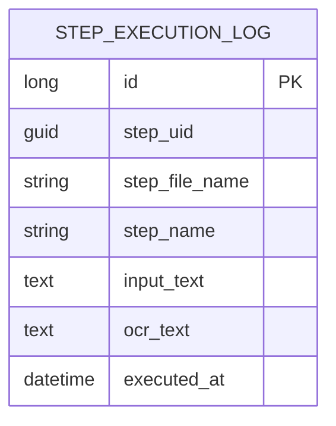

图表来源
- [StepExecutionLog.cs:6-45](file://ShaoLu/Models/StepExecutionLog.cs#L6-L45)

章节来源
- [StepExecutionLog.cs:6-45](file://ShaoLu/Models/StepExecutionLog.cs#L6-L45)

### 执行结果（StepExecutionResult）
- 字段
  - IsTrue：是否成功
  - ExecutionTimeMs：执行耗时（毫秒）
  - Similarity：图像识别相似度（-1 表示不适用）
  - ClickPosition：点击位置（Point）
  - OCRText：OCR 识别文本
  - ErrorMessage：错误信息
  - ExecutedAt：执行时间

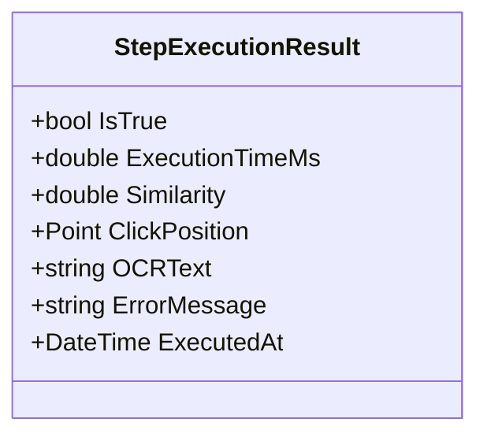

图表来源
- [StepExecutionResult.cs:8-44](file://ShaoLu/Models/StepExecutionResult.cs#L8-L44)

章节来源
- [StepExecutionResult.cs:8-44](file://ShaoLu/Models/StepExecutionResult.cs#L8-L44)

### 几何与字体（AutoguiModel 与 FontModel）
- Point：支持多种构造方式与隐式转换，提供 X/Y/IsEmpty 属性。
- AutoRect：中心点与左上角点，计算四角点与相似度、空状态。
- FontModel：字体族、大小、粗细、样式、颜色、边框等，提供 Clone 方法。

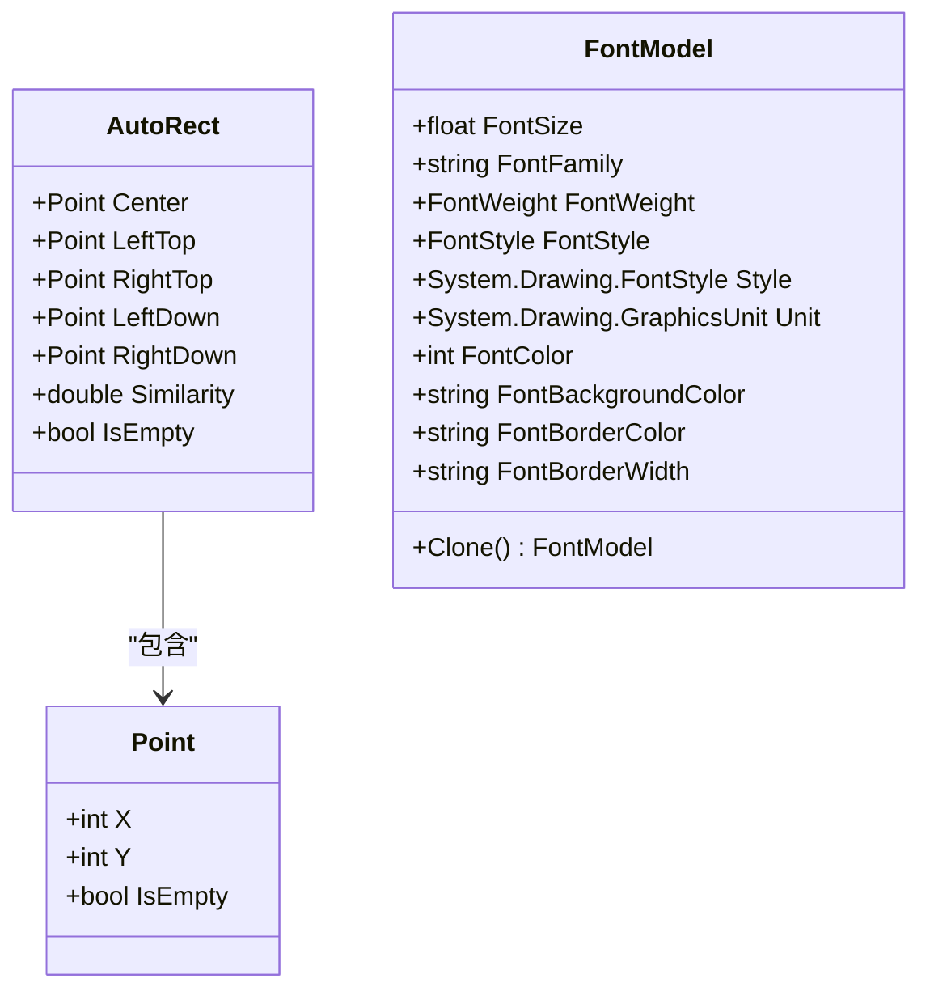

图表来源
- [AutoguiModel.cs:3-144](file://ShaoLu/Models/AutoguiModel.cs#L3-L144)
- [FontModel.cs:6-44](file://ShaoLu/Models/FontModel.cs#L6-L44)

章节来源
- [AutoguiModel.cs:3-144](file://ShaoLu/Models/AutoguiModel.cs#L3-L144)
- [FontModel.cs:6-44](file://ShaoLu/Models/FontModel.cs#L6-L44)

## 依赖关系分析
- 步骤基类依赖条件模型与执行结果模型，用于运行时评估与记录。
- 设置模型提供默认值，影响步骤行为（如默认相似度阈值、等待/超时、自引用限制）。
- 用户模型独立，用于鉴权与访问控制。
- 日志模型独立，用于审计与回溯。

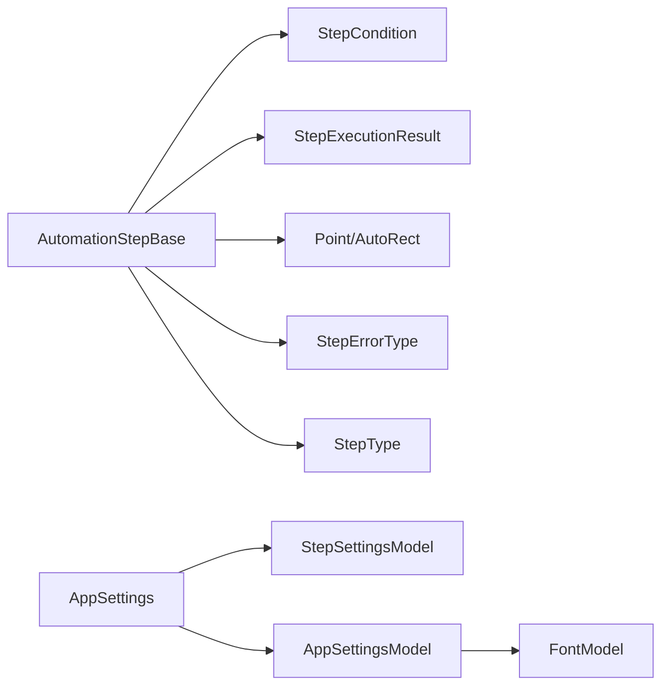

图表来源
- [AutomationStep.cs:25-200](file://ShaoLu/Viewmodels/AutomationStep.cs#L25-L200)
- [StepCondition.cs:76-120](file://ShaoLu/Models/StepCondition.cs#L76-L120)
- [StepExecutionResult.cs:8-44](file://ShaoLu/Models/StepExecutionResult.cs#L8-L44)
- [AutoguiModel.cs:3-144](file://ShaoLu/Models/AutoguiModel.cs#L3-L144)
- [Settings.cs:7-75](file://ShaoLu/Models/Settings.cs#L7-L75)

章节来源
- [AutomationStep.cs:25-200](file://ShaoLu/Viewmodels/AutomationStep.cs#L25-L200)
- [StepCondition.cs:76-120](file://ShaoLu/Models/StepCondition.cs#L76-L120)
- [StepExecutionResult.cs:8-44](file://ShaoLu/Models/StepExecutionResult.cs#L8-L44)
- [AutoguiModel.cs:3-144](file://ShaoLu/Models/AutoguiModel.cs#L3-L144)
- [Settings.cs:7-75](file://ShaoLu/Models/Settings.cs#L7-L75)

## 性能考虑
- 条件评估：自定义模式下多条规则行的串联评估应避免频繁分配与解析，建议在运行时缓存已解析的类型与值。
- 图像识别：相似度计算与匹配可能耗时，建议结合默认阈值与超时配置，避免过长等待。
- 日志写入：大量日志可能导致 IO 瓶颈，建议根据 LogRetentionDays 定期清理，并采用异步写入。
- 自引用限制：防止循环调用导致栈溢出，应严格遵循 SelfReferenceLimit 与 SelfReferenceCount。

[本节为通用指导，不直接分析具体文件]

## 故障排查指南
- 常见错误类型
  - ImageNotFound/ImageLoadFailed/ImageMatchFailed：检查图像路径与相似度阈值。
  - TextEmpty/FileNotFound/FileReadError：校验输入文本与文件存在性。
  - ExecutionTimeout/SelfReferenceLimit：调整超时与自引用限制。
  - CancelledByUser/PopupError/ConversionError/IndexOutOfRange/OCRError：检查用户操作、弹窗配置、类型转换与 OCR 服务。

- 日志定位
  - 通过 StepExecutionLog 的 StepUid、StepFileName、StepName、ExecutedAt 定位问题步骤与时间。
  - 结合 StepExecutionResult 的 ErrorMessage 与 OCRText 辅助诊断。

章节来源
- [AutomationStepModel.cs:24-41](file://ShaoLu/Models/AutomationStepModel.cs#L24-L41)
- [StepExecutionLog.cs:6-45](file://ShaoLu/Models/StepExecutionLog.cs#L6-L45)
- [StepExecutionResult.cs:8-44](file://ShaoLu/Models/StepExecutionResult.cs#L8-L44)

## 结论
ShaoLu 的数据模型围绕自动化步骤展开，通过枚举与基类统一行为，借助条件模型实现灵活判断，设置模型提供可配置的默认值，用户与日志模型支撑鉴权与审计。整体结构清晰、可扩展性强，适合持续迭代与版本兼容。

[本节为总结，不直接分析具体文件]

## 附录

### 实体关系图（ER）
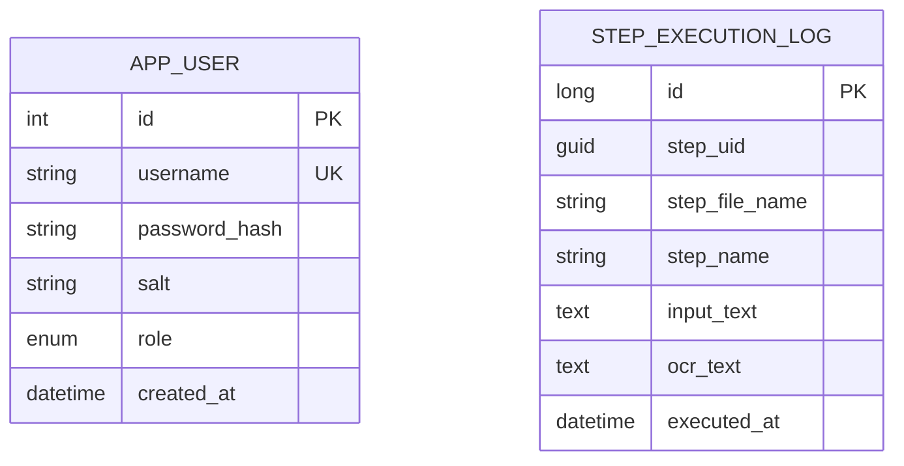

图表来源
- [User.cs:12-31](file://ShaoLu/Models/User.cs#L12-L31)
- [StepExecutionLog.cs:6-45](file://ShaoLu/Models/StepExecutionLog.cs#L6-L45)

### JSON 序列化示例（概念性）
- 应用设置（节选）
  - AppSettings.App.ThemeLight: true
  - AppSettings.Step.DefaultSimilarityThreshold: 0.85
  - AppSettings.Step.StartHotKey.Modifiers: Control|Alt
  - AppSettings.Step.StartHotKey.Key: F9

- 步骤基类（节选）
  - AutomationStepBase.Name: "输入文本"
  - AutomationStepBase.Type: TypeText
  - AutomationStepBase.WaitTime: 0.5
  - AutomationStepBase.EnableLog: false

- 条件规则行（节选）
  - StepCondition.Variable: Self_IsTrue
  - StepCondition.Operator: Equal
  - StepCondition.Value: "true"
  - StepCondition.Connector: And

- 执行日志（节选）
  - StepExecutionLog.StepUid: "guid"
  - StepExecutionLog.StepFileName: "steps"
  - StepExecutionLog.InputText: "Hello"
  - StepExecutionLog.ExecutedAt: "2024-01-01T12:00:00Z"

- 执行结果（节选）
  - StepExecutionResult.IsTrue: true
  - StepExecutionResult.ExecutionTimeMs: 120.5
  - StepExecutionResult.Similarity: 0.95
  - StepExecutionResult.OCRText: "识别文本"

[本节为概念性示例，不直接分析具体文件]

### 数据验证规则
- 必填字段
  - User.Username：非空，长度 ≤ 128
  - AutomationStepBase.Name：非空（基类构造函数中防御性检查）
- 数值范围
  - StepSettingsModel.DefaultSimilarityThreshold：建议 0.0–1.0
  - StepSettingsModel.DefaultWaitTime/DefaultTimeout：≥ 0
  - StepSettingsModel.DefaultClicks：≥ 1
- 枚举约束
  - StepType/StepErrorType/ConditionMode/ConditionVariable/ConditionOperator/LogicConnector/UserRole：仅允许预定义值

[本节为通用规则，不直接分析具体文件]

### 数据库映射说明
- 表 app_user
  - 主键：Id（自增）
  - 字段：Username、PasswordHash、Salt、Role、CreatedAt
  - 约束：Username 非空且长度限制

- 表 step_execution_log
  - 主键：Id（自增）
  - 字段：StepUid、StepFileName、StepName、InputText、OCRText、ExecutedAt
  - 长文本：InputText、OCRText

章节来源
- [User.cs:12-31](file://ShaoLu/Models/User.cs#L12-L31)
- [StepExecutionLog.cs:6-45](file://ShaoLu/Models/StepExecutionLog.cs#L6-L45)

### 数据迁移与版本兼容性
- 向后兼容
  - 新增字段应提供默认值，避免破坏旧数据读取。
  - 枚举新增值不应改变已有值的语义。
- 向前兼容
  - 删除字段需先标记废弃，再在后续版本移除。
  - 变更字段类型时需进行数据迁移脚本。
- 设置迁移
  - AppSettingsModel/StepSettingsModel 新增项需提供默认值，确保旧配置文件仍可加载。
- 日志迁移
  - StepExecutionLog 新增字段时应保持历史数据可读，必要时提供迁移工具。

[本节为通用指导，不直接分析具体文件]