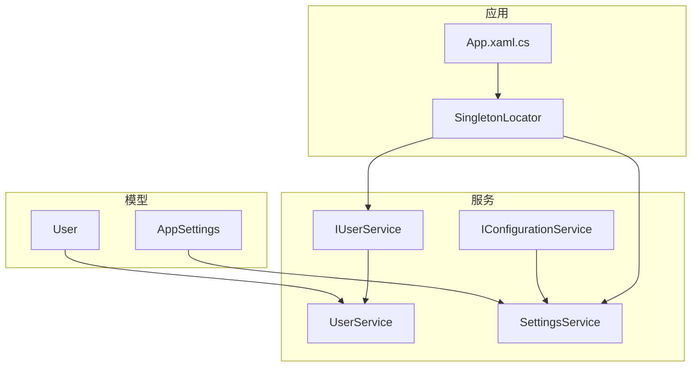
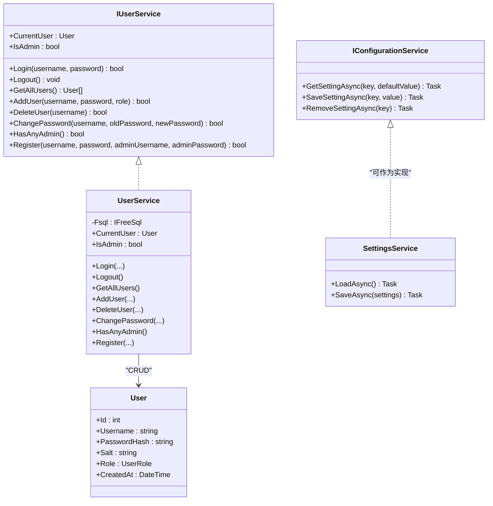
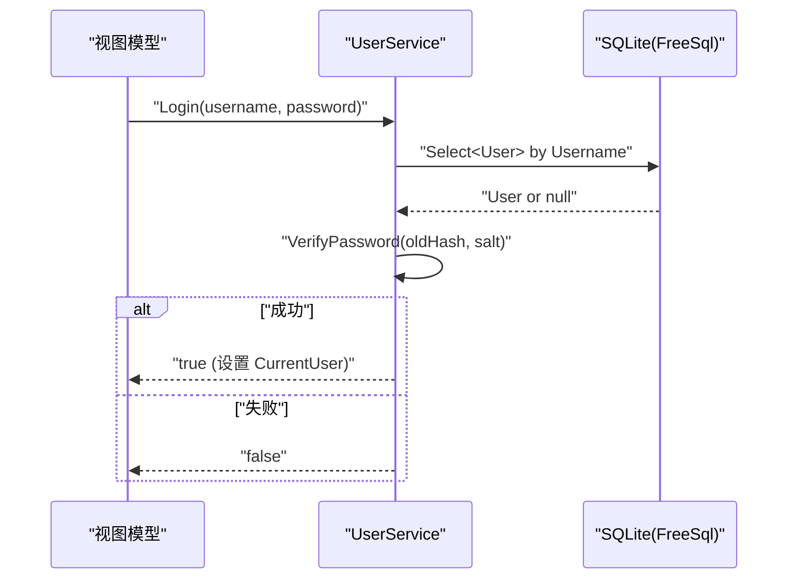
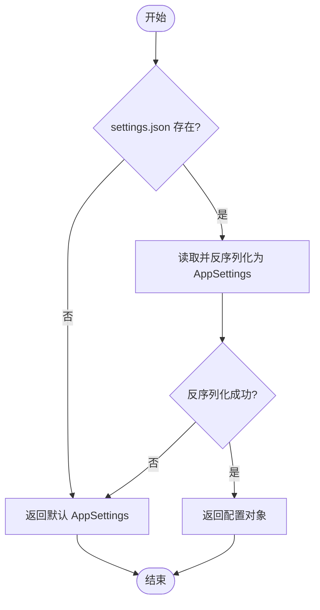
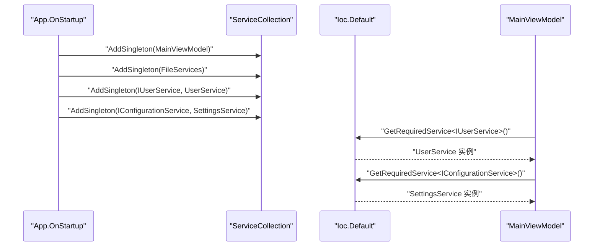
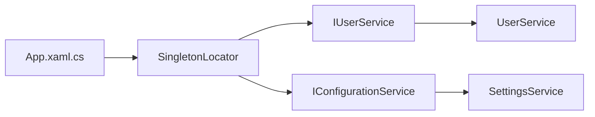

# 服务接口

<cite>
**本文引用的文件**   
- [IUserService.cs](file://ShaoLu/Services/IUserService.cs)
- [UserService.cs](file://ShaoLu/Services/UserService.cs)
- [User.cs](file://ShaoLu/Models/User.cs)
- [IConfigurationService.cs](file://ShaoLu/Services/IConfigurationService.cs)
- [SettingsService.cs](file://ShaoLu/Services/SettingsService.cs)
- [Settings.cs](file://ShaoLu/Models/Settings.cs)
- [App.xaml.cs](file://ShaoLu/App.xaml.cs)
- [SingletonLocator.cs](file://ShaoLu/Utils/SingletonLocator.cs)
</cite>

## 目录
1. [简介](#简介)
2. [项目结构](#项目结构)
3. [核心组件](#核心组件)
4. [架构总览](#架构总览)
5. [详细组件分析](#详细组件分析)
6. [依赖关系分析](#依赖关系分析)
7. [性能考虑](#性能考虑)
8. [故障排查指南](#故障排查指南)
9. [结论](#结论)
10. [附录](#附录)

## 简介
本文件为 ShaoLu 项目的“服务接口”API 文档，聚焦以下目标：
- 详细说明 IUserService 接口的用户管理功能（登录、注销、增删改查、权限验证、注册等）的方法签名、参数与返回值、异常处理及调用示例。
- 详细说明 IConfigurationService 接口的配置管理能力（读取、保存、删除、默认值处理），并给出使用方式与示例。
- 描述依赖注入容器中服务的注册与获取方式，解释服务间的依赖关系和调用模式。
- 提供面向不同技术背景的读者可理解的说明、图示与排错建议。

## 项目结构
本项目采用分层与服务化组织：
- Models：数据模型（如 User、AppSettings）。
- Services：业务服务层（如 IUserService、UserService、IConfigurationService、SettingsService）。
- Utils：工具与定位器（如 SingletonLocator 用于从 DI 容器获取单例）。
- App.xaml.cs：应用启动时进行语言初始化与依赖注入容器配置。

图表来源
- [User.cs:1-33](file://ShaoLu/Models/User.cs#L1-L33)
- [Settings.cs:1-76](file://ShaoLu/Models/Settings.cs#L1-L76)
- [IUserService.cs:1-20](file://ShaoLu/Services/IUserService.cs#L1-L20)
- [UserService.cs:1-239](file://ShaoLu/Services/UserService.cs#L1-L239)
- [IConfigurationService.cs:1-12](file://ShaoLu/Services/IConfigurationService.cs#L1-L12)
- [SettingsService.cs:1-38](file://ShaoLu/Services/SettingsService.cs#L1-L38)
- [App.xaml.cs:1-40](file://ShaoLu/App.xaml.cs#L1-L40)
- [SingletonLocator.cs:1-18](file://ShaoLu/Utils/SingletonLocator.cs#L1-L18)

章节来源
- [App.xaml.cs:1-40](file://ShaoLu/App.xaml.cs#L1-L40)
- [SingletonLocator.cs:1-18](file://ShaoLu/Utils/SingletonLocator.cs#L1-L18)

## 核心组件
- IUserService：用户认证与会话管理、用户生命周期操作、权限判断。
- UserService：IUserService 的具体实现，基于 FreeSql + SQLite 持久化用户数据，包含密码加盐哈希与安全校验。
- IConfigurationService：配置键值存取抽象接口（泛型 T 必须为 class）。
- SettingsService：当前项目中 AppSettings 的 JSON 读写实现（静态方法），可作为 IConfigurationService 的一种落地方案。
- App.xaml.cs：应用启动时初始化语言与依赖注入容器（注册 ViewModel 与 FileServices 等）。
- SingletonLocator：通过 CommunityToolkit.Mvvm 的 Ioc.Default 获取已注册的服务实例。

章节来源
- [IUserService.cs:1-20](file://ShaoLu/Services/IUserService.cs#L1-L20)
- [UserService.cs:1-239](file://ShaoLu/Services/UserService.cs#L1-L239)
- [IConfigurationService.cs:1-12](file://ShaoLu/Services/IConfigurationService.cs#L1-L12)
- [SettingsService.cs:1-38](file://ShaoLu/Services/SettingsService.cs#L1-L38)
- [App.xaml.cs:1-40](file://ShaoLu/App.xaml.cs#L1-L40)
- [SingletonLocator.cs:1-18](file://ShaoLu/Utils/SingletonLocator.cs#L1-L18)

## 架构总览
下图展示用户管理与配置管理的核心交互流程与依赖关系。

图表来源
- [IUserService.cs:1-20](file://ShaoLu/Services/IUserService.cs#L1-L20)
- [UserService.cs:1-239](file://ShaoLu/Services/UserService.cs#L1-L239)
- [User.cs:1-33](file://ShaoLu/Models/User.cs#L1-L33)
- [IConfigurationService.cs:1-12](file://ShaoLu/Services/IConfigurationService.cs#L1-L12)
- [SettingsService.cs:1-38](file://ShaoLu/Services/SettingsService.cs#L1-L38)

## 详细组件分析

### IUserService 接口与实现（UserService）
- 职责
  - 用户登录/注销与会话状态维护（CurrentUser、IsAdmin）。
  - 用户列表查询、新增、删除、修改密码。
  - 管理员存在性检查与注册审批逻辑。
- 关键方法与行为
  - Login(username, password)：校验用户名与密码，成功后设置 CurrentUser；失败返回 false。
  - Logout()：清空 CurrentUser。
  - GetAllUsers()：按创建时间排序返回所有用户。
  - AddUser(username, password, role)：生成盐与哈希后插入用户；重复用户名返回 false。
  - DeleteUser(username)：不允许删除最后一个管理员；若删除当前登录用户则自动注销。
  - ChangePassword(username, oldPassword, newPassword)：旧密码校验通过后更新为新密码与新盐。
  - HasAnyAdmin()：是否存在至少一个管理员。
  - Register(username, password, adminUsername=null, adminPassword=null)：若已有管理员，则需管理员审批；否则直接注册新用户（默认角色为管理员）。
- 安全与异常
  - 密码使用 PBKDF2(SHA256) 加盐哈希存储，比较采用常量时间比较避免时序攻击。
  - 输入为空或用户名重复等情况返回 false，不抛出异常。
  - 数据库访问由 FreeSql 封装，异常由框架处理并在上层捕获（如需统一错误码可在调用方处理）。
- 复杂度与性能
  - 登录/注册/改密均涉及一次或多次数据库查询与写入，整体 O(1) 次 IO。
  - 哈希计算固定迭代次数（10000），对安全性与性能的平衡合理。
- 调用示例（伪代码）
  - 登录：var ok = userService.Login("admin", "pwd"); if(ok){ var isAdmin = userService.IsAdmin; }
  - 注册：var ok = userService.Register("newuser","pwd","admin","adminPwd");
  - 删除：var ok = userService.DeleteUser("olduser");

图表来源
- [UserService.cs:76-93](file://ShaoLu/Services/UserService.cs#L76-L93)
- [UserService.cs:59-74](file://ShaoLu/Services/UserService.cs#L59-L74)

章节来源
- [IUserService.cs:1-20](file://ShaoLu/Services/IUserService.cs#L1-L20)
- [UserService.cs:1-239](file://ShaoLu/Services/UserService.cs#L1-L239)
- [User.cs:1-33](file://ShaoLu/Models/User.cs#L1-L33)

### IConfigurationService 接口与配置管理
- 接口定义
  - GetSettingAsync<T>(string key, T defaultValue = default) where T : class
  - SaveSettingAsync<T>(string key, T value) where T : class
  - RemoveSettingAsync(string key)
- 当前实现（SettingsService）
  - LoadAsync()：异步加载 settings.json，不存在则返回默认 AppSettings。
  - SaveAsync(AppSettings)：异步序列化到 settings.json。
- 默认值处理
  - 当配置文件缺失或反序列化为空时，返回默认对象（AppSettings 及其子对象均有默认值）。
- 使用建议
  - 可将 SettingsService 作为 IConfigurationService 的实现进行注册，以便在 DI 中统一获取。
  - 对于非 AppSettings 的通用键值配置，可扩展 SettingsService 或另行实现。
- 调用示例（伪代码）
  - 读取：var settings = await configurationService.GetSettingAsync<AppSettings>("app_settings", new AppSettings());
  - 保存：await configurationService.SaveSettingAsync("app_settings", settings);
  - 删除：await configurationService.RemoveSettingAsync("app_settings");

图表来源
- [SettingsService.cs:20-28](file://ShaoLu/Services/SettingsService.cs#L20-L28)
- [Settings.cs:1-76](file://ShaoLu/Models/Settings.cs#L1-L76)

章节来源
- [IConfigurationService.cs:1-12](file://ShaoLu/Services/IConfigurationService.cs#L1-L12)
- [SettingsService.cs:1-38](file://ShaoLu/Services/SettingsService.cs#L1-L38)
- [Settings.cs:1-76](file://ShaoLu/Models/Settings.cs#L1-L76)

### 依赖注入容器中的服务注册与使用
- 容器选择
  - 使用 Microsoft.Extensions.DependencyInjection 与 CommunityToolkit.Mvvm.DependencyInjection。
- 注册位置
  - App.xaml.cs 的 OnStartup 中构建 ServiceCollection，并注册 ViewModel 与 FileServices 等。
- 获取方式
  - 通过 SingletonLocator 使用 Ioc.Default.GetRequiredService<T>() 获取已注册服务。
- 扩展建议
  - 将 IUserService 与 IConfigurationService 的实现类在此处注册为单例，便于全局访问。
  - 示例：services.AddSingleton<IUserService, UserService>(); services.AddSingleton<IConfigurationService, SettingsService>();

图表来源
- [App.xaml.cs:32-40](file://ShaoLu/App.xaml.cs#L32-L40)
- [SingletonLocator.cs:10-14](file://ShaoLu/Utils/SingletonLocator.cs#L10-L14)

章节来源
- [App.xaml.cs:1-40](file://ShaoLu/App.xaml.cs#L1-L40)
- [SingletonLocator.cs:1-18](file://ShaoLu/Utils/SingletonLocator.cs#L1-L18)

## 依赖关系分析
- IUserService 与 UserService
  - IUserService 定义契约，UserService 实现具体业务逻辑与数据持久化。
  - UserService 依赖 FreeSql 与 SQLite，内部持有静态 Lazy 初始化的数据库连接。
- IConfigurationService 与 SettingsService
  - IConfigurationService 为配置存取抽象；SettingsService 提供 AppSettings 的 JSON 读写。
  - 可通过 DI 将 SettingsService 作为 IConfigurationService 的实现注入。
- 应用启动与 DI
  - App.xaml.cs 负责初始化语言与注册服务；SingletonLocator 提供便捷获取入口。

图表来源
- [IUserService.cs:1-20](file://ShaoLu/Services/IUserService.cs#L1-L20)
- [UserService.cs:1-239](file://ShaoLu/Services/UserService.cs#L1-L239)
- [IConfigurationService.cs:1-12](file://ShaoLu/Services/IConfigurationService.cs#L1-L12)
- [SettingsService.cs:1-38](file://ShaoLu/Services/SettingsService.cs#L1-L38)
- [App.xaml.cs:1-40](file://ShaoLu/App.xaml.cs#L1-L40)
- [SingletonLocator.cs:1-18](file://ShaoLu/Utils/SingletonLocator.cs#L1-L18)

章节来源
- [IUserService.cs:1-20](file://ShaoLu/Services/IUserService.cs#L1-L20)
- [UserService.cs:1-239](file://ShaoLu/Services/UserService.cs#L1-L239)
- [IConfigurationService.cs:1-12](file://ShaoLu/Services/IConfigurationService.cs#L1-L12)
- [SettingsService.cs:1-38](file://ShaoLu/Services/SettingsService.cs#L1-L38)
- [App.xaml.cs:1-40](file://ShaoLu/App.xaml.cs#L1-L40)
- [SingletonLocator.cs:1-18](file://ShaoLu/Utils/SingletonLocator.cs#L1-L18)

## 性能考虑
- 数据库访问
  - FreeSql + SQLite 适合桌面端轻量级场景；注意批量操作与分页查询以减少 IO。
- 密码哈希
  - PBKDF2 迭代次数 10000 兼顾安全与性能；在高并发登录场景下可评估是否调整。
- 配置读写
  - settings.json 小文件读写开销低；大配置建议分片或缓存。
- 内存与单例
  - UserService 与 SettingsService 以单例或静态方式提供，避免重复初始化资源。

[本节为通用指导，无需特定文件引用]

## 故障排查指南
- 登录失败
  - 检查用户名是否存在、密码是否正确；确认数据库路径与表结构已初始化。
  - 参考：[UserService.cs:76-93](file://ShaoLu/Services/UserService.cs#L76-L93)
- 注册失败
  - 若已有管理员，需提供有效的管理员凭据；用户名不可重复。
  - 参考：[UserService.cs:194-236](file://ShaoLu/Services/UserService.cs#L194-L236)
- 删除用户失败
  - 尝试删除最后一个管理员会被拒绝；删除当前登录用户会触发自动注销。
  - 参考：[UserService.cs:131-159](file://ShaoLu/Services/UserService.cs#L131-L159)
- 配置读取为空
  - 检查 settings.json 是否存在且格式正确；反序列化失败时返回默认对象。
  - 参考：[SettingsService.cs:20-28](file://ShaoLu/Services/SettingsService.cs#L20-L28)
- DI 获取服务失败
  - 确保在 App.xaml.cs 中完成服务注册；通过 SingletonLocator 获取前确认已初始化。
  - 参考：[App.xaml.cs:32-40](file://ShaoLu/App.xaml.cs#L32-L40)、[SingletonLocator.cs:10-14](file://ShaoLu/Utils/SingletonLocator.cs#L10-L14)

章节来源
- [UserService.cs:76-93](file://ShaoLu/Services/UserService.cs#L76-L93)
- [UserService.cs:131-159](file://ShaoLu/Services/UserService.cs#L131-L159)
- [UserService.cs:194-236](file://ShaoLu/Services/UserService.cs#L194-L236)
- [SettingsService.cs:20-28](file://ShaoLu/Services/SettingsService.cs#L20-L28)
- [App.xaml.cs:32-40](file://ShaoLu/App.xaml.cs#L32-L40)
- [SingletonLocator.cs:10-14](file://ShaoLu/Utils/SingletonLocator.cs#L10-L14)

## 结论
- IUserService 提供了完整的用户认证与管理能力，结合 FreeSql+SQLite 实现了安全的密码存储与基本的权限控制。
- IConfigurationService 定义了统一的配置存取接口，SettingsService 可作为 AppSettings 的默认实现；推荐通过 DI 注入以获得一致的使用体验。
- 依赖注入在 App.xaml.cs 中集中注册，SingletonLocator 提供便捷的获取方式；建议在启动阶段完成所有服务注册。
- 建议在后续版本中将 SettingsService 完整实现 IConfigurationService 接口，并纳入 DI 容器统一管理。

[本节为总结性内容，无需特定文件引用]

## 附录
- 方法签名速览（来自接口定义）
  - IUserService
    - CurrentUser: User
    - IsAdmin: bool
    - Login(username: string, password: string): bool
    - Logout(): void
    - GetAllUsers(): List<User>
    - AddUser(username: string, password: string, role: UserRole): bool
    - DeleteUser(username: string): bool
    - ChangePassword(username: string, oldPassword: string, newPassword: string): bool
    - HasAnyAdmin(): bool
    - Register(username: string, password: string, adminUsername: string = null, adminPassword: string = null): bool
  - IConfigurationService
    - GetSettingAsync<T>(key: string, defaultValue: T = default): Task<T>
    - SaveSettingAsync<T>(key: string, value: T): Task
    - RemoveSettingAsync(key: string): Task

章节来源
- [IUserService.cs:1-20](file://ShaoLu/Services/IUserService.cs#L1-L20)
- [IConfigurationService.cs:1-12](file://ShaoLu/Services/IConfigurationService.cs#L1-L12)