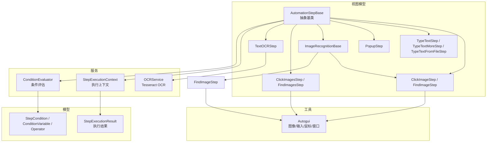
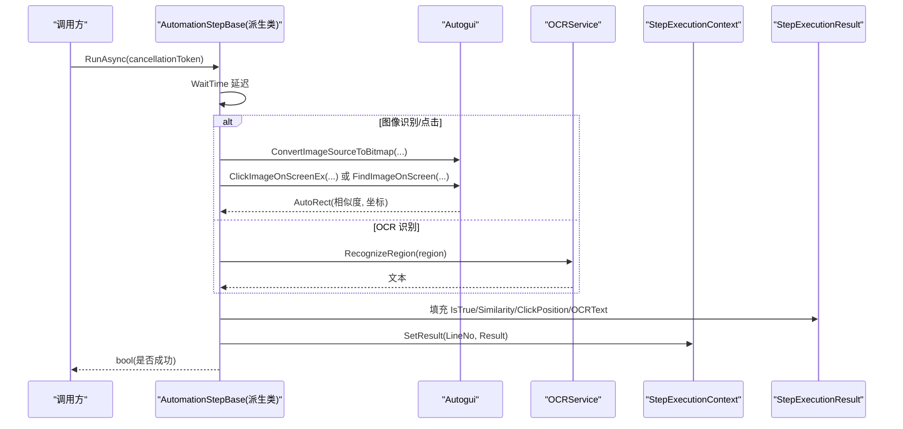
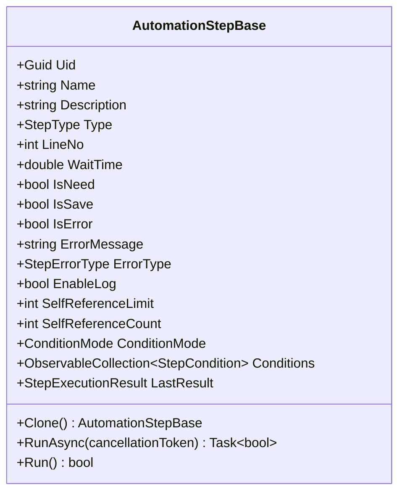
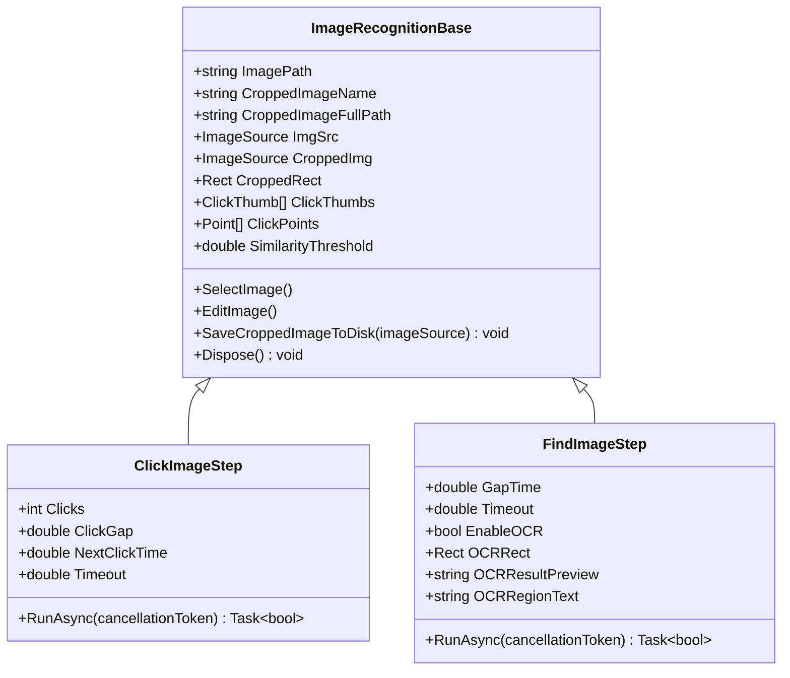
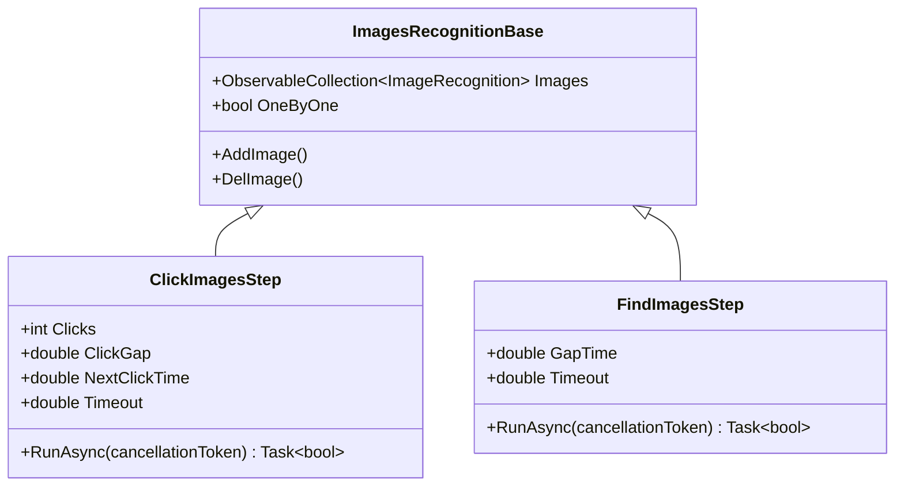
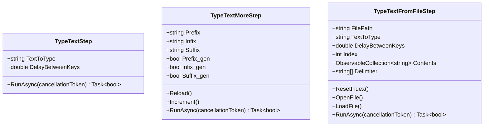
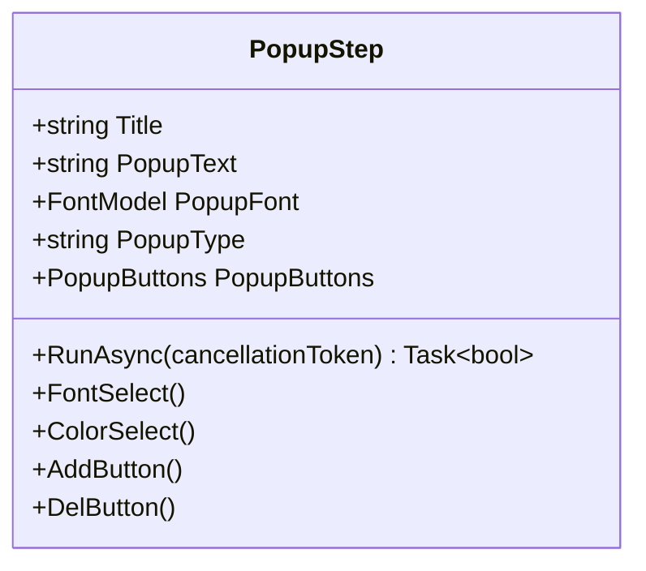
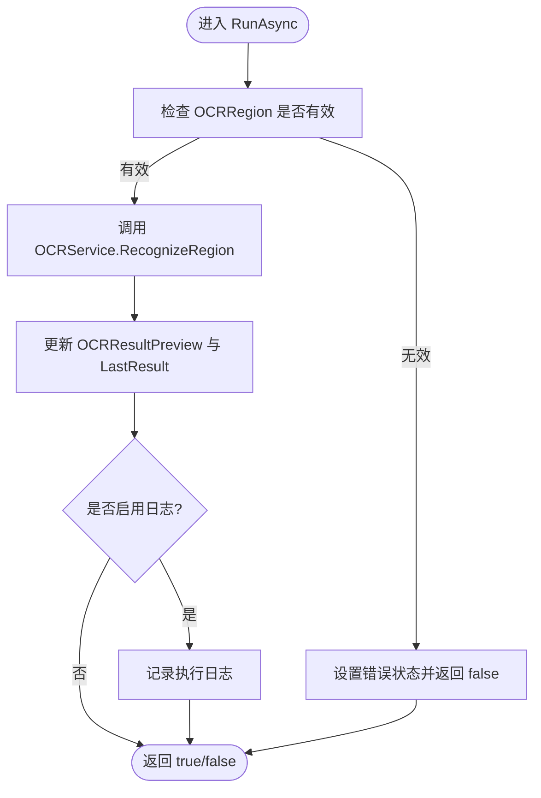
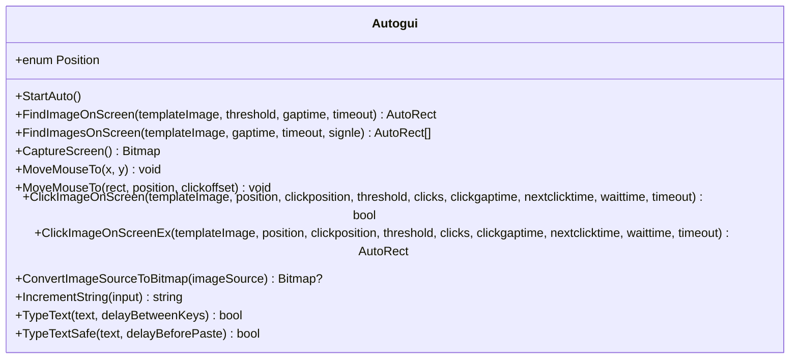
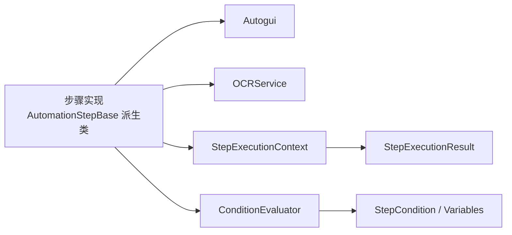

# 核心类

<cite>
**本文引用的文件**   
- [AutomationStep.cs](file://ShaoLu/Viewmodels/AutomationStep.cs)
- [ImageRecognition.cs](file://ShaoLu/Viewmodels/ImageRecognition.cs)
- [ImagesRecognition.cs](file://ShaoLu/Viewmodels/ImagesRecognition.cs)
- [TextOCRStep.cs](file://ShaoLu/Viewmodels/TextOCRStep.cs)
- [Autogui.cs](file://ShaoLu/Utils/Autogui.cs)
- [OCRService.cs](file://ShaoLu/Services/OCRService.cs)
- [StepExecutionContext.cs](file://ShaoLu/Services/StepExecutionContext.cs)
- [StepExecutionResult.cs](file://ShaoLu/Models/StepExecutionResult.cs)
- [ConditionEvaluator.cs](file://ShaoLu/Services/ConditionEvaluator.cs)
- [StepCondition.cs](file://ShaoLu/Models/StepCondition.cs)
</cite>

## 目录
1. [简介](#简介)
2. [项目结构](#项目结构)
3. [核心组件](#核心组件)
4. [架构总览](#架构总览)
5. [详细组件分析](#详细组件分析)
6. [依赖关系分析](#依赖关系分析)
7. [性能考虑](#性能考虑)
8. [故障排查指南](#故障排查指南)
9. [结论](#结论)
10. [附录：API 参考与使用示例](#附录api-参考与使用示例)

## 简介
本文件为 ShaoLu 项目的“核心类”API 文档，聚焦以下目标：
- 详细说明 AutomationStep 基类的继承机制与扩展点，包括 ExecuteAsync（实际实现为 RunAsync）的重写方式、上下文参数使用、异常处理机制。
- 全面介绍 Autogui 工具类的系统级操作能力：图像识别、文本输入、鼠标键盘模拟、窗口交互等。
- 梳理各类步骤的实现与配置选项，如 ImageRecognition、ImagesRecognition、TextOCRStep 等。
- 提供类图、方法签名说明、参数说明与实际使用示例路径，帮助快速上手与二次开发。

## 项目结构
ShaoLu 采用分层组织：
- Viewmodels：自动化步骤模型与执行逻辑（AutomationStepBase 及其派生类）。
- Utils：系统级工具（Autogui 封装屏幕截图、图像匹配、输入输出等）。
- Services：业务服务（OCRService、条件评估、执行上下文等）。
- Models：数据模型（执行结果、条件变量、枚举等）。

**图表来源** 
- [AutomationStep.cs:25-205](file://ShaoLu/Viewmodels/AutomationStep.cs#L25-L205)
- [ImageRecognition.cs:21-325](file://ShaoLu/Viewmodels/ImageRecognition.cs#L21-L325)
- [ImagesRecognition.cs:47-228](file://ShaoLu/Viewmodels/ImagesRecognition.cs#L47-L228)
- [TextOCRStep.cs:17-181](file://ShaoLu/Viewmodels/TextOCRStep.cs#L17-L181)
- [Autogui.cs:26-584](file://ShaoLu/Utils/Autogui.cs#L26-L584)
- [OCRService.cs:12-133](file://ShaoLu/Services/OCRService.cs#L12-L133)
- [StepExecutionContext.cs:9-88](file://ShaoLu/Services/StepExecutionContext.cs#L9-L88)
- [StepExecutionResult.cs:8-46](file://ShaoLu/Models/StepExecutionResult.cs#L8-L46)
- [ConditionEvaluator.cs:34-72](file://ShaoLu/Services/ConditionEvaluator.cs#L34-L72)
- [StepCondition.cs:8-64](file://ShaoLu/Models/StepCondition.cs#L8-L64)

**章节来源**
- [AutomationStep.cs:25-205](file://ShaoLu/Viewmodels/AutomationStep.cs#L25-L205)
- [ImageRecognition.cs:21-325](file://ShaoLu/Viewmodels/ImageRecognition.cs#L21-L325)
- [ImagesRecognition.cs:47-228](file://ShaoLu/Viewmodels/ImagesRecognition.cs#L47-L228)
- [TextOCRStep.cs:17-181](file://ShaoLu/Viewmodels/TextOCRStep.cs#L17-L181)
- [Autogui.cs:26-584](file://ShaoLu/Utils/Autogui.cs#L26-L584)
- [OCRService.cs:12-133](file://ShaoLu/Services/OCRService.cs#L12-L133)
- [StepExecutionContext.cs:9-88](file://ShaoLu/Services/StepExecutionContext.cs#L9-L88)
- [StepExecutionResult.cs:8-46](file://ShaoLu/Models/StepExecutionResult.cs#L8-L46)
- [ConditionEvaluator.cs:34-72](file://ShaoLu/Services/ConditionEvaluator.cs#L34-L72)
- [StepCondition.cs:8-64](file://ShaoLu/Models/StepCondition.cs#L8-L64)

## 核心组件
- AutomationStepBase：所有自动化步骤的抽象基类，定义通用属性（名称、描述、类型、等待时间、跳转行号、错误状态、日志开关、自引用限制等），以及必须实现的 Clone() 和 RunAsync(CancellationToken)。
- ImageRecognitionBase：图像相关步骤的基类，封装图片加载、裁剪保存、相似度阈值、点击点集合等。
- Autogui：系统级工具类，封装屏幕截图、模板匹配、鼠标移动/点击、文本输入（逐键或剪贴板粘贴）、字符串递增等。
- OCRService：基于 Tesseract 的 OCR 服务，支持对指定区域进行文字识别。
- StepExecutionContext：维护步骤执行结果的上下文，供条件判断引用其他步骤的结果。
- StepExecutionResult：记录单次步骤执行的详细信息（是否成功、耗时、相似度、点击位置、OCR 文本、错误信息等）。

**章节来源**
- [AutomationStep.cs:25-205](file://ShaoLu/Viewmodels/AutomationStep.cs#L25-L205)
- [ImageRecognition.cs:21-325](file://ShaoLu/Viewmodels/ImageRecognition.cs#L21-L325)
- [Autogui.cs:26-584](file://ShaoLu/Utils/Autogui.cs#L26-L584)
- [OCRService.cs:12-133](file://ShaoLu/Services/OCRService.cs#L12-L133)
- [StepExecutionContext.cs:9-88](file://ShaoLu/Services/StepExecutionContext.cs#L9-L88)
- [StepExecutionResult.cs:8-46](file://ShaoLu/Models/StepExecutionResult.cs#L8-L46)

## 架构总览
下图展示了步骤执行的核心流程：步骤通过 RunAsync 调用 Autogui 完成系统级操作，必要时结合 OCRService 进行文字识别；执行结果写入 StepExecutionResult，并通过 StepExecutionContext 暴露给条件评估器。

**图表来源** 
- [AutomationStep.cs:253-278](file://ShaoLu/Viewmodels/AutomationStep.cs#L253-L278)
- [ImageRecognition.cs:382-416](file://ShaoLu/Viewmodels/ImageRecognition.cs#L382-L416)
- [ImageRecognition.cs:515-565](file://ShaoLu/Viewmodels/ImageRecognition.cs#L515-L565)
- [ImagesRecognition.cs:120-152](file://ShaoLu/Viewmodels/ImagesRecognition.cs#L120-L152)
- [ImagesRecognition.cs:197-224](file://ShaoLu/Viewmodels/ImagesRecognition.cs#L197-L224)
- [TextOCRStep.cs:102-142](file://ShaoLu/Viewmodels/TextOCRStep.cs#L102-L142)
- [Autogui.cs:256-306](file://ShaoLu/Utils/Autogui.cs#L256-L306)
- [Autogui.cs:59-122](file://ShaoLu/Utils/Autogui.cs#L59-L122)
- [OCRService.cs:82-118](file://ShaoLu/Services/OCRService.cs#L82-L118)
- [StepExecutionContext.cs:16-27](file://ShaoLu/Services/StepExecutionContext.cs#L16-L27)

## 详细组件分析

### AutomationStepBase 基类与扩展点
- 关键职责
  - 统一步骤元数据：Uid、Name、Description、Type、LineNo、WaitTime、ErrorType、EnableLog、SelfReferenceLimit/Count 等。
  - 条件判断：ConditionMode、Conditions 列表，配合 ConditionEvaluator 与 StepExecutionContext 进行复杂条件控制。
  - 执行接口：Clone() 用于复制步骤；RunAsync(CancellationToken) 由派生类实现具体行为。
- 扩展点
  - 派生类需实现 Clone() 与 RunAsync(CancellationToken)，并在 RunAsync 中设置 IsTrue、IsError、ErrorType、LastResult 等状态。
  - 可通过 Conditions 配置自定义条件规则，支持 AND/OR 组合与多变量比较。
- 典型用法
  - 在 RunAsync 中先执行 WaitTime 延迟，再调用 Autogui 或 OCRService 完成动作，最后更新状态并可选记录日志。

**图表来源** 
- [AutomationStep.cs:25-205](file://ShaoLu/Viewmodels/AutomationStep.cs#L25-L205)

**章节来源**
- [AutomationStep.cs:25-205](file://ShaoLu/Viewmodels/AutomationStep.cs#L25-L205)
- [StepCondition.cs:8-64](file://ShaoLu/Models/StepCondition.cs#L8-L64)
- [ConditionEvaluator.cs:34-72](file://ShaoLu/Services/ConditionEvaluator.cs#L34-L72)
- [StepExecutionContext.cs:9-88](file://ShaoLu/Services/StepExecutionContext.cs#L9-L88)

### 图像识别基类 ImageRecognitionBase
- 关键职责
  - 管理原图与裁剪图路径、运行时完整路径、相似度阈值、点击点集合。
  - 提供图片选择、编辑、裁剪保存、自动持久化到工作目录 images/{Uid}.png。
  - 暴露 ImgSrc/CroppedImg 属性，便于 UI 绑定与后续转换。
- 重要方法
  - SaveCroppedImageToDisk(ImageSource)：将裁剪后的图片保存到工作目录。
  - LoadImage(params string[])：安全加载图片并冻结 BitmapSource 提升性能。
- 派生类
  - ClickImageStep：查找并点击图像，支持多次点击、间隔、超时等。
  - FindImageStep：查找图像并可启用 OCR 识别指定区域。

**图表来源** 
- [ImageRecognition.cs:21-325](file://ShaoLu/Viewmodels/ImageRecognition.cs#L21-L325)
- [ImageRecognition.cs:329-416](file://ShaoLu/Viewmodels/ImageRecognition.cs#L329-L416)
- [ImageRecognition.cs:420-565](file://ShaoLu/Viewmodels/ImageRecognition.cs#L420-L565)

**章节来源**
- [ImageRecognition.cs:21-325](file://ShaoLu/Viewmodels/ImageRecognition.cs#L21-L325)
- [ImageRecognition.cs:329-416](file://ShaoLu/Viewmodels/ImageRecognition.cs#L329-L416)
- [ImageRecognition.cs:420-565](file://ShaoLu/Viewmodels/ImageRecognition.cs#L420-L565)

### 多图像识别 ImagesRecognition 系列
- 关键职责
  - 管理一组图像识别项（ImageRecognition），支持逐个或批量处理。
  - ClickImagesStep：依次对每个图像执行点击，返回最后一次匹配结果。
  - FindImagesStep：批量查找多个图像，返回首个匹配结果。
- 重要属性
  - OneByOne：是否逐个处理。
  - Images：图像识别项集合。
  - Clicks/ClickGap/NextClickTime/Timeout：点击行为控制。

**图表来源** 
- [ImagesRecognition.cs:47-228](file://ShaoLu/Viewmodels/ImagesRecognition.cs#L47-L228)

**章节来源**
- [ImagesRecognition.cs:47-228](file://ShaoLu/Viewmodels/ImagesRecognition.cs#L47-L228)

### 文本输入步骤
- TypeTextStep：直接输入文本，支持按键间隔控制。
- TypeTextMoreStep：支持前缀/中缀/后缀拼接与自动递增生成。
- TypeTextFromFileStep：从文件或 Excel 读取内容，按索引顺序输入，支持多种分隔符。

**图表来源** 
- [AutomationStep.cs:209-278](file://ShaoLu/Viewmodels/AutomationStep.cs#L209-L278)
- [AutomationStep.cs:281-435](file://ShaoLu/Viewmodels/AutomationStep.cs#L281-L435)
- [AutomationStep.cs:437-602](file://ShaoLu/Viewmodels/AutomationStep.cs#L437-L602)

**章节来源**
- [AutomationStep.cs:209-278](file://ShaoLu/Viewmodels/AutomationStep.cs#L209-L278)
- [AutomationStep.cs:281-435](file://ShaoLu/Viewmodels/AutomationStep.cs#L281-L435)
- [AutomationStep.cs:437-602](file://ShaoLu/Viewmodels/AutomationStep.cs#L437-L602)

### 弹出框步骤 PopupStep
- 功能：显示异步弹窗，支持标题、字体、颜色、按钮类型与图标类型配置。
- 执行：根据用户选择或取消操作设置 IsTrue，支持 CancellationToken 取消。

**图表来源** 
- [AutomationStep.cs:606-752](file://ShaoLu/Viewmodels/AutomationStep.cs#L606-L752)

**章节来源**
- [AutomationStep.cs:606-752](file://ShaoLu/Viewmodels/AutomationStep.cs#L606-L752)

### 文本 OCR 步骤 TextOCRStep
- 功能：对屏幕指定区域执行 OCR 识别，支持区域选择与测试预览。
- 执行：校验区域有效性，调用 OCRService.RecognizeRegion，记录结果与日志。

**图表来源** 
- [TextOCRStep.cs:102-142](file://ShaoLu/Viewmodels/TextOCRStep.cs#L102-L142)
- [OCRService.cs:82-118](file://ShaoLu/Services/OCRService.cs#L82-L118)

**章节来源**
- [TextOCRStep.cs:17-181](file://ShaoLu/Viewmodels/TextOCRStep.cs#L17-L181)
- [OCRService.cs:12-133](file://ShaoLu/Services/OCRService.cs#L12-L133)

### Autogui 工具类 API 概览
- 图像识别
  - FindImageOnScreen(templateImage, threshold, gaptime, timeout)：在屏幕上查找模板图像，返回 AutoRect（包含中心点、左上角、相似度）。
  - FindImagesOnScreen(list, gaptime, timeout, signle)：批量查找多个模板图像。
  - ClickImageOnScreenEx(templateImage, position, clickposition, threshold, clicks, clickgaptime, nextclicktime, waittime, timeout)：查找并点击图像，支持多点点击与间隔。
  - CaptureScreen()：截取全屏。
  - ConvertImageSourceToBitmap(imageSource)：WPF ImageSource 转 Bitmap。
- 鼠标与键盘
  - MoveMouseTo(x, y)：移动到指定坐标。
  - MoveMouseTo(rect, position, clickoffset)：根据锚点与偏移移动。
  - TypeText(text, delayBetweenKeys)：逐键输入文本。
  - TypeTextSafe(text, delayBeforePaste)：通过剪贴板粘贴文本，线程安全。
- 字符串处理
  - IncrementString(input)：对末尾数字或字母后缀进行递增（含固定位数回绕）。

**图表来源** 
- [Autogui.cs:26-584](file://ShaoLu/Utils/Autogui.cs#L26-L584)

**章节来源**
- [Autogui.cs:26-584](file://ShaoLu/Utils/Autogui.cs#L26-L584)

## 依赖关系分析
- 步骤层依赖 Autogui 完成系统级操作，依赖 OCRService 进行文字识别。
- 条件评估依赖 StepExecutionContext 获取历史步骤结果，依赖 StepCondition 定义变量与运算符。
- 执行结果 StepExecutionResult 贯穿步骤执行与条件评估，形成闭环。

**图表来源** 
- [AutomationStep.cs:25-205](file://ShaoLu/Viewmodels/AutomationStep.cs#L25-L205)
- [Autogui.cs:26-584](file://ShaoLu/Utils/Autogui.cs#L26-L584)
- [OCRService.cs:12-133](file://ShaoLu/Services/OCRService.cs#L12-L133)
- [StepExecutionContext.cs:9-88](file://ShaoLu/Services/StepExecutionContext.cs#L9-L88)
- [StepExecutionResult.cs:8-46](file://ShaoLu/Models/StepExecutionResult.cs#L8-L46)
- [ConditionEvaluator.cs:34-72](file://ShaoLu/Services/ConditionEvaluator.cs#L34-L72)
- [StepCondition.cs:8-64](file://ShaoLu/Models/StepCondition.cs#L8-L64)

**章节来源**
- [AutomationStep.cs:25-205](file://ShaoLu/Viewmodels/AutomationStep.cs#L25-L205)
- [Autogui.cs:26-584](file://ShaoLu/Utils/Autogui.cs#L26-L584)
- [OCRService.cs:12-133](file://ShaoLu/Services/OCRService.cs#L12-L133)
- [StepExecutionContext.cs:9-88](file://ShaoLu/Services/StepExecutionContext.cs#L9-L88)
- [StepExecutionResult.cs:8-46](file://ShaoLu/Models/StepExecutionResult.cs#L8-L46)
- [ConditionEvaluator.cs:34-72](file://ShaoLu/Services/ConditionEvaluator.cs#L34-L72)
- [StepCondition.cs:8-64](file://ShaoLu/Models/StepCondition.cs#L8-L64)

## 性能考虑
- 图像匹配
  - 模板匹配使用灰度图与标准化相关系数匹配，避免重复转换模板 Mat。
  - 合理设置 threshold、gaptime、timeout 以平衡精度与速度。
- 输入模拟
  - TypeTextSafe 通过剪贴板粘贴减少逐键输入开销，适合长文本。
  - 按键间隔 DelayBetweenKeys 影响稳定性与速度，建议根据目标应用调整。
- OCR
  - OCRService 懒加载引擎，首次初始化较慢；建议复用实例。
  - DPI 缩放因子计算确保跨显示器一致性。
- 资源管理
  - ImageRecognitionBase 使用 BitmapSource.Freeze 提升跨线程访问性能。
  - 注意 Dispose 与 GC 回收，避免内存泄漏。

[本节为通用指导，不直接分析具体文件]

## 故障排查指南
- 常见问题
  - 未找到图像：检查模板图像路径与相似度阈值；确认屏幕内容与模板一致。
  - 文本输入失败：优先使用 TypeTextSafe；确保目标控件已聚焦；检查剪贴板权限。
  - OCR 结果为空：确认 OCRRegion 有效且 DPI 缩放正确；检查 tessdata 语言包路径。
  - 条件判断不生效：检查 StepExecutionContext 是否正确设置历史结果；验证变量与运算符。
- 异常处理
  - 步骤内部捕获异常并设置 IsError/ErrorType；上层可捕获 OperationCanceledException 表示用户取消。
  - 文件不存在、索引越界、超时等异常会映射到特定 ErrorType。

**章节来源**
- [AutomationStep.cs:253-278](file://ShaoLu/Viewmodels/AutomationStep.cs#L253-L278)
- [ImagesRecognition.cs:120-152](file://ShaoLu/Viewmodels/ImagesRecognition.cs#L120-L152)
- [TextOCRStep.cs:102-142](file://ShaoLu/Viewmodels/TextOCRStep.cs#L102-L142)
- [OCRService.cs:82-118](file://ShaoLu/Services/OCRService.cs#L82-L118)
- [StepExecutionContext.cs:16-27](file://ShaoLu/Services/StepExecutionContext.cs#L16-L27)

## 结论
ShaoLu 的核心类围绕 AutomationStepBase 构建，通过统一的 RunAsync 接口与丰富的派生类实现，提供了强大的自动化能力。Autogui 作为底层工具，屏蔽了系统差异，使图像识别、输入模拟等操作稳定可靠。配合 OCRService 与条件评估体系，可实现复杂的业务流程编排。建议在扩展新步骤时遵循基类约定，充分利用上下文与结果模型，保证可测试性与可维护性。

[本节为总结，不直接分析具体文件]

## 附录：API 参考与使用示例

### 方法签名与参数说明（摘要）
- AutomationStepBase
  - Clone(): 克隆步骤实例。
  - RunAsync(CancellationToken): 异步执行步骤逻辑。
- ImageRecognitionBase
  - SelectImage(), EditImage(): 选择与编辑图像。
  - SaveCroppedImageToDisk(ImageSource): 保存裁剪图。
- ClickImageStep
  - RunAsync(CancellationToken): 查找并点击图像。
  - 属性：Clicks, ClickGap, NextClickTime, Timeout。
- FindImageStep
  - RunAsync(CancellationToken): 查找图像，可选 OCR。
  - 属性：GapTime, Timeout, EnableOCR, OCRRect, OCRResultPreview。
- TypeTextStep / TypeTextMoreStep / TypeTextFromFileStep
  - RunAsync(CancellationToken): 输入文本（支持递增与文件读取）。
  - 属性：TextToType, DelayBetweenKeys, Prefix/Infix/Suffix, FilePath, Contents, Index, Delimiter。
- PopupStep
  - RunAsync(CancellationToken): 显示弹窗并等待用户操作。
  - 属性：Title, PopupText, PopupFont, PopupType, PopupButtons。
- Autogui
  - FindImageOnScreen(Bitmap, double, double, double): 模板匹配。
  - ClickImageOnScreenEx(Bitmap, Position, List<Point>, double, int, double, double, double, double): 查找并点击。
  - TypeText(string, int), TypeTextSafe(string, int): 文本输入。
  - IncrementString(string): 字符串递增。
- OCRService
  - RecognizeRegion(Rect): 对屏幕区域进行 OCR。
- StepExecutionContext
  - SetResult(int, StepExecutionResult), GetResult(int), Clear(), ResolveVariable(...).

**章节来源**
- [AutomationStep.cs:25-205](file://ShaoLu/Viewmodels/AutomationStep.cs#L25-L205)
- [ImageRecognition.cs:21-325](file://ShaoLu/Viewmodels/ImageRecognition.cs#L21-L325)
- [ImagesRecognition.cs:47-228](file://ShaoLu/Viewmodels/ImagesRecognition.cs#L47-L228)
- [TextOCRStep.cs:17-181](file://ShaoLu/Viewmodels/TextOCRStep.cs#L17-L181)
- [Autogui.cs:26-584](file://ShaoLu/Utils/Autogui.cs#L26-L584)
- [OCRService.cs:12-133](file://ShaoLu/Services/OCRService.cs#L12-L133)
- [StepExecutionContext.cs:9-88](file://ShaoLu/Services/StepExecutionContext.cs#L9-L88)

### 使用示例（路径指引）
- 图像点击示例：参见 ClickImageStep.RunAsync 调用 Autogui.ClickImageOnScreenEx 的流程。
  - [ImageRecognition.cs:382-416](file://ShaoLu/Viewmodels/ImageRecognition.cs#L382-L416)
- 图像查找与 OCR 示例：参见 FindImageStep.RunAsync 调用 Autogui.FindImageOnScreen 与 OCRService.RecognizeRegion。
  - [ImageRecognition.cs:515-565](file://ShaoLu/Viewmodels/ImageRecognition.cs#L515-L565)
- 文本输入示例：参见 TypeTextStep.RunAsync 调用 Autogui.TypeTextSafe 或 TypeText。
  - [AutomationStep.cs:253-278](file://ShaoLu/Viewmodels/AutomationStep.cs#L253-L278)
- 多图像点击示例：参见 ClickImagesStep.RunAsync 循环调用 Autogui.ClickImageOnScreenEx。
  - [ImagesRecognition.cs:120-152](file://ShaoLu/Viewmodels/ImagesRecognition.cs#L120-L152)
- 批量图像查找示例：参见 FindImagesStep.RunAsync 调用 Autogui.FindImagesOnScreen。
  - [ImagesRecognition.cs:197-224](file://ShaoLu/Viewmodels/ImagesRecognition.cs#L197-L224)
- 文本 OCR 示例：参见 TextOCRStep.RunAsync 调用 OCRService.RecognizeRegion。
  - [TextOCRStep.cs:102-142](file://ShaoLu/Viewmodels/TextOCRStep.cs#L102-L142)

**章节来源**
- [ImageRecognition.cs:382-416](file://ShaoLu/Viewmodels/ImageRecognition.cs#L382-L416)
- [ImageRecognition.cs:515-565](file://ShaoLu/Viewmodels/ImageRecognition.cs#L515-L565)
- [AutomationStep.cs:253-278](file://ShaoLu/Viewmodels/AutomationStep.cs#L253-L278)
- [ImagesRecognition.cs:120-152](file://ShaoLu/Viewmodels/ImagesRecognition.cs#L120-L152)
- [ImagesRecognition.cs:197-224](file://ShaoLu/Viewmodels/ImagesRecognition.cs#L197-L224)
- [TextOCRStep.cs:102-142](file://ShaoLu/Viewmodels/TextOCRStep.cs#L102-L142)