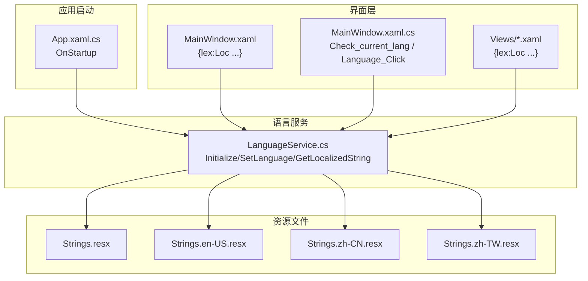
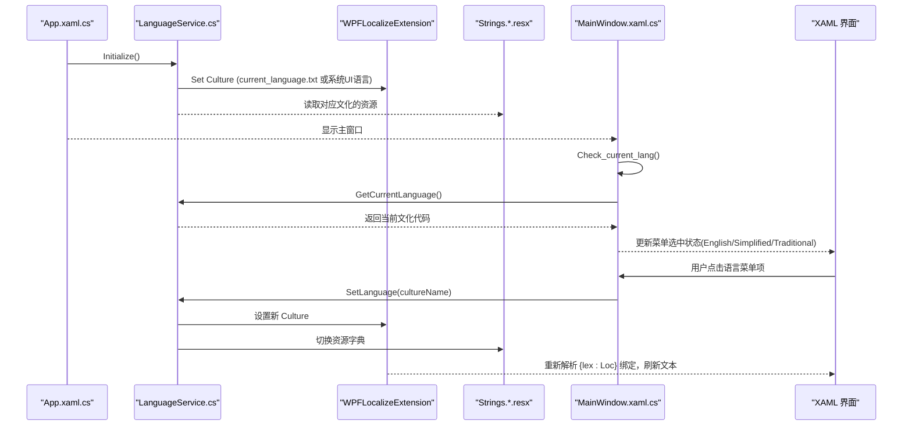
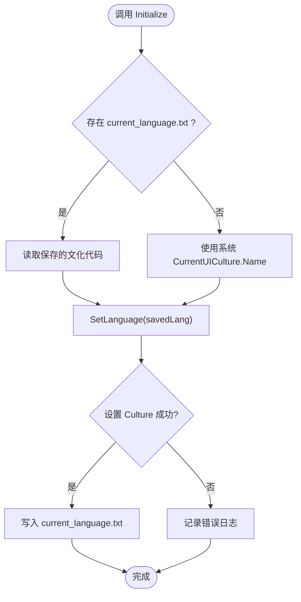
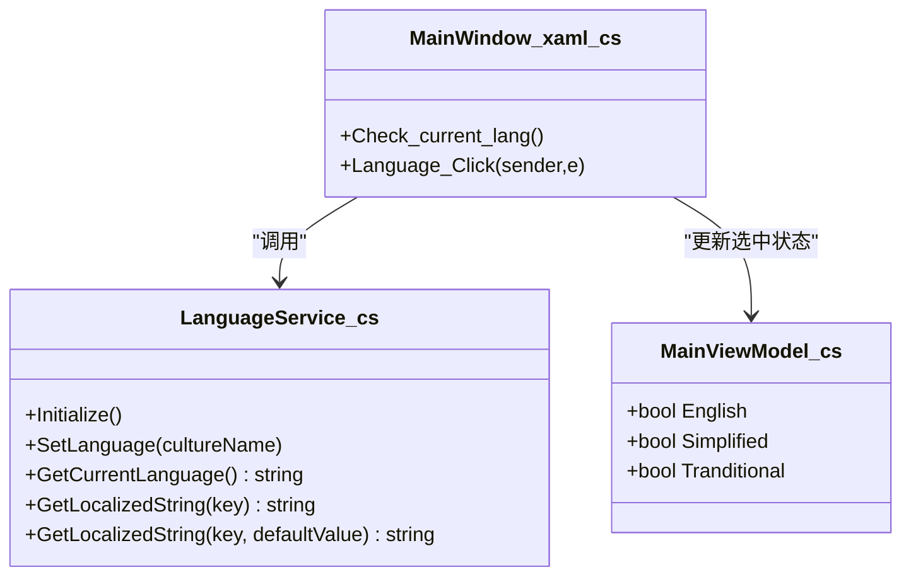
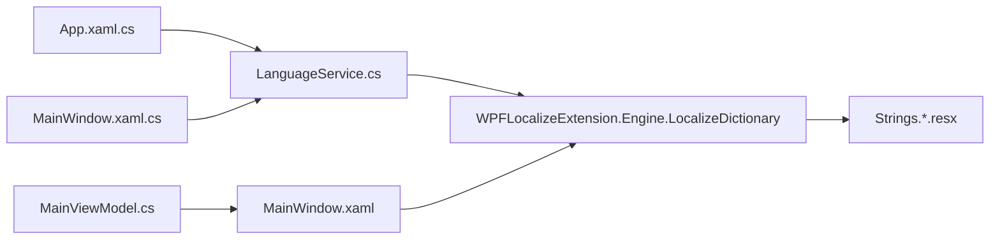

# 国际化支持

<cite>
**本文引用的文件**   
- [LanguageService.cs](file://ShaoLu/Services/LanguageService.cs)
- [App.xaml.cs](file://ShaoLu/App.xaml.cs)
- [MainWindow.xaml.cs](file://ShaoLu/MainWindow.xaml.cs)
- [MainWindow.xaml](file://ShaoLu/MainWindow.xaml)
- [Strings.resx](file://ShaoLu/Resources/Strings.resx)
- [Strings.en-US.resx](file://ShaoLu/Resources/Strings.en-US.resx)
- [Strings.zh-CN.resx](file://ShaoLu/Resources/Strings.zh-CN.resx)
- [Strings.zh-TW.resx](file://ShaoLu/Resources/Strings.zh-TW.resx)
- [WindowSettings.xaml](file://ShaoLu/Views/WindowSettings.xaml)
- [WindowLogin.xaml](file://ShaoLu/Views/WindowLogin.xaml)
- [MainViewModel.cs](file://ShaoLu/Viewmodels/MainViewModel.cs)
</cite>

## 目录
1. [简介](#简介)
2. [项目结构](#项目结构)
3. [核心组件](#核心组件)
4. [架构总览](#架构总览)
5. [详细组件分析](#详细组件分析)
6. [依赖关系分析](#依赖关系分析)
7. [性能考虑](#性能考虑)
8. [故障排查指南](#故障排查指南)
9. [结论](#结论)
10. [附录：新增语言与维护规范](#附录新增语言与维护规范)

## 简介
本技术文档围绕 ShaoLu 的国际化（i18n）支持展开，重点说明多语言资源的组织结构、resx 文件管理方式与语言切换机制。文档深入解析 LanguageService 的工作原理、动态语言加载流程，以及界面元素本地化的最佳实践。同时提供新增语言的步骤、资源维护规范和翻译工作流程，帮助开发者高效扩展和维护多语言能力。

## 项目结构
ShaoLu 采用 WPF + WPFLocalizeExtension 的本地化方案，结合 resx 资源文件实现运行时语言切换。关键目录与文件如下：
- Services/LanguageService.cs：统一的语言服务，负责初始化、设置当前文化、持久化与字符串获取。
- Resources/*.resx：按文化组织的多语言资源文件（默认 Strings.resx，以及 en-US、zh-CN、zh-TW）。
- App.xaml.cs：应用启动时初始化语言服务。
- MainWindow.xaml 与 MainWindow.xaml.cs：主窗口通过 lex:Loc 绑定资源键，并在菜单中触发语言切换。
- Views/*.xaml：各窗口通过 lex 命名空间声明并使用 {lex:Loc} 进行本地化。
- Viewmodels/MainViewModel.cs：用于 UI 语言选择状态的绑定属性。

图表来源 
- [App.xaml.cs:1-112](file://ShaoLu/App.xaml.cs#L1-L112)
- [LanguageService.cs:1-66](file://ShaoLu/Services/LanguageService.cs#L1-L66)
- [MainWindow.xaml:1-50](file://ShaoLu/MainWindow.xaml#L1-L50)
- [MainWindow.xaml.cs:146-173](file://ShaoLu/MainWindow.xaml.cs#L146-L173)
- [Strings.resx:120-200](file://ShaoLu/Resources/Strings.resx#L120-L200)
- [Strings.en-US.resx:120-200](file://ShaoLu/Resources/Strings.en-US.resx#L120-L200)
- [Strings.zh-CN.resx:120-200](file://ShaoLu/Resources/Strings.zh-CN.resx#L120-L200)
- [Strings.zh-TW.resx:120-200](file://ShaoLu/Resources/Strings.zh-TW.resx#L120-L200)

章节来源
- [App.xaml.cs:1-112](file://ShaoLu/App.xaml.cs#L1-L112)
- [LanguageService.cs:1-66](file://ShaoLu/Services/LanguageService.cs#L1-L66)
- [MainWindow.xaml:1-50](file://ShaoLu/MainWindow.xaml#L1-L50)
- [MainWindow.xaml.cs:146-173](file://ShaoLu/MainWindow.xaml.cs#L146-L173)

## 核心组件
- LanguageService：静态服务类，封装了语言初始化、设置、获取当前文化与本地化字符串的方法。使用 WPFLocalizeExtension 的 LocalizeDictionary 设置 Culture，并将用户选择的语言写入 current_language.txt 以持久化。
- XAML 本地化：通过 xmlns:lex 引入 WPFLocalizeExtension，在 Window 级别声明 DefaultAssembly 与 DefaultDictionary，随后使用 {lex:Loc Key} 绑定资源键。
- 视图模型 MainViewModel：包含 English、Simplified、Tranditional 三个布尔属性，用于菜单单选状态绑定。
- 主窗口逻辑：MainWindow.xaml.cs 中的 Check_current_lang 根据当前语言代码更新 ViewModel 的选中状态；Language_Click 处理语言切换事件并调用 LanguageService.SetLanguage。

章节来源
- [LanguageService.cs:1-66](file://ShaoLu/Services/LanguageService.cs#L1-L66)
- [MainWindow.xaml:1-50](file://ShaoLu/MainWindow.xaml#L1-L50)
- [MainWindow.xaml.cs:146-173](file://ShaoLu/MainWindow.xaml.cs#L146-L173)
- [MainViewModel.cs:1-76](file://ShaoLu/Viewmodels/MainViewModel.cs#L1-L76)

## 架构总览
下图展示了从应用启动到界面本地化的完整流程，包括语言初始化、资源定位与 UI 刷新。

图表来源 
- [App.xaml.cs:45-48](file://ShaoLu/App.xaml.cs#L45-L48)
- [LanguageService.cs:15-40](file://ShaoLu/Services/LanguageService.cs#L15-L40)
- [MainWindow.xaml.cs:146-173](file://ShaoLu/MainWindow.xaml.cs#L146-L173)
- [MainWindow.xaml:1-50](file://ShaoLu/MainWindow.xaml#L1-L50)

## 详细组件分析

### LanguageService 工作原理
- 初始化：优先读取 current_language.txt，若不存在则回退到系统 CurrentUICulture.Name。
- 设置语言：通过 LocalizeDictionary.Instance.Culture 设置新的 CultureInfo，并写入 current_language.txt 持久化。捕获 CultureNotFoundException 记录错误日志。
- 获取当前语言：返回 LocalizeDictionary.Instance.Culture.Name。
- 获取本地化字符串：封装 GetLocalizedObject(key, null, null) 的调用，找不到时返回 key 或默认值。

图表来源 
- [LanguageService.cs:15-40](file://ShaoLu/Services/LanguageService.cs#L15-L40)

章节来源
- [LanguageService.cs:1-66](file://ShaoLu/Services/LanguageService.cs#L1-L66)

### 界面本地化与语言切换
- XAML 声明：在 Window 根节点引入 lex 命名空间，并设置 DefaultAssembly 与 DefaultDictionary。所有可见文本通过 {lex:Loc Key} 绑定。
- 主窗口菜单：语言菜单项 Tag 为文化代码（en-US、zh-CN、zh-TW），Click 事件调用 LanguageService.SetLanguage。
- 状态同步：Check_current_lang 读取当前语言代码并更新 ViewModel 的 English/Simplified/Tranditional 属性，使菜单单选状态正确。

图表来源 
- [MainWindow.xaml.cs:146-173](file://ShaoLu/MainWindow.xaml.cs#L146-L173)
- [MainViewModel.cs:14-22](file://ShaoLu/Viewmodels/MainViewModel.cs#L14-L22)
- [LanguageService.cs:15-48](file://ShaoLu/Services/LanguageService.cs#L15-L48)

章节来源
- [MainWindow.xaml:1-50](file://ShaoLu/MainWindow.xaml#L1-L50)
- [MainWindow.xaml.cs:146-173](file://ShaoLu/MainWindow.xaml.cs#L146-L173)
- [MainViewModel.cs:1-76](file://ShaoLu/Viewmodels/MainViewModel.cs#L1-L76)

### 资源文件组织与管理
- 默认资源：Strings.resx 作为默认语言资源（无文化后缀）。
- 多语言资源：Strings.en-US.resx、Strings.zh-CN.resx、Strings.zh-TW.resx 分别对应英文、简体中文、繁体中文。
- 资源键命名：建议采用语义化命名（如 AppTitle、Save、Menu_Login、Condition_StepRef_Tooltip 等），避免硬编码文本。
- 生成器：Resources/Strings.Designer.cs 由构建过程自动生成，便于在代码中以强类型访问资源（本项目主要使用 lex:Loc 在 XAML 中引用）。

章节来源
- [Strings.resx:120-200](file://ShaoLu/Resources/Strings.resx#L120-L200)
- [Strings.en-US.resx:120-200](file://ShaoLu/Resources/Strings.en-US.resx#L120-L200)
- [Strings.zh-CN.resx:120-200](file://ShaoLu/Resources/Strings.zh-CN.resx#L120-L200)
- [Strings.zh-TW.resx:120-200](file://ShaoLu/Resources/Strings.zh-TW.resx#L120-L200)
- [Strings.Designer.cs:54-98](file://ShaoLu/Resources/Strings.Designer.cs#L54-L98)

### 其他窗口的本地化示例
- WindowSettings.xaml：标题与内容通过 {lex:Loc Settings} 等键绑定。
- WindowLogin.xaml：标题与按钮文本通过 {lex:Loc LoginTitle} 等键绑定。

章节来源
- [WindowSettings.xaml:1-30](file://ShaoLu/Views/WindowSettings.xaml#L1-L30)
- [WindowLogin.xaml:1-28](file://ShaoLu/Views/WindowLogin.xaml#L1-L28)

## 依赖关系分析
- 应用启动依赖 LanguageService.Initialize 设置初始文化。
- 界面层依赖 WPFLocalizeExtension 的 lex:Loc 标记扩展解析资源键。
- 资源文件依赖 .NET 资源管理器按文化选择正确的 resx。
- 主窗口逻辑依赖 LanguageService.GetCurrentLanguage 与 SetLanguage 来同步 UI 状态与切换语言。

图表来源 
- [App.xaml.cs:45-48](file://ShaoLu/App.xaml.cs#L45-L48)
- [LanguageService.cs:1-66](file://ShaoLu/Services/LanguageService.cs#L1-L66)
- [MainWindow.xaml:1-50](file://ShaoLu/MainWindow.xaml#L1-L50)
- [MainWindow.xaml.cs:146-173](file://ShaoLu/MainWindow.xaml.cs#L146-L173)
- [MainViewModel.cs:14-22](file://ShaoLu/Viewmodels/MainViewModel.cs#L14-L22)

章节来源
- [App.xaml.cs:1-112](file://ShaoLu/App.xaml.cs#L1-L112)
- [LanguageService.cs:1-66](file://ShaoLu/Services/LanguageService.cs#L1-L66)
- [MainWindow.xaml:1-50](file://ShaoLu/MainWindow.xaml#L1-L50)
- [MainWindow.xaml.cs:146-173](file://ShaoLu/MainWindow.xaml.cs#L146-L173)
- [MainViewModel.cs:1-76](file://ShaoLu/Viewmodels/MainViewModel.cs#L1-L76)

## 性能考虑
- 资源加载：WPFLocalizeExtension 会在首次访问资源键时按需加载对应文化资源，避免一次性加载全部资源。
- 文化切换：切换语言会更新 LocalizeDictionary 的 Culture，后续 {lex:Loc} 解析将基于新文化，无需重建整个 UI。
- 磁盘 IO：current_language.txt 仅在设置语言时读写一次，频率低，对性能影响可忽略。
- 建议：保持资源键稳定，避免频繁变更导致缓存失效；大量文本建议使用外部翻译工具批量维护 resx。

## 故障排查指南
- 语言未生效：检查 current_language.txt 是否被正确写入；确认传入的文化代码有效（如 en-US、zh-CN、zh-TW）。
- 资源缺失：确保目标文化的 resx 文件包含对应的资源键；缺失时将回退到默认资源或返回键本身。
- 异常日志：LanguageService 捕获 CultureNotFoundException 并记录错误日志，可通过 NLog 查看具体原因。
- UI 状态不同步：确认 Check_current_lang 在语言切换后被调用，且 ViewModel 的属性已更新。

章节来源
- [LanguageService.cs:27-40](file://ShaoLu/Services/LanguageService.cs#L27-L40)
- [MainWindow.xaml.cs:166-173](file://ShaoLu/MainWindow.xaml.cs#L166-L173)

## 结论
ShaoLu 的国际化方案基于 WPFLocalizeExtension 与 resx 资源文件，实现了简洁高效的运行时语言切换。LanguageService 统一管理语言初始化、设置与字符串获取，XAML 通过 {lex:Loc} 实现声明式本地化。该方案具备良好的可扩展性，便于新增语言与维护资源。遵循本文档的最佳实践与规范，可显著提升多语言开发效率与用户体验。

## 附录：新增语言与维护规范

### 新增语言步骤
- 复制默认资源文件：复制 Strings.resx 为新文化文件，例如 Strings.fr-FR.resx。
- 填充翻译：在新 resx 文件中为每个资源键添加对应翻译。
- 配置语言菜单：在 MainWindow.xaml 的语言菜单中添加新文化项，Tag 设置为文化代码（如 fr-FR），并确保 Click 事件处理正确。
- 验证切换：运行程序，选择新语言，确认界面文本正确显示。

章节来源
- [Strings.resx:120-200](file://ShaoLu/Resources/Strings.resx#L120-L200)
- [MainWindow.xaml:38-42](file://ShaoLu/MainWindow.xaml#L38-L42)

### 资源文件维护规范
- 命名约定：资源键应语义化、唯一且稳定（如 Menu_Login、Save、Condition_StepRef_Tooltip）。
- 一致性：所有文化文件的资源键必须一致，缺失键会导致回退行为。
- 注释与版本：建议在 resx 中为复杂键添加注释，便于翻译人员理解上下文。
- 构建产物：Strings.Designer.cs 由构建过程自动生成，勿手动修改。

章节来源
- [Strings.Designer.cs:54-98](file://ShaoLu/Resources/Strings.Designer.cs#L54-L98)

### 翻译工作流程
- 提取键集：从现有 resx 文件导出键列表，作为翻译模板。
- 分发翻译：将模板分发给翻译人员，按文化填写翻译内容。
- 合并与校验：将翻译结果合并回对应 resx 文件，校验键一致性。
- 测试与发布：运行程序验证各文化下的显示效果，确认无误后发布。

[本节为概念性指导，不直接分析具体文件]