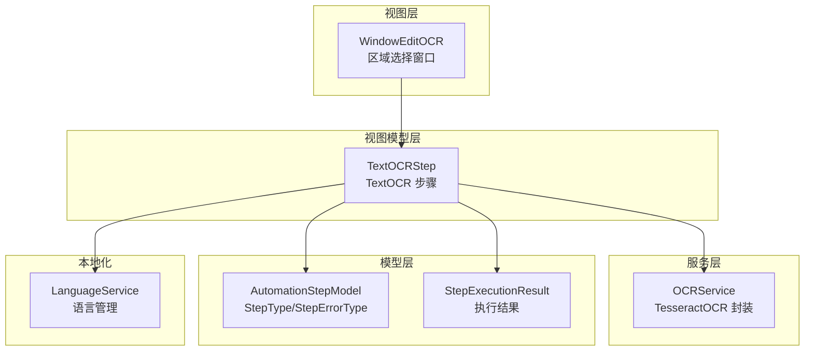
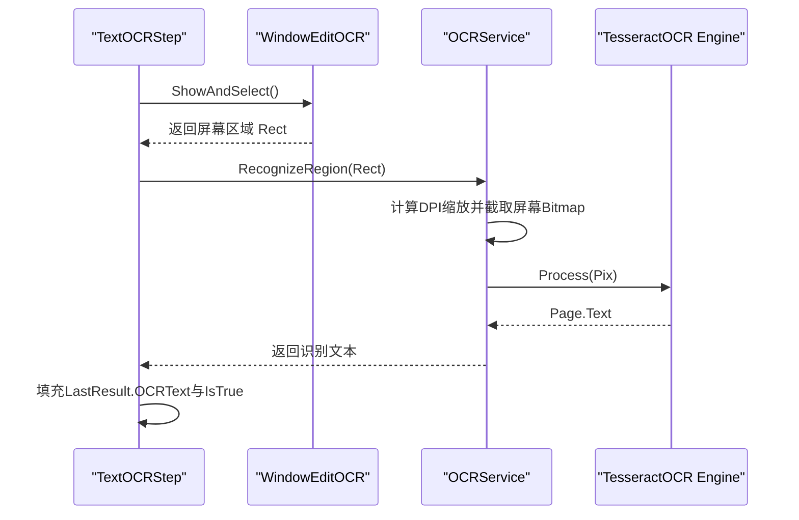
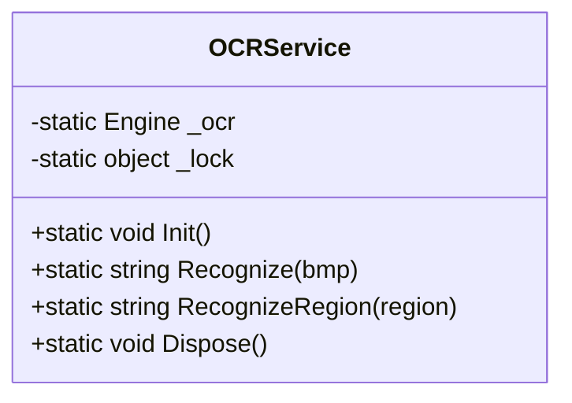
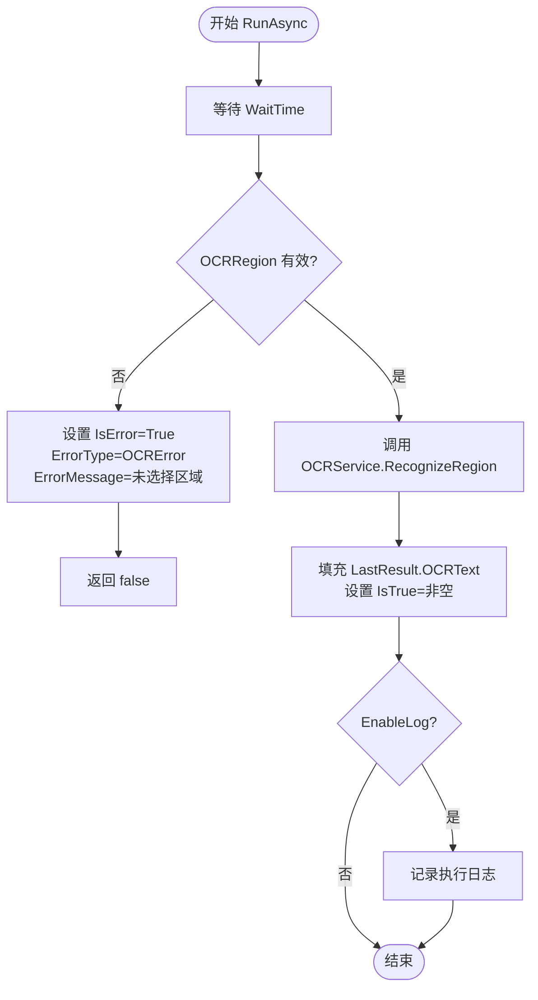
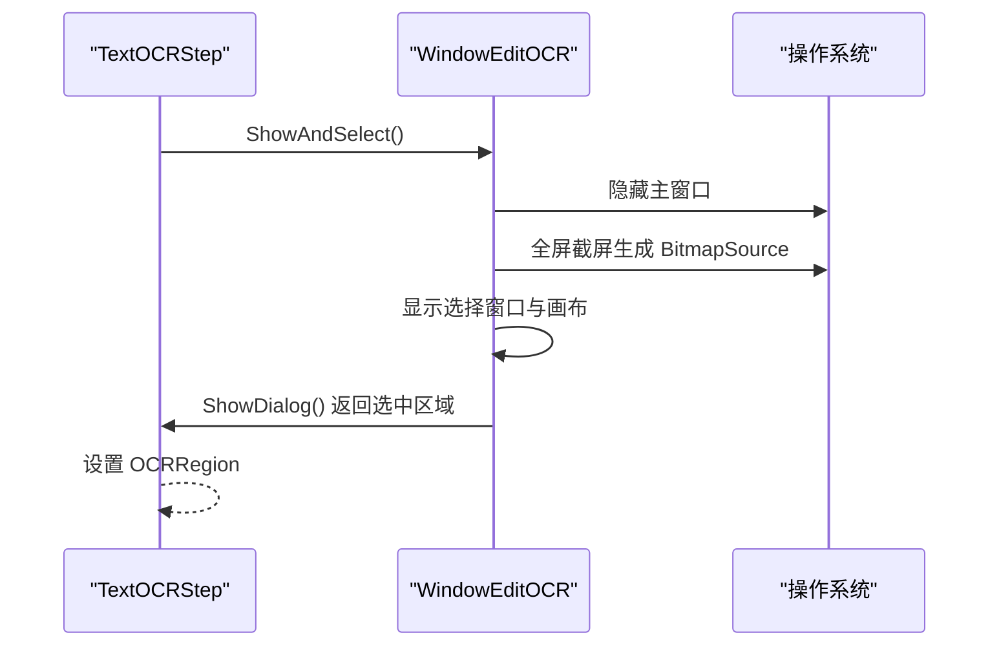
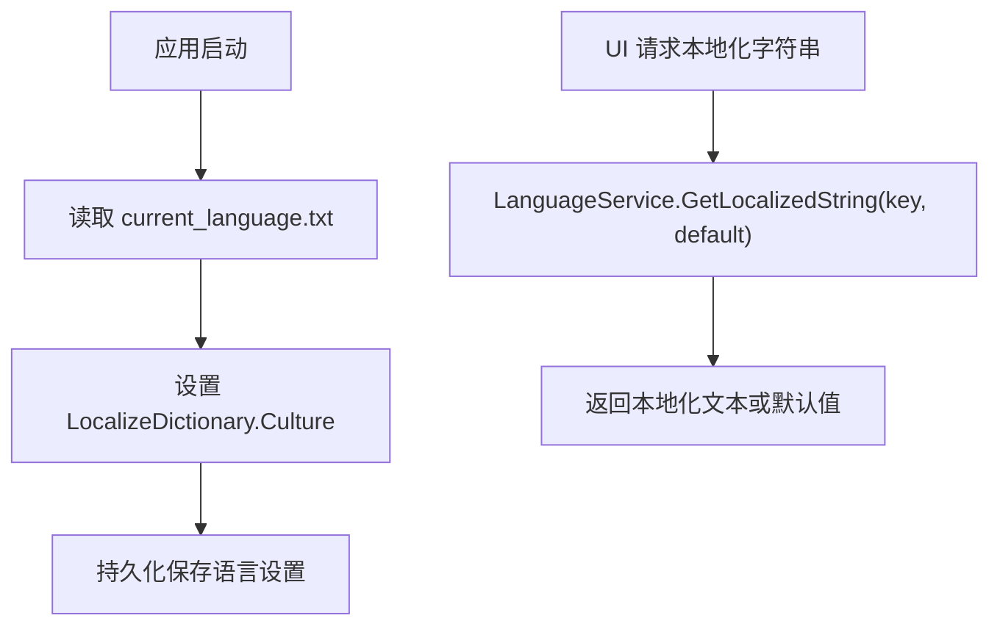
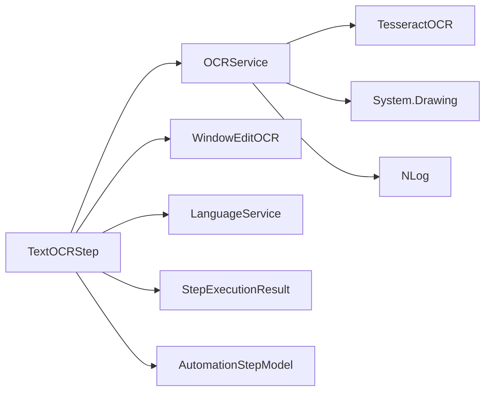

# OCR文字识别

<cite>
**本文档引用的文件**   
- [OCRService.cs](file://ShaoLu/Services/OCRService.cs)
- [TextOCRStep.cs](file://ShaoLu/Viewmodels/TextOCRStep.cs)
- [WindowEditOCR.xaml.cs](file://ShaoLu/Views/WindowEditOCR.xaml.cs)
- [LanguageService.cs](file://ShaoLu/Services/LanguageService.cs)
- [AutomationStepModel.cs](file://ShaoLu/Models/AutomationStepModel.cs)
- [StepExecutionResult.cs](file://ShaoLu/Models/StepExecutionResult.cs)
- [Readme.md](file://Readme.md)
</cite>

## 目录
1. [简介](#简介)
2. [项目结构](#项目结构)
3. [核心组件](#核心组件)
4. [架构总览](#架构总览)
5. [详细组件分析](#详细组件分析)
6. [依赖关系分析](#依赖关系分析)
7. [性能考量](#性能考量)
8. [故障排查指南](#故障排查指南)
9. [结论](#结论)
10. [附录](#附录)

## 简介
本技术文档聚焦于本项目中的 OCR 文字识别能力，围绕 TesseractOCR 引擎的集成与配置、OCRService 的核心方法（区域选择、图像预处理、识别执行、结果处理）、TextOCRStep 步骤类型的实现（UI 交互流程与参数配置）、多语言支持机制（语言包加载与管理），以及识别结果的格式化与后处理方法进行系统化说明。同时提供常见问题与调试技巧，帮助开发者快速定位并解决识别率低、字符错误等问题。

## 项目结构
OCR 相关代码主要分布在以下模块：
- 服务层：OCRService 封装 TesseractOCR 引擎，负责初始化、屏幕截图、识别与资源释放。
- 视图模型层：TextOCRStep 定义 TextOCR 步骤类型，承载 UI 交互命令、运行逻辑与结果输出。
- 视图层：WindowEditOCR 提供全屏截屏与框选区域的交互界面。
- 本地化服务：LanguageService 管理应用语言切换与字符串获取。
- 模型层：AutomationStepModel 定义步骤类型与错误类型；StepExecutionResult 记录结构化执行结果。

图表来源 
- [WindowEditOCR.xaml.cs](file://ShaoLu/Views/WindowEditOCR.xaml.cs)
- [TextOCRStep.cs](file://ShaoLu/Viewmodels/TextOCRStep.cs)
- [OCRService.cs](file://ShaoLu/Services/OCRService.cs)
- [AutomationStepModel.cs](file://ShaoLu/Models/AutomationStepModel.cs)
- [StepExecutionResult.cs](file://ShaoLu/Models/StepExecutionResult.cs)
- [LanguageService.cs](file://ShaoLu/Services/LanguageService.cs)

章节来源
- [Readme.md](file://Readme.md)

## 核心组件
- OCRService：基于 TesseractOCR 的静态服务类，提供懒加载初始化、Bitmap 识别、屏幕区域识别与资源释放。默认使用 chi_sim+eng 语言组合，tessdata 路径位于应用程序目录下的 tessdata 文件夹。
- TextOCRStep：自动化步骤的一种，用于从屏幕指定区域执行 OCR 识别。包含区域选择命令、测试识别命令、异步执行流程、结果存储与日志记录。
- WindowEditOCR：全屏截屏并允许用户拖拽框选 OCR 区域，返回绝对坐标矩形。
- LanguageService：应用级语言切换与本地化字符串获取，持久化当前语言设置。
- AutomationStepModel：定义 StepType.TextOCR 与 StepErrorType.OCRError 等枚举。
- StepExecutionResult：记录 IsTrue、OCRText、ExecutedAt 等结构化结果。

章节来源
- [OCRService.cs](file://ShaoLu/Services/OCRService.cs)
- [TextOCRStep.cs](file://ShaoLu/Viewmodels/TextOCRStep.cs)
- [WindowEditOCR.xaml.cs](file://ShaoLu/Views/WindowEditOCR.xaml.cs)
- [LanguageService.cs](file://ShaoLu/Services/LanguageService.cs)
- [AutomationStepModel.cs](file://ShaoLu/Models/AutomationStepModel.cs)
- [StepExecutionResult.cs](file://ShaoLu/Models/StepExecutionResult.cs)

## 架构总览
OCR 识别的整体调用链如下：
- 用户在 TextOCRStep 中点击“选择区域”或“测试 OCR”，触发 WindowEditOCR 全屏截屏与框选交互。
- 选择完成后，TextOCRStep.RunAsync 调用 OCRService.RecognizeRegion，内部根据 DPI 缩放将逻辑像素转换为物理像素，截取屏幕区域为 Bitmap。
- OCRService 通过 TesseractOCR 引擎对 Pix 对象进行处理，返回文本。
- TextOCRStep 将识别结果写入 LastResult.OCRText，并根据是否为空设置 IsTrue，同时可选记录日志。

图表来源 
- [TextOCRStep.cs](file://ShaoLu/Viewmodels/TextOCRStep.cs)
- [WindowEditOCR.xaml.cs](file://ShaoLu/Views/WindowEditOCR.xaml.cs)
- [OCRService.cs](file://ShaoLu/Services/OCRService.cs)

## 详细组件分析

### OCRService 组件分析
职责与关键点：
- 懒加载初始化：首次调用 Init() 时创建 Engine，读取 tessdata 路径与语言组合（chi_sim+eng）。
- 识别入口：Recognize(Bitmap) 将 Bitmap 转为内存流，构造 Pix，调用 _ocr.Process(pix) 获取文本。
- 区域识别：RecognizeRegion(Rect) 计算 DPI 缩放因子，使用 GDI CopyFromScreen 截取屏幕区域为 Bitmap，再调用 Recognize。
- 异常处理：捕获异常并记录日志，返回空字符串保证调用方安全。
- 资源释放：Dispose() 释放引擎实例。

图表来源 
- [OCRService.cs](file://ShaoLu/Services/OCRService.cs)

章节来源
- [OCRService.cs](file://ShaoLu/Services/OCRService.cs)

### TextOCRStep 组件分析
职责与关键点：
- 属性：OCRRegion（屏幕区域）、OCRRegionText（显示描述）、OCRResultPreview（运行时预览）。
- 命令：SelectRegionCommand 打开 WindowEditOCR 选择区域；TestOCRCommand 即时测试识别。
- 执行流程：RunAsync 等待 WaitTime，校验区域有效性，调用 OCRService.RecognizeRegion，填充 LastResult.OCRText 与 IsTrue，可选记录日志。
- 错误处理：未选择区域时设置 IsError、ErrorType=OCRError 与 ErrorMessage。

图表来源 
- [TextOCRStep.cs](file://ShaoLu/Viewmodels/TextOCRStep.cs)
- [StepExecutionResult.cs](file://ShaoLu/Models/StepExecutionResult.cs)

章节来源
- [TextOCRStep.cs](file://ShaoLu/Viewmodels/TextOCRStep.cs)
- [StepExecutionResult.cs](file://ShaoLu/Models/StepExecutionResult.cs)

### WindowEditOCR 组件分析
职责与关键点：
- ShowAndSelect：隐藏主窗口，全屏截屏，显示选择窗口，返回选择的绝对坐标矩形。
- 鼠标交互：Canvas 上拖拽绘制矩形，更新遮罩与尺寸提示，Enter 确认，Esc/右键取消。
- 键盘事件：双重保障（Canvas 与 Window Preview）确保按键响应。
- 关闭逻辑：统一处理拖拽状态、最小尺寸校验与对话框返回值。

图表来源 
- [WindowEditOCR.xaml.cs](file://ShaoLu/Views/WindowEditOCR.xaml.cs)
- [TextOCRStep.cs](file://ShaoLu/Viewmodels/TextOCRStep.cs)

章节来源
- [WindowEditOCR.xaml.cs](file://ShaoLu/Views/WindowEditOCR.xaml.cs)

### 多语言支持机制
- LanguageService.Initialize：启动时读取 current_language.txt，若不存在则使用系统 UI 语言。
- LanguageService.SetLanguage：设置 LocalizeDictionary.Culture 并持久化到文件。
- LanguageService.GetLocalizedString：按 key 获取本地化字符串，找不到时返回默认值或 key 本身。
- 在 TextOCRStep 中通过 LanguageService 获取“未选择区域”、“未识别到文本”等文案。

图表来源 
- [LanguageService.cs](file://ShaoLu/Services/LanguageService.cs)
- [TextOCRStep.cs](file://ShaoLu/Viewmodels/TextOCRStep.cs)

章节来源
- [LanguageService.cs](file://ShaoLu/Services/LanguageService.cs)
- [TextOCRStep.cs](file://ShaoLu/Viewmodels/TextOCRStep.cs)

### 图像预处理流程与精度影响
- 当前实现中，OCRService 直接对原始屏幕截图进行识别，未内置二值化、去噪、对比度增强等预处理步骤。
- 建议优化方向：
  - 二值化：提高文本与背景对比，减少噪声干扰。
  - 去噪：使用中值滤波或形态学操作去除细小噪声点。
  - 对比度增强：直方图均衡化提升暗区细节。
  - 倾斜校正：检测文本行角度并进行旋转校正。
- 这些预处理可显著提升复杂背景、低对比度或倾斜文本的识别准确率。

[本节为通用指导，不直接分析具体文件]

### 识别结果的格式化与后处理
- TextOCRStep.RunAsync 将 OCRService 返回的文本直接写入 LastResult.OCRText，并根据是否为空设置 IsTrue。
- 建议在后续扩展中加入：
  - 文本清洗：去除多余空白、换行符规范化、全角半角统一。
  - 结构化输出：按行分割、键值对提取、正则匹配关键信息。
  - 条件判断：结合 StepCondition 与 ConditionVariable.Self_OCRText 进行 Contains/NotContains/IsEmpty 等规则评估。

章节来源
- [TextOCRStep.cs](file://ShaoLu/Viewmodels/TextOCRStep.cs)
- [StepExecutionResult.cs](file://ShaoLu/Models/StepExecutionResult.cs)

## 依赖关系分析
- TextOCRStep 依赖：
  - OCRService：执行 OCR 识别。
  - WindowEditOCR：选择屏幕区域。
  - LanguageService：本地化文案。
  - StepExecutionResult：记录执行结果。
  - AutomationStepModel：步骤类型与错误类型。
- OCRService 依赖：
  - TesseractOCR：OCR 引擎库。
  - System.Drawing：屏幕截图与图像处理。
  - NLog：日志记录。

图表来源 
- [TextOCRStep.cs](file://ShaoLu/Viewmodels/TextOCRStep.cs)
- [OCRService.cs](file://ShaoLu/Services/OCRService.cs)
- [WindowEditOCR.xaml.cs](file://ShaoLu/Views/WindowEditOCR.xaml.cs)
- [LanguageService.cs](file://ShaoLu/Services/LanguageService.cs)
- [StepExecutionResult.cs](file://ShaoLu/Models/StepExecutionResult.cs)
- [AutomationStepModel.cs](file://ShaoLu/Models/AutomationStepModel.cs)

章节来源
- [TextOCRStep.cs](file://ShaoLu/Viewmodels/TextOCRStep.cs)
- [OCRService.cs](file://ShaoLu/Services/OCRService.cs)
- [WindowEditOCR.xaml.cs](file://ShaoLu/Views/WindowEditOCR.xaml.cs)
- [LanguageService.cs](file://ShaoLu/Services/LanguageService.cs)
- [StepExecutionResult.cs](file://ShaoLu/Models/StepExecutionResult.cs)
- [AutomationStepModel.cs](file://ShaoLu/Models/AutomationStepModel.cs)

## 性能考量
- 懒加载与单例：OCRService.Init() 使用双检锁确保线程安全的懒加载，避免重复初始化开销。
- 内存管理：Recognize 中使用 MemoryStream 与 using 语句及时释放资源，防止内存泄漏。
- DPI 适配：RecognizeRegion 根据主窗口的 DPI 缩放因子转换逻辑像素到物理像素，确保跨显示器环境正确性。
- 异步执行：TextOCRStep.RunAsync 使用 Task.Run 避免阻塞 UI 线程，提升用户体验。
- 建议优化：
  - 引入图像预处理流水线以减少识别耗时与失败率。
  - 缓存常用区域的识别结果，避免重复识别。
  - 批量识别时复用 Engine 实例与 Pix 对象，降低 GC 压力。

[本节为通用指导，不直接分析具体文件]

## 故障排查指南
常见问题与解决方案：
- 识别结果为空：
  - 检查 OCRRegion 是否有效且非空。
  - 确认 tessdata 路径存在且包含 chi_sim+eng 语言包。
  - 查看 OCRService 日志是否有初始化或识别异常。
- 识别率低或字符错误：
  - 增加图像预处理（二值化、去噪、对比度增强）。
  - 调整屏幕分辨率与 DPI 设置，确保截图清晰。
  - 尝试仅使用单一语言（如 chi_sim 或 eng）以提升特定场景准确率。
- 多语言问题：
  - 检查 current_language.txt 是否存在且格式正确。
  - 确认 LanguageService.SetLanguage 成功设置 Culture。
- 区域选择失败：
  - 确认 WindowEditOCR 能正常截屏与显示。
  - 检查 Enter/Esc/右键事件是否正确绑定。

章节来源
- [OCRService.cs](file://ShaoLu/Services/OCRService.cs)
- [TextOCRStep.cs](file://ShaoLu/Viewmodels/TextOCRStep.cs)
- [WindowEditOCR.xaml.cs](file://ShaoLu/Views/WindowEditOCR.xaml.cs)
- [LanguageService.cs](file://ShaoLu/Services/LanguageService.cs)

## 结论
本项目通过 OCRService 封装 TesseractOCR 引擎，结合 TextOCRStep 与 WindowEditOCR 实现了完整的 OCR 文字识别流程。当前实现简洁可靠，具备基本的区域选择、识别执行与结果处理能力。未来可通过引入图像预处理、结果后处理与缓存机制进一步提升识别精度与性能。多语言支持通过 LanguageService 统一管理，便于国际化扩展。

[本节为总结性内容，不直接分析具体文件]

## 附录
- 步骤类型与错误类型定义参考 AutomationStepModel。
- 执行结果结构参考 StepExecutionResult。
- 使用指南与步骤说明参考 Readme.md。

章节来源
- [AutomationStepModel.cs](file://ShaoLu/Models/AutomationStepModel.cs)
- [StepExecutionResult.cs](file://ShaoLu/Models/StepExecutionResult.cs)
- [Readme.md](file://Readme.md)