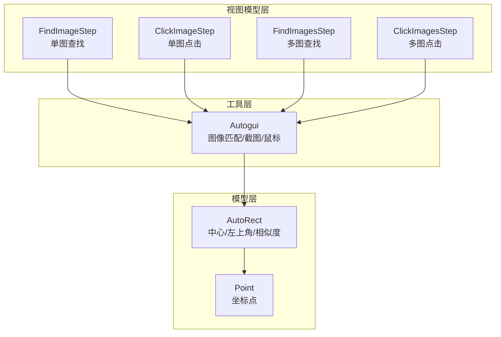
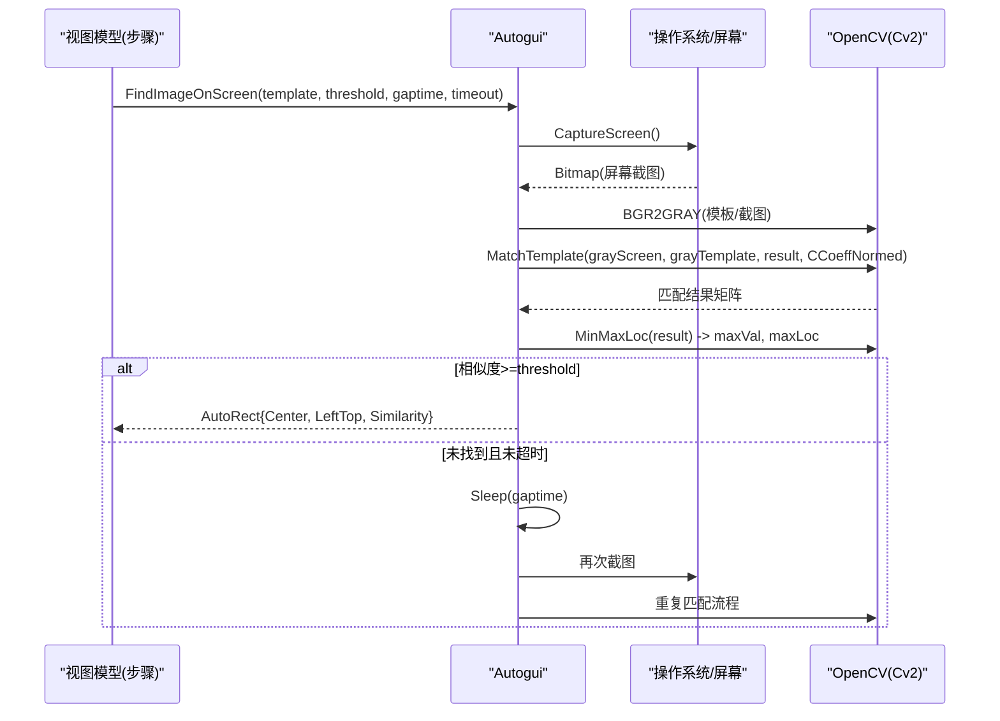
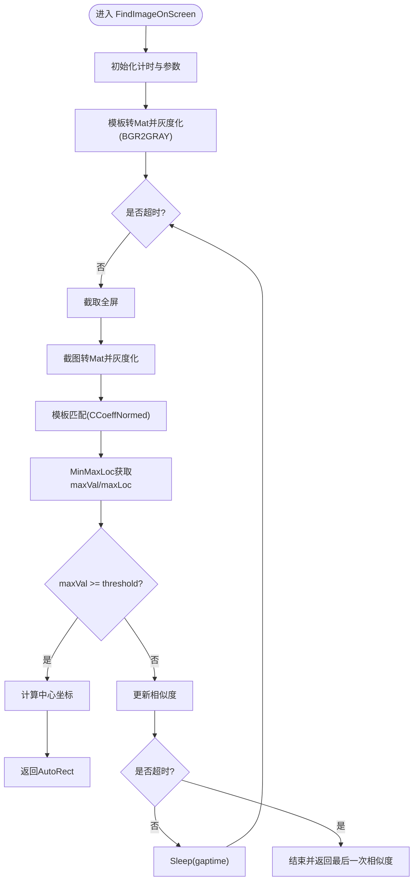
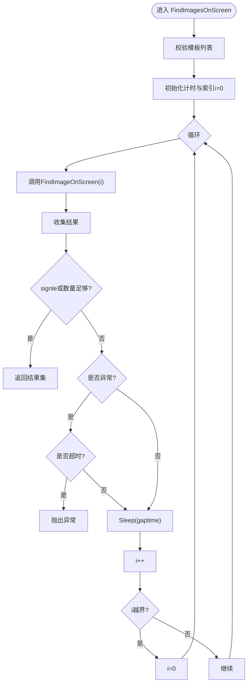
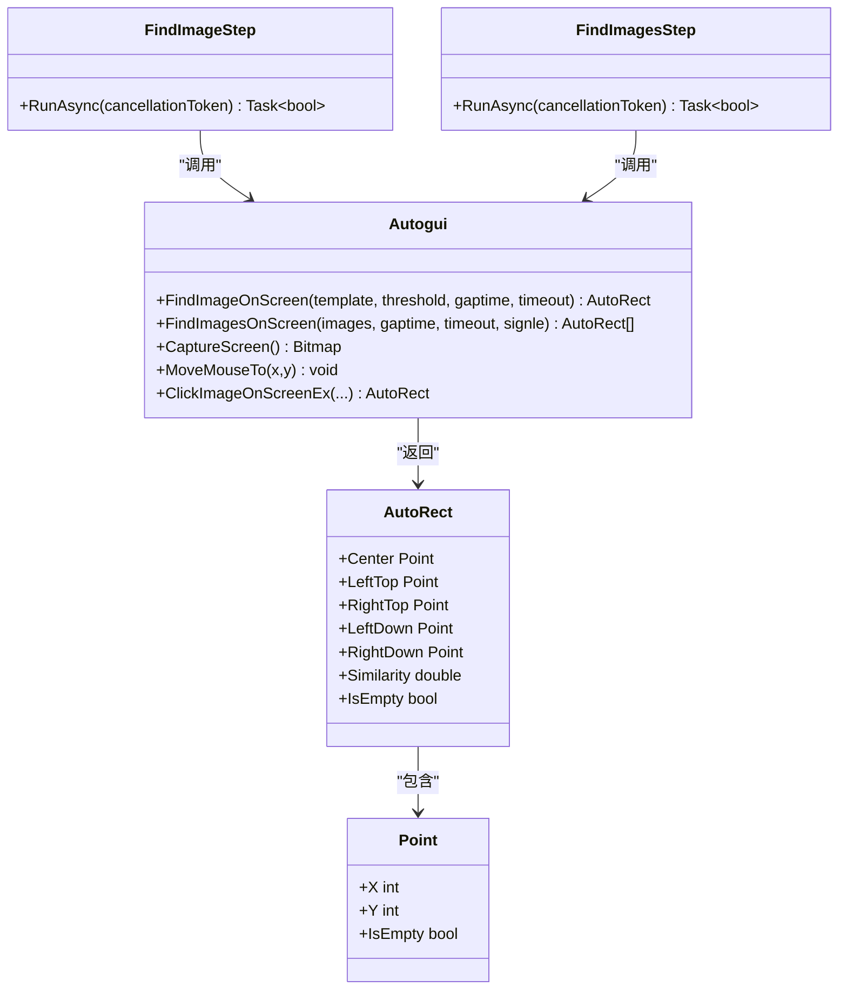
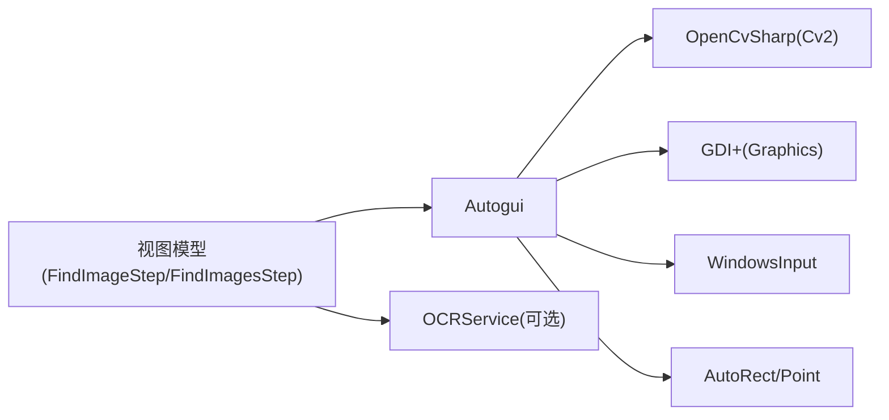

# OpenCV图像匹配

<cite>
**本文引用的文件**   
- [Autogui.cs](file://ShaoLu/Utils/Autogui.cs)
- [AutoguiModel.cs](file://ShaoLu/Models/AutoguiModel.cs)
- [ImageRecognition.cs](file://ShaoLu/Viewmodels/ImageRecognition.cs)
- [ImagesRecognition.cs](file://ShaoLu/Viewmodels/ImagesRecognition.cs)
</cite>

## 目录
1. [简介](#简介)
2. [项目结构](#项目结构)
3. [核心组件](#核心组件)
4. [架构总览](#架构总览)
5. [详细组件分析](#详细组件分析)
6. [依赖关系分析](#依赖关系分析)
7. [性能考量](#性能考量)
8. [故障排查指南](#故障排查指南)
9. [结论](#结论)
10. [附录](#附录)

## 简介
本技术文档围绕基于 OpenCvSharp4 的模板匹配功能，系统阐述 FindImageOnScreen 与 FindImagesOnScreen 的实现原理、数据流与控制流，重点解释 CCoeffNormed（归一化相关系数）匹配模式的工作机制。文档还涵盖屏幕截图获取、灰度转换、相似度阈值判断、坐标定位、多图像批量识别与循环查找机制，并提供内存管理、缓存策略、调试方法与参数调优建议，帮助开发者在精度与速度之间取得平衡。

## 项目结构
本项目采用分层组织：
- Utils 层：封装自动化与图像处理能力（如 Autogui），对外暴露图像匹配、鼠标操作等静态方法。
- Models 层：定义通用数据结构（如 Point、AutoRect）。
- Viewmodels 层：编排业务步骤（单图/多图查找、点击等），负责调用 Utils 层并处理结果。
- Services 层：OCR、日志、配置等服务（与本主题相关但非核心实现细节）。

图表来源 
- [Autogui.cs:59-122](file://ShaoLu/Utils/Autogui.cs#L59-L122)
- [Autogui.cs:124-171](file://ShaoLu/Utils/Autogui.cs#L124-L171)
- [AutoguiModel.cs:89-145](file://ShaoLu/Models/AutoguiModel.cs#L89-L145)
- [ImageRecognition.cs:515-565](file://ShaoLu/Viewmodels/ImageRecognition.cs#L515-L565)
- [ImagesRecognition.cs:197-224](file://ShaoLu/Viewmodels/ImagesRecognition.cs#L197-L224)

章节来源
- [Autogui.cs:1-584](file://ShaoLu/Utils/Autogui.cs#L1-L584)
- [AutoguiModel.cs:1-145](file://ShaoLu/Models/AutoguiModel.cs#L1-L145)
- [ImageRecognition.cs:1-568](file://ShaoLu/Viewmodels/ImageRecognition.cs#L1-L568)
- [ImagesRecognition.cs:1-228](file://ShaoLu/Viewmodels/ImagesRecognition.cs#L1-L228)

## 核心组件
- Autogui：提供屏幕截图、模板匹配、鼠标移动/点击等核心能力。关键方法包括 FindImageOnScreen、FindImagesOnScreen、CaptureScreen、MoveMouseTo、ClickImageOnScreenEx 等。
- AutoRect/Point：描述匹配结果区域与坐标点，支持中心点与四角点的计算。
- 视图模型：将业务步骤（查找/点击）与 Autogui 对接，负责参数传递、超时控制、结果回填与可选 OCR 集成。

章节来源
- [Autogui.cs:59-122](file://ShaoLu/Utils/Autogui.cs#L59-L122)
- [Autogui.cs:124-171](file://ShaoLu/Utils/Autogui.cs#L124-L171)
- [AutoguiModel.cs:89-145](file://ShaoLu/Models/AutoguiModel.cs#L89-L145)
- [ImageRecognition.cs:515-565](file://ShaoLu/Viewmodels/ImageRecognition.cs#L515-L565)
- [ImagesRecognition.cs:197-224](file://ShaoLu/Viewmodels/ImagesRecognition.cs#L197-L224)

## 架构总览
下图展示从视图模型到 Autogui 再到 OpenCV 的调用链路与数据流向。

图表来源 
- [Autogui.cs:59-122](file://ShaoLu/Utils/Autogui.cs#L59-L122)
- [Autogui.cs:177-186](file://ShaoLu/Utils/Autogui.cs#L177-L186)

## 详细组件分析

### 单图查找：FindImageOnScreen
该方法是整个图像匹配的核心入口，完整流程如下：
- 输入校验与计时初始化
- 模板预处理：Bitmap→Mat→BGR2GRAY（仅一次）
- 循环内：
  - 截取全屏
  - 截图预处理：Bitmap→Mat→BGR2GRAY
  - 模板匹配：CCoeffNormed
  - 取最大相似度和位置：MinMaxLoc
  - 阈值判断：maxVal >= threshold
  - 若成功：计算中心坐标，返回 AutoRect
  - 若失败：更新相似度，检查超时；否则休眠 gaptime 后重试

图表来源 
- [Autogui.cs:59-122](file://ShaoLu/Utils/Autogui.cs#L59-L122)

章节来源
- [Autogui.cs:59-122](file://ShaoLu/Utils/Autogui.cs#L59-L122)

### 多图像查找：FindImagesOnScreen
该方法支持批量图像识别与循环查找：
- 输入校验：模板列表非空
- 计时与索引 i=0
- 循环：
  - 调用 FindImageOnScreen 对当前模板进行查找
  - 记录结果，若 signle=true 或已收集足够数量则返回
  - 若异常：检查超时，否则继续
  - 休眠 gaptime，i++，越界回绕为 0

图表来源 
- [Autogui.cs:124-171](file://ShaoLu/Utils/Autogui.cs#L124-L171)

章节来源
- [Autogui.cs:124-171](file://ShaoLu/Utils/Autogui.cs#L124-L171)

### 截图与灰度转换：CaptureScreen 与 BGR2GRAY
- CaptureScreen：使用 GDI+ 抓取主屏矩形区域，生成 32bppARGB 位图。
- 灰度转换：通过 OpenCvSharp.Extensions.BitmapConverter.ToMat 将 Bitmap 转为 Mat，再使用 CvtColor(BGR2GRAY) 转换为灰度图，减少通道数提升匹配效率。

章节来源
- [Autogui.cs:177-186](file://ShaoLu/Utils/Autogui.cs#L177-L186)
- [Autogui.cs:74-82](file://ShaoLu/Utils/Autogui.cs#L74-L82)

### 模板匹配算法：CCoeffNormed 工作原理
- CCoeffNormed（归一化相关系数匹配）：衡量模板与子图像的线性相关性，值域 [-1,1]，越接近 1 表示越相似。
- 优点：对光照变化具有一定鲁棒性，适合颜色一致但亮度变化的场景。
- 缺点：计算量较大，对噪声敏感，需合理设置阈值与分辨率。
- 实现要点：
  - 模板与截图均先灰度化，降低维度
  - 使用 Cv2.MatchTemplate 计算匹配矩阵
  - 使用 Cv2.MinMaxLoc 提取最大相关系数与位置

章节来源
- [Autogui.cs:84-90](file://ShaoLu/Utils/Autogui.cs#L84-L90)

### 坐标定位与结果封装
- 左上角坐标：由 MaxLoc 直接给出
- 中心坐标：maxLoc.X + template.Width/2，maxLoc.Y + template.Height/2
- AutoRect：封装 Center、LeftTop、RightTop、LeftDown、RightDown 与 Similarity，便于上层统一处理

章节来源
- [Autogui.cs:94-101](file://ShaoLu/Utils/Autogui.cs#L94-L101)
- [AutoguiModel.cs:89-145](file://ShaoLu/Models/AutoguiModel.cs#L89-L145)

### 视图模型集成：FindImageStep 与 FindImagesStep
- FindImageStep：
  - 将 ImageSource 转换为 Bitmap，调用 Autogui.FindImageOnScreen
  - 支持等待时间、间隔时间、超时控制
  - 可选 OCR：根据匹配结果与 OCR 区域计算屏幕绝对坐标，调用 OCRService 识别文本
- FindImagesStep：
  - 将多个 ImageRecognition 对象转换为 AutoguiImage 列表（含阈值）
  - 调用 Autogui.FindImagesOnScreen 进行批量查找
  - 回填 LastResult（IsTrue、Similarity、ClickPosition）

章节来源
- [ImageRecognition.cs:515-565](file://ShaoLu/Viewmodels/ImageRecognition.cs#L515-L565)
- [ImagesRecognition.cs:197-224](file://ShaoLu/Viewmodels/ImagesRecognition.cs#L197-L224)

### 类关系图

图表来源 
- [Autogui.cs:59-122](file://ShaoLu/Utils/Autogui.cs#L59-L122)
- [Autogui.cs:124-171](file://ShaoLu/Utils/Autogui.cs#L124-L171)
- [AutoguiModel.cs:89-145](file://ShaoLu/Models/AutoguiModel.cs#L89-L145)
- [ImageRecognition.cs:515-565](file://ShaoLu/Viewmodels/ImageRecognition.cs#L515-L565)
- [ImagesRecognition.cs:197-224](file://ShaoLu/Viewmodels/ImagesRecognition.cs#L197-L224)

## 依赖关系分析
- Autogui 依赖 OpenCvSharp（Cv2、BitmapConverter）、GDI+（Graphics.CopyFromScreen）、WindowsInput（模拟鼠标/键盘）。
- 视图模型依赖 Autogui 与 OCRService（可选），并通过 SingletonLocator 访问全局服务。
- 数据模型 AutoRect/Point 被 Autogui 与视图模型共同使用，形成松耦合的数据契约。

图表来源 
- [Autogui.cs:1-15](file://ShaoLu/Utils/Autogui.cs#L1-L15)
- [ImageRecognition.cs:1-16](file://ShaoLu/Viewmodels/ImageRecognition.cs#L1-L16)
- [ImagesRecognition.cs:1-12](file://ShaoLu/Viewmodels/ImagesRecognition.cs#L1-L12)

章节来源
- [Autogui.cs:1-15](file://ShaoLu/Utils/Autogui.cs#L1-L15)
- [ImageRecognition.cs:1-16](file://ShaoLu/Viewmodels/ImageRecognition.cs#L1-L16)
- [ImagesRecognition.cs:1-12](file://ShaoLu/Viewmodels/ImagesRecognition.cs#L1-L12)

## 性能考量
- Mat 生命周期管理：
  - 使用 using var 确保 Mat、Bitmap 等资源及时释放，避免内存泄漏。
  - 模板 Mat 与灰度模板在循环外创建一次，减少重复开销。
- 内存释放与垃圾回收：
  - 在图像处理密集路径中可适时触发 GC.Collect（谨慎使用，避免频繁抖动）。
  - 截图与中间 Mat 对象尽量短生命周期，避免跨帧持有。
- 缓存策略：
  - 模板灰度图可缓存（按模板哈希键），避免重复转换。
  - 对于固定 UI 元素，可降低截图频率或缩小 ROI（感兴趣区域）以提升速度。
- 算法选择：
  - CCoeffNormed 精度高但耗时大，必要时可尝试 TM_SQDIFF/TM_CCORR 等更快模式权衡。
  - 适当降低截图分辨率或模板尺寸以加速匹配。
- I/O 与线程：
  - 将耗时匹配放入后台任务（Task.Run），避免阻塞 UI。
  - 合理设置 gaptime 与 timeout，避免过度轮询。

章节来源
- [Autogui.cs:73-86](file://ShaoLu/Utils/Autogui.cs#L73-L86)
- [Autogui.cs:177-186](file://ShaoLu/Utils/Autogui.cs#L177-L186)
- [ImageRecognition.cs:515-524](file://ShaoLu/Viewmodels/ImageRecognition.cs#L515-L524)

## 故障排查指南
- 常见问题与定位：
  - 未找到图像：检查 threshold 是否过高；确认模板与目标一致（缩放、旋转、色彩差异）。
  - 匹配速度慢：降低分辨率、缩小模板、缩短截图区域、调整 gaptime。
  - 内存占用高：确认 using 块覆盖所有 Mat/Bitmap；避免长生命周期引用。
  - 坐标偏移：检查 CroppedRect 与 OCRRect 的相对坐标换算是否正确。
- 调试建议：
  - 打印每次迭代的 maxVal、maxLoc、timeout 与 elapsedMs。
  - 保存截图与匹配结果矩阵用于离线分析。
  - 逐步关闭 OCR 与额外逻辑，隔离问题范围。
- 参数调优指南：
  - threshold：从 0.85 起步，逐步下调至 0.75-0.8 提高召回率。
  - gaptime：0.1-0.3s 平衡实时性与 CPU 占用。
  - timeout：根据业务场景设定 2-5s，避免长时间挂起。
  - 模板尺寸：保持与目标相近，避免过大导致匹配缓慢。

章节来源
- [Autogui.cs:59-122](file://ShaoLu/Utils/Autogui.cs#L59-L122)
- [Autogui.cs:124-171](file://ShaoLu/Utils/Autogui.cs#L124-L171)
- [ImageRecognition.cs:515-565](file://ShaoLu/Viewmodels/ImageRecognition.cs#L515-L565)

## 结论
本实现基于 OpenCvSharp4 的 CCoeffNormed 模板匹配，提供了稳定可靠的单图与多图屏幕图像识别能力。通过合理的预处理（灰度化）、资源管理（using 与生命周期控制）、以及参数调优（threshold/gaptime/timeout），可在精度与速度间取得良好平衡。结合视图模型的异步执行与可选 OCR 集成，可满足复杂自动化场景需求。

## 附录
- 关键 API 参考：
  - Autogui.FindImageOnScreen：单图查找
  - Autogui.FindImagesOnScreen：多图查找
  - Autogui.CaptureScreen：全屏截图
  - Autogui.MoveMouseTo：鼠标移动
  - Autogui.ClickImageOnScreenEx：查找并点击
- 数据模型参考：
  - AutoRect：匹配区域与相似度
  - Point：坐标点

章节来源
- [Autogui.cs:59-122](file://ShaoLu/Utils/Autogui.cs#L59-L122)
- [Autogui.cs:124-171](file://ShaoLu/Utils/Autogui.cs#L124-L171)
- [Autogui.cs:177-186](file://ShaoLu/Utils/Autogui.cs#L177-L186)
- [AutoguiModel.cs:89-145](file://ShaoLu/Models/AutoguiModel.cs#L89-L145)
- [ImageRecognition.cs:515-565](file://ShaoLu/Viewmodels/ImageRecognition.cs#L515-L565)
- [ImagesRecognition.cs:197-224](file://ShaoLu/Viewmodels/ImagesRecognition.cs#L197-L224)