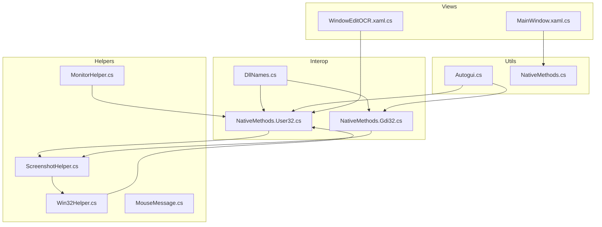
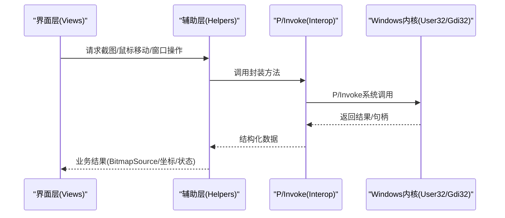
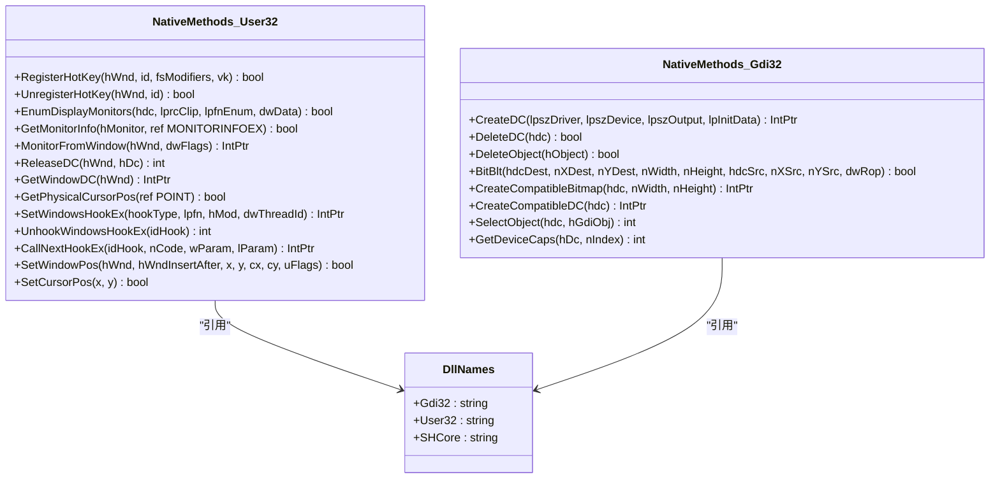
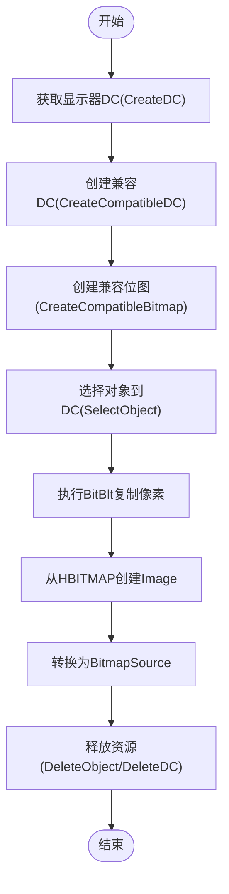
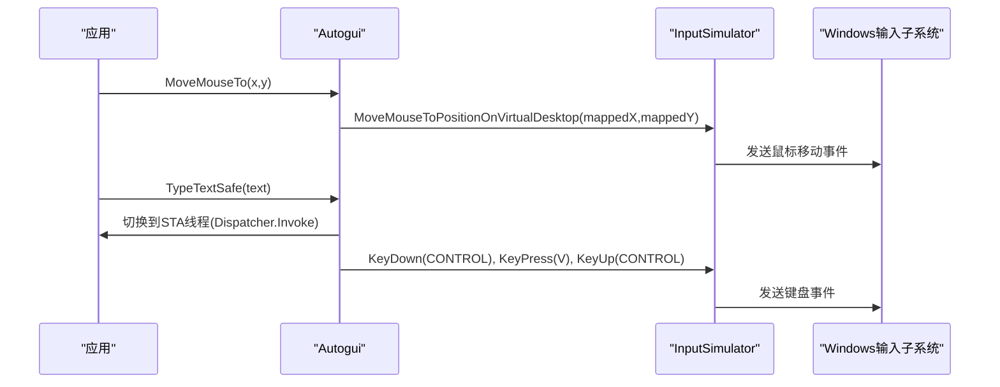
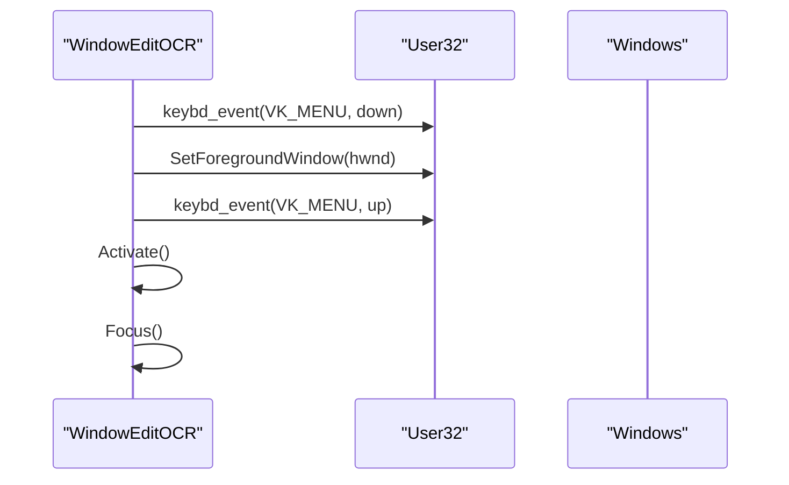
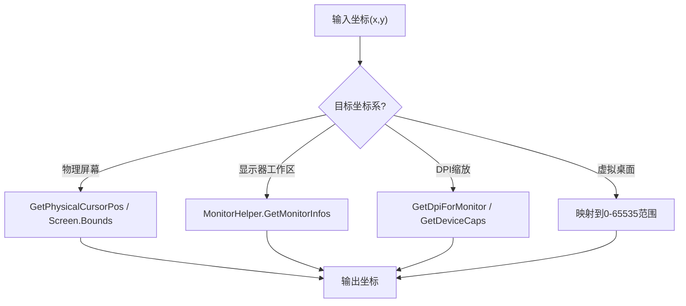
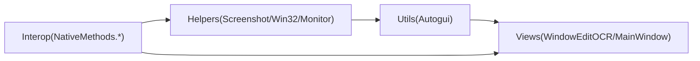

# Windows API集成

<cite>
**本文引用的文件**   
- [NativeMethods.cs](file://ShaoLu/Utils/NativeMethods.cs)
- [NativeMethods.User32.cs](file://ShaoLu/Tools/ImageEdit/Interop/NativeMethods.User32.cs)
- [NativeMethods.Gdi32.cs](file://ShaoLu/Tools/ImageEdit/Interop/NativeMethods.Gdi32.cs)
- [DllNames.cs](file://ShaoLu/Tools/ImageEdit/Interop/DllNames.cs)
- [ScreenshotHelper.cs](file://ShaoLu/Tools/ImageEdit/Helpers/ScreenshotHelper.cs)
- [Win32Helper.cs](file://ShaoLu/Tools/ImageEdit/Helpers/Win32Helper.cs)
- [MonitorHelper.cs](file://ShaoLu/Tools/ImageEdit/Helpers/MonitorHelper.cs)
- [MouseMessage.cs](file://ShaoLu/Tools/ImageEdit/Helpers/MouseMessage.cs)
- [Autogui.cs](file://ShaoLu/Utils/Autogui.cs)
- [WindowEditOCR.xaml.cs](file://ShaoLu/Views/WindowEditOCR.xaml.cs)
- [MainWindow.xaml.cs](file://ShaoLu/MainWindow.xaml.cs)
</cite>

## 目录
1. [简介](#简介)
2. [项目结构](#项目结构)
3. [核心组件](#核心组件)
4. [架构总览](#架构总览)
5. [详细组件分析](#详细组件分析)
6. [依赖关系分析](#依赖关系分析)
7. [性能考量](#性能考量)
8. [故障排除指南](#故障排除指南)
9. [结论](#结论)

## 简介
本技术文档聚焦于Windows API集成的实现与使用，涵盖P/Invoke声明、屏幕截图、鼠标键盘模拟、窗口操作、坐标系统转换以及多线程环境下的注意事项。代码库通过User32.dll与Gdi32.dll的底层调用完成高保真截图、全局鼠标钩子、DPI感知与多显示器支持；同时借助InputSimulator库生成虚拟输入事件，提供稳定的自动化控制能力。

## 项目结构
- Interop层：封装User32.dll与Gdi32.dll的P/Invoke声明，包括常量、结构体、枚举与方法。
- Helpers层：基于Interop进行高层封装，如截图、显示器信息、鼠标钩子等。
- Utils层：面向业务的高层API，如图像识别、文本输入、鼠标移动等。
- Views层：UI交互与窗口管理，包含前台激活、快捷键处理等。

图表来源
- [NativeMethods.User32.cs:1-190](file://ShaoLu/Tools/ImageEdit/Interop/NativeMethods.User32.cs#L1-L190)
- [NativeMethods.Gdi32.cs:1-231](file://ShaoLu/Tools/ImageEdit/Interop/NativeMethods.Gdi32.cs#L1-L231)
- [DllNames.cs:1-11](file://ShaoLu/Tools/ImageEdit/Interop/DllNames.cs#L1-L11)
- [ScreenshotHelper.cs:1-144](file://ShaoLu/Tools/ImageEdit/Helpers/ScreenshotHelper.cs#L1-L144)
- [Win32Helper.cs:1-52](file://ShaoLu/Tools/ImageEdit/Helpers/Win32Helper.cs#L1-L52)
- [MonitorHelper.cs:1-71](file://ShaoLu/Tools/ImageEdit/Helpers/MonitorHelper.cs#L1-L71)
- [MouseMessage.cs:1-13](file://ShaoLu/Tools/ImageEdit/Helpers/MouseMessage.cs#L1-L13)
- [Autogui.cs:1-584](file://ShaoLu/Utils/Autogui.cs#L1-L584)
- [WindowEditOCR.xaml.cs:111-153](file://ShaoLu/Views/WindowEditOCR.xaml.cs#L111-L153)
- [MainWindow.xaml.cs:37-68](file://ShaoLu/MainWindow.xaml.cs#L37-L68)

章节来源
- [NativeMethods.User32.cs:1-190](file://ShaoLu/Tools/ImageEdit/Interop/NativeMethods.User32.cs#L1-L190)
- [NativeMethods.Gdi32.cs:1-231](file://ShaoLu/Tools/ImageEdit/Interop/NativeMethods.Gdi32.cs#L1-L231)
- [DllNames.cs:1-11](file://ShaoLu/Tools/ImageEdit/Interop/DllNames.cs#L1-L11)
- [ScreenshotHelper.cs:1-144](file://ShaoLu/Tools/ImageEdit/Helpers/ScreenshotHelper.cs#L1-L144)
- [Win32Helper.cs:1-52](file://ShaoLu/Tools/ImageEdit/Helpers/Win32Helper.cs#L1-L52)
- [MonitorHelper.cs:1-71](file://ShaoLu/Tools/ImageEdit/Helpers/MonitorHelper.cs#L1-L71)
- [MouseMessage.cs:1-13](file://ShaoLu/Tools/ImageEdit/Helpers/MouseMessage.cs#L1-L13)
- [Autogui.cs:1-584](file://ShaoLu/Utils/Autogui.cs#L1-L584)
- [WindowEditOCR.xaml.cs:111-153](file://ShaoLu/Views/WindowEditOCR.xaml.cs#L111-L153)
- [MainWindow.xaml.cs:37-68](file://ShaoLu/MainWindow.xaml.cs#L37-L68)

## 核心组件
- P/Invoke声明（User32/Gdi32）：集中定义系统函数、结构体与枚举，为上层功能提供稳定接口。
- 屏幕截图：通过GDI的DC、位图与BitBlt实现高效全屏或区域截图，并转换为WPF BitmapSource。
- 鼠标键盘模拟：基于InputSimulator生成虚拟输入事件，支持虚拟桌面坐标映射与剪贴板粘贴。
- 窗口操作：SetWindowPos、SetForegroundWindow、keybd_event等用于窗口定位、激活与状态控制。
- 坐标系统：物理屏幕坐标、客户区坐标、虚拟桌面坐标与DPI缩放因子转换。
- 热键与钩子：RegisterHotKey与WH_MOUSE_LL钩子实现全局快捷键与鼠标事件捕获。

章节来源
- [NativeMethods.User32.cs:1-190](file://ShaoLu/Tools/ImageEdit/Interop/NativeMethods.User32.cs#L1-L190)
- [NativeMethods.Gdi32.cs:1-231](file://ShaoLu/Tools/ImageEdit/Interop/NativeMethods.Gdi32.cs#L1-L231)
- [ScreenshotHelper.cs:1-144](file://ShaoLu/Tools/ImageEdit/Helpers/ScreenshotHelper.cs#L1-L144)
- [Autogui.cs:1-584](file://ShaoLu/Utils/Autogui.cs#L1-L584)
- [WindowEditOCR.xaml.cs:111-153](file://ShaoLu/Views/WindowEditOCR.xaml.cs#L111-L153)
- [MainWindow.xaml.cs:37-68](file://ShaoLu/MainWindow.xaml.cs#L37-L68)

## 架构总览
整体架构遵循“Interop → Helpers → Utils → Views”的分层设计：
- Interop层直接绑定系统DLL，暴露最小必要接口。
- Helpers层组合多个Interop调用，封装复杂流程（如截图、显示器枚举、鼠标钩子）。
- Utils层提供业务友好的方法（图像匹配、输入模拟、文本输入）。
- Views层负责UI交互与窗口生命周期管理。

图表来源
- [ScreenshotHelper.cs:93-121](file://ShaoLu/Tools/ImageEdit/Helpers/ScreenshotHelper.cs#L93-L121)
- [Win32Helper.cs:12-42](file://ShaoLu/Tools/ImageEdit/Helpers/Win32Helper.cs#L12-L42)
- [NativeMethods.User32.cs:43-85](file://ShaoLu/Tools/ImageEdit/Interop/NativeMethods.User32.cs#L43-L85)
- [NativeMethods.Gdi32.cs:14-36](file://ShaoLu/Tools/ImageEdit/Interop/NativeMethods.Gdi32.cs#L14-L36)

## 详细组件分析

### P/Invoke声明（User32.dll与Gdi32.dll）
- User32相关：
  - 热键注册/注销：RegisterHotKey、UnregisterHotKey
  - 显示器枚举与信息：EnumDisplayMonitors、GetMonitorInfo、MonitorFromWindow
  - DC操作：ReleaseDC、GetWindowDC
  - 光标位置：GetPhysicalCursorPos
  - 钩子系统：SetWindowsHookEx、UnhookWindowsHookEx、CallNextHookEx
  - 窗口操作：SetWindowPos、SetCursorPos
- Gdi32相关：
  - DC创建/删除：CreateDC、DeleteDC
  - 位图操作：CreateCompatibleBitmap、SelectObject、DeleteObject
  - 像素拷贝：BitBlt（含CAPTUREBLT）
  - 设备能力：GetDeviceCaps（DPI、分辨率等）

图表来源
- [NativeMethods.User32.cs:43-85](file://ShaoLu/Tools/ImageEdit/Interop/NativeMethods.User32.cs#L43-L85)
- [NativeMethods.Gdi32.cs:14-36](file://ShaoLu/Tools/ImageEdit/Interop/NativeMethods.Gdi32.cs#L14-L36)
- [DllNames.cs:1-11](file://ShaoLu/Tools/ImageEdit/Interop/DllNames.cs#L1-L11)

章节来源
- [NativeMethods.User32.cs:1-190](file://ShaoLu/Tools/ImageEdit/Interop/NativeMethods.User32.cs#L1-L190)
- [NativeMethods.Gdi32.cs:1-231](file://ShaoLu/Tools/ImageEdit/Interop/NativeMethods.Gdi32.cs#L1-L231)
- [DllNames.cs:1-11](file://ShaoLu/Tools/ImageEdit/Interop/DllNames.cs#L1-L11)

### 屏幕截图实现原理（CaptureWindow、BitBlt、GetDC）
- 获取显示器DC：CreateDC("DISPLAY", ...)
- 创建兼容DC与位图：CreateCompatibleDC、CreateCompatibleBitmap、SelectObject
- 像素拷贝：BitBlt(..., SRCCOPY | CAPTUREBLT)
- 资源释放：DeleteObject、DeleteDC
- 转换为WPF BitmapSource：System.Drawing.Image.FromHbitmap后转BitmapImage

图表来源
- [ScreenshotHelper.cs:98-121](file://ShaoLu/Tools/ImageEdit/Helpers/ScreenshotHelper.cs#L98-L121)
- [NativeMethods.Gdi32.cs:14-36](file://ShaoLu/Tools/ImageEdit/Interop/NativeMethods.Gdi32.cs#L14-L36)

章节来源
- [ScreenshotHelper.cs:93-121](file://ShaoLu/Tools/ImageEdit/Helpers/ScreenshotHelper.cs#L93-L121)
- [NativeMethods.Gdi32.cs:14-36](file://ShaoLu/Tools/ImageEdit/Interop/NativeMethods.Gdi32.cs#L14-L36)

### 鼠标键盘模拟机制（InputSimulator）
- 鼠标移动：MoveMouseToPositionOnVirtualDesktop，将屏幕坐标映射到虚拟桌面坐标系（0–65535范围）。
- 点击与按键：LeftButtonClick、TextEntry、KeyDown/KeyPress/KeyUp。
- 安全输入：TypeTextSafe通过剪贴板+Ctrl+V方式避免输入法干扰，并在STA线程执行以确保剪贴板访问安全。

图表来源
- [Autogui.cs:193-196](file://ShaoLu/Utils/Autogui.cs#L193-L196)
- [Autogui.cs:497-511](file://ShaoLu/Utils/Autogui.cs#L497-L511)
- [Autogui.cs:551-579](file://ShaoLu/Utils/Autogui.cs#L551-L579)

章节来源
- [Autogui.cs:193-196](file://ShaoLu/Utils/Autogui.cs#L193-L196)
- [Autogui.cs:497-511](file://ShaoLu/Utils/Autogui.cs#L497-L511)
- [Autogui.cs:551-579](file://ShaoLu/Utils/Autogui.cs#L551-L579)

### 窗口操作API（查找、激活、状态控制）
- SetWindowPos：设置窗口位置与层级（HWND_TOPMOST、SWP_NOZORDER等）。
- SetForegroundWindow：强制窗口到前台，结合keybd_event绕过前台锁定。
- ShowWindow/Activate/Focus：窗口显示与焦点管理。

图表来源
- [WindowEditOCR.xaml.cs:111-121](file://ShaoLu/Views/WindowEditOCR.xaml.cs#L111-L121)
- [NativeMethods.User32.cs:77-85](file://ShaoLu/Tools/ImageEdit/Interop/NativeMethods.User32.cs#L77-L85)

章节来源
- [WindowEditOCR.xaml.cs:111-121](file://ShaoLu/Views/WindowEditOCR.xaml.cs#L111-L121)
- [NativeMethods.User32.cs:77-85](file://ShaoLu/Tools/ImageEdit/Interop/NativeMethods.User32.cs#L77-L85)

### 坐标系统转换（屏幕、客户区、虚拟桌面）
- 物理屏幕坐标：GetPhysicalCursorPos返回当前物理坐标。
- 显示器工作区：MonitorHelper.GetMonitorInfos枚举显示器，获取WorkArea与Monitor矩形。
- DPI缩放：GetDpiForMonitor或GetDeviceCaps(Logpixelsx/y)计算缩放因子。
- 虚拟桌面坐标：InputSimulator使用0–65535范围，需按屏幕宽度比例映射。

图表来源
- [Win32Helper.cs:44-49](file://ShaoLu/Tools/ImageEdit/Helpers/Win32Helper.cs#L44-L49)
- [MonitorHelper.cs:16-36](file://ShaoLu/Tools/ImageEdit/Helpers/MonitorHelper.cs#L16-L36)
- [MonitorHelper.cs:38-68](file://ShaoLu/Tools/ImageEdit/Helpers/MonitorHelper.cs#L38-L68)
- [Autogui.cs:193-196](file://ShaoLu/Utils/Autogui.cs#L193-L196)

章节来源
- [Win32Helper.cs:44-49](file://ShaoLu/Tools/ImageEdit/Helpers/Win32Helper.cs#L44-L49)
- [MonitorHelper.cs:16-36](file://ShaoLu/Tools/ImageEdit/Helpers/MonitorHelper.cs#L16-L36)
- [MonitorHelper.cs:38-68](file://ShaoLu/Tools/ImageEdit/Helpers/MonitorHelper.cs#L38-L68)
- [Autogui.cs:193-196](file://ShaoLu/Utils/Autogui.cs#L193-L196)

### 多线程环境下的API调用注意事项
- 全局钩子：WH_MOUSE_LL在回调中Marshal结构体并转发事件，需在析构时正确Unhook与释放GCHandle。
- 剪贴板操作：必须在STA线程执行，Autogui.TypeTextSafe通过Dispatcher.Invoke确保线程安全。
- 资源管理：GDI句柄（DC、位图）必须成对创建与释放，避免泄漏。
- 异常处理：AutomationElement与COM调用可能抛出异常，需捕获并降级处理。

章节来源
- [Win32Helper.cs:12-42](file://ShaoLu/Tools/ImageEdit/Helpers/Win32Helper.cs#L12-L42)
- [Autogui.cs:551-579](file://ShaoLu/Utils/Autogui.cs#L551-L579)
- [ScreenshotHelper.cs:116-121](file://ShaoLu/Tools/ImageEdit/Helpers/ScreenshotHelper.cs#L116-L121)
- [RectDetector.cs:84-104](file://ShaoLu/Tools/ImageEdit/Helpers/RectDetector.cs#L84-L104)

## 依赖关系分析
- Interop层依赖系统DLL（User32/Gdi32），无其他托管依赖。
- Helpers层依赖Interop与部分.NET类型（System.Drawing、System.Windows）。
- Utils层依赖Interop、System.Drawing、OpenCvSharp、WindowsInput。
- Views层依赖WPF框架与Interop。

图表来源
- [NativeMethods.User32.cs:1-190](file://ShaoLu/Tools/ImageEdit/Interop/NativeMethods.User32.cs#L1-L190)
- [NativeMethods.Gdi32.cs:1-231](file://ShaoLu/Tools/ImageEdit/Interop/NativeMethods.Gdi32.cs#L1-L231)
- [ScreenshotHelper.cs:1-144](file://ShaoLu/Tools/ImageEdit/Helpers/ScreenshotHelper.cs#L1-L144)
- [Autogui.cs:1-584](file://ShaoLu/Utils/Autogui.cs#L1-L584)
- [WindowEditOCR.xaml.cs:111-153](file://ShaoLu/Views/WindowEditOCR.xaml.cs#L111-L153)
- [MainWindow.xaml.cs:37-68](file://ShaoLu/MainWindow.xaml.cs#L37-L68)

章节来源
- [NativeMethods.User32.cs:1-190](file://ShaoLu/Tools/ImageEdit/Interop/NativeMethods.User32.cs#L1-L190)
- [NativeMethods.Gdi32.cs:1-231](file://ShaoLu/Tools/ImageEdit/Interop/NativeMethods.Gdi32.cs#L1-L231)
- [ScreenshotHelper.cs:1-144](file://ShaoLu/Tools/ImageEdit/Helpers/ScreenshotHelper.cs#L1-L144)
- [Autogui.cs:1-584](file://ShaoLu/Utils/Autogui.cs#L1-L584)
- [WindowEditOCR.xaml.cs:111-153](file://ShaoLu/Views/WindowEditOCR.xaml.cs#L111-L153)
- [MainWindow.xaml.cs:37-68](file://ShaoLu/MainWindow.xaml.cs#L37-L68)

## 性能考量
- 截图优化：使用CAPTUREBLT提升带透明层的截图质量；批量释放GDI资源减少内存压力。
- DPI感知：优先使用GetDpiForMonitor（Windows 8.1+），否则回退到GetDeviceCaps。
- 输入模拟：InputSimulator的虚拟桌面坐标映射避免跨显示器偏移问题。
- 钩子性能：WH_MOUSE_LL回调轻量处理，避免阻塞消息泵。

[本节为通用指导，不直接分析具体文件]

## 故障排除指南
- 权限问题：
  - 某些窗口无法激活或截图失败，可能需要管理员权限运行程序。
  - SetForegroundWindow被前台锁定阻止时，先模拟Alt键再调用。
- 兼容性考虑：
  - 多显示器与DPI缩放：确保使用物理坐标与工作区坐标，避免错位。
  - 旧版系统不支持GetDpiForMonitor时，回退到GetDeviceCaps。
- 常见错误：
  - GDI句柄泄漏：检查CreateDC/BitBlt后是否调用DeleteDC/DeleteObject。
  - STA线程限制：剪贴板操作必须在UI线程执行。
  - 钩子未卸载：确保Dispose时调用UnhookWindowsHookEx并释放GCHandle。

章节来源
- [WindowEditOCR.xaml.cs:111-121](file://ShaoLu/Views/WindowEditOCR.xaml.cs#L111-L121)
- [MonitorHelper.cs:38-68](file://ShaoLu/Tools/ImageEdit/Helpers/MonitorHelper.cs#L38-L68)
- [ScreenshotHelper.cs:116-121](file://ShaoLu/Tools/ImageEdit/Helpers/ScreenshotHelper.cs#L116-L121)
- [Win32Helper.cs:26-31](file://ShaoLu/Tools/ImageEdit/Helpers/Win32Helper.cs#L26-L31)

## 结论
本项目通过清晰的层次化设计与稳健的P/Invoke封装，实现了可靠的屏幕截图、鼠标键盘模拟与窗口操作能力。在多显示器与DPI环境下表现良好，且在多线程场景中具备必要的线程安全与资源管理能力。建议在生产环境中加强异常日志与资源监控，进一步提升稳定性与可维护性。