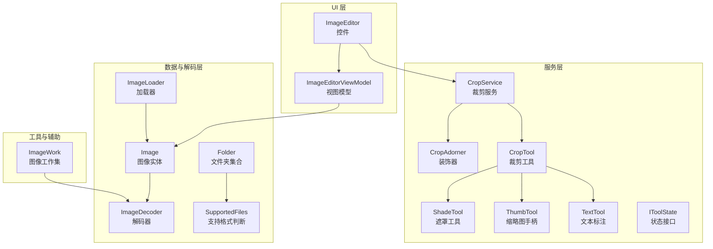
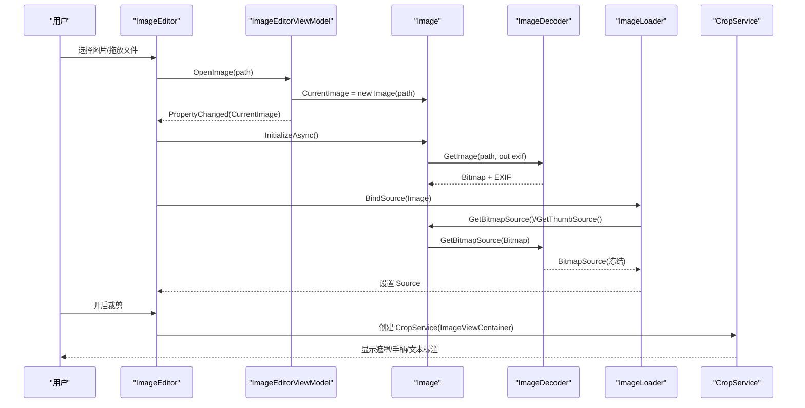
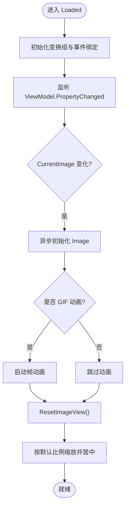
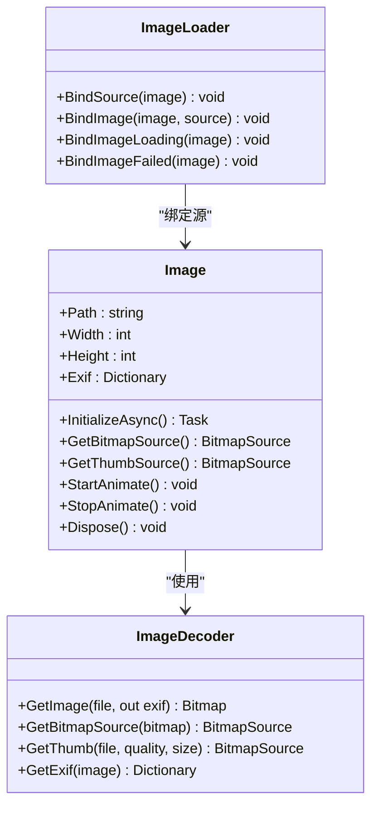
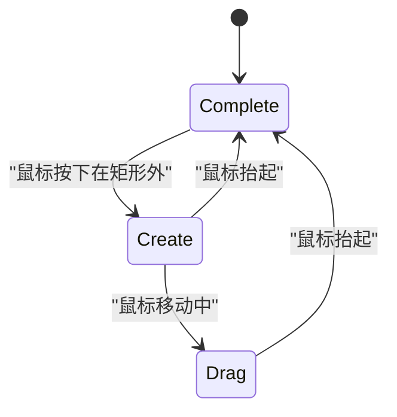
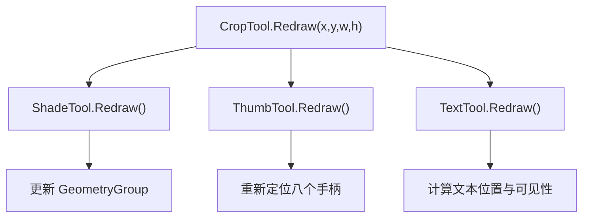
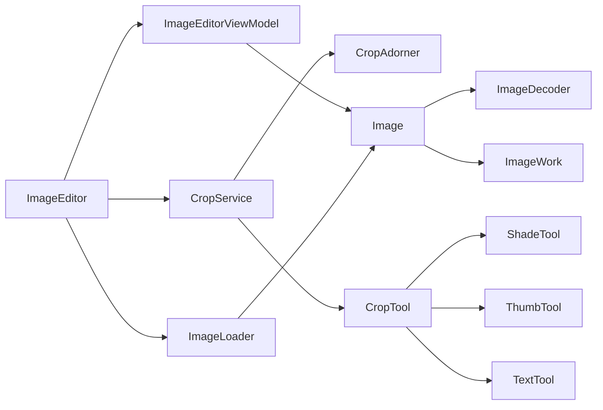

# 图像处理工具

<cite>
**本文引用的文件**   
- [ImageEditor.xaml.cs](file://ShaoLu/Tools/ImageEdit/ImageEditor.xaml.cs)
- [ImageEditorViewModel.cs](file://ShaoLu/Tools/ImageEdit/ImageEditorViewModel.cs)
- [Image.cs](file://ShaoLu/Tools/ImageEdit/Image.cs)
- [ImageLoader.cs](file://ShaoLu/Tools/ImageEdit/ImageLoader.cs)
- [ImageDecoder.cs](file://ShaoLu/Tools/ImageEdit/ImageDecoder.cs)
- [CropService.cs](file://ShaoLu/Tools/ImageEdit/services/CropService.cs)
- [CropTool.cs](file://ShaoLu/Tools/ImageEdit/services/Tools/CropTool.cs)
- [ShadeTool.cs](file://ShaoLu/Tools/ImageEdit/services/Tools/ShadeTool.cs)
- [ThumbTool.cs](file://ShaoLu/Tools/ImageEdit/services/Tools/ThumbTool.cs)
- [TextTool.cs](file://ShaoLu/Tools/ImageEdit/services/Tools/TextTool.cs)
- [CropAdorner.cs](file://ShaoLu/Tools/ImageEdit/services/CropAdorner.cs)
- [IToolState.cs](file://ShaoLu/Tools/ImageEdit/services/State/IToolState.cs)
- [ImageWork.cs](file://ShaoLu/Tools/ImageEdit/Utils/ImageWork.cs)
- [Folder.cs](file://ShaoLu/Tools/ImageEdit/Folder.cs)
- [SupportedFiles.cs](file://ShaoLu/Tools/ImageEdit/SupportedFiles.cs)
</cite>

## 目录
1. [简介](#简介)
2. [项目结构](#项目结构)
3. [核心组件](#核心组件)
4. [架构总览](#架构总览)
5. [详细组件分析](#详细组件分析)
6. [依赖关系分析](#依赖关系分析)
7. [性能考量](#性能考量)
8. [故障排查指南](#故障排查指南)
9. [结论](#结论)
10. [附录](#附录)

## 简介
本技术文档围绕 WPF 图像编辑工具 ImageEditor 组件，系统阐述其功能架构与实现细节。重点覆盖：
- 裁剪、标注、缩放等编辑操作的交互与实现
- 图像格式转换机制（WPF ImageSource 与 System.Drawing.Bitmap 的双向转换）
- 图像编辑工具栏（画笔、矩形框、文本标注等绘图工具）
- 裁剪功能的用户交互设计（拖拽调整、预览效果、最终确认流程）
- 图像质量优化（抗锯齿、插值算法、压缩设置）
- 批量处理能力（多文件操作与进度反馈）
- 自定义扩展接口（新增图像处理能力）
- 性能优化策略（异步处理与内存管理最佳实践）

## 项目结构
该模块位于 ShaoLu/Tools/ImageEdit 下，采用分层组织：
- UI 层：ImageEditor 控件及其 ViewModel
- 服务层：CropService、CropAdorner、状态机 IToolState 与各工具（CropTool、ShadeTool、ThumbTool、TextTool）
- 数据与解码层：Image、ImageLoader、ImageDecoder、Folder、SupportedFiles
- 工具与辅助：ImageWork（图像编解码与转换）、NumberUtils（数值格式化）

图表来源 
- [ImageEditor.xaml.cs:163-210](file://ShaoLu/Tools/ImageEdit/ImageEditor.xaml.cs#L163-L210)
- [ImageEditorViewModel.cs:1-116](file://ShaoLu/Tools/ImageEdit/ImageEditorViewModel.cs#L1-L116)
- [CropService.cs:26-118](file://ShaoLu/Tools/ImageEdit/services/CropService.cs#L26-L118)
- [CropTool.cs:22-58](file://ShaoLu/Tools/ImageEdit/services/Tools/CropTool.cs#L22-L58)
- [Image.cs:16-171](file://ShaoLu/Tools/ImageEdit/Image.cs#L16-L171)
- [ImageLoader.cs:18-112](file://ShaoLu/Tools/ImageEdit/ImageLoader.cs#L18-L112)
- [ImageDecoder.cs:14-221](file://ShaoLu/Tools/ImageEdit/ImageDecoder.cs#L14-L221)
- [Folder.cs:8-33](file://ShaoLu/Tools/ImageEdit/Folder.cs#L8-L33)
- [SupportedFiles.cs:9-73](file://ShaoLu/Tools/ImageEdit/SupportedFiles.cs#L9-L73)

章节来源
- [ImageEditor.xaml.cs:163-210](file://ShaoLu/Tools/ImageEdit/ImageEditor.xaml.cs#L163-L210)
- [ImageEditorViewModel.cs:1-116](file://ShaoLu/Tools/ImageEdit/ImageEditorViewModel.cs#L1-L116)
- [Folder.cs:8-33](file://ShaoLu/Tools/ImageEdit/Folder.cs#L8-L33)
- [SupportedFiles.cs:9-73](file://ShaoLu/Tools/ImageEdit/SupportedFiles.cs#L9-L73)

## 核心组件
- ImageEditor：WPF UserControl，承载图像查看、变换（平移/旋转/缩放）、拖放、快捷键、裁剪开关、保存/打开按钮控制等。通过属性绑定与事件驱动更新 UI。
- ImageEditorViewModel：维护当前图像、文件夹列表、加载状态、失败状态等，提供 PropertyChanged 通知。
- Image：封装单张图像的元数据（路径、尺寸、EXIF）、异步初始化、BitmapSource 获取、GIF 动画播放与资源释放。
- ImageLoader：附加属性绑定，后台线程加载并设置 BitmapSource，支持原图与缩略图模式。
- ImageDecoder：基于 ImageMagick 的解码与 EXIF 提取；提供 Bitmap->BitmapSource 转换与高质量缩略图生成。
- CropService：裁剪交互服务，使用 Adorner 叠加 Canvas，协调 Create/Drag/Complete 状态机与 CropTool 重绘。
- CropTool：绘制裁剪框、遮罩、缩略图手柄、文本标注，统一 Redraw 接口。
- ShadeTool：基于 GeometryGroup 的半透明遮罩，挖空裁剪区域。
- ThumbTool：八方向缩放手柄，响应 DragDelta 计算新矩形并重绘。
- TextTool：显示裁剪尺寸信息，动态定位与可见性控制。
- Folder/SupportedFiles：文件夹扫描与扩展名白名单过滤。

章节来源
- [ImageEditor.xaml.cs:25-210](file://ShaoLu/Tools/ImageEdit/ImageEditor.xaml.cs#L25-L210)
- [ImageEditorViewModel.cs:1-116](file://ShaoLu/Tools/ImageEdit/ImageEditorViewModel.cs#L1-L116)
- [Image.cs:16-171](file://ShaoLu/Tools/ImageEdit/Image.cs#L16-L171)
- [ImageLoader.cs:18-112](file://ShaoLu/Tools/ImageEdit/ImageLoader.cs#L18-L112)
- [ImageDecoder.cs:14-221](file://ShaoLu/Tools/ImageEdit/ImageDecoder.cs#L14-L221)
- [CropService.cs:26-118](file://ShaoLu/Tools/ImageEdit/services/CropService.cs#L26-L118)
- [CropTool.cs:22-58](file://ShaoLu/Tools/ImageEdit/services/Tools/CropTool.cs#L22-L58)
- [ShadeTool.cs:1-73](file://ShaoLu/Tools/ImageEdit/services/Tools/ShadeTool.cs#L1-L73)
- [ThumbTool.cs:56-92](file://ShaoLu/Tools/ImageEdit/services/Tools/ThumbTool.cs#L56-L92)
- [TextTool.cs:1-58](file://ShaoLu/Tools/ImageEdit/services/Tools/TextTool.cs#L1-L58)
- [Folder.cs:8-33](file://ShaoLu/Tools/ImageEdit/Folder.cs#L8-L33)
- [SupportedFiles.cs:9-73](file://ShaoLu/Tools/ImageEdit/SupportedFiles.cs#L9-L73)

## 架构总览
整体采用 MVVM + 服务化架构：
- UI 层（ImageEditor）负责输入事件与动画变换
- ViewModel（ImageEditorViewModel）管理状态与数据
- 服务层（CropService 及 Tools）负责裁剪交互与可视化
- 数据层（Image、ImageLoader、ImageDecoder）负责解码、转换与缓存
- 工具层（ImageWork）提供通用图像处理能力

图表来源 
- [ImageEditor.xaml.cs:264-315](file://ShaoLu/Tools/ImageEdit/ImageEditor.xaml.cs#L264-L315)
- [ImageEditor.xaml.cs:219-259](file://ShaoLu/Tools/ImageEdit/ImageEditor.xaml.cs#L219-L259)
- [Image.cs:63-98](file://ShaoLu/Tools/ImageEdit/Image.cs#L63-L98)
- [ImageDecoder.cs:46-79](file://ShaoLu/Tools/ImageEdit/ImageDecoder.cs#L46-L79)
- [ImageLoader.cs:41-77](file://ShaoLu/Tools/ImageEdit/ImageLoader.cs#L41-L77)
- [CropService.cs:52-118](file://ShaoLu/Tools/ImageEdit/services/CropService.cs#L52-L118)

## 详细组件分析

### ImageEditor 组件
- 功能要点
  - 依赖属性：ImageSource、IsKeyInputEnabled、IsLoadFolder、ShowCutter、ShowOpen、ShowSave、PenColor、IsCoverSave
  - 事件绑定：拖放、键盘、鼠标滚轮、右键菜单、图片加载失败回调
  - 变换组：Translate/Scale/Rotate 组合，平滑动画与居中缩放
  - 缩放与平移：双击放大、滚轮缩放、拖拽平移、百分比实时显示
  - 导航：上一张/下一张切换，支持文件夹浏览
  - 裁剪开关：ShowCutter 控制 CropService 的显示与隐藏
- 关键流程
  - 属性变更触发初始化与重置视图
  - 动画过渡：Translate/Scale/Rotate 分别使用 DoubleAnimation 与缓动函数
  - 实际尺寸计算：遍历父级 ScaleTransform 累乘得到真实像素比例

图表来源 
- [ImageEditor.xaml.cs:163-210](file://ShaoLu/Tools/ImageEdit/ImageEditor.xaml.cs#L163-L210)
- [ImageEditor.xaml.cs:219-259](file://ShaoLu/Tools/ImageEdit/ImageEditor.xaml.cs#L219-L259)
- [ImageEditor.xaml.cs:317-351](file://ShaoLu/Tools/ImageEdit/ImageEditor.xaml.cs#L317-L351)
- [ImageEditor.xaml.cs:458-492](file://ShaoLu/Tools/ImageEdit/ImageEditor.xaml.cs#L458-L492)
- [ImageEditor.xaml.cs:525-607](file://ShaoLu/Tools/ImageEdit/ImageEditor.xaml.cs#L525-L607)
- [ImageEditor.xaml.cs:609-674](file://ShaoLu/Tools/ImageEdit/ImageEditor.xaml.cs#L609-L674)
- [ImageEditor.xaml.cs:751-800](file://ShaoLu/Tools/ImageEdit/ImageEditor.xaml.cs#L751-L800)

章节来源
- [ImageEditor.xaml.cs:25-210](file://ShaoLu/Tools/ImageEdit/ImageEditor.xaml.cs#L25-L210)
- [ImageEditor.xaml.cs:264-315](file://ShaoLu/Tools/ImageEdit/ImageEditor.xaml.cs#L264-L315)
- [ImageEditor.xaml.cs:317-351](file://ShaoLu/Tools/ImageEdit/ImageEditor.xaml.cs#L317-L351)
- [ImageEditor.xaml.cs:458-492](file://ShaoLu/Tools/ImageEdit/ImageEditor.xaml.cs#L458-L492)
- [ImageEditor.xaml.cs:525-607](file://ShaoLu/Tools/ImageEdit/ImageEditor.xaml.cs#L525-L607)
- [ImageEditor.xaml.cs:609-674](file://ShaoLu/Tools/ImageEdit/ImageEditor.xaml.cs#L609-L674)
- [ImageEditor.xaml.cs:751-800](file://ShaoLu/Tools/ImageEdit/ImageEditor.xaml.cs#L751-L800)

### 图像解码与格式转换
- 解码与 EXIF
  - ImageDecoder.GetImage：优先使用 ImageMagick 读取，设置 Quality=100，转换为 System.Drawing.Bitmap；同时提取 EXIF 信息
  - ImageDecoder.GetExif：将常用 EXIF 标签映射为中文键值对
- 双向转换
  - Bitmap -> BitmapSource：CreateBitmapSourceFromHBitmap，释放 GDI 句柄
  - ImageSource -> Bitmap：LockBits + CopyPixels 写入 32bppPArgb
  - Bitmap -> BitmapImage：内存流 + Bmp 编码
- 缩略图
  - ImageDecoder.GetThumb：自适应缩放，Quality 可配置，返回冻结的 BitmapSource

图表来源 
- [ImageDecoder.cs:14-221](file://ShaoLu/Tools/ImageEdit/ImageDecoder.cs#L14-L221)
- [Image.cs:16-171](file://ShaoLu/Tools/ImageEdit/Image.cs#L16-L171)
- [ImageLoader.cs:18-112](file://ShaoLu/Tools/ImageEdit/ImageLoader.cs#L18-L112)

章节来源
- [ImageDecoder.cs:46-79](file://ShaoLu/Tools/ImageEdit/ImageDecoder.cs#L46-L79)
- [ImageDecoder.cs:81-108](file://ShaoLu/Tools/ImageEdit/ImageDecoder.cs#L81-L108)
- [ImageDecoder.cs:110-138](file://ShaoLu/Tools/ImageEdit/ImageDecoder.cs#L110-L138)
- [Image.cs:63-98](file://ShaoLu/Tools/ImageEdit/Image.cs#L63-L98)
- [ImageLoader.cs:41-77](file://ShaoLu/Tools/ImageEdit/ImageLoader.cs#L41-L77)

### 裁剪服务与交互状态机
- CropService
  - 通过 Adorner 在目标元素上叠加 Canvas，管理 Create/Drag/Complete 三种状态
  - 根据鼠标位置判断“矩形内/外”，切换状态并调用 CropTool.Redraw
  - 提供 GetCroppedArea 返回原始尺寸与绝对裁剪矩形
- CropTool
  - 维护裁剪框、遮罩、缩略图手柄、文本标注四个子工具
  - 统一 Redraw 接口，确保各子工具同步更新
- 状态接口 IToolState
  - OnMouseDown/OnMouseMove/OnMouseUp 定义交互契约

图表来源 
- [CropService.cs:26-118](file://ShaoLu/Tools/ImageEdit/services/CropService.cs#L26-L118)
- [CropService.cs:138-187](file://ShaoLu/Tools/ImageEdit/services/CropService.cs#L138-L187)
- [CropTool.cs:22-58](file://ShaoLu/Tools/ImageEdit/services/Tools/CropTool.cs#L22-L58)
- [IToolState.cs:1-11](file://ShaoLu/Tools/ImageEdit/services/State/IToolState.cs#L1-L11)

章节来源
- [CropService.cs:52-118](file://ShaoLu/Tools/ImageEdit/services/CropService.cs#L52-L118)
- [CropService.cs:138-187](file://ShaoLu/Tools/ImageEdit/services/CropService.cs#L138-L187)
- [CropTool.cs:22-58](file://ShaoLu/Tools/ImageEdit/services/Tools/CropTool.cs#L22-L58)
- [IToolState.cs:1-11](file://ShaoLu/Tools/ImageEdit/services/State/IToolState.cs#L1-L11)

### 遮罩、缩略图手柄与文本标注
- ShadeTool：GeometryGroup 挖空裁剪区域，随 Resize/Redraw 更新几何
- ThumbTool：八个方向的 ThumbCrop，DragDelta 计算新矩形边界，防止越界
- TextTool：显示 w/h 尺寸，自动定位到裁剪框左上角附近，尺寸无效时隐藏

图表来源 
- [CropTool.cs:65-71](file://ShaoLu/Tools/ImageEdit/services/Tools/CropTool.cs#L65-L71)
- [ShadeTool.cs:44-70](file://ShaoLu/Tools/ImageEdit/services/Tools/ShadeTool.cs#L44-L70)
- [ThumbTool.cs:229-246](file://ShaoLu/Tools/ImageEdit/services/Tools/ThumbTool.cs#L229-L246)
- [TextTool.cs:41-55](file://ShaoLu/Tools/ImageEdit/services/Tools/TextTool.cs#L41-L55)

章节来源
- [ShadeTool.cs:1-73](file://ShaoLu/Tools/ImageEdit/services/Tools/ShadeTool.cs#L1-L73)
- [ThumbTool.cs:94-226](file://ShaoLu/Tools/ImageEdit/services/Tools/ThumbTool.cs#L94-L226)
- [TextTool.cs:1-58](file://ShaoLu/Tools/ImageEdit/services/Tools/TextTool.cs#L1-L58)

### 图像质量优化与压缩
- 解码质量：ImageMagick 设置 Quality=100，避免解码阶段失真
- 缩略图：AdaptiveResize 自适应缩放，Quality 可配置，返回冻结的 BitmapSource
- 渲染质量：ImageEditor 启用 HighQuality 位图缩放模式；ImageLoader 设置 NearestNeighbor 用于精确像素显示
- 剪切与缩放：ImageWork.ClipImage 使用 HighQualityBicubic 插值，保持边缘平滑

章节来源
- [ImageDecoder.cs:62-68](file://ShaoLu/Tools/ImageEdit/ImageDecoder.cs#L62-L68)
- [ImageDecoder.cs:81-108](file://ShaoLu/Tools/ImageEdit/ImageDecoder.cs#L81-L108)
- [ImageEditor.xaml.cs:173-176](file://ShaoLu/Tools/ImageEdit/ImageEditor.xaml.cs#L173-L176)
- [ImageLoader.cs:84-88](file://ShaoLu/Tools/ImageEdit/ImageLoader.cs#L84-L88)
- [ImageWork.cs:211-234](file://ShaoLu/Tools/ImageEdit/Utils/ImageWork.cs#L211-L234)

### 批量图像处理能力
- Folder：扫描目录，过滤隐藏/系统/临时文件，仅添加 SupportedFiles.IsSupportedFile 支持的扩展名
- ImageEditor：支持文件夹模式 IsLoadFolder，上下页切换当前图像，适合批处理浏览
- 进度反馈：ImageLoader 使用 ThreadPool 与 Dispatcher 异步加载，避免阻塞 UI；可在上层封装任务队列与进度回调

章节来源
- [Folder.cs:14-30](file://ShaoLu/Tools/ImageEdit/Folder.cs#L14-L30)
- [SupportedFiles.cs:19-49](file://ShaoLu/Tools/ImageEdit/SupportedFiles.cs#L19-L49)
- [ImageEditor.xaml.cs:388-451](file://ShaoLu/Tools/ImageEdit/ImageEditor.xaml.cs#L388-L451)
- [ImageLoader.cs:48-77](file://ShaoLu/Tools/ImageEdit/ImageLoader.cs#L48-L77)

### 自定义扩展接口
- 工具扩展点
  - IToolState：新增交互状态（如锁定比例、约束角度）
  - CropTool：增加新的子工具（如椭圆选区、自由曲线），并在 Redraw 中统一刷新
  - CropService：注入新状态或手势识别逻辑
- 解码扩展点
  - ImageDecoder：新增编码器/解码器（如 WebP、HEIC），或调整 Quality/ColorSpace
- 保存与导出
  - ImageWork.SaveImageToFile：根据扩展名选择编码器，可扩展更多格式

章节来源
- [IToolState.cs:1-11](file://ShaoLu/Tools/ImageEdit/services/State/IToolState.cs#L1-L11)
- [CropTool.cs:22-58](file://ShaoLu/Tools/ImageEdit/services/Tools/CropTool.cs#L22-L58)
- [CropService.cs:26-118](file://ShaoLu/Tools/ImageEdit/services/CropService.cs#L26-L118)
- [ImageDecoder.cs:46-79](file://ShaoLu/Tools/ImageEdit/ImageDecoder.cs#L46-L79)
- [ImageWork.cs:155-182](file://ShaoLu/Tools/ImageEdit/Utils/ImageWork.cs#L155-L182)

## 依赖关系分析
- 耦合与内聚
  - ImageEditor 与 ViewModel 松耦合，通过属性与事件通信
  - CropService 与 CropTool 高内聚，职责清晰（交互 vs 绘制）
  - ImageDecoder 独立于 UI，便于复用
- 外部依赖
  - ImageMagick：高性能解码与 EXIF 读取
  - GDI32：释放 HBITMAP 句柄，避免内存泄漏
  - WPF 渲染管线：TransformGroup、Adorner、RenderTargetBitmap

图表来源 
- [ImageEditor.xaml.cs:163-210](file://ShaoLu/Tools/ImageEdit/ImageEditor.xaml.cs#L163-L210)
- [CropService.cs:26-118](file://ShaoLu/Tools/ImageEdit/services/CropService.cs#L26-L118)
- [CropTool.cs:22-58](file://ShaoLu/Tools/ImageEdit/services/Tools/CropTool.cs#L22-L58)
- [Image.cs:16-171](file://ShaoLu/Tools/ImageEdit/Image.cs#L16-L171)
- [ImageLoader.cs:18-112](file://ShaoLu/Tools/ImageEdit/ImageLoader.cs#L18-L112)
- [ImageDecoder.cs:14-221](file://ShaoLu/Tools/ImageEdit/ImageDecoder.cs#L14-L221)
- [ImageWork.cs:14-296](file://ShaoLu/Tools/ImageEdit/Utils/ImageWork.cs#L14-L296)

章节来源
- [ImageEditor.xaml.cs:163-210](file://ShaoLu/Tools/ImageEdit/ImageEditor.xaml.cs#L163-L210)
- [CropService.cs:26-118](file://ShaoLu/Tools/ImageEdit/services/CropService.cs#L26-L118)
- [ImageDecoder.cs:14-221](file://ShaoLu/Tools/ImageEdit/ImageDecoder.cs#L14-L221)
- [ImageWork.cs:14-296](file://ShaoLu/Tools/ImageEdit/Utils/ImageWork.cs#L14-L296)

## 性能考量
- 异步与并发
  - Image.InitializeAsync：后台线程解码与 EXIF 读取，避免 UI 卡顿
  - ImageLoader.BindSource：ThreadPool + Dispatcher 调度，保证 UI 线程安全
- 内存管理
  - Image.Dispose：停止动画、解绑事件、释放 Bitmap 并强制 GC
  - ImageDecoder.GetBitmapSource：及时释放 GDI 句柄，避免内存泄漏
- 渲染优化
  - RenderOptions.SetBitmapScalingMode：HighQuality 与 NearestNeighbor 按需切换
  - TransformGroup：组合变换减少多次重绘
- 批量处理建议
  - 使用队列与进度回调，限制并发解码数量
  - 缩略图优先展示，主图懒加载

章节来源
- [Image.cs:118-168](file://ShaoLu/Tools/ImageEdit/Image.cs#L118-L168)
- [ImageLoader.cs:48-77](file://ShaoLu/Tools/ImageEdit/ImageLoader.cs#L48-L77)
- [ImageDecoder.cs:19-44](file://ShaoLu/Tools/ImageEdit/ImageDecoder.cs#L19-L44)
- [ImageEditor.xaml.cs:173-176](file://ShaoLu/Tools/ImageEdit/ImageEditor.xaml.cs#L173-L176)

## 故障排查指南
- 图片加载失败
  - 现象：IsImageLoadFailed=true，显示失败占位图
  - 排查：检查文件路径、扩展名是否在 SupportedFiles 白名单；确认 ImageDecoder 异常日志
- GIF 动画不播放
  - 现象：未触发 SourceAnimate
  - 排查：确认 IsAnimation 判断与 ImageAnimator.CanAnimate；确保 StartAnimate 被调用
- 裁剪框不显示或错位
  - 现象：CropAdorner 未出现或尺寸异常
  - 排查：确认 ShowCutter 与 CropService 初始化；检查 SizeChanged 事件与 Resize 调用
- 内存占用过高
  - 现象：频繁 GC 或 OOM
  - 排查：确保 Dispose 调用；检查 GDI 句柄释放；避免重复解码同一文件

章节来源
- [ImageEditor.xaml.cs:353-362](file://ShaoLu/Tools/ImageEdit/ImageEditor.xaml.cs#L353-L362)
- [Image.cs:118-168](file://ShaoLu/Tools/ImageEdit/Image.cs#L118-L168)
- [ImageDecoder.cs:72-79](file://ShaoLu/Tools/ImageEdit/ImageDecoder.cs#L72-L79)
- [ImageLoader.cs:101-109](file://ShaoLu/Tools/ImageEdit/ImageLoader.cs#L101-L109)
- [CropService.cs:111-118](file://ShaoLu/Tools/ImageEdit/services/CropService.cs#L111-L118)

## 结论
ImageEditor 以清晰的 MVVM 与服务化架构，提供了完整的图像查看、变换与裁剪能力。借助 ImageMagick 的高性能解码与 WPF 渲染管线，实现了高质量的图像显示与交互体验。通过扩展 IToolState、CropTool 与 ImageDecoder，开发者可以便捷地添加新的编辑工具与格式支持。结合异步加载、内存管理与渲染优化策略，系统在批量处理场景下仍具备良好性能。

## 附录
- 快捷键与交互
  - 滚轮缩放、双击放大、拖拽平移、右键复位
  - 上一张/下一张导航，支持文件夹模式
- 输出与保存
  - 根据扩展名选择 PNG/JPEG 编码器
  - 可将 UI 截图导出为 PNG（用于调试或分享）

章节来源
- [ImageEditor.xaml.cs:525-607](file://ShaoLu/Tools/ImageEdit/ImageEditor.xaml.cs#L525-L607)
- [ImageEditor.xaml.cs:388-451](file://ShaoLu/Tools/ImageEdit/ImageEditor.xaml.cs#L388-L451)
- [ImageWork.cs:155-198](file://ShaoLu/Tools/ImageEdit/Utils/ImageWork.cs#L155-L198)