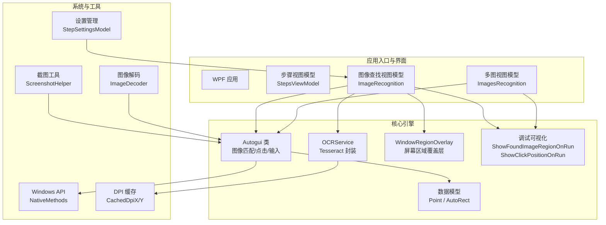
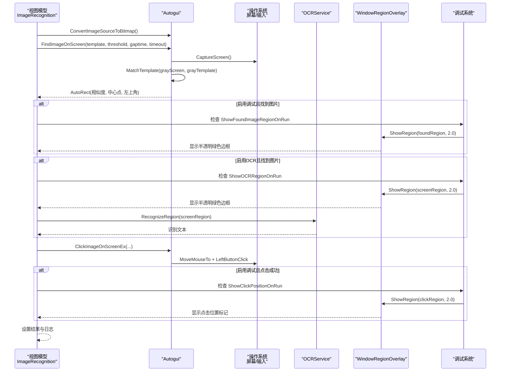
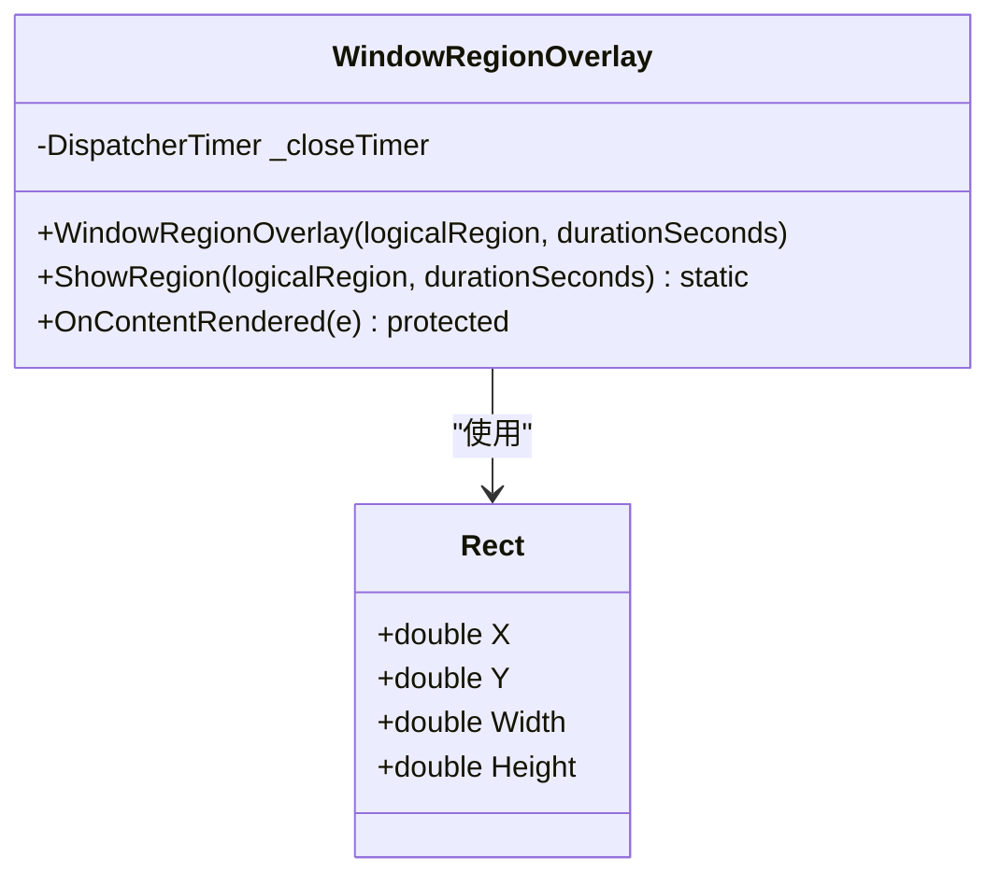
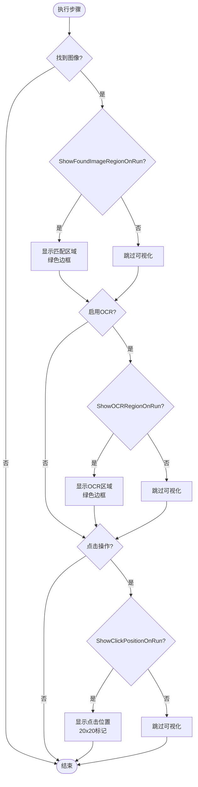
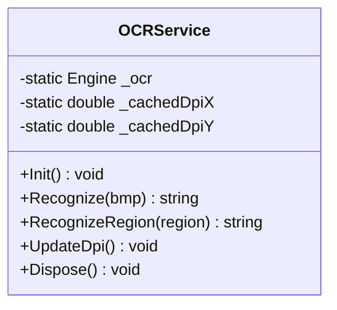
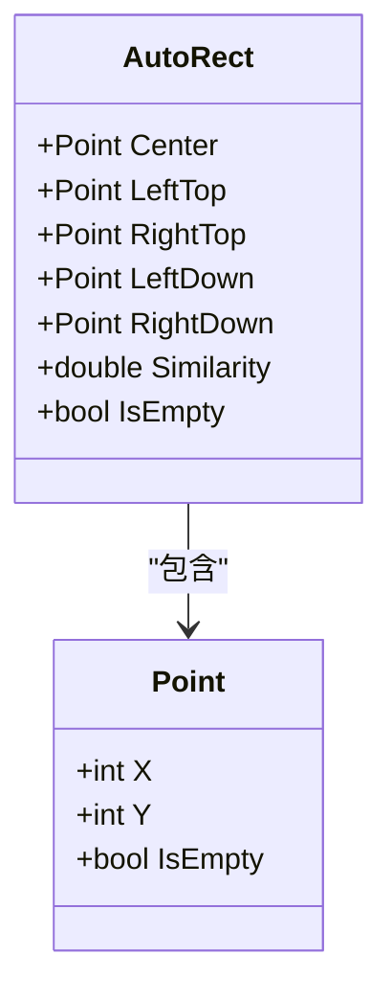
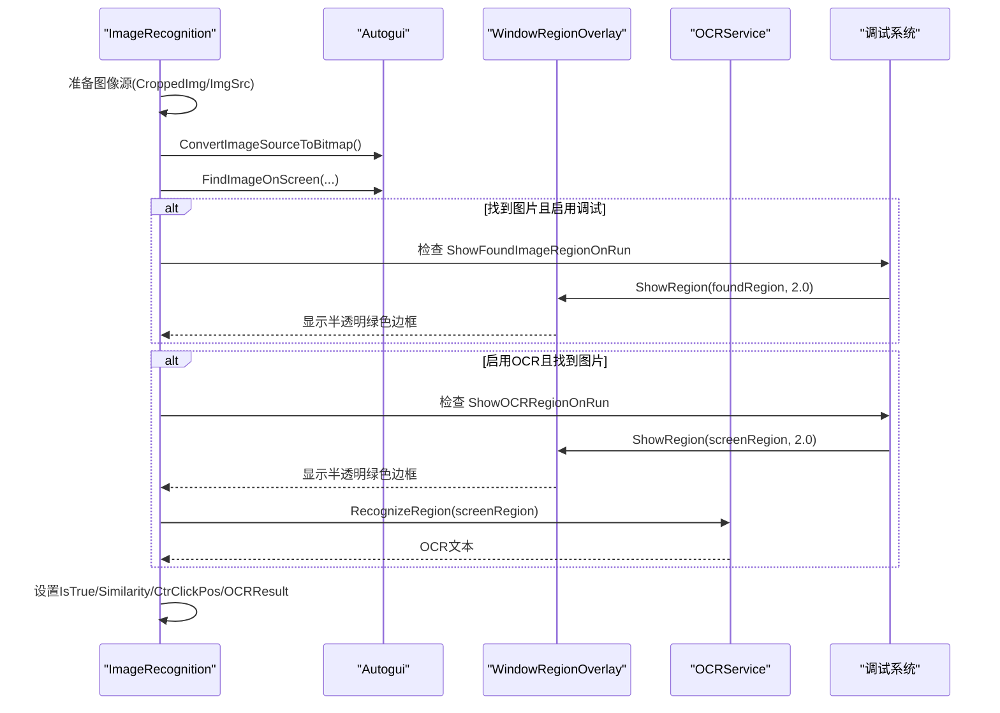
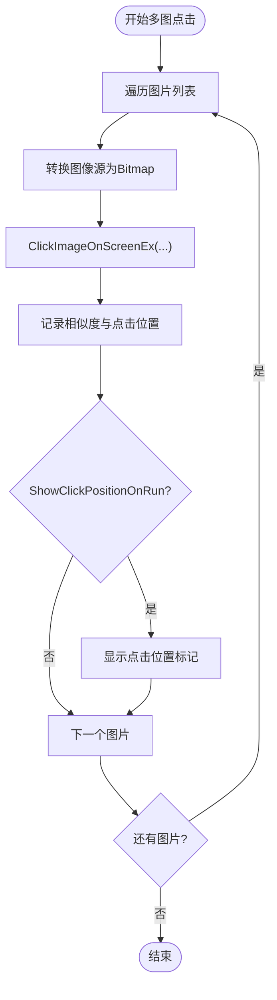
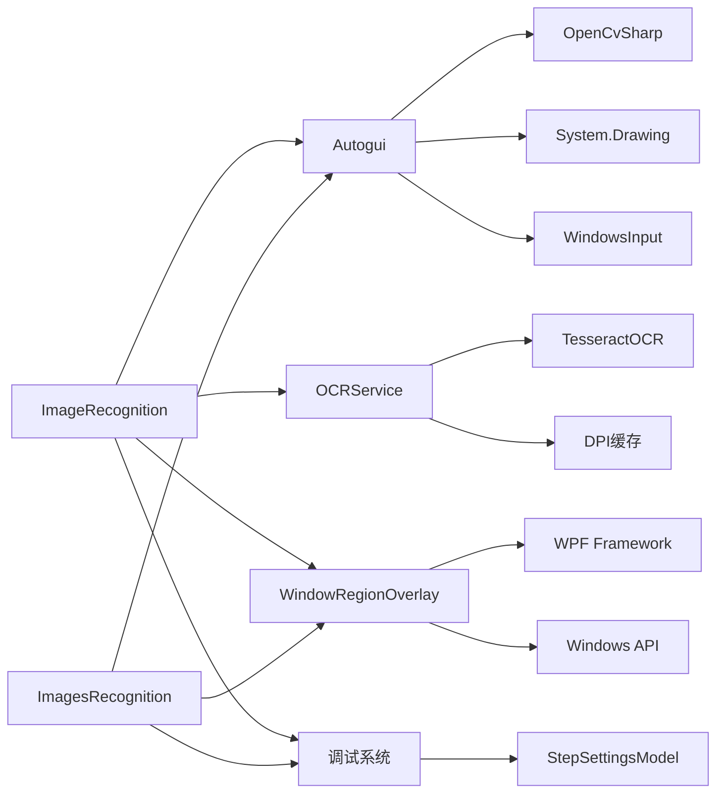

基于我对代码的分析，我现在可以更新技术文档。让我创建更新后的文档：

<cite>
**本文引用的文件**   
- [Autogui.cs](file://ShaoLu/Utils/Autogui.cs)
- [NativeMethods.cs](file://ShaoLu/Utils/NativeMethods.cs)
- [OCRService.cs](file://ShaoLu/services/OCRService.cs)
- [AutoguiModel.cs](file://ShaoLu/Models/AutoguiModel.cs)
- [ImageRecognition.cs](file://ShaoLu/Viewmodels/ImageRecognition.cs)
- [ImagesRecognition.cs](file://ShaoLu/Viewmodels/ImagesRecognition.cs)
- [LanguageService.cs](file://ShaoLu/services/LanguageService.cs)
- [ScreenshotHelper.cs](file://ShaoLu/Tools/ImageEdit/Helpers/ScreenshotHelper.cs)
- [ImageDecoder.cs](file://ShaoLu/Tools/ImageEdit/ImageDecoder.cs)
- [WindowRegionOverlay.xaml](file://ShaoLu/Views/WindowRegionOverlay.xaml)
- [WindowRegionOverlay.xaml.cs](file://ShaoLu/Views/WindowRegionOverlay.xaml.cs)
- [Settings.cs](file://ShaoLu/Models/Settings.cs)
- [Readme.md](file://Readme.md)
</cite>

## 更新摘要
**所做更改**   
- 新增调试可视化功能：ShowFoundImageRegionOnRun 和 ShowClickPositionOnRun 设置项
- 增强 WindowRegionOverlay 服务，支持运行时图像匹配区域和点击位置可视化
- 改进 OCR 区域坐标计算，使用缓存的 DPI 缩放因子提高精度
- 更新架构总览图，包含新的调试可视化组件
- 新增详细的调试功能说明章节

## 目录
1. [简介](#简介)
2. [项目结构](#项目结构)
3. [核心组件](#核心组件)
4. [架构总览](#架构总览)
5. [详细组件分析](#详细组件分析)
6. [依赖关系分析](#依赖关系分析)
7. [性能考量](#性能考量)
8. [故障排查指南](#故障排查指南)
9. [结论](#结论)
10. [附录](#附录)

## 简介
本技术文档面向 ShaoLu 图像识别引擎，系统性阐述基于 OpenCV 的模板匹配、相似度计算与坐标定位实现；集成 Tesseract OCR 的多语言文字识别能力；说明图像预处理（裁剪、缩放、格式转换）流程；解析 NativeMethods 中的 Windows API 调用（热键注册等）；详解 Autogui 类的核心方法（FindImage、ClickImage、TypeText 等）的实现原理；并给出性能优化策略（缓存机制、多线程处理、内存管理）以及调试与测试方法，帮助开发者理解与优化识别效果。

**更新** 新增强大的调试可视化功能，包括 ShowFoundImageRegionOnRun（显示找到图像的区域）和 ShowClickPositionOnRun（显示点击位置）设置项，通过 WindowRegionOverlay 提供半透明绿色边框的实时视觉反馈，显著提升开发调试体验。

## 项目结构
ShaoLu 采用 WPF + MVVM 架构，核心自动化与图像识别逻辑集中在 Utils 与 Services 层，UI 交互在 ViewModels/Views 中完成，工具与图像处理位于 Tools/ImageEdit 子模块。关键路径：
- 自动化与图像识别：ShaoLu/Utils/Autogui.cs
- OCR 服务：ShaoLu/services/OCRService.cs
- 数据模型：ShaoLu/Models/AutoguiModel.cs
- 步骤执行视图模型：ShaoLu/Viewmodels/ImageRecognition.cs, ImagesRecognition.cs
- 本地化服务：ShaoLu/services/LanguageService.cs
- 截图与解码工具：ShaoLu/Tools/ImageEdit/Helpers/ScreenshotHelper.cs, ImageDecoder.cs
- **新增** 屏幕区域覆盖层：ShaoLu/Views/WindowRegionOverlay.xaml, WindowRegionOverlay.xaml.cs
- **新增** 调试设置管理：ShaoLu/Models/Settings.cs
- 用户手册与使用说明：Readme.md

**图表来源**
- [Autogui.cs:1-120](file://ShaoLu/Utils/Autogui.cs#L1-L120)
- [OCRService.cs:1-75](file://ShaoLu/services/OCRService.cs#L1-L75)
- [AutoguiModel.cs:1-145](file://ShaoLu/Models/AutoguiModel.cs#L1-L145)
- [ImageRecognition.cs:515-568](file://ShaoLu/Viewmodels/ImageRecognition.cs#L515-L568)
- [ImagesRecognition.cs:120-139](file://ShaoLu/Viewmodels/ImagesRecognition.cs#L120-L139)
- [WindowRegionOverlay.xaml.cs:1-67](file://ShaoLu/Views/WindowRegionOverlay.xaml.cs#L1-L67)
- [Settings.cs:40-81](file://ShaoLu/Models/Settings.cs#L40-L81)

章节来源
- [Readme.md:1-283](file://Readme.md#L1-L283)

## 核心组件
- Autogui：提供屏幕截图、模板匹配、坐标定位、鼠标移动与点击、文本输入等核心功能。
- OCRService：封装 Tesseract OCR 引擎，支持多语言识别与区域截图识别，内置 DPI 缓存机制。
- **新增** WindowRegionOverlay：屏幕区域可视化覆盖层，提供半透明绿色边框显示选定的屏幕区域，支持自动关闭和 DPI 缩放。
- **新增** 调试可视化系统：通过 ShowFoundImageRegionOnRun 和 ShowClickPositionOnRun 设置项控制运行时视觉反馈。
- 数据模型 Point/AutoRect：统一坐标与矩形结果表达，支持中心点与四角点计算。
- 视图模型 ImageRecognition/ImagesRecognition：编排步骤执行、异步任务、OCR 后处理与日志记录。
- LanguageService：本地化字符串获取，用于错误提示与 UI 文案。
- 工具类 ScreenshotHelper/ImageDecoder：截图与图像格式转换，提升跨框架兼容性。
- **新增** Settings：包含 ShowOCRRegionOnRun、ShowFoundImageRegionOnRun、ShowClickPositionOnRun 等调试配置项。

**更新** 新增 WindowRegionOverlay 组件和调试设置项，增强了 OCR 执行的可视化反馈能力，提供更完善的开发调试体验。

章节来源
- [Autogui.cs:1-584](file://ShaoLu/Utils/Autogui.cs#L1-L584)
- [OCRService.cs:1-133](file://ShaoLu/services/OCRService.cs#L1-L133)
- [WindowRegionOverlay.xaml.cs:1-67](file://ShaoLu/Views/WindowRegionOverlay.xaml.cs#L1-L67)
- [AutoguiModel.cs:1-145](file://ShaoLu/Models/AutoguiModel.cs#L1-L145)
- [ImageRecognition.cs:515-568](file://ShaoLu/Viewmodels/ImageRecognition.cs#L515-L568)
- [ImagesRecognition.cs:120-139](file://ShaoLu/Viewmodels/ImagesRecognition.cs#L120-L139)
- [LanguageService.cs:1-67](file://ShaoLu/services/LanguageService.cs#L1-L67)
- [ScreenshotHelper.cs:116-144](file://ShaoLu/Tools/ImageEdit/Helpers/ScreenshotHelper.cs#L116-L144)
- [ImageDecoder.cs:1-49](file://ShaoLu/Tools/ImageEdit/ImageDecoder.cs#L1-L49)
- [Settings.cs:40-81](file://ShaoLu/Models/Settings.cs#L40-L81)

## 架构总览
整体架构围绕"视图模型驱动步骤执行 → Autogui 进行图像匹配与系统操作 → OCRService 进行文字识别"的主线展开。线程模型上，耗时任务（截图、匹配、OCR）均通过 Task.Run 或后台线程执行，避免阻塞 UI。资源管理方面，OpenCV Mat/GDI+ Bitmap 使用 using 语句确保及时释放。

**更新** 新增调试可视化系统，通过 ShowFoundImageRegionOnRun 和 ShowClickPositionOnRun 设置项控制运行时视觉反馈，使用 WindowRegionOverlay 提供半透明绿色边框显示匹配区域和点击位置。

**图表来源**
- [ImageRecognition.cs:515-568](file://ShaoLu/Viewmodels/ImageRecognition.cs#L515-L568)
- [Autogui.cs:59-122](file://ShaoLu/Utils/Autogui.cs#L59-L122)
- [OCRService.cs:82-118](file://ShaoLu/services/OCRService.cs#L82-L118)
- [WindowRegionOverlay.xaml.cs:49-64](file://ShaoLu/Views/WindowRegionOverlay.xaml.cs#L49-L64)
- [ImagesRecognition.cs:143-154](file://ShaoLu/Viewmodels/ImagesRecognition.cs#L143-L154)

## 详细组件分析

### WindowRegionOverlay 屏幕区域覆盖层
**新增** WindowRegionOverlay 是一个全屏透明窗口，用于在屏幕上可视化显示 OCR 识别区域、图像匹配区域和点击位置。主要特性包括：

- **半透明绿色边框**：使用 `#00CC00` 作为边框颜色，`#2200CC00` 作为背景色，提供清晰的视觉反馈
- **DPI 缩放支持**：通过 PresentationSource.FromVisual 获取 DPI 信息，正确处理高分辨率显示器
- **自动关闭机制**：使用 DispatcherTimer 在指定时间后自动关闭窗口
- **非模态显示**：IsHitTestVisible="False" 允许用户继续操作其他窗口
- **顶层显示**：Topmost="True" 确保覆盖层始终在最前面
- **错误处理**：捕获异常忽略显示错误（如非 UI 线程调用）

**图表来源**
- [WindowRegionOverlay.xaml.cs:10-67](file://ShaoLu/Views/WindowRegionOverlay.xaml.cs#L10-L67)

章节来源
- [WindowRegionOverlay.xaml:1-16](file://ShaoLu/Views/WindowRegionOverlay.xaml#L1-L16)
- [WindowRegionOverlay.xaml.cs:1-67](file://ShaoLu/Views/WindowRegionOverlay.xaml.cs#L1-L67)

### 调试可视化系统
**新增** 调试可视化系统通过三个设置项控制运行时视觉反馈：

- **ShowOCRRegionOnRun**：在执行 OCR 时在屏幕上标示识别区域
- **ShowFoundImageRegionOnRun**：在找到图像时在屏幕上标示匹配区域  
- **ShowClickPositionOnRun**：在点击时在屏幕上标示点击位置

这些设置项默认值为 false（除 ShowOCRRegionOnRun 为 true），平衡用户体验和性能需求。

**图表来源**
- [ImageRecognition.cs:529-542](file://ShaoLu/Viewmodels/ImageRecognition.cs#L529-L542)
- [ImagesRecognition.cs:143-154](file://ShaoLu/Viewmodels/ImagesRecognition.cs#L143-L154)
- [Settings.cs:48-58](file://ShaoLu/Models/Settings.cs#L48-L58)

章节来源
- [Settings.cs:48-58](file://ShaoLu/Models/Settings.cs#L48-L58)
- [ImageRecognition.cs:529-542](file://ShaoLu/Viewmodels/ImageRecognition.cs#L529-L542)
- [ImagesRecognition.cs:143-154](file://ShaoLu/Viewmodels/ImagesRecognition.cs#L143-L154)

### Autogui 类核心方法
- FindImageOnScreen：将模板图转换为灰度 Mat，循环截取屏幕并执行归一化相关系数模板匹配，取最大相似度与位置，计算中心点返回 AutoRect。支持超时与间隔重试。
- ClickImageOnScreenEx：在 FindImageOnScreen 基础上，根据锚点与偏移量移动鼠标并模拟点击，支持多次点击与间隔控制。
- TypeText/TypeTextSafe：逐字符键盘输入或通过剪贴板粘贴（Ctrl+V），后者保证 STA 线程安全。
- CaptureScreen：使用 GDI CopyFromScreen 抓取全屏。
- MoveMouseTo：将虚拟桌面坐标映射到实际像素坐标并移动鼠标。

**图表来源**
- [Autogui.cs:59-122](file://ShaoLu/Utils/Autogui.cs#L59-L122)

章节来源
- [Autogui.cs:59-122](file://ShaoLu/Utils/Autogui.cs#L59-L122)
- [Autogui.cs:256-306](file://ShaoLu/Utils/Autogui.cs#L256-L306)
- [Autogui.cs:497-579](file://ShaoLu/Utils/Autogui.cs#L497-L579)
- [Autogui.cs:177-186](file://ShaoLu/Utils/Autogui.cs#L177-L186)
- [Autogui.cs:193-196](file://ShaoLu/Utils/Autogui.cs#L193-L196)

### OCRService 集成与多语言支持
- 懒加载初始化：首次调用时从 tessdata 目录加载 chi_sim+eng 多语言包。
- Recognize(Bitmap)：将 Bitmap 保存为 PNG 字节流，通过 Pix.Image.LoadFromMemory 加载并 Process 得到文本。
- RecognizeRegion(Rect)：按 DPI 缩放因子截取屏幕区域，再调用 Recognize。
- **新增** DPI 缓存机制：CachedDpiX/CachedDpiY 属性缓存 DPI 缩放因子，避免后台线程访问 WPF 对象。
- Dispose：释放引擎资源。

**图表来源**
- [OCRService.cs:1-133](file://ShaoLu/services/OCRService.cs#L1-L133)

章节来源
- [OCRService.cs:21-43](file://ShaoLu/services/OCRService.cs#L21-L43)
- [OCRService.cs:50-75](file://ShaoLu/services/OCRService.cs#L50-75)
- [OCRService.cs:82-118](file://ShaoLu/services/OCRService.cs#L82-L118)
- [OCRService.cs:123-131](file://ShaoLu/services/OCRService.cs#L123-L131)

### 数据模型 Point/AutoRect
- Point：封装 X/Y 坐标与空状态，支持多种构造方式与隐式转换。
- AutoRect：维护 Center 与 LeftTop，动态计算 RightTop/LeftDown/RightDown，并提供 Similarity 与 IsEmpty。

**图表来源**
- [AutoguiModel.cs:1-145](file://ShaoLu/Models/AutoguiModel.cs#L1-L145)

章节来源
- [AutoguiModel.cs:3-86](file://ShaoLu/Models/AutoguiModel.cs#L3-L86)
- [AutoguiModel.cs:89-145](file://ShaoLu/Models/AutoguiModel.cs#L89-L145)

### 视图模型 ImageRecognition 执行流程
**更新** 增加了调试可视化功能的调用逻辑，在图像匹配成功后显示匹配区域，在 OCR 识别前显示 OCR 区域。

- RunAsync：将图像源转为 Bitmap，后台线程执行等待与 FindImageOnScreen，若启用 OCR 则计算屏幕区域并调用 OCRService.RecognizeRegion，最终填充 LastResult 与日志。
- **新增** 图像匹配区域可视化：在找到图片后检查 ShowFoundImageRegionOnRun 设置，如果启用则调用 WindowRegionOverlay.ShowRegion 显示半透明绿色边框。
- **新增** OCR 区域可视化：在 OCR 识别前检查 ShowOCRRegionOnRun 设置，如果启用则调用 WindowRegionOverlay.ShowRegion 显示识别区域。

**图表来源**
- [ImageRecognition.cs:515-568](file://ShaoLu/Viewmodels/ImageRecognition.cs#L515-L568)
- [Autogui.cs:311-350](file://ShaoLu/Utils/Autogui.cs#L311-L350)
- [OCRService.cs:82-118](file://ShaoLu/services/OCRService.cs#L82-L118)
- [WindowRegionOverlay.xaml.cs:49-64](file://ShaoLu/Views/WindowRegionOverlay.xaml.cs#L49-L64)

章节来源
- [ImageRecognition.cs:515-568](file://ShaoLu/Viewmodels/ImageRecognition.cs#L515-L568)

### 多图点击 ImagesRecognition
**更新** 增加了点击位置可视化的支持。

- 依次对每个目标图片执行 ClickImageOnScreenEx，支持点击次数、间隔与超时控制，记录最后相似度与点击位置。
- **新增** 点击位置可视化：在点击成功后检查 ShowClickPositionOnRun 设置，如果启用则调用 WindowRegionOverlay.ShowRegion 显示 20x20 像素的点击位置标记。

**图表来源**
- [ImagesRecognition.cs:120-139](file://ShaoLu/Viewmodels/ImagesRecognition.cs#L120-L139)
- [ImagesRecognition.cs:143-154](file://ShaoLu/Viewmodels/ImagesRecognition.cs#L143-L154)
- [Autogui.cs:256-306](file://ShaoLu/Utils/Autogui.cs#L256-L306)

章节来源
- [ImagesRecognition.cs:120-139](file://ShaoLu/Viewmodels/ImagesRecognition.cs#L120-L139)
- [ImagesRecognition.cs:143-154](file://ShaoLu/Viewmodels/ImagesRecognition.cs#L143-L154)

### 文本输入 TypeText/TypeTextSafe
- TypeText：逐字符调用 Keyboard.TextEntry，可配置按键间隔。
- TypeTextSafe：优先使用剪贴板粘贴（Ctrl+V），确保 STA 线程安全，失败回退并记录日志。

**图表来源**
- [Autogui.cs:497-579](file://ShaoLu/Utils/Autogui.cs#L497-L579)

章节来源
- [Autogui.cs:497-579](file://ShaoLu/Utils/Autogui.cs#L497-L579)

### 图像预处理与格式转换
- ConvertImageSourceToBitmap：将 WPF ImageSource 编码为 PNG 字节流并通过 GDI+ 创建 Bitmap，便于 OpenCV 处理。
- ScreenshotHelper.ToBitmapSource：将 System.Drawing.Image 转换为 WPF BitmapSource，便于 UI 显示。
- ImageDecoder.GetBitmapSource：通过 GDI HBITMAP 创建 WPF BitmapSource，注意释放句柄。

章节来源
- [Autogui.cs:311-350](file://ShaoLu/Utils/Autogui.cs#L311-L350)
- [ScreenshotHelper.cs:123-137](file://ShaoLu/Tools/ImageEdit/Helpers/ScreenshotHelper.cs#L123-L137)
- [ImageDecoder.cs:19-44](file://ShaoLu/Tools/ImageEdit/ImageDecoder.cs#L19-L44)

### NativeMethods 中的 Windows API 调用
- RegisterHotKey/UnregisterHotKey：注册/注销全局热键，配合 WM_HOTKEY 消息处理。
- 常量 MOD_*：修饰键组合定义。

章节来源
- [NativeMethods.cs:1-19](file://ShaoLu/Utils/NativeMethods.cs#L1-L19)

### 设置管理与配置
**新增** Settings 类中的 StepSettingsModel 包含三个调试可视化设置项：

- **ShowOCRRegionOnRun**：默认值为 true，控制是否在执行 OCR 时在屏幕上显示识别区域的半透明绿色边框。
- **ShowFoundImageRegionOnRun**：默认值为 false，控制是否在找到图像时在屏幕上显示匹配区域的半透明绿色边框。
- **ShowClickPositionOnRun**：默认值为 false，控制是否在点击时在屏幕上显示点击位置的 20x20 像素标记。

这些设置项允许用户根据需要开启或关闭不同的可视化功能，平衡用户体验和性能需求。

章节来源
- [Settings.cs:48-58](file://ShaoLu/Models/Settings.cs#L48-L58)

## 依赖关系分析
- Autogui 依赖 OpenCvSharp（模板匹配）、System.Drawing（GDI+ 截图与位图）、WindowsInput（鼠标键盘模拟）。
- OCRService 依赖 TesseractOCR（引擎与 Pix/Page 对象），新增 DPI 缓存依赖 WPF VisualTreeHelper。
- **新增** WindowRegionOverlay 依赖 WPF 框架（PresentationSource、DispatcherTimer）和 Windows API（窗口管理）。
- **新增** 调试可视化系统依赖 Settings.Step 配置项和 WindowRegionOverlay 组件。
- 视图模型依赖 Autogui 与 OCRService，负责编排与结果聚合。
- 工具类提供截图与图像格式转换，降低跨框架耦合。

**图表来源**
- [Autogui.cs:1-120](file://ShaoLu/Utils/Autogui.cs#L1-L120)
- [OCRService.cs:1-75](file://ShaoLu/services/OCRService.cs#L1-L75)
- [ImageRecognition.cs:515-568](file://ShaoLu/Viewmodels/ImageRecognition.cs#L515-L568)
- [ImagesRecognition.cs:120-139](file://ShaoLu/Viewmodels/ImagesRecognition.cs#L120-L139)
- [WindowRegionOverlay.xaml.cs:1-67](file://ShaoLu/Views/WindowRegionOverlay.xaml.cs#L1-L67)
- [Settings.cs:48-58](file://ShaoLu/Models/Settings.cs#L48-L58)

章节来源
- [Autogui.cs:1-120](file://ShaoLu/Utils/Autogui.cs#L1-L120)
- [OCRService.cs:1-75](file://ShaoLu/services/OCRService.cs#L1-L75)

## 性能考量
- 模板匹配优化
  - 仅一次转换模板为灰度 Mat，避免循环内重复转换。
  - 使用 CCoeffNormed 提高鲁棒性，结合合理阈值（建议 0.8~0.95）。
- 截图与内存管理
  - 每次循环重新截图以应对动态屏幕变化，但需严格控制超时与间隔。
  - 使用 using 释放 Mat/Bitmap，避免内存泄漏。
- 多线程与异步
  - 耗时任务（FindImageOnScreen、OCR）均在后台线程执行，不阻塞 UI。
  - 使用 CancellationToken 支持取消操作。
- OCR 初始化与缓存
  - OCR 引擎懒加载，避免启动开销；必要时可在应用生命周期内复用。
  - **新增** DPI 缓存机制，避免后台线程访问 WPF 对象的竞态条件。
- 输入模拟
  - TypeTextSafe 通过剪贴板批量粘贴，减少逐键延迟，提高稳定性。
- **新增** 调试可视化性能优化
  - WindowRegionOverlay 使用非模态显示，不影响主程序响应性。
  - 自动关闭机制避免内存泄漏和资源占用。
  - DPI 缩放处理确保在不同分辨率下正确显示。
  - 调试功能默认关闭，仅在需要时启用，最小化性能影响。

**更新** 新增 DPI 缓存机制和调试可视化的性能考虑，包括非模态显示、自动关闭、DPI 缩放优化和默认关闭策略。

## 故障排查指南
- 未找到匹配图像
  - 现象：抛出"未找到匹配图像"异常。
  - 排查：检查阈值设置、模板清晰度、截图质量与超时时间。
  - 参考：[Autogui.cs:116-122](file://ShaoLu/Utils/Autogui.cs#L116-L122)
- OCR 识别失败
  - 现象：返回空文本或异常。
  - 排查：确认 tessdata 路径正确、语言包存在、区域截图有效。
  - 参考：[OCRService.cs:31-43](file://ShaoLu/services/OCRService.cs#L31-L43), [OCRService.cs:70-75](file://ShaoLu/services/OCRService.cs#L70-L75)
- 剪贴板操作失败
  - 现象：TypeTextSafe 返回 false。
  - 排查：确保在 STA 线程执行，检查剪贴板权限与内容。
  - 参考：[Autogui.cs:551-579](file://ShaoLu/Utils/Autogui.cs#L551-L579)
- 图像转换异常
  - 现象：ConvertImageSourceToBitmap 返回 null。
  - 排查：检查 ImageSource 类型与编码格式。
  - 参考：[Autogui.cs:311-350](file://ShaoLu/Utils/Autogui.cs#L311-L350)
- **新增** 覆盖层显示问题
  - 现象：WindowRegionOverlay 无法显示或显示位置不正确。
  - 排查：检查 DPI 缩放设置、UI 线程调用、窗口参数有效性。
  - 参考：[WindowRegionOverlay.xaml.cs:18-28](file://ShaoLu/Views/WindowRegionOverlay.xaml.cs#L18-L28)
- **新增** 调试可视化不生效
  - 现象：ShowFoundImageRegionOnRun 或 ShowClickPositionOnRun 设置后无视觉反馈。
  - 排查：检查设置项值、UI 线程调用、DPI 缓存是否正确更新。
  - 参考：[Settings.cs:48-58](file://ShaoLu/Models/Settings.cs#L48-L58), [OCRService.cs:31-48](file://ShaoLu/services/OCRService.cs#L31-L48)

**更新** 新增覆盖层和调试可视化相关的故障排查指南。

章节来源
- [Autogui.cs:116-122](file://ShaoLu/Utils/Autogui.cs#L116-L122)
- [OCRService.cs:31-43](file://ShaoLu/services/OCRService.cs#L31-L43)
- [OCRService.cs:70-75](file://ShaoLu/services/OCRService.cs#L70-L75)
- [Autogui.cs:551-579](file://ShaoLu/Utils/Autogui.cs#L551-L579)
- [Autogui.cs:311-350](file://ShaoLu/Utils/Autogui.cs#L311-L350)
- [WindowRegionOverlay.xaml.cs:18-28](file://ShaoLu/Views/WindowRegionOverlay.xaml.cs#L18-L28)
- [Settings.cs:48-58](file://ShaoLu/Models/Settings.cs#L48-L58)

## 结论
ShaoLu 图像识别引擎以 Autogui 为核心，结合 OpenCV 模板匹配与 Tesseract OCR，实现了稳定的 GUI 自动化能力。通过合理的预处理、多线程与资源管理策略，系统在速度与稳定性之间取得平衡。**新增的调试可视化系统进一步提升了开发体验，通过 ShowFoundImageRegionOnRun 和 ShowClickPositionOnRun 设置项，开发者可以在运行时看到图像匹配区域和点击位置的半透明绿色边框显示，显著提高了调试效率和准确性。** 同时，OCRService 的 DPI 缓存机制确保了跨平台和高 DPI 环境下的稳定运行。开发者可通过调整阈值、超时与 OCR 区域，结合日志与本地化提示，持续优化识别效果与用户体验。

**更新** 强调了新增的调试可视化系统和 DPI 缓存机制对开发体验和系统稳定性的提升作用。

## 附录
- 使用流程与步骤说明详见 Readme.md，涵盖点击识图、查找识图、多图操作、文字输入与弹窗等。
- 本地化支持通过 LanguageService 获取多语言字符串，便于国际化部署。
- **新增** 调试设置项 ShowOCRRegionOnRun、ShowFoundImageRegionOnRun、ShowClickPositionOnRun 允许用户自定义是否启用各种可视化功能。

**更新** 新增调试设置项的相关说明。

章节来源
- [Readme.md:1-283](file://Readme.md#L1-L283)
- [LanguageService.cs:1-67](file://ShaoLu/services/LanguageService.cs#L1-L67)
- [Settings.cs:48-58](file://ShaoLu/Models/Settings.cs#L48-L58)