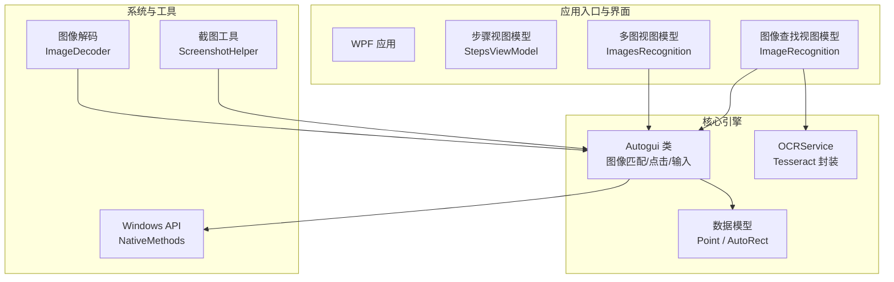
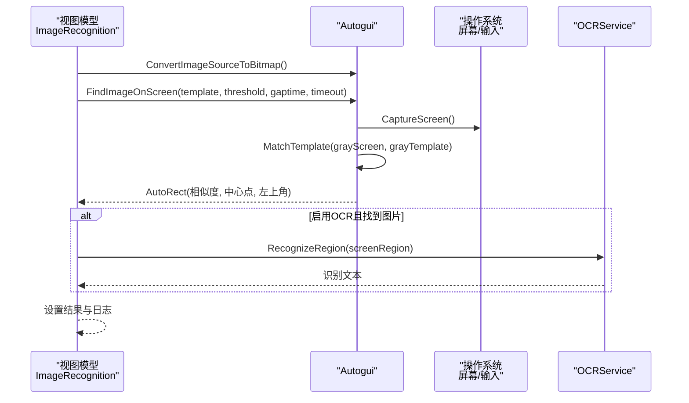
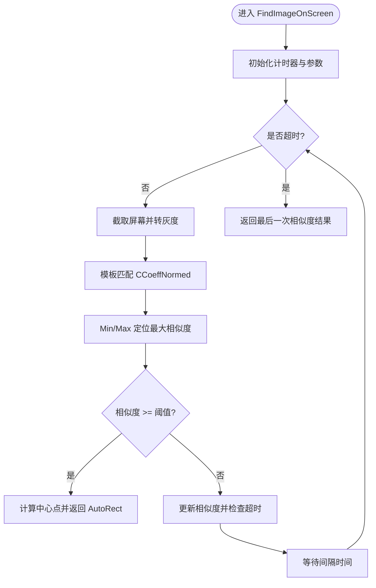
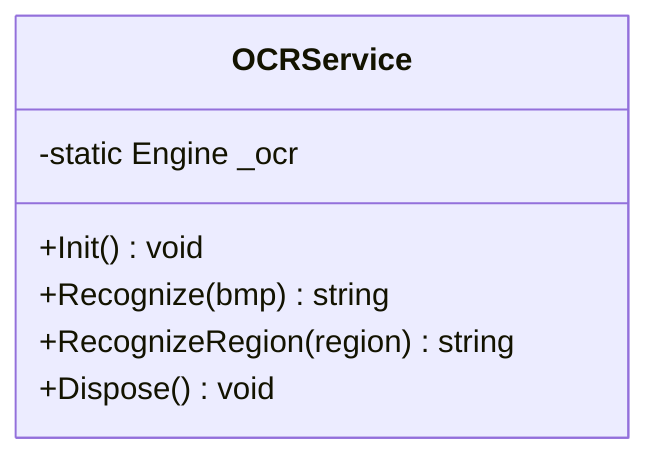
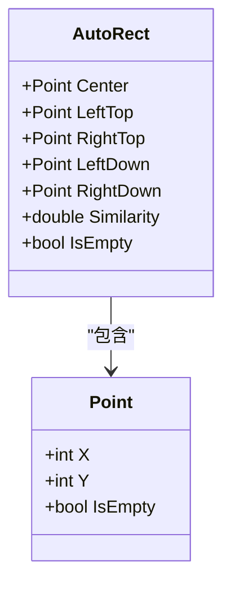
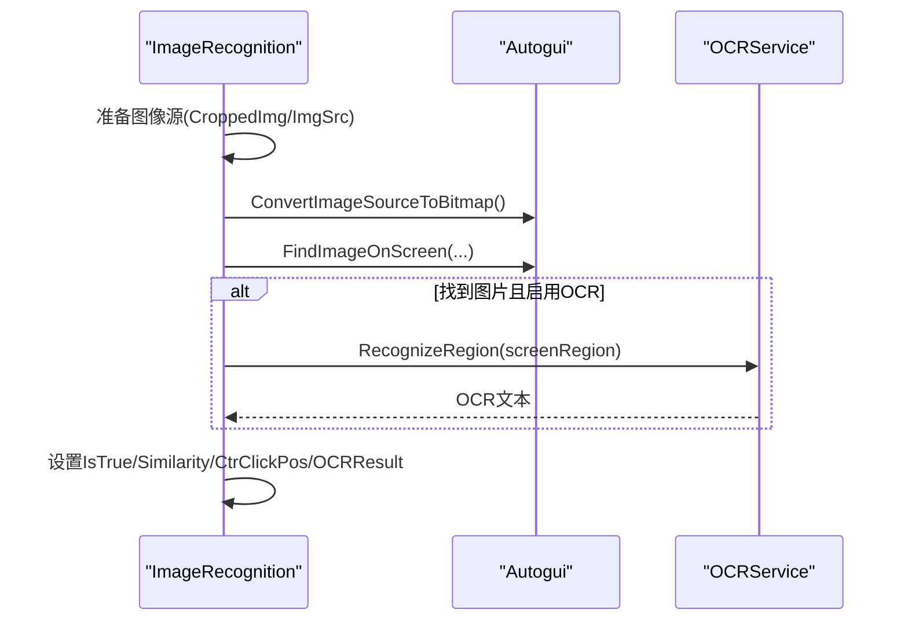
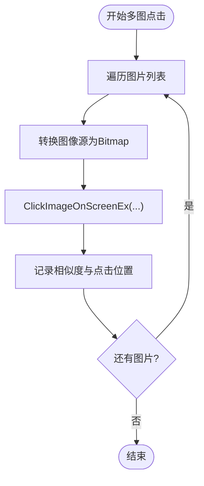
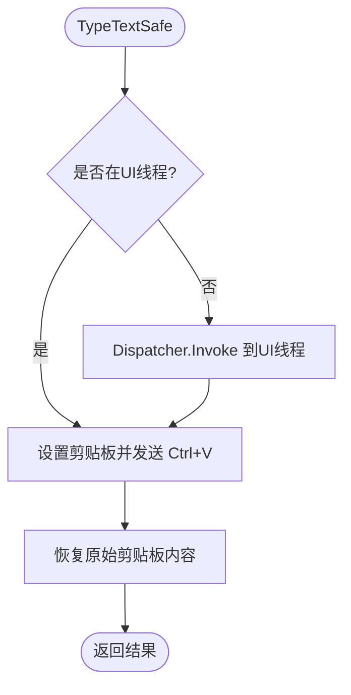
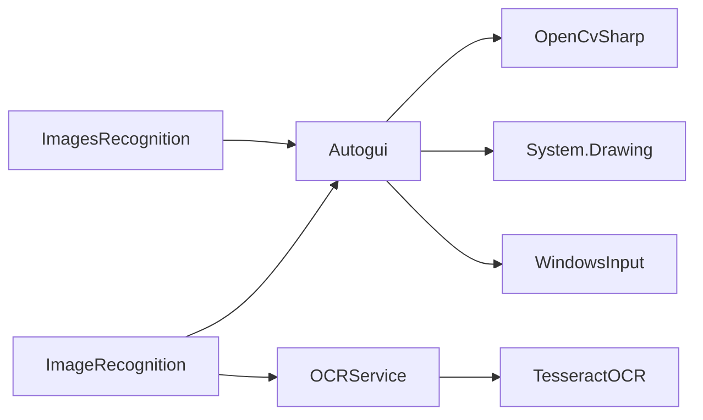

# 图像识别引擎

<cite>
**本文引用的文件**   
- [Autogui.cs](file://ShaoLu/Utils/Autogui.cs)
- [NativeMethods.cs](file://ShaoLu/Utils/NativeMethods.cs)
- [OCRService.cs](file://ShaoLu/services/OCRService.cs)
- [AutoguiModel.cs](file://ShaoLu/Models/AutoguiModel.cs)
- [ImageRecognition.cs](file://ShaoLu/Viewmodels/ImageRecognition.cs)
- [ImagesRecognition.cs](file://ShaoLu/Viewmodels/ImagesRecognition.cs)
- [LanguageService.cs](file://ShaoLu/services/LanguageService.cs)
- [ScreenshotHelper.cs](file://ShaoLu/Tools/ImageEdit/Helpers/ScreenshotHelper.cs)
- [ImageDecoder.cs](file://ShaoLu/Tools/ImageEdit/ImageDecoder.cs)
- [Readme.md](file://Readme.md)
</cite>

## 目录
1. [简介](#简介)
2. [项目结构](#项目结构)
3. [核心组件](#核心组件)
4. [架构总览](#架构总览)
5. [详细组件分析](#详细组件分析)
6. [依赖关系分析](#依赖关系分析)
7. [性能考量](#性能考量)
8. [故障排查指南](#故障排查指南)
9. [结论](#结论)
10. [附录](#附录)

## 简介
本技术文档面向 ShaoLu 图像识别引擎，系统性阐述基于 OpenCV 的模板匹配、相似度计算与坐标定位实现；集成 Tesseract OCR 的多语言文字识别能力；说明图像预处理（裁剪、缩放、格式转换）流程；解析 NativeMethods 中的 Windows API 调用（热键注册等）；详解 Autogui 类的核心方法（FindImage、ClickImage、TypeText 等）的实现原理；并给出性能优化策略（缓存机制、多线程处理、内存管理）以及调试与测试方法，帮助开发者理解与优化识别效果。

## 项目结构
ShaoLu 采用 WPF + MVVM 架构，核心自动化与图像识别逻辑集中在 Utils 与 Services 层，UI 交互在 ViewModels/Views 中完成，工具与图像处理位于 Tools/ImageEdit 子模块。关键路径：
- 自动化与图像识别：ShaoLu/Utils/Autogui.cs
- OCR 服务：ShaoLu/services/OCRService.cs
- 数据模型：ShaoLu/Models/AutoguiModel.cs
- 步骤执行视图模型：ShaoLu/Viewmodels/ImageRecognition.cs, ImagesRecognition.cs
- 本地化服务：ShaoLu/services/LanguageService.cs
- 截图与解码工具：ShaoLu/Tools/ImageEdit/Helpers/ScreenshotHelper.cs, ImageDecoder.cs
- 用户手册与使用说明：Readme.md

图表来源
- [Autogui.cs:1-120](file://ShaoLu/Utils/Autogui.cs#L1-L120)
- [OCRService.cs:1-75](file://ShaoLu/services/OCRService.cs#L1-L75)
- [AutoguiModel.cs:1-145](file://ShaoLu/Models/AutoguiModel.cs#L1-L145)
- [ImageRecognition.cs:515-568](file://ShaoLu/Viewmodels/ImageRecognition.cs#L515-L568)
- [ImagesRecognition.cs:120-139](file://ShaoLu/Viewmodels/ImagesRecognition.cs#L120-L139)
- [ScreenshotHelper.cs:116-144](file://ShaoLu/Tools/ImageEdit/Helpers/ScreenshotHelper.cs#L116-L144)
- [ImageDecoder.cs:1-49](file://ShaoLu/Tools/ImageEdit/ImageDecoder.cs#L1-L49)

章节来源
- [Readme.md:1-283](file://Readme.md#L1-L283)

## 核心组件
- Autogui：提供屏幕截图、模板匹配、坐标定位、鼠标移动与点击、文本输入等核心功能。
- OCRService：封装 Tesseract OCR 引擎，支持多语言识别与区域截图识别。
- 数据模型 Point/AutoRect：统一坐标与矩形结果表达，支持中心点与四角点计算。
- 视图模型 ImageRecognition/ImagesRecognition：编排步骤执行、异步任务、OCR 后处理与日志记录。
- LanguageService：本地化字符串获取，用于错误提示与 UI 文案。
- 工具类 ScreenshotHelper/ImageDecoder：截图与图像格式转换，提升跨框架兼容性。

章节来源
- [Autogui.cs:1-584](file://ShaoLu/Utils/Autogui.cs#L1-L584)
- [OCRService.cs:1-133](file://ShaoLu/services/OCRService.cs#L1-L133)
- [AutoguiModel.cs:1-145](file://ShaoLu/Models/AutoguiModel.cs#L1-L145)
- [ImageRecognition.cs:515-568](file://ShaoLu/Viewmodels/ImageRecognition.cs#L515-L568)
- [ImagesRecognition.cs:120-139](file://ShaoLu/Viewmodels/ImagesRecognition.cs#L120-L139)
- [LanguageService.cs:1-67](file://ShaoLu/services/LanguageService.cs#L1-L67)
- [ScreenshotHelper.cs:116-144](file://ShaoLu/Tools/ImageEdit/Helpers/ScreenshotHelper.cs#L116-L144)
- [ImageDecoder.cs:1-49](file://ShaoLu/Tools/ImageEdit/ImageDecoder.cs#L1-L49)

## 架构总览
整体架构围绕“视图模型驱动步骤执行 → Autogui 进行图像匹配与系统操作 → OCRService 进行文字识别”的主线展开。线程模型上，耗时任务（截图、匹配、OCR）均通过 Task.Run 或后台线程执行，避免阻塞 UI。资源管理方面，OpenCV Mat/GDI+ Bitmap 使用 using 语句确保及时释放。

图表来源
- [ImageRecognition.cs:515-568](file://ShaoLu/Viewmodels/ImageRecognition.cs#L515-L568)
- [Autogui.cs:59-122](file://ShaoLu/Utils/Autogui.cs#L59-L122)
- [OCRService.cs:82-118](file://ShaoLu/services/OCRService.cs#L82-L118)

## 详细组件分析

### Autogui 类核心方法
- FindImageOnScreen：将模板图转换为灰度 Mat，循环截取屏幕并执行归一化相关系数模板匹配，取最大相似度与位置，计算中心点返回 AutoRect。支持超时与间隔重试。
- ClickImageOnScreenEx：在 FindImageOnScreen 基础上，根据锚点与偏移量移动鼠标并模拟点击，支持多次点击与间隔控制。
- TypeText/TypeTextSafe：逐字符键盘输入或通过剪贴板粘贴（Ctrl+V），后者保证 STA 线程安全。
- CaptureScreen：使用 GDI CopyFromScreen 抓取全屏。
- MoveMouseTo：将虚拟桌面坐标映射到实际像素坐标并移动鼠标。

图表来源
- [Autogui.cs:59-122](file://ShaoLu/Utils/Autogui.cs#L59-L122)

章节来源
- [Autogui.cs:59-122](file://ShaoLu/Utils/Autogui.cs#L59-L122)
- [Autogui.cs:256-306](file://ShaoLu/Utils/Autogui.cs#L256-L306)
- [Autogui.cs:497-579](file://ShaoLu/Utils/Autogui.cs#L497-L579)
- [Autogui.cs:177-186](file://ShaoLu/Utils/Autogui.cs#L177-L186)
- [Autogui.cs:193-196](file://ShaoLu/Utils/Autogui.cs#L193-L196)

### OCRService 集成与多语言支持
- 懒加载初始化：首次调用时从 tessdata 目录加载 chi_sim+eng 多语言包。
- Recognize(Bitmap)：将 Bitmap 保存为 PNG 字节流，通过 Pix.Image.LoadFromMemory 加载并 Process 得到文本。
- RecognizeRegion(Rect)：按 DPI 缩放因子截取屏幕区域，再调用 Recognize。
- Dispose：释放引擎资源。

图表来源
- [OCRService.cs:1-133](file://ShaoLu/services/OCRService.cs#L1-L133)

章节来源
- [OCRService.cs:21-43](file://ShaoLu/services/OCRService.cs#L21-L43)
- [OCRService.cs:50-75](file://ShaoLu/services/OCRService.cs#L50-L75)
- [OCRService.cs:82-118](file://ShaoLu/services/OCRService.cs#L82-L118)
- [OCRService.cs:123-131](file://ShaoLu/services/OCRService.cs#L123-L131)

### 数据模型 Point/AutoRect
- Point：封装 X/Y 坐标与空状态，支持多种构造方式与隐式转换。
- AutoRect：维护 Center 与 LeftTop，动态计算 RightTop/LeftDown/RightDown，并提供 Similarity 与 IsEmpty。

图表来源
- [AutoguiModel.cs:1-145](file://ShaoLu/Models/AutoguiModel.cs#L1-L145)

章节来源
- [AutoguiModel.cs:3-86](file://ShaoLu/Models/AutoguiModel.cs#L3-L86)
- [AutoguiModel.cs:89-145](file://ShaoLu/Models/AutoguiModel.cs#L89-L145)

### 视图模型 ImageRecognition 执行流程
- RunAsync：将图像源转为 Bitmap，后台线程执行等待与 FindImageOnScreen，若启用 OCR 则计算屏幕区域并调用 OCRService.RecognizeRegion，最终填充 LastResult 与日志。

图表来源
- [ImageRecognition.cs:515-568](file://ShaoLu/Viewmodels/ImageRecognition.cs#L515-L568)
- [Autogui.cs:311-350](file://ShaoLu/Utils/Autogui.cs#L311-L350)
- [OCRService.cs:82-118](file://ShaoLu/services/OCRService.cs#L82-L118)

章节来源
- [ImageRecognition.cs:515-568](file://ShaoLu/Viewmodels/ImageRecognition.cs#L515-L568)

### 多图点击 ImagesRecognition
- 依次对每个目标图片执行 ClickImageOnScreenEx，支持点击次数、间隔与超时控制，记录最后相似度与点击位置。

图表来源
- [ImagesRecognition.cs:120-139](file://ShaoLu/Viewmodels/ImagesRecognition.cs#L120-L139)
- [Autogui.cs:256-306](file://ShaoLu/Utils/Autogui.cs#L256-L306)

章节来源
- [ImagesRecognition.cs:120-139](file://ShaoLu/Viewmodels/ImagesRecognition.cs#L120-L139)

### 文本输入 TypeText/TypeTextSafe
- TypeText：逐字符调用 Keyboard.TextEntry，可配置按键间隔。
- TypeTextSafe：优先使用剪贴板粘贴（Ctrl+V），确保 STA 线程安全，失败回退并记录日志。

图表来源
- [Autogui.cs:497-579](file://ShaoLu/Utils/Autogui.cs#L497-L579)

章节来源
- [Autogui.cs:497-579](file://ShaoLu/Utils/Autogui.cs#L497-L579)

### 图像预处理与格式转换
- ConvertImageSourceToBitmap：将 WPF ImageSource 编码为 PNG 字节流并通过 GDI+ 创建 Bitmap，便于 OpenCV 处理。
- ScreenshotHelper.ToBitmapSource：将 System.Drawing.Image 转换为 WPF BitmapSource，便于 UI 显示。
- ImageDecoder.GetBitmapSource：通过 GDI HBITMAP 创建 WPF BitmapSource，注意释放句柄。

章节来源
- [Autogui.cs:311-350](file://ShaoLu/Utils/Autogui.cs#L311-L350)
- [ScreenshotHelper.cs:123-137](file://ShaoLu/Tools/ImageEdit/Helpers/ScreenshotHelper.cs#L123-L137)
- [ImageDecoder.cs:19-44](file://ShaoLu/Tools/ImageEdit/ImageDecoder.cs#L19-L44)

### NativeMethods 中的 Windows API 调用
- RegisterHotKey/UnregisterHotKey：注册/注销全局热键，配合 WM_HOTKEY 消息处理。
- 常量 MOD_*：修饰键组合定义。

章节来源
- [NativeMethods.cs:1-19](file://ShaoLu/Utils/NativeMethods.cs#L1-L19)

## 依赖关系分析
- Autogui 依赖 OpenCvSharp（模板匹配）、System.Drawing（GDI+ 截图与位图）、WindowsInput（鼠标键盘模拟）。
- OCRService 依赖 TesseractOCR（引擎与 Pix/Page 对象）。
- 视图模型依赖 Autogui 与 OCRService，负责编排与结果聚合。
- 工具类提供截图与图像格式转换，降低跨框架耦合。

图表来源
- [Autogui.cs:1-120](file://ShaoLu/Utils/Autogui.cs#L1-L120)
- [OCRService.cs:1-75](file://ShaoLu/services/OCRService.cs#L1-L75)
- [ImageRecognition.cs:515-568](file://ShaoLu/Viewmodels/ImageRecognition.cs#L515-L568)
- [ImagesRecognition.cs:120-139](file://ShaoLu/Viewmodels/ImagesRecognition.cs#L120-L139)

章节来源
- [Autogui.cs:1-120](file://ShaoLu/Utils/Autogui.cs#L1-L120)
- [OCRService.cs:1-75](file://ShaoLu/services/OCRService.cs#L1-L75)

## 性能考量
- 模板匹配优化
  - 仅一次转换模板为灰度 Mat，避免循环内重复转换。
  - 使用 CCoeffNormed 提高鲁棒性，结合合理阈值（建议 0.8~0.95）。
- 截图与内存管理
  - 每次循环重新截图以应对动态屏幕变化，但需严格控制超时与间隔。
  - 使用 using 释放 Mat/Bitmap，避免内存泄漏。
- 多线程与异步
  - 耗时任务（FindImageOnScreen、OCR）均在后台线程执行，不阻塞 UI。
  - 使用 CancellationToken 支持取消操作。
- OCR 初始化与缓存
  - OCR 引擎懒加载，避免启动开销；必要时可在应用生命周期内复用。
- 输入模拟
  - TypeTextSafe 通过剪贴板批量粘贴，减少逐键延迟，提高稳定性。

[本节为通用指导，不直接分析具体文件]

## 故障排查指南
- 未找到匹配图像
  - 现象：抛出“未找到匹配图像”异常。
  - 排查：检查阈值设置、模板清晰度、截图质量与超时时间。
  - 参考：[Autogui.cs:116-122](file://ShaoLu/Utils/Autogui.cs#L116-L122)
- OCR 识别失败
  - 现象：返回空文本或异常。
  - 排查：确认 tessdata 路径正确、语言包存在、区域截图有效。
  - 参考：[OCRService.cs:31-43](file://ShaoLu/services/OCRService.cs#L31-L43), [OCRService.cs:70-75](file://ShaoLu/services/OCRService.cs#L70-L75)
- 剪贴板操作失败
  - 现象：TypeTextSafe 返回 false。
  - 排查：确保在 STA 线程执行，检查剪贴板权限与内容。
  - 参考：[Autogui.cs:551-579](file://ShaoLu/Utils/Autogui.cs#L551-L579)
- 图像转换异常
  - 现象：ConvertImageSourceToBitmap 返回 null。
  - 排查：检查 ImageSource 类型与编码格式。
  - 参考：[Autogui.cs:311-350](file://ShaoLu/Utils/Autogui.cs#L311-L350)

章节来源
- [Autogui.cs:116-122](file://ShaoLu/Utils/Autogui.cs#L116-L122)
- [OCRService.cs:31-43](file://ShaoLu/services/OCRService.cs#L31-L43)
- [OCRService.cs:70-75](file://ShaoLu/services/OCRService.cs#L70-L75)
- [Autogui.cs:551-579](file://ShaoLu/Utils/Autogui.cs#L551-L579)
- [Autogui.cs:311-350](file://ShaoLu/Utils/Autogui.cs#L311-L350)

## 结论
ShaoLu 图像识别引擎以 Autogui 为核心，结合 OpenCV 模板匹配与 Tesseract OCR，实现了稳定的 GUI 自动化能力。通过合理的预处理、多线程与资源管理策略，系统在速度与稳定性之间取得平衡。开发者可通过调整阈值、超时与 OCR 区域，结合日志与本地化提示，持续优化识别效果与用户体验。

[本节为总结性内容，不直接分析具体文件]

## 附录
- 使用流程与步骤说明详见 Readme.md，涵盖点击识图、查找识图、多图操作、文字输入与弹窗等。
- 本地化支持通过 LanguageService 获取多语言字符串，便于国际化部署。

章节来源
- [Readme.md:1-283](file://Readme.md#L1-L283)
- [LanguageService.cs:1-67](file://ShaoLu/services/LanguageService.cs#L1-L67)