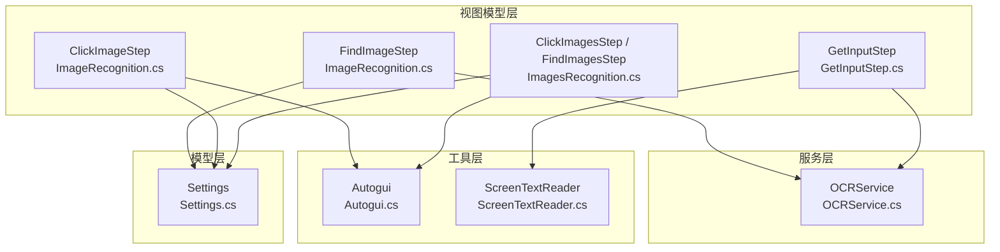
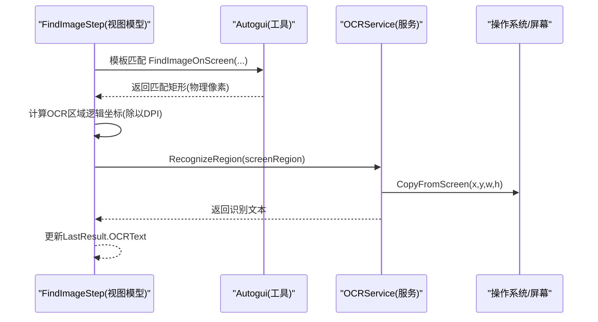
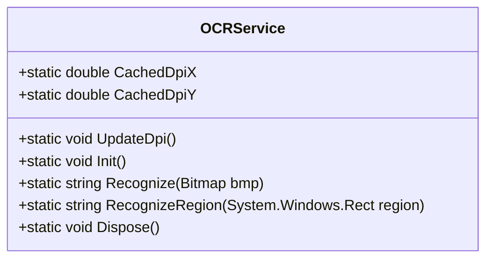
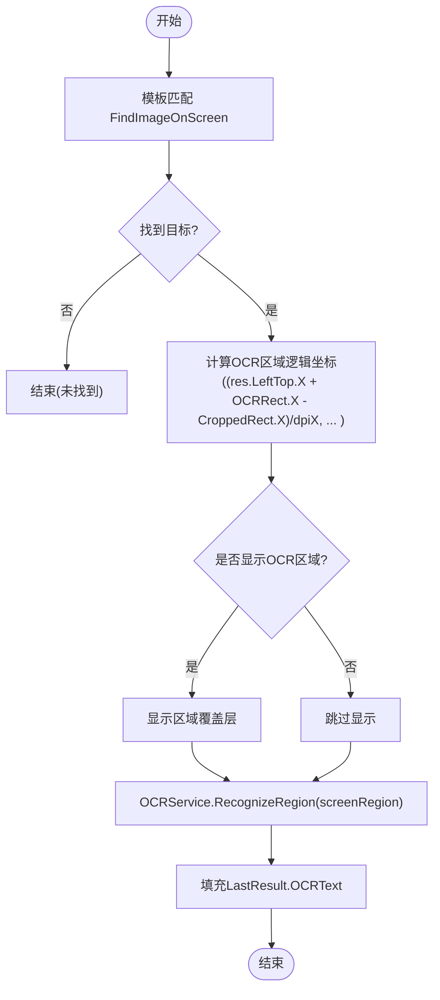
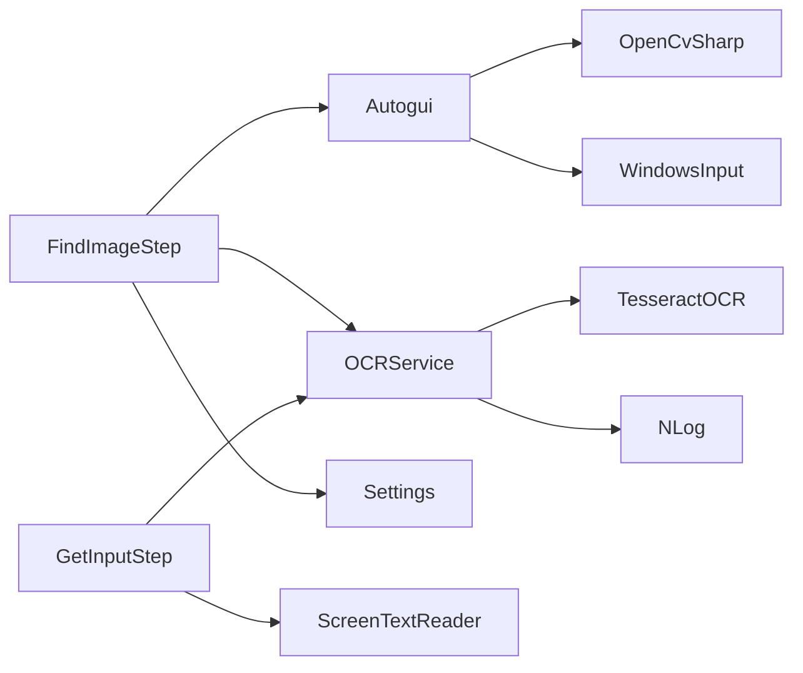

# OCR文字识别

<cite>
**本文引用的文件**   
- [OCRService.cs](file://ShaoLu/Services/OCRService.cs)
- [ImageRecognition.cs](file://ShaoLu/Viewmodels/ImageRecognition.cs)
- [ImagesRecognition.cs](file://ShaoLu/Viewmodels/ImagesRecognition.cs)
- [Autogui.cs](file://ShaoLu/Utils/Autogui.cs)
- [ScreenTextReader.cs](file://ShaoLu/Utils/ScreenTextReader.cs)
- [Settings.cs](file://ShaoLu/Models/Settings.cs)
- [GetInputStep.cs](file://ShaoLu/Viewmodels/GetInputStep.cs)
- [Strings.en-US.resx](file://ShaoLu/Resources/Strings.en-US.resx)
- [Strings.zh-CN.resx](file://ShaoLu/Resources/Strings.zh-CN.resx)
- [Readme.md](file://Readme.md)
</cite>

## 目录
1. [简介](#简介)
2. [项目结构](#项目结构)
3. [核心组件](#核心组件)
4. [架构总览](#架构总览)
5. [详细组件分析](#详细组件分析)
6. [依赖关系分析](#依赖关系分析)
7. [性能与优化](#性能与优化)
8. [故障排查指南](#故障排查指南)
9. [结论](#结论)
10. [附录：使用案例与最佳实践](#附录使用案例与最佳实践)

## 简介
本技术文档围绕 ShaoLu 的 OCR 文字识别能力，系统阐述 TesseractOCR 引擎集成方式、配置项与优化设置；说明 OCR 区域选择机制、坐标系统转换（物理像素与逻辑像素）及 DPI 缩放处理；完整描述 OCR 识别流程（屏幕截图截取、区域定位、文字识别与结果处理）；并给出缓存机制、多线程安全访问与错误处理策略。最后提供精度调优指南与实际使用案例，帮助在图像识别步骤中无缝集成 OCR 功能。

## 项目结构
ShaoLu 采用 WPF + MVVM 架构，OCR 相关能力主要分布在 Services、Viewmodels、Utils 三个层次：
- Services：OCRService 封装 TesseractOCR 引擎，负责初始化、DPI 缓存、区域截图与识别。
- Viewmodels：ImageRecognition、ImagesRecognition、GetInputStep 等将 OCR 能力编排进自动化步骤执行流。
- Utils：Autogui 负责图像匹配与屏幕截图；ScreenTextReader 通过 UI Automation 读取控件文本作为 OCR 的补充手段。
- Models：Settings 定义运行时的覆盖层显示开关与默认参数。
- Resources：多语言资源用于用户提示与错误信息。

图表来源
- [ImageRecognition.cs:439-601](file://ShaoLu/Viewmodels/ImageRecognition.cs#L439-L601)
- [ImagesRecognition.cs:71-245](file://ShaoLu/Viewmodels/ImagesRecognition.cs#L71-L245)
- [GetInputStep.cs:180-293](file://ShaoLu/Viewmodels/GetInputStep.cs#L180-L293)
- [OCRService.cs:1-159](file://ShaoLu/Services/OCRService.cs#L1-L159)
- [Autogui.cs:59-186](file://ShaoLu/Utils/Autogui.cs#L59-L186)
- [ScreenTextReader.cs:1-79](file://ShaoLu/Utils/ScreenTextReader.cs#L1-L79)
- [Settings.cs:33-116](file://ShaoLu/Models/Settings.cs#L33-L116)

章节来源
- [Readme.md:1-283](file://Readme.md#L1-L283)

## 核心组件
- OCRService：基于 TesseractOCR 的单例引擎封装，提供 DPI 缓存、懒加载初始化、按区域截图识别、线程安全释放。
- ImageRecognition.FindImageStep：在模板匹配成功后，计算 OCR 区域逻辑坐标，调用 OCRService 进行文字识别，支持运行时可视化标注。
- ImagesRecognition.ClickImagesStep / FindImagesStep：多图点击与查找，配合 Autogui 完成图像匹配与鼠标动作。
- Autogui：OpenCVSharp 模板匹配、屏幕截图、图像格式转换、鼠标模拟输入。
- ScreenTextReader：UI Automation 文本读取，作为 OCR 的备选方案。
- Settings：控制运行期调试覆盖层显示（如 OCR 区域高亮）、默认阈值与时延等。

章节来源
- [OCRService.cs:1-159](file://ShaoLu/Services/OCRService.cs#L1-L159)
- [ImageRecognition.cs:439-601](file://ShaoLu/Viewmodels/ImageRecognition.cs#L439-L601)
- [ImagesRecognition.cs:71-245](file://ShaoLu/Viewmodels/ImagesRecognition.cs#L71-L245)
- [Autogui.cs:59-186](file://ShaoLu/Utils/Autogui.cs#L59-L186)
- [ScreenTextReader.cs:1-79](file://ShaoLu/Utils/ScreenTextReader.cs#L1-L79)
- [Settings.cs:33-116](file://ShaoLu/Models/Settings.cs#L33-L116)

## 架构总览
OCR 能力以“服务层”为核心，被“视图模型层”在步骤执行时按需调用；底层由“工具层”提供图像匹配、截图与 UIA 文本读取；“模型层”提供运行期配置。

图表来源
- [ImageRecognition.cs:535-599](file://ShaoLu/Viewmodels/ImageRecognition.cs#L535-L599)
- [Autogui.cs:59-122](file://ShaoLu/Utils/Autogui.cs#L59-L122)
- [OCRService.cs:114-144](file://ShaoLu/Services/OCRService.cs#L114-L144)

## 详细组件分析

### OCRService：TesseractOCR 引擎封装与 DPI 处理
- 引擎初始化
  - 懒加载单例模式，首次调用时从 tessdata 目录加载语言包 chi_sim+eng。
  - 使用 NLog 记录初始化成功或失败日志。
- DPI 缓存
  - 在 UI 线程上通过 VisualTreeHelper.GetDpi 获取缩放因子，缓存为只读静态字段，避免后台线程访问 WPF 对象。
- 识别流程
  - Recognize(Bitmap)：将 Bitmap 转为内存 PNG 字节，通过 TesseractOCR.Pix.Image.LoadFromMemory 加载后 Process 得到文本。
  - RecognizeRegion(Rect)：根据缓存 DPI 将逻辑像素坐标转换为物理像素，使用 GDI+ CopyFromScreen 截取区域，再调用 Recognize(Bitmap)。
- 线程安全与资源管理
  - 使用 lock 保护引擎初始化与释放，避免并发问题。
  - Dispose() 释放 Engine 实例。

图表来源
- [OCRService.cs:1-159](file://ShaoLu/Services/OCRService.cs#L1-L159)

章节来源
- [OCRService.cs:1-159](file://ShaoLu/Services/OCRService.cs#L1-L159)

### FindImageStep：图像识别 + OCR 区域定位与执行
- 图像匹配
  - 调用 Autogui.FindImageOnScreen 获取匹配矩形（物理像素）。
- 坐标转换
  - 将匹配左上角坐标与 OCRRect 相对裁剪图偏移相加，再除以 DPI 缩放因子，得到屏幕逻辑像素区域。
- OCR 识别
  - 可选开启 ShowOCRRegionOnRun 高亮显示 OCR 区域。
  - 异步调用 OCRService.RecognizeRegion 获取文本，填充 LastResult.OCRText。
- 结果展示
  - 若未识别到文本，显示本地化提示“未识别到文本”。

图表来源
- [ImageRecognition.cs:535-599](file://ShaoLu/Viewmodels/ImageRecognition.cs#L535-L599)
- [OCRService.cs:114-144](file://ShaoLu/Services/OCRService.cs#L114-L144)

章节来源
- [ImageRecognition.cs:439-601](file://ShaoLu/Viewmodels/ImageRecognition.cs#L439-L601)

### ClickImageStep：图像点击与鼠标动作序列
- 图像匹配与点击
  - 使用 Autogui.ClickImageOnScreenEx 进行匹配与点击，支持多次点击与间隔。
- 鼠标动作序列
  - 支持自定义动作列表（左键、右键、双击、滚轮），按顺序执行。
- 结果输出
  - 返回匹配相似度与中心点位置，可结合设置显示点击位置覆盖层。

章节来源
- [ImageRecognition.cs:329-436](file://ShaoLu/Viewmodels/ImageRecognition.cs#L329-L436)
- [Autogui.cs:256-378](file://ShaoLu/Utils/Autogui.cs#L256-L378)

### ImagesRecognition：多图点击与查找
- ClickImagesStep：依次对图片列表执行点击，支持 OneByOne 模式。
- FindImagesStep：同时查找多张图片，判断是否全部找到。
- 均通过 Autogui 完成图像匹配与结果聚合。

章节来源
- [ImagesRecognition.cs:71-245](file://ShaoLu/Viewmodels/ImagesRecognition.cs#L71-L245)

### GetInputStep：OCR 输入与 UIA 文本读取
- OCR 模式
  - 校验 OCRRegion 有效性，可选显示区域覆盖层。
  - 调用 OCRService.RecognizeRegion 获取文本，填充 OCRResultFull 与 LastResult。
- UIA 模式
  - 当指定 TextPoint 时，优先尝试通过 ScreenTextReader 读取控件文本（TextPattern/ValuePattern/Name）。
  - 若不可用则回退到 OCR 区域识别。

章节来源
- [GetInputStep.cs:180-293](file://ShaoLu/Viewmodels/GetInputStep.cs#L180-L293)
- [ScreenTextReader.cs:1-79](file://ShaoLu/Utils/ScreenTextReader.cs#L1-L79)

### Autogui：图像匹配、截图与输入
- 模板匹配
  - FindImageOnScreen：灰度图 + CCoeffNormed 匹配，超时与间隔控制，返回 AutoRect（包含中心点、左上角、相似度）。
- 截图
  - CaptureScreen：全屏截图，高质量插值与抗锯齿。
- 输入
  - MoveMouseTo / ClickImageOnScreenEx：支持锚点与偏移量，模拟鼠标操作。
- 格式转换
  - ConvertImageSourceToBitmap：WPF ImageSource 转 System.Drawing.Bitmap。

章节来源
- [Autogui.cs:59-186](file://ShaoLu/Utils/Autogui.cs#L59-L186)
- [Autogui.cs:256-378](file://ShaoLu/Utils/Autogui.cs#L256-L378)
- [Autogui.cs:383-422](file://ShaoLu/Utils/Autogui.cs#L383-L422)

### Settings：运行期覆盖层与默认参数
- 覆盖层开关
  - ShowOCRRegionOnRun、ShowFoundImageRegionOnRun、ShowClickPositionOnRun。
- 覆盖层样式
  - OCRRegionOverlay、FoundImageOverlay、ClickPositionOverlay（颜色与持续时间）。
- 默认参数
  - DefaultSimilarityThreshold、DefaultWaitTime、DefaultTimeout、DefaultClicks。

章节来源
- [Settings.cs:33-116](file://ShaoLu/Models/Settings.cs#L33-L116)

## 依赖关系分析
- OCRService 依赖 TesseractOCR 库与 NLog 日志。
- FindImageStep 依赖 Autogui 进行模板匹配，依赖 OCRService 进行文字识别，依赖 Settings 控制覆盖层显示。
- GetInputStep 依赖 OCRService 与 ScreenTextReader，实现 OCR 与 UIA 双通道文本读取。
- Autogui 依赖 OpenCvSharp 与 WindowsInput。

图表来源
- [ImageRecognition.cs:535-599](file://ShaoLu/Viewmodels/ImageRecognition.cs#L535-L599)
- [GetInputStep.cs:180-293](file://ShaoLu/Viewmodels/GetInputStep.cs#L180-L293)
- [Autogui.cs:59-186](file://ShaoLu/Utils/Autogui.cs#L59-L186)
- [OCRService.cs:1-159](file://ShaoLu/Services/OCRService.cs#L1-L159)

## 性能与优化
- 引擎懒加载与单例
  - OCRService.Init() 仅在首次调用时创建 Engine，减少启动开销。
- DPI 缓存
  - 通过静态字段缓存 DpiScaleX/Y，避免后台线程访问 WPF 对象带来的额外开销与竞态风险。
- 图像预处理
  - Autogui 使用灰度图与高质量插值提升匹配稳定性；OCR 使用 PNG 无损压缩传输至 Tesseract。
- 异步与超时
  - 所有耗时操作（模板匹配、OCR 识别）均在 Task.Run 中执行，并提供超时与间隔控制，避免 UI 阻塞。
- 资源释放
  - OCRService.Dispose() 确保 Engine 释放；图像转换与临时对象使用 using 语句及时释放。

[本节为通用指导，不直接分析具体文件]

## 故障排查指南
- 未找到图像
  - 检查相似度阈值与等待/超时时间；确认模板图像质量与裁剪区域精确性。
- OCR 结果为空
  - 确认 OCRRegion 有效且非空；检查 DPI 缓存是否正确更新；查看 NLog 日志中的 OCR 异常。
- UIA 文本读取失败
  - 某些控件不支持 TextPattern/ValuePattern，需回退到 OCR 区域识别。
- 坐标错位
  - 确认物理像素与逻辑像素转换正确（乘以/除以 DPI）；检查 CroppedRect 偏移计算。
- 多线程访问异常
  - 确保 DPI 更新在 UI 线程执行；OCR 识别在后台线程执行，避免直接访问 WPF 对象。

章节来源
- [OCRService.cs:114-144](file://ShaoLu/Services/OCRService.cs#L114-L144)
- [GetInputStep.cs:180-293](file://ShaoLu/Viewmodels/GetInputStep.cs#L180-L293)
- [ImageRecognition.cs:535-599](file://ShaoLu/Viewmodels/ImageRecognition.cs#L535-L599)

## 结论
ShaoLu 的 OCR 能力以 OCRService 为核心，结合 Autogui 的图像匹配与 UIA 文本读取，形成稳定可靠的自动化识别流程。通过 DPI 缓存、异步执行与完善的错误处理，能够在多显示器与高 DPI 环境下准确工作。配合 Settings 的覆盖层开关，便于调试与验证。推荐在实际使用中合理设置相似度阈值、超时时间与 OCR 区域，以获得更高的识别准确率与执行效率。

[本节为总结性内容，不直接分析具体文件]

## 附录：使用案例与最佳实践

### 在图像识别步骤中集成 OCR
- 启用 OCR
  - 在 FindImageStep 中勾选 EnableOCR，并在编辑窗口设置 OCR 区域（OCRRect）。
- 执行流程
  - 模板匹配成功后，自动计算 OCR 区域逻辑坐标，调用 OCRService.RecognizeRegion 获取文本。
- 结果使用
  - 将 LastResult.OCRText 用于后续条件判断或输入步骤。

章节来源
- [ImageRecognition.cs:439-601](file://ShaoLu/Viewmodels/ImageRecognition.cs#L439-L601)
- [Strings.en-US.resx:810-839](file://ShaoLu/Resources/Strings.en-US.resx#L810-L839)
- [Strings.zh-CN.resx:142-187](file://ShaoLu/Resources/Strings.zh-CN.resx#L142-L187)

### OCR 精度调优指南
- 语言包配置
  - 确保 tessdata 目录下存在 chi_sim+eng 语言包；必要时扩展其他语言组合。
- 预处理选项
  - 提高模板图像质量与裁剪精度；适当调整相似度阈值（建议 0.8~0.95）。
- 识别结果后处理
  - 对 OCR 文本进行清洗（去空白、正则过滤）；结合 UIA 文本读取做二次校验。
- 运行期调试
  - 开启 ShowOCRRegionOnRun 与 ShowFoundImageRegionOnRun 辅助定位问题。

章节来源
- [OCRService.cs:53-75](file://ShaoLu/Services/OCRService.cs#L53-L75)
- [Settings.cs:33-116](file://ShaoLu/Models/Settings.cs#L33-L116)
- [GetInputStep.cs:256-283](file://ShaoLu/Viewmodels/GetInputStep.cs#L256-L283)

### 坐标系统与 DPI 缩放处理要点
- 物理像素 vs 逻辑像素
  - Autogui 返回的物理像素坐标需除以 DPI 缩放因子转换为逻辑像素。
- 区域偏移计算
  - OCRRect 相对于裁剪图，需减去 CroppedRect 偏移后再叠加匹配左上角坐标。
- DPI 缓存更新
  - 应用启动后在主窗口加载完成时调用 OCRService.UpdateDpi() 更新缓存。

章节来源
- [ImageRecognition.cs:568-574](file://ShaoLu/Viewmodels/ImageRecognition.cs#L568-L574)
- [OCRService.cs:31-48](file://ShaoLu/Services/OCRService.cs#L31-L48)

### 多线程安全与错误处理
- 线程安全
  - OCRService 使用 lock 保护引擎初始化与释放；DPI 缓存仅读无竞态。
- 错误处理
  - OCRService 捕获异常并记录日志，返回空字符串；GetInputStep 与 FindImageStep 统一处理空结果与异常。
- 资源释放
  - 使用 using 语句释放临时图像与 Engine；Dispose() 确保资源回收。

章节来源
- [OCRService.cs:53-75](file://ShaoLu/Services/OCRService.cs#L53-L75)
- [OCRService.cs:149-156](file://ShaoLu/Services/OCRService.cs#L149-L156)
- [GetInputStep.cs:284-289](file://ShaoLu/Viewmodels/GetInputStep.cs#L284-L289)