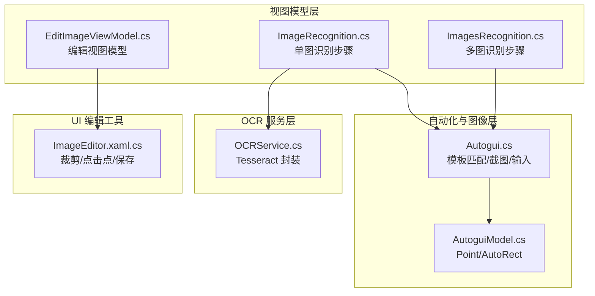
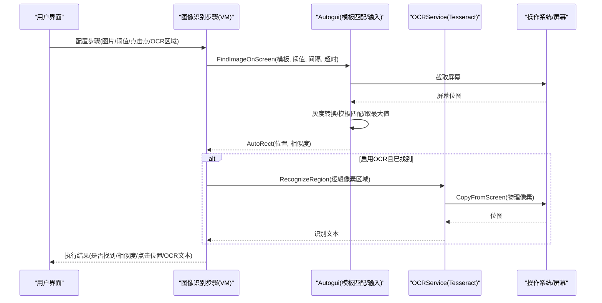
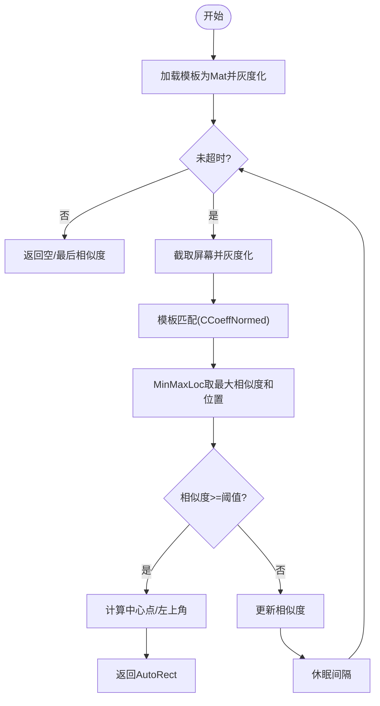
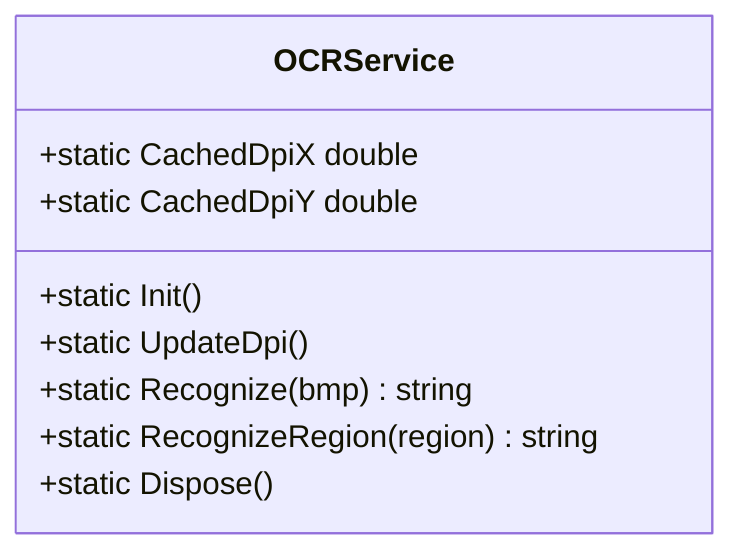
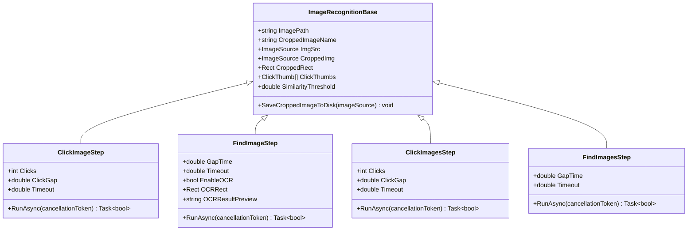
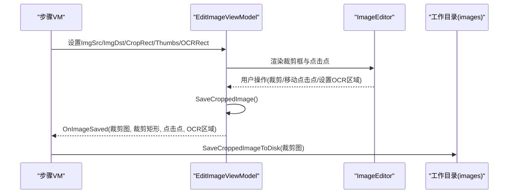
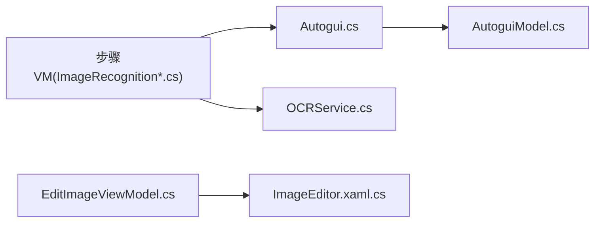

# 图像识别模块

<cite>
**本文引用的文件**
- [Readme.md](file://Readme.md)
- [Autogui.cs](file://ShaoLu/Utils/Autogui.cs)
- [OCRService.cs](file://ShaoLu/Services/OCRService.cs)
- [ImageRecognition.cs](file://ShaoLu/Viewmodels/ImageRecognition.cs)
- [ImagesRecognition.cs](file://ShaoLu/Viewmodels/ImagesRecognition.cs)
- [EditImageViewModel.cs](file://ShaoLu/Viewmodels/EditImageViewModel.cs)
- [ImageEditor.xaml.cs](file://ShaoLu/Tools/ImageEdit/ImageEditor.xaml.cs)
- [AutoguiModel.cs](file://ShaoLu/Models/AutoguiModel.cs)
</cite>

## 目录
1. [简介](#简介)
2. [项目结构](#项目结构)
3. [核心组件](#核心组件)
4. [架构总览](#架构总览)
5. [详细组件分析](#详细组件分析)
6. [依赖关系分析](#依赖关系分析)
7. [性能考虑](#性能考虑)
8. [故障排查指南](#故障排查指南)
9. [结论](#结论)
10. [附录：使用案例与最佳实践](#附录使用案例与最佳实践)

## 简介
本技术文档面向 ShaoLu 的图像识别模块，系统性阐述模板匹配算法的实现原理、OpenCV 集成方式、OCR 文字识别的配置与优化策略；并说明多图识别处理流程、相似度阈值调优方法与性能优化技巧。同时，对图片编辑工具（裁剪区域设置、点击点管理与多点击点支持）进行完整功能说明，并提供实际使用案例与最佳实践建议，帮助读者快速上手与高效排障。

## 项目结构
图像识别模块由“视图模型层（步骤定义与执行）— 自动化与图像操作层 — OCR 服务层 — 数据模型”构成，UI 侧通过“图片编辑窗口”完成裁剪与点击点配置。关键目录与职责如下：
- Viewmodels：图像识别步骤的定义与执行逻辑（单图/多图、查找/点击、OCR 开关）
- Utils：基于 OpenCvSharp 的模板匹配、屏幕截图、鼠标/键盘模拟、文本输入等能力
- Services：OCR 封装（Tesseract），包含 DPI 缓存与线程安全初始化
- Models：坐标与矩形数据结构（Point、AutoRect）
- Tools/ImageEdit：图片编辑控件与交互（裁剪框、点击点标记、保存回调）

图表来源
- [ImageRecognition.cs](file://ShaoLu/Viewmodels/ImageRecognition.cs)
- [ImagesRecognition.cs](file://ShaoLu/Viewmodels/ImagesRecognition.cs)
- [Autogui.cs](file://ShaoLu/Utils/Autogui.cs)
- [OCRService.cs](file://ShaoLu/Services/OCRService.cs)
- [EditImageViewModel.cs](file://ShaoLu/Viewmodels/EditImageViewModel.cs)
- [ImageEditor.xaml.cs](file://ShaoLu/Tools/ImageEdit/ImageEditor.xaml.cs)
- [AutoguiModel.cs](file://ShaoLu/Models/AutoguiModel.cs)

章节来源
- [Readme.md](file://Readme.md)

## 核心组件
- 模板匹配与自动化（Autogui）
  - 使用 OpenCvSharp 的 MatchTemplate（CCoeffNormed）进行归一化相关系数匹配
  - 循环截取屏幕灰度图，计算最大相似度与位置，支持超时与间隔重试
  - 提供 ClickImageOnScreenEx 系列方法，支持多点击点、多次点击、动作序列
- OCR 服务（OCRService）
  - 基于 TesseractOCR，懒加载引擎，线程安全初始化
  - 提供 Recognize(Bitmap) 与 RecognizeRegion(Rect) 两种识别入口
  - 维护 DPI 缩放因子缓存，避免后台线程访问 WPF 对象
- 图像识别步骤（ImageRecognition / ImagesRecognition）
  - 单图：ClickImageStep（点击）、FindImageStep（查找+可选 OCR）
  - 多图：ClickImagesStep（顺序点击）、FindImagesStep（全部找到判定）
  - 统一基类 ImageRecognitionBase 管理原图路径、裁剪图、相似度阈值、点击点集合与持久化
- 图片编辑（EditImageViewModel + ImageEditor）
  - 支持裁剪区域设置、点击点添加/移动/显示隐藏/删除、多点击点
  - 保存时触发回调，返回裁剪图、裁剪矩形、点击点列表与 OCR 区域

章节来源
- [Autogui.cs](file://ShaoLu/Utils/Autogui.cs)
- [OCRService.cs](file://ShaoLu/Services/OCRService.cs)
- [ImageRecognition.cs](file://ShaoLu/Viewmodels/ImageRecognition.cs)
- [ImagesRecognition.cs](file://ShaoLu/Viewmodels/ImagesRecognition.cs)
- [EditImageViewModel.cs](file://ShaoLu/Viewmodels/EditImageViewModel.cs)
- [ImageEditor.xaml.cs](file://ShaoLu/Tools/ImageEdit/ImageEditor.xaml.cs)

## 架构总览
下图展示从 UI 到 OCR 的端到端调用链路与数据流向。

图表来源
- [ImageRecognition.cs](file://ShaoLu/Viewmodels/ImageRecognition.cs)
- [Autogui.cs](file://ShaoLu/Utils/Autogui.cs)
- [OCRService.cs](file://ShaoLu/Services/OCRService.cs)

## 详细组件分析

### 模板匹配与自动化（Autogui）
- 算法要点
  - 将模板与屏幕截图转为灰度 Mat，使用 CCoeffNormed 计算匹配结果
  - MinMaxLoc 获取最大相似度和位置，超过阈值即认为匹配成功
  - 循环重试机制：按间隔休眠，直至超时或命中
- 点击与动作
  - ClickImageOnScreenEx 支持多点击点、多次点击、点击间隔与下一次点击等待时间
  - ExecuteMouseActions 支持左键/右键/双击/滚轮等动作序列
- 坐标与类型转换
  - ConvertImageSourceToBitmap 将 WPF ImageSource 转 GDI Bitmap
  - Point/AutoRect 统一坐标表示，支持多种构造与隐式转换

图表来源
- [Autogui.cs](file://ShaoLu/Utils/Autogui.cs)

章节来源
- [Autogui.cs](file://ShaoLu/Utils/Autogui.cs)
- [AutoguiModel.cs](file://ShaoLu/Models/AutoguiModel.cs)

### OCR 服务（OCRService）
- 初始化与 DPI 缓存
  - 首次调用懒加载 Engine，读取 tessdata 路径与语言包
  - 在 UI 线程更新 DPI 缓存，避免跨线程访问 WPF 对象
- 识别流程
  - Recognize(Bitmap)：内存流编码为 PNG，Pix 加载后 Process 提取文本
  - RecognizeRegion(Rect)：根据 DPI 缩放将逻辑像素转为物理像素，CopyFromScreen 截屏后识别
- 资源释放
  - Dispose 释放 Tesseract 引擎

图表来源
- [OCRService.cs](file://ShaoLu/Services/OCRService.cs)

章节来源
- [OCRService.cs](file://ShaoLu/Services/OCRService.cs)

### 图像识别步骤（单图/多图）
- 单图步骤
  - ClickImageStep：加载裁剪图或原图，转换为 Bitmap，调用 Autogui.ClickImageOnScreenEx，支持多点击点与动作序列
  - FindImageStep：查找图片，可选 OCR 区域识别，叠加调试可视化（找到区域/OCR 区域）
- 多图步骤
  - ClickImagesStep：依次查找并点击每张图片，记录最后一次相似度与点击位置
  - FindImagesStep：批量查找所有图片，全部找到才为真

图表来源
- [ImageRecognition.cs](file://ShaoLu/Viewmodels/ImageRecognition.cs)
- [ImagesRecognition.cs](file://ShaoLu/Viewmodels/ImagesRecognition.cs)

章节来源
- [ImageRecognition.cs](file://ShaoLu/Viewmodels/ImageRecognition.cs)
- [ImagesRecognition.cs](file://ShaoLu/Viewmodels/ImagesRecognition.cs)

### 图片编辑工具（裁剪与点击点）
- 功能概览
  - 裁剪区域：拖动裁剪框、调整大小、确认裁剪并预览
  - 点击点管理：添加/移动/重置/删除/显示隐藏/全部显示/全部删除
  - 多点击点：每个点击点带编号，运行时按顺序点击
  - OCR 区域：在编辑窗口中设置 OCR 识别区域（相对于原图）
- 数据流
  - EditImageViewModel 持有裁剪矩形、点击点集合与 OCR 区域
  - 保存时触发 OnImageSaved 回调，返回裁剪图、裁剪矩形、点击点列表与 OCR 区域
  - 上层步骤接收回调并持久化裁剪图与工作目录路径

图表来源
- [EditImageViewModel.cs](file://ShaoLu/Viewmodels/EditImageViewModel.cs)
- [ImageEditor.xaml.cs](file://ShaoLu/Tools/ImageEdit/ImageEditor.xaml.cs)
- [ImageRecognition.cs](file://ShaoLu/Viewmodels/ImageRecognition.cs)

章节来源
- [EditImageViewModel.cs](file://ShaoLu/Viewmodels/EditImageViewModel.cs)
- [ImageEditor.xaml.cs](file://ShaoLu/Tools/ImageEdit/ImageEditor.xaml.cs)
- [ImageRecognition.cs](file://ShaoLu/Viewmodels/ImageRecognition.cs)

## 依赖关系分析
- 组件耦合
  - 步骤 VM 依赖 Autogui 进行模板匹配与输入模拟，依赖 OCRService 进行文字识别
  - 编辑工具通过回调向步骤 VM 回传裁剪结果与点击点
- 外部依赖
  - OpenCvSharp：模板匹配、图像转换
  - TesseractOCR：OCR 引擎
  - WindowsInput：鼠标/键盘模拟
- 潜在循环依赖
  - 当前设计单向依赖，未见循环引用

图表来源
- [ImageRecognition.cs](file://ShaoLu/Viewmodels/ImageRecognition.cs)
- [ImagesRecognition.cs](file://ShaoLu/Viewmodels/ImagesRecognition.cs)
- [Autogui.cs](file://ShaoLu/Utils/Autogui.cs)
- [OCRService.cs](file://ShaoLu/Services/OCRService.cs)
- [EditImageViewModel.cs](file://ShaoLu/Viewmodels/EditImageViewModel.cs)
- [ImageEditor.xaml.cs](file://ShaoLu/Tools/ImageEdit/ImageEditor.xaml.cs)
- [AutoguiModel.cs](file://ShaoLu/Models/AutoguiModel.cs)

章节来源
- [Autogui.cs](file://ShaoLu/Utils/Autogui.cs)
- [OCRService.cs](file://ShaoLu/Services/OCRService.cs)
- [ImageRecognition.cs](file://ShaoLu/Viewmodels/ImageRecognition.cs)
- [ImagesRecognition.cs](file://ShaoLu/Viewmodels/ImagesRecognition.cs)
- [EditImageViewModel.cs](file://ShaoLu/Viewmodels/EditImageViewModel.cs)
- [ImageEditor.xaml.cs](file://ShaoLu/Tools/ImageEdit/ImageEditor.xaml.cs)
- [AutoguiModel.cs](file://ShaoLu/Models/AutoguiModel.cs)

## 性能考虑
- 模板匹配
  - 仅一次模板灰度转换，循环内复用；屏幕截图与灰度转换在每次迭代中进行
  - 合理设置超时与间隔，避免频繁截图导致 CPU 占用过高
- OCR
  - 懒加载引擎，避免启动开销；DPI 缓存减少重复计算
  - 仅在找到目标后进行 OCR 区域识别，降低不必要的识别开销
- 图像加载与保存
  - 使用冻结的 BitmapSource 提升跨线程访问性能
  - 自动选择编码器（PNG/JPG/BMP/GIF），按扩展名保存
- 输入模拟
  - 按键间隔与安全模式（剪贴板粘贴）权衡速度与兼容性

[本节为通用指导，不直接分析具体文件]

## 故障排查指南
- 找不到图片
  - 检查相似度阈值是否过高；适当降低阈值（如 0.8~0.95）
  - 确认裁剪区域是否精确，尽量只框选关键特征
  - 查看日志输出（NLog）定位异常信息
- OCR 结果为空
  - 确认 OCR 区域设置正确（非空且有宽高）
  - 检查 DPI 缓存是否正确更新（UI 线程调用 UpdateDpi）
  - 确保 tessdata 路径存在且语言包可用
- 点击位置偏差
  - 检查点击点坐标是否在裁剪区域内
  - 注意逻辑像素与物理像素转换（DPI 缩放）
- 多线程问题
  - OCR 与截图避免直接访问 WPF 对象，使用缓存 DPI
  - 剪贴板操作需确保在 STA 线程执行

章节来源
- [Autogui.cs](file://ShaoLu/Utils/Autogui.cs)
- [OCRService.cs](file://ShaoLu/Services/OCRService.cs)
- [ImageRecognition.cs](file://ShaoLu/Viewmodels/ImageRecognition.cs)

## 结论
ShaoLu 的图像识别模块以 OpenCvSharp 模板匹配为核心，结合 Tesseract OCR 实现“先定位、后识别”的稳健流程。通过统一的步骤模型与编辑工具，用户可灵活配置裁剪区域、点击点与 OCR 区域，并在多图场景下实现顺序点击或全量查找。合理的阈值调优与性能优化策略能显著提升识别准确率与运行效率。

[本节为总结性内容，不直接分析具体文件]

## 附录：使用案例与最佳实践
- 单图点击
  - 选择目标图片 → 打开编辑窗口裁剪关键区域 → 添加点击点 → 设置相似度阈值（建议 0.85）→ 运行
- 多图顺序点击
  - 添加多张目标图片，分别设置相似度与点击点 → 设置点击次数与间隔 → 运行
- 条件判断（查找）
  - 使用 FindImage/FindImages 步骤，配合“如果真/如果假”跳转实现分支逻辑
- OCR 识别
  - 在 FindImageStep 中启用 OCR，设置 OCR 区域 → 运行后查看 OCR 结果预览
- 最佳实践
  - 裁剪区域越小越精确，识别越快误匹配越少
  - 相似度阈值根据场景微调，过严易漏检，过宽易误检
  - 多图场景下合理设置超时与间隔，避免长时间阻塞
  - 使用调试可视化（找到区域/点击位置/OCR 区域）辅助定位问题

章节来源
- [Readme.md](file://Readme.md)
- [ImageRecognition.cs](file://ShaoLu/Viewmodels/ImageRecognition.cs)
- [ImagesRecognition.cs](file://ShaoLu/Viewmodels/ImagesRecognition.cs)
- [OCRService.cs](file://ShaoLu/Services/OCRService.cs)
- [Autogui.cs](file://ShaoLu/Utils/Autogui.cs)