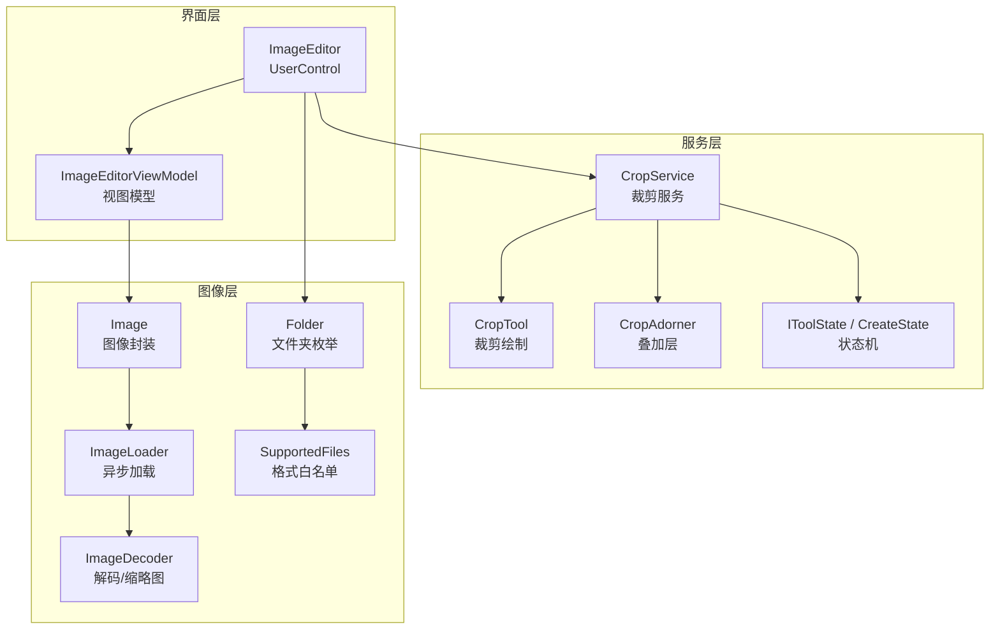
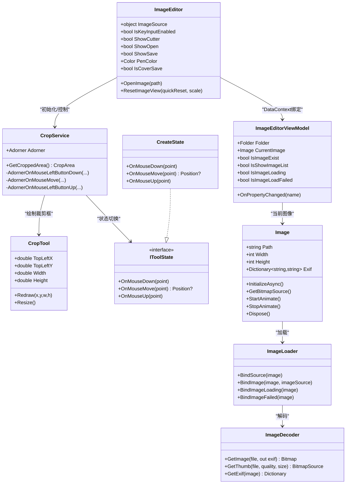
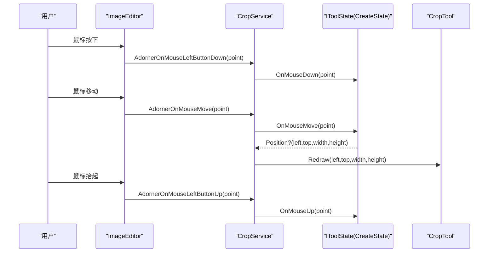
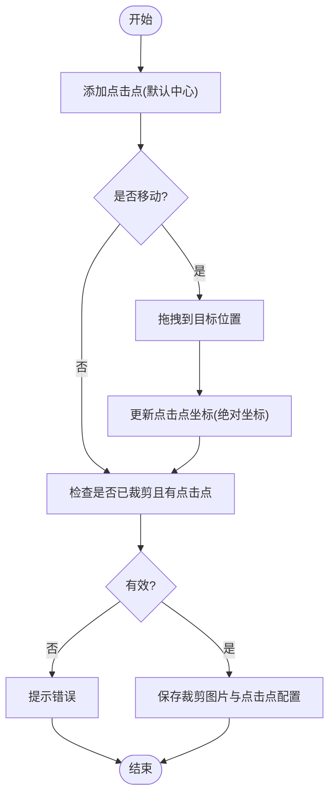
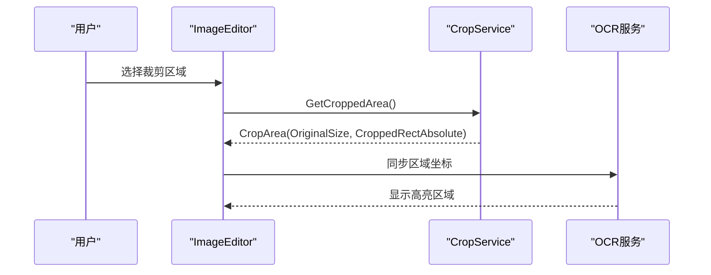
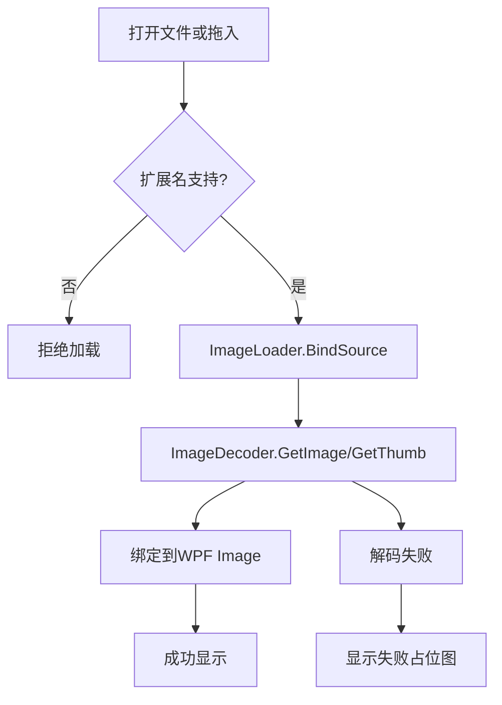
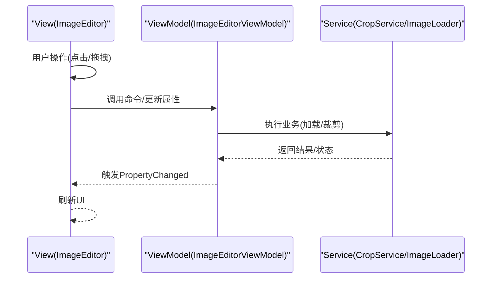
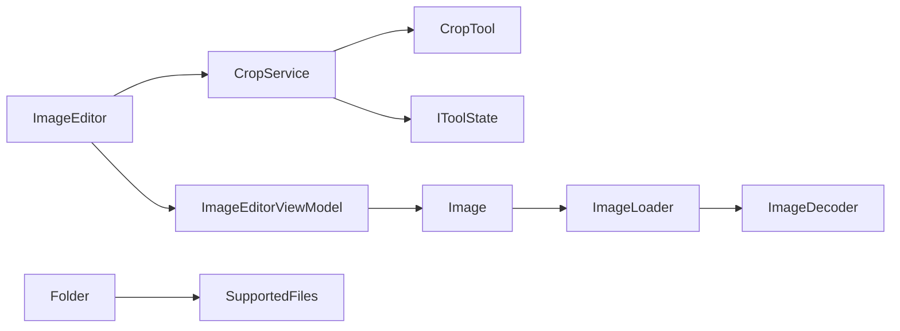

# 图片编辑工具

<cite>
**本文引用的文件**   
- [Readme.md](file://Readme.md)
- [ImageEditor.xaml.cs](file://ShaoLu/Tools/ImageEdit/ImageEditor.xaml.cs)
- [ImageEditorViewModel.cs](file://ShaoLu/Tools/ImageEdit/ImageEditorViewModel.cs)
- [Image.cs](file://ShaoLu/Tools/ImageEdit/Image.cs)
- [ImageLoader.cs](file://ShaoLu/Tools/ImageEdit/ImageLoader.cs)
- [ImageDecoder.cs](file://ShaoLu/Tools/ImageEdit/ImageDecoder.cs)
- [SupportedFiles.cs](file://ShaoLu/Tools/ImageEdit/SupportedFiles.cs)
- [CropService.cs](file://ShaoLu/Tools/ImageEdit/services/CropService.cs)
- [CropTool.cs](file://ShaoLu/Tools/ImageEdit/services/Tools/CropTool.cs)
- [CropAdorner.cs](file://ShaoLu/Tools/ImageEdit/services/CropAdorner.cs)
- [IToolState.cs](file://ShaoLu/Tools/ImageEdit/services/State/IToolState.cs)
- [CreateState.cs](file://ShaoLu/Tools/ImageEdit/services/State/CreateState.cs)
- [Folder.cs](file://ShaoLu/Tools/ImageEdit/Folder.cs)
</cite>

## 目录
1. [简介](#简介)
2. [项目结构](#项目结构)
3. [核心组件](#核心组件)
4. [架构总览](#架构总览)
5. [详细组件分析](#详细组件分析)
6. [依赖关系分析](#依赖关系分析)
7. [性能考量](#性能考量)
8. [故障排查指南](#故障排查指南)
9. [结论](#结论)
10. [附录：最佳实践与常见问题](#附录最佳实践与常见问题)

## 简介
本文件为 ShaoLu 的图片编辑工具提供完整的使用与技术文档，覆盖以下能力：
- 图片裁剪：矩形区域选择、拖拽调整、尺寸约束与实时预览
- 点击点管理：单/多点击点设置、坐标计算与相对位置保持
- OCR 区域设置：区域选择、坐标同步与显示效果
- 图片格式支持、文件保存机制与工作目录管理
- MVVM 架构实现、数据绑定与命令模式应用
- 最佳实践：图片质量优化、存储路径管理与批量处理技巧
- 实际操作演示与常见问题解决方案

## 项目结构
图片编辑功能位于 Tools\ImageEdit 目录下，采用 WPF + MVVM 组织方式。关键目录与职责如下：
- Controls：自定义控件（如 MultiCropImage）
- Services：裁剪服务、状态机、工具集（CropService、CropTool、ShadeTool、ThumbTool、TextTool）
- Services\State：裁剪交互状态（CreateState、DragState、CompleteState、IToolState）
- ViewModels：MVVM 视图模型（ImageEditorViewModel 等）
- Utils：图像处理与数值工具（ImageWork、NumberUtils）
- Interop/Helpers：系统互操作与截图辅助（Win32Helper、MonitorHelper、ScreenshotHelper）
- Resources/Themes/Templates：资源与样式
- 根级入口：ImageEditor（UserControl）、MainWin/MainWindow（窗口）

图表来源 
- [ImageEditor.xaml.cs:1-210](file://ShaoLu/Tools/ImageEdit/ImageEditor.xaml.cs#L1-L210)
- [ImageEditorViewModel.cs:1-116](file://ShaoLu/Tools/ImageEdit/ImageEditorViewModel.cs#L1-L116)
- [CropService.cs:1-190](file://ShaoLu/Tools/ImageEdit/services/CropService.cs#L1-L190)
- [CropTool.cs:1-74](file://ShaoLu/Tools/ImageEdit/services/Tools/CropTool.cs#L1-L74)
- [CropAdorner.cs:1-32](file://ShaoLu/Tools/ImageEdit/services/CropAdorner.cs#L1-L32)
- [IToolState.cs:1-11](file://ShaoLu/Tools/ImageEdit/services/State/IToolState.cs#L1-L11)
- [CreateState.cs:1-75](file://ShaoLu/Tools/ImageEdit/services/State/CreateState.cs#L1-L75)
- [Image.cs:1-171](file://ShaoLu/Tools/ImageEdit/Image.cs#L1-L171)
- [ImageLoader.cs:1-112](file://ShaoLu/Tools/ImageEdit/ImageLoader.cs#L1-L112)
- [ImageDecoder.cs:1-221](file://ShaoLu/Tools/ImageEdit/ImageDecoder.cs#L1-L221)
- [SupportedFiles.cs:1-73](file://ShaoLu/Tools/ImageEdit/SupportedFiles.cs#L1-L73)
- [Folder.cs:1-33](file://ShaoLu/Tools/ImageEdit/Folder.cs#L1-L33)

章节来源
- [Readme.md:225-283](file://Readme.md#L225-L283)
- [ImageEditor.xaml.cs:1-210](file://ShaoLu/Tools/ImageEdit/ImageEditor.xaml.cs#L1-L210)
- [ImageEditorViewModel.cs:1-116](file://ShaoLu/Tools/ImageEdit/ImageEditorViewModel.cs#L1-L116)

## 核心组件
- ImageEditor（UserControl）
  - 负责 UI 事件绑定、拖放、缩放/平移/旋转、快捷键、裁剪服务初始化与生命周期管理
  - 通过 DataContext 绑定 ImageEditorViewModel，驱动界面状态更新
- ImageEditorViewModel
  - 维护 Folder、CurrentImage、IsImageLoading、IsImageLoadFailed 等属性，触发 PropertyChanged 通知 UI
- CropService
  - 基于 Adorner 叠加 Canvas，协调 CropTool、状态机（Create/Drag/Complete），对外暴露 GetCroppedArea()
- CropTool
  - 管理裁剪框、遮罩、缩放手柄、文本标注的绘制与重绘
- Image / ImageLoader / ImageDecoder
  - Image 封装 Bitmap、EXIF、动画帧；ImageLoader 异步绑定到 WPF Image；ImageDecoder 使用 Magick.NET 解码并生成 BitmapSource
- SupportedFiles / Folder
  - 支持的扩展名白名单与文件夹扫描过滤

章节来源
- [ImageEditor.xaml.cs:163-210](file://ShaoLu/Tools/ImageEdit/ImageEditor.xaml.cs#L163-L210)
- [ImageEditorViewModel.cs:1-116](file://ShaoLu/Tools/ImageEdit/ImageEditorViewModel.cs#L1-L116)
- [CropService.cs:26-118](file://ShaoLu/Tools/ImageEdit/services/CropService.cs#L26-L118)
- [CropTool.cs:1-74](file://ShaoLu/Tools/ImageEdit/services/Tools/CropTool.cs#L1-L74)
- [Image.cs:1-171](file://ShaoLu/Tools/ImageEdit/Image.cs#L1-L171)
- [ImageLoader.cs:1-112](file://ShaoLu/Tools/ImageEdit/ImageLoader.cs#L1-L112)
- [ImageDecoder.cs:1-221](file://ShaoLu/Tools/ImageEdit/ImageDecoder.cs#L1-L221)
- [SupportedFiles.cs:1-73](file://ShaoLu/Tools/ImageEdit/SupportedFiles.cs#L1-L73)
- [Folder.cs:1-33](file://ShaoLu/Tools/ImageEdit/Folder.cs#L1-L33)

## 架构总览
整体采用 MVVM + 服务化设计：
- View（ImageEditor）仅处理输入与展示，不承载业务逻辑
- ViewModel（ImageEditorViewModel）暴露可绑定属性，响应 UI 变化
- Service（CropService、ImageLoader、ImageDecoder）封装具体实现
- 状态机（IToolState 及派生类）解耦裁剪交互流程

图表来源 
- [ImageEditor.xaml.cs:1-210](file://ShaoLu/Tools/ImageEdit/ImageEditor.xaml.cs#L1-L210)
- [ImageEditorViewModel.cs:1-116](file://ShaoLu/Tools/ImageEdit/ImageEditorViewModel.cs#L1-L116)
- [CropService.cs:1-190](file://ShaoLu/Tools/ImageEdit/services/CropService.cs#L1-L190)
- [CropTool.cs:1-74](file://ShaoLu/Tools/ImageEdit/services/Tools/CropTool.cs#L1-L74)
- [IToolState.cs:1-11](file://ShaoLu/Tools/ImageEdit/services/State/IToolState.cs#L1-L11)
- [CreateState.cs:1-75](file://ShaoLu/Tools/ImageEdit/services/State/CreateState.cs#L1-L75)
- [Image.cs:1-171](file://ShaoLu/Tools/ImageEdit/Image.cs#L1-L171)
- [ImageLoader.cs:1-112](file://ShaoLu/Tools/ImageEdit/ImageLoader.cs#L1-L112)
- [ImageDecoder.cs:1-221](file://ShaoLu/Tools/ImageEdit/ImageDecoder.cs#L1-L221)

## 详细组件分析

### 图片裁剪：矩形区域选择、拖拽调整、尺寸约束与实时预览
- 交互流程
  - 用户按下鼠标：根据命中检测进入“创建”或“拖拽”状态
  - 移动鼠标：状态机返回新矩形，CropTool.Redraw 实时更新
  - 释放鼠标：结束交互，回到完成状态
- 尺寸约束
  - 创建时限制在画布边界内，防止越界
- 实时预览
  - 遮罩层与虚线框、缩放手柄、尺寸文本实时刷新

图表来源 
- [CropService.cs:138-187](file://ShaoLu/Tools/ImageEdit/services/CropService.cs#L138-L187)
- [CreateState.cs:21-41](file://ShaoLu/Tools/ImageEdit/services/State/CreateState.cs#L21-L41)
- [CropTool.cs:65-71](file://ShaoLu/Tools/ImageEdit/services/Tools/CropTool.cs#L65-L71)

章节来源
- [CropService.cs:26-118](file://ShaoLu/Tools/ImageEdit/services/CropService.cs#L26-L118)
- [CreateState.cs:43-72](file://ShaoLu/Tools/ImageEdit/services/State/CreateState.cs#L43-L72)
- [CropTool.cs:1-74](file://ShaoLu/Tools/ImageEdit/services/Tools/CropTool.cs#L1-L74)

### 点击点管理：单/多点击点、坐标计算与相对位置保持
- 功能要点
  - 添加点击点：默认置于图片中心，支持多个点击点并按顺序执行
  - 移动点击点：直接拖拽红色圆形标记
  - 查看坐标：悬停显示绝对坐标
  - 重置/删除/隐藏：右键菜单或顶部菜单批量操作
- 坐标计算与相对位置
  - 点击点坐标以原图坐标系为准，保存时记录相对于裁剪区域的偏移，确保缩放/平移后仍指向同一物理位置
  - 运行时按点击点列表顺序依次点击，适用于同一界面多点点击场景

章节来源
- [Readme.md:249-281](file://Readme.md#L249-L281)
- [ImageEditor.xaml.cs:163-210](file://ShaoLu/Tools/ImageEdit/ImageEditor.xaml.cs#L163-L210)

### OCR 区域设置：区域选择、坐标同步与显示效果
- 区域选择
  - 在编辑窗口中通过裁剪框选择识别区域，区域坐标与裁剪服务保持一致
- 坐标同步
  - 将裁剪区域坐标同步至 OCR 配置，保证识别范围与实际显示一致
- 显示效果
  - 使用遮罩与高亮边框突出显示 OCR 区域，便于确认

图表来源 
- [CropService.cs:132-136](file://ShaoLu/Tools/ImageEdit/services/CropService.cs#L132-L136)

章节来源
- [CropService.cs:132-136](file://ShaoLu/Tools/ImageEdit/services/CropService.cs#L132-L136)

### 图片格式支持与文件保存机制、工作目录管理
- 格式支持
  - SupportedFiles 定义常见与非标准格式白名单（jpg/png/gif/bmp/tiff/webp/heic/raw 等）
  - Folder 扫描目录时过滤隐藏/系统/临时文件，仅保留支持格式
- 文件加载与解码
  - ImageLoader 异步绑定到 WPF Image，失败时显示占位图
  - ImageDecoder 使用 Magick.NET 解码，GIF 特殊处理，提取 EXIF
- 保存机制
  - 保存时需同时具备裁剪图片与至少一个点击点，否则报错
  - 支持覆盖保存开关（IsCoverSave）

图表来源 
- [SupportedFiles.cs:19-50](file://ShaoLu/Tools/ImageEdit/SupportedFiles.cs#L19-L50)
- [Folder.cs:14-30](file://ShaoLu/Tools/ImageEdit/Folder.cs#L14-L30)
- [ImageLoader.cs:41-77](file://ShaoLu/Tools/ImageEdit/ImageLoader.cs#L41-L77)
- [ImageDecoder.cs:46-79](file://ShaoLu/Tools/ImageEdit/ImageDecoder.cs#L46-L79)

章节来源
- [SupportedFiles.cs:1-73](file://ShaoLu/Tools/ImageEdit/SupportedFiles.cs#L1-L73)
- [Folder.cs:1-33](file://ShaoLu/Tools/ImageEdit/Folder.cs#L1-L33)
- [ImageLoader.cs:1-112](file://ShaoLu/Tools/ImageEdit/ImageLoader.cs#L1-L112)
- [ImageDecoder.cs:1-221](file://ShaoLu/Tools/ImageEdit/ImageDecoder.cs#L1-L221)
- [Readme.md:272-281](file://Readme.md#L272-L281)

### MVVM 架构实现、数据绑定与命令模式应用
- 数据绑定
  - ImageEditor.DataContext = new ImageEditorViewModel()
  - 属性变更通过 INotifyPropertyChanged 通知 UI（CurrentImage、IsImageLoading、IsImageLoadFailed 等）
- 命令模式
  - 按钮与菜单操作通过 ICommand（RelayCommand）绑定到 ViewModel 方法，解耦 UI 与逻辑
- 视图与模型分离
  - ImageEditor 仅处理输入与渲染，业务逻辑集中在 ViewModel 与服务层

图表来源 
- [ImageEditor.xaml.cs:163-170](file://ShaoLu/Tools/ImageEdit/ImageEditor.xaml.cs#L163-L170)
- [ImageEditorViewModel.cs:109-113](file://ShaoLu/Tools/ImageEdit/ImageEditorViewModel.cs#L109-L113)

章节来源
- [ImageEditor.xaml.cs:163-210](file://ShaoLu/Tools/ImageEdit/ImageEditor.xaml.cs#L163-L210)
- [ImageEditorViewModel.cs:1-116](file://ShaoLu/Tools/ImageEdit/ImageEditorViewModel.cs#L1-L116)

## 依赖关系分析
- 组件耦合
  - ImageEditor 强依赖 ImageEditorViewModel 与 CropService
  - CropService 依赖 CropTool 与状态机接口，松耦合易扩展
  - ImageLoader 与 ImageDecoder 解耦于 UI，便于替换解码器
- 外部依赖
  - Magick.NET 用于图像解码与 EXIF 读取
  - Win32/GDI 用于句柄释放与位图转换

图表来源 
- [ImageEditor.xaml.cs:163-210](file://ShaoLu/Tools/ImageEdit/ImageEditor.xaml.cs#L163-L210)
- [CropService.cs:26-118](file://ShaoLu/Tools/ImageEdit/services/CropService.cs#L26-L118)
- [Image.cs:1-171](file://ShaoLu/Tools/ImageEdit/Image.cs#L1-L171)
- [ImageLoader.cs:1-112](file://ShaoLu/Tools/ImageEdit/ImageLoader.cs#L1-L112)
- [ImageDecoder.cs:1-221](file://ShaoLu/Tools/ImageEdit/ImageDecoder.cs#L1-L221)
- [Folder.cs:1-33](file://ShaoLu/Tools/ImageEdit/Folder.cs#L1-L33)
- [SupportedFiles.cs:1-73](file://ShaoLu/Tools/ImageEdit/SupportedFiles.cs#L1-L73)

章节来源
- [ImageEditor.xaml.cs:1-210](file://ShaoLu/Tools/ImageEdit/ImageEditor.xaml.cs#L1-L210)
- [CropService.cs:1-190](file://ShaoLu/Tools/ImageEdit/services/CropService.cs#L1-L190)
- [Image.cs:1-171](file://ShaoLu/Tools/ImageEdit/Image.cs#L1-L171)
- [ImageLoader.cs:1-112](file://ShaoLu/Tools/ImageEdit/ImageLoader.cs#L1-L112)
- [ImageDecoder.cs:1-221](file://ShaoLu/Tools/ImageEdit/ImageDecoder.cs#L1-L221)
- [Folder.cs:1-33](file://ShaoLu/Tools/ImageEdit/Folder.cs#L1-L33)
- [SupportedFiles.cs:1-73](file://ShaoLu/Tools/ImageEdit/SupportedFiles.cs#L1-L73)

## 性能考量
- 异步加载与冻结
  - ImageLoader 使用线程池与 Dispatcher.Invoke 避免阻塞 UI
  - BitmapSource.Freeze() 提升跨线程访问性能
- 高质量缩放与渲染
  - RenderOptions.SetBitmapScalingMode 设置为 HighQuality/NearestNeighbor 平衡清晰度与速度
- GIF 动画
  - ImageAnimator 逐帧更新，注意停止动画释放资源
- 内存管理
  - Dispose 释放 Bitmap 与事件订阅，GC.Collect 强制回收

[本节为通用指导，无需代码引用]

## 故障排查指南
- 图片加载失败
  - 检查扩展名是否在 SupportedFiles 白名单
  - 查看 ImageLoader.BindImageFailed 与 ImageDecoder 异常日志
- 裁剪区域无效
  - 确保已裁剪且存在至少一个点击点
  - 检查 CreateState 的边界限制逻辑
- 坐标不同步
  - 确认 CropArea 的 OriginalSize 与 CroppedRectAbsolute 正确传递
  - 验证点击点坐标基于原图坐标系计算

章节来源
- [ImageLoader.cs:101-110](file://ShaoLu/Tools/ImageEdit/ImageLoader.cs#L101-L110)
- [ImageDecoder.cs:72-79](file://ShaoLu/Tools/ImageEdit/ImageDecoder.cs#L72-L79)
- [CropService.cs:132-136](file://ShaoLu/Tools/ImageEdit/services/CropService.cs#L132-L136)
- [CreateState.cs:43-72](file://ShaoLu/Tools/ImageEdit/services/State/CreateState.cs#L43-L72)
- [Readme.md:272-281](file://Readme.md#L272-L281)

## 结论
ShaoLu 图片编辑工具以 MVVM 为核心，结合服务化与状态机设计，实现了稳定高效的裁剪、点击点管理与 OCR 区域设置能力。通过异步加载、高质量渲染与严格的格式白名单，兼顾了用户体验与性能。建议在实际使用中遵循最佳实践，以获得更优的识别准确率与运行稳定性。

[本节为总结性内容，无需代码引用]

## 附录：最佳实践与常见问题
- 图片质量优化
  - 裁剪区域尽量小且特征明显，提高匹配速度与准确率
  - 使用高质量缩放模式，避免模糊
- 存储路径管理
  - 合理组织工作目录，避免权限问题
  - 启用覆盖保存开关需谨慎，避免误覆盖
- 批量处理技巧
  - 利用 Folder 批量加载同目录图片，配合左右箭头快速切换
  - 统一命名规范，便于自动化脚本处理
- 常见问题
  - 无法加载某些格式：检查 SupportedFiles 白名单
  - 点击点坐标偏移：确认缩放/平移后的相对坐标计算
  - GIF 播放卡顿：及时停止动画并释放资源

[本节为通用指导，无需代码引用]