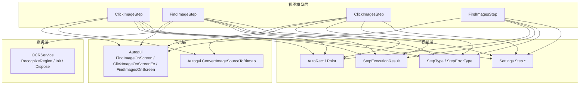
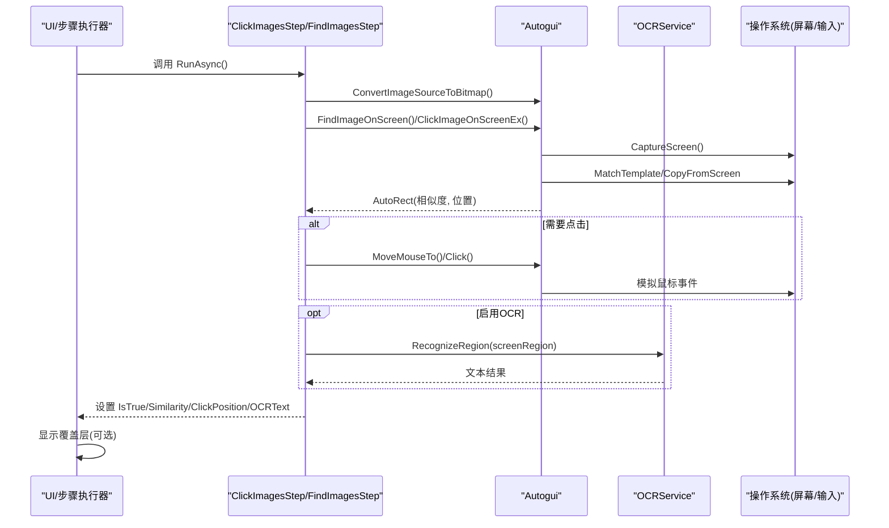
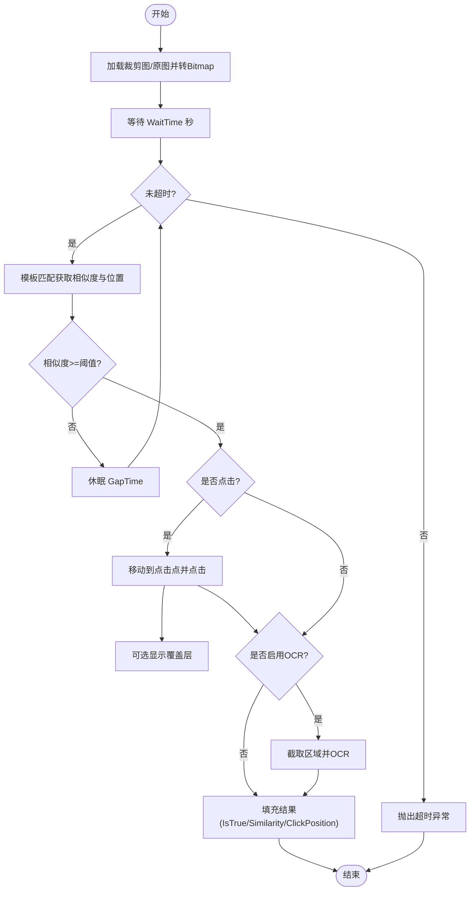
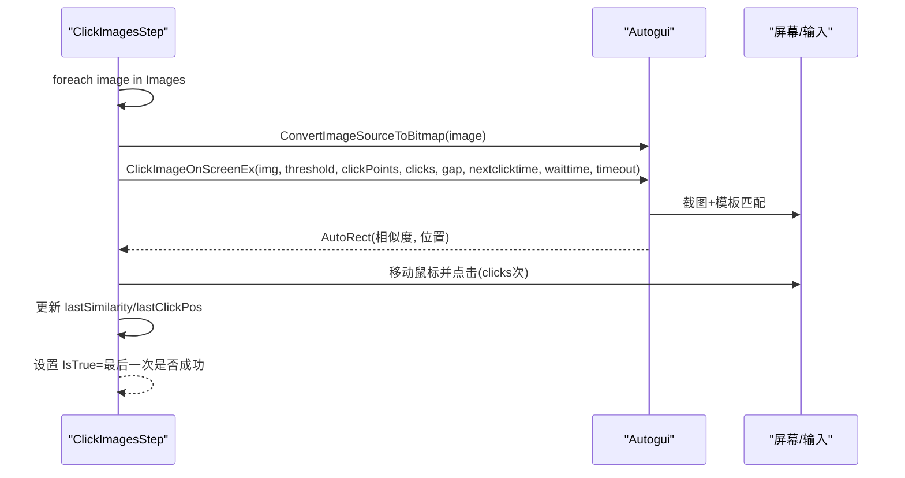
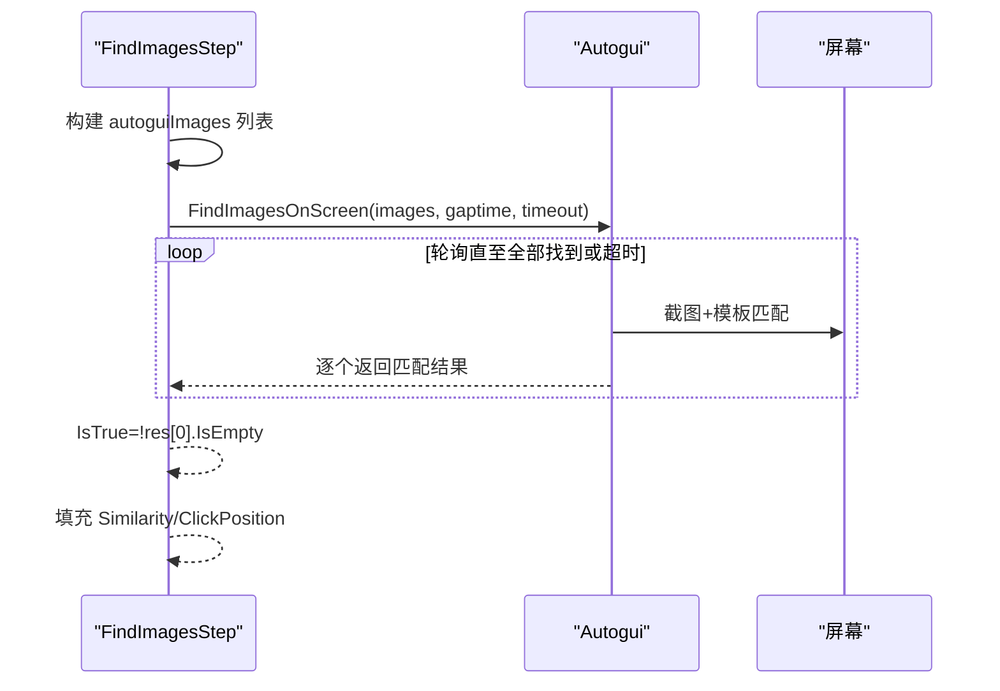
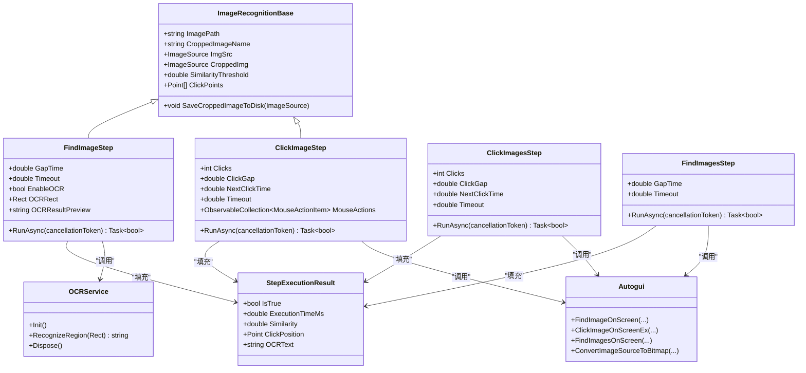

# 多图识别处理

<cite>
**本文引用的文件**   
- [ImagesRecognition.cs](file://ShaoLu/Viewmodels/ImagesRecognition.cs)
- [ImageRecognition.cs](file://ShaoLu/Viewmodels/ImageRecognition.cs)
- [Autogui.cs](file://ShaoLu/Utils/Autogui.cs)
- [OCRService.cs](file://ShaoLu/Services/OCRService.cs)
- [AutoguiModel.cs](file://ShaoLu/Models/AutoguiModel.cs)
- [AutomationStepModel.cs](file://ShaoLu/Models/AutomationStepModel.cs)
- [StepExecutionResult.cs](file://ShaoLu/Models/StepExecutionResult.cs)
- [Settings.cs](file://ShaoLu/Models/Settings.cs)
- [MouseActionItem.cs](file://ShaoLu/Models/MouseActionItem.cs)
- [Readme.md](file://Readme.md)
</cite>

## 目录
1. [简介](#简介)
2. [项目结构](#项目结构)
3. [核心组件](#核心组件)
4. [架构总览](#架构总览)
5. [详细组件分析](#详细组件分析)
6. [依赖关系分析](#依赖关系分析)
7. [性能考量](#性能考量)
8. [故障排查指南](#故障排查指南)
9. [结论](#结论)
10. [附录：配置与使用场景](#附录配置与使用场景)

## 简介
本技术文档聚焦 ShaoLu 的“多图识别处理”能力，系统阐述批量图像处理、点击与查找的执行流程、结果聚合、性能优化（内存、线程、缓存）、错误处理与重试机制，以及配置项与典型使用场景。读者可据此理解并扩展多图识别自动化流程。

## 项目结构
围绕多图识别的核心代码分布在 Viewmodels、Utils、Services、Models 四个层次：
- Viewmodels：定义单图与多图步骤模型及执行逻辑（ClickImageStep、FindImageStep、ClickImagesStep、FindImagesStep）
- Utils：封装屏幕截图、模板匹配、鼠标模拟、图像格式转换等底层能力（Autogui）
- Services：OCR 服务封装（OCRService），提供区域 OCR 与 DPI 缓存
- Models：数据模型（AutoRect、Point、StepType、StepErrorType、StepExecutionResult、Settings 等）

图表来源 
- [ImagesRecognition.cs:71-168](file://ShaoLu/Viewmodels/ImagesRecognition.cs#L71-L168)
- [ImagesRecognition.cs:170-242](file://ShaoLu/Viewmodels/ImagesRecognition.cs#L170-L242)
- [ImageRecognition.cs:329-436](file://ShaoLu/Viewmodels/ImageRecognition.cs#L329-L436)
- [ImageRecognition.cs:439-600](file://ShaoLu/Viewmodels/ImageRecognition.cs#L439-L600)
- [Autogui.cs:59-122](file://ShaoLu/Utils/Autogui.cs#L59-L122)
- [Autogui.cs:124-171](file://ShaoLu/Utils/Autogui.cs#L124-L171)
- [Autogui.cs:256-306](file://ShaoLu/Utils/Autogui.cs#L256-L306)
- [Autogui.cs:344-378](file://ShaoLu/Utils/Autogui.cs#L344-L378)
- [OCRService.cs:114-144](file://ShaoLu/Services/OCRService.cs#L114-L144)
- [AutoguiModel.cs:89-144](file://ShaoLu/Models/AutoguiModel.cs#L89-L144)
- [AutomationStepModel.cs:9-43](file://ShaoLu/Models/AutomationStepModel.cs#L9-L43)
- [StepExecutionResult.cs:8-49](file://ShaoLu/Models/StepExecutionResult.cs#L8-L49)
- [Settings.cs:33-100](file://ShaoLu/Models/Settings.cs#L33-L100)

章节来源
- [ImagesRecognition.cs:71-168](file://ShaoLu/Viewmodels/ImagesRecognition.cs#L71-L168)
- [ImagesRecognition.cs:170-242](file://ShaoLu/Viewmodels/ImagesRecognition.cs#L170-L242)
- [ImageRecognition.cs:329-436](file://ShaoLu/Viewmodels/ImageRecognition.cs#L329-L436)
- [ImageRecognition.cs:439-600](file://ShaoLu/Viewmodels/ImageRecognition.cs#L439-L600)
- [Autogui.cs:59-122](file://ShaoLu/Utils/Autogui.cs#L59-L122)
- [Autogui.cs:124-171](file://ShaoLu/Utils/Autogui.cs#L124-L171)
- [Autogui.cs:256-306](file://ShaoLu/Utils/Autogui.cs#L256-L306)
- [Autogui.cs:344-378](file://ShaoLu/Utils/Autogui.cs#L344-L378)
- [OCRService.cs:114-144](file://ShaoLu/Services/OCRService.cs#L114-L144)
- [AutoguiModel.cs:89-144](file://ShaoLu/Models/AutoguiModel.cs#L89-L144)
- [AutomationStepModel.cs:9-43](file://ShaoLu/Models/AutomationStepModel.cs#L9-L43)
- [StepExecutionResult.cs:8-49](file://ShaoLu/Models/StepExecutionResult.cs#L8-L49)
- [Settings.cs:33-100](file://ShaoLu/Models/Settings.cs#L33-L100)

## 核心组件
- 单图识图步骤
  - ClickImageStep：找到图片后按点击点或默认中心点击，支持多次点击与间隔控制，支持鼠标动作序列
  - FindImageStep：仅查找图片，返回是否找到；可选启用 OCR 对指定区域进行文字识别
- 多图识图步骤
  - ClickImagesStep：按列表顺序逐一查找并点击多张图片，支持每图独立阈值与点击点
  - FindImagesStep：同时查找多张图片，判断是否全部找到，用于条件分支
- 基础能力
  - Autogui：模板匹配、截图、鼠标模拟、图像格式转换
  - OCRService：Tesseract 引擎封装、DPI 缓存、区域 OCR
  - 数据模型：AutoRect/Point 表示匹配结果坐标与相似度；StepExecutionResult 记录执行结果

章节来源
- [ImageRecognition.cs:329-436](file://ShaoLu/Viewmodels/ImageRecognition.cs#L329-L436)
- [ImageRecognition.cs:439-600](file://ShaoLu/Viewmodels/ImageRecognition.cs#L439-L600)
- [ImagesRecognition.cs:71-168](file://ShaoLu/Viewmodels/ImagesRecognition.cs#L71-L168)
- [ImagesRecognition.cs:170-242](file://ShaoLu/Viewmodels/ImagesRecognition.cs#L170-L242)
- [Autogui.cs:59-122](file://ShaoLu/Utils/Autogui.cs#L59-L122)
- [Autogui.cs:124-171](file://ShaoLu/Utils/Autogui.cs#L124-L171)
- [Autogui.cs:256-306](file://ShaoLu/Utils/Autogui.cs#L256-L306)
- [Autogui.cs:344-378](file://ShaoLu/Utils/Autogui.cs#L344-L378)
- [OCRService.cs:114-144](file://ShaoLu/Services/OCRService.cs#L114-L144)
- [AutoguiModel.cs:89-144](file://ShaoLu/Models/AutoguiModel.cs#L89-L144)
- [StepExecutionResult.cs:8-49](file://ShaoLu/Models/StepExecutionResult.cs#L8-L49)

## 架构总览
下图展示从 UI 步骤到图像识别与 OCR 的调用链，以及结果回写与覆盖层可视化。

图表来源 
- [ImagesRecognition.cs:122-167](file://ShaoLu/Viewmodels/ImagesRecognition.cs#L122-L167)
- [ImagesRecognition.cs:214-241](file://ShaoLu/Viewmodels/ImagesRecognition.cs#L214-L241)
- [ImageRecognition.cs:399-435](file://ShaoLu/Viewmodels/ImageRecognition.cs#L399-L435)
- [ImageRecognition.cs:535-599](file://ShaoLu/Viewmodels/ImageRecognition.cs#L535-L599)
- [Autogui.cs:59-122](file://ShaoLu/Utils/Autogui.cs#L59-L122)
- [Autogui.cs:256-306](file://ShaoLu/Utils/Autogui.cs#L256-L306)
- [Autogui.cs:344-378](file://ShaoLu/Utils/Autogui.cs#L344-L378)
- [OCRService.cs:114-144](file://ShaoLu/Services/OCRService.cs#L114-L144)

## 详细组件分析

### 单图点击与查找（ClickImageStep / FindImageStep）
- 执行流程
  - 加载裁剪图或原图，转换为 Bitmap
  - 等待 WaitTime 秒后进入循环匹配
  - 使用模板匹配获取最大相似度与位置
  - 若找到则点击（ClickImageStep）或返回结果（FindImageStep）
  - 可选在屏幕上显示匹配区域或点击位置的覆盖层
  - 可选对指定区域执行 OCR 并回填 OCRText
- 关键参数
  - SimilarityThreshold：相似度阈值
  - Timeout：超时时间
  - GapTime：查找间隔（FindImageStep）
  - Clicks/ClickGap/NextClickTime：点击次数与间隔
  - MouseActions：鼠标动作序列（ClickImageStep）

图表来源 
- [ImageRecognition.cs:399-435](file://ShaoLu/Viewmodels/ImageRecognition.cs#L399-L435)
- [ImageRecognition.cs:535-599](file://ShaoLu/Viewmodels/ImageRecognition.cs#L535-L599)
- [Autogui.cs:59-122](file://ShaoLu/Utils/Autogui.cs#L59-L122)
- [Autogui.cs:256-306](file://ShaoLu/Utils/Autogui.cs#L256-L306)
- [OCRService.cs:114-144](file://ShaoLu/Services/OCRService.cs#L114-L144)

章节来源
- [ImageRecognition.cs:329-436](file://ShaoLu/Viewmodels/ImageRecognition.cs#L329-L436)
- [ImageRecognition.cs:439-600](file://ShaoLu/Viewmodels/ImageRecognition.cs#L439-L600)
- [Autogui.cs:59-122](file://ShaoLu/Utils/Autogui.cs#L59-L122)
- [Autogui.cs:256-306](file://ShaoLu/Utils/Autogui.cs#L256-L306)
- [OCRService.cs:114-144](file://ShaoLu/Services/OCRService.cs#L114-L144)

### 多图点击（ClickImagesStep）
- 执行策略
  - 遍历 Images 列表，逐张图执行“等待→匹配→点击”流程
  - 每张图片可独立设置阈值与点击点
  - 最后一条成功记录的相似度与点击位置作为本次执行结果
- 资源与并发
  - 当前实现为顺序执行（foreach + await Task.Run），非并行
  - 通过 Task.Run 将 CPU 密集操作（模板匹配）移出 UI 线程

图表来源 
- [ImagesRecognition.cs:122-167](file://ShaoLu/Viewmodels/ImagesRecognition.cs#L122-L167)
- [Autogui.cs:256-306](file://ShaoLu/Utils/Autogui.cs#L256-L306)

章节来源
- [ImagesRecognition.cs:71-168](file://ShaoLu/Viewmodels/ImagesRecognition.cs#L71-L168)
- [Autogui.cs:256-306](file://ShaoLu/Utils/Autogui.cs#L256-L306)

### 多图查找（FindImagesStep）
- 执行策略
  - 将所有图片转为 AutoguiImage 列表（含阈值）
  - 调用 FindImagesOnScreen 循环轮询，直到全部找到或超时
  - 返回首个匹配结果（IsEmpty 判定整体是否成功）
- 结果聚合
  - IsTrue = !res[0].IsEmpty
  - Similarity/ClickPosition 取自第一个匹配结果

图表来源 
- [ImagesRecognition.cs:214-241](file://ShaoLu/Viewmodels/ImagesRecognition.cs#L214-L241)
- [Autogui.cs:124-171](file://ShaoLu/Utils/Autogui.cs#L124-L171)

章节来源
- [ImagesRecognition.cs:170-242](file://ShaoLu/Viewmodels/ImagesRecognition.cs#L170-L242)
- [Autogui.cs:124-171](file://ShaoLu/Utils/Autogui.cs#L124-L171)

### OCR 集成（FindImageStep）
- 当 EnableOCR 为真且找到图片时，基于 OCRRect 计算屏幕区域（考虑 DPI 缩放与 CroppedRect 偏移）
- 调用 OCRService.RecognizeRegion 进行区域 OCR，并将结果写入 LastResult.OCRText
- 支持在屏幕上显示 OCR 区域的覆盖层

章节来源
- [ImageRecognition.cs:535-599](file://ShaoLu/Viewmodels/ImageRecognition.cs#L535-L599)
- [OCRService.cs:114-144](file://ShaoLu/Services/OCRService.cs#L114-L144)

## 依赖关系分析
- 视图模型依赖 Autogui 完成图像匹配与鼠标操作
- FindImageStep 依赖 OCRService 进行区域 OCR
- 所有步骤共享 Settings.Step.* 配置（默认阈值、超时、覆盖层开关等）
- 结果统一通过 StepExecutionResult 传递

图表来源 
- [ImageRecognition.cs:21-325](file://ShaoLu/Viewmodels/ImageRecognition.cs#L21-L325)
- [ImageRecognition.cs:329-436](file://ShaoLu/Viewmodels/ImageRecognition.cs#L329-L436)
- [ImageRecognition.cs:439-600](file://ShaoLu/Viewmodels/ImageRecognition.cs#L439-L600)
- [ImagesRecognition.cs:71-168](file://ShaoLu/Viewmodels/ImagesRecognition.cs#L71-L168)
- [ImagesRecognition.cs:170-242](file://ShaoLu/Viewmodels/ImagesRecognition.cs#L170-L242)
- [Autogui.cs:59-122](file://ShaoLu/Utils/Autogui.cs#L59-L122)
- [Autogui.cs:124-171](file://ShaoLu/Utils/Autogui.cs#L124-L171)
- [Autogui.cs:256-306](file://ShaoLu/Utils/Autogui.cs#L256-L306)
- [Autogui.cs:344-378](file://ShaoLu/Utils/Autogui.cs#L344-L378)
- [OCRService.cs:53-75](file://ShaoLu/Services/OCRService.cs#L53-L75)
- [OCRService.cs:114-144](file://ShaoLu/Services/OCRService.cs#L114-L144)
- [StepExecutionResult.cs:8-49](file://ShaoLu/Models/StepExecutionResult.cs#L8-L49)

章节来源
- [ImageRecognition.cs:21-325](file://ShaoLu/Viewmodels/ImageRecognition.cs#L21-L325)
- [ImageRecognition.cs:329-436](file://ShaoLu/Viewmodels/ImageRecognition.cs#L329-L436)
- [ImageRecognition.cs:439-600](file://ShaoLu/Viewmodels/ImageRecognition.cs#L439-L600)
- [ImagesRecognition.cs:71-168](file://ShaoLu/Viewmodels/ImagesRecognition.cs#L71-L168)
- [ImagesRecognition.cs:170-242](file://ShaoLu/Viewmodels/ImagesRecognition.cs#L170-L242)
- [Autogui.cs:59-122](file://ShaoLu/Utils/Autogui.cs#L59-L122)
- [Autogui.cs:124-171](file://ShaoLu/Utils/Autogui.cs#L124-L171)
- [Autogui.cs:256-306](file://ShaoLu/Utils/Autogui.cs#L256-L306)
- [Autogui.cs:344-378](file://ShaoLu/Utils/Autogui.cs#L344-L378)
- [OCRService.cs:53-75](file://ShaoLu/Services/OCRService.cs#L53-L75)
- [OCRService.cs:114-144](file://ShaoLu/Services/OCRService.cs#L114-L144)
- [StepExecutionResult.cs:8-49](file://ShaoLu/Models/StepExecutionResult.cs#L8-L49)

## 性能考量
- 线程模型
  - 所有图像匹配与截图均在后台线程执行（Task.Run），避免阻塞 UI
  - 多图点击/查找当前为顺序执行，适合大多数场景；如需更高吞吐可在上层引入任务并行（例如 Parallel.ForEachAsync）
- 内存管理
  - 图像转换与模板匹配过程中频繁创建临时对象，注意及时释放（如 FindImageStep 中对 img?.Dispose）
  - OCRService 内部使用 using 确保 Bitmap/Pix/Page 等资源释放
  - 裁剪图保存采用 OnLoad 模式冻结 BitmapSource，提升跨线程访问性能
- 缓存策略
  - OCRService 缓存 DPI 缩放因子，避免重复查询 UI 线程对象
  - Tesseract 引擎懒加载初始化，减少启动开销
- I/O 与磁盘
  - 裁剪图保存到 images/{Uid}.png，路径由工作目录决定；失败时记录日志但不中断主流程

章节来源
- [ImageRecognition.cs:199-227](file://ShaoLu/Viewmodels/ImageRecognition.cs#L199-L227)
- [ImageRecognition.cs:234-282](file://ShaoLu/Viewmodels/ImageRecognition.cs#L234-L282)
- [ImageRecognition.cs:535-544](file://ShaoLu/Viewmodels/ImageRecognition.cs#L535-L544)
- [OCRService.cs:53-75](file://ShaoLu/Services/OCRService.cs#L53-L75)
- [OCRService.cs:114-144](file://ShaoLu/Services/OCRService.cs#L114-L144)
- [Autogui.cs:59-122](file://ShaoLu/Utils/Autogui.cs#L59-L122)

## 故障排查指南
- 常见错误类型
  - 图像未找到/未加载/匹配失败、文本为空、文件不存在/读取错误、执行超时、自引用限制、取消、弹窗错误、转换错误、索引越界、OCR 错误、未知错误
- 超时与重试
  - 单图查找/点击：内部循环使用 Stopwatch 计时，达到超时抛出异常
  - 多图查找：FindImagesOnScreen 在超时时抛出异常，外层需捕获并处理
- 跳过与恢复
  - 当前实现未内置“失败图像跳过”逻辑；如需容错可在上层包装 try/catch，忽略特定异常并继续后续图像
- 调试辅助
  - 可通过 Settings.Step 中的覆盖层开关显示匹配区域、点击位置、OCR 区域，便于定位问题

章节来源
- [AutomationStepModel.cs:26-43](file://ShaoLu/Models/AutomationStepModel.cs#L26-L43)
- [Autogui.cs:59-122](file://ShaoLu/Utils/Autogui.cs#L59-L122)
- [Autogui.cs:124-171](file://ShaoLu/Utils/Autogui.cs#L124-L171)
- [Settings.cs:33-100](file://ShaoLu/Models/Settings.cs#L33-L100)

## 结论
ShaoLu 的多图识别功能以清晰的层次化设计实现了稳定的图像匹配与鼠标交互，并通过 OCR 扩展了文本识别能力。当前实现强调稳定性与易用性，顺序执行策略足以覆盖多数自动化场景。未来可按需在更高层引入并行执行与更完善的容错/重试机制，进一步提升吞吐与鲁棒性。

## 附录：配置与使用场景
- 关键配置项（Settings.Step）
  - DefaultSimilarityThreshold：新建步骤默认相似度阈值
  - DefaultWaitTime/DefaultTimeout：默认等待与超时
  - ShowFoundImageRegionOnRun/ShowClickPositionOnRun/ShowOCRRegionOnRun：运行时覆盖层开关
  - 覆盖层颜色与持续时间：FoundImageOverlay/ClickPositionOverlay/OCRRegionOverlay
- 使用场景示例
  - 登录流程：先查找“用户名输入框”，再查找“密码输入框”，依次点击并输入
  - 表单批量提交：多图查找确认页面元素存在，再依次点击“下一步”“提交”
  - 条件分支：FindImages 判断多个状态图标是否存在，根据结果跳转不同分支
- 复杂自动化流程建议
  - 将大图界面拆分为多个小图以提高匹配精度
  - 合理设置阈值与超时，避免误匹配与长时间等待
  - 利用 OCR 校验关键文本，增强流程可靠性
  - 在关键节点加入 Popup 步骤进行人工确认

章节来源
- [Settings.cs:33-100](file://ShaoLu/Models/Settings.cs#L33-L100)
- [Readme.md:19-103](file://Readme.md#L19-L103)