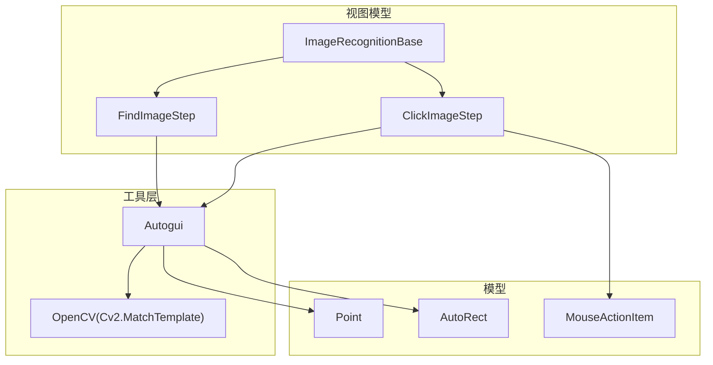
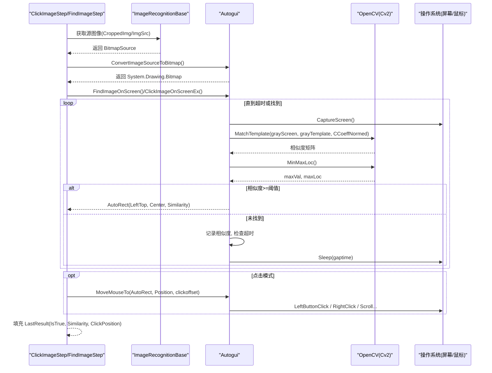
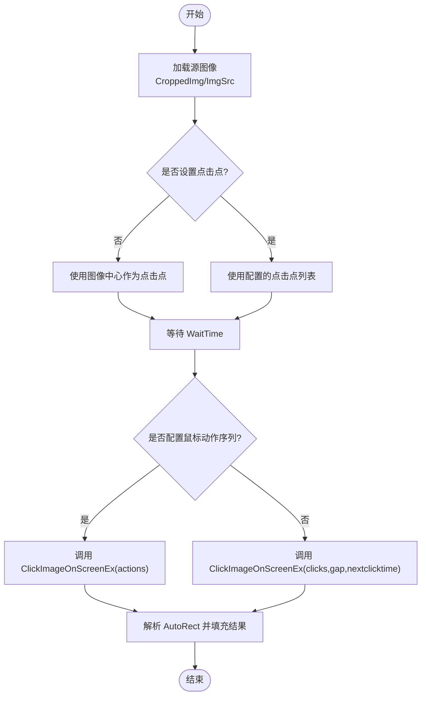
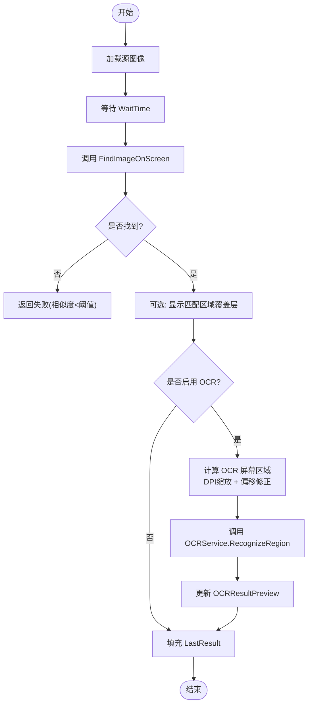
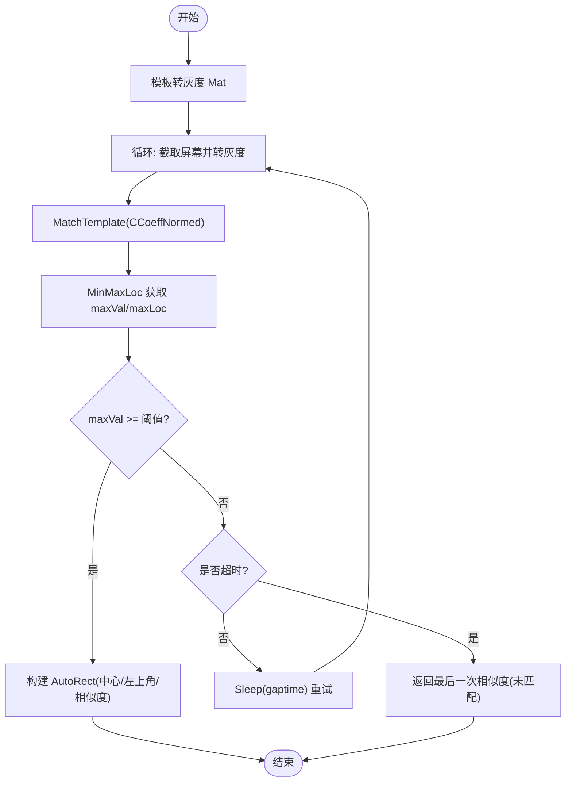
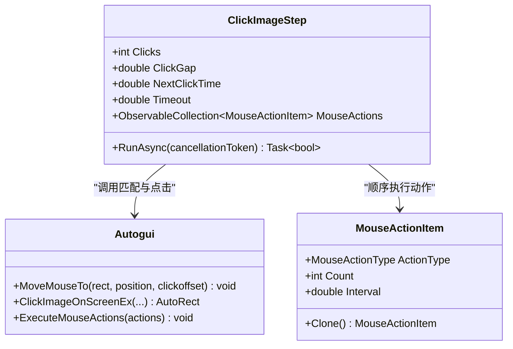
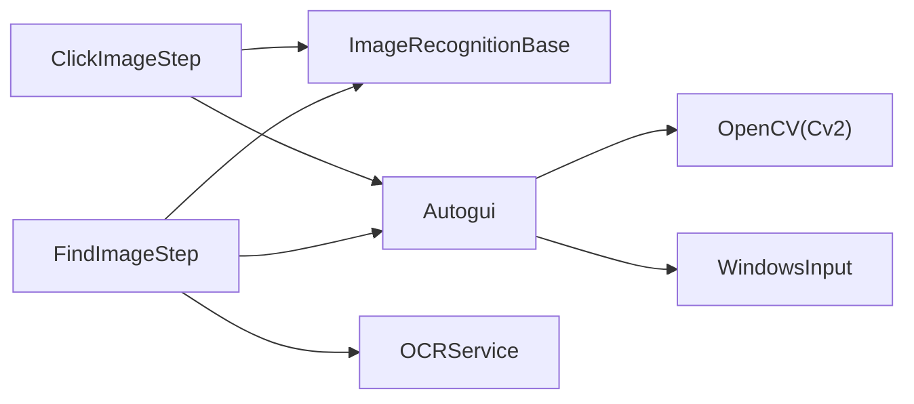

# 模板匹配算法

<cite>
**本文引用的文件**   
- [ImageRecognition.cs](file://ShaoLu/Viewmodels/ImageRecognition.cs)
- [Autogui.cs](file://ShaoLu/Utils/Autogui.cs)
- [AutoguiModel.cs](file://ShaoLu/Models/AutoguiModel.cs)
- [MouseActionItem.cs](file://ShaoLu/Models/MouseActionItem.cs)
- [EditImageViewModel.cs](file://ShaoLu/Viewmodels/EditImageViewModel.cs)
</cite>

## 目录
1. [简介](#简介)
2. [项目结构](#项目结构)
3. [核心组件](#核心组件)
4. [架构总览](#架构总览)
5. [详细组件分析](#详细组件分析)
6. [依赖关系分析](#依赖关系分析)
7. [性能考量与优化](#性能考量与优化)
8. [故障排查指南](#故障排查指南)
9. [结论](#结论)
10. [附录：使用示例与阈值调优](#附录使用示例与阈值调优)

## 简介
本技术文档围绕 ShaoLu 的图像模板匹配能力展开，重点解释基于 OpenCV 的模板匹配实现、相似度阈值计算、以及 ClickImageStep 与 FindImageStep 的执行流程。文档涵盖图像加载与转换、多点击点支持、鼠标动作序列执行、超时控制逻辑，并提供相似度阈值调优指南与常见问题解决方案。读者无需深入底层即可理解并正确使用模板匹配功能进行自动化操作。

## 项目结构
与模板匹配相关的代码主要分布在以下模块：
- Viewmodels（步骤模型）：定义 ClickImageStep、FindImageStep 及基类 ImageRecognitionBase
- Utils（工具层）：封装 Autogui，包含屏幕截图、OpenCV 模板匹配、鼠标模拟等
- Models（数据模型）：Point、AutoRect、MouseActionItem 等
- EditImageViewModel：用于编辑裁剪图、设置点击点和 OCR 区域

图表来源 
- [ImageRecognition.cs:21-144](file://ShaoLu/Viewmodels/ImageRecognition.cs#L21-L144)
- [Autogui.cs:59-122](file://ShaoLu/Utils/Autogui.cs#L59-L122)
- [AutoguiModel.cs:89-144](file://ShaoLu/Models/AutoguiModel.cs#L89-L144)
- [MouseActionItem.cs:1-57](file://ShaoLu/Models/MouseActionItem.cs#L1-L57)

章节来源
- [ImageRecognition.cs:21-144](file://ShaoLu/Viewmodels/ImageRecognition.cs#L21-L144)
- [Autogui.cs:59-122](file://ShaoLu/Utils/Autogui.cs#L59-L122)

## 核心组件
- ImageRecognitionBase：提供图像路径、裁剪图、相似度阈值、点击点集合等公共能力；负责图片加载、保存与错误处理。
- ClickImageStep：在屏幕上查找模板图像并点击，支持多次点击、点击间隔、下一次点击等待时间、超时控制，以及鼠标动作序列。
- FindImageStep：在屏幕上查找模板图像，返回匹配位置与相似度；可选 OCR 识别指定区域文本。
- Autogui：封装 OpenCV 模板匹配、屏幕截图、坐标移动与点击、鼠标动作序列执行、WPF 到 GDI+ 图像转换。
- Point/AutoRect：坐标与矩形结果的数据载体，包含中心点、四角点、相似度等。
- MouseActionItem：描述一次鼠标动作的类型、次数与间隔。

章节来源
- [ImageRecognition.cs:21-144](file://ShaoLu/Viewmodels/ImageRecognition.cs#L21-L144)
- [ImageRecognition.cs:329-436](file://ShaoLu/Viewmodels/ImageRecognition.cs#L329-L436)
- [ImageRecognition.cs:439-600](file://ShaoLu/Viewmodels/ImageRecognition.cs#L439-L600)
- [Autogui.cs:59-122](file://ShaoLu/Utils/Autogui.cs#L59-L122)
- [Autogui.cs:256-378](file://ShaoLu/Utils/Autogui.cs#L256-L378)
- [AutoguiModel.cs:89-144](file://ShaoLu/Models/AutoguiModel.cs#L89-L144)
- [MouseActionItem.cs:1-57](file://ShaoLu/Models/MouseActionItem.cs#L1-L57)

## 架构总览
整体调用链从步骤模型进入 Autogui 工具层，再调用 OpenCV 完成模板匹配，最后将结果回写至步骤执行结果。

图表来源 
- [ImageRecognition.cs:399-436](file://ShaoLu/Viewmodels/ImageRecognition.cs#L399-L436)
- [ImageRecognition.cs:535-600](file://ShaoLu/Viewmodels/ImageRecognition.cs#L535-L600)
- [Autogui.cs:59-122](file://ShaoLu/Utils/Autogui.cs#L59-L122)
- [Autogui.cs:256-378](file://ShaoLu/Utils/Autogui.cs#L256-L378)

## 详细组件分析

### ClickImageStep 执行流程
- 图像准备：优先使用 CroppedImg，否则回退到 ImgSrc；若为空则抛出异常。
- 点击点选择：若未设置 ClickPoints，默认使用图像中心点。
- 异步执行：在后台线程中等待 WaitTime，然后调用 Autogui.ClickImageOnScreenEx。
- 分支逻辑：
  - 如果配置了 MouseActions，则按顺序执行动作序列；
  - 否则按 Clicks 和 ClickGap 重复点击，NextClickTime 控制每次点击后的等待。
- 结果处理：根据返回的 AutoRect 是否为空设置 IsTrue，并填充 LastResult（相似度、点击位置）。

图表来源 
- [ImageRecognition.cs:399-436](file://ShaoLu/Viewmodels/ImageRecognition.cs#L399-L436)
- [Autogui.cs:256-378](file://ShaoLu/Utils/Autogui.cs#L256-L378)

章节来源
- [ImageRecognition.cs:399-436](file://ShaoLu/Viewmodels/ImageRecognition.cs#L399-L436)
- [Autogui.cs:256-378](file://ShaoLu/Utils/Autogui.cs#L256-L378)

### FindImageStep 执行流程
- 图像准备：同 ClickImageStep。
- 异步执行：等待 WaitTime 后调用 Autogui.FindImageOnScreen。
- 结果处理：
  - 若启用“运行中标记已找到区域”，则在 UI 上显示匹配区域覆盖层；
  - 若启用 OCR，则根据 OCRRect 计算屏幕区域，调用 OCRService 识别文本，并展示预览；
  - 填充 LastResult（IsTrue、Similarity、ClickPosition、OCRText）。

图表来源 
- [ImageRecognition.cs:535-600](file://ShaoLu/Viewmodels/ImageRecognition.cs#L535-L600)

章节来源
- [ImageRecognition.cs:535-600](file://ShaoLu/Viewmodels/ImageRecognition.cs#L535-L600)

### 模板匹配算法实现细节（OpenCV）
- 输入：模板图像（灰度）、屏幕截图（灰度）。
- 方法：Cv2.MatchTemplate(grayScreen, grayTemplate, result, TemplateMatchModes.CCoeffNormed)。
- 评分：Cv2.MinMaxLoc(result, out minVal, out maxVal, out minLoc, out maxLoc)，取 maxVal 作为相似度。
- 判定：maxVal >= threshold 即认为匹配成功；否则继续循环直至超时。
- 输出：AutoRect.Center（模板中心）、AutoRect.LeftTop（模板左上角）、AutoRect.Similarity（相似度）。

图表来源 
- [Autogui.cs:59-122](file://ShaoLu/Utils/Autogui.cs#L59-L122)

章节来源
- [Autogui.cs:59-122](file://ShaoLu/Utils/Autogui.cs#L59-L122)

### 多点击点支持与鼠标动作序列
- 多点击点：ClickImageStep 支持多个 ClickPoints，每个点依次移动鼠标并执行点击或动作序列。
- 鼠标动作序列：MouseActionItem 支持左键单击、右键单击、双击、滚轮上下，可配置次数与间隔；ClickImageStep 在找到图像后顺序执行该序列。
- 锚点与偏移：Autogui.MoveMouseTo 支持多种锚点（中心、左上、右上、左下、右下），并可叠加像素偏移量。

图表来源 
- [ImageRecognition.cs:329-436](file://ShaoLu/Viewmodels/ImageRecognition.cs#L329-L436)
- [MouseActionItem.cs:1-57](file://ShaoLu/Models/MouseActionItem.cs#L1-L57)
- [Autogui.cs:256-378](file://ShaoLu/Utils/Autogui.cs#L256-L378)

章节来源
- [ImageRecognition.cs:329-436](file://ShaoLu/Viewmodels/ImageRecognition.cs#L329-L436)
- [MouseActionItem.cs:1-57](file://ShaoLu/Models/MouseActionItem.cs#L1-L57)
- [Autogui.cs:256-378](file://ShaoLu/Utils/Autogui.cs#L256-L378)

### 图像加载与转换
- 图像加载：ImageRecognitionBase.LoadImage 支持从路径加载 WPF BitmapSource，冻结以提高性能与跨线程访问。
- 图像保存：SaveCroppedImageToDisk 将裁剪图保存到工作目录 images/{Uid}.png/jpg/bmp/gif，自动创建目录。
- 格式转换：Autogui.ConvertImageSourceToBitmap 将 WPF BitmapSource 转换为 GDI+ Bitmap，供 OpenCV 使用。

章节来源
- [ImageRecognition.cs:199-293](file://ShaoLu/Viewmodels/ImageRecognition.cs#L199-L293)
- [Autogui.cs:383-422](file://ShaoLu/Utils/Autogui.cs#L383-L422)

### 结果数据结构
- Point：统一坐标类型，支持 OpenCvSharp.Point、System.Drawing.Point、System.Windows.Point 隐式转换。
- AutoRect：封装匹配结果，包含 Center、LeftTop、RightTop、LeftDown、RightDown、Similarity、IsEmpty。

章节来源
- [AutoguiModel.cs:3-86](file://ShaoLu/Models/AutoguiModel.cs#L3-L86)
- [AutoguiModel.cs:89-144](file://ShaoLu/Models/AutoguiModel.cs#L89-L144)

## 依赖关系分析
- ClickImageStep/FindImageStep 依赖 ImageRecognitionBase 提供的图像加载与保存能力。
- 两者均依赖 Autogui 完成模板匹配、截图、鼠标模拟。
- Autogui 依赖 OpenCV（Cv2.MatchTemplate、MinMaxLoc）与 WindowsInput（鼠标模拟）。
- FindImageStep 可选依赖 OCRService 进行文字识别。

图表来源 
- [ImageRecognition.cs:21-144](file://ShaoLu/Viewmodels/ImageRecognition.cs#L21-L144)
- [Autogui.cs:59-122](file://ShaoLu/Utils/Autogui.cs#L59-L122)

章节来源
- [ImageRecognition.cs:21-144](file://ShaoLu/Viewmodels/ImageRecognition.cs#L21-L144)
- [Autogui.cs:59-122](file://ShaoLu/Utils/Autogui.cs#L59-L122)

## 性能考量与优化
- 灰度转换与内存管理：模板与屏幕截图均转换为灰度 Mat，减少通道数提升匹配速度；使用 using 释放资源避免内存泄漏。
- 循环策略：FindImageOnScreen 每次循环重新截图，确保动态屏幕内容被捕获；合理设置 gaptime 与 timeout 平衡响应与 CPU 占用。
- DPI 缩放：FindImageStep 在显示覆盖层与 OCR 区域时，依据 OCRService.CachedDpiX/Y 进行逻辑像素换算，保证标注准确。
- 图像编码：保存裁剪图时使用合适的编码器（PNG/JPG/BMP/GIF），冻结 BitmapSource 提高跨线程访问性能。
- 建议优化：
  - 对大分辨率屏幕截图，考虑先缩小再匹配，或使用 ROI 限制搜索区域；
  - 调整阈值与间隔时间，避免频繁截图导致卡顿；
  - 批量匹配时复用模板 Mat，避免重复转换。

[本节为通用指导，不直接分析具体文件]

## 故障排查指南
- 无图像可用：
  - 现象：抛出“无图像”异常；
  - 排查：确认 CroppedImg/ImgSrc 是否正确加载，路径是否存在；
  - 参考：[ImageRecognition.cs:399-404](file://ShaoLu/Viewmodels/ImageRecognition.cs#L399-L404)、[ImageRecognition.cs:537-539](file://ShaoLu/Viewmodels/ImageRecognition.cs#L537-L539)
- 图像转换失败：
  - 现象：ConvertImageSourceToBitmap 返回 null；
  - 排查：检查 WPF 图像格式与编码器支持；
  - 参考：[Autogui.cs:383-422](file://ShaoLu/Utils/Autogui.cs#L383-L422)
- 未匹配到图像：
  - 现象：抛出“未匹配到图像”异常或返回空结果；
  - 排查：降低阈值、增加超时、检查模板质量与对比度；
  - 参考：[Autogui.cs:116-122](file://ShaoLu/Utils/Autogui.cs#L116-L122)、[Autogui.cs:279-282](file://ShaoLu/Utils/Autogui.cs#L279-L282)
- OCR 结果为空：
  - 现象：OCRResultPreview 显示“未识别到文本”；
  - 排查：确认 OCRRect 设置正确、DPI 换算无误；
  - 参考：[ImageRecognition.cs:564-587](file://ShaoLu/Viewmodels/ImageRecognition.cs#L564-L587)

章节来源
- [ImageRecognition.cs:399-404](file://ShaoLu/Viewmodels/ImageRecognition.cs#L399-L404)
- [ImageRecognition.cs:537-539](file://ShaoLu/Viewmodels/ImageRecognition.cs#L537-L539)
- [Autogui.cs:383-422](file://ShaoLu/Utils/Autogui.cs#L383-L422)
- [Autogui.cs:116-122](file://ShaoLu/Utils/Autogui.cs#L116-L122)
- [Autogui.cs:279-282](file://ShaoLu/Utils/Autogui.cs#L279-L282)
- [ImageRecognition.cs:564-587](file://ShaoLu/Viewmodels/ImageRecognition.cs#L564-L587)

## 结论
ShaoLu 的模板匹配通过 OpenCV 的归一化相关系数法实现，结合 WPF 图像系统与 GDI+ 转换，形成稳定的图像识别与自动化点击流程。ClickImageStep 与 FindImageStep 提供了丰富的参数配置与扩展能力（多点击点、鼠标动作序列、OCR 识别），并通过合理的超时与间隔控制保障稳定性与性能。在实际使用中，应结合场景调整相似度阈值与采样频率，以获得最佳效果。

[本节为总结性内容，不直接分析具体文件]

## 附录：使用示例与阈值调优

### 使用示例（步骤级）
- 添加 ClickImageStep：
  - 选择模板图像，设置相似度阈值（如 0.85）；
  - 配置点击点（默认中心点），设置点击次数与间隔；
  - 如需复杂交互，添加 MouseActionItem 序列（左键/右键/双击/滚动）；
  - 设置超时与等待时间，运行后查看 LastResult 中的相似度与点击位置。
- 添加 FindImageStep：
  - 选择模板图像，设置阈值与间隔时间；
  - 可选启用 OCR，设置 OCRRect 区域，运行后查看 OCRResultPreview；
  - 开启“运行中标记已找到区域”以可视化匹配结果。

章节来源
- [ImageRecognition.cs:329-436](file://ShaoLu/Viewmodels/ImageRecognition.cs#L329-L436)
- [ImageRecognition.cs:439-600](file://ShaoLu/Viewmodels/ImageRecognition.cs#L439-L600)
- [MouseActionItem.cs:1-57](file://ShaoLu/Models/MouseActionItem.cs#L1-L57)

### 相似度阈值调优指南
- 初始值建议：0.85（CCoeffNormed 通常在此范围取得较好平衡）；
- 提高阈值（如 0.90-0.95）：适用于高对比度、稳定界面元素，降低误匹配；
- 降低阈值（如 0.75-0.80）：适用于低对比度、模糊或动态背景，提高召回率；
- 观察 LastResult.Similarity：若接近阈值边界，微调阈值以减少抖动；
- 配合 GapTime 与 Timeout：在复杂场景中适当增大间隔与超时，提升稳定性。

[本节为通用指导，不直接分析具体文件]

### 常见问题与解决方案
- 匹配不稳定：
  - 原因：阈值过低或过高、截图时机不当；
  - 解决：调整阈值、增加 WaitTime、减少屏幕刷新干扰；
  - 参考：[Autogui.cs:59-122](file://ShaoLu/Utils/Autogui.cs#L59-L122)
- 点击位置偏差：
  - 原因：锚点选择不当或未设置偏移；
  - 解决：使用 Position 枚举选择合适的锚点，必要时设置 clickoffset；
  - 参考：[Autogui.cs:204-254](file://ShaoLu/Utils/Autogui.cs#L204-L254)
- OCR 区域不准：
  - 原因：DPI 换算错误或 OCRRect 偏移不正确；
  - 解决：核对 OCRService.CachedDpiX/Y 与 CroppedRect 偏移；
  - 参考：[ImageRecognition.cs:568-574](file://ShaoLu/Viewmodels/ImageRecognition.cs#L568-L574)

章节来源
- [Autogui.cs:59-122](file://ShaoLu/Utils/Autogui.cs#L59-L122)
- [Autogui.cs:204-254](file://ShaoLu/Utils/Autogui.cs#L204-L254)
- [ImageRecognition.cs:568-574](file://ShaoLu/Viewmodels/ImageRecognition.cs#L568-L574)