# 工具类和实用程序

<cite>
**本文引用的文件**   
- [NativeMethods.cs](file://ShaoLu/Utils/NativeMethods.cs)
- [ScreenTextReader.cs](file://ShaoLu/Utils/ScreenTextReader.cs)
- [StepsFile.cs](file://ShaoLu/Utils/StepsFile.cs)
- [TextHelper.cs](file://ShaoLu/Utils/TextHelper.cs)
- [SingletonLocator.cs](file://ShaoLu/Utils/SingletonLocator.cs)
- [RichTextHelper.cs](file://ShaoLu/Utils/RichTextHelper.cs)
- [Autogui.cs](file://ShaoLu/Utils/Autogui.cs)
- [RelayCommand.cs](file://ShaoLu/Utils/RelayCommand.cs)
- [DataGridSelectedItemsBehavior.cs](file://ShaoLu/Utils/DataGridSelectedItemsBehavior.cs)
- [ListBoxSelectedUidsBehavior.cs](file://ShaoLu/Utils/ListBoxSelectedUidsBehavior.cs)
- [AutomationStepJsonConverter.cs](file://ShaoLu/Converters/AutomationStepJsonConverter.cs)
</cite>

## 目录
1. [简介](#简介)
2. [项目结构](#项目结构)
3. [核心组件](#核心组件)
4. [架构总览](#架构总览)
5. [详细组件分析](#详细组件分析)
6. [依赖关系分析](#依赖关系分析)
7. [性能考虑](#性能考虑)
8. [故障排查指南](#故障排查指南)
9. [结论](#结论)
10. [附录：使用示例与最佳实践](#附录使用示例与最佳实践)

## 简介
本技术参考文档聚焦于 ShaoLu 的工具类与实用程序，覆盖以下关键能力：
- Windows API 封装（热键注册/注销）
- 屏幕文本读取（UI Automation）
- 步骤文件管理（JSON/.autostep 压缩包）
- 字符串处理工具（压缩、截断、判断）
- 单例定位器（通过 DI 容器获取全局实例）
- 富文本序列化/反序列化（FlowDocument/XAML）
- 自动化控制（图像识别、鼠标键盘操作、剪贴板输入）
- WPF 命令与行为（ICommand、附加属性行为）

文档从系统架构到代码级实现进行分层说明，并提供性能优化建议、线程安全注意事项和错误处理最佳实践。

## 项目结构
工具类与实用程序主要位于 ShaoLu/Utils 与 ShaoLu/Converters 下，按职责划分清晰：
- Utils：通用工具、系统交互、UI 辅助、自动化控制
- Converters：数据序列化/反序列化的自定义转换器

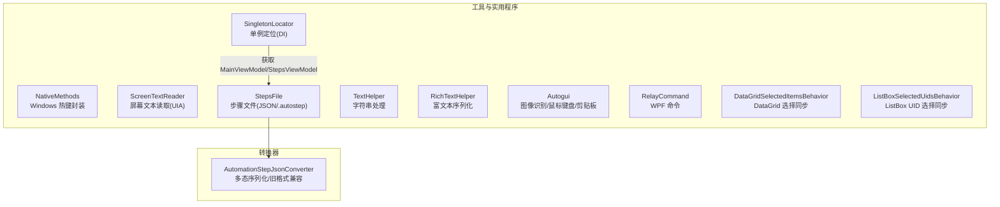

**图表来源** 
- [NativeMethods.cs:1-19](file://ShaoLu/Utils/NativeMethods.cs#L1-L19)
- [ScreenTextReader.cs:1-79](file://ShaoLu/Utils/ScreenTextReader.cs#L1-L79)
- [StepsFile.cs:1-244](file://ShaoLu/Utils/StepsFile.cs#L1-L244)
- [TextHelper.cs:1-43](file://ShaoLu/Utils/TextHelper.cs#L1-L43)
- [SingletonLocator.cs:1-19](file://ShaoLu/Utils/SingletonLocator.cs#L1-L19)
- [RichTextHelper.cs:1-127](file://ShaoLu/Utils/RichTextHelper.cs#L1-L127)
- [Autogui.cs:1-656](file://ShaoLu/Utils/Autogui.cs#L1-L656)
- [RelayCommand.cs:1-113](file://ShaoLu/Utils/RelayCommand.cs#L1-L113)
- [DataGridSelectedItemsBehavior.cs:1-63](file://ShaoLu/Utils/DataGridSelectedItemsBehavior.cs#L1-L63)
- [ListBoxSelectedUidsBehavior.cs:1-66](file://ShaoLu/Utils/ListBoxSelectedUidsBehavior.cs#L1-L66)
- [AutomationStepJsonConverter.cs:1-185](file://ShaoLu/Converters/AutomationStepJsonConverter.cs#L1-L185)

**章节来源**
- [NativeMethods.cs:1-19](file://ShaoLu/Utils/NativeMethods.cs#L1-L19)
- [ScreenTextReader.cs:1-79](file://ShaoLu/Utils/ScreenTextReader.cs#L1-L79)
- [StepsFile.cs:1-244](file://ShaoLu/Utils/StepsFile.cs#L1-L244)
- [TextHelper.cs:1-43](file://ShaoLu/Utils/TextHelper.cs#L1-L43)
- [SingletonLocator.cs:1-19](file://ShaoLu/Utils/SingletonLocator.cs#L1-L19)
- [RichTextHelper.cs:1-127](file://ShaoLu/Utils/RichTextHelper.cs#L1-L127)
- [Autogui.cs:1-656](file://ShaoLu/Utils/Autogui.cs#L1-L656)
- [RelayCommand.cs:1-113](file://ShaoLu/Utils/RelayCommand.cs#L1-L113)
- [DataGridSelectedItemsBehavior.cs:1-63](file://ShaoLu/Utils/DataGridSelectedItemsBehavior.cs#L1-L63)
- [ListBoxSelectedUidsBehavior.cs:1-66](file://ShaoLu/Utils/ListBoxSelectedUidsBehavior.cs#L1-L66)
- [AutomationStepJsonConverter.cs:1-185](file://ShaoLu/Converters/AutomationStepJsonConverter.cs#L1-L185)

## 核心组件
- NativeMethods：封装 user32.dll 的热键 API，提供常量与 P/Invoke 方法。
- ScreenTextReader：基于 UI Automation 在指定物理坐标处读取控件文本，优先 TextPattern，其次 ValuePattern，最后向上遍历父元素 Name/Value。
- StepsFile：步骤文件的保存/加载，支持 JSON 与 .autostep 压缩包；包含图片收集、工作目录管理、旧格式行号到 Uid 的解析。
- TextHelper：字符串压缩为单行、截断显示、判断是否会被截断。
- SingletonLocator：通过 CommunityToolkit.Mvvm 的 DI 容器获取 MainViewModel、StepsViewModel、FileServices、IUserService 等单例。
- RichTextHelper：FlowDocument 与 XAML 字符串互转，兼容纯文本存储。
- Autogui：图像模板匹配、屏幕截图、鼠标移动/点击、键盘输入、剪贴板粘贴、字符串递增算法。
- RelayCommand：WPF ICommand 实现，含泛型版本与线程安全的参数命令。
- DataGridSelectedItemsBehavior / ListBoxSelectedUidsBehavior：附加属性行为，双向同步 UI 选择与集合。

**章节来源**
- [NativeMethods.cs:1-19](file://ShaoLu/Utils/NativeMethods.cs#L1-L19)
- [ScreenTextReader.cs:1-79](file://ShaoLu/Utils/ScreenTextReader.cs#L1-L79)
- [StepsFile.cs:1-244](file://ShaoLu/Utils/StepsFile.cs#L1-L244)
- [TextHelper.cs:1-43](file://ShaoLu/Utils/TextHelper.cs#L1-L43)
- [SingletonLocator.cs:1-19](file://ShaoLu/Utils/SingletonLocator.cs#L1-L19)
- [RichTextHelper.cs:1-127](file://ShaoLu/Utils/RichTextHelper.cs#L1-L127)
- [Autogui.cs:1-656](file://ShaoLu/Utils/Autogui.cs#L1-L656)
- [RelayCommand.cs:1-113](file://ShaoLu/Utils/RelayCommand.cs#L1-L113)
- [DataGridSelectedItemsBehavior.cs:1-63](file://ShaoLu/Utils/DataGridSelectedItemsBehavior.cs#L1-L63)
- [ListBoxSelectedUidsBehavior.cs:1-66](file://ShaoLu/Utils/ListBoxSelectedUidsBehavior.cs#L1-L66)

## 架构总览
工具层围绕“系统交互”“数据处理”“UI 辅助”三大方向组织，并通过 DI 容器统一访问应用服务与视图模型。

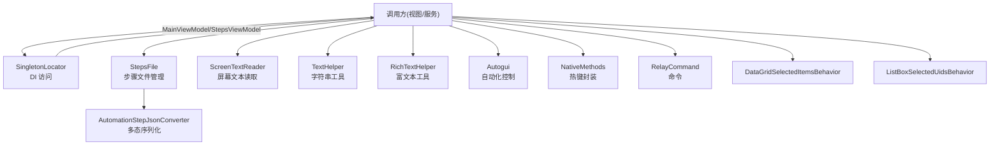

**图表来源** 
- [SingletonLocator.cs:1-19](file://ShaoLu/Utils/SingletonLocator.cs#L1-L19)
- [StepsFile.cs:1-244](file://ShaoLu/Utils/StepsFile.cs#L1-L244)
- [ScreenTextReader.cs:1-79](file://ShaoLu/Utils/ScreenTextReader.cs#L1-L79)
- [TextHelper.cs:1-43](file://ShaoLu/Utils/TextHelper.cs#L1-L43)
- [RichTextHelper.cs:1-127](file://ShaoLu/Utils/RichTextHelper.cs#L1-L127)
- [Autogui.cs:1-656](file://ShaoLu/Utils/Autogui.cs#L1-L656)
- [NativeMethods.cs:1-19](file://ShaoLu/Utils/NativeMethods.cs#L1-L19)
- [RelayCommand.cs:1-113](file://ShaoLu/Utils/RelayCommand.cs#L1-L113)
- [DataGridSelectedItemsBehavior.cs:1-63](file://ShaoLu/Utils/DataGridSelectedItemsBehavior.cs#L1-L63)
- [ListBoxSelectedUidsBehavior.cs:1-66](file://ShaoLu/Utils/ListBoxSelectedUidsBehavior.cs#L1-L66)
- [AutomationStepJsonConverter.cs:1-185](file://ShaoLu/Converters/AutomationStepJsonConverter.cs#L1-L185)

## 详细组件分析

### NativeMethods：Windows 热键封装
- 功能：封装 RegisterHotKey/UnregisterHotKey 与 WM_HOTKEY 消息常量，以及修饰键常量。
- 设计要点：静态类 + P/Invoke，避免重复声明；常量集中管理。
- 使用场景：全局快捷键注册/注销，配合窗口消息循环处理热键事件。
- 线程安全：P/Invoke 本身非线程安全，应在 UI 线程或合适的上下文调用。
- 错误处理：返回值 bool 表示成功与否，调用方需检查并处理失败情况。

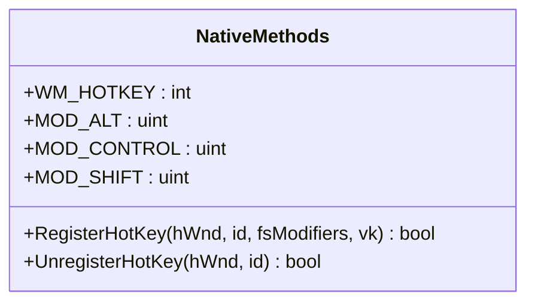

**图表来源** 
- [NativeMethods.cs:1-19](file://ShaoLu/Utils/NativeMethods.cs#L1-L19)

**章节来源**
- [NativeMethods.cs:1-19](file://ShaoLu/Utils/NativeMethods.cs#L1-L19)

### ScreenTextReader：屏幕文本读取
- 功能：根据物理坐标读取 UI 元素的可选文本。
- 策略优先级：TextPattern → ValuePattern → 父元素 Name/Value。
- 异常处理：捕获异常返回空字符串，保证调用方稳定。
- 适用场景：OCR 前过滤、界面元素文本抓取、自动化验证。

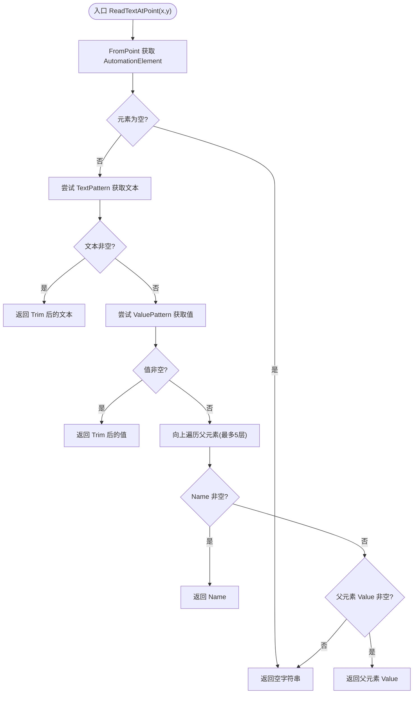

**图表来源** 
- [ScreenTextReader.cs:1-79](file://ShaoLu/Utils/ScreenTextReader.cs#L1-L79)

**章节来源**
- [ScreenTextReader.cs:1-79](file://ShaoLu/Utils/ScreenTextReader.cs#L1-L79)

### StepsFile：步骤文件管理
- 功能：保存/加载步骤列表，支持 JSON 与 .autostep 压缩包；自动收集裁剪图片；设置工作目录；旧格式兼容。
- 关键点：
  - 写选项：缩进、宽松编码、忽略 null、自定义转换器。
  - 读选项：大小写不敏感、跳过注释、允许尾逗号、自定义转换器。
  - 压缩包：steps.json + images/ 目录；路径规范化为正斜杠。
  - 旧格式：TrueGoto/FalseGoto 由 int 行号转换为 Guid Uid。
- 错误处理：参数校验、文件不存在、压缩包缺失 steps.json、内容为空等抛出明确异常。
- 线程安全：序列化/反序列化使用线程局部缓存字典（见转换器），避免并发冲突。

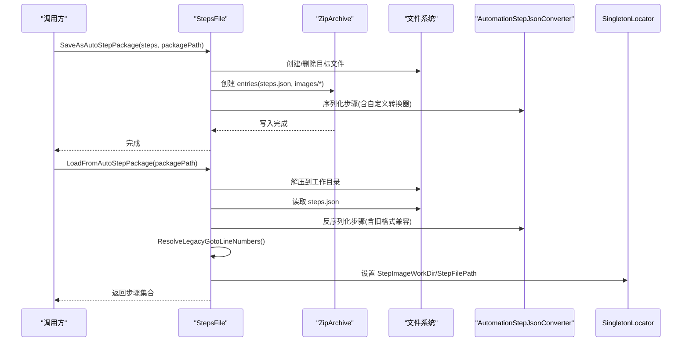

**图表来源** 
- [StepsFile.cs:1-244](file://ShaoLu/Utils/StepsFile.cs#L1-L244)
- [AutomationStepJsonConverter.cs:1-185](file://ShaoLu/Converters/AutomationStepJsonConverter.cs#L1-L185)
- [SingletonLocator.cs:1-19](file://ShaoLu/Utils/SingletonLocator.cs#L1-L19)

**章节来源**
- [StepsFile.cs:1-244](file://ShaoLu/Utils/StepsFile.cs#L1-L244)
- [AutomationStepJsonConverter.cs:1-185](file://ShaoLu/Converters/AutomationStepJsonConverter.cs#L1-L185)

### TextHelper：字符串处理工具
- 功能：压缩为单行（替换换行/制表符为空格，合并连续空格）、截断显示、判断是否会被截断。
- 复杂度：正则替换 O(n)，截断 O(1)。
- 使用场景：表格概览展示、预览入口提示。

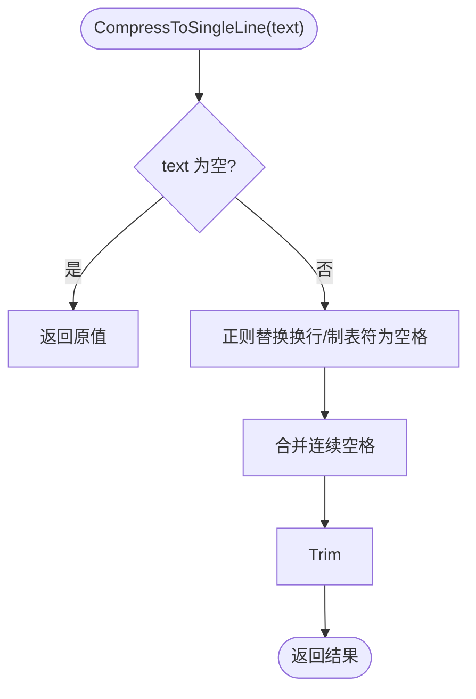

**图表来源** 
- [TextHelper.cs:1-43](file://ShaoLu/Utils/TextHelper.cs#L1-L43)

**章节来源**
- [TextHelper.cs:1-43](file://ShaoLu/Utils/TextHelper.cs#L1-L43)

### SingletonLocator：单例定位器
- 功能：通过 CommunityToolkit.Mvvm 的 Ioc.Default 获取 MainViewModel、StepsViewModel、FileServices、IUserService 等。
- 特点：静态只读访问，简化跨层调用；Settings 通过异步加载后阻塞获取结果（注意潜在死锁风险）。
- 线程安全：DI 容器负责生命周期与线程安全；Settings 初始化应避免在 UI 线程阻塞。

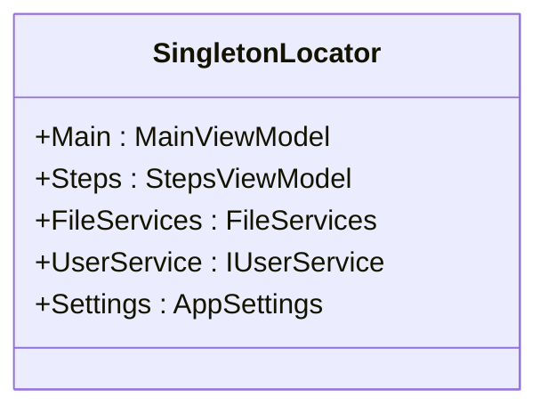

**图表来源** 
- [SingletonLocator.cs:1-19](file://ShaoLu/Utils/SingletonLocator.cs#L1-L19)

**章节来源**
- [SingletonLocator.cs:1-19](file://ShaoLu/Utils/SingletonLocator.cs#L1-L19)

### RichTextHelper：富文本序列化/反序列化
- 功能：FlowDocument ↔ XAML 字符串互转；纯文本兼容；检测是否为富文本。
- 关键点：纯文本仅包含一个段落且无格式时直接存为纯文本；解析失败回退为纯文本。
- 使用场景：持久化富文本内容，减少体积与提升兼容性。

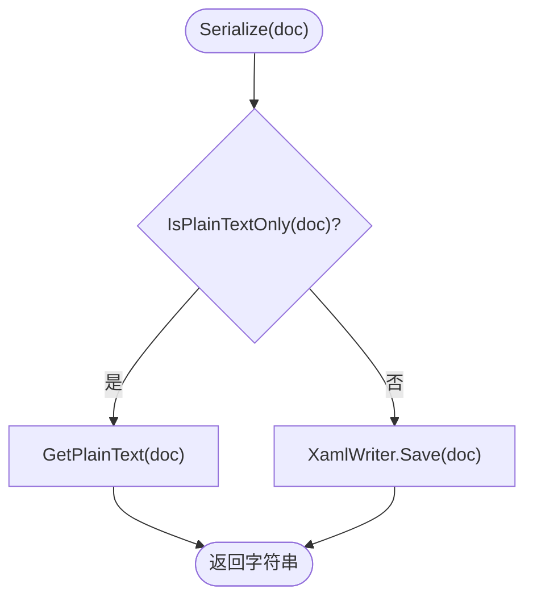

**图表来源** 
- [RichTextHelper.cs:1-127](file://ShaoLu/Utils/RichTextHelper.cs#L1-L127)

**章节来源**
- [RichTextHelper.cs:1-127](file://ShaoLu/Utils/RichTextHelper.cs#L1-L127)

### Autogui：自动化控制
- 功能：图像模板匹配、屏幕截图、鼠标移动/点击、键盘输入、剪贴板粘贴、字符串递增算法。
- 关键点：
  - 模板匹配使用 OpenCvSharp，CCoeffNormed 归一化相关系数匹配。
  - 超时与间隔控制，Stopwatch 精确计时。
  - 剪贴板输入确保 STA 线程执行，恢复原始剪贴板内容。
  - 字符串递增支持数字与字母后缀，固定位数回绕。
- 错误处理：未找到图像抛出自定义异常；剪贴板操作异常记录日志并返回失败。

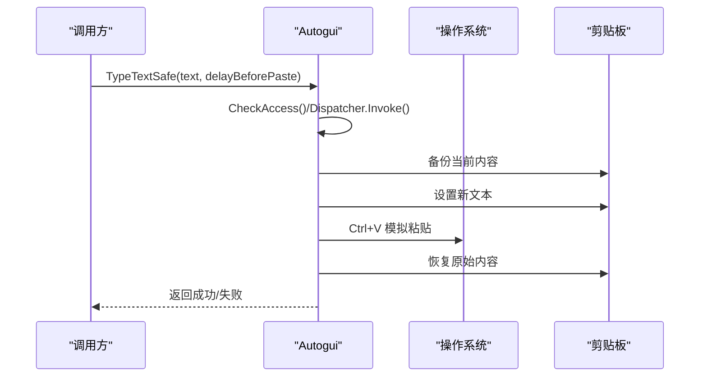

**图表来源** 
- [Autogui.cs:1-656](file://ShaoLu/Utils/Autogui.cs#L1-L656)

**章节来源**
- [Autogui.cs:1-656](file://ShaoLu/Utils/Autogui.cs#L1-L656)

### RelayCommand：WPF 命令
- 功能：实现 ICommand，支持无参/有参/泛型版本；线程安全的 RaiseCanExecuteChanged。
- 关键点：在 UI 线程触发 CanExecuteChanged，避免跨线程问题。
- 使用场景：按钮、菜单项等绑定命令。

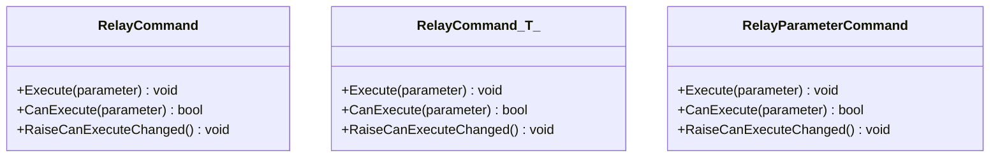

**图表来源** 
- [RelayCommand.cs:1-113](file://ShaoLu/Utils/RelayCommand.cs#L1-L113)

**章节来源**
- [RelayCommand.cs:1-113](file://ShaoLu/Utils/RelayCommand.cs#L1-L113)

### DataGridSelectedItemsBehavior / ListBoxSelectedUidsBehavior：选择同步行为
- 功能：附加属性将 UI 选择与集合双向同步。
- 关键点：事件订阅/取消订阅，初始同步，增量更新。
- 使用场景：多选操作、批量删除、批量编辑。

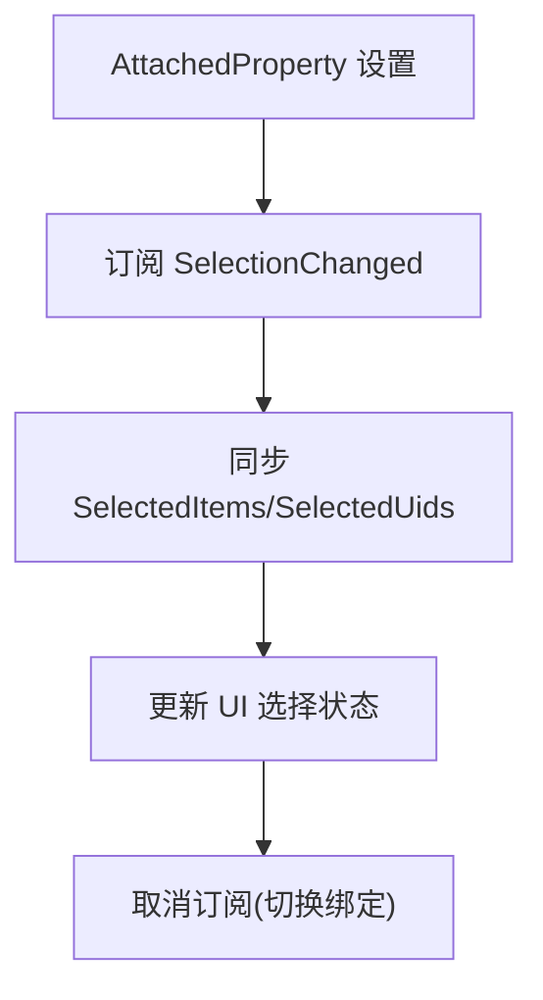

**图表来源** 
- [DataGridSelectedItemsBehavior.cs:1-63](file://ShaoLu/Utils/DataGridSelectedItemsBehavior.cs#L1-L63)
- [ListBoxSelectedUidsBehavior.cs:1-66](file://ShaoLu/Utils/ListBoxSelectedUidsBehavior.cs#L1-L66)

**章节来源**
- [DataGridSelectedItemsBehavior.cs:1-63](file://ShaoLu/Utils/DataGridSelectedItemsBehavior.cs#L1-L63)
- [ListBoxSelectedUidsBehavior.cs:1-66](file://ShaoLu/Utils/ListBoxSelectedUidsBehavior.cs#L1-L66)

## 依赖关系分析
- StepsFile 依赖 AutomationStepJsonConverter 进行多态序列化与旧格式兼容。
- SingletonLocator 依赖 CommunityToolkit.Mvvm 的 DI 容器获取服务与视图模型。
- Autogui 依赖 OpenCvSharp、WindowsInput、System.Drawing、WPF 剪贴板。
- ScreenTextReader 依赖 System.Windows.Automation。
- RichTextHelper 依赖 WPF FlowDocument/XAML 序列化。

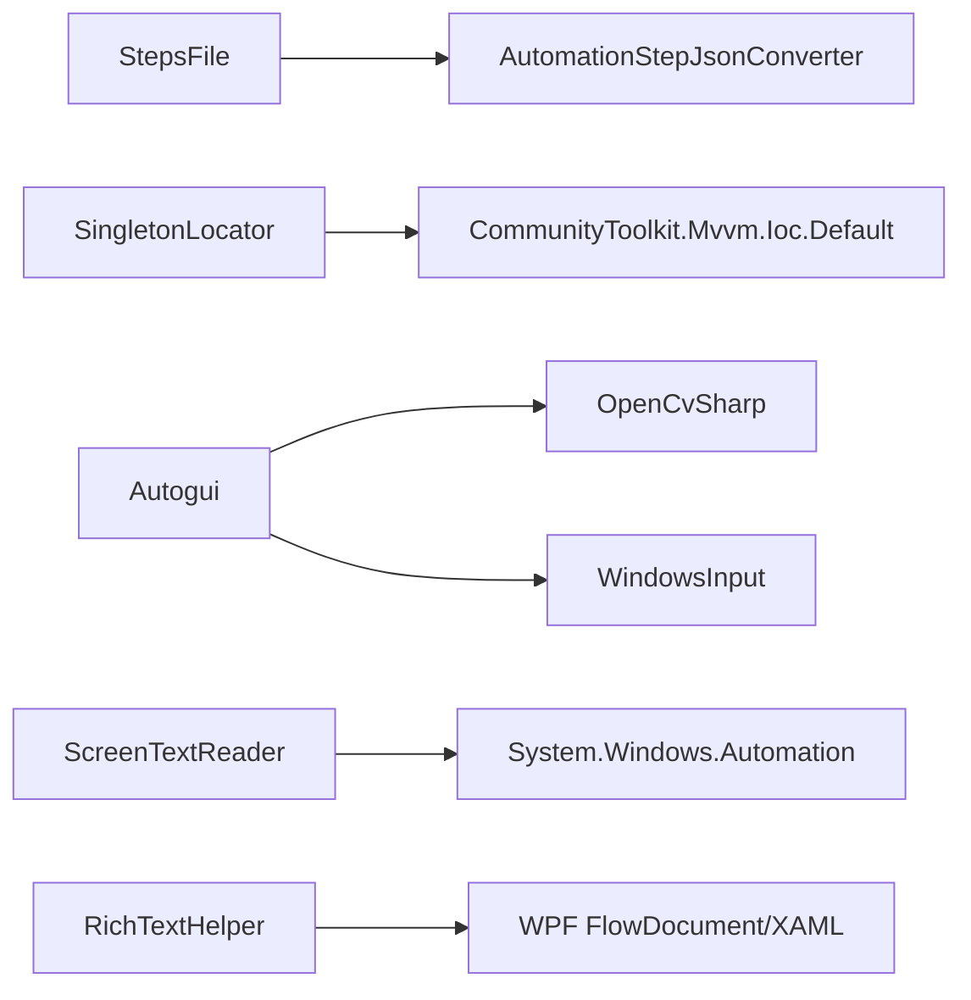

**图表来源** 
- [StepsFile.cs:1-244](file://ShaoLu/Utils/StepsFile.cs#L1-L244)
- [AutomationStepJsonConverter.cs:1-185](file://ShaoLu/Converters/AutomationStepJsonConverter.cs#L1-L185)
- [SingletonLocator.cs:1-19](file://ShaoLu/Utils/SingletonLocator.cs#L1-L19)
- [Autogui.cs:1-656](file://ShaoLu/Utils/Autogui.cs#L1-L656)
- [ScreenTextReader.cs:1-79](file://ShaoLu/Utils/ScreenTextReader.cs#L1-L79)
- [RichTextHelper.cs:1-127](file://ShaoLu/Utils/RichTextHelper.cs#L1-L127)

**章节来源**
- [StepsFile.cs:1-244](file://ShaoLu/Utils/StepsFile.cs#L1-L244)
- [AutomationStepJsonConverter.cs:1-185](file://ShaoLu/Converters/AutomationStepJsonConverter.cs#L1-L185)
- [SingletonLocator.cs:1-19](file://ShaoLu/Utils/SingletonLocator.cs#L1-L19)
- [Autogui.cs:1-656](file://ShaoLu/Utils/Autogui.cs#L1-L656)
- [ScreenTextReader.cs:1-79](file://ShaoLu/Utils/ScreenTextReader.cs#L1-L79)
- [RichTextHelper.cs:1-127](file://ShaoLu/Utils/RichTextHelper.cs#L1-L127)

## 性能考虑
- StepsFile：
  - 复用 JsonSerializerOptions 避免重复构建开销。
  - 使用 Optimal 压缩级别平衡速度与体积。
  - 一次性转换模板图像灰度，避免循环内重复转换。
- Autogui：
  - 使用 Stopwatch 精确计时，合理设置超时与间隔。
  - 模板匹配一次转换，减少内存分配。
  - 剪贴板操作最小化等待时间，避免阻塞 UI。
- ScreenTextReader：
  - 限制父元素遍历层数（最多5层），降低 UIA 查询成本。
  - 快速失败：元素为空或模式不可用直接返回空。
- TextHelper：
  - 正则替换与字符串操作均为线性复杂度，适合短文本展示。
- RichTextHelper：
  - 纯文本检测避免不必要的 XAML 序列化，减小存储体积。
- RelayCommand：
  - 仅在需要时触发 CanExecuteChanged，避免频繁 UI 刷新。

[本节为通用指导，无需特定文件引用]

## 故障排查指南
- 热键注册失败：
  - 检查 hWnd 有效性、修饰键组合是否冲突、返回值 bool。
  - 参考：[NativeMethods.cs:1-19](file://ShaoLu/Utils/NativeMethods.cs#L1-L19)
- 屏幕文本读取为空：
  - 确认坐标是否在有效区域；检查 UIA 是否可用；查看异常捕获逻辑。
  - 参考：[ScreenTextReader.cs:1-79](file://ShaoLu/Utils/ScreenTextReader.cs#L1-L79)
- 步骤文件加载失败：
  - 检查文件路径、是否存在、steps.json 是否完整；查看旧格式兼容解析。
  - 参考：[StepsFile.cs:1-244](file://ShaoLu/Utils/StepsFile.cs#L1-L244)、[AutomationStepJsonConverter.cs:1-185](file://ShaoLu/Converters/AutomationStepJsonConverter.cs#L1-L185)
- 富文本解析失败：
  - 检查 XAML 格式合法性；解析失败会回退为纯文本。
  - 参考：[RichTextHelper.cs:1-127](file://ShaoLu/Utils/RichTextHelper.cs#L1-L127)
- 自动化输入失败：
  - 确认 STA 线程环境；检查剪贴板权限；查看日志记录。
  - 参考：[Autogui.cs:1-656](file://ShaoLu/Utils/Autogui.cs#L1-L656)

**章节来源**
- [NativeMethods.cs:1-19](file://ShaoLu/Utils/NativeMethods.cs#L1-L19)
- [ScreenTextReader.cs:1-79](file://ShaoLu/Utils/ScreenTextReader.cs#L1-L79)
- [StepsFile.cs:1-244](file://ShaoLu/Utils/StepsFile.cs#L1-L244)
- [AutomationStepJsonConverter.cs:1-185](file://ShaoLu/Converters/AutomationStepJsonConverter.cs#L1-L185)
- [RichTextHelper.cs:1-127](file://ShaoLu/Utils/RichTextHelper.cs#L1-L127)
- [Autogui.cs:1-656](file://ShaoLu/Utils/Autogui.cs#L1-L656)

## 结论
ShaoLu 的工具类与实用程序提供了完整的系统交互、数据处理与 UI 辅助能力。通过清晰的职责划分与良好的错误处理机制，确保了稳定性与可维护性。结合性能优化与线程安全考虑，可在复杂自动化场景中高效运行。

[本节为总结，无需特定文件引用]

## 附录：使用示例与最佳实践
- 热键注册/注销：
  - 在窗口初始化时注册热键，关闭时注销；始终检查返回值。
  - 参考：[NativeMethods.cs:1-19](file://ShaoLu/Utils/NativeMethods.cs#L1-L19)
- 屏幕文本读取：
  - 先尝试 TextPattern，再 ValuePattern，最后父元素 Name/Value；捕获异常返回空。
  - 参考：[ScreenTextReader.cs:1-79](file://ShaoLu/Utils/ScreenTextReader.cs#L1-L79)
- 步骤文件管理：
  - 推荐使用 SaveAsAutoStepPackage/LoadFromAutoStepPackage；确保压缩包包含 steps.json 与 images。
  - 参考：[StepsFile.cs:1-244](file://ShaoLu/Utils/StepsFile.cs#L1-L244)
- 字符串处理：
  - 使用 CompressToSingleLine 与 Truncate 进行表格展示；IsTruncated 决定是否提供预览。
  - 参考：[TextHelper.cs:1-43](file://ShaoLu/Utils/TextHelper.cs#L1-L43)
- 单例定位：
  - 通过 SingletonLocator 获取 MainViewModel/StepsViewModel；避免直接 new 实例。
  - 参考：[SingletonLocator.cs:1-19](file://ShaoLu/Utils/SingletonLocator.cs#L1-L19)
- 富文本处理：
  - 优先判断纯文本，减少 XAML 序列化开销；解析失败回退为纯文本。
  - 参考：[RichTextHelper.cs:1-127](file://ShaoLu/Utils/RichTextHelper.cs#L1-L127)
- 自动化控制：
  - 设置合理阈值与超时；剪贴板输入确保 STA 线程；异常记录日志。
  - 参考：[Autogui.cs:1-656](file://ShaoLu/Utils/Autogui.cs#L1-L656)
- 命令绑定：
  - 使用 RelayCommand/RelayParameterCommand 绑定 UI 操作；必要时触发 RaiseCanExecuteChanged。
  - 参考：[RelayCommand.cs:1-113](file://ShaoLu/Utils/RelayCommand.cs#L1-L113)
- 选择同步行为：
  - 使用附加属性绑定 SelectedItems/SelectedUids，实现双向同步。
  - 参考：[DataGridSelectedItemsBehavior.cs:1-63](file://ShaoLu/Utils/DataGridSelectedItemsBehavior.cs#L1-L63)、[ListBoxSelectedUidsBehavior.cs:1-66](file://ShaoLu/Utils/ListBoxSelectedUidsBehavior.cs#L1-L66)

**章节来源**
- [NativeMethods.cs:1-19](file://ShaoLu/Utils/NativeMethods.cs#L1-L19)
- [ScreenTextReader.cs:1-79](file://ShaoLu/Utils/ScreenTextReader.cs#L1-L79)
- [StepsFile.cs:1-244](file://ShaoLu/Utils/StepsFile.cs#L1-L244)
- [TextHelper.cs:1-43](file://ShaoLu/Utils/TextHelper.cs#L1-L43)
- [SingletonLocator.cs:1-19](file://ShaoLu/Utils/SingletonLocator.cs#L1-L19)
- [RichTextHelper.cs:1-127](file://ShaoLu/Utils/RichTextHelper.cs#L1-L127)
- [Autogui.cs:1-656](file://ShaoLu/Utils/Autogui.cs#L1-L656)
- [RelayCommand.cs:1-113](file://ShaoLu/Utils/RelayCommand.cs#L1-L113)
- [DataGridSelectedItemsBehavior.cs:1-63](file://ShaoLu/Utils/DataGridSelectedItemsBehavior.cs#L1-L63)
- [ListBoxSelectedUidsBehavior.cs:1-66](file://ShaoLu/Utils/ListBoxSelectedUidsBehavior.cs#L1-L66)