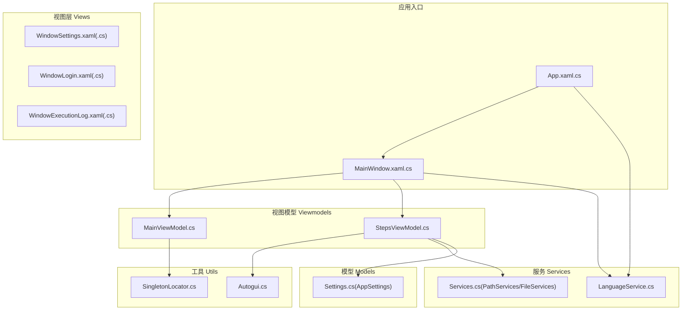
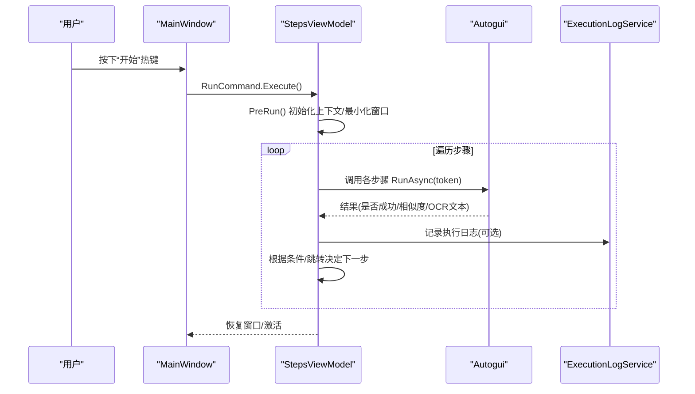
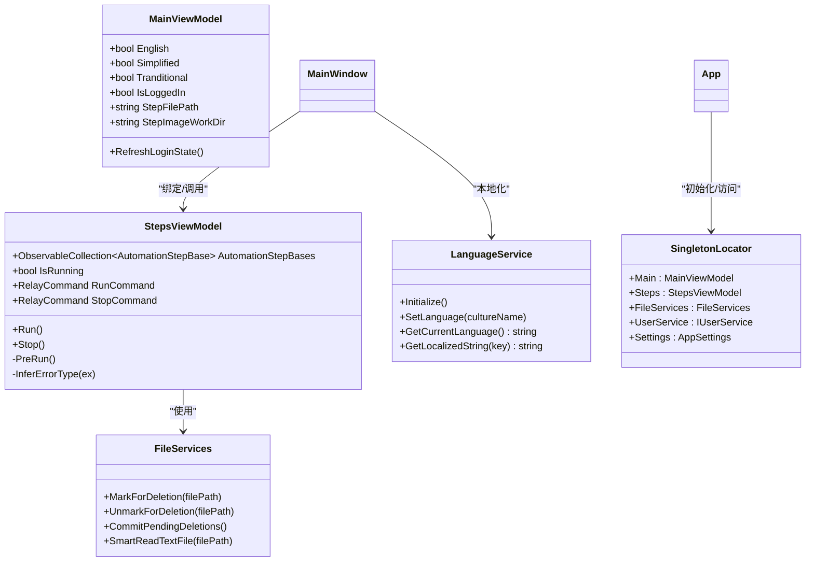
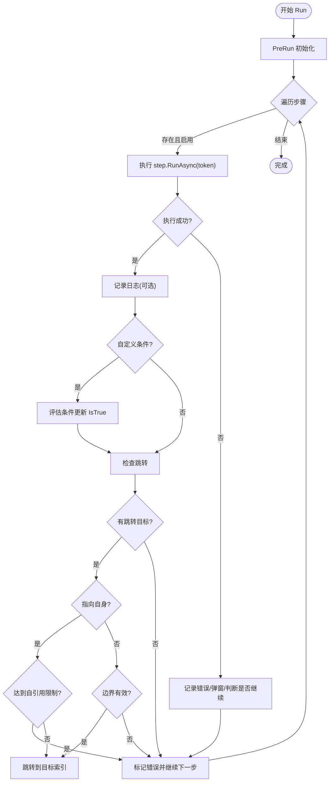
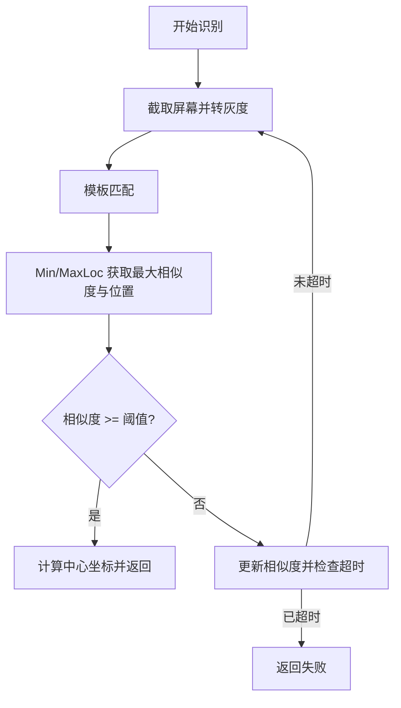
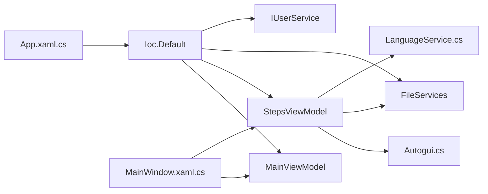

# 代码规范

<cite>
**本文引用的文件**   
- [Readme.md](file://Readme.md)
- [.gitignore](file://.gitignore)
- [.gitattributes](file://.gitattributes)
- [App.xaml.cs](file://ShaoLu/App.xaml.cs)
- [MainWindow.xaml.cs](file://ShaoLu/MainWindow.xaml.cs)
- [MainViewModel.cs](file://ShaoLu/Viewmodels/MainViewModel.cs)
- [StepsViewModel.cs](file://ShaoLu/Viewmodels/StepsViewModel.cs)
- [Services.cs](file://ShaoLu/Services/Services.cs)
- [SingletonLocator.cs](file://ShaoLu/Utils/SingletonLocator.cs)
- [Settings.cs](file://ShaoLu/Models/Settings.cs)
- [LanguageService.cs](file://ShaoLu/Services/LanguageService.cs)
- [Autogui.cs](file://ShaoLu/Utils/Autogui.cs)
</cite>

## 目录
1. [简介](#简介)
2. [项目结构](#项目结构)
3. [核心组件](#核心组件)
4. [架构总览](#架构总览)
5. [详细组件分析](#详细组件分析)
6. [依赖关系分析](#依赖关系分析)
7. [性能考量](#性能考量)
8. [故障排查指南](#故障排查指南)
9. [结论](#结论)
10. [附录](#附录)

## 简介
本规范面向 ShaoLu（基于 WPF 的桌面自动化工具）团队，统一 C# 编码风格、MVVM 组织方式、数据绑定与依赖注入实践、目录与命名约定、Git 工作流与提交规范，以及代码质量检查工具配置建议。目标是提升一致性、可维护性与协作效率，降低沟通成本与回归风险。

## 项目结构
- 分层清晰：UI（Views）、视图模型（Viewmodels）、业务服务（Services）、领域模型（Models）、通用工具（Utils）、资源与主题（Resources/Themes/Templates）。
- 图片编辑子模块位于 Tools/ImageEdit，包含独立控件、转换器、辅助类与状态机。
- 测试工程 NUnitTest 覆盖关键逻辑与服务。
- 根级 .gitignore/.gitattributes 统一忽略规则与行尾处理。

图表来源
- [App.xaml.cs:18-65](file://ShaoLu/App.xaml.cs#L18-L65)
- [MainWindow.xaml.cs:1-120](file://ShaoLu/MainWindow.xaml.cs#L1-L120)
- [MainViewModel.cs:1-76](file://ShaoLu/Viewmodels/MainViewModel.cs#L1-L76)
- [StepsViewModel.cs:1-120](file://ShaoLu/Viewmodels/StepsViewModel.cs#L1-L120)
- [Services.cs:1-82](file://ShaoLu/Services/Services.cs#L1-L82)
- [Settings.cs:1-76](file://ShaoLu/Models/Settings.cs#L1-L76)
- [LanguageService.cs:1-67](file://ShaoLu/Services/LanguageService.cs#L1-L67)
- [Autogui.cs:77-106](file://ShaoLu/Utils/Autogui.cs#L77-L106)

章节来源
- [Readme.md:1-20](file://Readme.md#L1-L20)
- [.gitignore:1-120](file://.gitignore#L1-L120)
- [.gitattributes:1-64](file://.gitattributes#L1-L64)

## 核心组件
- 应用启动与生命周期
  - 在应用启动时初始化语言、注册依赖注入容器、清理过期日志并显示主窗口；退出时释放图像识别相关资源并提交待删除文件。
- 主窗口与热键
  - 注册全局热键（开始/停止），拦截输入校验，管理登录态与多语言切换，打开设置、执行日志、用户管理等窗口。
- 视图模型
  - MainViewModel：负责应用级属性（路径、登录态、当前语言选择等）与 UI 状态同步。
  - StepsViewModel：步骤集合管理、命令封装、运行循环、错误推断、上下文与条件评估、自引用限制保护。
- 服务
  - LanguageService：本地化初始化与字符串获取。
  - PathServices/FileServices：文件对话框、相对路径计算、文本智能编码读取、延迟删除队列。
- 单例定位器
  - SingletonLocator：通过 Ioc.Default 暴露常用单例（MainViewModel、StepsViewModel、FileServices、UserService、Settings）。
- 配置模型
  - Settings.cs：AppSettings、StepSettingsModel、HotKeySetting 等集中定义默认值与开关。

章节来源
- [App.xaml.cs:18-86](file://ShaoLu/App.xaml.cs#L18-L86)
- [MainWindow.xaml.cs:1-120](file://ShaoLu/MainWindow.xaml.cs#L1-L120)
- [MainViewModel.cs:1-76](file://ShaoLu/Viewmodels/MainViewModel.cs#L1-L76)
- [StepsViewModel.cs:120-220](file://ShaoLu/Viewmodels/StepsViewModel.cs#L120-L220)
- [Services.cs:1-179](file://ShaoLu/Services/Services.cs#L1-L179)
- [SingletonLocator.cs:1-19](file://ShaoLu/Utils/SingletonLocator.cs#L1-L19)
- [Settings.cs:1-76](file://ShaoLu/Models/Settings.cs#L1-L76)
- [LanguageService.cs:1-67](file://ShaoLu/Services/LanguageService.cs#L1-L67)

## 架构总览
- MVVM 分层：View 仅负责展示与交互，ViewModel 承载状态与命令，Service 提供跨层能力（文件、OCR、语言、配置等）。
- 依赖注入：使用 CommunityToolkit.Mvvm.DependencyInjection 的 Ioc.Default 进行一次性注册与按需解析。
- 事件驱动：WPF 路由事件 + RelayCommand 驱动 UI 行为；异步任务使用 CancellationToken 支持取消。
- 自动化引擎：Autogui 封装屏幕截图与模板匹配，返回相似度与坐标供步骤执行。

图表来源
- [MainWindow.xaml.cs:55-74](file://ShaoLu/MainWindow.xaml.cs#L55-L74)
- [StepsViewModel.cs:360-588](file://ShaoLu/Viewmodels/StepsViewModel.cs#L360-L588)
- [Autogui.cs:77-106](file://ShaoLu/Utils/Autogui.cs#L77-L106)

## 详细组件分析

### C# 编码规范（命名、格式、注释、错误处理）
- 命名约定
  - 类/接口/枚举：PascalCase（如 StepsViewModel、AppSettings）。
  - 方法/属性/字段：PascalCase（公共）、camelCase（私有字段）。
  - 常量：UPPER_SNAKE_CASE（如 HOTKEY_START_ID）。
  - 文件名与类型名一致，避免缩写歧义。
- 代码格式
  - 使用 Visual Studio 默认格式化；保持缩进与空行一致；避免过长行。
- 注释标准
  - 公共 API 使用 XML 文档注释；复杂逻辑添加行内说明；错误分支给出原因。
- 错误处理模式
  - 区分可预期异常与意外异常；对可预期异常记录 Warn/Info，对意外异常记录 Error/Fatal。
  - 用户可见的错误需友好提示，并提供继续/中止选项。
  - 长时间任务使用 try/catch + CancellationToken 支持取消。

章节来源
- [MainWindow.xaml.cs:103-134](file://ShaoLu/MainWindow.xaml.cs#L103-L134)
- [StepsViewModel.cs:480-588](file://ShaoLu/Viewmodels/StepsViewModel.cs#L480-L588)
- [Services.cs:118-179](file://ShaoLu/Services/Services.cs#L118-L179)

### MVVM 架构与数据绑定
- ViewModel 设计
  - 继承 ObservableObject，使用 SetProperty 触发变更通知。
  - 命令封装为 RelayCommand/RelayParameterCommand，并通过 CanExecute 控制可用性。
  - 集合使用 ObservableCollection 以支持 UI 实时刷新。
- 数据绑定规范
  - 将 UI 状态映射到 ViewModel 属性；避免在 View 中写业务逻辑。
  - 使用 Converter 做简单转换（如布尔转可见性、枚举转字符串）。
- 依赖注入使用
  - 在 App.OnStartup 中集中注册服务与 ViewModel；通过 Ioc.Default 解析。
  - 使用 SingletonLocator 作为便捷访问点，避免硬耦合。

图表来源
- [MainViewModel.cs:1-76](file://ShaoLu/Viewmodels/MainViewModel.cs#L1-L76)
- [StepsViewModel.cs:1-120](file://ShaoLu/Viewmodels/StepsViewModel.cs#L1-L120)
- [Services.cs:83-179](file://ShaoLu/Services/Services.cs#L83-L179)
- [LanguageService.cs:1-67](file://ShaoLu/Services/LanguageService.cs#L1-L67)
- [SingletonLocator.cs:1-19](file://ShaoLu/Utils/SingletonLocator.cs#L1-L19)

章节来源
- [MainViewModel.cs:1-76](file://ShaoLu/Viewmodels/MainViewModel.cs#L1-L76)
- [StepsViewModel.cs:1-120](file://ShaoLu/Viewmodels/StepsViewModel.cs#L1-L120)
- [App.xaml.cs:32-47](file://ShaoLu/App.xaml.cs#L32-L47)

### 自动化执行流程（StepsViewModel.Run）
- 运行前准备：重置信号、初始化引擎、清空上下文、按配置最小化窗口、重置每步状态。
- 执行循环：逐条执行步骤，计时、记录结果、写入上下文、条件评估、日志输出。
- 错误处理：捕获异常并推断错误类型，弹出错误提示（可选），根据 FalseGoto 决定是否继续或终止。
- 跳转与自引用保护：支持 TrueGoto/FalseGoto 跳转；检测自引用次数超过阈值则报错并继续。

图表来源
- [StepsViewModel.cs:360-588](file://ShaoLu/Viewmodels/StepsViewModel.cs#L360-L588)

章节来源
- [StepsViewModel.cs:360-588](file://ShaoLu/Viewmodels/StepsViewModel.cs#L360-L588)

### 图像识别（Autogui）
- 流程：截取屏幕 → 灰度化 → 模板匹配 → 取最大相似度与位置 → 判断是否达到阈值 → 返回中心坐标与相似度。
- 超时与轮询：未命中时更新相似度并检查是否超时，循环直至命中或超时。

图表来源
- [Autogui.cs:77-106](file://ShaoLu/Utils/Autogui.cs#L77-L106)

章节来源
- [Autogui.cs:77-106](file://ShaoLu/Utils/Autogui.cs#L77-L106)

### 文件与路径服务（PathServices/FileServices）
- 文件对话框：统一的打开/保存对话框封装，支持过滤器与初始路径。
- 相对路径：基于绝对路径与基准路径计算相对路径。
- 文本智能读取：优先 BOM 检测，其次启发式编码检测，失败抛出异常。
- 延迟删除：标记待删除文件，程序退出时批量提交删除，失败记录警告。

章节来源
- [Services.cs:11-82](file://ShaoLu/Services/Services.cs#L11-L82)
- [Services.cs:83-179](file://ShaoLu/Services/Services.cs#L83-L179)

### 本地化（LanguageService）
- 初始化：优先读取上次保存的语言，否则使用系统 UI 语言。
- 设置语言：设置 LocalizeDictionary 文化并持久化到文件。
- 获取字符串：找不到 key 时回退到 key 本身或默认值。

章节来源
- [LanguageService.cs:1-67](file://ShaoLu/Services/LanguageService.cs#L1-L67)

### 配置模型（Settings）
- AppSettings：主题、窗口尺寸、字体、日志保留天数等。
- StepSettingsModel：运行确认、默认相似度/等待/超时/点击次数、快捷键等。
- HotKeySetting：修饰键与主键组合。

章节来源
- [Settings.cs:1-76](file://ShaoLu/Models/Settings.cs#L1-L76)

## 依赖关系分析
- 应用入口 App 负责 DI 容器构建与生命周期管理。
- MainWindow 通过 SingletonLocator 获取 ViewModel 与服务，触发命令与窗口操作。
- StepsViewModel 依赖 Autogui、FileServices、LanguageService、ExecutionLogService（外部服务）。
- 所有 ViewModel 与 Service 通过 Ioc.Default 解耦，便于替换与测试。

图表来源
- [App.xaml.cs:32-47](file://ShaoLu/App.xaml.cs#L32-L47)
- [MainWindow.xaml.cs:1-120](file://ShaoLu/MainWindow.xaml.cs#L1-L120)
- [StepsViewModel.cs:1-120](file://ShaoLu/Viewmodels/StepsViewModel.cs#L1-L120)

章节来源
- [App.xaml.cs:32-47](file://ShaoLu/App.xaml.cs#L32-L47)
- [SingletonLocator.cs:1-19](file://ShaoLu/Utils/SingletonLocator.cs#L1-L19)

## 性能考量
- 图像识别
  - 裁剪区域越小越精确，减少匹配开销；合理设置相似度阈值与超时时间。
  - 避免频繁全屏截图，必要时缓存中间结果。
- 执行循环
  - 使用 CancellationToken 及时响应停止信号，避免无效计算。
  - 批量操作（如复制/粘贴步骤）尽量合并集合变更，减少 UI 重绘。
- 文件 IO
  - SmartReadTextFile 仅在必要时读取大文件；延迟删除批量提交，减少频繁磁盘操作。
- 日志
  - 仅对必要步骤开启详细日志；合理配置日志保留策略。

[本节为通用指导，不直接分析具体文件]

## 故障排查指南
- 常见问题
  - 步骤执行失败：查看步骤错误类型与消息；检查图片路径、相似度阈值与超时设置。
  - 无法停止：确认热键注册与取消逻辑；检查 StopSignal 与 CancellationToken 状态。
  - 语言切换无效：确认 current_language.txt 是否存在与可读；检查 LocalizeDictionary 文化设置。
  - 文件读取乱码：检查文件编码与 BOM；必要时调整 SmartReadTextFile 的置信度阈值。
- 调试建议
  - 启用 NLog 日志，关注 Info/Warn/Error/Fatal 级别输出。
  - 使用 WindowAsyncPopup 弹出关键信息，便于用户反馈。
  - 在 StepsViewModel 中打印执行时间与相似度，定位慢步骤。

章节来源
- [StepsViewModel.cs:480-588](file://ShaoLu/Viewmodels/StepsViewModel.cs#L480-L588)
- [LanguageService.cs:27-40](file://ShaoLu/Services/LanguageService.cs#L27-L40)
- [Services.cs:142-179](file://ShaoLu/Services/Services.cs#L142-L179)

## 结论
本规范明确了 ShaoLu 项目的编码风格、MVVM 组织、依赖注入与数据绑定实践、目录与命名约定、Git 工作流与质量检查建议。遵循这些约定可显著提升代码一致性与团队协作效率，降低维护成本与回归风险。建议在 CI 中集成 StyleCop/SonarQube，并在 PR 流程中强制执行规范检查。

[本节为总结性内容，不直接分析具体文件]

## 附录

### Git 工作流与提交规范
- 分支策略
  - main：稳定发布分支。
  - develop：日常开发分支。
  - feature/*：功能分支。
  - hotfix/*：紧急修复分支。
- 提交信息格式
  - <type>(<scope>): <subject>
  - type：feat/fix/docs/style/refactor/test/chore
  - scope：模块或子系统（如 Viewmodels、Services）
  - subject：简洁描述变更
- 代码审查流程
  - 创建 PR → 至少一名 reviewer 审核 → 通过 CI 检查（StyleCop/SonarQube）→ 合并至目标分支。
- 忽略与属性
  - .gitignore：忽略构建产物、用户配置、第三方工具缓存等。
  - .gitattributes：统一行尾处理，避免跨平台差异。

章节来源
- [.gitignore:1-120](file://.gitignore#L1-L120)
- [.gitattributes:1-64](file://.gitattributes#L1-L64)

### 代码质量检查工具配置建议
- StyleCop
  - 安装 NuGet 包；在项目启用；配置 Ruleset 统一规则；CI 中失败即阻断。
- SonarQube
  - 接入 SonarScanner；配置分析参数；设置质量门禁（覆盖率、重复率、漏洞等）。
- 单元测试
  - 使用 NUnit；覆盖关键服务与算法（如 OCR、条件评估、文件读写）。

[本节为通用指导，不直接分析具体文件]

### 团队协作最佳实践
- 代码评审清单
  - 命名与格式是否符合规范；错误处理是否完善；是否有不必要的性能开销；是否添加了必要注释。
- 版本与发布
  - 使用语义化版本；发布前进行回归测试与性能验证。
- 文档与知识库
  - 更新 Readme 与内部 Wiki；记录常见故障与解决方案。

[本节为通用指导，不直接分析具体文件]