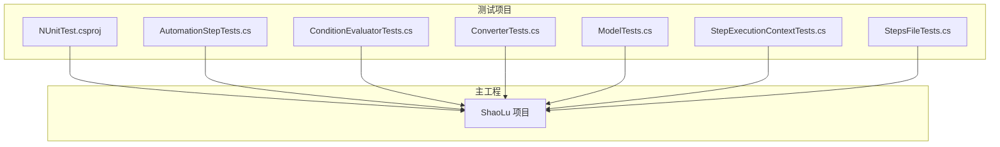
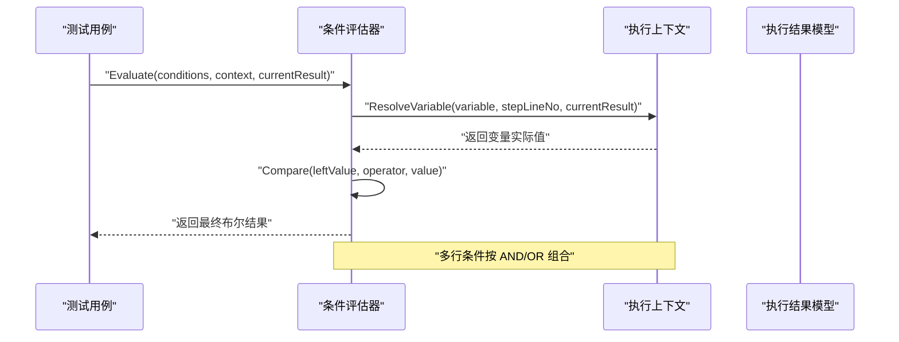
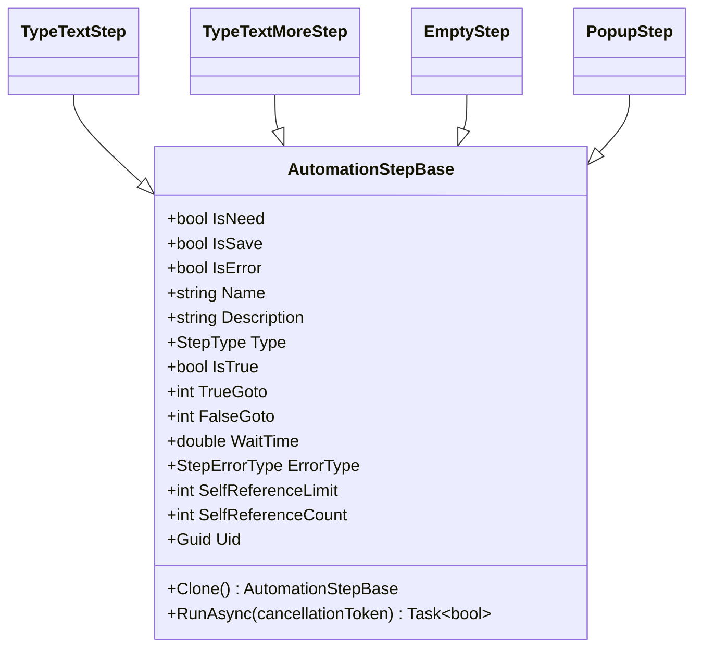
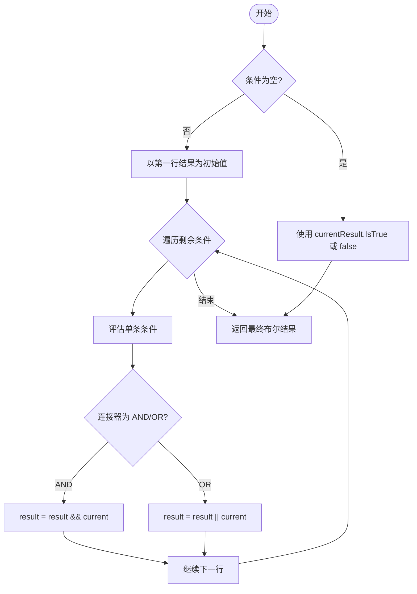
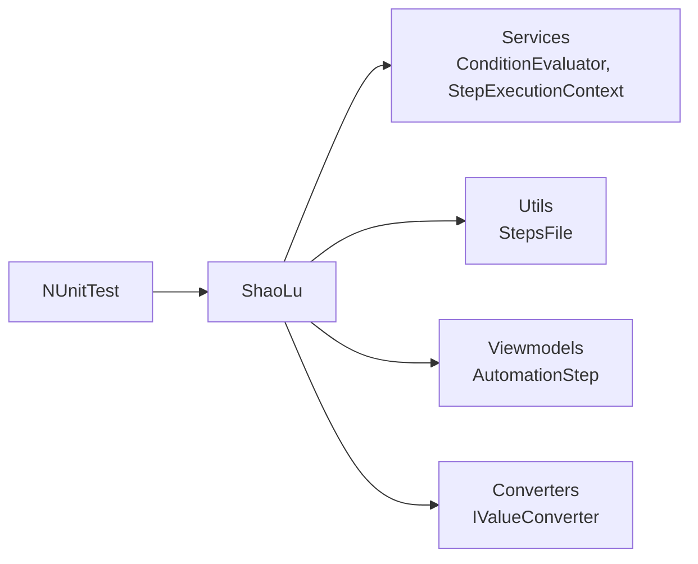

# 单元测试

<cite>
**本文引用的文件**   
- [NUnitTest.csproj](file://NUnitTest/NUnitTest.csproj)
- [AutomationStepTests.cs](file://NUnitTest/AutomationStepTests.cs)
- [ConditionEvaluatorTests.cs](file://NUnitTest/ConditionEvaluatorTests.cs)
- [ConverterTests.cs](file://NUnitTest/ConverterTests.cs)
- [ModelTests.cs](file://NUnitTest/ModelTests.cs)
- [StepExecutionContextTests.cs](file://NUnitTest/StepExecutionContextTests.cs)
- [StepsFileTests.cs](file://NUnitTest/StepsFileTests.cs)
- [ConditionEvaluator.cs](file://ShaoLu/Services/ConditionEvaluator.cs)
- [StepExecutionContext.cs](file://ShaoLu/Services/StepExecutionContext.cs)
- [StepsFile.cs](file://ShaoLu/Utils/StepsFile.cs)
- [AutomationStep.cs](file://ShaoLu/Viewmodels/AutomationStep.cs)
- [BoolToInverseBoolConverter.cs](file://ShaoLu/Converters/BoolToInverseBoolConverter.cs)
- [NullToVisibilityConverter.cs](file://ShaoLu/Converters/NullToVisibilityConverter.cs)
- [Readme.md](file://Readme.md)
</cite>

## 目录
1. [简介](#简介)
2. [项目结构](#项目结构)
3. [核心组件](#核心组件)
4. [架构总览](#架构总览)
5. [详细组件分析](#详细组件分析)
6. [依赖关系分析](#依赖关系分析)
7. [性能考虑](#性能考虑)
8. [故障排查指南](#故障排查指南)
9. [结论](#结论)
10. [附录](#附录)

## 简介
本指南面向 ShaoLu 项目的单元测试，基于 NUnit 框架，系统讲解测试项目结构与编写规范、命名约定、各类测试用例的写法与最佳实践。内容覆盖自动化步骤测试、条件评估器测试、转换器测试、模型测试、执行上下文测试和步骤文件测试；并给出 Mock 对象使用建议、异步测试方法、测试数据准备策略、覆盖率分析与持续集成配置建议，以及常见场景调试技巧。

## 项目结构
- 测试项目位于 NUnitTest 目录，采用 NUnit 4.x 与 .NET Framework 4.8 目标框架，通过项目引用依赖主工程 ShaoLu。
- 测试类按被测模块划分：自动化步骤、条件评估器、WPF 值转换器、数据模型、执行上下文、步骤文件序列化等。
- 测试项目配置文件定义了 NUnit、NUnit3TestAdapter 包引用及目标平台（x64）。

**图表来源** 
- [NUnitTest.csproj:1-72](file://NUnitTest/NUnitTest.csproj#L1-L72)

**章节来源**
- [NUnitTest.csproj:1-72](file://NUnitTest/NUnitTest.csproj#L1-L72)

## 核心组件
- 自动化步骤模型与基类：定义步骤通用属性、命令、克隆与运行接口，派生多种具体步骤类型。
- 条件评估器：根据条件规则行列表与执行上下文计算最终布尔结果，支持常量、Self/Step 引用、数值/字符串比较与逻辑组合。
- 执行上下文：维护各步骤执行结果缓存，并提供变量解析能力。
- 步骤文件工具：负责 JSON 与 .autostep 压缩包格式的序列化/反序列化，包含图片资源打包。
- WPF 值转换器：用于 UI 绑定时的类型转换与可见性控制。

**章节来源**
- [AutomationStep.cs:1-200](file://ShaoLu/Viewmodels/AutomationStep.cs#L1-L200)
- [ConditionEvaluator.cs:1-187](file://ShaoLu/Services/ConditionEvaluator.cs#L1-L187)
- [StepExecutionContext.cs:1-88](file://ShaoLu/Services/StepExecutionContext.cs#L1-L88)
- [StepsFile.cs:1-217](file://ShaoLu/Utils/StepsFile.cs#L1-L217)
- [BoolToInverseBoolConverter.cs:1-24](file://ShaoLu/Converters/BoolToInverseBoolConverter.cs#L1-L24)
- [NullToVisibilityConverter.cs:1-26](file://ShaoLu/Converters/NullToVisibilityConverter.cs#L1-L26)

## 架构总览
下图展示了测试与核心服务之间的交互关系，包括条件评估流程与执行上下文的作用。

**图表来源** 
- [ConditionEvaluator.cs:1-187](file://ShaoLu/Services/ConditionEvaluator.cs#L1-L187)
- [StepExecutionContext.cs:1-88](file://ShaoLu/Services/StepExecutionContext.cs#L1-L88)

## 详细组件分析

### 自动化步骤测试（AutomationStepTests）
- 覆盖要点：
  - 构造函数的默认类型与属性设置
  - Clone 方法的深拷贝与独立性验证
  - 唯一标识 Uid 的唯一性
  - 名称空值校验抛出异常
  - 通用基类属性与命令行为（添加/移除条件、错误类型、自引用计数、最近结果）
- 测试组织：
  - 按步骤类型分组（TypeTextStep、TypeTextMoreStep、EmptyStep、PopupStep）与基类通用属性测试
- 断言风格：
  - 使用 Is.EqualTo、Is.True/False、Does.Contain、Throws 等常用断言

**图表来源** 
- [AutomationStep.cs:1-200](file://ShaoLu/Viewmodels/AutomationStep.cs#L1-L200)

**章节来源**
- [AutomationStepTests.cs:1-372](file://NUnitTest/AutomationStepTests.cs#L1-L372)
- [AutomationStep.cs:1-200](file://ShaoLu/Viewmodels/AutomationStep.cs#L1-L200)

### 条件评估器测试（ConditionEvaluatorTests）
- 覆盖要点：
  - 空条件与默认行为（返回当前结果或 false）
  - 常量条件（ConstantTrue/ConstantFalse）
  - 布尔比较（Self_IsTrue 与 Equal/NotEqual，支持 "1"/"0"）
  - 数字比较（相似度、执行时间、等于/不等于/大于/小于/大于等于/小于等于）
  - 字符串比较（OCRText 的相等、包含、不包含、大小写不敏感）
  - 空值判断（IsEmpty/IsNotEmpty）
  - 逻辑组合（AND/OR 混合）
  - 引用其他步骤（Step_* 变量，不存在时默认值）
  - Null 值处理边界
- 数据准备：
  - 使用 SetUp 初始化 StepExecutionContext 与 StepExecutionResult 样例数据
- 关键流程：
  - Evaluate -> EvaluateSingle -> ResolveVariable -> Compare

**图表来源** 
- [ConditionEvaluator.cs:1-187](file://ShaoLu/Services/ConditionEvaluator.cs#L1-L187)

**章节来源**
- [ConditionEvaluatorTests.cs:1-587](file://NUnitTest/ConditionEvaluatorTests.cs#L1-L587)
- [ConditionEvaluator.cs:1-187](file://ShaoLu/Services/ConditionEvaluator.cs#L1-L187)

### 转换器测试（ConverterTests）
- 覆盖要点：
  - BoolToInverseBoolConverter：正反转换与非 bool 值处理
  - NullToVisibilityConverter：空值映射 Visible/Collapsed，支持 Inverse 参数
  - ConditionModeToVisibilityConverter：枚举到可见性的映射
  - ConditionEnumToStringConverter：枚举到本地化字符串与 Tooltip 获取
- 注意事项：
  - ConvertBack 未实现时抛出 NotImplementedException 的断言
  - 使用 CultureInfo.InvariantCulture 确保跨文化一致性

**章节来源**
- [ConverterTests.cs:1-316](file://NUnitTest/ConverterTests.cs#L1-L316)
- [BoolToInverseBoolConverter.cs:1-24](file://ShaoLu/Converters/BoolToInverseBoolConverter.cs#L1-L24)
- [NullToVisibilityConverter.cs:1-26](file://ShaoLu/Converters/NullToVisibilityConverter.cs#L1-L26)

### 模型测试（ModelTests）
- 覆盖要点：
  - StepCondition：默认值、Clone 独立性与 PropertyChanged 事件
  - StepExecutionResult：默认值与属性赋值
  - AppSettings 系列：App/Step/UserSettings 默认值与热键默认
  - FontModel：Clone 独立性与系统默认字体
  - StepType 枚举：预期整型值
  - StepExecutionLog：属性设置

**章节来源**
- [ModelTests.cs:1-300](file://NUnitTest/ModelTests.cs#L1-L300)

### 执行上下文测试（StepExecutionContextTests）
- 覆盖要点：
  - SetResult/GetResult：写入、读取、覆盖、多行并存
  - Clear：清空所有结果与空上下文调用
  - ResolveVariable：常量、Self_*、Step_* 变量的取值与空值默认
- 设计模式：
  - 使用 Dictionary<int, StepExecutionResult> 缓存结果，提供 O(1) 查找

**章节来源**
- [StepExecutionContextTests.cs:1-248](file://NUnitTest/StepExecutionContextTests.cs#L1-L248)
- [StepExecutionContext.cs:1-88](file://ShaoLu/Services/StepExecutionContext.cs#L1-L88)

### 步骤文件测试（StepsFileTests）
- 覆盖要点：
  - SaveStepsToJson / LoadStepsFromJson：RoundTrip 正确性（单步、多步、空列表、带条件）
  - 异常路径：空步骤、空路径、文件不存在
  - AutoStep 包：SaveAsAutoStepPackage / LoadFromAutoStepPackage 参数校验与异常
  - GetWorkDirPath：工作目录路径计算
- 数据准备：
  - 使用临时目录隔离测试文件，TearDown 清理

**章节来源**
- [StepsFileTests.cs:1-257](file://NUnitTest/StepsFileTests.cs#L1-L257)
- [StepsFile.cs:1-217](file://ShaoLu/Utils/StepsFile.cs#L1-L217)

## 依赖关系分析
- 测试项目依赖主工程 ShaoLu，通过项目引用引入被测试代码。
- 条件评估器依赖执行上下文与模型；步骤文件工具依赖转换器与视图模型中的步骤类型。
- 转换器为纯函数式 IValueConverter 实现，无外部依赖。

**图表来源** 
- [NUnitTest.csproj:1-72](file://NUnitTest/NUnitTest.csproj#L1-L72)
- [ConditionEvaluator.cs:1-187](file://ShaoLu/Services/ConditionEvaluator.cs#L1-L187)
- [StepExecutionContext.cs:1-88](file://ShaoLu/Services/StepExecutionContext.cs#L1-L88)
- [StepsFile.cs:1-217](file://ShaoLu/Utils/StepsFile.cs#L1-L217)
- [AutomationStep.cs:1-200](file://ShaoLu/Viewmodels/AutomationStep.cs#L1-L200)

**章节来源**
- [NUnitTest.csproj:1-72](file://NUnitTest/NUnitTest.csproj#L1-L72)

## 性能考虑
- 条件评估器在 Compare 中对数值与字符串进行多次 TryParse，建议在高频路径中避免重复解析，可考虑缓存解析结果或使用更高效的数值比较策略。
- StepsFile 的 JSON 序列化选项已缓存，提升性能；对于大量图片打包，注意 IO 并发与压缩级别选择。
- 执行上下文使用字典缓存结果，SetResult/GetResult 为 O(1)，适合频繁查询。

[本节为通用指导，不直接分析具体文件]

## 故障排查指南
- 常见问题定位：
  - 条件评估失败：检查 ResolveVariable 返回值是否符合预期，确认 Step_* 引用是否存在。
  - 序列化异常：确认 JSON 字段名大小写、注释与尾随逗号配置；检查自定义转换器是否生效。
  - 转换器 ConvertBack 未实现：断言 NotImplementedException，确保 UI 绑定方向正确。
- 调试技巧：
  - 使用 NUnit 测试输出与日志（如 NLog）记录中间状态。
  - 对复杂条件组合，逐步减少条件数量定位问题。
  - 针对文件操作，先验证路径与权限，再检查文件格式。

**章节来源**
- [ConditionEvaluator.cs:1-187](file://ShaoLu/Services/ConditionEvaluator.cs#L1-L187)
- [StepsFile.cs:1-217](file://ShaoLu/Utils/StepsFile.cs#L1-L217)

## 结论
本指南系统化梳理了 ShaoLu 项目的单元测试体系，涵盖测试结构、命名规范、关键组件的测试方法与最佳实践。通过完善的断言与边界用例，保障自动化步骤、条件评估、转换器、模型、执行上下文与步骤文件序列化的稳定性与可靠性。建议结合覆盖率分析与持续集成，进一步提升质量与回归防护能力。

[本节为总结，不直接分析具体文件]

## 附录

### 测试项目结构与命名约定
- 测试类命名：以被测类型名 + Tests 结尾（如 AutomationStepTests、ConditionEvaluatorTests）。
- 测试方法命名：采用“方法名_场景_期望结果”风格（如 DefaultConstructor_SetsTypeCorrectly、Evaluate_AndConnector_BothTrue_ReturnsTrue）。
- 测试组织：使用 #region 分组与嵌套[TestFixture] 分类，便于阅读与维护。

**章节来源**
- [AutomationStepTests.cs:1-372](file://NUnitTest/AutomationStepTests.cs#L1-L372)
- [ConditionEvaluatorTests.cs:1-587](file://NUnitTest/ConditionEvaluatorTests.cs#L1-L587)
- [ConverterTests.cs:1-316](file://NUnitTest/ConverterTests.cs#L1-L316)
- [ModelTests.cs:1-300](file://NUnitTest/ModelTests.cs#L1-L300)
- [StepExecutionContextTests.cs:1-248](file://NUnitTest/StepExecutionContextTests.cs#L1-L248)
- [StepsFileTests.cs:1-257](file://NUnitTest/StepsFileTests.cs#L1-L257)

### Mock 对象使用建议
- 当前测试主要依赖真实实现与内存数据结构，未引入外部 Mock 框架。
- 若需模拟外部依赖（如 OCRService、文件系统），建议使用 Moq 或 NSubstitute，隔离副作用并确保确定性。

[本节为通用指导，不直接分析具体文件]

### 异步测试编写
- 对于 RunAsync 等方法，可使用 Assert.ThrowsAsync、Task.WhenAll 与 CancellationToken 验证异常与取消行为。
- 避免在异步测试中使用阻塞等待（如 Thread.Sleep），优先使用异步原语。

[本节为通用指导，不直接分析具体文件]

### 测试数据准备
- 使用 SetUp/TearDown 管理临时目录与共享数据，确保测试隔离与清理。
- 为条件评估器与执行上下文准备最小必要数据集，提高可读性与执行速度。

**章节来源**
- [StepsFileTests.cs:1-257](file://NUnitTest/StepsFileTests.cs#L1-L257)
- [ConditionEvaluatorTests.cs:1-587](file://NUnitTest/ConditionEvaluatorTests.cs#L1-L587)

### 测试覆盖率分析
- 推荐使用 dotCover、OpenCover 或 Visual Studio 内置覆盖率工具，生成 HTML 报告。
- 关注分支覆盖率（尤其是条件评估器的 Compare 分支）与异常路径覆盖。

[本节为通用指导，不直接分析具体文件]

### 持续集成配置建议
- 在 CI 中安装 .NET Framework 4.8 SDK 与 NUnit 测试适配器。
- 构建步骤：还原 NuGet 包、编译、运行测试、生成覆盖率报告。
- 发布测试结果与覆盖率报告，作为质量门禁。

[本节为通用指导，不直接分析具体文件]

### 参考文档
- 项目使用说明与步骤类型说明有助于理解业务背景与测试场景设计。

**章节来源**
- [Readme.md:1-283](file://Readme.md#L1-L283)