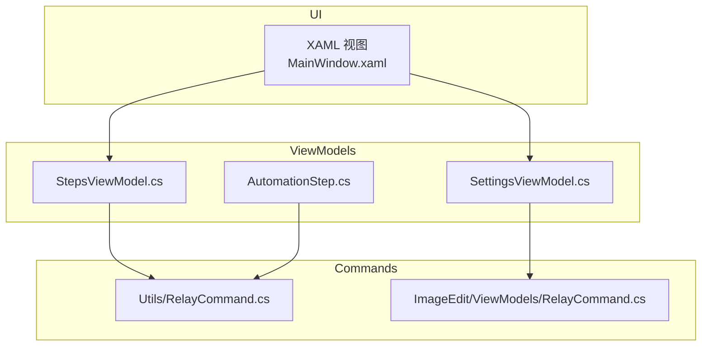
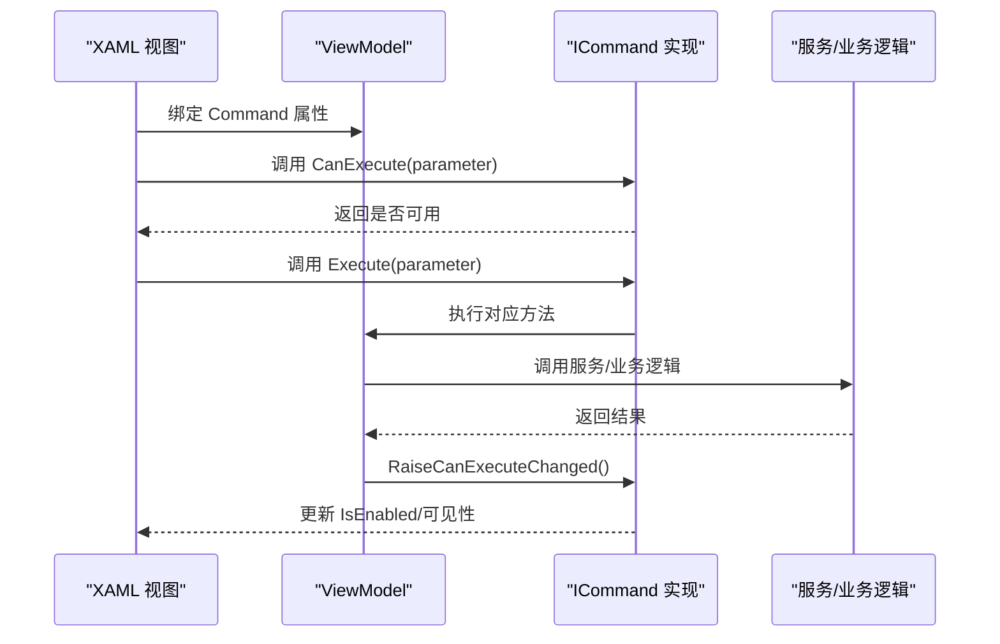
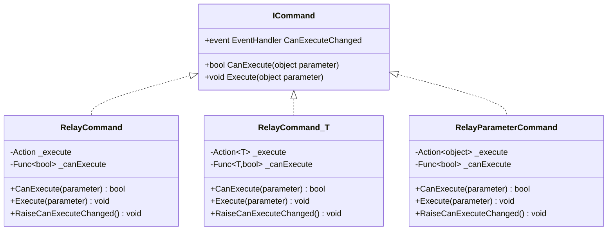
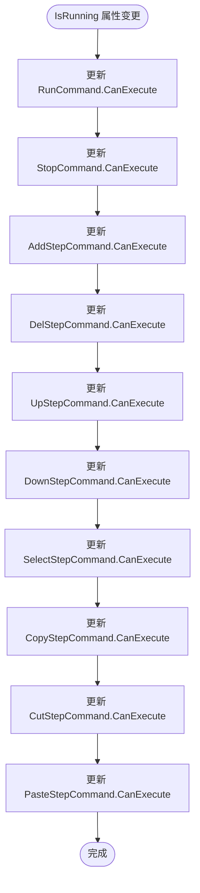
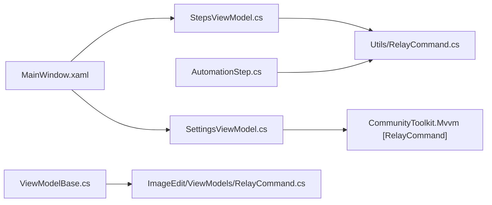

# 命令模式实现

<cite>
**本文引用的文件**   
- [RelayCommand.cs](file://ShaoLu/Utils/RelayCommand.cs)
- [RelayCommand.cs](file://ShaoLu/Tools/ImageEdit/ViewModels/RelayCommand.cs)
- [StepsViewModel.cs](file://ShaoLu/Viewmodels/StepsViewModel.cs)
- [AutomationStep.cs](file://ShaoLu/Viewmodels/AutomationStep.cs)
- [SettingsViewModel.cs](file://ShaoLu/Viewmodels/SettingsViewModel.cs)
- [MainWindow.xaml](file://ShaoLu/MainWindow.xaml)
- [ViewModelBase.cs](file://ShaoLu/Tools/ImageEdit/ViewModels/ViewModelBase.cs)
</cite>

## 目录
1. [简介](#简介)
2. [项目结构](#项目结构)
3. [核心组件](#核心组件)
4. [架构总览](#架构总览)
5. [详细组件分析](#详细组件分析)
6. [依赖关系分析](#依赖关系分析)
7. [性能考量](#性能考量)
8. [故障排查指南](#故障排查指南)
9. [结论](#结论)
10. [附录：使用场景与最佳实践](#附录使用场景与最佳实践)

## 简介
本指南围绕 RelayCommand 命令模式的实现与使用，系统解析 ICommand 接口在 WPF MVVM 中的落地方式，涵盖参数传递、CanExecute 状态管理、异步命令支持，以及在按钮点击、菜单操作、键盘快捷键等交互中的绑定模式。同时给出复杂命令（带参、可取消、组合）的实现思路与最佳实践，并辅以实际代码路径与可视化图示，帮助读者快速掌握在 ShaoLu 项目中正确使用命令模式的方法。

## 项目结构
本项目包含两套 RelayCommand 实现：
- 通用工具库版本：位于 Utils/RelayCommand.cs，提供无参、泛型参数以及线程安全的 RelayParameterCommand 三种形态。
- 图像编辑子模块版本：位于 Tools/ImageEdit/ViewModels/RelayCommand.cs，基于 CommandManager.RequerySuggested 的轻量实现。

MVVM 层广泛使用命令进行用户交互控制，例如 StepsViewModel 中大量使用自定义 RelayCommand 和 RelayParameterCommand，SettingsViewModel 中使用 CommunityToolkit.Mvvm 的 [RelayCommand] 特性生成命令。

图表来源
- [MainWindow.xaml:1-49](file://ShaoLu/MainWindow.xaml#L1-L49)
- [StepsViewModel.cs:72-112](file://ShaoLu/Viewmodels/StepsViewModel.cs#L72-L112)
- [SettingsViewModel.cs:183-208](file://ShaoLu/Viewmodels/SettingsViewModel.cs#L183-L208)
- [AutomationStep.cs:132-140](file://ShaoLu/Viewmodels/AutomationStep.cs#L132-L140)
- [RelayCommand.cs](file://ShaoLu/Utils/RelayCommand.cs)
- [RelayCommand.cs](file://ShaoLu/Tools/ImageEdit/ViewModels/RelayCommand.cs)

章节来源
- [MainWindow.xaml:1-49](file://ShaoLu/MainWindow.xaml#L1-L49)
- [StepsViewModel.cs:72-112](file://ShaoLu/Viewmodels/StepsViewModel.cs#L72-L112)
- [SettingsViewModel.cs:183-208](file://ShaoLu/Viewmodels/SettingsViewModel.cs#L183-L208)
- [AutomationStep.cs:132-140](file://ShaoLu/Viewmodels/AutomationStep.cs#L132-L140)
- [RelayCommand.cs](file://ShaoLu/Utils/RelayCommand.cs)
- [RelayCommand.cs](file://ShaoLu/Tools/ImageEdit/ViewModels/RelayCommand.cs)

## 核心组件
- 无参 RelayCommand：封装 Action 执行逻辑，可选 CanExecute 委托，用于简单命令。
- 泛型参数 RelayCommand<T>：封装 Action<T> 执行逻辑，支持强类型参数传递。
- 线程安全 RelayParameterCommand：封装 Action<object> 执行逻辑，RaiseCanExecuteChanged 自动跨线程调度到 UI 线程，避免 WPF 绑定异常。
- ImageEdit 版 RelayCommand：通过订阅 CommandManager.RequerySuggested 触发 CanExecute 重算，适合轻量场景。

这些实现均遵循 ICommand 接口契约，确保与 WPF 控件（Button、MenuItem、CommandBinding 等）无缝绑定。

章节来源
- [RelayCommand.cs:7-29](file://ShaoLu/Utils/RelayCommand.cs#L7-L29)
- [RelayCommand.cs:31-49](file://ShaoLu/Utils/RelayCommand.cs#L31-L49)
- [RelayCommand.cs:57-111](file://ShaoLu/Utils/RelayCommand.cs#L57-L111)
- [RelayCommand.cs:6-26](file://ShaoLu/Tools/ImageEdit/ViewModels/RelayCommand.cs#L6-L26)

## 架构总览
命令模式在本项目中的整体流程如下：
- 视图（XAML）通过 Binding 将控件的 Command 属性绑定到 ViewModel 的命令属性。
- ViewModel 暴露 ICommand 实例（如 RunCommand、AddStepCommand），并在属性变化时调用 RaiseCanExecuteChanged 更新命令可用性。
- 命令执行 Execute 方法，可能触发业务逻辑、异步任务或 UI 交互。
- 对于需要跨线程更新的场景，RelayParameterCommand 保证事件在 UI 线程上触发。

图表来源
- [StepsViewModel.cs:72-112](file://ShaoLu/Viewmodels/StepsViewModel.cs#L72-L112)
- [RelayCommand.cs:57-111](file://ShaoLu/Utils/RelayCommand.cs#L57-L111)

## 详细组件分析

### 组件 A：RelayCommand 类族（Utils/RelayCommand.cs）
- 无参 RelayCommand(Action execute, Func<bool> canExecute)
  - 实现 ICommand，支持可选 CanExecute。
  - 提供 RaiseCanExecuteChanged 手动刷新。
- 泛型 RelayCommand<T>(Action<T> execute, Func<T, bool> canExecute)
  - 支持强类型参数传递，常用于菜单项或带参数的按钮。
- 线程安全 RelayParameterCommand(Action<object> execute, Func<bool> canExecute = null)
  - 统一处理 object 参数，内部 Ensure 非空。
  - RaiseCanExecuteChanged 检查当前线程，必要时 Dispatcher.BeginInvoke 切换到 UI 线程，避免跨线程异常。

图表来源
- [RelayCommand.cs:7-29](file://ShaoLu/Utils/RelayCommand.cs#L7-L29)
- [RelayCommand.cs:31-49](file://ShaoLu/Utils/RelayCommand.cs#L31-L49)
- [RelayCommand.cs:57-111](file://ShaoLu/Utils/RelayCommand.cs#L57-L111)

章节来源
- [RelayCommand.cs:7-29](file://ShaoLu/Utils/RelayCommand.cs#L7-L29)
- [RelayCommand.cs:31-49](file://ShaoLu/Utils/RelayCommand.cs#L31-L49)
- [RelayCommand.cs:57-111](file://ShaoLu/Utils/RelayCommand.cs#L57-L111)

### 组件 B：ImageEdit 版 RelayCommand（Tools/ImageEdit/ViewModels/RelayCommand.cs）
- 基于 CommandManager.RequerySuggested 订阅，简化事件管理。
- 适用于轻量级命令，无需手动 RaiseCanExecuteChanged。

章节来源
- [RelayCommand.cs:6-26](file://ShaoLu/Tools/ImageEdit/ViewModels/RelayCommand.cs#L6-L26)

### 组件 C：StepsViewModel 中的命令使用（Viewmodels/StepsViewModel.cs）
- 定义多个命令属性：RunCommand、StopCommand、AddStepCommand、DelStepCommand、UpStepCommand、DownStepCommand、SelectStepCommand、CopyStepCommand、CutStepCommand、PasteStepCommand。
- 使用 RelayCommand 和 RelayParameterCommand 两种实现：
  - 无参命令：RunCommand、StopCommand、DelStepCommand、UpStepCommand、DownStepCommand、SelectStepCommand、CopyStepCommand、CutStepCommand、PasteStepCommand。
  - 带参命令：AddStepCommand（参数为字符串标识步骤类型）。
- 在 IsRunning 属性 setter 中集中调用各命令的 RaiseCanExecuteChanged，确保 UI 状态一致。

图表来源
- [StepsViewModel.cs:31-50](file://ShaoLu/Viewmodels/StepsViewModel.cs#L31-L50)

章节来源
- [StepsViewModel.cs:72-112](file://ShaoLu/Viewmodels/StepsViewModel.cs#L72-L112)
- [StepsViewModel.cs:31-50](file://ShaoLu/Viewmodels/StepsViewModel.cs#L31-L50)

### 组件 D：AutomationStep 中的命令（Viewmodels/AutomationStep.cs）
- 使用 ICommand 暴露 AddConditionCommand 与 RemoveConditionCommand，用于动态增删条件。
- 使用 [RelayCommand] 特性生成命令（CommunityToolkit.Mvvm），简化命令声明。

章节来源
- [AutomationStep.cs:132-140](file://ShaoLu/Viewmodels/AutomationStep.cs#L132-L140)
- [AutomationStep.cs:511-532](file://ShaoLu/Viewmodels/AutomationStep.cs#L511-L532)

### 组件 E：SettingsViewModel 中的异步命令（Viewmodels/SettingsViewModel.cs）
- 使用 [RelayCommand] 特性生成 SaveAsync 异步命令，结合 Task 与 await，实现异步保存与弹窗交互。
- 体现异步命令在 MVVM 中的典型用法：不阻塞 UI 线程，提升用户体验。

章节来源
- [SettingsViewModel.cs:183-208](file://ShaoLu/Viewmodels/SettingsViewModel.cs#L183-L208)

### 组件 F：ViewModelBase 中的关闭命令（Tools/ImageEdit/ViewModels/ViewModelBase.cs）
- 定义 CloseCommand 为 RelayCommand(() => Application.Current.Shutdown())，用于关闭窗口。
- 展示最简单的无参命令绑定示例。

章节来源
- [ViewModelBase.cs:31-33](file://ShaoLu/Tools/ImageEdit/ViewModels/ViewModelBase.cs#L31-L33)

## 依赖关系分析
- 视图（XAML）依赖 ViewModel 的命令属性。
- ViewModel 依赖 RelayCommand 实现（Utils 或 ImageEdit 版本）。
- 部分 ViewModel 使用 CommunityToolkit.Mvvm 的 [RelayCommand] 特性生成命令。
- 命令执行可能调用服务层（如 SettingsService.SaveAsync）或 UI 交互（弹窗）。

图表来源
- [MainWindow.xaml:1-49](file://ShaoLu/MainWindow.xaml#L1-L49)
- [StepsViewModel.cs:72-112](file://ShaoLu/Viewmodels/StepsViewModel.cs#L72-L112)
- [SettingsViewModel.cs:183-208](file://ShaoLu/Viewmodels/SettingsViewModel.cs#L183-L208)
- [AutomationStep.cs:132-140](file://ShaoLu/Viewmodels/AutomationStep.cs#L132-L140)
- [ViewModelBase.cs:31-33](file://ShaoLu/Tools/ImageEdit/ViewModels/ViewModelBase.cs#L31-L33)

章节来源
- [MainWindow.xaml:1-49](file://ShaoLu/MainWindow.xaml#L1-L49)
- [StepsViewModel.cs:72-112](file://ShaoLu/Viewmodels/StepsViewModel.cs#L72-L112)
- [SettingsViewModel.cs:183-208](file://ShaoLu/Viewmodels/SettingsViewModel.cs#L183-L208)
- [AutomationStep.cs:132-140](file://ShaoLu/Viewmodels/AutomationStep.cs#L132-L140)
- [ViewModelBase.cs:31-33](file://ShaoLu/Tools/ImageEdit/ViewModels/ViewModelBase.cs#L31-L33)

## 性能考量
- 避免在 CanExecute 中进行昂贵计算，尽量缓存结果或在属性变更时主动调用 RaiseCanExecuteChanged。
- 使用 RelayParameterCommand 的线程安全 RaiseCanExecuteChanged，防止跨线程异常导致的 UI 卡顿。
- 对频繁触发的命令（如列表项操作）考虑延迟刷新或批量更新。
- 异步命令应使用 Task 与 CancellationToken，避免阻塞 UI 线程。

[本节为通用指导，不直接分析具体文件]

## 故障排查指南
- 命令不可用但期望可用：检查 CanExecute 逻辑与 RaiseCanExecuteChanged 调用位置。
- 跨线程异常：确认是否在后台线程调用了 UI 相关逻辑；使用 RelayParameterCommand 的 RaiseCanExecuteChanged 自动切换线程。
- 异步命令未响应：检查是否正确使用 await，并确保 UI 线程更新逻辑正确。
- 菜单/按钮绑定无效：确认 XAML 中 Command 绑定路径与 ViewModel 属性名一致。

章节来源
- [RelayCommand.cs:57-111](file://ShaoLu/Utils/RelayCommand.cs#L57-L111)
- [StepsViewModel.cs:31-50](file://ShaoLu/Viewmodels/StepsViewModel.cs#L31-L50)

## 结论
RelayCommand 在 ShaoLu 项目中提供了灵活、可靠的命令实现，覆盖无参、泛型参数与线程安全场景。结合 MVVM 架构，通过 XAML 绑定与 ViewModel 命令属性，实现了清晰的职责分离与良好的可维护性。建议在实际开发中根据场景选择合适的命令实现，并遵循最佳实践以提升性能与稳定性。

[本节为总结，不直接分析具体文件]

## 附录：使用场景与最佳实践

### 按钮点击命令
- 使用无参 RelayCommand 绑定 Button.Command。
- 示例路径：[ViewModelBase.cs:31-33](file://ShaoLu/Tools/ImageEdit/ViewModels/ViewModelBase.cs#L31-L33)

### 菜单操作命令
- 使用 RelayCommand<T> 或 RelayParameterCommand 绑定 MenuItem.Command，传递参数。
- 示例路径：[StepsViewModel.cs:81-83](file://ShaoLu/Viewmodels/StepsViewModel.cs#L81-L83)

### 键盘快捷键命令
- 使用 CommandBinding 或 KeyGesture 绑定到命令。
- 建议在 ViewModel 中暴露命令属性，并在窗口初始化时注册快捷键。

### 复杂命令：带参数、可取消、组合
- 带参数：使用 RelayCommand<T> 或 RelayParameterCommand，参数类型为 string、对象等。
- 可取消：在异步命令中使用 CancellationToken，支持用户取消操作。
- 组合：将多个命令逻辑封装在一个方法中，由单一命令触发。

### 最佳实践
- 命令复用：将常用逻辑抽取为私有方法，供多个命令共享。
- 错误处理：在命令执行中捕获异常，记录日志并提示用户。
- 性能优化：避免在 CanExecute 中执行耗时操作，合理使用缓存与延迟刷新。

章节来源
- [StepsViewModel.cs:72-112](file://ShaoLu/Viewmodels/StepsViewModel.cs#L72-L112)
- [SettingsViewModel.cs:183-208](file://ShaoLu/Viewmodels/SettingsViewModel.cs#L183-L208)
- [AutomationStep.cs:132-140](file://ShaoLu/Viewmodels/AutomationStep.cs#L132-L140)