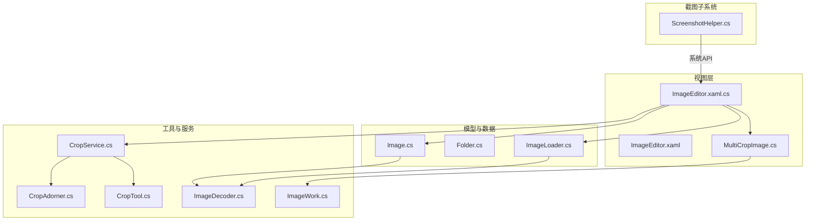
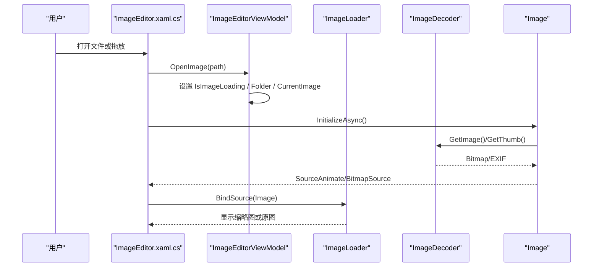
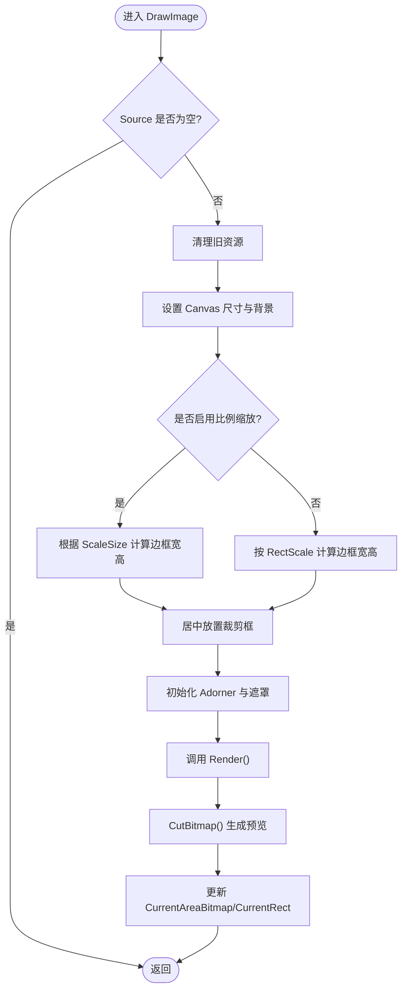
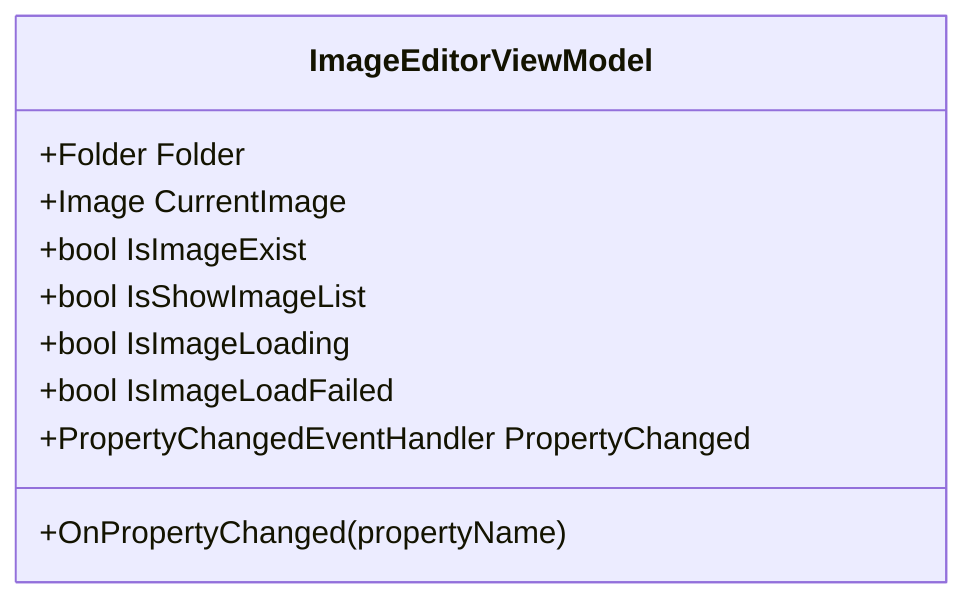
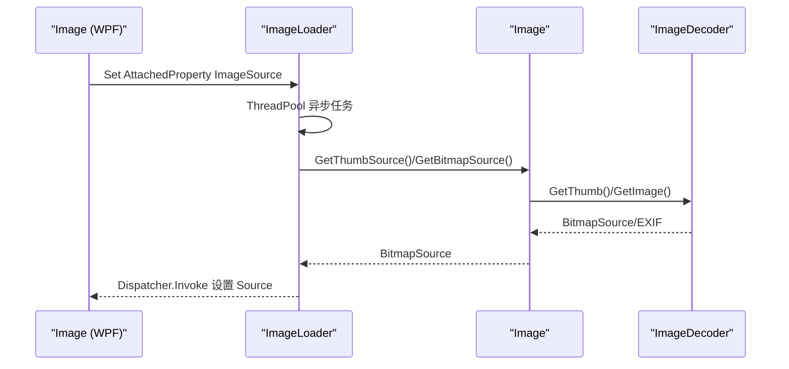
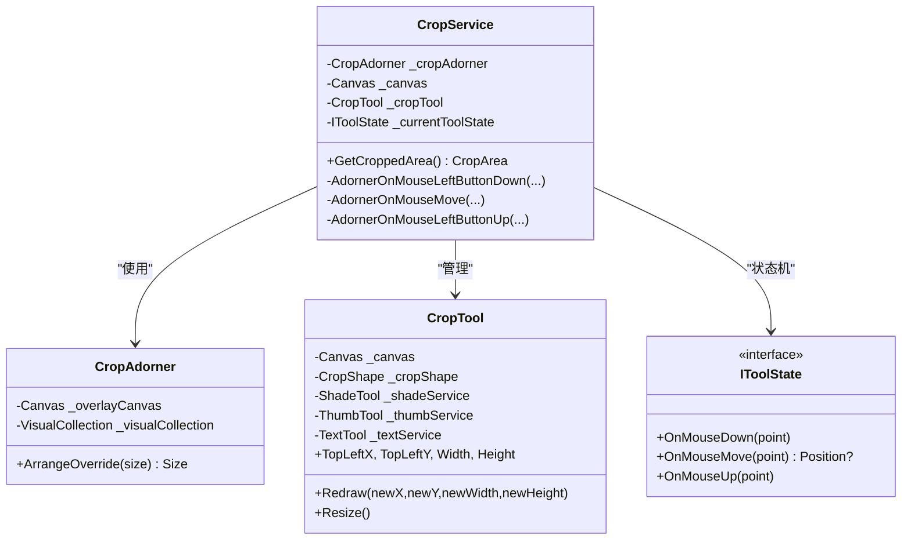
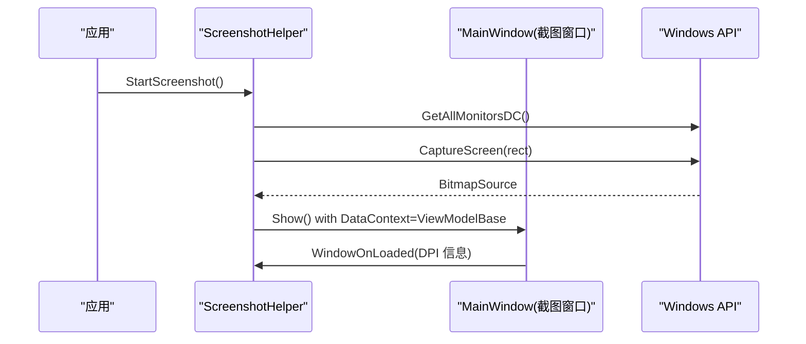
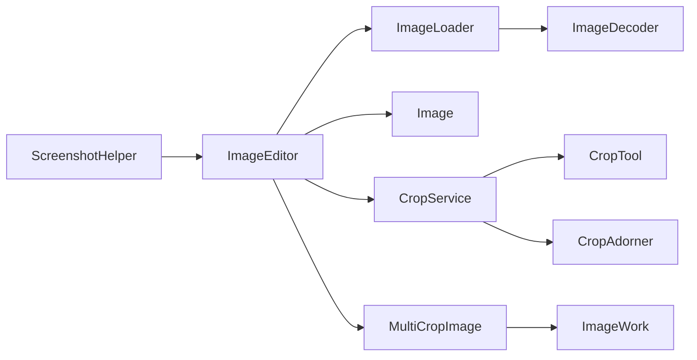

# 图片编辑器开发

<cite>
**本文引用的文件**   
- [ImageEditorViewModel.cs](file://ShaoLu/Tools/ImageEdit/ImageEditorViewModel.cs)
- [MultiCropImage.cs](file://ShaoLu/Controls/MultiCropImage.cs)
- [ImageEditor.xaml.cs](file://ShaoLu/Tools/ImageEdit/ImageEditor.xaml.cs)
- [ImageEditor.xaml](file://ShaoLu/Tools/ImageEdit/ImageEditor.xaml)
- [Image.cs](file://ShaoLu/Tools/ImageEdit/Image.cs)
- [ImageLoader.cs](file://ShaoLu/Tools/ImageEdit/ImageLoader.cs)
- [Folder.cs](file://ShaoLu/Tools/ImageEdit/Folder.cs)
- [CropService.cs](file://ShaoLu/Tools/ImageEdit/Services/CropService.cs)
- [CropAdorner.cs](file://ShaoLu/Tools/ImageEdit/Services/CropAdorner.cs)
- [CropTool.cs](file://ShaoLu/Tools/ImageEdit/Services/Tools/CropTool.cs)
- [IToolState.cs](file://ShaoLu/Tools/ImageEdit/Services/State/IToolState.cs)
- [ImageDecoder.cs](file://ShaoLu/Tools/ImageEdit/ImageDecoder.cs)
- [ImageWork.cs](file://ShaoLu/Tools/ImageEdit/Utils/ImageWork.cs)
- [ScreenshotHelper.cs](file://ShaoLu/Tools/ImageEdit/Helpers/ScreenshotHelper.cs)
</cite>

## 目录
1. [简介](#简介)
2. [项目结构](#项目结构)
3. [核心组件](#核心组件)
4. [架构总览](#架构总览)
5. [详细组件分析](#详细组件分析)
6. [依赖关系分析](#依赖关系分析)
7. [性能考量](#性能考量)
8. [故障排查指南](#故障排查指南)
9. [结论](#结论)
10. [附录](#附录)

## 简介
本指南聚焦于 ShaoLu 项目中 Tools/ImageEdit 目录的图片编辑能力，涵盖图像裁剪、标注、截图等功能的实现与集成。重点解析：
- MultiCropImage 自定义控件的拖拽、矩形选择、缩放旋转与缩略图处理交互逻辑
- ImageEditorViewModel 的数据绑定与命令模式（属性变更驱动 UI）
- 图像处理核心算法：解码、缩放、格式转换、内存优化
- 与主程序的集成方式：窗口调用、数据传递与事件通信
- 性能优化建议与常见问题解决方案

## 项目结构
该模块采用分层与职责分离的组织方式：
- 视图层：ImageEditor.xaml/.cs 提供用户界面与交互
- 模型与数据：Image、Folder、ImageLoader 负责图像加载与展示
- 工具与服务：CropService、CropTool、CropAdorner 实现裁剪交互；ImageDecoder、ImageWork 提供图像处理能力
- 截图子系统：ScreenshotHelper 封装系统级截图与多显示器支持
- 自定义控件：MultiCropImage 提供可复用的裁剪与预览控件

图表来源
- [ImageEditor.xaml.cs:1-200](file://ShaoLu/Tools/ImageEdit/ImageEditor.xaml.cs#L1-L200)
- [ImageEditor.xaml:1-200](file://ShaoLu/Tools/ImageEdit/ImageEditor.xaml#L1-L200)
- [MultiCropImage.cs:1-120](file://ShaoLu/Controls/MultiCropImage.cs#L1-L120)
- [Image.cs:1-80](file://ShaoLu/Tools/ImageEdit/Image.cs#L1-L80)
- [Folder.cs:1-33](file://ShaoLu/Tools/ImageEdit/Folder.cs#L1-L33)
- [ImageLoader.cs:1-112](file://ShaoLu/Tools/ImageEdit/ImageLoader.cs#L1-L112)
- [CropService.cs:1-120](file://ShaoLu/Tools/ImageEdit/Services/CropService.cs#L1-L120)
- [CropAdorner.cs:1-32](file://ShaoLu/Tools/ImageEdit/Services/CropAdorner.cs#L1-L32)
- [CropTool.cs:1-74](file://ShaoLu/Tools/ImageEdit/Services/Tools/CropTool.cs#L1-L74)
- [ImageDecoder.cs:1-120](file://ShaoLu/Tools/ImageEdit/ImageDecoder.cs#L1-L120)
- [ImageWork.cs:1-120](file://ShaoLu/Tools/ImageEdit/Utils/ImageWork.cs#L1-L120)
- [ScreenshotHelper.cs:1-120](file://ShaoLu/Tools/ImageEdit/Helpers/ScreenshotHelper.cs#L1-L120)

章节来源
- [ImageEditor.xaml.cs:1-200](file://ShaoLu/Tools/ImageEdit/ImageEditor.xaml.cs#L1-L200)
- [ImageEditor.xaml:1-200](file://ShaoLu/Tools/ImageEdit/ImageEditor.xaml#L1-L200)

## 核心组件
- ImageEditorViewModel：承载当前图像、文件夹列表、加载状态等，通过属性变更通知驱动 UI
- ImageEditor：UI 容器，处理拖放、键盘、鼠标、缩放、旋转、裁剪入口、标注（InkCanvasEx）
- MultiCropImage：可复用裁剪控件，支持拖拽选择、比例锁定、缩放平移、旋转、实时预览
- CropService/CropTool/CropAdorner：基于 Adorner 的裁剪交互服务，状态机管理创建/拖拽/完成
- Image/ImageLoader/ImageDecoder：图像解码、缩略图生成、BitmapSource 转换与动画帧播放
- ImageWork：位图转换、保存、裁剪、缩放等通用算法
- ScreenshotHelper：跨显示器截图、全局鼠标钩子、DPI 感知

章节来源
- [ImageEditorViewModel.cs:1-116](file://ShaoLu/Tools/ImageEdit/ImageEditorViewModel.cs#L1-L116)
- [ImageEditor.xaml.cs:1-200](file://ShaoLu/Tools/ImageEdit/ImageEditor.xaml.cs#L1-L200)
- [MultiCropImage.cs:1-120](file://ShaoLu/Controls/MultiCropImage.cs#L1-L120)
- [CropService.cs:1-120](file://ShaoLu/Tools/ImageEdit/Services/CropService.cs#L1-L120)
- [Image.cs:1-120](file://ShaoLu/Tools/ImageEdit/Image.cs#L1-L120)
- [ImageLoader.cs:1-112](file://ShaoLu/Tools/ImageEdit/ImageLoader.cs#L1-L112)
- [ImageDecoder.cs:1-120](file://ShaoLu/Tools/ImageEdit/ImageDecoder.cs#L1-L120)
- [ImageWork.cs:1-120](file://ShaoLu/Tools/ImageEdit/Utils/ImageWork.cs#L1-L120)
- [ScreenshotHelper.cs:1-120](file://ShaoLu/Tools/ImageEdit/Helpers/ScreenshotHelper.cs#L1-L120)

## 架构总览
整体采用 MVVM + 服务化设计：
- View（XAML）通过 DataContext 绑定 ViewModel
- ViewModel 暴露属性与状态，触发 UI 更新
- Service 层封装复杂交互与算法（如裁剪、截图）
- 资源加载与解码在后台线程执行，避免阻塞 UI

图表来源
- [ImageEditor.xaml.cs:260-320](file://ShaoLu/Tools/ImageEdit/ImageEditor.xaml.cs#L260-L320)
- [ImageEditorViewModel.cs:1-116](file://ShaoLu/Tools/ImageEdit/ImageEditorViewModel.cs#L1-L116)
- [Image.cs:60-120](file://ShaoLu/Tools/ImageEdit/Image.cs#L60-L120)
- [ImageLoader.cs:40-90](file://ShaoLu/Tools/ImageEdit/ImageLoader.cs#L40-L90)
- [ImageDecoder.cs:46-108](file://ShaoLu/Tools/ImageEdit/ImageDecoder.cs#L46-L108)

## 详细组件分析

### MultiCropImage 自定义控件
- 功能要点
  - 依赖属性：Source、CurrentRect、CurrentAreaBitmap、IsRatioScale、ScaleSize、RectScale、CropAngle
  - 交互：鼠标滚轮缩放、中键切换平移模式、拖拽移动裁剪框、旋转手柄调整角度
  - 渲染：使用 AdornerLayer 叠加遮罩与裁剪区域，WriteableBitmap 生成预览
  - 性能：无旋转时使用 CroppedBitmap 高效裁剪；有旋转时回退到 RenderTargetBitmap
- 关键流程
  - OnSourceChanged -> DrawImage -> Render -> CutBitmap -> 更新 CurrentAreaBitmap/CurrentRect
  - MouseWheel -> 以指针为中心缩放并更新视图变换
  - 中键按下 -> 切换平移模式，同时移动视图层与裁剪框层

图表来源
- [MultiCropImage.cs:495-574](file://ShaoLu/Controls/MultiCropImage.cs#L495-L574)
- [MultiCropImage.cs:611-711](file://ShaoLu/Controls/MultiCropImage.cs#L611-L711)

章节来源
- [MultiCropImage.cs:1-714](file://ShaoLu/Controls/MultiCropImage.cs#L1-L714)

### ImageEditorViewModel 数据绑定与命令模式
- 属性
  - Folder：当前文件夹中的图像集合，控制是否显示缩略图列表
  - CurrentImage：当前选中的图像对象，切换时释放旧资源
  - IsImageExist、IsImageLoading、IsImageLoadFailed：控制 UI 状态
- 事件
  - PropertyChanged：用于 WPF 数据绑定更新
- 典型用法
  - ImageEditor 在 Loaded 后订阅 ViewModel.PropertyChanged，响应 CurrentImage 变化并初始化图像

图表来源
- [ImageEditorViewModel.cs:1-116](file://ShaoLu/Tools/ImageEdit/ImageEditorViewModel.cs#L1-L116)

章节来源
- [ImageEditorViewModel.cs:1-116](file://ShaoLu/Tools/ImageEdit/ImageEditorViewModel.cs#L1-L116)

### 图像加载与解码（Image、ImageLoader、ImageDecoder）
- Image：封装路径、尺寸、EXIF、GIF 动画播放；提供 GetBitmapSource/GetThumbSource
- ImageLoader：附加依赖属性绑定，后台线程异步加载缩略图或原图，失败/加载中状态可视化
- ImageDecoder：基于 ImageMagick 解码图像、提取 EXIF、生成缩略图；将 GDI+ Bitmap 转为 WPF BitmapSource

图表来源
- [ImageLoader.cs:40-90](file://ShaoLu/Tools/ImageEdit/ImageLoader.cs#L40-L90)
- [Image.cs:85-104](file://ShaoLu/Tools/ImageEdit/Image.cs#L85-L104)
- [ImageDecoder.cs:81-108](file://ShaoLu/Tools/ImageEdit/ImageDecoder.cs#L81-L108)

章节来源
- [ImageLoader.cs:1-112](file://ShaoLu/Tools/ImageEdit/ImageLoader.cs#L1-L112)
- [Image.cs:1-171](file://ShaoLu/Tools/ImageEdit/Image.cs#L1-L171)
- [ImageDecoder.cs:1-221](file://ShaoLu/Tools/ImageEdit/ImageDecoder.cs#L1-L221)

### 裁剪服务（CropService、CropTool、CropAdorner）
- CropAdorner：作为 Adorner 承载覆盖层 Canvas
- CropTool：维护裁剪形状、阴影遮罩、缩略手柄、文本标注等元素
- CropService：状态机（Create/Drag/Complete），处理鼠标事件与重绘

图表来源
- [CropAdorner.cs:1-32](file://ShaoLu/Tools/ImageEdit/Services/CropAdorner.cs#L1-L32)
- [CropTool.cs:1-74](file://ShaoLu/Tools/ImageEdit/Services/Tools/CropTool.cs#L1-L74)
- [CropService.cs:1-190](file://ShaoLu/Tools/ImageEdit/Services/CropService.cs#L1-L190)
- [IToolState.cs:1-11](file://ShaoLu/Tools/ImageEdit/Services/State/IToolState.cs#L1-L11)

章节来源
- [CropService.cs:1-190](file://ShaoLu/Tools/ImageEdit/Services/CropService.cs#L1-L190)
- [CropAdorner.cs:1-32](file://ShaoLu/Tools/ImageEdit/Services/CropAdorner.cs#L1-L32)
- [CropTool.cs:1-74](file://ShaoLu/Tools/ImageEdit/Services/Tools/CropTool.cs#L1-L74)
- [IToolState.cs:1-11](file://ShaoLu/Tools/ImageEdit/Services/State/IToolState.cs#L1-L11)

### 截图功能（ScreenshotHelper）
- 启动流程：枚举显示器、全屏捕获、为每个显示器创建窗口并注入鼠标钩子
- 捕获方法：使用 GDI BitBlt 抓取指定矩形区域，转换为 BitmapSource
- DPI 感知：Loaded 事件中获取 CompositionTarget 的缩放因子

图表来源
- [ScreenshotHelper.cs:18-44](file://ShaoLu/Tools/ImageEdit/Helpers/ScreenshotHelper.cs#L18-L44)
- [ScreenshotHelper.cs:93-121](file://ShaoLu/Tools/ImageEdit/Helpers/ScreenshotHelper.cs#L93-L121)

章节来源
- [ScreenshotHelper.cs:1-144](file://ShaoLu/Tools/ImageEdit/Helpers/ScreenshotHelper.cs#L1-L144)

### 图像处理核心算法（ImageWork）
- 位图转换：Bitmap <-> BitmapSource、ImageSource <-> Bitmap
- 保存与编码：根据扩展名选择编码器（PNG/JPEG）
- 裁剪与缩放：高质量插值、固定比例修正
- 屏幕截图：RenderTargetBitmap 渲染 UI 元素为位图

图表来源
- [ImageWork.cs:27-92](file://ShaoLu/Tools/ImageEdit/Utils/ImageWork.cs#L27-L92)
- [ImageWork.cs:155-198](file://ShaoLu/Tools/ImageEdit/Utils/ImageWork.cs#L155-L198)
- [ImageWork.cs:211-250](file://ShaoLu/Tools/ImageEdit/Utils/ImageWork.cs#L211-L250)

章节来源
- [ImageWork.cs:1-296](file://ShaoLu/Tools/ImageEdit/Utils/ImageWork.cs#L1-L296)

## 依赖关系分析
- ImageEditor 依赖 ImageLoader、Image、CropService、InkCanvasEx（标注）
- MultiCropImage 依赖 WPF 渲染管线（AdornerLayer、RenderTargetBitmap、WriteableBitmap）
- ImageLoader 依赖 ImageDecoder 进行解码与缩略图生成
- CropService 依赖 CropTool、CropAdorner 与状态接口 IToolState
- ScreenshotHelper 依赖 Windows GDI 与 COM 互操作

图表来源
- [ImageEditor.xaml.cs:1-200](file://ShaoLu/Tools/ImageEdit/ImageEditor.xaml.cs#L1-L200)
- [ImageLoader.cs:1-112](file://ShaoLu/Tools/ImageEdit/ImageLoader.cs#L1-L112)
- [CropService.cs:1-120](file://ShaoLu/Tools/ImageEdit/Services/CropService.cs#L1-L120)
- [MultiCropImage.cs:1-120](file://ShaoLu/Controls/MultiCropImage.cs#L1-L120)
- [ScreenshotHelper.cs:1-120](file://ShaoLu/Tools/ImageEdit/Helpers/ScreenshotHelper.cs#L1-L120)

章节来源
- [ImageEditor.xaml.cs:1-200](file://ShaoLu/Tools/ImageEdit/ImageEditor.xaml.cs#L1-L200)
- [ImageLoader.cs:1-112](file://ShaoLu/Tools/ImageEdit/ImageLoader.cs#L1-L112)
- [CropService.cs:1-120](file://ShaoLu/Tools/ImageEdit/Services/CropService.cs#L1-L120)
- [MultiCropImage.cs:1-120](file://ShaoLu/Controls/MultiCropImage.cs#L1-L120)
- [ScreenshotHelper.cs:1-120](file://ShaoLu/Tools/ImageEdit/Helpers/ScreenshotHelper.cs#L1-L120)

## 性能考量
- 解码与加载
  - 使用 ImageMagick 解码与自适应缩略图生成，降低内存占用
  - 后台线程加载，避免阻塞 UI；Dispatcher.Invoke 安全更新
- 渲染与裁剪
  - 无旋转时优先使用 CroppedBitmap，减少拷贝开销
  - 有旋转时回退到 RenderTargetBitmap，确保正确性
- 内存管理
  - 及时释放 GDI 句柄与 BitmapSource（Freeze）
  - 卸载控件时清理 Adorner、Background、事件订阅
- 动画与交互
  - 缩放/平移使用 TransformGroup，避免重绘整图
  - 中键平移模式与滚轮缩放结合，提升大图像浏览体验

[本节为通用指导，不直接分析具体文件]

## 故障排查指南
- 图像加载失败
  - 检查文件路径与权限；查看 IsImageLoadFailed 状态
  - 确认 ImageDecoder.GetImage 未抛出异常
- 裁剪预览为空
  - 检查裁剪框是否在有效范围内；确认 CutBitmap 返回值
  - 旋转角度过大可能导致回退渲染路径，验证角度阈值
- 内存泄漏
  - 确保 Unloaded 时清理 Adorner、Background、事件订阅
  - GIF 动画停止后释放 ImageAnimator
- 截图黑屏或错位
  - 检查 DPI 缩放因子；确认 BitBlt 源 DC 与目标矩形一致

章节来源
- [ImageEditor.xaml.cs:353-363](file://ShaoLu/Tools/ImageEdit/ImageEditor.xaml.cs#L353-L363)
- [MultiCropImage.cs:425-467](file://ShaoLu/Controls/MultiCropImage.cs#L425-L467)
- [Image.cs:148-171](file://ShaoLu/Tools/ImageEdit/Image.cs#L148-L171)
- [ScreenshotHelper.cs:93-121](file://ShaoLu/Tools/ImageEdit/Helpers/ScreenshotHelper.cs#L93-L121)

## 结论
该图片编辑模块通过清晰的 MVVM 架构与模块化服务设计，实现了高效的图像加载、裁剪、标注与截图能力。MultiCropImage 提供了强大的交互体验，CropService 以状态机管理复杂操作，ImageDecoder/ImageWork 保障解码与处理的性能与质量。建议在后续迭代中进一步优化大图渲染与内存回收策略，并增强错误提示与日志记录。

[本节为总结，不直接分析具体文件]

## 附录
- 常用依赖属性与事件
  - ImageEditor：ImageSource、IsKeyInputEnabled、ShowOpen、ShowSave、PenColor、IsCoverSave
  - MultiCropImage：Source、CurrentRect、CurrentAreaBitmap、IsRatioScale、ScaleSize、RectScale、CropAngle
- 关键类与方法路径
  - 图像加载：ImageLoader.BindSource、Image.GetBitmapSource
  - 解码与缩略图：ImageDecoder.GetImage、ImageDecoder.GetThumb
  - 裁剪交互：CropService.GetCroppedArea、CropTool.Redraw
  - 截图：ScreenshotHelper.CaptureScreen、ScreenshotHelper.StartScreenshot

[本节为参考信息，不直接分析具体文件]