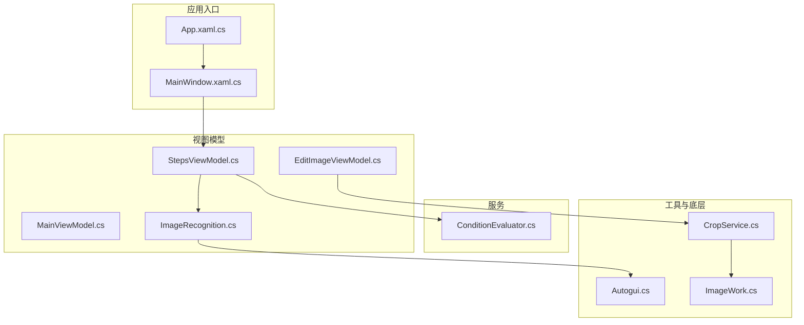
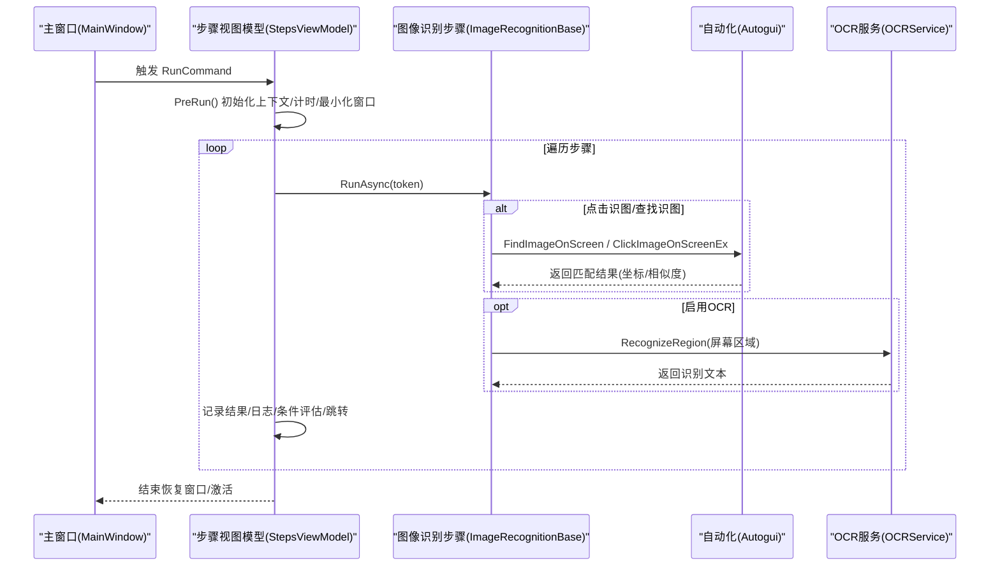
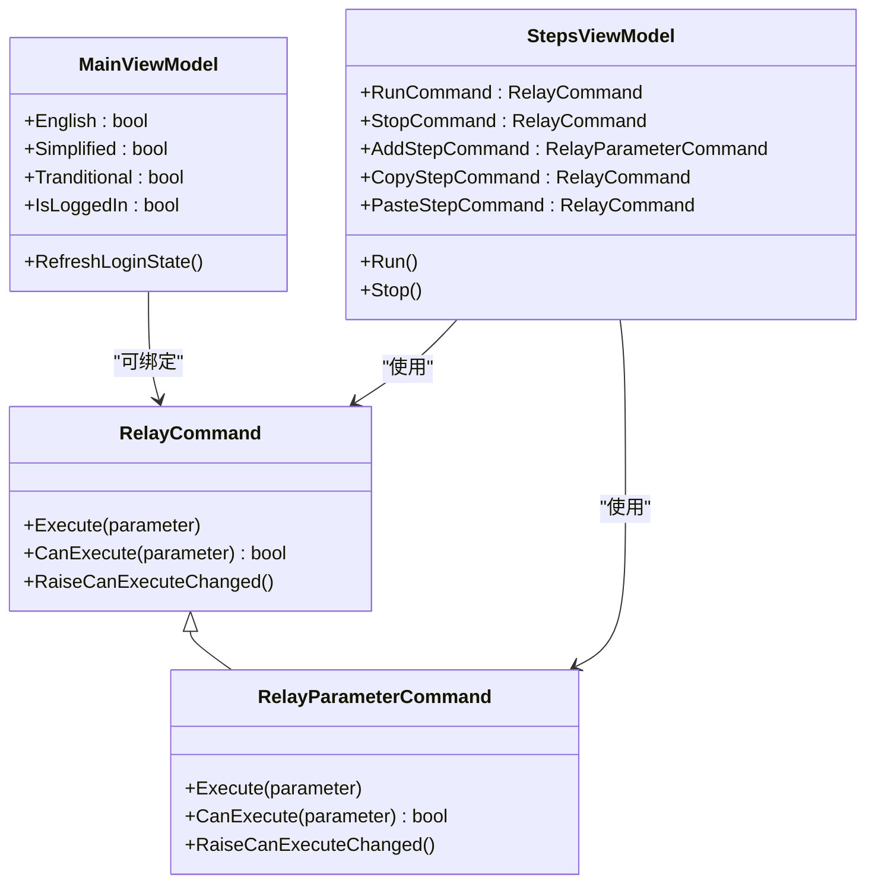
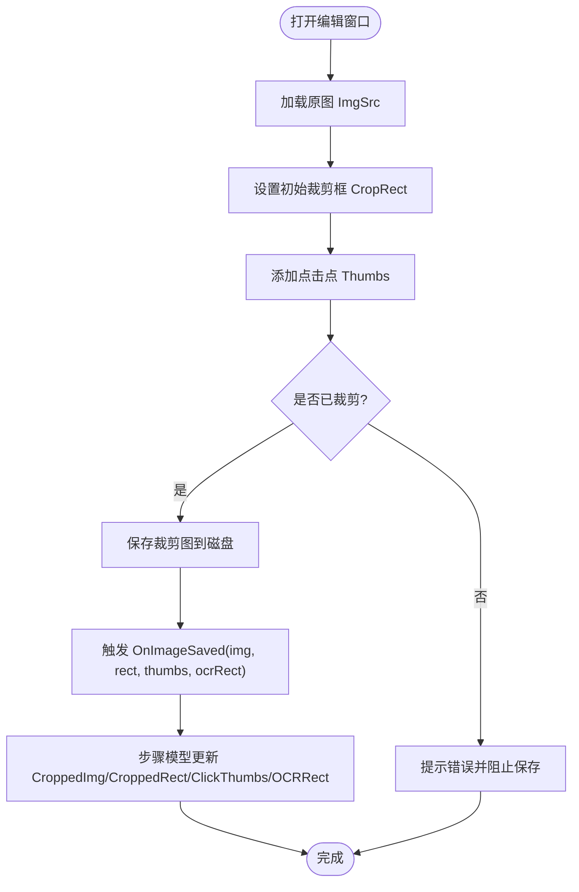
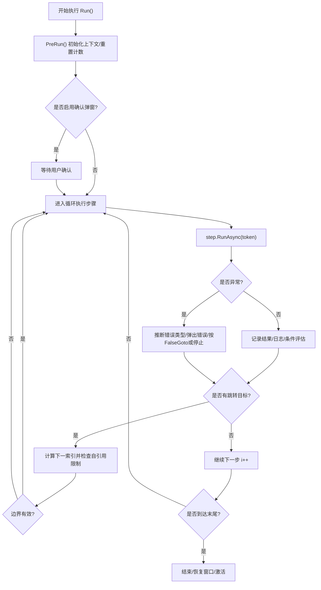
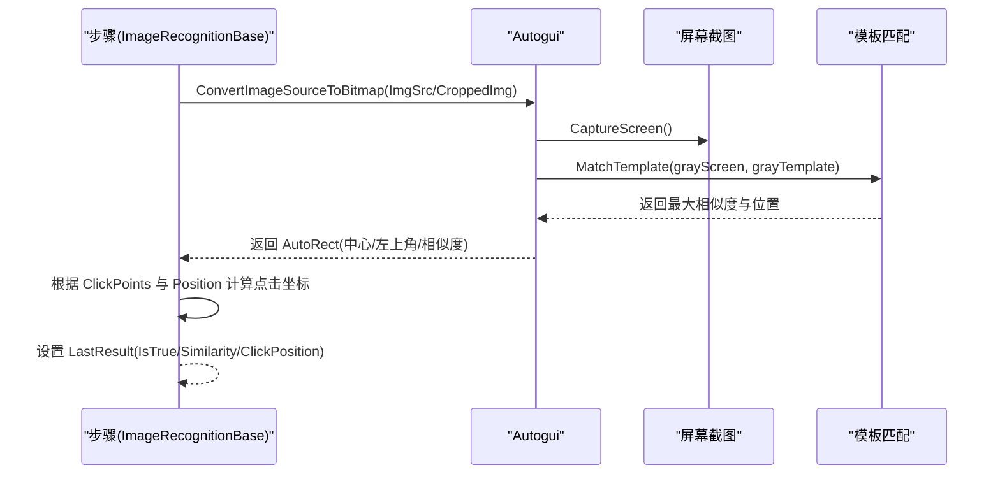
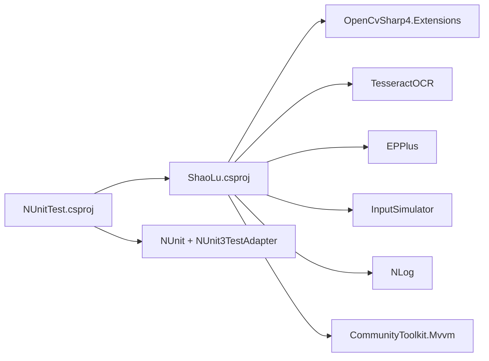

# 开发指南

<cite>
**本文引用的文件**   
- [Readme.md](file://Readme.md)
- [ShaoLu.csproj](file://ShaoLu/ShaoLu.csproj)
- [NUnitTest.csproj](file://NUnitTest/NUnitTest.csproj)
- [App.xaml.cs](file://ShaoLu/App.xaml.cs)
- [MainWindow.xaml.cs](file://ShaoLu/MainWindow.xaml.cs)
- [RelayCommand.cs](file://ShaoLu/Utils/RelayCommand.cs)
- [MainViewModel.cs](file://ShaoLu/Viewmodels/MainViewModel.cs)
- [StepsViewModel.cs](file://ShaoLu/Viewmodels/StepsViewModel.cs)
- [ImageRecognition.cs](file://ShaoLu/Viewmodels/ImageRecognition.cs)
- [EditImageViewModel.cs](file://ShaoLu/Viewmodels/EditImageViewModel.cs)
- [Autogui.cs](file://ShaoLu/Utils/Autogui.cs)
- [ConditionEvaluator.cs](file://ShaoLu/Services/ConditionEvaluator.cs)
- [AutomationStepTests.cs](file://NUnitTest/AutomationStepTests.cs)
- [ConditionEvaluatorTests.cs](file://NUnitTest/ConditionEvaluatorTests.cs)
- [CropService.cs](file://ShaoLu/Tools/ImageEdit/Services/CropService.cs)
- [ImageWork.cs](file://ShaoLu/Tools/ImageEdit/Utils/ImageWork.cs)
</cite>

## 目录
1. [简介](#简介)
2. [项目结构](#项目结构)
3. [核心组件](#核心组件)
4. [架构总览](#架构总览)
5. [详细组件分析](#详细组件分析)
6. [依赖关系分析](#依赖关系分析)
7. [性能考虑](#性能考虑)
8. [故障排查指南](#故障排查指南)
9. [结论](#结论)
10. [附录](#附录)

## 简介
本指南面向 ShaoLu（烧录）项目的开发者，覆盖以下内容：
- 开发环境搭建与 Visual Studio 配置、.NET Framework 版本要求、依赖库安装
- 单元测试编写与 NUnit 框架使用、测试用例设计要点
- 图片编辑工具模块：图像裁剪、标注点击点、保存流程
- RelayCommand 命令模式与 MVVM 数据绑定实现
- 代码规范与项目结构约定，便于团队协作
- 调试技巧与性能优化建议
- 扩展开发步骤：新增步骤类型与服务模块

## 项目结构
ShaoLu 采用 WPF + MVVM 架构，核心分层如下：
- 视图层（Views）：窗口与用户控件
- 视图模型层（Viewmodels）：业务交互与状态管理
- 服务层（Services）：条件评估、OCR、日志、设置等
- 工具与底层能力（Utils/Tools）：自动化输入输出、图像处理、截图、OCR
- 资源与主题（Resources/Themes/Templates）：本地化、样式、模板
- 测试工程（NUnitTest）：基于 NUnit 的单元测试

**图表来源** 
- [App.xaml.cs:1-86](file://ShaoLu/App.xaml.cs#L1-L86)
- [MainWindow.xaml.cs:1-316](file://ShaoLu/MainWindow.xaml.cs#L1-L316)
- [StepsViewModel.cs:1-588](file://ShaoLu/Viewmodels/StepsViewModel.cs#L1-L588)
- [ImageRecognition.cs:1-568](file://ShaoLu/Viewmodels/ImageRecognition.cs#L1-L568)
- [ConditionEvaluator.cs:1-187](file://ShaoLu/Services/ConditionEvaluator.cs#L1-L187)
- [Autogui.cs:1-584](file://ShaoLu/Utils/Autogui.cs#L1-L584)
- [CropService.cs:1-50](file://ShaoLu/Tools/ImageEdit/Services/CropService.cs#L1-L50)
- [ImageWork.cs:201-225](file://ShaoLu/Tools/ImageEdit/Utils/ImageWork.cs#L201-L225)

**章节来源**
- [Readme.md:1-283](file://Readme.md#L1-L283)
- [ShaoLu.csproj:1-433](file://ShaoLu/ShaoLu.csproj#L1-L433)

## 核心组件
- 应用启动与依赖注入：在应用启动时初始化语言、注册 ViewModel 和服务、清理过期日志并显示主窗口
- 主窗口与热键：注册全局快捷键（开始/停止），通过命令触发执行逻辑
- 步骤执行引擎：维护步骤集合、运行/停止信号、上下文、异常处理、跳转控制、自引用保护
- 图像识别基类与具体步骤：封装图片加载、裁剪图保存、点击点管理、相似度阈值、OCR 区域
- 图片编辑视图模型：裁剪框、点击点增删改、保存回调、OCR 区域设置
- 条件评估器：支持常量、布尔、数值、字符串比较，AND/OR 组合，引用其他步骤结果
- 自动化操作：屏幕截图、模板匹配、鼠标移动与点击、文本输入（安全粘贴模式）

**章节来源**
- [App.xaml.cs:1-86](file://ShaoLu/App.xaml.cs#L1-L86)
- [MainWindow.xaml.cs:1-316](file://ShaoLu/MainWindow.xaml.cs#L1-L316)
- [StepsViewModel.cs:1-588](file://ShaoLu/Viewmodels/StepsViewModel.cs#L1-L588)
- [ImageRecognition.cs:1-568](file://ShaoLu/Viewmodels/ImageRecognition.cs#L1-L568)
- [EditImageViewModel.cs:1-243](file://ShaoLu/Viewmodels/EditImageViewModel.cs#L1-L243)
- [ConditionEvaluator.cs:1-187](file://ShaoLu/Services/ConditionEvaluator.cs#L1-L187)
- [Autogui.cs:1-584](file://ShaoLu/Utils/Autogui.cs#L1-L584)

## 架构总览
下图展示从 UI 到执行引擎再到自动化底层的调用链。

**图表来源** 
- [MainWindow.xaml.cs:1-316](file://ShaoLu/MainWindow.xaml.cs#L1-L316)
- [StepsViewModel.cs:361-588](file://ShaoLu/Viewmodels/StepsViewModel.cs#L361-L588)
- [ImageRecognition.cs:329-568](file://ShaoLu/Viewmodels/ImageRecognition.cs#L329-L568)
- [Autogui.cs:52-171](file://ShaoLu/Utils/Autogui.cs#L52-L171)

## 详细组件分析

### 命令模式与 MVVM 数据绑定
- RelayCommand：提供无参/有参命令实现，支持 CanExecute 判断与线程安全的 RaiseCanExecuteChanged
- MVVM 属性通知：使用 ObservableObject 的属性变更通知机制，配合 XAML 双向绑定
- 典型用法：步骤列表的增删改、运行/停止、复制/粘贴、选择切换等均由命令驱动

**图表来源** 
- [RelayCommand.cs:1-113](file://ShaoLu/Utils/RelayCommand.cs#L1-L113)
- [MainViewModel.cs:1-76](file://ShaoLu/Viewmodels/MainViewModel.cs#L1-L76)
- [StepsViewModel.cs:72-112](file://ShaoLu/Viewmodels/StepsViewModel.cs#L72-L112)

**章节来源**
- [RelayCommand.cs:1-113](file://ShaoLu/Utils/RelayCommand.cs#L1-L113)
- [MainViewModel.cs:1-76](file://ShaoLu/Viewmodels/MainViewModel.cs#L1-L76)
- [StepsViewModel.cs:1-112](file://ShaoLu/Viewmodels/StepsViewModel.cs#L1-L112)

### 图片编辑工具模块（裁剪、标注、保存）
- 编辑视图模型负责：
  - 原图与裁剪图的绑定与更新
  - 裁剪框与点击点的增删改、可见性控制
  - 保存时触发回调，将裁剪图、裁剪矩形、点击点列表、OCR 区域回传至步骤模型
- 步骤模型负责：
  - 自动将裁剪图保存到工作目录 images/{Uid}.png
  - 同步 CroppedRect、ClickThumbs、OCRRect 等状态
- 裁剪服务与图像处理：
  - CropService 管理裁剪 adorner、工具状态机
  - ImageWork 提供高质量剪切与缩放

**图表来源** 
- [EditImageViewModel.cs:120-131](file://ShaoLu/Viewmodels/EditImageViewModel.cs#L120-L131)
- [ImageRecognition.cs:156-195](file://ShaoLu/Viewmodels/ImageRecognition.cs#L156-L195)
- [CropService.cs:1-50](file://ShaoLu/Tools/ImageEdit/Services/CropService.cs#L1-L50)
- [ImageWork.cs:201-225](file://ShaoLu/Tools/ImageEdit/Utils/ImageWork.cs#L201-L225)

**章节来源**
- [EditImageViewModel.cs:1-243](file://ShaoLu/Viewmodels/EditImageViewModel.cs#L1-L243)
- [ImageRecognition.cs:1-195](file://ShaoLu/Viewmodels/ImageRecognition.cs#L1-L195)
- [CropService.cs:1-50](file://ShaoLu/Tools/ImageEdit/Services/CropService.cs#L1-L50)
- [ImageWork.cs:201-225](file://ShaoLu/Tools/ImageEdit/Utils/ImageWork.cs#L201-L225)

### 步骤执行与条件评估
- 执行引擎：
  - 维护 IsRunning/StopSignal、CancellationToken
  - 逐步骤异步执行，捕获异常并推断错误类型
  - 支持自定义条件评估、跳转、自引用限制
- 条件评估器：
  - 支持常量、布尔、数值、字符串比较
  - AND/OR 连接器组合多行条件
  - 引用其他步骤的执行结果（如 IsTrue、Similarity、OCRText）

**图表来源** 
- [StepsViewModel.cs:361-588](file://ShaoLu/Viewmodels/StepsViewModel.cs#L361-L588)
- [ConditionEvaluator.cs:1-187](file://ShaoLu/Services/ConditionEvaluator.cs#L1-L187)

**章节来源**
- [StepsViewModel.cs:361-588](file://ShaoLu/Viewmodels/StepsViewModel.cs#L361-L588)
- [ConditionEvaluator.cs:1-187](file://ShaoLu/Services/ConditionEvaluator.cs#L1-L187)

### 自动化与图像识别
- 图像查找与点击：
  - 使用 OpenCV 进行模板匹配，支持超时与间隔重试
  - 支持多点击点顺序点击与多次点击
- 文本输入：
  - 直接按键输入与安全剪贴板粘贴两种模式
- OCR：
  - 找到图片后对指定区域进行文字识别，结果用于日志与条件评估

**图表来源** 
- [ImageRecognition.cs:329-417](file://ShaoLu/Viewmodels/ImageRecognition.cs#L329-L417)
- [Autogui.cs:52-171](file://ShaoLu/Utils/Autogui.cs#L52-L171)

**章节来源**
- [ImageRecognition.cs:329-417](file://ShaoLu/Viewmodels/ImageRecognition.cs#L329-L417)
- [Autogui.cs:52-171](file://ShaoLu/Utils/Autogui.cs#L52-L171)

## 依赖关系分析
- 运行时依赖：
  - .NET Framework 4.8（x64）
  - OpenCVSharp4（图像匹配）、TesseractOCR（文字识别）、EPPlus（Excel 读取）、InputSimulator（模拟输入）、NLog（日志）、CommunityToolkit.Mvvm（MVVM 基础）
- 项目引用：
  - 主工程 ShaoLu.csproj 包含所有核心编译项与包引用
  - 测试工程 NUnitTest.csproj 引用主工程与 NUnit 相关包

**图表来源** 
- [ShaoLu.csproj:120-401](file://ShaoLu/ShaoLu.csproj#L120-L401)
- [NUnitTest.csproj:54-70](file://NUnitTest/NUnitTest.csproj#L54-L70)

**章节来源**
- [ShaoLu.csproj:1-433](file://ShaoLu/ShaoLu.csproj#L1-L433)
- [NUnitTest.csproj:1-72](file://NUnitTest/NUnitTest.csproj#L1-L72)

## 性能考虑
- 图像加载与缓存：
  - 使用 BitmapCacheOption.OnLoad 与 Freeze 提升跨线程访问与渲染性能
  - 避免重复转换，模板 Mat 仅转换一次
- 执行线程与取消：
  - 耗时任务移至后台线程，使用 CancellationToken 支持中断
  - UI 线程仅做必要调度与状态更新
- 资源释放：
  - 实现 IDisposable，在应用退出时释放图像识别步骤的资源
  - 及时释放临时 Bitmap/Mat 对象
- 日志与 IO：
  - 合理控制日志级别与频率，避免频繁磁盘写入
  - 图片保存批量写入，减少 I/O 次数

[本节为通用指导，不直接分析具体文件]

## 故障排查指南
- 常见问题定位：
  - 未找到匹配图像：检查阈值、超时、截图质量与模板清晰度
  - OCR 结果为空：确认 OCR 区域设置正确且分辨率足够
  - 文本输入失败：优先使用 TypeTextSafe 模式，确保 STA 线程执行剪贴板操作
- 调试技巧：
  - 使用 NLog 查看执行日志与异常堆栈
  - 在关键路径加入断点（如 RunAsync、Evaluate、FindImageOnScreen）
  - 利用“执行日志”窗口查看历史步骤结果与 OCR 文本
- 错误类型推断：
  - 文件不存在、超时、索引越界、未知异常等均有明确分类，便于快速定位

**章节来源**
- [Autogui.cs:497-579](file://ShaoLu/Utils/Autogui.cs#L497-L579)
- [StepsViewModel.cs:567-588](file://ShaoLu/Viewmodels/StepsViewModel.cs#L567-L588)

## 结论
ShaoLu 以清晰的 MVVM 分层与模块化设计，实现了稳定的 GUI 自动化能力。通过 RelayCommand 与数据绑定简化了 UI 交互；图像识别与 OCR 提供了强大的视觉交互能力；条件评估器增强了流程控制的灵活性。遵循本文档的结构约定与最佳实践，团队可高效扩展新步骤类型与服务模块，并保持代码质量与可维护性。

[本节为总结，不直接分析具体文件]

## 附录

### 开发环境搭建
- 安装 Visual Studio 2022（推荐）
- 安装 .NET Framework 4.8（x64）
- 还原 NuGet 包（OpenCvSharp4、TesseractOCR、EPPlus、InputSimulator、NLog、CommunityToolkit.Mvvm 等）
- 设置启动项目为 ShaoLu，平台 x64，配置 Release/Debug

**章节来源**
- [ShaoLu.csproj:28-41](file://ShaoLu/ShaoLu.csproj#L28-L41)
- [ShaoLu.csproj:358-401](file://ShaoLu/ShaoLu.csproj#L358-L401)

### 单元测试编写（NUnit）
- 测试工程：NUnitTest.csproj，引用 NUnit 与适配器
- 测试内容示例：
  - 步骤构造与默认属性验证
  - Clone 独立性与属性拷贝
  - 条件评估器的各种比较与组合逻辑
- 编写建议：
  - 每个测试聚焦单一职责，命名清晰
  - 使用 SetUp/Teardown 准备与清理上下文
  - 覆盖边界条件与异常路径

**章节来源**
- [NUnitTest.csproj:54-70](file://NUnitTest/NUnitTest.csproj#L54-L70)
- [AutomationStepTests.cs:1-372](file://NUnitTest/AutomationStepTests.cs#L1-L372)
- [ConditionEvaluatorTests.cs:1-587](file://NUnitTest/ConditionEvaluatorTests.cs#L1-L587)

### 图片编辑工具使用说明
- 打开编辑窗口：在识图步骤中点击「编辑」
- 裁剪区域：拖动裁剪框与边角控制点，确认后预览
- 点击点管理：添加/移动/隐藏/删除点击点，支持多点击点顺序点击
- 保存：必须同时存在裁剪图与至少一个点击点

**章节来源**
- [Readme.md:225-283](file://Readme.md#L225-L283)
- [EditImageViewModel.cs:120-131](file://ShaoLu/Viewmodels/EditImageViewModel.cs#L120-L131)

### 代码规范与项目结构约定
- 命名空间：
  - Viewmodels：业务视图模型
  - Services：服务与评估器
  - Utils/Tools：底层能力与工具
  - Views：XAML 窗口与控件
  - Models：数据模型
- 文件组织：
  - 功能模块按目录划分，保持高内聚低耦合
  - 资源与主题集中管理，便于统一风格与国际化
- 编码约定：
  - 使用 RelayCommand 与 ObservableObject
  - 异步方法使用 async/await 与 CancellationToken
  - 异常处理与日志记录完善

[本节为通用指导，不直接分析具体文件]

### 扩展开发：新增步骤类型与服务模块
- 新增步骤类型：
  - 继承 AutomationStepBase 或 ImageRecognitionBase
  - 实现 Clone 与 RunAsync，定义特有属性与默认值
  - 在 StepsViewModel.AddStep 中注册新类型
- 新增服务模块：
  - 定义接口与实现（如 IUserService）
  - 在 App 启动时注册到依赖注入容器
  - 通过 SingletonLocator 或 Ioc.Default 获取实例

**章节来源**
- [StepsViewModel.cs:170-209](file://ShaoLu/Viewmodels/StepsViewModel.cs#L170-L209)
- [App.xaml.cs:32-47](file://ShaoLu/App.xaml.cs#L32-L47)
- [ImageRecognition.cs:21-45](file://ShaoLu/Viewmodels/ImageRecognition.cs#L21-L45)