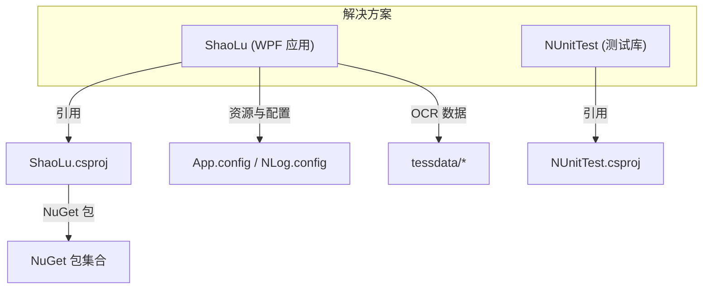
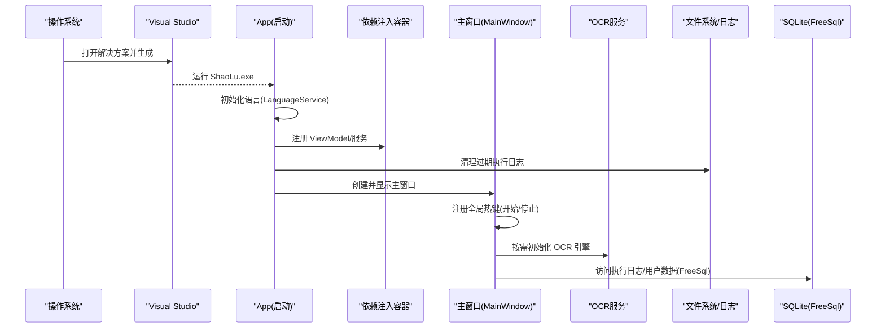
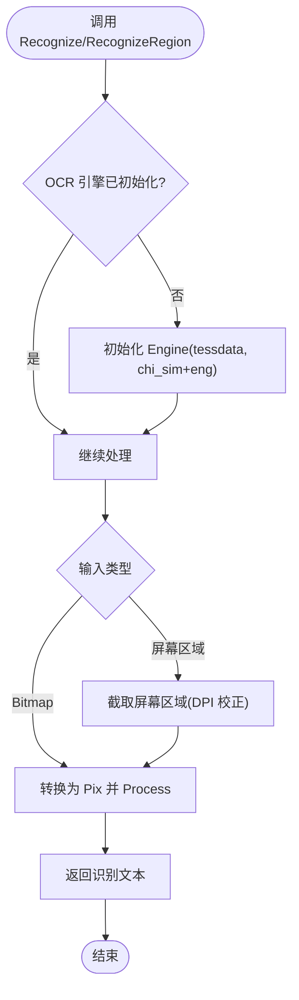
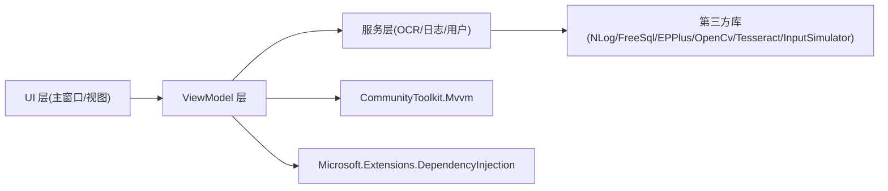

# 环境搭建

<cite>
**本文引用的文件**   
- [ShaoLu.csproj](file://ShaoLu/ShaoLu.csproj)
- [App.config](file://ShaoLu/App.config)
- [NLog.config](file://ShaoLu/NLog.config)
- [App.xaml.cs](file://ShaoLu/App.xaml.cs)
- [MainWindow.xaml.cs](file://ShaoLu/MainWindow.xaml.cs)
- [OCRService.cs](file://ShaoLu/services/OCRService.cs)
- [Autogui.cs](file://ShaoLu/Utils/Autogui.cs)
- [ExecutionLogService.cs](file://ShaoLu/services/ExecutionLogService.cs)
- [UserService.cs](file://ShaoLu/services/UserService.cs)
- [LanguageService.cs](file://ShaoLu/services/LanguageService.cs)
- [NUnitTest.csproj](file://NUnitTest/NUnitTest.csproj)
- [ShaoLu.slnx](file://ShaoLu.slnx)
- [Readme.md](file://Readme.md)
</cite>

## 目录
1. [简介](#简介)
2. [项目结构](#项目结构)
3. [核心组件](#核心组件)
4. [架构总览](#架构总览)
5. [详细组件分析](#详细组件分析)
6. [依赖分析](#依赖分析)
7. [性能考虑](#性能考虑)
8. [故障排查指南](#故障排查指南)
9. [结论](#结论)
10. [附录](#附录)

## 简介
本指南面向首次接触 ShaoLu（自动化烧录）项目的开发者，提供完整的环境搭建说明。内容涵盖：
- 开发环境与系统要求（Visual Studio、.NET Framework 4.8、Windows）
- NuGet 包与本地依赖安装（OpenCvSharp4、TesseractOCR、InputSimulator、EPPlus、NLog、FreeSql 等）
- 项目文件结构与编译配置（.csproj、App.config、NLog.config）
- 常见环境问题定位与解决（依赖冲突、路径问题、运行时库缺失）
- 推荐开发工具与调试配置建议

## 项目结构
ShaoLu 是一个基于 WPF 的桌面应用，采用 .NET Framework 4.8，使用 Visual Studio 进行开发与构建。解决方案包含主程序与单元测试两个工程，默认以 x64 平台为目标。

图表来源
- [ShaoLu.slnx:1-11](file://ShaoLu.slnx#L1-L11)
- [ShaoLu.csproj:1-433](file://ShaoLu/ShaoLu.csproj#L1-L433)
- [NUnitTest.csproj:1-72](file://NUnitTest/NUnitTest.csproj#L1-L72)

章节来源
- [ShaoLu.slnx:1-11](file://ShaoLu.slnx#L1-L11)
- [ShaoLu.csproj:1-433](file://ShaoLu/ShaoLu.csproj#L1-L433)
- [NUnitTest.csproj:1-72](file://NUnitTest/NUnitTest.csproj#L1-L72)

## 核心组件
- 启动与初始化：App.xaml.cs 负责语言初始化、依赖注入容器构建、Excel 许可设置、日志清理以及主窗口显示。
- 主界面与热键：MainWindow.xaml.cs 注册全局热键（开始/停止），处理输入校验、语言切换、文件操作与登录状态管理。
- OCR 服务：OCRService.cs 封装 TesseractOCR 引擎，懒加载初始化，支持位图识别与屏幕区域识别。
- 自动化控制：Autogui.cs 集成 OpenCvSharp4 图像匹配与 InputSimulator 模拟输入。
- 日志与持久化：NLog.config 定义日志输出；ExecutionLogService.cs 与 UserService.cs 通过 FreeSql + SQLite 存储执行日志与用户信息。
- 多语言：LanguageService.cs 基于 WPFLocalizeExtension 实现语言切换与持久化。

章节来源
- [App.xaml.cs:1-86](file://ShaoLu/App.xaml.cs#L1-L86)
- [MainWindow.xaml.cs:1-316](file://ShaoLu/MainWindow.xaml.cs#L1-L316)
- [OCRService.cs:1-133](file://ShaoLu/services/OCRService.cs#L1-L133)
- [Autogui.cs:1-54](file://ShaoLu/Utils/Autogui.cs#L1-L54)
- [ExecutionLogService.cs:1-41](file://ShaoLu/services/ExecutionLogService.cs#L1-L41)
- [UserService.cs:1-43](file://ShaoLu/services/UserService.cs#L1-L43)
- [LanguageService.cs:1-43](file://ShaoLu/services/LanguageService.cs#L1-L43)

## 架构总览
下图展示了应用启动到关键服务初始化的调用链，以及 OCR、输入模拟、日志与数据库的交互关系。

图表来源
- [App.xaml.cs:1-86](file://ShaoLu/App.xaml.cs#L1-L86)
- [MainWindow.xaml.cs:1-316](file://ShaoLu/MainWindow.xaml.cs#L1-L316)
- [OCRService.cs:1-133](file://ShaoLu/services/OCRService.cs#L1-L133)
- [ExecutionLogService.cs:1-41](file://ShaoLu/services/ExecutionLogService.cs#L1-L41)
- [UserService.cs:1-43](file://ShaoLu/services/UserService.cs#L1-L43)

## 详细组件分析

### 开发环境与系统要求
- 操作系统：Windows（x64 优先）
- IDE：Visual Studio 2019 或 2022（需启用 .NET 桌面开发工作负载）
- 框架目标：.NET Framework 4.8（App.config 与 .csproj 均指定 v4.8）
- 平台目标：x64（解决方案与项目均设置为 x64）

章节来源
- [App.config:1-6](file://ShaoLu/App.config#L1-L6)
- [ShaoLu.csproj:27-41](file://ShaoLu/ShaoLu.csproj#L27-L41)
- [ShaoLu.slnx:1-11](file://ShaoLu.slnx#L1-L11)

### NuGet 包与依赖安装
- 图像识别与处理：OpenCvSharp4.Extensions、OpenCvSharp4.runtime.win.slim
- OCR：TesseractOCR（版本 5.5.2，排除 compile/runtime 资产，需配合 tessdata）
- 输入模拟：InputSimulator
- Excel 读写：EPPlus（需在启动时设置非商业许可）
- 日志：NLog 与 NLog.Schema
- ORM：FreeSql.Provider.Sqlite
- 其他：CommunityToolkit.Mvvm、Microsoft.Extensions.Logging、System.Drawing.Common、System.Reactive、System.Text.Json、UTF.Unknown、WPFLocalizeExtension

安装方式：
- 在 Visual Studio 中打开解决方案后，还原 NuGet 包即可自动下载上述依赖。
- 若离线环境，请提前准备 nuget 包缓存或使用 -NoCache 参数恢复。

章节来源
- [ShaoLu.csproj:358-401](file://ShaoLu/ShaoLu.csproj#L358-L401)
- [App.xaml.cs:49-50](file://ShaoLu/App.xaml.cs#L49-L50)

### 项目文件结构与编译配置
- .csproj 关键点
  - TargetFrameworkVersion=v4.8，OutputType=WinExe，PlatformTarget=x64
  - RuntimeIdentifiers=win-x64
  - LangVersion=preview（启用预览 C# 特性）
  - AutoGenerateBindingRedirects=true（自动绑定重定向）
  - 打包发布相关属性（InstallFrom、UpdateUrl 等）
- App.config
  - 指定支持的运行时版本为 v4.8
- NLog.config
  - 异步写入文件与控制台，按日期命名日志文件
- tessdata
  - 将 OCR 语言数据复制到输出目录，供 OCR 引擎读取

章节来源
- [ShaoLu.csproj:4-41](file://ShaoLu/ShaoLu.csproj#L4-L41)
- [ShaoLu.csproj:101-129](file://ShaoLu/ShaoLu.csproj#L101-L129)
- [ShaoLu.csproj:345-356](file://ShaoLu/ShaoLu.csproj#L345-L356)
- [ShaoLu.csproj:420-423](file://ShaoLu/ShaoLu.csproj#L420-L423)
- [App.config:1-6](file://ShaoLu/App.config#L1-L6)
- [NLog.config:1-20](file://ShaoLu/NLog.config#L1-L20)

### 启动流程与服务初始化
- 应用启动顺序
  - 初始化语言（LanguageService.Initialize）
  - 构建依赖注入容器（注册 MainViewModel、StepsViewModel、FileServices、IUserService 等）
  - 设置 EPPlus 许可
  - 清理过期执行日志
  - 显示主窗口（MainWindow）
- 主窗口职责
  - 注册全局热键（开始/停止）
  - 处理输入校验、语言切换、文件打开/保存、登录状态管理

章节来源
- [App.xaml.cs:18-65](file://ShaoLu/App.xaml.cs#L18-L65)
- [MainWindow.xaml.cs:32-74](file://ShaoLu/MainWindow.xaml.cs#L32-L74)

### OCR 服务与数据路径
- OCR 引擎懒加载初始化，tessdata 路径位于应用程序基目录下的 tessdata 文件夹
- 支持位图识别与屏幕区域识别（考虑 DPI 缩放）
- 异常记录至 NLog

图表来源
- [OCRService.cs:21-43](file://ShaoLu/services/OCRService.cs#L21-L43)
- [OCRService.cs:45-75](file://ShaoLu/services/OCRService.cs#L45-L75)
- [OCRService.cs:82-118](file://ShaoLu/services/OCRService.cs#L82-L118)

章节来源
- [OCRService.cs:1-133](file://ShaoLu/services/OCRService.cs#L1-L133)

### 自动化控制（图像匹配与输入模拟）
- Autogui 类封装了屏幕截图、模板匹配（OpenCvSharp4）、点击与键盘输入（InputSimulator）
- 支持多种点击位置策略（中心、四角等）

章节来源
- [Autogui.cs:1-54](file://ShaoLu/Utils/Autogui.cs#L1-L54)

### 日志与数据库
- 日志：NLog 异步写入 logs 目录，文件名按日期命名，同时输出控制台
- 执行日志：ExecutionLogService 使用 FreeSql + SQLite 存储步骤执行历史
- 用户服务：UserService 使用 FreeSql + SQLite 管理用户信息与角色

章节来源
- [NLog.config:1-20](file://ShaoLu/NLog.config#L1-L20)
- [ExecutionLogService.cs:1-41](file://ShaoLu/services/ExecutionLogService.cs#L1-L41)
- [UserService.cs:1-43](file://ShaoLu/services/UserService.cs#L1-L43)

### 单元测试工程
- NUnitTest 工程引用主工程，用于验证模型、转换器、上下文等逻辑
- 使用 NUnit 框架与适配器

章节来源
- [NUnitTest.csproj:1-72](file://NUnitTest/NUnitTest.csproj#L1-L72)

## 依赖分析
- 直接依赖
  - OpenCvSharp4.Extensions、OpenCvSharp4.runtime.win.slim（图像处理）
  - TesseractOCR（OCR 引擎）
  - InputSimulator（输入模拟）
  - EPPlus（Excel 读写）
  - NLog（日志）
  - FreeSql.Provider.Sqlite（ORM）
  - CommunityToolkit.Mvvm、Microsoft.Extensions.DependencyInjection（MVVM 与 DI）
  - System.Drawing.Common、System.Reactive、System.Text.Json、UTF.Unknown、WPFLocalizeExtension（辅助库）
- 间接依赖
  - Microsoft.Extensions.Logging（日志抽象）
  - TesseractOCR 的 native 运行时由 runtime.win 包提供
- 耦合与内聚
  - 服务层（OCRService、ExecutionLogService、UserService）相对独立，通过接口与单例/静态方法暴露能力
  - UI 层（MainWindow、Views）通过依赖注入获取 ViewModel 与服务实例

图表来源
- [ShaoLu.csproj:358-401](file://ShaoLu/ShaoLu.csproj#L358-L401)
- [App.xaml.cs:33-47](file://ShaoLu/App.xaml.cs#L33-L47)

章节来源
- [ShaoLu.csproj:358-401](file://ShaoLu/ShaoLu.csproj#L358-L401)
- [App.xaml.cs:33-47](file://ShaoLu/App.xaml.cs#L33-L47)

## 性能考虑
- OCR 引擎懒加载：避免启动时开销，首次调用才初始化
- 日志异步写入：减少 I/O 阻塞
- 图像匹配阈值可调：合理设置相似度阈值可提升匹配速度与准确率
- 内存管理：OCR 识别过程中使用 MemoryStream 与 using 释放资源
- 数据库自动建表：FreeSql 自动同步结构，简化部署但可能带来首次写入开销

[本节为通用指导，不直接分析具体文件]

## 故障排查指南
- 无法找到 .NET Framework 4.8
  - 确认系统已安装 .NET Framework 4.8，且 App.config 与 .csproj 目标一致
- TesseractOCR 初始化失败
  - 检查输出目录下是否存在 tessdata 文件夹及语言数据文件
  - 查看 NLog 日志中的错误信息
- OpenCvSharp4 运行时缺失
  - 确保安装了 OpenCvSharp4.runtime.win.slim 包，且平台目标为 x64
- EPPlus 许可未设置
  - 在应用启动时设置非商业许可（代码中已设置）
- 输入模拟无效
  - 检查 InputSimulator 是否被正确初始化，确认焦点窗口权限
- 数据库文件权限问题
  - 确保 ApplicationData 目录可写，FreeSql 会自动创建目录与数据库文件
- 语言切换无效
  - 检查 current_language.txt 文件是否可写，确认语言代码有效

章节来源
- [OCRService.cs:21-43](file://ShaoLu/services/OCRService.cs#L21-L43)
- [NLog.config:1-20](file://ShaoLu/NLog.config#L1-L20)
- [ExecutionLogService.cs:1-41](file://ShaoLu/services/ExecutionLogService.cs#L1-L41)
- [UserService.cs:1-43](file://ShaoLu/services/UserService.cs#L1-L43)
- [LanguageService.cs:1-43](file://ShaoLu/services/LanguageService.cs#L1-L43)
- [App.xaml.cs:49-50](file://ShaoLu/App.xaml.cs#L49-L50)

## 结论
按照本指南完成环境搭建后，可在 Visual Studio 中直接打开解决方案并生成运行。重点确保：
- 正确的 .NET Framework 4.8 与 x64 平台目标
- NuGet 包完整还原
- tessdata 目录存在且可读
- 日志与数据库目录具备写入权限

## 附录
- 快速开始参考：Readme.md 提供了功能概览与快捷键说明
- 解决方案配置：ShaoLu.slnx 定义了 Any CPU 与 x64 两种平台配置

章节来源
- [Readme.md:1-283](file://Readme.md#L1-L283)
- [ShaoLu.slnx:1-11](file://ShaoLu.slnx#L1-L11)