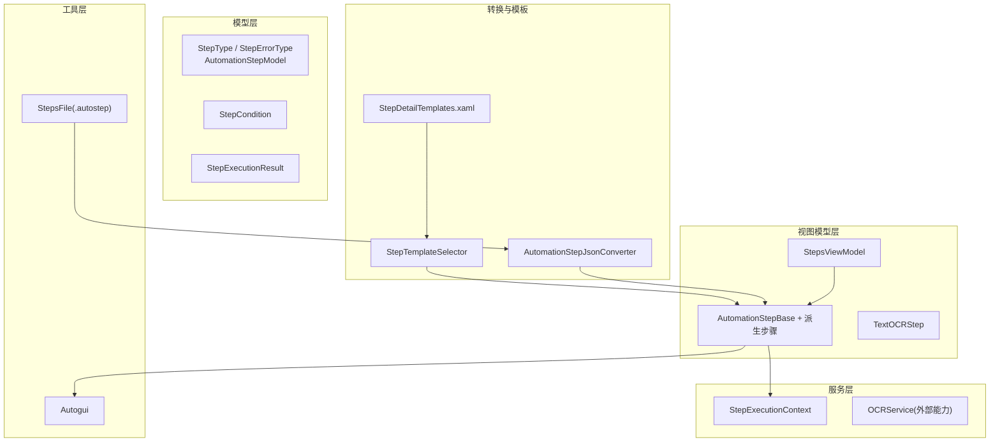
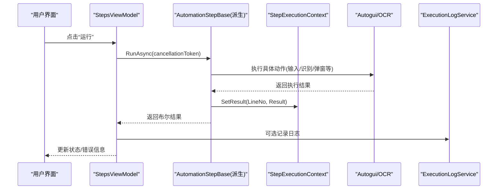
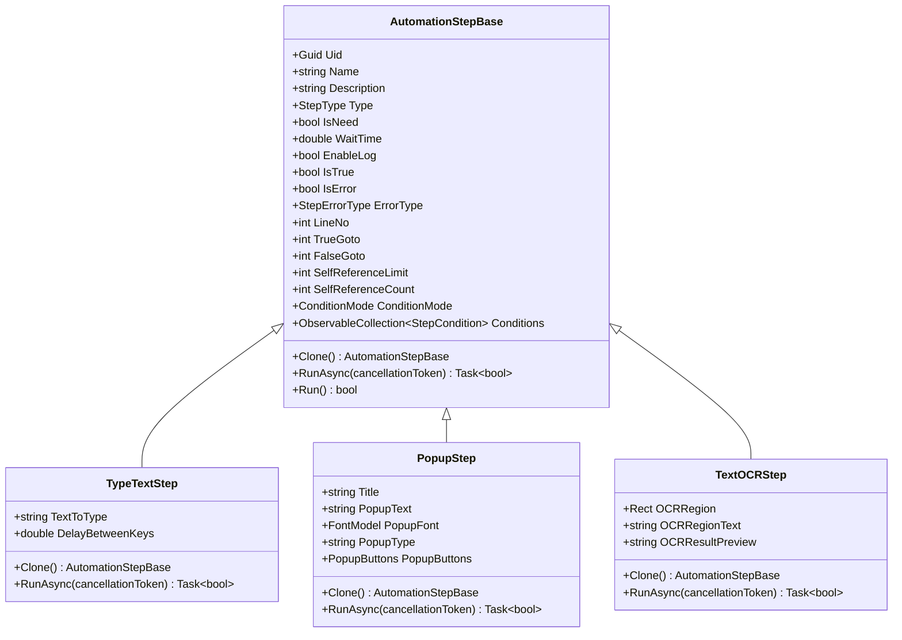
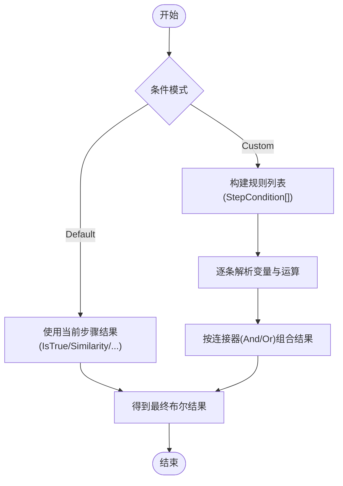
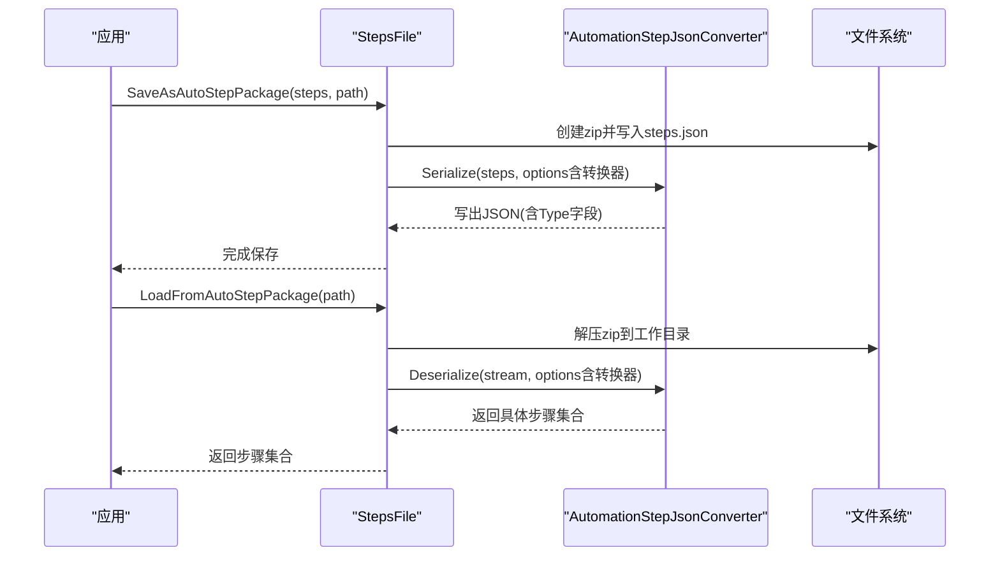
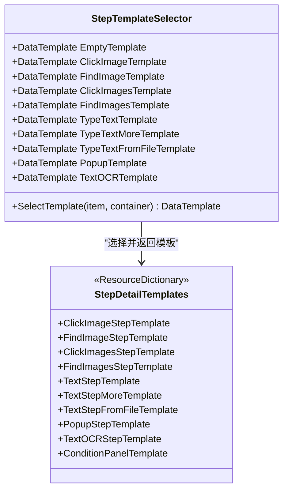
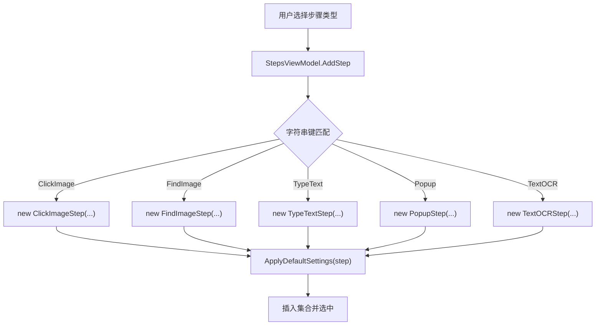
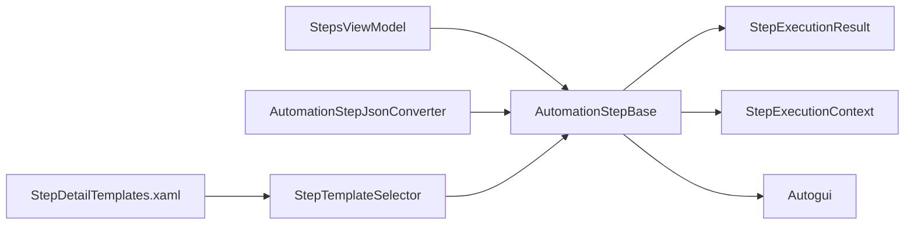

# 自定义步骤开发

<cite>
**本文引用的文件**   
- [AutomationStep.cs](file://ShaoLu/Viewmodels/AutomationStep.cs)
- [StepCondition.cs](file://ShaoLu/Models/StepCondition.cs)
- [StepExecutionResult.cs](file://ShaoLu/Models/StepExecutionResult.cs)
- [AutomationStepModel.cs](file://ShaoLu/Models/AutomationStepModel.cs)
- [StepExecutionContext.cs](file://ShaoLu/Services/StepExecutionContext.cs)
- [AutomationStepJsonConverter.cs](file://ShaoLu/Converters/AutomationStepJsonConverter.cs)
- [StepsFile.cs](file://ShaoLu/Utils/StepsFile.cs)
- [StepTemplateSelector.cs](file://ShaoLu/Converters/StepTemplateSelector.cs)
- [StepDetailTemplates.xaml](file://ShaoLu/Templates/StepDetailTemplates.xaml)
- [StepsViewModel.cs](file://ShaoLu/Viewmodels/StepsViewModel.cs)
- [Autogui.cs](file://ShaoLu/Utils/Autogui.cs)
- [TextOCRStep.cs](file://ShaoLu/Viewmodels/TextOCRStep.cs)
</cite>

## 目录
1. [简介](#简介)
2. [项目结构](#项目结构)
3. [核心组件](#核心组件)
4. [架构总览](#架构总览)
5. [详细组件分析](#详细组件分析)
6. [依赖关系分析](#依赖关系分析)
7. [性能考量](#性能考量)
8. [故障排查指南](#故障排查指南)
9. [结论](#结论)
10. [附录](#附录)

## 简介
本指南面向希望基于现有框架扩展“自动化步骤”的开发者。内容围绕 AutomationStepBase 基类的设计与使用，涵盖步骤生命周期、参数配置、执行上下文、序列化机制、UI 模板开发、注册与发现机制（插件式），并提供完整的自定义步骤实现示例与调试技巧。读者无需深入底层即可快速上手，同时为高级定制提供足够的扩展点。

## 项目结构
本项目采用分层组织：模型层定义枚举与数据结构；服务层提供执行上下文与 OCR 等能力；视图模型层封装步骤实例与命令；转换器负责 JSON 多态序列化与 UI 模板选择；模板资源定义各步骤的编辑界面；工具层封装屏幕操作与文件打包。

图表来源
- [AutomationStep.cs:25-205](file://ShaoLu/Viewmodels/AutomationStep.cs#L25-L205)
- [StepCondition.cs:1-122](file://ShaoLu/Models/StepCondition.cs#L1-L122)
- [StepExecutionResult.cs:1-46](file://ShaoLu/Models/StepExecutionResult.cs#L1-L46)
- [StepExecutionContext.cs:1-88](file://ShaoLu/Services/StepExecutionContext.cs#L1-L88)
- [AutomationStepJsonConverter.cs:1-119](file://ShaoLu/Converters/AutomationStepJsonConverter.cs#L1-L119)
- [StepsFile.cs:1-217](file://ShaoLu/Utils/StepsFile.cs#L1-L217)
- [StepTemplateSelector.cs:1-44](file://ShaoLu/Converters/StepTemplateSelector.cs#L1-L44)
- [StepDetailTemplates.xaml:1-608](file://ShaoLu/Templates/StepDetailTemplates.xaml#L1-L608)
- [StepsViewModel.cs:1-239](file://ShaoLu/Viewmodels/StepsViewModel.cs#L1-L239)
- [Autogui.cs:1-200](file://ShaoLu/Utils/Autogui.cs#L1-L200)

章节来源
- [AutomationStep.cs:25-205](file://ShaoLu/Viewmodels/AutomationStep.cs#L25-L205)
- [StepsViewModel.cs:114-239](file://ShaoLu/Viewmodels/StepsViewModel.cs#L114-L239)

## 核心组件
- 步骤基类与派生步骤
  - 基类提供通用属性（名称、描述、类型、等待时间、错误状态、条件模式、日志开关等）、唯一标识、克隆与异步执行接口。
  - 派生步骤实现具体业务逻辑（如输入文本、查找图像、弹出框、OCR 等）。
- 执行上下文
  - 维护每个步骤行号的执行结果，支持在条件判断中引用当前或历史步骤的结果。
- JSON 多态序列化
  - 通过自定义转换器根据 Type 字段反序列化为具体步骤类型，并完整保留派生类属性。
- UI 模板与模板选择器
  - 针对每种步骤类型定义 XAML 模板，并通过 DataTemplateSelector 按步骤类型动态绑定。
- 步骤注册与发现
  - 通过 StepsViewModel 的工厂映射将字符串键创建为具体步骤实例，便于扩展新步骤类型。

章节来源
- [AutomationStep.cs:25-205](file://ShaoLu/Viewmodels/AutomationStep.cs#L25-L205)
- [StepExecutionContext.cs:1-88](file://ShaoLu/Services/StepExecutionContext.cs#L1-L88)
- [AutomationStepJsonConverter.cs:1-119](file://ShaoLu/Converters/AutomationStepJsonConverter.cs#L1-L119)
- [StepTemplateSelector.cs:1-44](file://ShaoLu/Converters/StepTemplateSelector.cs#L1-L44)
- [StepsViewModel.cs:170-232](file://ShaoLu/Viewmodels/StepsViewModel.cs#L170-L232)

## 架构总览
下图展示了从 UI 到执行引擎的关键调用链，以及数据流如何贯穿步骤执行与结果记录。

图表来源
- [StepsViewModel.cs:114-239](file://ShaoLu/Viewmodels/StepsViewModel.cs#L114-L239)
- [AutomationStep.cs:25-205](file://ShaoLu/Viewmodels/AutomationStep.cs#L25-L205)
- [StepExecutionContext.cs:1-88](file://ShaoLu/Services/StepExecutionContext.cs#L1-L88)
- [Autogui.cs:1-200](file://ShaoLu/Utils/Autogui.cs#L1-L200)

## 详细组件分析

### 基类与步骤生命周期
- 关键职责
  - 统一属性与通知：名称、描述、类型、等待时间、错误状态、条件模式、日志开关、自引用限制等。
  - 生命周期钩子：构造函数初始化默认值；Clone 用于复制；RunAsync 承载异步执行；Run 同步包装。
  - 条件判断：支持默认模式与自定义规则模式，规则由 StepCondition 列表组成。
- 执行流程要点
  - 等待时间：在执行前进行可取消延迟。
  - 业务执行：在后台线程执行 I/O 密集型任务，避免阻塞 UI。
  - 结果设置：更新 IsTrue、IsError、ErrorType，并在启用日志时写入日志。
  - 异常处理：捕获异常并设置错误状态，保证上层稳定。

图表来源
- [AutomationStep.cs:25-205](file://ShaoLu/Viewmodels/AutomationStep.cs#L25-L205)
- [AutomationStep.cs:209-279](file://ShaoLu/Viewmodels/AutomationStep.cs#L209-L279)
- [AutomationStep.cs:606-752](file://ShaoLu/Viewmodels/AutomationStep.cs#L606-L752)
- [TextOCRStep.cs:1-44](file://ShaoLu/Viewmodels/TextOCRStep.cs#L1-L44)

章节来源
- [AutomationStep.cs:25-205](file://ShaoLu/Viewmodels/AutomationStep.cs#L25-L205)
- [AutomationStep.cs:209-279](file://ShaoLu/Viewmodels/AutomationStep.cs#L209-L279)
- [AutomationStep.cs:606-752](file://ShaoLu/Viewmodels/AutomationStep.cs#L606-L752)
- [TextOCRStep.cs:1-44](file://ShaoLu/Viewmodels/TextOCRStep.cs#L1-L44)

### 执行上下文与条件解析
- 执行上下文
  - 以字典存储每个步骤行号对应的 StepExecutionResult。
  - 提供 SetResult、GetResult、Clear 方法。
  - ResolveVariable 支持常量、当前步骤自身、引用其他步骤的变量解析。
- 条件模型
  - StepCondition 包含变量类型、运算符、比较值、连接器（And/Or）及目标步骤行号。
  - 条件模式支持 Default（使用步骤自身结果）与 Custom（使用自定义规则）。

图表来源
- [StepExecutionContext.cs:1-88](file://ShaoLu/Services/StepExecutionContext.cs#L1-L88)
- [StepCondition.cs:1-122](file://ShaoLu/Models/StepCondition.cs#L1-L122)

章节来源
- [StepExecutionContext.cs:1-88](file://ShaoLu/Services/StepExecutionContext.cs#L1-L88)
- [StepCondition.cs:1-122](file://ShaoLu/Models/StepCondition.cs#L1-L122)

### JSON 序列化与反序列化
- 多态转换器
  - 读取时解析 Type 字段（兼容字符串与数字枚举），映射到具体步骤类型，再反序列化为该类型对象。
  - 写入时获取实际运行时类型，直接序列化具体对象，确保派生类属性完整输出。
- 文件打包
  - .autostep 压缩包包含 steps.json 与裁剪图片目录，加载时解压工作目录并设置路径。
  - 旧版 JSON 接口仍可用但建议迁移至压缩包格式。

图表来源
- [AutomationStepJsonConverter.cs:1-119](file://ShaoLu/Converters/AutomationStepJsonConverter.cs#L1-L119)
- [StepsFile.cs:40-217](file://ShaoLu/Utils/StepsFile.cs#L40-L217)

章节来源
- [AutomationStepJsonConverter.cs:1-119](file://ShaoLu/Converters/AutomationStepJsonConverter.cs#L1-L119)
- [StepsFile.cs:40-217](file://ShaoLu/Utils/StepsFile.cs#L40-L217)

### UI 模板与数据绑定
- 模板选择器
  - StepTemplateSelector 根据步骤 Type 返回对应 DataTemplate。
- 模板资源
  - StepDetailTemplates.xaml 定义了各类步骤的编辑界面，包括输入文本、图像识别、弹出框、OCR 等。
  - 通用条件面板模板复用，支持条件模式切换与规则行增删。
- 数据绑定
  - 所有属性通过双向绑定更新，命令通过 RelayCommand 触发交互。

图表来源
- [StepTemplateSelector.cs:1-44](file://ShaoLu/Converters/StepTemplateSelector.cs#L1-L44)
- [StepDetailTemplates.xaml:1-608](file://ShaoLu/Templates/StepDetailTemplates.xaml#L1-L608)

章节来源
- [StepTemplateSelector.cs:1-44](file://ShaoLu/Converters/StepTemplateSelector.cs#L1-L44)
- [StepDetailTemplates.xaml:1-608](file://ShaoLu/Templates/StepDetailTemplates.xaml#L1-L608)

### 步骤注册与发现（插件式扩展）
- 注册方式
  - StepsViewModel.AddStep 通过字符串键映射到具体步骤构造，新增步骤只需在此处添加映射。
- 默认参数应用
  - ApplyDefaultSettings 根据步骤类型应用默认阈值、超时、点击次数等参数。
- 扩展建议
  - 新增步骤类型时，同步更新模板选择器与模板资源，确保 UI 能正确渲染。

图表来源
- [StepsViewModel.cs:170-232](file://ShaoLu/Viewmodels/StepsViewModel.cs#L170-L232)

章节来源
- [StepsViewModel.cs:170-232](file://ShaoLu/Viewmodels/StepsViewModel.cs#L170-L232)

### 自定义步骤实现指南
- 继承基类
  - 新建类继承 AutomationStepBase，设置 Type 与必要属性。
- 实现 Clone
  - 深拷贝所有需要持久化的属性，确保独立副本。
- 实现 RunAsync
  - 遵循等待时间、后台执行、结果设置、日志记录的顺序。
  - 正确处理 CancellationToken，支持取消。
  - 捕获异常并设置 IsError/ErrorType，避免崩溃。
- 添加 UI 模板
  - 在 StepDetailTemplates.xaml 中添加 DataTemplate，并在 StepTemplateSelector 中注册。
- 注册步骤
  - 在 StepsViewModel.AddStep 的映射中添加新类型键。

章节来源
- [AutomationStep.cs:25-205](file://ShaoLu/Viewmodels/AutomationStep.cs#L25-L205)
- [StepDetailTemplates.xaml:1-608](file://ShaoLu/Templates/StepDetailTemplates.xaml#L1-L608)
- [StepTemplateSelector.cs:1-44](file://ShaoLu/Converters/StepTemplateSelector.cs#L1-L44)
- [StepsViewModel.cs:170-232](file://ShaoLu/Viewmodels/StepsViewModel.cs#L170-L232)

## 依赖关系分析
- 低耦合高内聚
  - 步骤基类仅依赖模型与服务接口，不直接耦合 UI。
  - 执行上下文独立管理结果，供条件解析使用。
- 外部依赖
  - Autogui 封装屏幕截图、鼠标键盘操作与图像匹配。
  - OCR 能力通过服务层注入。
- 潜在循环依赖
  - 转换器与步骤类型存在映射关系，但无反向依赖，保持单向。

图表来源
- [AutomationStep.cs:25-205](file://ShaoLu/Viewmodels/AutomationStep.cs#L25-L205)
- [StepExecutionResult.cs:1-46](file://ShaoLu/Models/StepExecutionResult.cs#L1-L46)
- [StepExecutionContext.cs:1-88](file://ShaoLu/Services/StepExecutionContext.cs#L1-L88)
- [Autogui.cs:1-200](file://ShaoLu/Utils/Autogui.cs#L1-L200)
- [StepsViewModel.cs:114-239](file://ShaoLu/Viewmodels/StepsViewModel.cs#L114-L239)
- [AutomationStepJsonConverter.cs:1-119](file://ShaoLu/Converters/AutomationStepJsonConverter.cs#L1-L119)
- [StepTemplateSelector.cs:1-44](file://ShaoLu/Converters/StepTemplateSelector.cs#L1-L44)
- [StepDetailTemplates.xaml:1-608](file://ShaoLu/Templates/StepDetailTemplates.xaml#L1-L608)

章节来源
- [AutomationStep.cs:25-205](file://ShaoLu/Viewmodels/AutomationStep.cs#L25-L205)
- [StepsViewModel.cs:114-239](file://ShaoLu/Viewmodels/StepsViewModel.cs#L114-L239)

## 性能考量
- 异步与取消
  - 所有耗时操作使用异步与取消令牌，避免 UI 卡顿与资源泄漏。
- 批量与缓存
  - 图像匹配尽量复用 Mat 对象，减少重复转换。
  - 序列化选项缓存，避免重复创建。
- 虚拟化与回收
  - 大列表使用 VirtualizingStackPanel 提升 UI 性能。
- 内存管理
  - 及时释放 Bitmap/Mat 等资源，避免内存峰值过高。

[本节为通用指导，不直接分析具体文件]

## 故障排查指南
- 常见问题
  - 步骤未找到图像：检查阈值与超时设置，确认图像路径与分辨率。
  - 条件解析失败：核对变量类型与运算符，确保 StepLineNo 正确。
  - JSON 反序列化异常：确认 Type 字段存在且值有效，映射表是否覆盖新类型。
- 定位手段
  - 启用步骤日志，查看执行时间与输入内容。
  - 使用单元测试验证上下文解析与步骤克隆行为。
  - 检查 UI 模板是否正确绑定，命令是否触发。

章节来源
- [StepExecutionContext.cs:1-88](file://ShaoLu/Services/StepExecutionContext.cs#L1-L88)
- [AutomationStepJsonConverter.cs:1-119](file://ShaoLu/Converters/AutomationStepJsonConverter.cs#L1-L119)
- [StepsFile.cs:40-217](file://ShaoLu/Utils/StepsFile.cs#L40-L217)

## 结论
通过统一的基类设计、清晰的执行上下文、健壮的序列化机制与灵活的 UI 模板系统，本项目提供了完善的自定义步骤开发框架。开发者只需关注具体业务逻辑实现，即可快速扩展新的自动化步骤，并保持与现有系统的无缝集成。

[本节为总结性内容，不直接分析具体文件]

## 附录
- 最佳实践
  - 始终实现 Clone 并确保深拷贝。
  - 在 RunAsync 中处理取消与异常，设置错误状态。
  - 为新步骤类型补充模板与注册映射。
- 调试技巧
  - 使用断点观察 IsTrue/IsError/ErrorType 变化。
  - 打印执行上下文中的结果，验证条件解析。
  - 逐步缩小问题范围，先验证基础功能再扩展复杂逻辑。

[本节为补充说明，不直接分析具体文件]