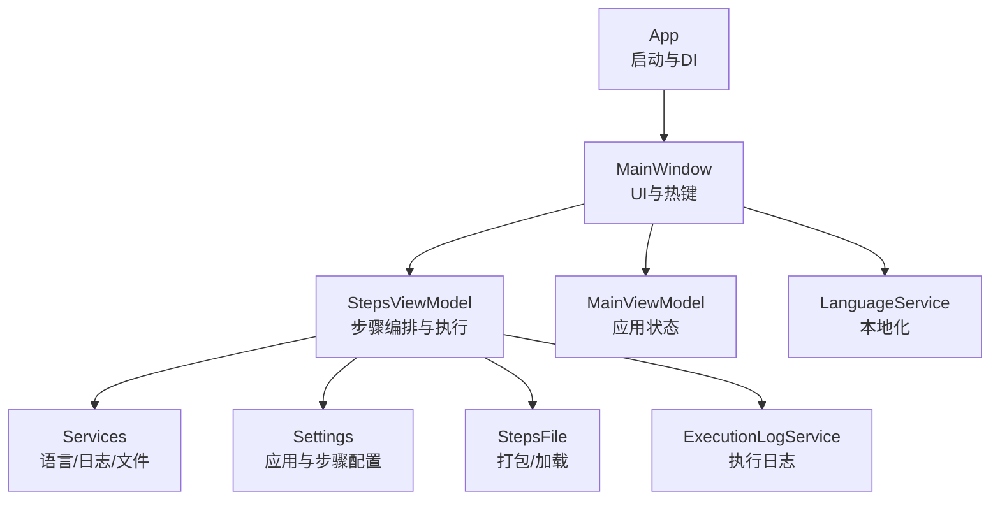
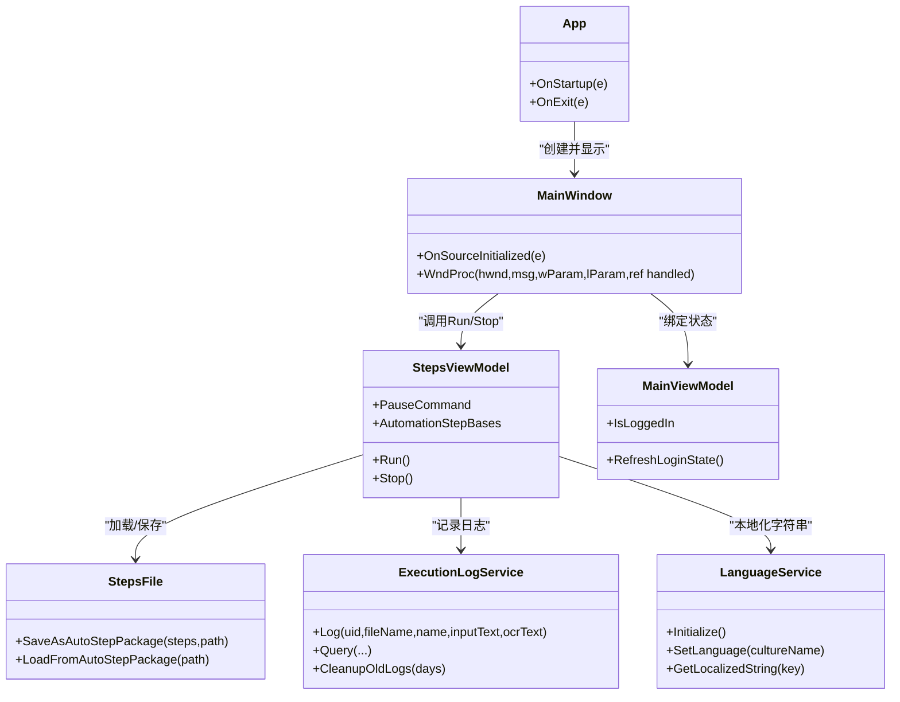
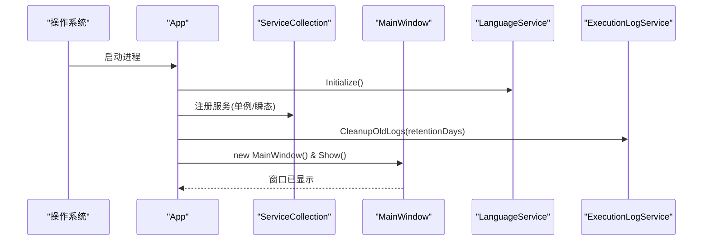
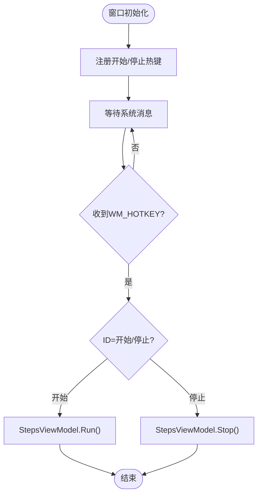
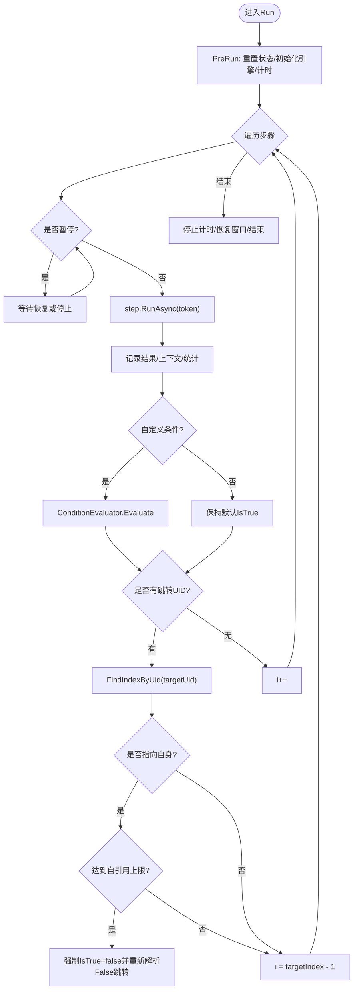
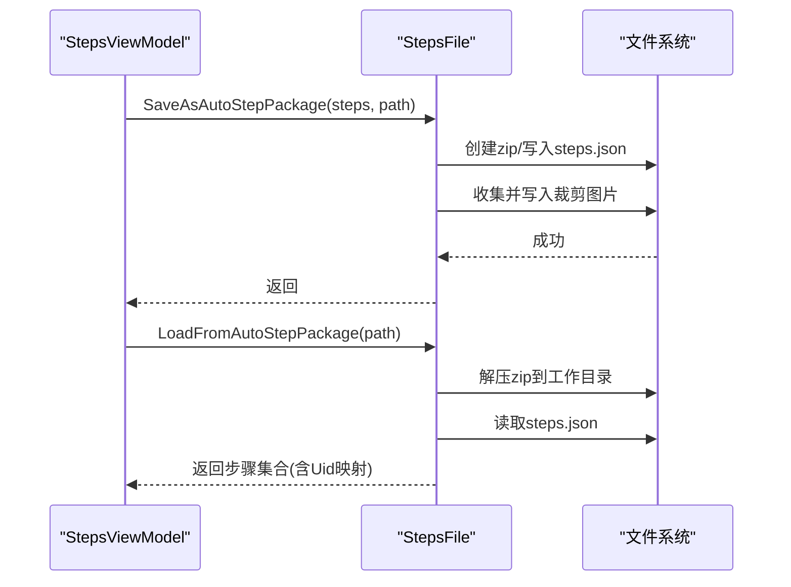
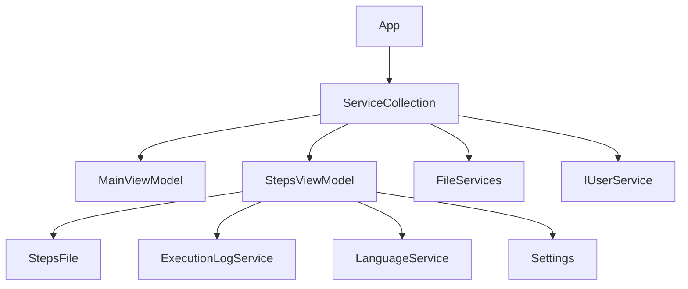

# 开发者指南

<cite>
**本文引用的文件**   
- [Readme.md](file://Readme.md)
- [App.xaml.cs](file://ShaoLu/App.xaml.cs)
- [MainWindow.xaml.cs](file://ShaoLu/MainWindow.xaml.cs)
- [ShaoLu.csproj](file://ShaoLu/ShaoLu.csproj)
- [StepsViewModel.cs](file://ShaoLu/Viewmodels/StepsViewModel.cs)
- [MainViewModel.cs](file://ShaoLu/Viewmodels/MainViewModel.cs)
- [SingletonLocator.cs](file://ShaoLu/Utils/SingletonLocator.cs)
- [Settings.cs](file://ShaoLu/Models/Settings.cs)
- [StepsFile.cs](file://ShaoLu/Utils/StepsFile.cs)
- [ExecutionLogService.cs](file://ShaoLu/services/ExecutionLogService.cs)
- [LanguageService.cs](file://ShaoLu/services/LanguageService.cs)
- [Services.cs](file://ShaoLu/services/Services.cs)
- [NUnitTest.csproj](file://NUnitTest/NUnitTest.csproj)
- [AutomationStepTests.cs](file://NUnitTest/AutomationStepTests.cs)
</cite>

## 目录
1. [简介](#简介)
2. [项目结构](#项目结构)
3. [核心组件](#核心组件)
4. [架构总览](#架构总览)
5. [详细组件分析](#详细组件分析)
6. [依赖关系分析](#依赖关系分析)
7. [性能考虑](#性能考虑)
8. [故障排查指南](#故障排查指南)
9. [结论](#结论)
10. [附录](#附录)

## 简介
本指南面向 ShaoLu（烧录）项目的开发者，覆盖环境搭建、代码规范、开发工作流、新功能扩展、代码审查与版本控制策略、插件与第三方库集成、调试技巧、性能分析与常见问题解决方案，以及贡献代码与社区参与方式。ShaoLu 是一款基于 WPF 的桌面自动化工具，通过图像识别与模拟输入实现 GUI 自动化操作，支持多步骤编排、条件跳转、OCR 文本识别、执行日志与国际化等能力。

## 项目结构
- 应用入口与生命周期：App 启动时完成语言初始化、依赖注入容器配置、全局异常捕获、日志清理、主窗口显示与 DPI 缓存更新。
- 主界面与交互：MainWindow 负责热键注册、登录校验、打开/保存 .autostep 包、设置与用户管理等。
- 视图模型层：MainViewModel 管理应用级状态；StepsViewModel 编排步骤集合、执行流程、暂停/停止、统计与上下文。
- 服务层：LanguageService 提供本地化；ExecutionLogService 持久化执行日志；PathServices/FileServices 提供路径与文件工具。
- 数据与配置：Settings 定义应用与步骤默认值；StepsFile 负责 .autostep 压缩包与 JSON 兼容读写。
- 测试：NUnitTest 使用 NUnit 对步骤类、转换器、上下文等进行单元测试。

**图表来源** 
- [App.xaml.cs:19-91](file://ShaoLu/App.xaml.cs#L19-L91)
- [MainWindow.xaml.cs:34-76](file://ShaoLu/MainWindow.xaml.cs#L34-L76)
- [StepsViewModel.cs:493-694](file://ShaoLu/Viewmodels/StepsViewModel.cs#L493-L694)
- [StepsFile.cs:40-119](file://ShaoLu/Utils/StepsFile.cs#L40-L119)
- [ExecutionLogService.cs:14-55](file://ShaoLu/services/ExecutionLogService.cs#L14-L55)
- [LanguageService.cs:15-40](file://ShaoLu/services/LanguageService.cs#L15-L40)

**章节来源**
- [App.xaml.cs:19-91](file://ShaoLu/App.xaml.cs#L19-L91)
- [MainWindow.xaml.cs:34-76](file://ShaoLu/MainWindow.xaml.cs#L34-L76)
- [ShaoLu.csproj:101-129](file://ShaoLu/ShaoLu.csproj#L101-L129)

## 核心组件
- 应用启动与 DI：在 App.OnStartup 中初始化语言、构建 ServiceCollection、注册单例与瞬态服务、清理过期日志并展示主窗口。
- 主窗口与热键：MainWindow 在 OnSourceInitialized 中注册开始/停止热键，WndProc 处理 WM_HOTKEY 触发运行/停止命令。
- 步骤执行引擎：StepsViewModel.Run 异步执行步骤序列，支持暂停、取消、自引用限制、条件判断、错误处理与统计。
- 步骤序列化：StepsFile 将步骤集保存为 .autostep（zip + steps.json），并兼容旧版 JSON 格式，后处理行号到 Uid 的迁移。
- 执行日志：ExecutionLogService 使用 FreeSql+SQLite 记录步骤执行历史，支持分页查询与按天清理。
- 本地化：LanguageService 读取/设置当前文化，持久化到 current_language.txt，并提供 GetLocalizedString 方法。

**章节来源**
- [App.xaml.cs:45-85](file://ShaoLu/App.xaml.cs#L45-L85)
- [MainWindow.xaml.cs:46-76](file://ShaoLu/MainWindow.xaml.cs#L46-L76)
- [StepsViewModel.cs:493-694](file://ShaoLu/Viewmodels/StepsViewModel.cs#L493-L694)
- [StepsFile.cs:40-119](file://ShaoLu/Utils/StepsFile.cs#L40-L119)
- [ExecutionLogService.cs:34-55](file://ShaoLu/services/ExecutionLogService.cs#L34-L55)
- [LanguageService.cs:15-40](file://ShaoLu/services/LanguageService.cs#L15-L40)

## 架构总览
ShaoLu 采用 MVVM 分层与依赖注入模式：
- 视图层（Views）：WPF XAML 窗口与控件。
- 视图模型层（Viewmodels）：MainViewModel、StepsViewModel 等，承载 UI 状态与业务编排。
- 服务层（Services）：语言、日志、OCR、设置、用户服务等。
- 工具与模型（Utils/Models）：步骤文件、原生方法、设置模型、执行结果等。
- 外部依赖：OpenCV/Tesseract OCR、EPPlus（Excel）、FreeSql（SQLite）、InputSimulator（输入模拟）、NLog（日志）、WPFLocalizeExtension（本地化）。

**图表来源** 
- [App.xaml.cs:19-91](file://ShaoLu/App.xaml.cs#L19-L91)
- [MainWindow.xaml.cs:34-76](file://ShaoLu/MainWindow.xaml.cs#L34-L76)
- [StepsViewModel.cs:493-694](file://ShaoLu/Viewmodels/StepsViewModel.cs#L493-L694)
- [StepsFile.cs:40-119](file://ShaoLu/Utils/StepsFile.cs#L40-L119)
- [ExecutionLogService.cs:34-55](file://ShaoLu/services/ExecutionLogService.cs#L34-L55)
- [LanguageService.cs:15-40](file://ShaoLu/services/LanguageService.cs#L15-L40)

## 详细组件分析

### 应用启动与依赖注入
- 启动流程：初始化语言 → 构建 DI 容器 → 注册 MainViewModel、StepsViewModel、FileServices、IUserService 等 → 清理过期日志 → 显示主窗口 → 应用全局字体 → 更新 DPI。
- 异常兜底：捕获 UI 未处理异常、AppDomain 未处理异常、Task 未观察异常，统一记录日志并提示。

**图表来源** 
- [App.xaml.cs:45-85](file://ShaoLu/App.xaml.cs#L45-L85)
- [LanguageService.cs:15-40](file://ShaoLu/services/LanguageService.cs#L15-L40)
- [ExecutionLogService.cs:161-176](file://ShaoLu/services/ExecutionLogService.cs#L161-L176)

**章节来源**
- [App.xaml.cs:19-91](file://ShaoLu/App.xaml.cs#L19-L91)

### 主窗口与热键机制
- 热键注册：在 OnSourceInitialized 中注销旧热键，注册“开始”和“停止”热键（Ctrl+Alt+F9/F10）。
- 消息处理：WndProc 接收 WM_HOTKEY，根据 ID 调用 StepsViewModel 的 Run/Stop 命令。
- 登录校验：关键操作前通过 EnsureLoggedIn 确保用户已登录，否则弹出登录窗口。

**图表来源** 
- [MainWindow.xaml.cs:46-76](file://ShaoLu/MainWindow.xaml.cs#L46-L76)
- [StepsViewModel.cs:493-549](file://ShaoLu/Viewmodels/StepsViewModel.cs#L493-L549)

**章节来源**
- [MainWindow.xaml.cs:34-76](file://ShaoLu/MainWindow.xaml.cs#L34-L76)

### 步骤执行引擎（StepsViewModel）
- 执行循环：遍历 AutomationStepBases，支持暂停、取消、自引用限制、条件判断、错误处理与统计。
- 上下文：StepExecutionContext 记录当前步骤、结果映射、计时器。
- 结果与日志：每步执行后生成 StepExecutionResult，可选写入执行日志。
- 跳转逻辑：根据 IsTrue 选择 TrueGotoUid/FalseGotoUid，若目标不存在则继续下一步。

**图表来源** 
- [StepsViewModel.cs:493-694](file://ShaoLu/Viewmodels/StepsViewModel.cs#L493-L694)

**章节来源**
- [StepsViewModel.cs:493-694](file://ShaoLu/Viewmodels/StepsViewModel.cs#L493-L694)

### 步骤文件与打包（StepsFile）
- 保存：将步骤集序列化为 steps.json 并压缩进 .autostep，同时收集裁剪图片写入 zip。
- 加载：解压到工作目录，读取 steps.json，反序列化为步骤集合，后处理旧格式行号为 Uid。
- 兼容性：保留 LoadStepsFromJson/SaveStepsToJson 以兼容旧版 JSON 格式。

**图表来源** 
- [StepsFile.cs:40-119](file://ShaoLu/Utils/StepsFile.cs#L40-L119)

**章节来源**
- [StepsFile.cs:40-119](file://ShaoLu/Utils/StepsFile.cs#L40-L119)

### 执行日志（ExecutionLogService）
- 存储：使用 FreeSql 连接 SQLite，自动同步结构，记录步骤 UID、文件名、名称、输入文本、OCR 文本与时间。
- 查询：支持关键字搜索、按文件名/UID/时间范围筛选、排序与分页。
- 清理：根据配置清理超过保留天数的旧日志。

**章节来源**
- [ExecutionLogService.cs:14-55](file://ShaoLu/services/ExecutionLogService.cs#L14-L55)
- [ExecutionLogService.cs:60-107](file://ShaoLu/services/ExecutionLogService.cs#L60-L107)
- [ExecutionLogService.cs:161-176](file://ShaoLu/services/ExecutionLogService.cs#L161-L176)

### 本地化（LanguageService）
- 初始化：优先读取上次保存的语言，否则使用系统语言。
- 设置：设置 LocalizeDictionary 的文化并持久化到 current_language.txt。
- 获取：提供 GetLocalizedString(key/defaultValue) 方法。

**章节来源**
- [LanguageService.cs:15-40](file://ShaoLu/services/LanguageService.cs#L15-L40)
- [LanguageService.cs:45-64](file://ShaoLu/services/LanguageService.cs#L45-L64)

### 路径与文件工具（Services.cs）
- PathServices：封装打开/保存对话框与相对路径计算。
- FileServices：标记待删除文件、提交删除、智能读取文本文件（检测 BOM 与编码）。

**章节来源**
- [Services.cs:11-81](file://ShaoLu/services/Services.cs#L11-L81)
- [Services.cs:83-176](file://ShaoLu/services/Services.cs#L83-L176)

### 配置与默认值（Settings.cs）
- AppSettingsModel：窗口尺寸、字体、日志保留天数。
- StepSettingsModel：错误弹窗、最小化运行、自引用上限、确认运行、覆盖层显示、默认相似度/超时/点击次数、热键设置。
- OverlaySetting：颜色与显示时长。

**章节来源**
- [Settings.cs:20-116](file://ShaoLu/Models/Settings.cs#L20-L116)

### 单例定位器（SingletonLocator.cs）
- 通过 CommunityToolkit.Mvvm.DependencyInjection 获取 MainViewModel、StepsViewModel、FileServices、IUserService 与 Settings。

**章节来源**
- [SingletonLocator.cs:10-16](file://ShaoLu/Utils/SingletonLocator.cs#L10-L16)

### 单元测试（NUnitTest）
- 覆盖步骤类构造、Clone、属性默认值、行为验证等。
- 使用 NUnit 框架，参考 NUnitTest.csproj 与 AutomationStepTests.cs。

**章节来源**
- [NUnitTest.csproj:55-72](file://NUnitTest/NUnitTest.csproj#L55-L72)
- [AutomationStepTests.cs:19-116](file://NUnitTest/AutomationStepTests.cs#L19-L116)

## 依赖关系分析
- 外部库：OpenCvSharp4（图像识别）、TesseractOCR（OCR）、EPPlus（Excel）、FreeSql.Provider.Sqlite（数据库）、InputSimulator（输入模拟）、NLog（日志）、WPFLocalizeExtension（本地化）、CommunityToolkit.Mvvm（MVVM与DI）。
- 内部依赖：App 初始化 DI → MainWindow 依赖 StepsViewModel → StepsViewModel 依赖 StepsFile、ExecutionLogService、LanguageService、Settings。

**图表来源** 
- [App.xaml.cs:53-67](file://ShaoLu/App.xaml.cs#L53-L67)
- [ShaoLu.csproj:402-445](file://ShaoLu/ShaoLu.csproj#L402-L445)

**章节来源**
- [ShaoLu.csproj:402-445](file://ShaoLu/ShaoLu.csproj#L402-L445)

## 性能考虑
- 图像识别：合理裁剪识别区域，提高匹配准确率与速度；调整相似度阈值避免误匹配。
- OCR：后台线程使用 DPI 缓存，减少重复计算；按需启用屏幕覆盖层以减少开销。
- 日志：分页查询与定期清理旧日志，避免数据库膨胀。
- 执行循环：暂停/取消机制避免阻塞；自引用限制防止死循环。
- 文件 I/O：使用 ZipArchive 压缩与流式写入，减少内存占用。

[本节为通用指导，不直接分析具体文件]

## 故障排查指南
- 启动失败：检查 App.OnStartup 中的异常捕获与 NLog 日志；确认依赖项与许可证（如 EPPlus）。
- 热键无效：确认 MainWindow 热键注册成功；检查系统热键冲突。
- 步骤执行异常：查看 StepsViewModel 的错误类型推断与弹窗提示；检查步骤参数与资源路径。
- 日志缺失：确认 ExecutionLogService 数据库路径与权限；检查清理策略。
- 本地化异常：检查 current_language.txt 与文化名称；确认 resx 资源存在。

**章节来源**
- [App.xaml.cs:27-43](file://ShaoLu/App.xaml.cs#L27-L43)
- [MainWindow.xaml.cs:46-76](file://ShaoLu/MainWindow.xaml.cs#L46-L76)
- [StepsViewModel.cs:597-622](file://ShaoLu/Viewmodels/StepsViewModel.cs#L597-L622)
- [ExecutionLogService.cs:161-176](file://ShaoLu/services/ExecutionLogService.cs#L161-L176)
- [LanguageService.cs:27-40](file://ShaoLu/services/LanguageService.cs#L27-L40)

## 结论
ShaoLu 通过清晰的 MVVM 分层、依赖注入与模块化服务，提供了强大的 GUI 自动化能力。开发者可基于现有步骤模板快速扩展新步骤类型，利用 StepsFile 进行步骤包管理，借助 ExecutionLogService 与 LanguageService 提升可维护性与用户体验。遵循本文档的规范与工作流，可有效提升开发效率与代码质量。

[本节为总结性内容，不直接分析具体文件]

## 附录

### 环境搭建
- 开发环境：.NET Framework 4.8、Visual Studio（支持 WPF 与 MSBuild）。
- 依赖安装：NuGet 包已在 ShaoLu.csproj 中声明，还原即可；OCR 语料 tessdata 需复制到输出目录。
- 运行：构建 Release x64，启动 ShaoLu.exe。

**章节来源**
- [ShaoLu.csproj:28-41](file://ShaoLu/ShaoLu.csproj#L28-L41)
- [ShaoLu.csproj:465-489](file://ShaoLu/ShaoLu.csproj#L465-L489)

### 代码规范约定
- 命名：类 PascalCase，字段 camelCase，常量 UPPER_SNAKE_CASE。
- 异常：统一记录 NLog 日志，UI 层通过 WindowAsyncPopup 提示。
- 异步：使用 async/await 与 CancellationTokenSource 支持取消。
- 配置：集中使用 Settings 模型，避免硬编码。

[本节为通用规范，不直接分析具体文件]

### 开发工作流程
- 新增步骤：在 StepsViewModel.AddStep 中注册新类型，实现对应步骤类（继承 AutomationStepBase），并在模板中选择器中注册。
- 测试：编写 NUnit 测试覆盖构造、Clone、默认属性与关键行为。
- 提交：遵循 Git 分支策略，提交前运行测试与静态检查。

**章节来源**
- [StepsViewModel.cs:186-227](file://ShaoLu/Viewmodels/StepsViewModel.cs#L186-L227)
- [AutomationStepTests.cs:19-116](file://NUnitTest/AutomationStepTests.cs#L19-L116)

### 代码审查标准
- 功能正确性：步骤执行逻辑、跳转与条件判断无误。
- 健壮性：异常处理、资源释放、取消信号响应。
- 性能：避免阻塞 UI 线程，合理使用缓存与压缩。
- 可维护性：代码清晰、注释充分、依赖解耦。

[本节为通用标准，不直接分析具体文件]

### 版本控制策略
- 分支：main（稳定）、develop（开发）、feature/*（功能）、hotfix/*（修复）。
- 提交信息：语义化提交（feat/fix/docs/style/refactor/test/chore）。
- 发布：打标签 vX.Y.Z，更新 ApplicationVersion 与 PublishUrl。

**章节来源**
- [ShaoLu.csproj:18-25](file://ShaoLu/ShaoLu.csproj#L18-L25)

### 扩展开发与接口规范
- 步骤基类：AutomationStepBase 提供通用属性（名称、描述、等待时间、跳转 UID、条件、日志开关等）。
- 图像识别基类：ImageRecognitionBase 提供相似度阈值、裁剪图片路径等。
- 多图像识别：ImagesRecognitionBase 支持多图列表。
- 模板选择器：在 Converters/StepTemplateSelector.cs 中注册新步骤的 UI 模板。

**章节来源**
- [StepsViewModel.cs:186-227](file://ShaoLu/Viewmodels/StepsViewModel.cs#L186-L227)

### 插件机制与第三方库集成
- 插件：当前未实现动态插件加载，建议通过 DI 注册新服务或步骤类型。
- 第三方库：在 ShaoLu.csproj 中声明 NuGet 引用，确保运行时依赖可用（如 OpenCvSharp4.runtime.win.slim）。

**章节来源**
- [ShaoLu.csproj:402-445](file://ShaoLu/ShaoLu.csproj#L402-L445)

### 调试技巧
- 日志：查看 NLog 输出与应用事件日志；启用步骤执行日志。
- 断点：在 StepsViewModel.Run 与步骤 RunAsync 处设置断点。
- 覆盖层：启用 ShowFoundImageRegionOnRun/ShowClickPositionOnRun 辅助定位。

**章节来源**
- [ExecutionLogService.cs:34-55](file://ShaoLu/services/ExecutionLogService.cs#L34-L55)
- [Settings.cs:65-75](file://ShaoLu/Models/Settings.cs#L65-L75)

### 常见问题解决方案
- 图像识别失败：检查裁剪区域与相似度阈值；确认图片路径有效。
- OCR 乱码：检查 tessdata 语料与编码检测；尝试切换语言。
- 热键冲突：修改默认热键或解除系统冲突。
- 日志无法写入：检查 ApplicationData 目录权限与磁盘空间。

**章节来源**
- [StepsFile.cs:131-165](file://ShaoLu/Utils/StepsFile.cs#L131-L165)
- [Services.cs:142-176](file://ShaoLu/services/Services.cs#L142-L176)
- [MainWindow.xaml.cs:46-76](file://ShaoLu/MainWindow.xaml.cs#L46-L76)

### 贡献代码与社区参与
- Fork 仓库，创建 feature 分支，提交变更并推送。
- 发起 Pull Request，描述变更内容与测试用例。
- 参与 Issue 讨论与文档改进，遵守贡献者行为准则。

[本节为通用指导，不直接分析具体文件]