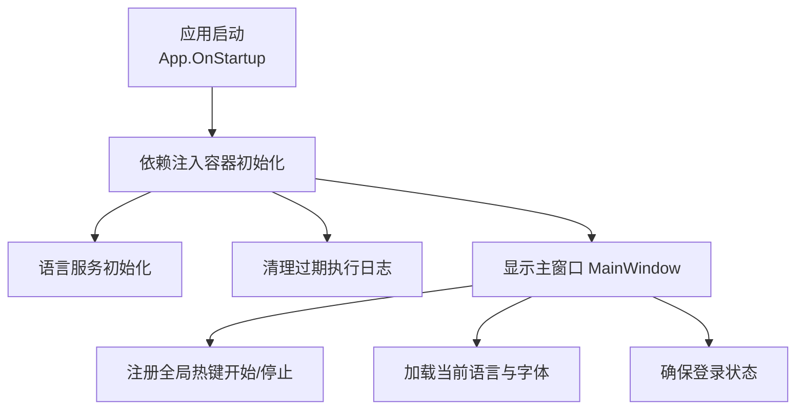
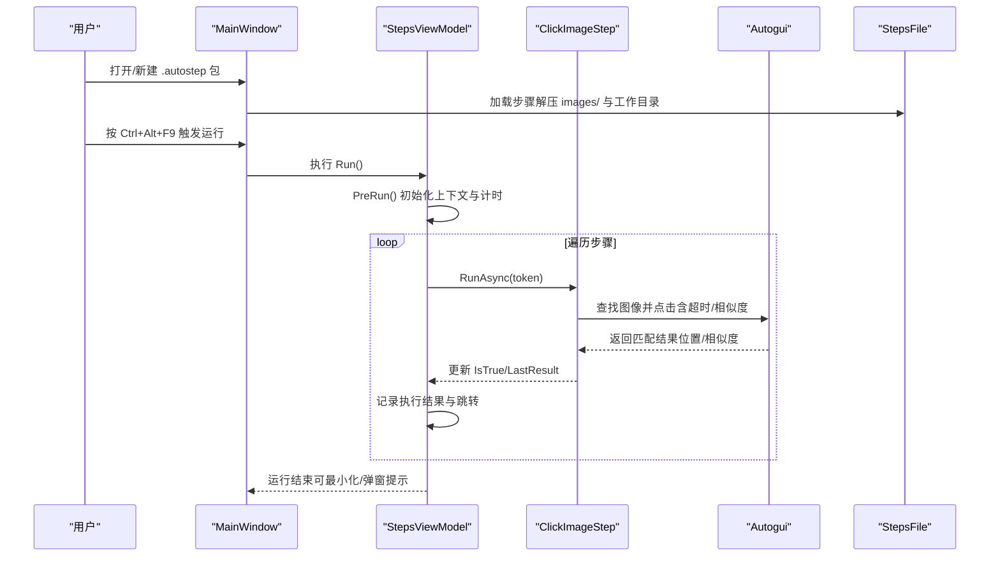
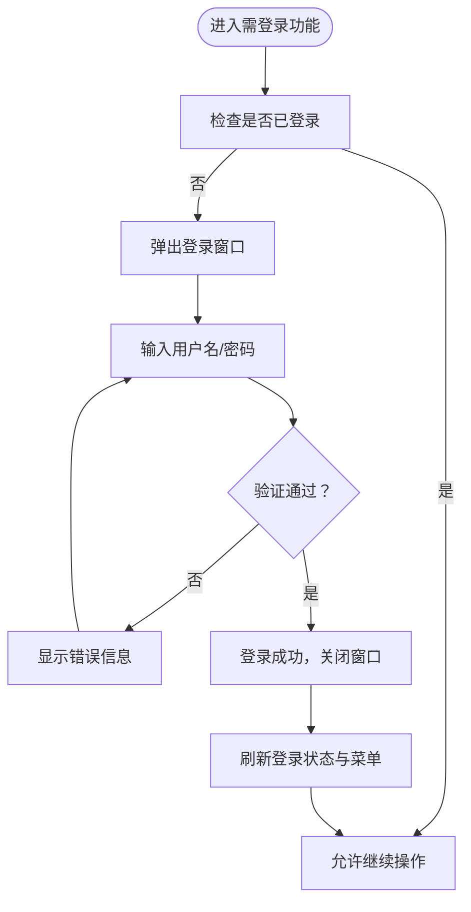
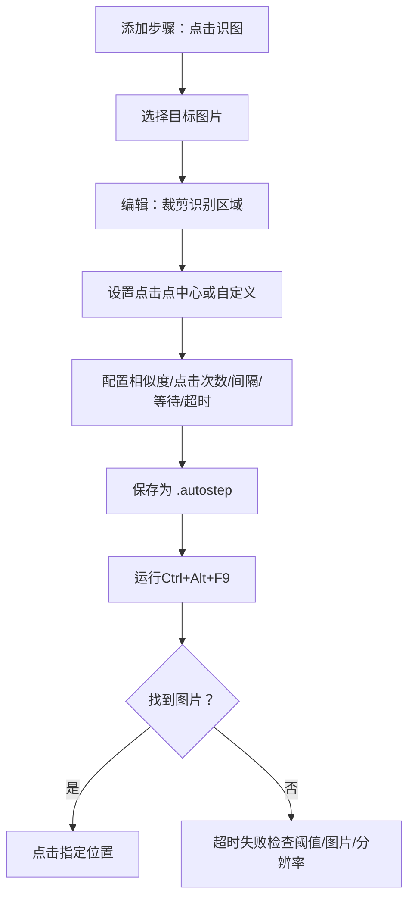
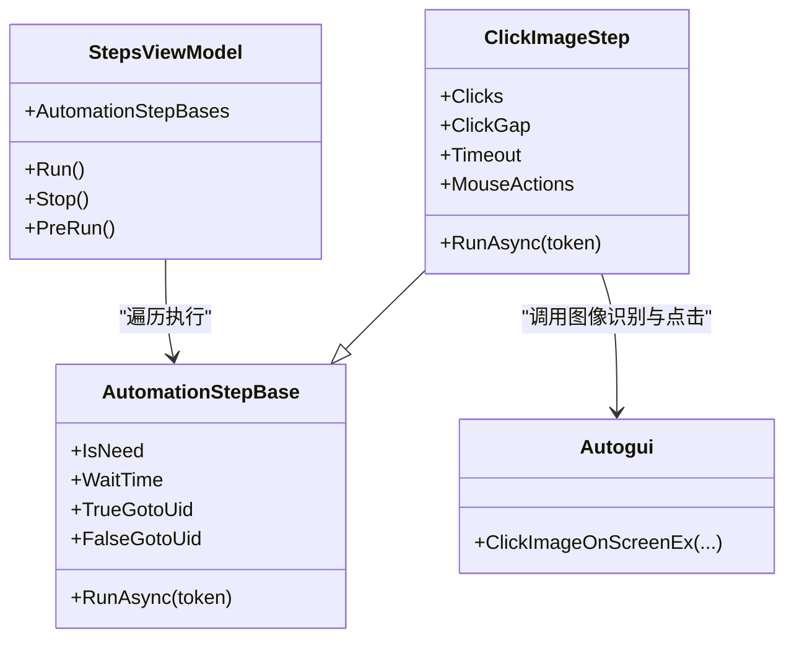
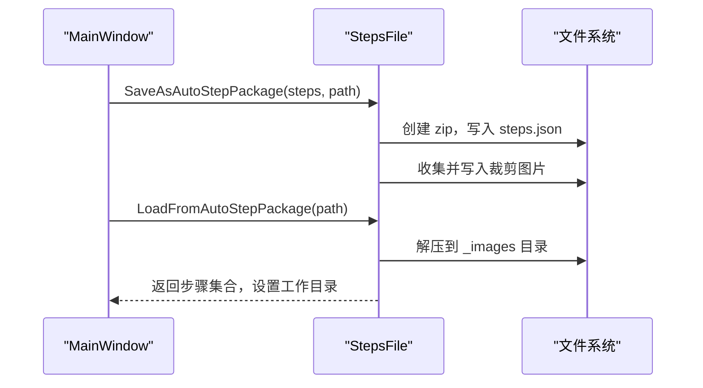
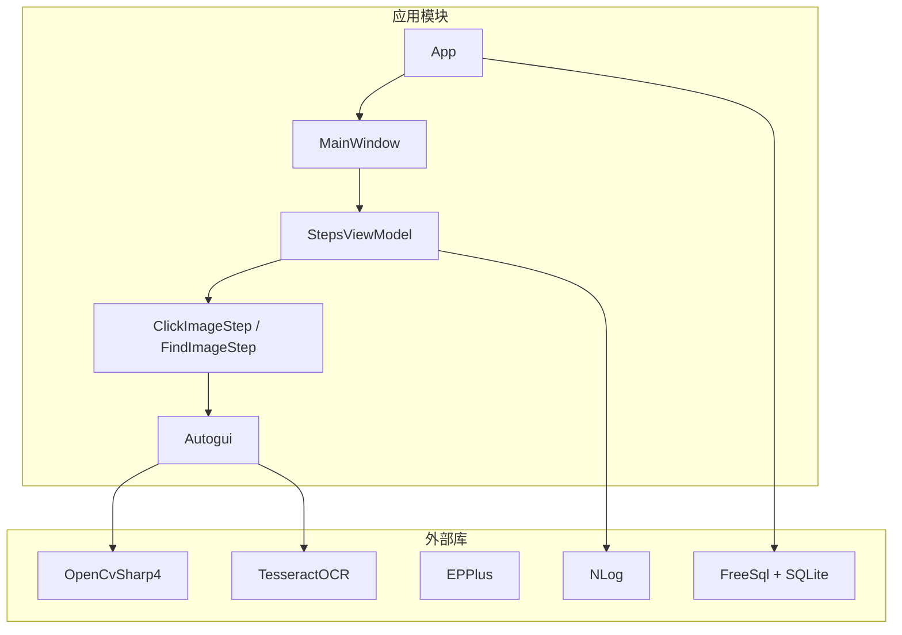

# 快速开始

<cite>
**本文引用的文件**   
- [Readme.md](file://Readme.md)
- [App.xaml.cs](file://ShaoLu/App.xaml.cs)
- [MainWindow.xaml.cs](file://ShaoLu/MainWindow.xaml.cs)
- [ShaoLu.csproj](file://ShaoLu/ShaoLu.csproj)
- [App.config](file://ShaoLu/App.config)
- [LoginViewModel.cs](file://ShaoLu/Viewmodels/LoginViewModel.cs)
- [WindowLogin.xaml.cs](file://ShaoLu/Views/WindowLogin.xaml.cs)
- [User.cs](file://ShaoLu/Models/User.cs)
- [UserService.cs](file://ShaoLu/Services/UserService.cs)
- [StepsFile.cs](file://ShaoLu/Utils/StepsFile.cs)
- [Settings.cs](file://ShaoLu/Models/Settings.cs)
- [MainViewModel.cs](file://ShaoLu/Viewmodels/MainViewModel.cs)
- [StepsViewModel.cs](file://ShaoLu/Viewmodels/StepsViewModel.cs)
- [ImageRecognition.cs](file://ShaoLu/Viewmodels/ImageRecognition.cs)
- [ImagesRecognition.cs](file://ShaoLu/Viewmodels/ImagesRecognition.cs)
- [Autogui.cs](file://ShaoLu/Utils/Autogui.cs)
- [ExecutionLogService.cs](file://ShaoLu/Services/ExecutionLogService.cs)
- [WindowSettings.xaml.cs](file://ShaoLu/Views/WindowSettings.xaml.cs)
</cite>

## 目录
1. [简介](#简介)
2. [项目结构](#项目结构)
3. [核心组件](#核心组件)
4. [架构总览](#架构总览)
5. [详细组件分析](#详细组件分析)
6. [依赖关系分析](#依赖关系分析)
7. [性能注意事项](#性能注意事项)
8. [故障排除指南](#故障排除指南)
9. [结论](#结论)
10. [附录](#附录)

## 简介
本快速开始指南面向首次使用 ShaoLu（烧录）的读者，帮助你在最短时间内完成安装、配置与运行第一个自动化任务。ShaoLu 是一款基于 WPF 的桌面自动化工具，通过图像识别与模拟输入实现 GUI 自动化操作。你将了解：
- 环境要求与系统准备
- 安装与首次启动设置
- 用户登录流程
- 创建并执行第一个“点击识图”步骤
- 常见问题与排错方法

## 项目结构
ShaoLu 采用 WPF + MVVM 架构，UI 与业务逻辑分离，服务层提供 OCR、用户管理、日志等能力；步骤定义与执行引擎位于 Viewmodels 与 Utils 中。关键入口为 App 启动与 MainWindow 主界面。

**图表来源** 
- [App.xaml.cs:19-91](file://ShaoLu/App.xaml.cs#L19-L91)
- [MainWindow.xaml.cs:34-76](file://ShaoLu/MainWindow.xaml.cs#L34-L76)

**章节来源**
- [App.xaml.cs:19-91](file://ShaoLu/App.xaml.cs#L19-L91)
- [MainWindow.xaml.cs:34-76](file://ShaoLu/MainWindow.xaml.cs#L34-L76)

## 核心组件
- 应用生命周期与依赖注入：在应用启动时完成语言、Ioc、OCR DPI、日志清理等初始化，并直接显示主窗口。
- 主窗口与热键：注册 Ctrl+Alt+F9/F10 快捷键控制运行与停止，支持打开/保存 .autostep 包。
- 用户认证：登录/注册由 LoginViewModel 驱动，UserService 负责 SQLite 存储与密码安全校验。
- 步骤系统与执行引擎：StepsViewModel 负责步骤列表管理与执行循环，各步骤类型（如 ClickImageStep、FindImageStep）实现具体行为。
- 图片编辑与识别：通过 ImageRecognitionBase 及 Autogui 进行屏幕截图、模板匹配与点击。
- 设置与国际化：Settings 模型集中管理 UI 与运行参数；LanguageService 提供多语言资源。

**章节来源**
- [App.xaml.cs:19-91](file://ShaoLu/App.xaml.cs#L19-L91)
- [MainWindow.xaml.cs:34-76](file://ShaoLu/MainWindow.xaml.cs#L34-L76)
- [LoginViewModel.cs:1-251](file://ShaoLu/Viewmodels/LoginViewModel.cs#L1-L251)
- [UserService.cs:1-239](file://ShaoLu/Services/UserService.cs#L1-L239)
- [StepsViewModel.cs:422-562](file://ShaoLu/Viewmodels/StepsViewModel.cs#L422-L562)
- [ImageRecognition.cs:329-435](file://ShaoLu/Viewmodels/ImageRecognition.cs#L329-L435)
- [ImagesRecognition.cs:170-206](file://ShaoLu/Viewmodels/ImagesRecognition.cs#L170-L206)
- [Autogui.cs:262-289](file://ShaoLu/Utils/Autogui.cs#L262-L289)
- [Settings.cs:1-117](file://ShaoLu/Models/Settings.cs#L1-L117)

## 架构总览
下图展示从启动到执行一个“点击识图”步骤的关键调用链与数据流。

**图表来源** 
- [MainWindow.xaml.cs:34-76](file://ShaoLu/MainWindow.xaml.cs#L34-L76)
- [StepsViewModel.cs:422-562](file://ShaoLu/Viewmodels/StepsViewModel.cs#L422-L562)
- [ImageRecognition.cs:329-435](file://ShaoLu/Viewmodels/ImageRecognition.cs#L329-L435)
- [Autogui.cs:262-289](file://ShaoLu/Utils/Autogui.cs#L262-L289)
- [StepsFile.cs:74-119](file://ShaoLu/Utils/StepsFile.cs#L74-L119)

## 详细组件分析

### 环境与安装要求
- 操作系统：Windows（WPF 应用）
- 运行时：.NET Framework 4.8（x64）
- 目标平台：x64
- 打包与引导程序：包含 .NET Framework 4.8 引导包
- OCR 词库：内置 tessdata 训练数据（中文简/繁、英文、日文、公式等）

建议准备：
- 已安装 .NET Framework 4.8（若未安装，安装器会提示）
- 管理员权限（用于写入 ApplicationData 下的数据库与日志）
- 稳定的屏幕分辨率与高 DPI 设置（OCR 精度受 DPI 影响）

**章节来源**
- [ShaoLu.csproj:27-41](file://ShaoLu/ShaoLu.csproj#L27-L41)
- [ShaoLu.csproj:447-457](file://ShaoLu/ShaoLu.csproj#L447-L457)
- [ShaoLu.csproj:465-489](file://ShaoLu/ShaoLu.csproj#L465-L489)
- [App.config:1-6](file://ShaoLu/App.config#L1-L6)

### 首次启动与基本设置
- 启动后直接进入主界面，默认语言根据系统或设置决定
- 首次使用前建议打开“设置”窗口，调整：
  - 运行前确认、最小化运行、错误弹窗
  - OCR/找图/点击位置的覆盖层显示（调试用）
  - 默认相似度阈值、等待时间、超时时间、点击次数
  - 全局字体与窗口大小
- 语言切换：菜单中选择语言，界面即时刷新

**章节来源**
- [App.xaml.cs:45-85](file://ShaoLu/App.xaml.cs#L45-L85)
- [MainWindow.xaml.cs:102-110](file://ShaoLu/MainWindow.xaml.cs#L102-L110)
- [WindowSettings.xaml.cs:1-85](file://ShaoLu/Views/WindowSettings.xaml.cs#L1-L85)
- [Settings.cs:33-100](file://ShaoLu/Models/Settings.cs#L33-L100)

### 用户登录流程
- 当需要编辑/保存步骤时，若未登录将弹出登录窗口
- 登录失败会显示错误信息；支持注册新用户（可能需要管理员审批）
- 登录后主界面菜单项会根据用户名动态更新

**图表来源** 
- [MainWindow.xaml.cs:357-373](file://ShaoLu/MainWindow.xaml.cs#L357-L373)
- [LoginViewModel.cs:49-75](file://ShaoLu/Viewmodels/LoginViewModel.cs#L49-L75)
- [WindowLogin.xaml.cs:18-40](file://ShaoLu/Views/WindowLogin.xaml.cs#L18-L40)

**章节来源**
- [MainWindow.xaml.cs:357-373](file://ShaoLu/MainWindow.xaml.cs#L357-L373)
- [LoginViewModel.cs:1-251](file://ShaoLu/Viewmodels/LoginViewModel.cs#L1-L251)
- [WindowLogin.xaml.cs:1-87](file://ShaoLu/Views/WindowLogin.xaml.cs#L1-L87)
- [UserService.cs:76-98](file://ShaoLu/Services/UserService.cs#L76-L98)

### 创建第一个“点击识图”步骤
- 在主界面添加“点击识图”步骤
- 选择目标图片（可从屏幕截取），点击“编辑”裁剪识别区域并设置点击点
- 设置相似度阈值（建议 0.8~0.95）、点击次数与间隔、等待时间与超时
- 保存为 .autostep 包，运行即可

**图表来源** 
- [Readme.md:19-40](file://Readme.md#L19-L40)
- [ImageRecognition.cs:329-435](file://ShaoLu/Viewmodels/ImageRecognition.cs#L329-L435)
- [Autogui.cs:262-289](file://ShaoLu/Utils/Autogui.cs#L262-L289)

**章节来源**
- [Readme.md:19-40](file://Readme.md#L19-L40)
- [ImageRecognition.cs:329-435](file://ShaoLu/Viewmodels/ImageRecognition.cs#L329-L435)
- [Autogui.cs:262-289](file://ShaoLu/Utils/Autogui.cs#L262-L289)

### 执行自动化流程
- 步骤列表支持通用属性：启用、名称、描述、等待时间、条件跳转（如果真/如果假）
- 运行前可选择最小化主窗口，避免干扰屏幕识别
- 执行过程中可通过“执行日志”查看每一步的执行结果与耗时

**图表来源** 
- [StepsViewModel.cs:422-562](file://ShaoLu/Viewmodels/StepsViewModel.cs#L422-L562)
- [ImageRecognition.cs:329-435](file://ShaoLu/Viewmodels/ImageRecognition.cs#L329-L435)
- [Autogui.cs:262-289](file://ShaoLu/Utils/Autogui.cs#L262-L289)

**章节来源**
- [StepsViewModel.cs:422-562](file://ShaoLu/Viewmodels/StepsViewModel.cs#L422-L562)
- [ImageRecognition.cs:329-435](file://ShaoLu/Viewmodels/ImageRecognition.cs#L329-L435)
- [Autogui.cs:262-289](file://ShaoLu/Utils/Autogui.cs#L262-L289)

### 保存与加载自动化包
- 保存为 .autostep 压缩包（zip），包含 steps.json 与 images/ 目录中的裁剪图片
- 打开 .autostep 包会自动解压工作目录，并设置当前路径与工作目录
- 兼容旧版 JSON 格式，自动解析行号跳转为 UID

**图表来源** 
- [StepsFile.cs:40-119](file://ShaoLu/Utils/StepsFile.cs#L40-L119)
- [MainWindow.xaml.cs:197-235](file://ShaoLu/MainWindow.xaml.cs#L197-L235)

**章节来源**
- [StepsFile.cs:40-119](file://ShaoLu/Utils/StepsFile.cs#L40-L119)
- [MainWindow.xaml.cs:197-235](file://ShaoLu/MainWindow.xaml.cs#L197-L235)

## 依赖关系分析
- 外部依赖：OpenCV（图像识别）、TesseractOCR（OCR）、EPPlus（Excel读写）、NLog（日志）、FreeSql+SQLite（用户与日志持久化）
- 内部模块：App 启动 -> Ioc -> 语言服务 -> 主窗口 -> 步骤视图模型 -> 步骤实现 -> Autogui -> 系统输入/屏幕捕获

**图表来源** 
- [ShaoLu.csproj:402-445](file://ShaoLu/ShaoLu.csproj#L402-L445)
- [App.xaml.cs:52-67](file://ShaoLu/App.xaml.cs#L52-L67)
- [UserService.cs:12-28](file://ShaoLu/Services/UserService.cs#L12-L28)
- [ExecutionLogService.cs:14-27](file://ShaoLu/Services/ExecutionLogService.cs#L14-L27)

**章节来源**
- [ShaoLu.csproj:402-445](file://ShaoLu/ShaoLu.csproj#L402-L445)
- [App.xaml.cs:52-67](file://ShaoLu/App.xaml.cs#L52-L67)
- [UserService.cs:12-28](file://ShaoLu/Services/UserService.cs#L12-L28)
- [ExecutionLogService.cs:14-27](file://ShaoLu/Services/ExecutionLogService.cs#L14-L27)

## 性能注意事项
- 图像识别与 OCR 属于 CPU 密集型任务，建议在后台线程执行（StepsViewModel 已异步处理）
- 合理设置相似度阈值与超时时间，避免频繁扫描导致卡顿
- 开启“显示识别区域/点击位置”有助于定位问题，但会影响性能，仅调试时开启
- 保持目标图片裁剪区域小而精，提高匹配速度与准确率
- 日志保留天数设置过大可能导致磁盘增长，按需清理

[本节为通用指导，不直接分析具体文件]

## 故障排除指南
- 无法找到匹配图片
  - 检查目标图片是否清晰、特征明显；适当降低相似度阈值
  - 确认分辨率与 DPI 设置是否与录制一致
  - 增加超时时间，确保目标出现后再识别
- 登录失败
  - 确认用户名与密码正确；若为新用户，检查是否需要管理员审批
  - 查看错误消息提示，必要时重置密码或重新注册
- 运行异常中断
  - 查看“执行日志”窗口，定位失败步骤与原因
  - 检查是否有弹窗遮挡目标界面；可使用“弹出框”步骤进行人工干预
- 保存/打开失败
  - 确认 .autostep 包完整（steps.json 与 images/ 存在）
  - 检查文件路径权限与磁盘空间

**章节来源**
- [ExecutionLogService.cs:36-55](file://ShaoLu/Services/ExecutionLogService.cs#L36-L55)
- [MainWindow.xaml.cs:197-235](file://ShaoLu/MainWindow.xaml.cs#L197-L235)
- [LoginViewModel.cs:49-75](file://ShaoLu/Viewmodels/LoginViewModel.cs#L49-L75)
- [Autogui.cs:262-289](file://ShaoLu/Utils/Autogui.cs#L262-L289)

## 结论
通过以上步骤，你已掌握 ShaoLu 的安装、配置、登录与第一个自动化任务的创建与执行。建议进一步探索“查找识图”“多图点击”“输入文字”等步骤类型，结合条件跳转构建复杂流程。遇到问题时优先检查图片质量、阈值与超时设置，并利用执行日志与覆盖层辅助定位。

[本节为总结性内容，不直接分析具体文件]

## 附录
- 快捷键：Ctrl+Alt+F9 运行；Ctrl+Alt+F10 停止
- 常用步骤类型：点击识图、查找识图、多图点击、多图查找、输入文字、多次输入、从文件输入、弹出框
- 设置项：运行前确认、最小化运行、错误弹窗、覆盖层显示、默认相似度/等待/超时/点击次数

**章节来源**
- [Readme.md:7-14](file://Readme.md#L7-L14)
- [Readme.md:19-203](file://Readme.md#L19-L203)
- [Settings.cs:33-100](file://ShaoLu/Models/Settings.cs#L33-L100)