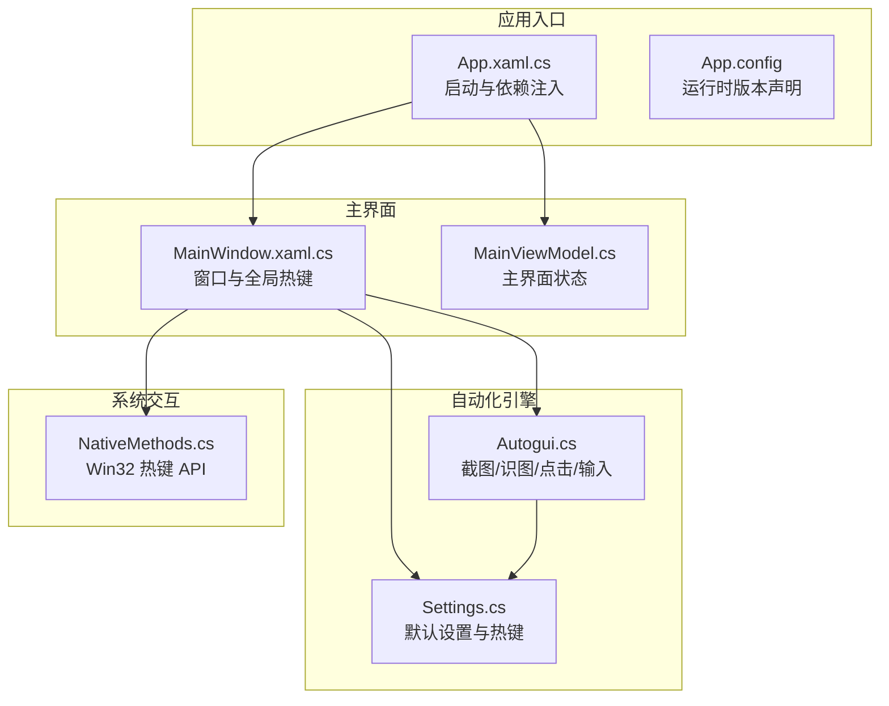
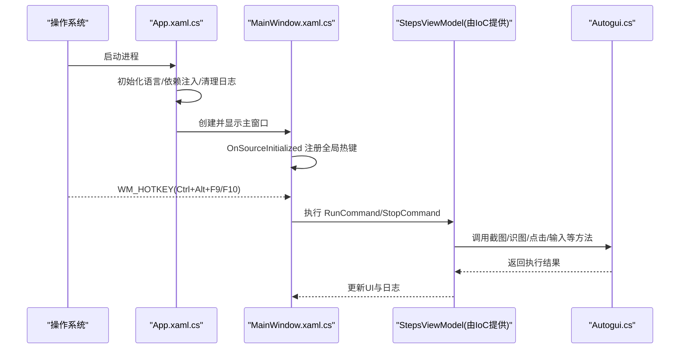
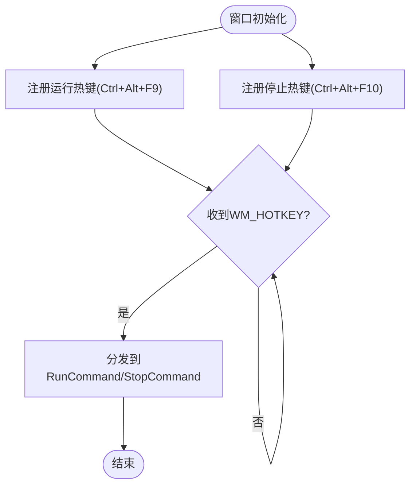
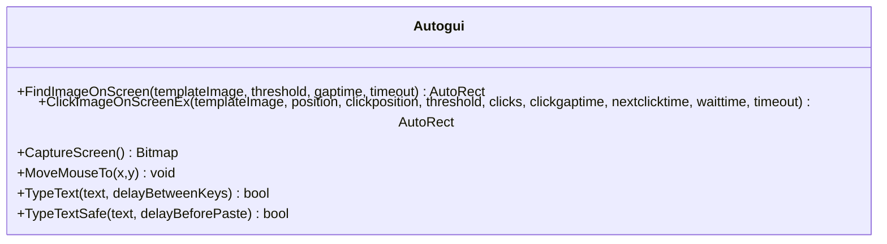
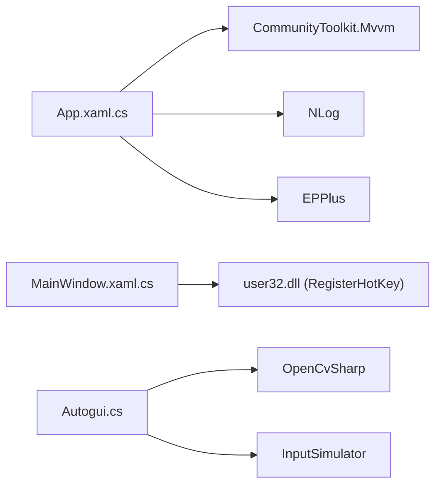

# 快速开始

<cite>
**本文引用的文件**   
- [Readme.md](file://Readme.md)
- [ShaoLu.csproj](file://ShaoLu/ShaoLu.csproj)
- [App.config](file://ShaoLu/App.config)
- [App.xaml.cs](file://ShaoLu/App.xaml.cs)
- [MainWindow.xaml.cs](file://ShaoLu/MainWindow.xaml.cs)
- [NativeMethods.cs](file://ShaoLu/Utils/NativeMethods.cs)
- [Settings.cs](file://ShaoLu/Models/Settings.cs)
- [Autogui.cs](file://ShaoLu/Utils/Autogui.cs)
- [MainViewModel.cs](file://ShaoLu/Viewmodels/MainViewModel.cs)
- [ShaoLu.slnx](file://ShaoLu.slnx)
</cite>

## 目录
1. [简介](#简介)
2. [项目结构](#项目结构)
3. [核心组件](#核心组件)
4. [架构总览](#架构总览)
5. [详细组件分析](#详细组件分析)
6. [依赖分析](#依赖分析)
7. [性能考虑](#性能考虑)
8. [故障排除指南](#故障排除指南)
9. [结论](#结论)
10. [附录](#附录)

## 简介
本指南面向首次使用 ShaoLu（烧录）的读者，目标是帮助你在最短时间内完成环境搭建、编译运行，并掌握基本使用方法：启动程序、添加自动化步骤、配置参数、执行流程与快捷键操作。同时提供常见问题的解决方案，确保你能顺利创建并运行一个“点击识图”的简单自动化流程。

## 项目结构
ShaoLu 是一个基于 WPF 的桌面自动化工具，采用 .NET Framework 4.8 构建，通过图像识别与模拟输入实现 GUI 自动化。工程包含主应用、视图模型、服务层、工具库以及图片编辑等模块。

图表来源
- [App.xaml.cs:18-65](file://ShaoLu/App.xaml.cs#L18-L65)
- [App.config:1-6](file://ShaoLu/App.config#L1-L6)
- [MainWindow.xaml.cs:32-74](file://ShaoLu/MainWindow.xaml.cs#L32-L74)
- [Autogui.cs:43-122](file://ShaoLu/Utils/Autogui.cs#L43-L122)
- [Settings.cs:66-68](file://ShaoLu/Models/Settings.cs#L66-L68)
- [NativeMethods.cs:8-17](file://ShaoLu/Utils/NativeMethods.cs#L8-L17)

章节来源
- [ShaoLu.csproj:34](file://ShaoLu/ShaoLu.csproj#L34)
- [App.config:1-6](file://ShaoLu/App.config#L1-L6)
- [ShaoLu.slnx:1-11](file://ShaoLu.slnx#L1-L11)

## 核心组件
- 应用启动与依赖注入：负责初始化语言、注册服务、清理日志并显示主窗口。
- 主窗口与全局热键：注册 Ctrl+Alt+F9（运行）和 Ctrl+Alt+F10（停止），并将命令转发到步骤执行器。
- 自动化引擎：封装屏幕截图、模板匹配、鼠标移动与点击、文本输入等功能。
- 设置与默认值：定义默认相似度阈值、等待时间、超时时间、点击次数及全局热键。
- 视图模型：管理登录状态、当前步骤包路径与工作目录等界面状态。

章节来源
- [App.xaml.cs:18-65](file://ShaoLu/App.xaml.cs#L18-L65)
- [MainWindow.xaml.cs:32-74](file://ShaoLu/MainWindow.xaml.cs#L32-L74)
- [Autogui.cs:43-122](file://ShaoLu/Utils/Autogui.cs#L43-L122)
- [Settings.cs:34-68](file://ShaoLu/Models/Settings.cs#L34-L68)
- [MainViewModel.cs:26-70](file://ShaoLu/Viewmodels/MainViewModel.cs#L26-L70)

## 架构总览
下图展示了从启动到执行自动化流程的关键调用链：应用启动 → 依赖注入 → 主窗口加载 → 全局热键注册 → 触发运行/停止命令 → 调用自动化引擎执行步骤。

图表来源
- [App.xaml.cs:18-65](file://ShaoLu/App.xaml.cs#L18-L65)
- [MainWindow.xaml.cs:32-74](file://ShaoLu/MainWindow.xaml.cs#L32-L74)
- [Autogui.cs:43-122](file://ShaoLu/Utils/Autogui.cs#L43-L122)

## 详细组件分析

### 环境搭建与运行（.NET Framework 4.8、依赖、编译与运行）
- 安装 .NET Framework 4.8（x86 与 x64）。项目清单中已包含引导程序包，确保目标机器具备所需运行时。
- 打开解决方案或项目，选择平台为 x64（slnx 指定了 x64 平台）。
- 还原 NuGet 包并编译（OpenCVSharp、InputSimulator、NLog、EPPlus 等）。
- 运行生成的可执行程序。

章节来源
- [ShaoLu.csproj:34](file://ShaoLu/ShaoLu.csproj#L34)
- [ShaoLu.csproj:403-412](file://ShaoLu/ShaoLu.csproj#L403-L412)
- [ShaoLu.slnx:1-11](file://ShaoLu.slnx#L1-L11)
- [App.config:1-6](file://ShaoLu/App.config#L1-L6)

### 基本使用流程（启动、添加步骤、配置参数、执行）
- 启动程序后，在主界面通过步骤列表添加自动化步骤。
- 每个步骤支持名称、描述、启用/禁用、等待时间、条件跳转等通用属性。
- 点击「编辑」按钮展开详细参数配置（如图片识别区域、点击点、相似度阈值等）。
- 配置完成后点击「运行」开始执行自动化流程。
- 快捷键：Ctrl+Alt+F9 运行；Ctrl+Alt+F10 停止。

章节来源
- [Readme.md:7-13](file://Readme.md#L7-L13)

### 快捷键操作（Ctrl+Alt+F9 运行、Ctrl+Alt+F10 停止）
- 主窗口在初始化时注册两个全局热键，分别对应运行与停止命令。
- 当用户按下组合键时，窗口消息回调将触发对应的命令执行。

图表来源
- [MainWindow.xaml.cs:32-74](file://ShaoLu/MainWindow.xaml.cs#L32-L74)
- [NativeMethods.cs:8-17](file://ShaoLu/Utils/NativeMethods.cs#L8-L17)

章节来源
- [MainWindow.xaml.cs:32-74](file://ShaoLu/MainWindow.xaml.cs#L32-L74)
- [Settings.cs:66-68](file://ShaoLu/Models/Settings.cs#L66-L68)

### 示例：创建一个简单的“点击识图”自动化流程
- 添加一个“点击识图”步骤。
- 选择目标图片（可从屏幕截取按钮或图标），点击「编辑」裁剪识别区域并设置点击点。
- 调整相似度阈值（建议 0.8~0.95）、点击次数与间隔。
- 设置等待时间与超时时间。
- 保存步骤包，按 Ctrl+Alt+F9 运行流程。

章节来源
- [Readme.md:19-40](file://Readme.md#L19-L40)

### 自动化引擎（截图、识图、点击、输入）
- 截图：获取全屏位图用于后续处理。
- 识图：对模板进行灰度转换并使用模板匹配算法查找目标，返回位置与相似度。
- 点击：根据匹配结果移动到锚点位置并按需多次点击。
- 输入：支持逐字输入与安全粘贴模式（剪贴板方式）。

图表来源
- [Autogui.cs:59-122](file://ShaoLu/Utils/Autogui.cs#L59-L122)
- [Autogui.cs:256-306](file://ShaoLu/Utils/Autogui.cs#L256-L306)
- [Autogui.cs:177-186](file://ShaoLu/Utils/Autogui.cs#L177-L186)
- [Autogui.cs:497-511](file://ShaoLu/Utils/Autogui.cs#L497-L511)
- [Autogui.cs:551-579](file://ShaoLu/Utils/Autogui.cs#L551-L579)

章节来源
- [Autogui.cs:59-122](file://ShaoLu/Utils/Autogui.cs#L59-L122)
- [Autogui.cs:256-306](file://ShaoLu/Utils/Autogui.cs#L256-L306)
- [Autogui.cs:497-511](file://ShaoLu/Utils/Autogui.cs#L497-L511)
- [Autogui.cs:551-579](file://ShaoLu/Utils/Autogui.cs#L551-L579)

### 设置与默认值（相似度、等待时间、超时、点击次数、热键）
- 默认相似度阈值、等待时间、超时时间、点击次数可在设置中配置。
- 全局热键默认：运行=Ctrl+Alt+F9，停止=Ctrl+Alt+F10。

章节来源
- [Settings.cs:34-68](file://ShaoLu/Models/Settings.cs#L34-L68)

### 视图模型（登录状态与路径管理）
- 维护是否已登录、当前用户名、步骤包路径与图片工作目录等状态。
- 刷新登录状态以同步 UI。

章节来源
- [MainViewModel.cs:26-70](file://ShaoLu/Viewmodels/MainViewModel.cs#L26-L70)

## 依赖分析
- 框架与运行时：.NET Framework 4.8（App.config 声明）。
- 关键第三方库：OpenCvSharp（图像处理）、InputSimulator（输入模拟）、NLog（日志）、EPPlus（Excel 读写）、CommunityToolkit.Mvvm（MVVM 基础）。
- 平台：x64（slnx 指定）。

图表来源
- [App.config:1-6](file://ShaoLu/App.config#L1-L6)
- [ShaoLu.slnx:1-11](file://ShaoLu.slnx#L1-L11)
- [NativeMethods.cs:8-17](file://ShaoLu/Utils/NativeMethods.cs#L8-L17)
- [Autogui.cs:1-14](file://ShaoLu/Utils/Autogui.cs#L1-L14)

章节来源
- [ShaoLu.csproj:358-401](file://ShaoLu/ShaoLu.csproj#L358-L401)
- [ShaoLu.slnx:1-11](file://ShaoLu.slnx#L1-L11)

## 性能考虑
- 模板匹配开销较大，建议裁剪更精确的识别区域以提升速度与准确率。
- 合理设置相似度阈值与超时时间，避免频繁重试导致卡顿。
- 多步流程中适当增加等待时间，保证目标元素加载完成。
- 关闭不必要的调试输出，减少 I/O 开销。

[本节为通用指导，不直接分析具体文件]

## 故障排除指南
- 无法启动或提示缺少运行时：确认已安装 .NET Framework 4.8（x86 与 x64）。
- 全局热键无效：检查是否与其他软件冲突；确认窗口已初始化并成功注册热键。
- 识图失败或误匹配：提高相似度阈值、缩小裁剪区域、确保目标元素清晰可见。
- 输入异常或乱码：使用安全粘贴模式（TypeTextSafe），适当增大按键间隔。
- Excel 读取失败：确认文件格式正确且 EPPlus 许可证已设置。

章节来源
- [App.config:1-6](file://ShaoLu/App.config#L1-L6)
- [MainWindow.xaml.cs:32-74](file://ShaoLu/MainWindow.xaml.cs#L32-L74)
- [Autogui.cs:59-122](file://ShaoLu/Utils/Autogui.cs#L59-L122)
- [Autogui.cs:551-579](file://ShaoLu/Utils/Autogui.cs#L551-L579)
- [App.xaml.cs:49-52](file://ShaoLu/App.xaml.cs#L49-L52)

## 结论
通过本指南，你应已完成 ShaoLu 的环境搭建与基本使用，理解其核心组件与工作流程，并能独立创建“点击识图”自动化流程。若遇到问题，请参考故障排除部分逐步排查。

[本节为总结性内容，不直接分析具体文件]

## 附录
- 常用步骤类型参考：点击识图、查找识图、多图点击、多图查找、输入文字、多次输入、从文件输入、弹出框等。
- 图片编辑窗口：用于裁剪识别区域与设置点击点，提升匹配精度。

章节来源
- [Readme.md:17-283](file://Readme.md#L17-L283)