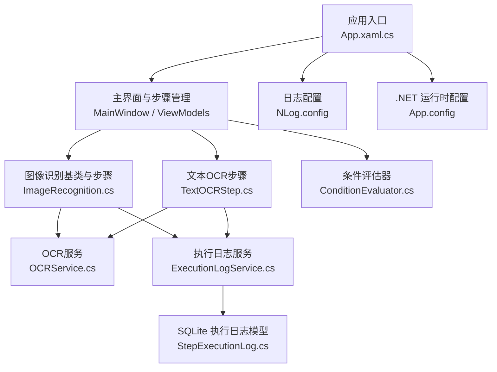
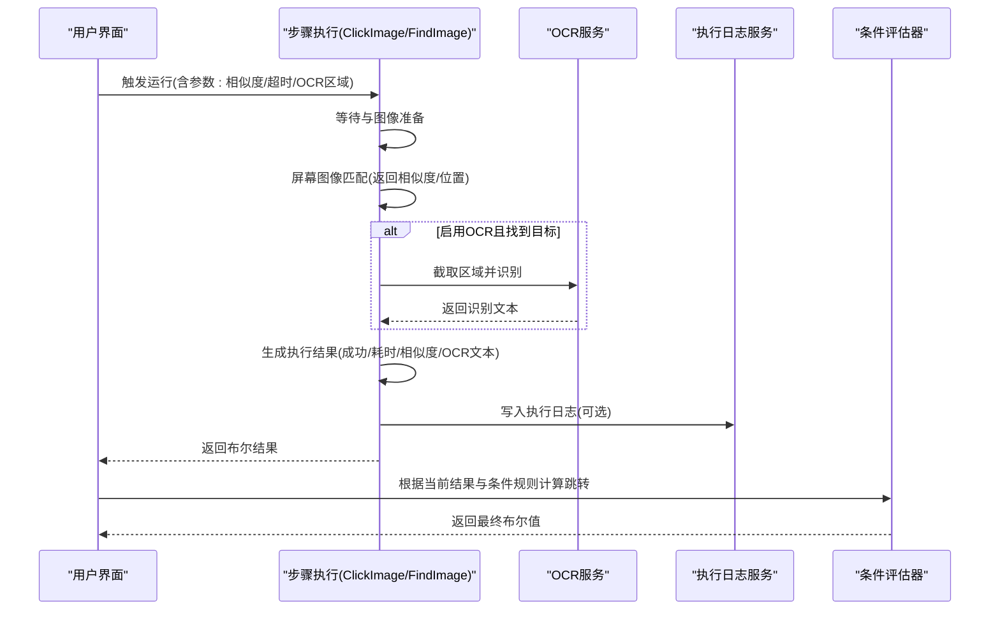
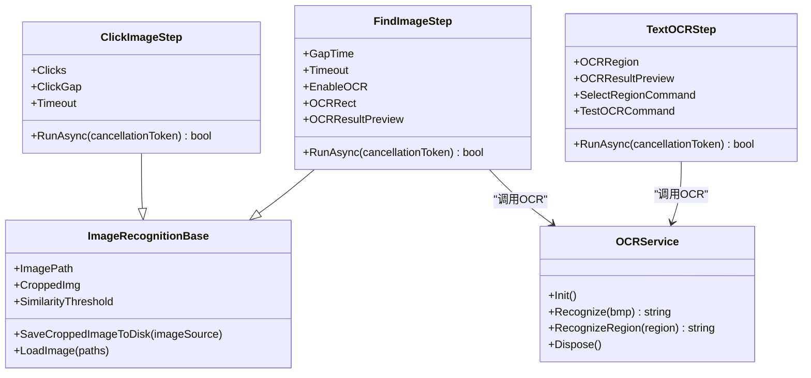
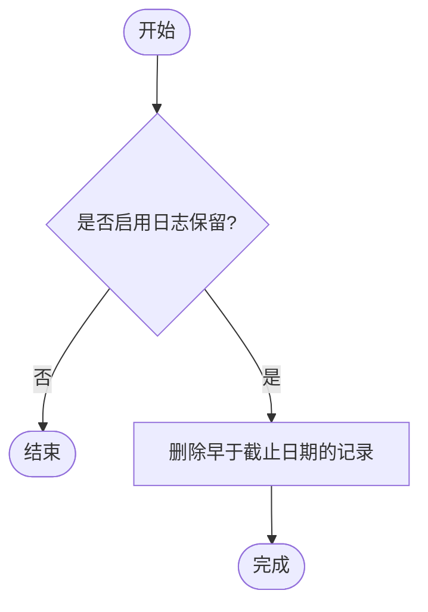
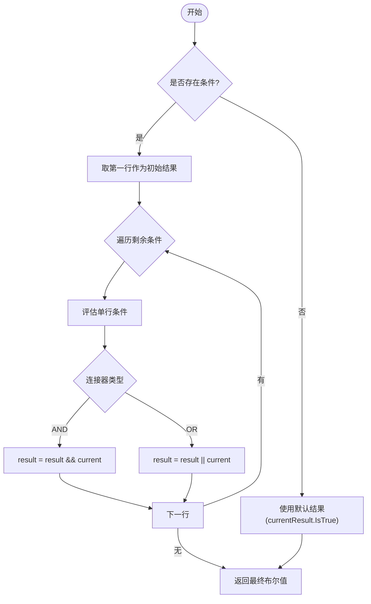
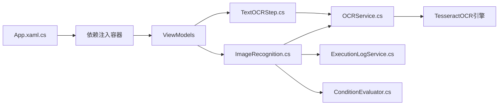

# 故障排除

<cite>
**本文引用的文件**   
- [Readme.md](file://Readme.md)
- [NLog.config](file://ShaoLu/NLog.config)
- [App.config](file://ShaoLu/App.config)
- [App.xaml.cs](file://ShaoLu/App.xaml.cs)
- [ExecutionLogService.cs](file://ShaoLu/Services/ExecutionLogService.cs)
- [OCRService.cs](file://ShaoLu/Services/OCRService.cs)
- [StepExecutionLog.cs](file://ShaoLu/Models/StepExecutionLog.cs)
- [StepExecutionResult.cs](file://ShaoLu/Models/StepExecutionResult.cs)
- [ImageRecognition.cs](file://ShaoLu/Viewmodels/ImageRecognition.cs)
- [TextOCRStep.cs](file://ShaoLu/Viewmodels/TextOCRStep.cs)
- [ConditionEvaluator.cs](file://ShaoLu/Services/ConditionEvaluator.cs)
</cite>

## 目录
1. [简介](#简介)
2. [项目结构](#项目结构)
3. [核心组件](#核心组件)
4. [架构总览](#架构总览)
5. [详细组件分析](#详细组件分析)
6. [依赖关系分析](#依赖关系分析)
7. [性能注意事项](#性能注意事项)
8. [故障排除指南](#故障排除指南)
9. [结论](#结论)
10. [附录](#附录)

## 简介
本指南面向 ShaoLu（基于 WPF 的桌面自动化工具）用户与开发者，聚焦于问题定位、日志分析、调试技巧与性能优化。内容覆盖图像识别失败、OCR 识别错误、UI 显示异常等常见问题，并提供 NLog 配置说明、执行日志分析方法、Visual Studio 调试建议、内存泄漏与 CPU 使用率诊断方法，以及错误代码与异常处理最佳实践和社区支持渠道。

## 项目结构
ShaoLu 采用分层组织：
- 视图层（Views/ViewModels）：负责 UI 交互与数据绑定
- 服务层（Services）：封装 OCR、条件评估、执行日志等能力
- 模型层（Models）：定义执行结果与持久化实体
- 工具与互操作（Utils/Tools）：屏幕截图、Win32 调用、图像处理等
- 应用启动与配置（App.*、NLog.config、App.config）：程序生命周期与日志配置

图表来源
- [App.xaml.cs:18-65](file://ShaoLu/App.xaml.cs#L18-L65)
- [ImageRecognition.cs:329-417](file://ShaoLu/Viewmodels/ImageRecognition.cs#L329-L417)
- [TextOCRStep.cs:102-142](file://ShaoLu/Viewmodels/TextOCRStep.cs#L102-L142)
- [OCRService.cs:21-43](file://ShaoLu/Services/OCRService.cs#L21-L43)
- [ExecutionLogService.cs:34-55](file://ShaoLu/Services/ExecutionLogService.cs#L34-L55)
- [StepExecutionLog.cs:6-45](file://ShaoLu/Models/StepExecutionLog.cs#L6-L45)
- [ConditionEvaluator.cs:22-50](file://ShaoLu/Services/ConditionEvaluator.cs#L22-L50)
- [NLog.config:1-20](file://ShaoLu/NLog.config#L1-L20)
- [App.config:1-6](file://ShaoLu/App.config#L1-L6)

章节来源
- [Readme.md:1-283](file://Readme.md#L1-L283)
- [App.xaml.cs:18-86](file://ShaoLu/App.xaml.cs#L18-L86)
- [NLog.config:1-20](file://ShaoLu/NLog.config#L1-L20)
- [App.config:1-6](file://ShaoLu/App.config#L1-L6)

## 核心组件
- 图像识别基类与步骤
  - 提供图片加载、裁剪图保存、相似度阈值控制、点击点管理等通用能力；ClickImageStep 与 FindImageStep 分别实现“点击识图”和“查找识图”，并支持可选 OCR 区域识别。
- OCR 服务
  - 基于 TesseractOCR 封装，懒加载初始化引擎，支持 Bitmap 与屏幕区域 OCR，包含 DPI 缩放适配与异常保护。
- 执行日志服务
  - 使用 FreeSql + SQLite 记录文字步骤的执行历史，支持关键字搜索、时间范围筛选、分页查询与旧日志清理。
- 条件评估器
  - 对多行条件进行 AND/OR 组合评估，支持布尔、数字、字符串比较与空值判断。

章节来源
- [ImageRecognition.cs:199-325](file://ShaoLu/Viewmodels/ImageRecognition.cs#L199-L325)
- [ImageRecognition.cs:329-417](file://ShaoLu/Viewmodels/ImageRecognition.cs#L329-L417)
- [ImageRecognition.cs:420-566](file://ShaoLu/Viewmodels/ImageRecognition.cs#L420-L566)
- [OCRService.cs:12-43](file://ShaoLu/Services/OCRService.cs#L12-L43)
- [OCRService.cs:48-75](file://ShaoLu/Services/OCRService.cs#L48-L75)
- [OCRService.cs:82-118](file://ShaoLu/Services/OCRService.cs#L82-L118)
- [ExecutionLogService.cs:12-55](file://ShaoLu/Services/ExecutionLogService.cs#L12-L55)
- [ExecutionLogService.cs:60-107](file://ShaoLu/Services/ExecutionLogService.cs#L60-L107)
- [ConditionEvaluator.cs:22-76](file://ShaoLu/Services/ConditionEvaluator.cs#L22-L76)

## 架构总览
下图展示从 UI 到 OCR、图像识别与日志记录的调用链，以及条件评估在流程控制中的作用。

图表来源
- [ImageRecognition.cs:382-416](file://ShaoLu/Viewmodels/ImageRecognition.cs#L382-L416)
- [ImageRecognition.cs:515-565](file://ShaoLu/Viewmodels/ImageRecognition.cs#L515-L565)
- [OCRService.cs:82-118](file://ShaoLu/Services/OCRService.cs#L82-L118)
- [ExecutionLogService.cs:34-55](file://ShaoLu/Services/ExecutionLogService.cs#L34-L55)
- [ConditionEvaluator.cs:22-50](file://ShaoLu/Services/ConditionEvaluator.cs#L22-L50)

## 详细组件分析

### 图像识别与 OCR 流程
- ClickImageStep
  - 将 ImageSource 转换为 Bitmap，按点击点列表执行屏幕点击匹配，记录相似度与点击位置。
- FindImageStep
  - 执行屏幕查找，若启用 OCR 且找到目标，则计算 OCR 区域绝对坐标并调用 OCRService 识别文本，更新预览与执行结果。
- TextOCRStep
  - 直接对指定屏幕区域执行 OCR，设置 OCRRegion 后测试或运行，输出识别结果与执行状态。

图表来源
- [ImageRecognition.cs:199-325](file://ShaoLu/Viewmodels/ImageRecognition.cs#L199-L325)
- [ImageRecognition.cs:329-417](file://ShaoLu/Viewmodels/ImageRecognition.cs#L329-L417)
- [ImageRecognition.cs:420-566](file://ShaoLu/Viewmodels/ImageRecognition.cs#L420-L566)
- [TextOCRStep.cs:17-142](file://ShaoLu/Viewmodels/TextOCRStep.cs#L17-L142)
- [OCRService.cs:12-43](file://ShaoLu/Services/OCRService.cs#L12-L43)
- [OCRService.cs:48-75](file://ShaoLu/Services/OCRService.cs#L48-L75)
- [OCRService.cs:82-118](file://ShaoLu/Services/OCRService.cs#L82-L118)

章节来源
- [ImageRecognition.cs:382-416](file://ShaoLu/Viewmodels/ImageRecognition.cs#L382-L416)
- [ImageRecognition.cs:515-565](file://ShaoLu/Viewmodels/ImageRecognition.cs#L515-L565)
- [TextOCRStep.cs:102-142](file://ShaoLu/Viewmodels/TextOCRStep.cs#L102-L142)

### 执行日志与持久化
- ExecutionLogService
  - 使用 FreeSql 连接 SQLite，插入 StepExecutionLog 记录，支持分页查询、关键字搜索、时间范围过滤与旧日志清理。
- StepExecutionLog
  - 定义 Id、StepUid、StepFileName、StepName、InputText、OCRText、ExecutedAt 字段。

图表来源
- [ExecutionLogService.cs:161-176](file://ShaoLu/Services/ExecutionLogService.cs#L161-L176)
- [StepExecutionLog.cs:6-45](file://ShaoLu/Models/StepExecutionLog.cs#L6-L45)

章节来源
- [ExecutionLogService.cs:34-55](file://ShaoLu/Services/ExecutionLogService.cs#L34-L55)
- [ExecutionLogService.cs:60-107](file://ShaoLu/Services/ExecutionLogService.cs#L60-L107)
- [ExecutionLogService.cs:148-156](file://ShaoLu/Services/ExecutionLogService.cs#L148-L156)
- [ExecutionLogService.cs:161-176](file://ShaoLu/Services/ExecutionLogService.cs#L161-L176)
- [StepExecutionLog.cs:6-45](file://ShaoLu/Models/StepExecutionLog.cs#L6-L45)

### 条件评估与流程控制
- ConditionEvaluator
  - 对多行条件进行 AND/OR 组合，支持常量、变量解析与多种比较运算符，异常时记录警告并返回 false。

图表来源
- [ConditionEvaluator.cs:22-50](file://ShaoLu/Services/ConditionEvaluator.cs#L22-L50)
- [ConditionEvaluator.cs:55-76](file://ShaoLu/Services/ConditionEvaluator.cs#L55-L76)
- [ConditionEvaluator.cs:81-142](file://ShaoLu/Services/ConditionEvaluator.cs#L81-L142)

章节来源
- [ConditionEvaluator.cs:22-76](file://ShaoLu/Services/ConditionEvaluator.cs#L22-L76)
- [ConditionEvaluator.cs:81-142](file://ShaoLu/Services/ConditionEvaluator.cs#L81-L142)

## 依赖关系分析
- App.xaml.cs 在启动阶段初始化语言、注册依赖注入容器、清理过期执行日志并显示主窗口。
- 图像识别步骤依赖 Autogui 进行屏幕操作，依赖 OCRService 进行文本识别，依赖 ExecutionLogService 记录执行历史。
- OCRService 依赖 TesseractOCR 引擎，需确保 tessdata 路径正确。
- 条件评估器依赖上下文与当前执行结果进行逻辑运算。

图表来源
- [App.xaml.cs:32-47](file://ShaoLu/App.xaml.cs#L32-L47)
- [ImageRecognition.cs:382-416](file://ShaoLu/Viewmodels/ImageRecognition.cs#L382-L416)
- [TextOCRStep.cs:102-142](file://ShaoLu/Viewmodels/TextOCRStep.cs#L102-L142)
- [OCRService.cs:21-43](file://ShaoLu/Services/OCRService.cs#L21-L43)
- [ExecutionLogService.cs:34-55](file://ShaoLu/Services/ExecutionLogService.cs#L34-L55)
- [ConditionEvaluator.cs:22-50](file://ShaoLu/Services/ConditionEvaluator.cs#L22-L50)

章节来源
- [App.xaml.cs:18-65](file://ShaoLu/App.xaml.cs#L18-L65)
- [ImageRecognition.cs:382-416](file://ShaoLu/Viewmodels/ImageRecognition.cs#L382-L416)
- [TextOCRStep.cs:102-142](file://ShaoLu/Viewmodels/TextOCRStep.cs#L102-L142)
- [OCRService.cs:21-43](file://ShaoLu/Services/OCRService.cs#L21-L43)
- [ExecutionLogService.cs:34-55](file://ShaoLu/Services/ExecutionLogService.cs#L34-L55)
- [ConditionEvaluator.cs:22-50](file://ShaoLu/Services/ConditionEvaluator.cs#L22-L50)

## 性能注意事项
- 图像加载与缓存
  - 使用 OnLoad 与 Freeze 提升跨线程访问性能，避免文件句柄占用过久。
- OCR 初始化与资源释放
  - OCR 引擎懒加载，首次调用初始化；程序退出时应释放引擎资源，避免内存泄漏。
- 屏幕截图与 DPI 缩放
  - OCR 区域截取时需考虑 DPI 缩放因子，确保物理像素与逻辑像素一致。
- 异步与取消令牌
  - 长耗时操作使用 Task.Run 与 CancellationToken，避免阻塞 UI 线程。
- 日志写入
  - NLog 异步写入，减少 IO 阻塞；合理设置保留天数，避免数据库膨胀。

[本节为通用指导，不直接分析具体文件]

## 故障排除指南

### 图像识别失败
常见症状
- 找不到目标图片，步骤结果为 false
- 相似度低导致误判或未命中
- 点击位置不正确

排查步骤
- 检查是否已选择并裁剪目标图片，确认 CroppedImg 不为空
- 调整相似度阈值（建议 0.8~0.95），过高可能导致严格匹配失败
- 确认点击点设置是否正确，未设置时使用图像中心点
- 查看执行结果中的相似度与点击位置，辅助定位问题

相关实现参考
- 图像加载与错误提示
- 点击识图执行流程与结果填充

章节来源
- [ImageRecognition.cs:199-227](file://ShaoLu/Viewmodels/ImageRecognition.cs#L199-L227)
- [ImageRecognition.cs:382-416](file://ShaoLu/Viewmodels/ImageRecognition.cs#L382-L416)

### OCR 识别错误
常见症状
- 未识别到文本或识别结果为空
- 区域选择无效导致报错
- tessdata 路径错误或引擎初始化失败

排查步骤
- 确认 OCR 区域已正确设置（非空且有宽高）
- 检查 tessdata 目录是否存在且包含正确的语言包
- 查看 OCRService 初始化日志，确认引擎成功启动
- 使用“测试 OCR”功能验证区域识别效果

相关实现参考
- OCR 区域校验与错误类型
- OCR 服务初始化与区域识别

章节来源
- [TextOCRStep.cs:102-142](file://ShaoLu/Viewmodels/TextOCRStep.cs#L102-L142)
- [OCRService.cs:21-43](file://ShaoLu/Services/OCRService.cs#L21-L43)
- [OCRService.cs:82-118](file://ShaoLu/Services/OCRService.cs#L82-L118)

### UI 显示问题
常见症状
- 图片无法加载或显示空白
- 编辑窗口布局异常
- 资源冻结与跨线程访问问题

排查步骤
- 确认图片路径有效且文件存在
- 检查图像加载是否使用了合适的 CacheOption 与 Freeze
- 在编辑窗口中强制更新布局后再设置裁剪框与点击点

相关实现参考
- 图像加载与错误处理
- 编辑窗口异步设置与布局更新

章节来源
- [ImageRecognition.cs:199-227](file://ShaoLu/Viewmodels/ImageRecognition.cs#L199-L227)
- [ImageRecognition.cs:156-195](file://ShaoLu/Viewmodels/ImageRecognition.cs#L156-L195)

### 执行日志无法写入或查询
常见症状
- 执行日志未记录
- 查询结果为空或分页异常
- 旧日志未清理

排查步骤
- 确认步骤启用了“启用日志”选项
- 检查 ApplicationData 路径下的 execution_log.db 是否存在并可写
- 查看 NLog 日志是否有写入失败的错误信息
- 检查保留天数设置是否生效

相关实现参考
- 日志写入与异常捕获
- 查询接口与分页
- 旧日志清理

章节来源
- [ExecutionLogService.cs:34-55](file://ShaoLu/Services/ExecutionLogService.cs#L34-L55)
- [ExecutionLogService.cs:60-107](file://ShaoLu/Services/ExecutionLogService.cs#L60-L107)
- [ExecutionLogService.cs:161-176](file://ShaoLu/Services/ExecutionLogService.cs#L161-L176)

### 条件评估异常
常见症状
- 条件跳转不符合预期
- 变量解析失败或比较结果异常

排查步骤
- 检查条件表达式与变量取值是否正确
- 查看条件评估器的警告日志，定位解析失败原因
- 简化条件表达式逐步排查

相关实现参考
- 条件评估与异常处理

章节来源
- [ConditionEvaluator.cs:55-76](file://ShaoLu/Services/ConditionEvaluator.cs#L55-L76)
- [ConditionEvaluator.cs:81-142](file://ShaoLu/Services/ConditionEvaluator.cs#L81-L142)

### 日志分析方法与 NLog 配置
- NLog 配置
  - 日志输出到文件与控制台，文件名按日期命名，包含级别、记录器、消息与异常信息
  - 自动重载配置，抛出异常开关关闭
- 查看与分析
  - 打开 logs 目录下当日 .log 文件，筛选 ERROR/WARN/DEBUG 级别
  - 结合执行日志数据库（execution_log.db）交叉验证步骤执行情况

章节来源
- [NLog.config:1-20](file://ShaoLu/NLog.config#L1-L20)

### Visual Studio 调试技巧
- 断点设置
  - 在步骤 RunAsync、OCR 识别、日志写入处设置断点，观察变量与返回值
- 异常断点
  - 启用 CLR 异常断点，捕获未处理异常
- 性能分析
  - 使用“CPU 使用情况”与“内存快照”定位热点与泄漏
- 日志关联
  - 在关键路径添加 NLog 日志，便于回溯问题发生顺序

[本节为通用指导，不直接分析具体文件]

### 性能问题诊断与优化
- 内存泄漏检测
  - 关注图像对象与 OCR 引擎的生命周期，确保 Dispose 被调用
- CPU 使用率分析
  - 识别长时间运行的同步操作，改为异步并合理使用取消令牌
- IO 优化
  - 批量写入日志，避免频繁磁盘 IO；合理设置日志保留策略

[本节为通用指导，不直接分析具体文件]

### 错误代码说明与异常处理最佳实践
- 错误类型
  - 图像加载失败、OCR 区域无效、OCR 引擎初始化失败、条件评估异常
- 最佳实践
  - 统一记录异常日志，包含上下文信息与堆栈
  - 对用户可见的错误提供友好提示，避免暴露内部细节
  - 在关键路径使用 try-catch 包裹，确保程序健壮性

章节来源
- [OCRService.cs:35-39](file://ShaoLu/Services/OCRService.cs#L35-L39)
- [OCRService.cs:70-75](file://ShaoLu/Services/OCRService.cs#L70-L75)
- [ConditionEvaluator.cs:71-76](file://ShaoLu/Services/ConditionEvaluator.cs#L71-L76)

### 社区支持与问题反馈渠道
- 阅读项目 README，了解功能说明与使用流程
- 通过 GitHub Issues 提交问题，附上 NLog 日志与执行日志片段
- 参与讨论区，分享经验与解决方案

章节来源
- [Readme.md:1-283](file://Readme.md#L1-L283)

## 结论
通过系统化的日志分析与调试技巧，结合 OCR 与图像识别的关键实现细节，可以快速定位并解决 ShaoLu 的常见问题。建议在开发过程中完善异常处理与性能监控，持续优化用户体验与稳定性。

## 附录
- 常用命令与快捷键
  - Ctrl+Alt+F9 运行；Ctrl+Alt+F10 停止
- 关键路径
  - 日志文件：logs 目录下按日期命名的 .log 文件
  - 执行日志数据库：ApplicationData/AutoShaoLu/execution_log.db

[本节为补充信息，不直接分析具体文件]