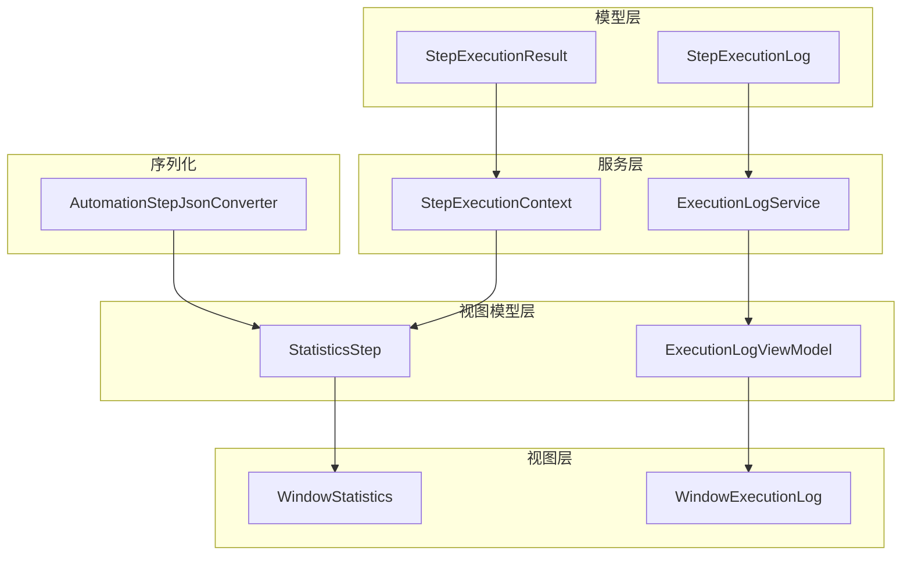
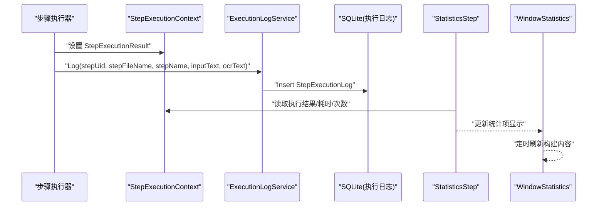
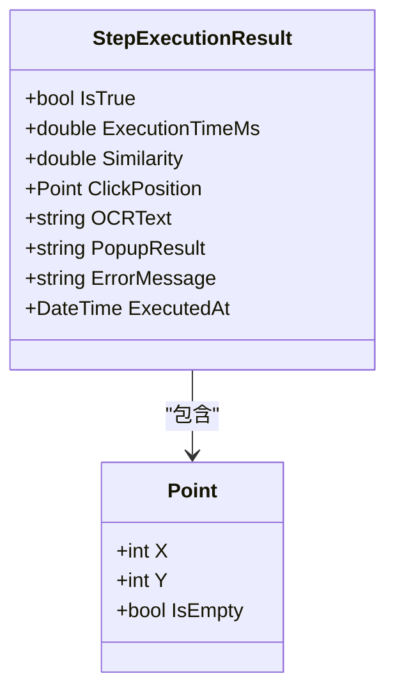
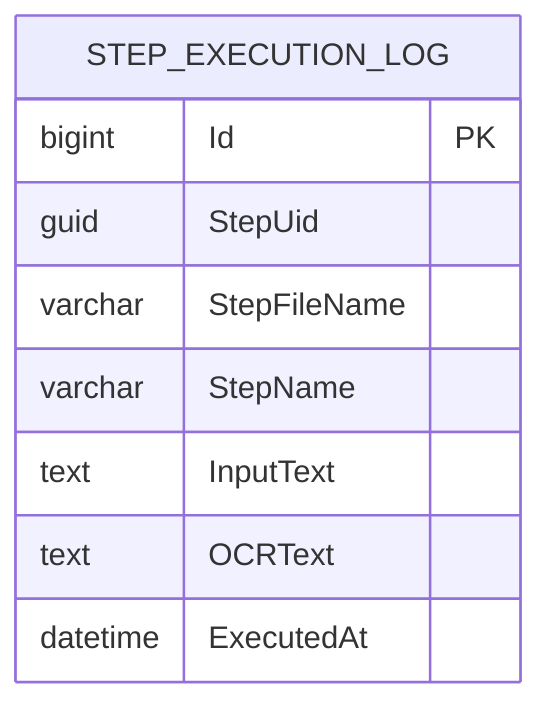
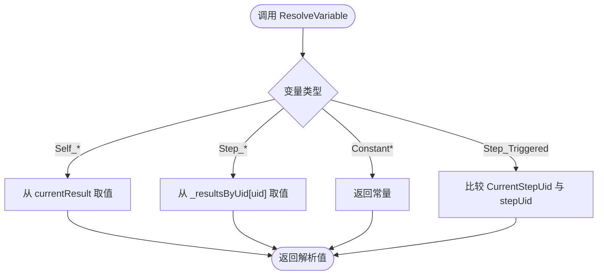
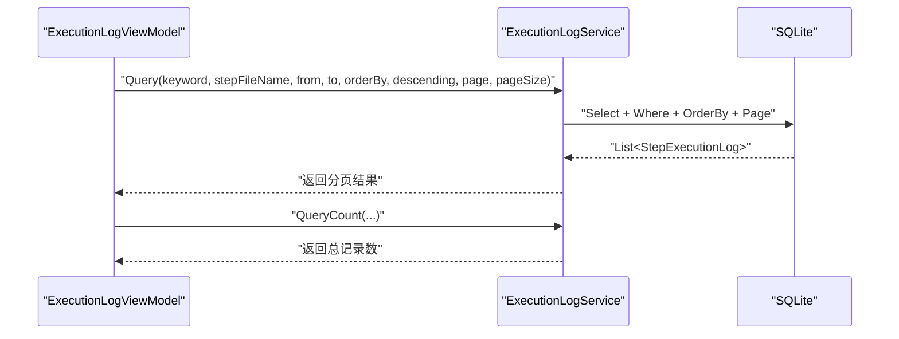
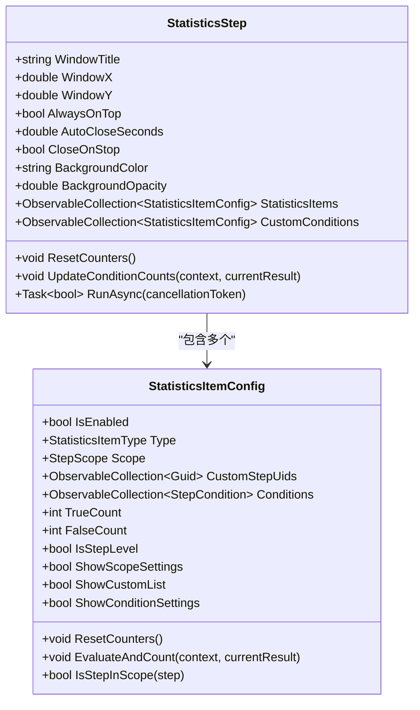
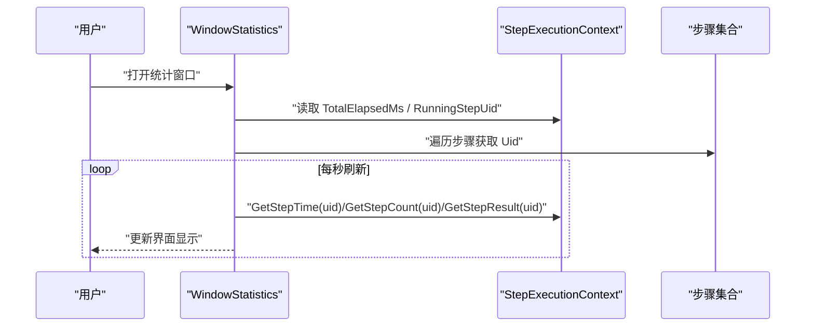
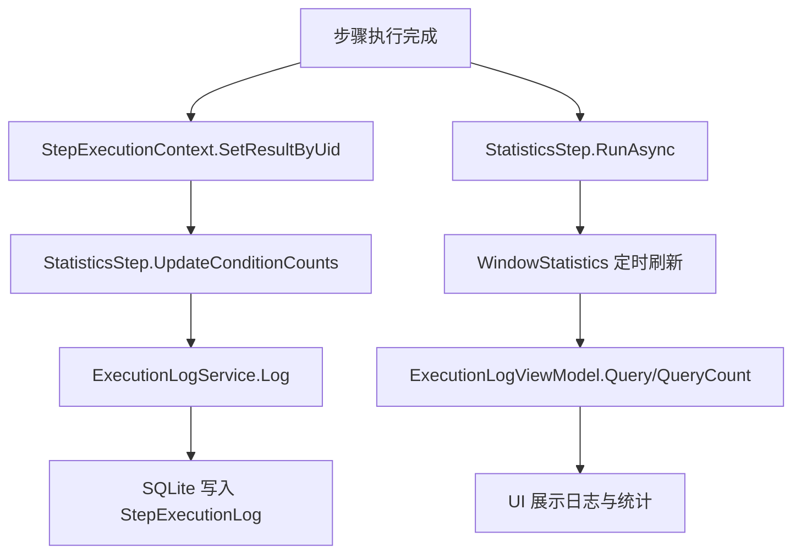
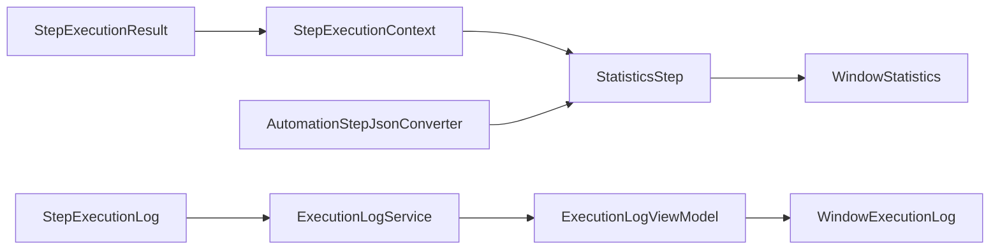

# 执行结果模型

<cite>
**本文引用的文件**   
- [StepExecutionResult.cs](file://ShaoLu/Models/StepExecutionResult.cs)
- [StepExecutionLog.cs](file://ShaoLu/Models/StepExecutionLog.cs)
- [ExecutionLogService.cs](file://ShaoLu/Services/ExecutionLogService.cs)
- [StepExecutionContext.cs](file://ShaoLu/Services/StepExecutionContext.cs)
- [StatisticsStep.cs](file://ShaoLu/Viewmodels/StatisticsStep.cs)
- [WindowStatistics.xaml.cs](file://ShaoLu/Views/WindowStatistics.xaml.cs)
- [ExecutionLogViewModel.cs](file://ShaoLu/Viewmodels/ExecutionLogViewModel.cs)
- [WindowExecutionLog.xaml.cs](file://ShaoLu/Views/WindowExecutionLog.xaml.cs)
- [AutomationStepJsonConverter.cs](file://ShaoLu/Converters/AutomationStepJsonConverter.cs)
- [ModelTests.cs](file://NUnitTest/ModelTests.cs)
</cite>

## 目录
1. [简介](#简介)
2. [项目结构](#项目结构)
3. [核心组件](#核心组件)
4. [架构总览](#架构总览)
5. [详细组件分析](#详细组件分析)
6. [依赖关系分析](#依赖关系分析)
7. [性能考虑](#性能考虑)
8. [故障排查指南](#故障排查指南)
9. [结论](#结论)
10. [附录：使用示例与最佳实践](#附录使用示例与最佳实践)

## 简介
本文件围绕 ShaoLu 的执行结果模型进行系统化文档化，重点覆盖以下方面：
- StepExecutionResult 的数据结构设计：执行状态、耗时统计、图像识别相似度、点击位置、OCR 文本、弹窗选择、错误信息与执行时间。
- StepExecutionLog 的日志记录机制与数据结构：步骤标识、文件名、名称、输入内容、OCR 结果与执行时间。
- 执行结果的序列化与持久化策略：内存上下文、SQLite + FreeSql 持久化、JSON 多态序列化支持。
- 结果分析、统计与报告生成功能：条件计数、运行期统计窗口、分页查询与筛选。
- 执行监控与调试的实际使用示例：统计悬浮窗、执行日志查看器、变量解析与条件判断。

## 项目结构
与执行结果模型直接相关的代码分布在 Models、Services、Viewmodels 与 Views 四个层次：
- Models：定义 StepExecutionResult、StepExecutionLog 等数据模型。
- Services：提供 StepExecutionContext（运行时上下文）、ExecutionLogService（日志服务）。
- Viewmodels：提供 ExecutionLogViewModel（日志视图模型）、StatisticsStep（统计步骤）。
- Views：提供 WindowStatistics（统计悬浮窗）、WindowExecutionLog（日志查看窗口）。
- Converters：提供 AutomationStepBaseJsonConverter（多态 JSON 序列化）。

**图表来源** 
- [StepExecutionResult.cs:1-51](file://ShaoLu/Models/StepExecutionResult.cs#L1-L51)
- [StepExecutionLog.cs:1-47](file://ShaoLu/Models/StepExecutionLog.cs#L1-L47)
- [StepExecutionContext.cs:1-163](file://ShaoLu/Services/StepExecutionContext.cs#L1-L163)
- [ExecutionLogService.cs:1-179](file://ShaoLu/Services/ExecutionLogService.cs#L1-L179)
- [StatisticsStep.cs:1-459](file://ShaoLu/Viewmodels/StatisticsStep.cs#L1-L459)
- [ExecutionLogViewModel.cs:1-230](file://ShaoLu/Viewmodels/ExecutionLogViewModel.cs#L1-L230)
- [WindowStatistics.xaml.cs:1-287](file://ShaoLu/Views/WindowStatistics.xaml.cs#L1-L287)
- [WindowExecutionLog.xaml.cs:1-47](file://ShaoLu/Views/WindowExecutionLog.xaml.cs#L1-L47)
- [AutomationStepJsonConverter.cs:1-185](file://ShaoLu/Converters/AutomationStepJsonConverter.cs#L1-L185)

**章节来源**
- [StepExecutionResult.cs:1-51](file://ShaoLu/Models/StepExecutionResult.cs#L1-L51)
- [StepExecutionLog.cs:1-47](file://ShaoLu/Models/StepExecutionLog.cs#L1-L47)
- [ExecutionLogService.cs:1-179](file://ShaoLu/Services/ExecutionLogService.cs#L1-L179)
- [StepExecutionContext.cs:1-163](file://ShaoLu/Services/StepExecutionContext.cs#L1-L163)
- [StatisticsStep.cs:1-459](file://ShaoLu/Viewmodels/StatisticsStep.cs#L1-L459)
- [ExecutionLogViewModel.cs:1-230](file://ShaoLu/Viewmodels/ExecutionLogViewModel.cs#L1-L230)
- [WindowStatistics.xaml.cs:1-287](file://ShaoLu/Views/WindowStatistics.xaml.cs#L1-L287)
- [WindowExecutionLog.xaml.cs:1-47](file://ShaoLu/Views/WindowExecutionLog.xaml.cs#L1-L47)
- [AutomationStepJsonConverter.cs:1-185](file://ShaoLu/Converters/AutomationStepJsonConverter.cs#L1-L185)

## 核心组件
- StepExecutionResult：封装单次步骤执行的完整结果，包括布尔结果、耗时、相似度、点击坐标、OCR 文本、弹窗选择、错误信息、执行时间。
- StepExecutionLog：持久化的执行日志实体，包含步骤 UID、文件名、名称、输入文本、OCR 文本与执行时间。
- StepExecutionContext：运行时上下文，维护所有步骤的执行结果、执行次数、当前/正在执行步骤 UID、总计时，并提供变量解析能力。
- ExecutionLogService：基于 FreeSql + SQLite 的日志服务，提供写入、分页查询、去重文件名列表、清理旧日志等功能。
- StatisticsStep：统计步骤，支持多种统计项类型（总耗时、步骤耗时、步骤次数、步骤结果、条件计数、当前步骤），并驱动统计悬浮窗展示。
- ExecutionLogViewModel：日志查看器的 ViewModel，支持关键字搜索、按文件名/时间范围筛选、排序与分页。
- WindowStatistics / WindowExecutionLog：UI 窗口，分别用于实时统计展示与历史日志浏览。
- AutomationStepJsonConverter：多态 JSON 转换器，支持自动化步骤基类及其派生类的序列化和反序列化，兼容旧格式字段。

**章节来源**
- [StepExecutionResult.cs:1-51](file://ShaoLu/Models/StepExecutionResult.cs#L1-L51)
- [StepExecutionLog.cs:1-47](file://ShaoLu/Models/StepExecutionLog.cs#L1-L47)
- [StepExecutionContext.cs:1-163](file://ShaoLu/Services/StepExecutionContext.cs#L1-L163)
- [ExecutionLogService.cs:1-179](file://ShaoLu/Services/ExecutionLogService.cs#L1-L179)
- [StatisticsStep.cs:1-459](file://ShaoLu/Viewmodels/StatisticsStep.cs#L1-L459)
- [ExecutionLogViewModel.cs:1-230](file://ShaoLu/Viewmodels/ExecutionLogViewModel.cs#L1-L230)
- [WindowStatistics.xaml.cs:1-287](file://ShaoLu/Views/WindowStatistics.xaml.cs#L1-L287)
- [WindowExecutionLog.xaml.cs:1-47](file://ShaoLu/Views/WindowExecutionLog.xaml.cs#L1-L47)
- [AutomationStepJsonConverter.cs:1-185](file://ShaoLu/Converters/AutomationStepJsonConverter.cs#L1-L185)

## 架构总览
执行结果模型贯穿“运行期内存”和“持久化存储”两条主线：
- 运行期：StepExecutionContext 集中管理 StepExecutionResult，供条件判断与统计展示。
- 持久化：ExecutionLogService 将 StepExecutionLog 写入 SQLite；UI 通过 ExecutionLogViewModel 查询与展示。
- 统计：StatisticsStep 驱动 WindowStatistics 定时刷新，读取 StepExecutionContext 计算各项指标。
- 序列化：AutomationStepJsonConverter 负责步骤模型的 JSON 序列化/反序列化，保证多态与兼容性。

**图表来源** 
- [StepExecutionContext.cs:1-163](file://ShaoLu/Services/StepExecutionContext.cs#L1-L163)
- [ExecutionLogService.cs:1-179](file://ShaoLu/Services/ExecutionLogService.cs#L1-L179)
- [StatisticsStep.cs:1-459](file://ShaoLu/Viewmodels/StatisticsStep.cs#L1-L459)
- [WindowStatistics.xaml.cs:1-287](file://ShaoLu/Views/WindowStatistics.xaml.cs#L1-L287)

## 详细组件分析

### StepExecutionResult 数据结构与复杂度
- 字段说明：
  - IsTrue：步骤执行是否成功。
  - ExecutionTimeMs：执行耗时（毫秒）。
  - Similarity：图像识别相似度（-1 表示不适用）。
  - ClickPosition：点击位置（Point）。
  - OCRText：OCR 识别文本。
  - PopupResult：弹出框用户选择的按钮值。
  - ErrorMessage：错误信息。
  - ExecutedAt：执行时间（默认当前时间）。
- 设计要点：
  - 轻量级值对象，适合在内存中频繁创建与传递。
  - 默认值明确（如 Similarity = -1），便于 UI 与逻辑区分“未使用”场景。
- 复杂度：
  - 空间复杂度 O(1)，每次实例占用固定大小。
  - 读写操作均为 O(1)。

**图表来源** 
- [StepExecutionResult.cs:1-51](file://ShaoLu/Models/StepExecutionResult.cs#L1-L51)
- [AutoguiModel.cs:1-61](file://ShaoLu/Models/AutoguiModel.cs#L1-L61)

**章节来源**
- [StepExecutionResult.cs:1-51](file://ShaoLu/Models/StepExecutionResult.cs#L1-L51)
- [ModelTests.cs:87-124](file://NUnitTest/ModelTests.cs#L87-L124)

### StepExecutionLog 日志结构与持久化
- 字段说明：
  - Id：自增主键。
  - StepUid：步骤唯一标识。
  - StepFileName：步骤文件名（无扩展名）。
  - StepName：步骤名称。
  - InputText：本次执行的输入内容。
  - OCRText：OCR 识别结果（可选）。
  - ExecutedAt：执行时间。
- 持久化策略：
  - 使用 FreeSql 注解映射表名与列属性。
  - ExecutionLogService 通过单例 IFreeSql 连接 SQLite，自动同步结构。
  - 写入失败时记录 NLog 错误，避免阻塞主流程。

**图表来源** 
- [StepExecutionLog.cs:1-47](file://ShaoLu/Models/StepExecutionLog.cs#L1-L47)

**章节来源**
- [StepExecutionLog.cs:1-47](file://ShaoLu/Models/StepExecutionLog.cs#L1-L47)
- [ExecutionLogService.cs:1-179](file://ShaoLu/Services/ExecutionLogService.cs#L1-L179)
- [ModelTests.cs:272-295](file://NUnitTest/ModelTests.cs#L272-L295)

### StepExecutionContext 执行上下文与变量解析
- 职责：
  - 维护每个步骤行号与 Uid 对应的 StepExecutionResult。
  - 维护每个 Uid 的执行次数。
  - 维护总计时与当前/正在执行步骤 Uid。
  - 提供 ResolveVariable 方法，根据 ConditionVariable 解析实际值（支持 Self_* 与 Step_* 引用）。
- 关键方法：
  - SetResult/SetResultByUid：设置执行结果。
  - GetResult/GetResultByUid：获取执行结果。
  - GetStepTime/GetStepCount/GetStepResult：便捷访问统计信息。
  - ResolveVariable：条件变量解析，支持常量、自身属性、引用步骤属性、Triggered 标志。

**图表来源** 
- [StepExecutionContext.cs:1-163](file://ShaoLu/Services/StepExecutionContext.cs#L1-L163)

**章节来源**
- [StepExecutionContext.cs:1-163](file://ShaoLu/Services/StepExecutionContext.cs#L1-L163)

### ExecutionLogService 日志服务与查询
- 功能：
  - Log：插入一条 StepExecutionLog，异常时记录 NLog。
  - Query：分页查询，支持关键字、文件名、UID、时间范围、排序。
  - QueryCount：统计符合条件的总数。
  - GetDistinctFileNames：获取不重复的文件名列表。
  - CleanupOldLogs：按保留天数清理旧日志。
- 数据库路径：
  - 位于应用数据目录下的 AutoShaoLu/execution_log.db。

**图表来源** 
- [ExecutionLogViewModel.cs:1-230](file://ShaoLu/Viewmodels/ExecutionLogViewModel.cs#L1-L230)
- [ExecutionLogService.cs:1-179](file://ShaoLu/Services/ExecutionLogService.cs#L1-L179)

**章节来源**
- [ExecutionLogService.cs:1-179](file://ShaoLu/Services/ExecutionLogService.cs#L1-L179)
- [ExecutionLogViewModel.cs:1-230](file://ShaoLu/Viewmodels/ExecutionLogViewModel.cs#L1-L230)

### StatisticsStep 统计项与条件计数
- 统计项类型：
  - TotalExecutionTime：总执行时间。
  - StepExecutionTime：步骤执行时间。
  - StepExecutionCount：步骤执行次数。
  - StepExecutionResult：步骤执行结果描述。
  - ConditionCount：条件计数（true/false 累计）。
  - CurrentStep：当前执行步骤。
- 统计范围：All、LoggedOnly、Custom（自选 Uid）。
- 条件计数：
  - 通过 EvaluateAndCount 调用 ConditionEvaluator 评估规则，累计 TrueCount/FalseCount。
  - UpdateConditionCounts 在每个步骤执行后统一更新。
- 统计窗口：
  - StatisticsStep.RunAsync 打开或激活 WindowStatistics，每 1 秒刷新一次。
  - WindowStatistics 根据 StatisticsItemConfig 动态生成表格与文本块。

**图表来源** 
- [StatisticsStep.cs:1-459](file://ShaoLu/Viewmodels/StatisticsStep.cs#L1-L459)

**章节来源**
- [StatisticsStep.cs:1-459](file://ShaoLu/Viewmodels/StatisticsStep.cs#L1-L459)
- [WindowStatistics.xaml.cs:1-287](file://ShaoLu/Views/WindowStatistics.xaml.cs#L1-L287)

### 执行监控与调试：统计悬浮窗与日志查看器
- 统计悬浮窗（WindowStatistics）：
  - 支持总耗时、当前步骤、条件计数、步骤耗时/次数/结果等展示。
  - 支持背景颜色与透明度配置，自动关闭与置顶。
  - 定时刷新（1 秒）以反映最新执行状态。
- 日志查看器（WindowExecutionLog）：
  - 支持关键字搜索（匹配 InputText 或 StepName）。
  - 支持按文件名、时间范围筛选与排序。
  - 分页加载，点击截断文本可预览完整内容。

**图表来源** 
- [WindowStatistics.xaml.cs:1-287](file://ShaoLu/Views/WindowStatistics.xaml.cs#L1-L287)
- [StepExecutionContext.cs:1-163](file://ShaoLu/Services/StepExecutionContext.cs#L1-L163)

**章节来源**
- [WindowStatistics.xaml.cs:1-287](file://ShaoLu/Views/WindowStatistics.xaml.cs#L1-L287)
- [WindowExecutionLog.xaml.cs:1-47](file://ShaoLu/Views/WindowExecutionLog.xaml.cs#L1-L47)
- [ExecutionLogViewModel.cs:1-230](file://ShaoLu/Viewmodels/ExecutionLogViewModel.cs#L1-L230)

### 序列化与持久化策略
- 内存上下文：StepExecutionContext 使用字典缓存 StepExecutionResult，按行号与 Uid 双索引，支持快速查找与统计。
- 持久化：ExecutionLogService 使用 FreeSql 连接 SQLite，自动建表与插入；支持分页查询与清理策略。
- JSON 序列化：AutomationStepJsonConverter 支持多态序列化，兼容旧格式（数字类型的 TrueGoto/FalseGoto），确保反序列化稳定性。

**图表来源** 
- [StepExecutionContext.cs:1-163](file://ShaoLu/Services/StepExecutionContext.cs#L1-L163)
- [ExecutionLogService.cs:1-179](file://ShaoLu/Services/ExecutionLogService.cs#L1-L179)
- [StatisticsStep.cs:1-459](file://ShaoLu/Viewmodels/StatisticsStep.cs#L1-L459)
- [AutomationStepJsonConverter.cs:1-185](file://ShaoLu/Converters/AutomationStepJsonConverter.cs#L1-L185)

**章节来源**
- [AutomationStepJsonConverter.cs:1-185](file://ShaoLu/Converters/AutomationStepJsonConverter.cs#L1-L185)

## 依赖关系分析
- StepExecutionResult 被 StepExecutionContext、StatisticsStep、UI 展示广泛使用。
- StepExecutionLog 由 ExecutionLogService 写入，被 ExecutionLogViewModel 查询。
- StepExecutionContext 为条件判断与统计的核心依赖。
- StatisticsStep 依赖 StepExecutionContext 与 ConditionEvaluator（通过 EvaluateAndCount）。
- WindowStatistics 依赖 StatisticsStep 的配置与 StepExecutionContext 的数据。
- ExecutionLogViewModel 依赖 ExecutionLogService 的分页查询。
- AutomationStepJsonConverter 依赖步骤基类与枚举映射，保障序列化兼容性。

**图表来源** 
- [StepExecutionResult.cs:1-51](file://ShaoLu/Models/StepExecutionResult.cs#L1-L51)
- [StepExecutionLog.cs:1-47](file://ShaoLu/Models/StepExecutionLog.cs#L1-L47)
- [StepExecutionContext.cs:1-163](file://ShaoLu/Services/StepExecutionContext.cs#L1-L163)
- [ExecutionLogService.cs:1-179](file://ShaoLu/Services/ExecutionLogService.cs#L1-L179)
- [StatisticsStep.cs:1-459](file://ShaoLu/Viewmodels/StatisticsStep.cs#L1-L459)
- [ExecutionLogViewModel.cs:1-230](file://ShaoLu/Viewmodels/ExecutionLogViewModel.cs#L1-L230)
- [WindowStatistics.xaml.cs:1-287](file://ShaoLu/Views/WindowStatistics.xaml.cs#L1-L287)
- [WindowExecutionLog.xaml.cs:1-47](file://ShaoLu/Views/WindowExecutionLog.xaml.cs#L1-L47)
- [AutomationStepJsonConverter.cs:1-185](file://ShaoLu/Converters/AutomationStepJsonConverter.cs#L1-L185)

**章节来源**
- [StepExecutionContext.cs:1-163](file://ShaoLu/Services/StepExecutionContext.cs#L1-L163)
- [ExecutionLogService.cs:1-179](file://ShaoLu/Services/ExecutionLogService.cs#L1-L179)
- [StatisticsStep.cs:1-459](file://ShaoLu/Viewmodels/StatisticsStep.cs#L1-L459)
- [ExecutionLogViewModel.cs:1-230](file://ShaoLu/Viewmodels/ExecutionLogViewModel.cs#L1-L230)
- [WindowStatistics.xaml.cs:1-287](file://ShaoLu/Views/WindowStatistics.xaml.cs#L1-L287)
- [WindowExecutionLog.xaml.cs:1-47](file://ShaoLu/Views/WindowExecutionLog.xaml.cs#L1-L47)
- [AutomationStepJsonConverter.cs:1-185](file://ShaoLu/Converters/AutomationStepJsonConverter.cs#L1-L185)

## 性能考虑
- 内存上下文：
  - 使用 Dictionary 实现 O(1) 查找，避免线性扫描。
  - 每次运行前 Clear，防止内存泄漏。
- 日志写入：
  - 异步写入失败不影响主流程，异常记录到 NLog。
  - 建议合理设置保留天数，定期清理旧日志。
- 查询性能：
  - 分页查询减少 UI 渲染压力。
  - 关键字与时间范围过滤在数据库层执行，降低内存占用。
- 统计刷新：
  - 1 秒定时器平衡实时性与资源消耗。
  - 大列表情况下注意 UI 线程调度，避免卡顿。

[本节为通用指导，无需具体文件引用]

## 故障排查指南
- 日志写入失败：
  - 检查数据库目录是否存在，权限是否足够。
  - 查看 NLog 输出定位具体异常。
- 查询为空或分页异常：
  - 确认筛选条件是否正确（keyword、stepFileName、时间范围）。
  - 检查数据库是否已初始化（首次运行可能尚未创建）。
- 统计窗口不刷新：
  - 确认 StatisticsStep 已启用相关统计项。
  - 检查 StepExecutionContext 是否有正确的执行结果与计时。
- JSON 反序列化失败：
  - 确认 Type 字段存在且合法。
  - 处理旧格式数字类型的 TrueGoto/FalseGoto 字段。

**章节来源**
- [ExecutionLogService.cs:1-179](file://ShaoLu/Services/ExecutionLogService.cs#L1-L179)
- [ExecutionLogViewModel.cs:1-230](file://ShaoLu/Viewmodels/ExecutionLogViewModel.cs#L1-L230)
- [WindowStatistics.xaml.cs:1-287](file://ShaoLu/Views/WindowStatistics.xaml.cs#L1-L287)
- [AutomationStepJsonConverter.cs:1-185](file://ShaoLu/Converters/AutomationStepJsonConverter.cs#L1-L185)

## 结论
ShaoLu 的执行结果模型通过清晰的数据结构与分层架构，实现了高效的运行期管理与可靠的持久化记录。StepExecutionResult 与 StepExecutionLog 分别承担内存与磁盘的职责，StepExecutionContext 与 ExecutionLogService 提供强大的上下文与查询能力。StatisticsStep 与相关 UI 组件共同构建了完整的执行监控与调试体验。结合 JSON 多态序列化，系统在可扩展性与兼容性方面表现良好。

[本节为总结性内容，无需具体文件引用]

## 附录：使用示例与最佳实践
- 记录执行日志：
  - 在步骤执行完成后调用 ExecutionLogService.Log，传入步骤 UID、文件名、名称、输入文本与 OCR 文本。
- 查询执行日志：
  - 使用 ExecutionLogViewModel 提供的 SearchCommand、ResetCommand 与分页命令进行交互。
  - 支持关键字、文件名、时间范围筛选与排序。
- 统计与监控：
  - 添加 StatisticsStep，勾选需要的统计项类型。
  - 运行后打开统计悬浮窗，观察实时数据。
- 条件判断与变量解析：
  - 使用 StepExecutionContext.ResolveVariable 解析 Self_* 与 Step_* 变量。
  - 在条件评估中使用 ConditionEvaluator 进行复杂规则判断。
- 序列化与反序列化：
  - 使用 AutomationStepJsonConverter 进行步骤模型的 JSON 序列化/反序列化。
  - 注意兼容旧格式字段，避免反序列化失败。

**章节来源**
- [ExecutionLogService.cs:1-179](file://ShaoLu/Services/ExecutionLogService.cs#L1-L179)
- [ExecutionLogViewModel.cs:1-230](file://ShaoLu/Viewmodels/ExecutionLogViewModel.cs#L1-L230)
- [StatisticsStep.cs:1-459](file://ShaoLu/Viewmodels/StatisticsStep.cs#L1-L459)
- [StepExecutionContext.cs:1-163](file://ShaoLu/Services/StepExecutionContext.cs#L1-L163)
- [AutomationStepJsonConverter.cs:1-185](file://ShaoLu/Converters/AutomationStepJsonConverter.cs#L1-L185)