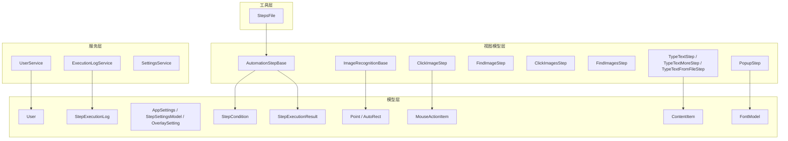
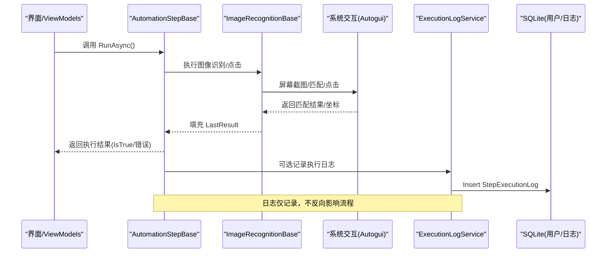
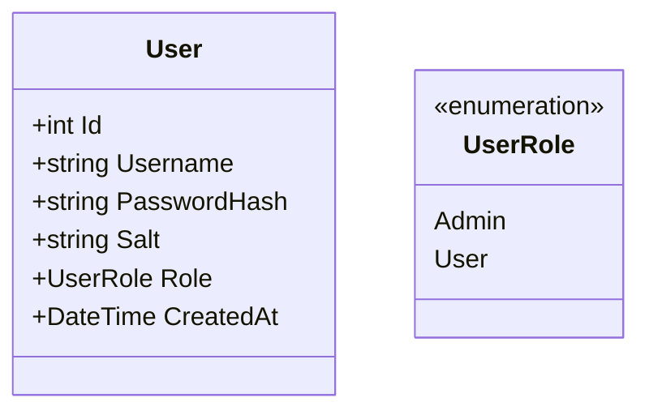
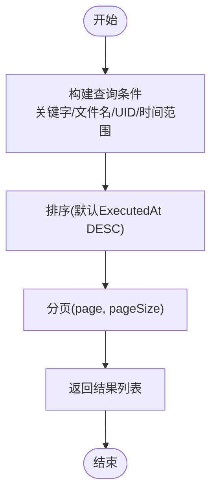
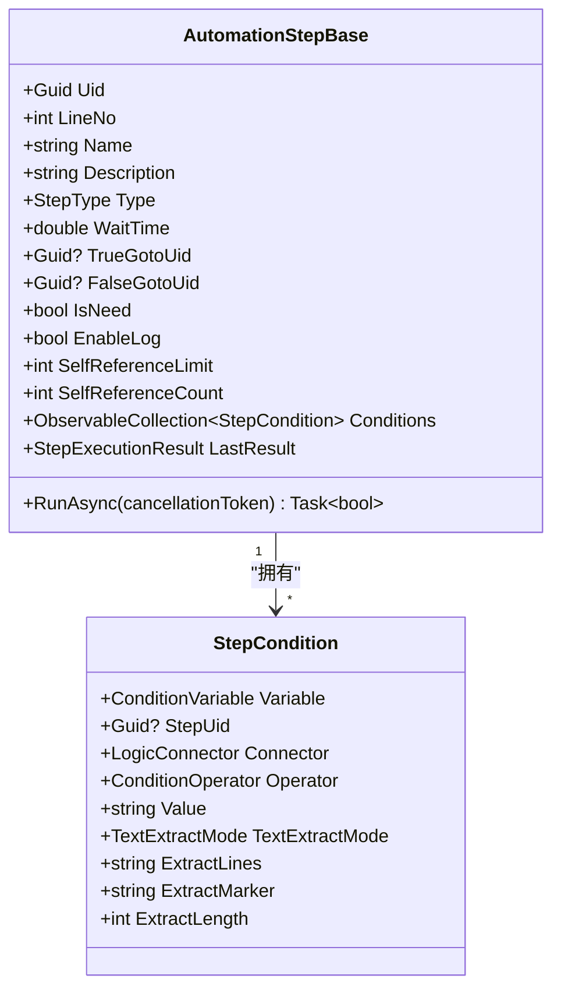
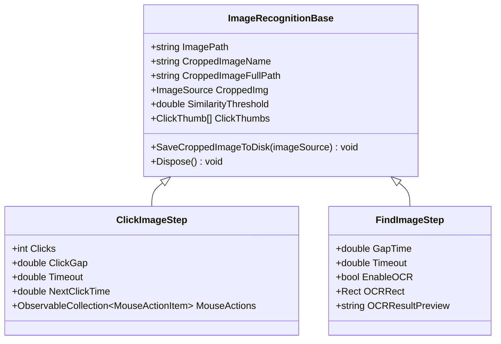
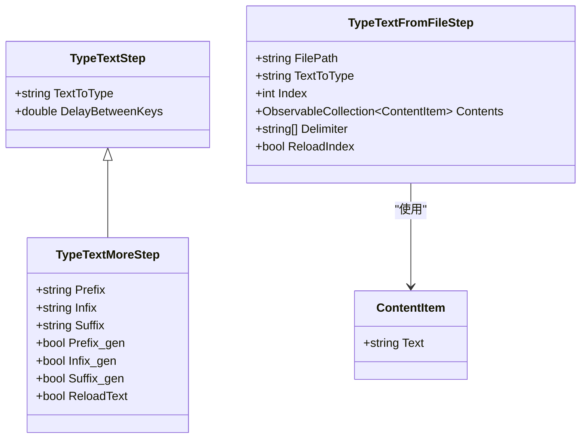
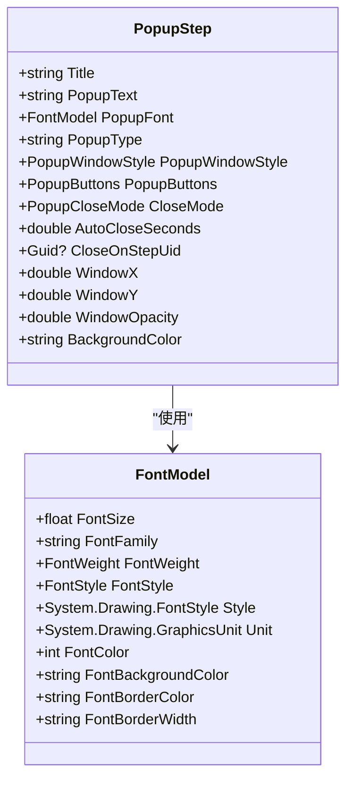
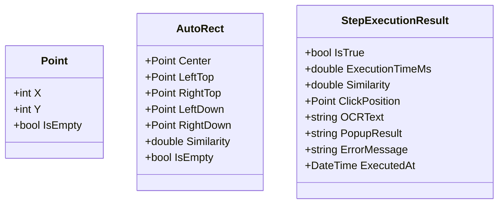
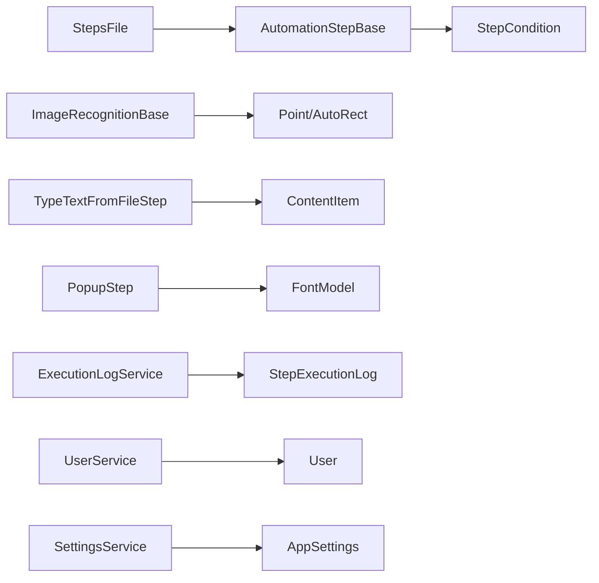

# 数据关系映射

<cite>
**本文引用的文件**   
- [AutoguiModel.cs](file://ShaoLu/Models/AutoguiModel.cs)
- [AutomationStepModel.cs](file://ShaoLu/Models/AutomationStepModel.cs)
- [User.cs](file://ShaoLu/Models/User.cs)
- [Settings.cs](file://ShaoLu/Models/Settings.cs)
- [StepExecutionLog.cs](file://ShaoLu/Models/StepExecutionLog.cs)
- [StepCondition.cs](file://ShaoLu/Models/StepCondition.cs)
- [MouseActionItem.cs](file://ShaoLu/Models/MouseActionItem.cs)
- [ContentItem.cs](file://ShaoLu/Models/ContentItem.cs)
- [FontModel.cs](file://ShaoLu/Models/FontModel.cs)
- [StepExecutionResult.cs](file://ShaoLu/Models/StepExecutionResult.cs)
- [AutomationStep.cs](file://ShaoLu/Viewmodels/AutomationStep.cs)
- [ImagesRecognition.cs](file://ShaoLu/Viewmodels/ImagesRecognition.cs)
- [ImageRecognition.cs](file://ShaoLu/Viewmodels/ImageRecognition.cs)
- [UserService.cs](file://ShaoLu/Services/UserService.cs)
- [ExecutionLogService.cs](file://ShaoLu/Services/ExecutionLogService.cs)
- [StepsFile.cs](file://ShaoLu/Utils/StepsFile.cs)
- [SettingsService.cs](file://ShaoLu/Services/SettingsService.cs)
</cite>

## 目录
1. [简介](#简介)
2. [项目结构](#项目结构)
3. [核心组件](#核心组件)
4. [架构总览](#架构总览)
5. [详细组件分析](#详细组件分析)
6. [依赖分析](#依赖分析)
7. [性能考虑](#性能考虑)
8. [故障排查指南](#故障排查指南)
9. [结论](#结论)
10. [附录](#附录)

## 简介
本文件面向 ShaoLu 的数据关系映射，系统性梳理数据模型、视图模型与服务层之间的关联与依赖，明确实体间引用关系、外键约束与级联策略，解释数据完整性保证机制与业务规则验证，并给出数据迁移策略、版本兼容性处理、操作示例与性能优化建议。读者无需深入代码即可理解整体数据流与关键约束。

## 项目结构
ShaoLu 采用分层组织：
- Models：纯数据模型与枚举（用户、步骤执行日志、设置、条件、鼠标动作、图像几何等）
- Viewmodels：自动化步骤的运行时状态与行为（点击/查找图像、文本输入、弹出框、统计等）
- Services：持久化与业务能力（用户管理、执行日志、OCR、设置）
- Utils：序列化与文件打包（步骤包 .autostep、JSON 兼容）

图表来源
- [AutomationStep.cs](file://ShaoLu/Viewmodels/AutomationStep.cs)
- [ImageRecognition.cs](file://ShaoLu/Viewmodels/ImageRecognition.cs)
- [ImagesRecognition.cs](file://ShaoLu/Viewmodels/ImagesRecognition.cs)
- [StepCondition.cs](file://ShaoLu/Models/StepCondition.cs)
- [MouseActionItem.cs](file://ShaoLu/Models/MouseActionItem.cs)
- [ContentItem.cs](file://ShaoLu/Models/ContentItem.cs)
- [FontModel.cs](file://ShaoLu/Models/FontModel.cs)
- [StepExecutionResult.cs](file://ShaoLu/Models/StepExecutionResult.cs)
- [AutoguiModel.cs](file://ShaoLu/Models/AutoguiModel.cs)
- [UserService.cs](file://ShaoLu/Services/UserService.cs)
- [ExecutionLogService.cs](file://ShaoLu/Services/ExecutionLogService.cs)
- [StepsFile.cs](file://ShaoLu/Utils/StepsFile.cs)
- [SettingsService.cs](file://ShaoLu/Services/SettingsService.cs)

章节来源
- [AutomationStep.cs](file://ShaoLu/Viewmodels/AutomationStep.cs)
- [ImageRecognition.cs](file://ShaoLu/Viewmodels/ImageRecognition.cs)
- [ImagesRecognition.cs](file://ShaoLu/Viewmodels/ImagesRecognition.cs)
- [StepCondition.cs](file://ShaoLu/Models/StepCondition.cs)
- [MouseActionItem.cs](file://ShaoLu/Models/MouseActionItem.cs)
- [ContentItem.cs](file://ShaoLu/Models/ContentItem.cs)
- [FontModel.cs](file://ShaoLu/Models/FontModel.cs)
- [StepExecutionResult.cs](file://ShaoLu/Models/StepExecutionResult.cs)
- [AutoguiModel.cs](file://ShaoLu/Models/AutoguiModel.cs)
- [UserService.cs](file://ShaoLu/Services/UserService.cs)
- [ExecutionLogService.cs](file://ShaoLu/Services/ExecutionLogService.cs)
- [StepsFile.cs](file://ShaoLu/Utils/StepsFile.cs)
- [SettingsService.cs](file://ShaoLu/Services/SettingsService.cs)

## 核心组件
- 用户模型 User：使用 FreeSql 注解映射到表 app_user，包含用户名、密码哈希、盐、角色、创建时间；主键自增，字段长度与可空性由注解约束。
- 执行日志 StepExecutionLog：记录每次步骤执行的输入、OCR 结果、时间与步骤标识；主键自增，长文本字段无长度限制。
- 步骤基类 AutomationStepBase：定义步骤通用属性（Uid、行号、名称、描述、类型、等待时间、跳转目标 Uid、错误信息、是否启用日志、自引用限制与计数）、条件集合与执行结果。
- 图像识别基类 ImageRecognitionBase：封装图片路径、裁剪图保存、相似度阈值、点击点集、OCR 区域等；提供资源释放。
- 具体步骤：ClickImageStep、FindImageStep、ClickImagesStep、FindImagesStep、TypeTextStep、TypeTextMoreStep、TypeTextFromFileStep、PopupStep 等，各自扩展特定属性与 RunAsync 逻辑。
- 条件 StepCondition：支持变量、运算符、连接器、文本提取模式与多行/子串/长度提取，用于自定义条件判断。
- 鼠标动作 MouseActionItem：定义动作类型、次数、间隔。
- 内容项 ContentItem 及集合转换器：用于批量文本内容的双向绑定与 JSON 兼容。
- 字体 FontModel：封装字体族、大小、粗细、样式、颜色等。
- 执行结果 StepExecutionResult：结构化记录 IsTrue、耗时、相似度、点击位置、OCR 文本、弹窗结果、错误信息与时间。
- 几何 Point/AutoRect：屏幕坐标与矩形计算，含中心点与四角推导。

章节来源
- [User.cs](file://ShaoLu/Models/User.cs)
- [StepExecutionLog.cs](file://ShaoLu/Models/StepExecutionLog.cs)
- [AutomationStep.cs](file://ShaoLu/Viewmodels/AutomationStep.cs)
- [ImageRecognition.cs](file://ShaoLu/Viewmodels/ImageRecognition.cs)
- [ImagesRecognition.cs](file://ShaoLu/Viewmodels/ImagesRecognition.cs)
- [StepCondition.cs](file://ShaoLu/Models/StepCondition.cs)
- [MouseActionItem.cs](file://ShaoLu/Models/MouseActionItem.cs)
- [ContentItem.cs](file://ShaoLu/Models/ContentItem.cs)
- [FontModel.cs](file://ShaoLu/Models/FontModel.cs)
- [StepExecutionResult.cs](file://ShaoLu/Models/StepExecutionResult.cs)
- [AutoguiModel.cs](file://ShaoLu/Models/AutoguiModel.cs)

## 架构总览
ShaoLu 的数据流围绕“步骤执行”展开：
- 步骤模型通过 Uid 相互引用实现跳转控制与条件引用。
- 执行过程中产生 StepExecutionResult，并可写入 StepExecutionLog 持久化。
- 用户管理与权限由 UserService 基于 SQLite 维护。
- 设置通过 SettingsService 读写 settings.json。
- 步骤包以 .autostep（zip）形式存储 steps.json 与 images 目录，StepsFile 负责加载/保存与旧格式兼容。

图表来源
- [AutomationStep.cs](file://ShaoLu/Viewmodels/AutomationStep.cs)
- [ImageRecognition.cs](file://ShaoLu/Viewmodels/ImageRecognition.cs)
- [ImagesRecognition.cs](file://ShaoLu/Viewmodels/ImagesRecognition.cs)
- [ExecutionLogService.cs](file://ShaoLu/Services/ExecutionLogService.cs)

## 详细组件分析

### 用户与权限数据模型
- 表名与字段映射：app_user(id, username, password_hash, salt, role, created_at)
- 约束与完整性：
  - id 为主键自增
  - username 非空且长度上限
  - password_hash/salt 为安全存储
  - role 为枚举映射字符串
- 业务规则：
  - 登录校验使用 PBKDF2-SHA256 + Salt
  - 删除用户时不允许删除最后一个管理员
  - 注册新用户需管理员审批（若已有管理员）

图表来源
- [User.cs](file://ShaoLu/Models/User.cs)

章节来源
- [UserService.cs](file://ShaoLu/Services/UserService.cs)
- [User.cs](file://ShaoLu/Models/User.cs)

### 执行日志数据模型与查询
- 表名与字段映射：step_execution_log(Id, StepUid, StepFileName, StepName, InputText, OCRText, ExecutedAt)
- 索引与分页：按时间范围、关键字、文件名、步骤 UID 筛选，支持排序与分页
- 清理策略：根据保留天数清理过期日志

图表来源
- [ExecutionLogService.cs](file://ShaoLu/Services/ExecutionLogService.cs)
- [StepExecutionLog.cs](file://ShaoLu/Models/StepExecutionLog.cs)

章节来源
- [ExecutionLogService.cs](file://ShaoLu/Services/ExecutionLogService.cs)
- [StepExecutionLog.cs](file://ShaoLu/Models/StepExecutionLog.cs)

### 步骤模型与跳转/条件引用
- 步骤基类 AutomationStepBase：
  - Uid：唯一标识，反序列化时恢复原值
  - TrueGotoUid/FalseGotoUid：跳转目标 Uid
  - LineNo：行号（由集合维护或 UI 计算）
  - Conditions：自定义条件集合
  - SelfReferenceLimit/SelfReferenceCount：自引用限制与计数
- 条件 StepCondition：
  - Variable：当前步骤或引用步骤的变量（如 IsTrue、Similarity、OCRText、PopupResult、Triggered）
  - Operator：比较运算符（含正则）
  - Connector：And/Or 连接下一行
  - TextExtractMode：对 OCR 文本进行行/子串/长度提取
- 跳转解析：
  - 旧版 int 行号在加载后转换为 Uid 引用，确保向后兼容

图表来源
- [AutomationStep.cs](file://ShaoLu/Viewmodels/AutomationStep.cs)
- [StepCondition.cs](file://ShaoLu/Models/StepCondition.cs)

章节来源
- [AutomationStep.cs](file://ShaoLu/Viewmodels/AutomationStep.cs)
- [StepCondition.cs](file://ShaoLu/Models/StepCondition.cs)

### 图像识别与点击步骤
- ImageRecognitionBase：
  - ImagePath/CroppedImageName/CroppedImageFullPath：原图与裁剪图路径
  - CroppedImg：运行时缓存的 BitmapSource
  - SimilarityThreshold：相似度阈值
  - ClickThumbs/ClickPoints：点击点集
  - SaveCroppedImageToDisk：自动保存到工作目录 images/{Uid}.png
- ClickImageStep：支持多次点击、间隔、超时、鼠标动作序列
- FindImageStep：支持 OCR 区域识别，输出 OCRText 到 LastResult

图表来源
- [ImageRecognition.cs](file://ShaoLu/Viewmodels/ImageRecognition.cs)
- [MouseActionItem.cs](file://ShaoLu/Models/MouseActionItem.cs)

章节来源
- [ImageRecognition.cs](file://ShaoLu/Viewmodels/ImageRecognition.cs)
- [ImagesRecognition.cs](file://ShaoLu/Viewmodels/ImagesRecognition.cs)
- [MouseActionItem.cs](file://ShaoLu/Models/MouseActionItem.cs)

### 文本输入与批量内容
- TypeTextStep/TypeTextMoreStep：基础与增强文本输入，支持前缀/中缀/后缀生成
- TypeTextFromFileStep：从 txt/csv/xlsx 读取内容，使用 ContentItemCollectionConverter 兼容数组与对象格式

图表来源
- [AutomationStep.cs](file://ShaoLu/Viewmodels/AutomationStep.cs)
- [ContentItem.cs](file://ShaoLu/Models/ContentItem.cs)

章节来源
- [AutomationStep.cs](file://ShaoLu/Viewmodels/AutomationStep.cs)
- [ContentItem.cs](file://ShaoLu/Models/ContentItem.cs)

### 弹窗步骤与字体配置
- PopupStep：标题、文本、按钮、窗口样式、关闭模式（按钮/超时/到达步骤）、位置、透明度、背景色、字体等

图表来源
- [AutomationStep.cs](file://ShaoLu/Viewmodels/AutomationStep.cs)
- [FontModel.cs](file://ShaoLu/Models/FontModel.cs)

章节来源
- [AutomationStep.cs](file://ShaoLu/Viewmodels/AutomationStep.cs)
- [FontModel.cs](file://ShaoLu/Models/FontModel.cs)

### 几何与执行结果
- Point/AutoRect：坐标与矩形计算，支持多种构造与隐式转换
- StepExecutionResult：统一记录执行结果，供 UI 显示与日志记录

图表来源
- [AutoguiModel.cs](file://ShaoLu/Models/AutoguiModel.cs)
- [StepExecutionResult.cs](file://ShaoLu/Models/StepExecutionResult.cs)

章节来源
- [AutoguiModel.cs](file://ShaoLu/Models/AutoguiModel.cs)
- [StepExecutionResult.cs](file://ShaoLu/Models/StepExecutionResult.cs)

## 依赖分析
- 步骤与条件：AutomationStepBase 聚合 StepCondition，条件可通过 StepUid 引用其他步骤变量
- 图像步骤与几何：ImageRecognitionBase 依赖 Point/AutoRect 表示点击点与匹配区域
- 日志与数据库：ExecutionLogService 依赖 StepExecutionLog 模型，SQLite 自动建表
- 用户与数据库：UserService 依赖 User 模型，SQLite 自动建表
- 设置与文件：SettingsService 读写 settings.json
- 步骤包与序列化：StepsFile 将步骤集合与图片打包为 .autostep，并处理旧格式兼容

图表来源
- [AutomationStep.cs](file://ShaoLu/Viewmodels/AutomationStep.cs)
- [StepCondition.cs](file://ShaoLu/Models/StepCondition.cs)
- [ImageRecognition.cs](file://ShaoLu/Viewmodels/ImageRecognition.cs)
- [AutoguiModel.cs](file://ShaoLu/Models/AutoguiModel.cs)
- [ContentItem.cs](file://ShaoLu/Models/ContentItem.cs)
- [FontModel.cs](file://ShaoLu/Models/FontModel.cs)
- [ExecutionLogService.cs](file://ShaoLu/Services/ExecutionLogService.cs)
- [UserService.cs](file://ShaoLu/Services/UserService.cs)
- [StepsFile.cs](file://ShaoLu/Utils/StepsFile.cs)
- [SettingsService.cs](file://ShaoLu/Services/SettingsService.cs)

章节来源
- [AutomationStep.cs](file://ShaoLu/Viewmodels/AutomationStep.cs)
- [StepCondition.cs](file://ShaoLu/Models/StepCondition.cs)
- [ImageRecognition.cs](file://ShaoLu/Viewmodels/ImageRecognition.cs)
- [AutoguiModel.cs](file://ShaoLu/Models/AutoguiModel.cs)
- [ContentItem.cs](file://ShaoLu/Models/ContentItem.cs)
- [FontModel.cs](file://ShaoLu/Models/FontModel.cs)
- [ExecutionLogService.cs](file://ShaoLu/Services/ExecutionLogService.cs)
- [UserService.cs](file://ShaoLu/Services/UserService.cs)
- [StepsFile.cs](file://ShaoLu/Utils/StepsFile.cs)
- [SettingsService.cs](file://ShaoLu/Services/SettingsService.cs)

## 性能考虑
- 图像加载与缓存：BitmapSource 使用 OnLoad 与 Freeze 提升跨线程访问性能；避免重复 IO
- 步骤执行异步化：RunAsync 使用 Task.Delay 与后台任务，避免阻塞 UI
- 日志写入批量化：ExecutionLogService 单条插入，必要时可合并写入
- 设置与序列化：SettingsService 使用 JsonSerializerOptions 减少开销；StepsFile 缓存序列化选项
- 内存管理：ImageRecognitionBase 实现 IDisposable，及时释放图像资源
- 条件评估：StepCondition 的文本提取仅在 OCR 变量生效时展示与计算，降低不必要开销

[本节为通用指导，不直接分析具体文件]

## 故障排查指南
- 用户登录失败：检查用户名是否存在、密码哈希与盐是否正确；确认 VerifyPassword 与 ConstantTimeEquals 逻辑
- 步骤执行异常：查看 IsError/ErrorMessage/ErrorType；确认图像路径与裁剪图存在；检查 WaitTime/Timeout 设置
- 日志未写入：检查 ExecutionLogService 的异常捕获与 NLog 配置；确认 ApplicationData 目录可写
- 步骤包加载失败：确认 .autostep 包含 steps.json 与 images 目录；检查旧格式行号解析是否成功
- 条件不生效：检查 StepCondition.Variable/Operator/Value 与 TextExtractMode 设置；确认 ParentStepUid 与 AllSteps 可用

章节来源
- [UserService.cs](file://ShaoLu/Services/UserService.cs)
- [AutomationStep.cs](file://ShaoLu/Viewmodels/AutomationStep.cs)
- [ExecutionLogService.cs](file://ShaoLu/Services/ExecutionLogService.cs)
- [StepsFile.cs](file://ShaoLu/Utils/StepsFile.cs)
- [StepCondition.cs](file://ShaoLu/Models/StepCondition.cs)

## 结论
ShaoLu 的数据关系以步骤为核心，通过 Uid 实现灵活跳转与条件引用；图像识别与 OCR 结果结构化记录于 LastResult，并可持久化为执行日志；用户与设置分别通过 SQLite 与 JSON 管理。整体设计清晰、可扩展性强，适合自动化流程编排与调试。

[本节为总结，不直接分析具体文件]

## 附录

### 数据迁移策略与版本兼容性
- 步骤包迁移：
  - 新格式：.autostep（zip）包含 steps.json 与 images 目录
  - 旧格式：JSON 文件，已标记为 Obsolete，仍支持加载
  - 兼容处理：ResolveLegacyGotoLineNumbers 将旧版 int 行号转换为 Uid 引用
- 设置迁移：
  - settings.json 新增字段时保持向后兼容（默认值）
- 日志迁移：
  - StepExecutionLog 字段扩展不影响现有查询；清理策略基于 ExecutedAt

章节来源
- [StepsFile.cs](file://ShaoLu/Utils/StepsFile.cs)
- [SettingsService.cs](file://ShaoLu/Services/SettingsService.cs)
- [StepExecutionLog.cs](file://ShaoLu/Models/StepExecutionLog.cs)

### 数据操作示例（路径指引）
- 用户管理：
  - 登录/登出/注册/修改密码/删除用户：参考 [UserService.cs](file://ShaoLu/Services/UserService.cs)
- 执行日志：
  - 记录日志/分页查询/清理旧日志：参考 [ExecutionLogService.cs](file://ShaoLu/Services/ExecutionLogService.cs)
- 步骤包：
  - 保存/加载 .autostep 包：参考 [StepsFile.cs](file://ShaoLu/Utils/StepsFile.cs)
- 设置：
  - 加载/保存 settings.json：参考 [SettingsService.cs](file://ShaoLu/Services/SettingsService.cs)

章节来源
- [UserService.cs](file://ShaoLu/Services/UserService.cs)
- [ExecutionLogService.cs](file://ShaoLu/Services/ExecutionLogService.cs)
- [StepsFile.cs](file://ShaoLu/Utils/StepsFile.cs)
- [SettingsService.cs](file://ShaoLu/Services/SettingsService.cs)