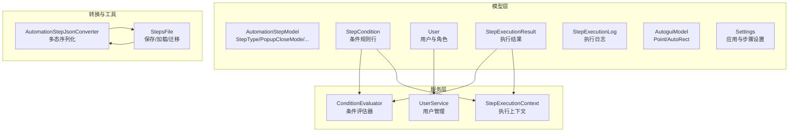
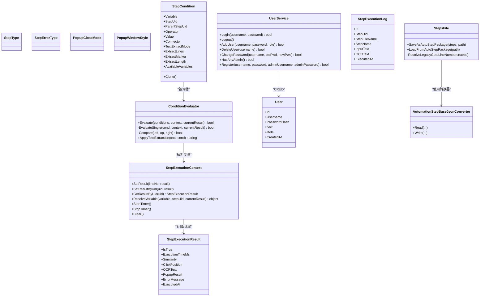
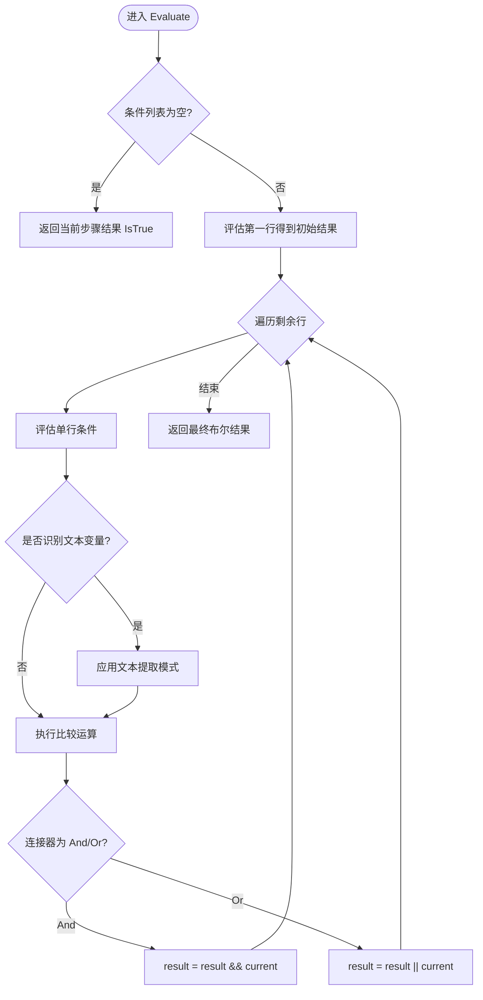
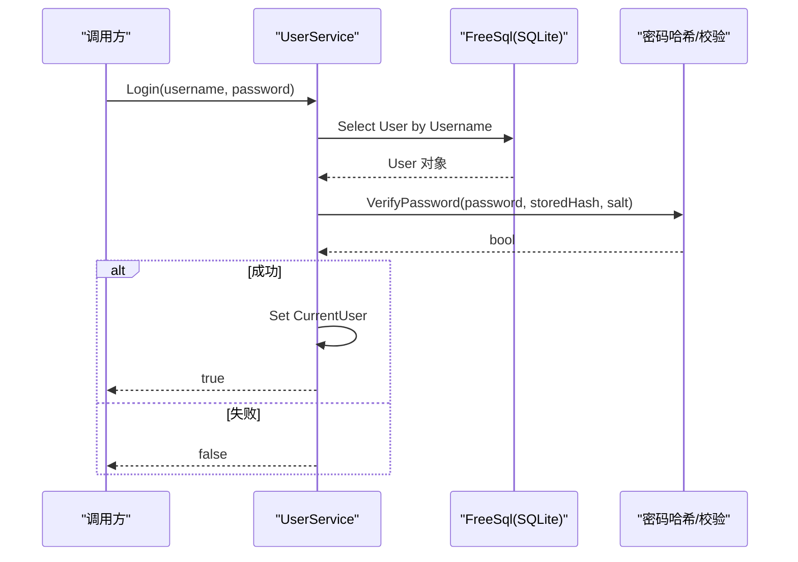
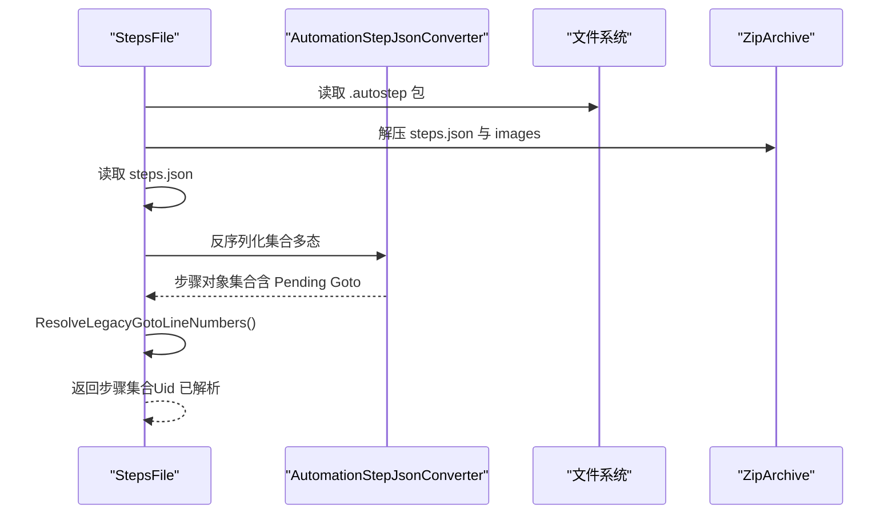
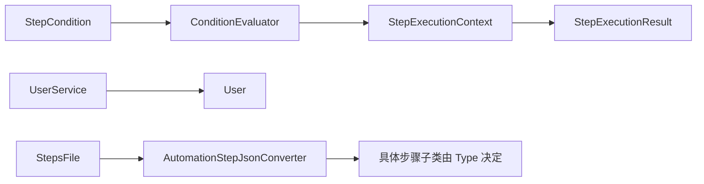

# 数据模型

<cite>
**本文引用的文件**   
- [AutomationStepModel.cs](file://ShaoLu/Models/AutomationStepModel.cs)
- [StepCondition.cs](file://ShaoLu/Models/StepCondition.cs)
- [User.cs](file://ShaoLu/Models/User.cs)
- [AutoguiModel.cs](file://ShaoLu/Models/AutoguiModel.cs)
- [Settings.cs](file://ShaoLu/Models/Settings.cs)
- [StepExecutionLog.cs](file://ShaoLu/Models/StepExecutionLog.cs)
- [StepExecutionResult.cs](file://ShaoLu/Models/StepExecutionResult.cs)
- [ConditionEvaluator.cs](file://ShaoLu/Services/ConditionEvaluator.cs)
- [UserService.cs](file://ShaoLu/Services/UserService.cs)
- [IUserService.cs](file://ShaoLu/Services/IUserService.cs)
- [StepExecutionContext.cs](file://ShaoLu/Services/StepExecutionContext.cs)
- [AutomationStepJsonConverter.cs](file://ShaoLu/Converters/AutomationStepJsonConverter.cs)
- [StepsFile.cs](file://ShaoLu/Utils/StepsFile.cs)
</cite>

## 目录
1. [引言](#引言)
2. [项目结构](#项目结构)
3. [核心组件](#核心组件)
4. [架构总览](#架构总览)
5. [详细组件分析](#详细组件分析)
6. [依赖关系分析](#依赖关系分析)
7. [性能考量](#性能考量)
8. [故障排查指南](#故障排查指南)
9. [结论](#结论)
10. [附录](#附录)

## 引言
本设计文档聚焦 ShaoLu 的数据模型，围绕自动化步骤的层次结构、条件判断逻辑与用户权限控制展开。重点说明：
- AutomationStepModel 的枚举与扩展点（步骤类型、错误类型、弹窗样式等）
- StepCondition 的条件变量、运算符、文本提取模式及多行组合评估
- User 模型的权限角色、密码安全与持久化策略
- 数据验证规则、序列化格式（JSON 多态）、持久化（SQLite + FreeSql）
- 模型间关系映射、数据完整性约束与业务规则实现
- 数据迁移方案与版本兼容性（旧版行号到 Uid 的迁移）

## 项目结构
数据模型分布在 Models、Services、Converters、Utils 四个层次：
- Models：领域实体与基础数据结构
- Services：业务服务（条件评估、用户服务、执行上下文）
- Converters：JSON 多态序列化转换器
- Utils：步骤文件 I/O、压缩包打包/解压、迁移后处理

图表来源
- [AutomationStepModel.cs:1-73](file://ShaoLu/Models/AutomationStepModel.cs#L1-L73)
- [StepCondition.cs:1-405](file://ShaoLu/Models/StepCondition.cs#L1-L405)
- [User.cs:1-33](file://ShaoLu/Models/User.cs#L1-L33)
- [StepExecutionResult.cs:1-51](file://ShaoLu/Models/StepExecutionResult.cs#L1-L51)
- [StepExecutionLog.cs:1-47](file://ShaoLu/Models/StepExecutionLog.cs#L1-L47)
- [AutoguiModel.cs:1-145](file://ShaoLu/Models/AutoguiModel.cs#L1-L145)
- [Settings.cs:1-117](file://ShaoLu/Models/Settings.cs#L1-L117)
- [ConditionEvaluator.cs:1-294](file://ShaoLu/Services/ConditionEvaluator.cs#L1-L294)
- [UserService.cs:1-239](file://ShaoLu/Services/UserService.cs#L1-L239)
- [StepExecutionContext.cs:1-163](file://ShaoLu/Services/StepExecutionContext.cs#L1-L163)
- [AutomationStepJsonConverter.cs:1-185](file://ShaoLu/Converters/AutomationStepJsonConverter.cs#L1-L185)
- [StepsFile.cs:1-244](file://ShaoLu/Utils/StepsFile.cs#L1-L244)

章节来源
- [AutomationStepModel.cs:1-73](file://ShaoLu/Models/AutomationStepModel.cs#L1-L73)
- [StepCondition.cs:1-405](file://ShaoLu/Models/StepCondition.cs#L1-L405)
- [User.cs:1-33](file://ShaoLu/Models/User.cs#L1-L33)
- [StepExecutionResult.cs:1-51](file://ShaoLu/Models/StepExecutionResult.cs#L1-L51)
- [StepExecutionLog.cs:1-47](file://ShaoLu/Models/StepExecutionLog.cs#L1-L47)
- [AutoguiModel.cs:1-145](file://ShaoLu/Models/AutoguiModel.cs#L1-L145)
- [Settings.cs:1-117](file://ShaoLu/Models/Settings.cs#L1-L117)
- [ConditionEvaluator.cs:1-294](file://ShaoLu/Services/ConditionEvaluator.cs#L1-L294)
- [UserService.cs:1-239](file://ShaoLu/Services/UserService.cs#L1-L239)
- [StepExecutionContext.cs:1-163](file://ShaoLu/Services/StepExecutionContext.cs#L1-L163)
- [AutomationStepJsonConverter.cs:1-185](file://ShaoLu/Converters/AutomationStepJsonConverter.cs#L1-L185)
- [StepsFile.cs:1-244](file://ShaoLu/Utils/StepsFile.cs#L1-L244)

## 核心组件
- 步骤类型与错误类型：定义自动化流程中的步骤种类与常见错误分类，为 UI 与执行引擎提供统一标识。
- 条件规则：以“变量-运算符-值”的规则行表达，支持 AND/OR 多行组合，内置 OCR 文本提取模式。
- 用户模型：基于 FreeSql 注解映射到 SQLite，包含用户名、密码哈希、盐值与角色。
- 执行结果与日志：记录每次步骤执行的布尔结果、耗时、相似度、点击位置、OCR 文本、弹窗结果与错误信息；日志表用于审计与统计。
- 执行上下文：维护所有步骤的执行结果缓存、计数与当前步骤标记，供条件评估解析变量。
- JSON 多态序列化：根据 Type 字段反序列化为具体步骤子类，兼容旧版数字行号的跳转字段。
- 步骤文件 I/O：支持 .autostep 压缩包（含 steps.json 与图片资源），并提供旧版行号到 Uid 的后处理迁移。

章节来源
- [AutomationStepModel.cs:1-73](file://ShaoLu/Models/AutomationStepModel.cs#L1-L73)
- [StepCondition.cs:1-405](file://ShaoLu/Models/StepCondition.cs#L1-L405)
- [User.cs:1-33](file://ShaoLu/Models/User.cs#L1-L33)
- [StepExecutionResult.cs:1-51](file://ShaoLu/Models/StepExecutionResult.cs#L1-L51)
- [StepExecutionLog.cs:1-47](file://ShaoLu/Models/StepExecutionLog.cs#L1-L47)
- [StepExecutionContext.cs:1-163](file://ShaoLu/Services/StepExecutionContext.cs#L1-L163)
- [AutomationStepJsonConverter.cs:1-185](file://ShaoLu/Converters/AutomationStepJsonConverter.cs#L1-L185)
- [StepsFile.cs:1-244](file://ShaoLu/Utils/StepsFile.cs#L1-L244)

## 架构总览
下图展示数据模型与服务之间的交互关系，以及序列化与持久化的关键路径。

图表来源
- [StepCondition.cs:1-405](file://ShaoLu/Models/StepCondition.cs#L1-L405)
- [ConditionEvaluator.cs:1-294](file://ShaoLu/Services/ConditionEvaluator.cs#L1-L294)
- [StepExecutionContext.cs:1-163](file://ShaoLu/Services/StepExecutionContext.cs#L1-L163)
- [User.cs:1-33](file://ShaoLu/Models/User.cs#L1-L33)
- [UserService.cs:1-239](file://ShaoLu/Services/UserService.cs#L1-L239)
- [StepExecutionResult.cs:1-51](file://ShaoLu/Models/StepExecutionResult.cs#L1-L51)
- [StepExecutionLog.cs:1-47](file://ShaoLu/Models/StepExecutionLog.cs#L1-L47)
- [AutomationStepJsonConverter.cs:1-185](file://ShaoLu/Converters/AutomationStepJsonConverter.cs#L1-L185)
- [StepsFile.cs:1-244](file://ShaoLu/Utils/StepsFile.cs#L1-L244)

## 详细组件分析

### 自动化步骤模型（AutomationStepModel）
- 步骤类型枚举：涵盖图像点击/查找、文本输入、多输入、鼠标动作、统计、弹窗等，预留扩展位段便于新增步骤类型。
- 错误类型枚举：覆盖图像未找到、匹配失败、OCR 错误、超时、取消、越界等常见执行异常。
- 弹窗关闭模式与样式：支持按钮点击、超时自动关闭、到达某步骤时关闭；窗口样式支持正常与紧凑布局。

用途与影响：
- 为 UI 模板选择、执行引擎分支、错误提示与日志分类提供统一标识。
- 通过分组编号（如 ClickImages/FindImages、GetInput/MouseAction/Statistics、Popup）体现功能域划分。

章节来源
- [AutomationStepModel.cs:1-73](file://ShaoLu/Models/AutomationStepModel.cs#L1-L73)

### 条件判断模型（StepCondition）
- 条件变量：支持常量、当前步骤自身属性、引用其他步骤属性、触发状态等。
- 运算符：相等/不等、大小比较、包含/不包含、空检查、正则匹配。
- 逻辑连接器：AND/OR 多行组合，形成表达式树式评估。
- 文本提取模式：整串、指定行、从子字符串开始、从开头/末尾截取，配合长度参数。
- 可用变量列表：根据父步骤或选中步骤的类型动态生成，限制 UI 可选范围。

评估流程要点：
- 第一行作为初始结果，后续行按 Connector 累积计算。
- 对识别文本变量，先进行文本提取预处理，再进行比较。
- 正则匹配失败会记录警告并返回 false，保证鲁棒性。

图表来源
- [ConditionEvaluator.cs:1-294](file://ShaoLu/Services/ConditionEvaluator.cs#L1-L294)
- [StepCondition.cs:1-405](file://ShaoLu/Models/StepCondition.cs#L1-L405)

章节来源
- [StepCondition.cs:1-405](file://ShaoLu/Models/StepCondition.cs#L1-L405)
- [ConditionEvaluator.cs:1-294](file://ShaoLu/Services/ConditionEvaluator.cs#L1-L294)

### 用户模型与权限控制（User + UserService）
- 用户实体：包含 Id、Username、PasswordHash、Salt、Role、CreatedAt，映射到 app_user 表。
- 角色枚举：Admin、User，用于权限判定。
- 密码安全：随机 Salt + PBKDF2(SHA256, 迭代次数 10000) 生成哈希；校验采用恒定时间比较防止时序攻击。
- 权限控制：登录成功后设置 CurrentUser，IsAdmin 由角色决定；删除用户时保护至少保留一个管理员。
- 注册流程：若已有管理员，则需管理员审批；否则允许直接注册（默认管理员）。

图表来源
- [UserService.cs:1-239](file://ShaoLu/Services/UserService.cs#L1-L239)
- [User.cs:1-33](file://ShaoLu/Models/User.cs#L1-L33)

章节来源
- [User.cs:1-33](file://ShaoLu/Models/User.cs#L1-L33)
- [UserService.cs:1-239](file://ShaoLu/Services/UserService.cs#L1-L239)
- [IUserService.cs:1-20](file://ShaoLu/Services/IUserService.cs#L1-L20)

### 执行结果与日志（StepExecutionResult + StepExecutionLog）
- 执行结果：布尔结果、耗时、相似度、点击坐标、OCR 文本、弹窗结果、错误信息与时间戳。
- 执行日志：持久化审计信息，包括步骤 UID、文件名、名称、输入文本、OCR 文本与执行时间。
- 上下文关联：StepExecutionContext 维护结果缓存与计数，供条件变量解析与统计展示。

章节来源
- [StepExecutionResult.cs:1-51](file://ShaoLu/Models/StepExecutionResult.cs#L1-L51)
- [StepExecutionLog.cs:1-47](file://ShaoLu/Models/StepExecutionLog.cs#L1-L47)
- [StepExecutionContext.cs:1-163](file://ShaoLu/Services/StepExecutionContext.cs#L1-L163)

### 几何与配置模型（AutoguiModel + Settings）
- Point/AutoRect：封装坐标与矩形计算，支持多种构造方式与隐式转换，便于图像处理与区域标注。
- AppSettings：窗口尺寸、字体、日志保留天数等应用级配置。
- StepSettingsModel：步骤运行行为（错误弹窗、最小化、自引用上限、确认运行、覆盖层显示、默认阈值/等待/超时/点击次数等）。
- OverlaySetting/HotKeySetting：覆盖层颜色与时长、快捷键配置。

章节来源
- [AutoguiModel.cs:1-145](file://ShaoLu/Models/AutoguiModel.cs#L1-L145)
- [Settings.cs:1-117](file://ShaoLu/Models/Settings.cs#L1-L117)

### 序列化与持久化（AutomationStepJsonConverter + StepsFile）
- 多态序列化：根据 Type 字段解析为具体步骤子类，支持字符串与数字枚举兼容。
- 旧版兼容：TrueGoto/FalseGoto 可能为 int（行号），在反序列化阶段移除数字字段并记录待解析映射，加载完成后统一解析为 Uid。
- 压缩包格式：.autostep 包包含 steps.json 与 images/ 目录下的裁剪图片，便于打包分发与离线运行。
- 选项配置：读写选项分别启用注释跳过、尾随逗号、忽略 null、宽松编码等以提升健壮性与可读性。

图表来源
- [StepsFile.cs:1-244](file://ShaoLu/Utils/StepsFile.cs#L1-L244)
- [AutomationStepJsonConverter.cs:1-185](file://ShaoLu/Converters/AutomationStepJsonConverter.cs#L1-L185)

章节来源
- [AutomationStepJsonConverter.cs:1-185](file://ShaoLu/Converters/AutomationStepJsonConverter.cs#L1-L185)
- [StepsFile.cs:1-244](file://ShaoLu/Utils/StepsFile.cs#L1-L244)

## 依赖关系分析
- 条件评估依赖执行上下文与执行结果，确保变量解析一致且可追溯。
- 用户服务依赖 FreeSql 与 SQLite，使用 AutoSyncStructure 自动建表，降低运维成本。
- 序列化转换器与步骤文件 I/O 紧密耦合，共同承担多态与版本兼容职责。
- 配置模型贯穿 UI 与执行过程，影响行为与可视化反馈。

图表来源
- [StepCondition.cs:1-405](file://ShaoLu/Models/StepCondition.cs#L1-L405)
- [ConditionEvaluator.cs:1-294](file://ShaoLu/Services/ConditionEvaluator.cs#L1-L294)
- [StepExecutionContext.cs:1-163](file://ShaoLu/Services/StepExecutionContext.cs#L1-L163)
- [StepExecutionResult.cs:1-51](file://ShaoLu/Models/StepExecutionResult.cs#L1-L51)
- [UserService.cs:1-239](file://ShaoLu/Services/UserService.cs#L1-L239)
- [User.cs:1-33](file://ShaoLu/Models/User.cs#L1-L33)
- [StepsFile.cs:1-244](file://ShaoLu/Utils/StepsFile.cs#L1-L244)
- [AutomationStepJsonConverter.cs:1-185](file://ShaoLu/Converters/AutomationStepJsonConverter.cs#L1-L185)

章节来源
- [StepCondition.cs:1-405](file://ShaoLu/Models/StepCondition.cs#L1-L405)
- [ConditionEvaluator.cs:1-294](file://ShaoLu/Services/ConditionEvaluator.cs#L1-L294)
- [StepExecutionContext.cs:1-163](file://ShaoLu/Services/StepExecutionContext.cs#L1-L163)
- [StepExecutionResult.cs:1-51](file://ShaoLu/Models/StepExecutionResult.cs#L1-L51)
- [UserService.cs:1-239](file://ShaoLu/Services/UserService.cs#L1-L239)
- [User.cs:1-33](file://ShaoLu/Models/User.cs#L1-L33)
- [StepsFile.cs:1-244](file://ShaoLu/Utils/StepsFile.cs#L1-L244)
- [AutomationStepJsonConverter.cs:1-185](file://ShaoLu/Converters/AutomationStepJsonConverter.cs#L1-L185)

## 性能考量
- 条件评估：避免重复解析与异常开销，正则匹配失败快速回退；数值比较使用容差避免浮点误差。
- 执行上下文：字典缓存结果与计数，O(1) 访问；单次运行前 Clear 释放内存。
- 序列化：复用 JsonSerializerOptions，减少实例化开销；宽松解析提升兼容性。
- 数据库：FreeSql 自动同步结构，首次启动建表；SQLite 适合本地轻量存储。

[本节为通用指导，不直接分析具体文件]

## 故障排查指南
- 条件评估失败：检查变量是否存在、文本提取模式是否正确、正则表达式是否合法；查看日志警告定位问题。
- 用户登录失败：确认用户名存在、密码正确、哈希与盐值匹配；检查数据库连接与表结构。
- 步骤加载失败：确认 .autostep 包完整、steps.json 有效、图片路径正确；检查旧版行号迁移是否完成。
- 权限相关错误：确保至少保留一个管理员；删除用户时校验角色与数量限制。

章节来源
- [ConditionEvaluator.cs:1-294](file://ShaoLu/Services/ConditionEvaluator.cs#L1-L294)
- [UserService.cs:1-239](file://ShaoLu/Services/UserService.cs#L1-L239)
- [StepsFile.cs:1-244](file://ShaoLu/Utils/StepsFile.cs#L1-L244)

## 结论
ShaoLu 的数据模型以清晰的层次结构与可扩展的枚举体系为基础，结合灵活的条件评估机制与安全稳健的用户权限控制，实现了自动化流程的可配置化与可观测性。通过多态序列化与压缩包格式，兼顾了版本兼容与便携性。建议在后续演进中继续完善错误分类、性能监控与配置校验，以提升系统的稳定性与可维护性。

[本节为总结，不直接分析具体文件]

## 附录
- 数据迁移方案
  - 旧版 TrueGoto/FalseGoto 为 int 行号，反序列化时移除数字字段并记录映射，加载完成后统一解析为 Uid，确保向后兼容。
  - 建议在新版本中逐步废弃行号字段，仅保留 Uid 引用，并在迁移脚本中提供双向校验。
- 版本兼容性考虑
  - JSON 读取选项启用注释与尾随逗号，提升人类可读性与编辑友好度。
  - 枚举支持字符串与数字两种形式，降低升级过程中的破坏性变更风险。
- 数据完整性约束
  - 用户表主键自增、用户名唯一、密码哈希与盐值非空；删除用户时保护管理员数量下限。
  - 步骤执行日志与结果字段明确，便于审计与回溯。

章节来源
- [StepsFile.cs:1-244](file://ShaoLu/Utils/StepsFile.cs#L1-L244)
- [AutomationStepJsonConverter.cs:1-185](file://ShaoLu/Converters/AutomationStepJsonConverter.cs#L1-L185)
- [UserService.cs:1-239](file://ShaoLu/Services/UserService.cs#L1-L239)
- [User.cs:1-33](file://ShaoLu/Models/User.cs#L1-L33)
- [StepExecutionLog.cs:1-47](file://ShaoLu/Models/StepExecutionLog.cs#L1-L47)
- [StepExecutionResult.cs:1-51](file://ShaoLu/Models/StepExecutionResult.cs#L1-L51)