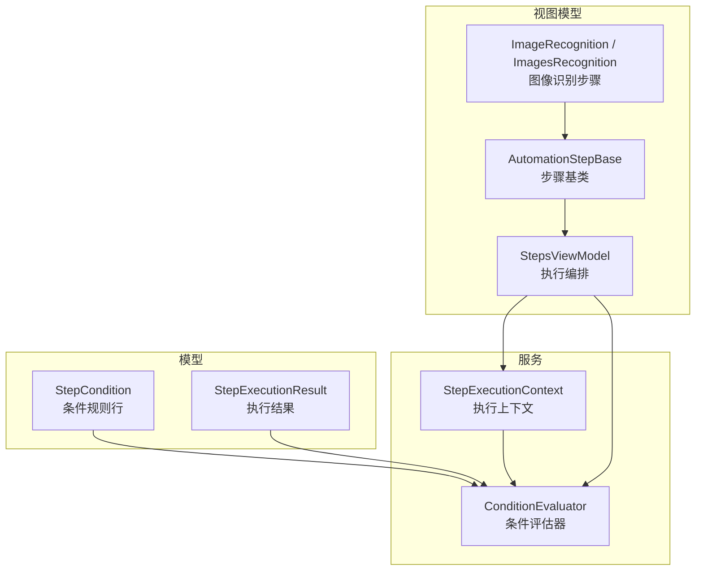
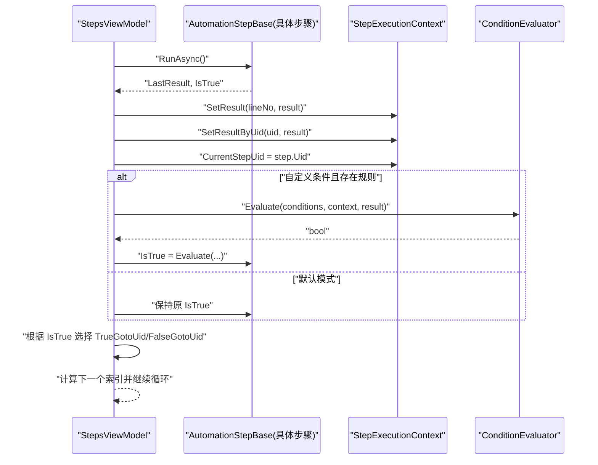
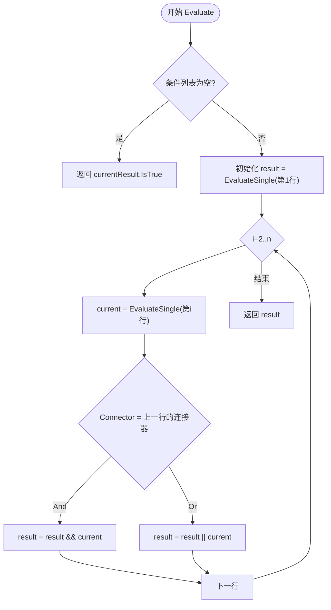
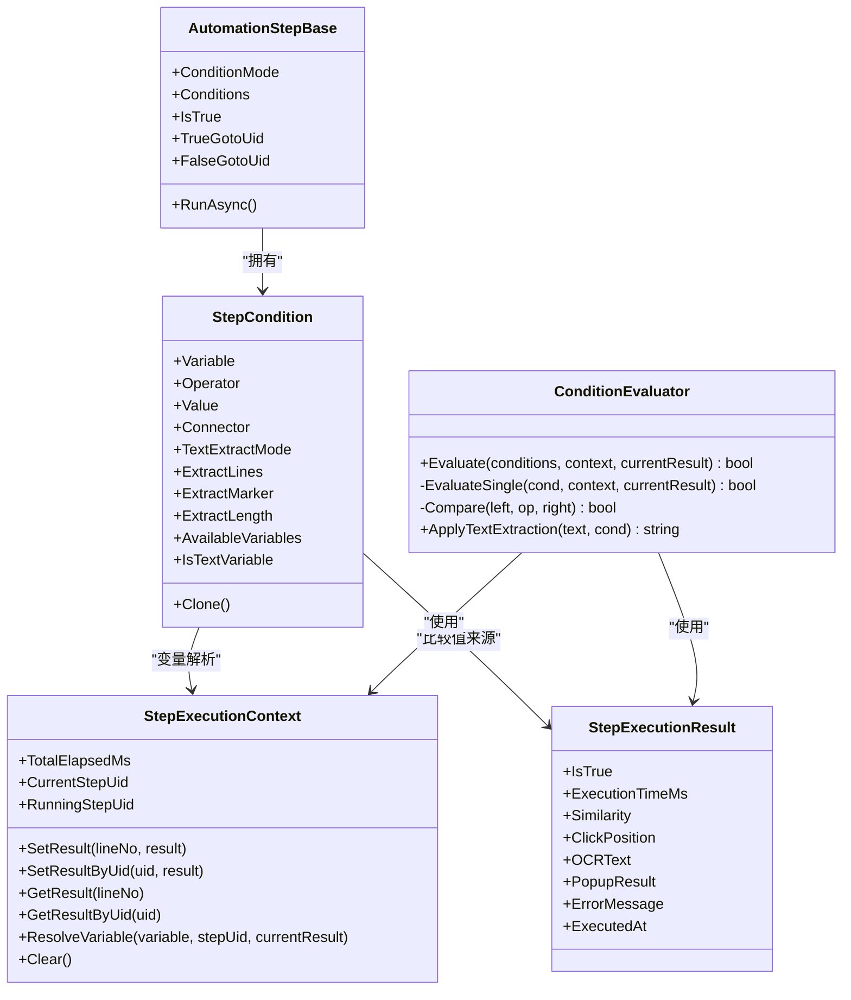
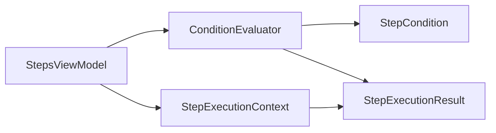

# 步骤条件模型

<cite>
**本文引用的文件**   
- [ConditionEvaluator.cs](file://ShaoLu/Services/ConditionEvaluator.cs)
- [StepCondition.cs](file://ShaoLu/Models/StepCondition.cs)
- [StepExecutionContext.cs](file://ShaoLu/Services/StepExecutionContext.cs)
- [StepExecutionResult.cs](file://ShaoLu/Models/StepExecutionResult.cs)
- [StepsViewModel.cs](file://ShaoLu/Viewmodels/StepsViewModel.cs)
- [AutomationStep.cs](file://ShaoLu/Viewmodels/AutomationStep.cs)
- [ImageRecognition.cs](file://ShaoLu/Viewmodels/ImageRecognition.cs)
- [ImagesRecognition.cs](file://ShaoLu/Viewmodels/ImagesRecognition.cs)
- [ConditionEvaluatorTests.cs](file://NUnitTest/ConditionEvaluatorTests.cs)
</cite>

## 目录
1. [简介](#简介)
2. [项目结构](#项目结构)
3. [核心组件](#核心组件)
4. [架构总览](#架构总览)
5. [详细组件分析](#详细组件分析)
6. [依赖关系分析](#依赖关系分析)
7. [性能考量](#性能考量)
8. [故障排查指南](#故障排查指南)
9. [结论](#结论)
10. [附录：复杂条件组合示例](#附录复杂条件组合示例)

## 简介
本文件为 ShaoLu 的“步骤条件模型”提供系统化、可操作的文档。重点覆盖：
- 条件表达式的语法与评估机制
- 支持的比较操作符、逻辑运算符与嵌套条件结构
- 条件与步骤执行的关联关系
- 条件验证规则与错误处理机制
- 复杂条件组合的实际使用示例

该模型允许用户在“自定义模式”下，通过多行条件规则对当前或历史步骤的执行结果进行布尔判定，从而决定下一步跳转（真/假分支）。

## 项目结构
围绕“步骤条件模型”的关键代码分布在以下模块：
- 模型层：定义条件变量、运算符、连接器、文本提取模式以及执行结果数据结构
- 服务层：条件评估器与执行上下文
- 视图模型层：步骤执行编排、条件判断触发点、跳转控制
- 单元测试：覆盖条件评估器的各类场景

图表来源
- [StepCondition.cs:100-405](file://ShaoLu/Models/StepCondition.cs#L100-L405)
- [StepExecutionResult.cs:1-51](file://ShaoLu/Models/StepExecutionResult.cs#L1-L51)
- [ConditionEvaluator.cs:1-294](file://ShaoLu/Services/ConditionEvaluator.cs#L1-L294)
- [StepExecutionContext.cs:1-163](file://ShaoLu/Services/StepExecutionContext.cs#L1-L163)
- [StepsViewModel.cs:560-747](file://ShaoLu/Viewmodels/StepsViewModel.cs#L560-L747)
- [AutomationStep.cs:200-400](file://ShaoLu/Viewmodels/AutomationStep.cs#L200-L400)
- [ImageRecognition.cs:329-477](file://ShaoLu/Viewmodels/ImageRecognition.cs#L329-L477)
- [ImagesRecognition.cs:162-206](file://ShaoLu/Viewmodels/ImagesRecognition.cs#L162-L206)

章节来源
- [StepCondition.cs:100-405](file://ShaoLu/Models/StepCondition.cs#L100-L405)
- [StepExecutionResult.cs:1-51](file://ShaoLu/Models/StepExecutionResult.cs#L1-L51)
- [ConditionEvaluator.cs:1-294](file://ShaoLu/Services/ConditionEvaluator.cs#L1-L294)
- [StepExecutionContext.cs:1-163](file://ShaoLu/Services/StepExecutionContext.cs#L1-L163)
- [StepsViewModel.cs:560-747](file://ShaoLu/Viewmodels/StepsViewModel.cs#L560-L747)
- [AutomationStep.cs:200-400](file://ShaoLu/Viewmodels/AutomationStep.cs#L200-L400)
- [ImageRecognition.cs:329-477](file://ShaoLu/Viewmodels/ImageRecognition.cs#L329-L477)
- [ImagesRecognition.cs:162-206](file://ShaoLu/Viewmodels/ImagesRecognition.cs#L162-L206)

## 核心组件
- StepCondition：描述单条条件规则，包含变量、运算符、值、连接器及 OCR 文本提取设置
- ConditionEvaluator：解析并评估条件列表，返回最终布尔结果
- StepExecutionContext：维护所有步骤的执行结果、统计计数与时间信息，并提供变量解析
- StepExecutionResult：记录单次步骤执行的结构化结果（成功标志、相似度、耗时、OCR 文本等）
- StepsViewModel：编排步骤执行流程，在适当时机调用条件评估器并依据结果决定跳转

章节来源
- [StepCondition.cs:100-405](file://ShaoLu/Models/StepCondition.cs#L100-L405)
- [ConditionEvaluator.cs:1-294](file://ShaoLu/Services/ConditionEvaluator.cs#L1-L294)
- [StepExecutionContext.cs:1-163](file://ShaoLu/Services/StepExecutionContext.cs#L1-L163)
- [StepExecutionResult.cs:1-51](file://ShaoLu/Models/StepExecutionResult.cs#L1-L51)
- [StepsViewModel.cs:560-747](file://ShaoLu/Viewmodels/StepsViewModel.cs#L560-L747)

## 架构总览
下图展示从步骤执行到条件评估再到跳转控制的完整时序。

图表来源
- [StepsViewModel.cs:560-747](file://ShaoLu/Viewmodels/StepsViewModel.cs#L560-L747)
- [ConditionEvaluator.cs:1-294](file://ShaoLu/Services/ConditionEvaluator.cs#L1-L294)
- [StepExecutionContext.cs:1-163](file://ShaoLu/Services/StepExecutionContext.cs#L1-L163)
- [AutomationStep.cs:200-400](file://ShaoLu/Viewmodels/AutomationStep.cs#L200-L400)

## 详细组件分析

### 条件模型与枚举
- 条件模式：Default（使用步骤自身结果）、Custom（使用用户配置的多行规则）
- 条件变量：支持常量、当前步骤属性（如 IsTrue、Similarity、ExecutionTimeMs、ClickX/Y、OCRText、PopupResult），以及引用其他步骤的同名属性；新增 Step_Triggered 用于“刚刚被执行”的一次性判定
- 运算符：等于、不等于、大于、小于、大于等于、小于等于、包含、不包含、为空、非空、正则匹配
- 连接器：AND、OR（作用于相邻两行之间）
- 文本提取模式：整段、按行抽取（支持区间与逗号分隔）、从子串后读取指定长度、从头/尾截取固定长度

章节来源
- [StepCondition.cs:10-98](file://ShaoLu/Models/StepCondition.cs#L10-L98)
- [StepCondition.cs:100-405](file://ShaoLu/Models/StepCondition.cs#L100-L405)

### 条件评估器（ConditionEvaluator）
- 入口方法 Evaluate：当无条件时回退到当前步骤结果；否则逐行评估并按连接器组合
- 单行评估 EvaluateSingle：解析变量值、必要时进行 OCR 文本预处理、执行比较
- 比较逻辑 Compare：
  - 空值检查（IsEmpty/IsNotEmpty）
  - 正则匹配（RegexMatch）
  - 布尔比较（支持字符串 true/false 与 1/0）
  - 数值比较（int/double/float/long/decimal，含浮点容差）
  - 字符串比较（相等、不等、包含、不包含；若两端均可解析为数字则尝试数值比较）
- 文本提取 ApplyTextExtraction：
  - Lines：支持 "1,3,5-8" 格式，结果以换行拼接
  - FromSubstring：从首次出现 marker 之后读取 length（<=0 表示直到末尾）
  - FromStart/FromEnd：截取固定长度
- 异常处理：对正则非法、文本提取失败等情况记录警告并安全降级

图表来源
- [ConditionEvaluator.cs:1-294](file://ShaoLu/Services/ConditionEvaluator.cs#L1-L294)

章节来源
- [ConditionEvaluator.cs:1-294](file://ShaoLu/Services/ConditionEvaluator.cs#L1-L294)

### 执行上下文（StepExecutionContext）
- 存储每个步骤的执行结果（按行号与 Uid 双索引）
- 维护最近执行完成的步骤 Uid（供 Step_Triggered 使用）
- 提供 ResolveVariable：将条件变量映射为实际值（包括常量、当前步骤属性、引用步骤属性）
- 统计与计时：总耗时、各步骤执行次数、结果摘要

章节来源
- [StepExecutionContext.cs:1-163](file://ShaoLu/Services/StepExecutionContext.cs#L1-L163)

### 执行结果（StepExecutionResult）
- 字段：是否成功、耗时、相似度、点击位置、OCR 文本、弹窗结果、错误信息、执行时间戳
- 由具体步骤在执行完成后填充，并被写入执行上下文

章节来源
- [StepExecutionResult.cs:1-51](file://ShaoLu/Models/StepExecutionResult.cs#L1-L51)

### 步骤执行编排（StepsViewModel）
- 运行前重置自引用计数器、错误状态、统计计数
- 执行单个步骤，构造 StepExecutionResult 并写入上下文
- 仅在“自定义模式且有条件”时调用 ConditionEvaluator.Evaluate 更新 IsTrue
- 根据 IsTrue 选择 TrueGotoUid/FalseGotoUid，并处理自引用限制与目标不存在的情况

章节来源
- [StepsViewModel.cs:468-562](file://ShaoLu/Viewmodels/StepsViewModel.cs#L468-L562)
- [StepsViewModel.cs:560-747](file://ShaoLu/Viewmodels/StepsViewModel.cs#L560-L747)

### 条件与步骤执行的关联
- 默认模式：直接使用步骤自身的 IsTrue
- 自定义模式：基于多行条件规则重新计算 IsTrue
- 条件变量来源：
  - 当前步骤：Self_* 系列
  - 引用步骤：Step_* 系列（通过 StepUid 定位）
  - 常量：ConstantTrue/ConstantFalse
  - 触发标记：Step_Triggered（仅在上一步刚执行完成时为真）

章节来源
- [StepsViewModel.cs:560-747](file://ShaoLu/Viewmodels/StepsViewModel.cs#L560-L747)
- [StepExecutionContext.cs:112-160](file://ShaoLu/Services/StepExecutionContext.cs#L112-L160)

### 类图（代码级关系）

图表来源
- [StepCondition.cs:100-405](file://ShaoLu/Models/StepCondition.cs#L100-L405)
- [StepExecutionResult.cs:1-51](file://ShaoLu/Models/StepExecutionResult.cs#L1-L51)
- [StepExecutionContext.cs:1-163](file://ShaoLu/Services/StepExecutionContext.cs#L1-L163)
- [ConditionEvaluator.cs:1-294](file://ShaoLu/Services/ConditionEvaluator.cs#L1-L294)
- [AutomationStep.cs:200-400](file://ShaoLu/Viewmodels/AutomationStep.cs#L200-L400)

## 依赖关系分析
- 低耦合：ConditionEvaluator 仅依赖模型与服务接口，不直接感知 UI
- 高内聚：StepCondition 封装了变量、运算符、连接器与文本提取设置
- 执行上下文集中管理运行时数据，避免跨步骤状态散落
- 视图模型负责编排，确保条件评估在正确时机触发

图表来源
- [StepsViewModel.cs:560-747](file://ShaoLu/Viewmodels/StepsViewModel.cs#L560-L747)
- [ConditionEvaluator.cs:1-294](file://ShaoLu/Services/ConditionEvaluator.cs#L1-L294)
- [StepExecutionContext.cs:1-163](file://ShaoLu/Services/StepExecutionContext.cs#L1-L163)
- [StepCondition.cs:100-405](file://ShaoLu/Models/StepCondition.cs#L100-L405)
- [StepExecutionResult.cs:1-51](file://ShaoLu/Models/StepExecutionResult.cs#L1-L51)

章节来源
- [StepsViewModel.cs:560-747](file://ShaoLu/Viewmodels/StepsViewModel.cs#L560-L747)
- [ConditionEvaluator.cs:1-294](file://ShaoLu/Services/ConditionEvaluator.cs#L1-L294)
- [StepExecutionContext.cs:1-163](file://ShaoLu/Services/StepExecutionContext.cs#L1-L163)
- [StepCondition.cs:100-405](file://ShaoLu/Models/StepCondition.cs#L100-L405)
- [StepExecutionResult.cs:1-51](file://ShaoLu/Models/StepExecutionResult.cs#L1-L51)

## 性能考量
- 条件评估为 O(n) 线性扫描（n 为条件行数），通常开销极低
- 文本提取涉及字符串分割与子串查找，建议合理设置 ExtractLines/ExtractMarker/ExtractLength 避免过长文本
- 正则匹配可能带来额外开销，应谨慎使用并确保模式简洁
- 执行上下文使用字典索引，查询为 O(1)，适合频繁访问

[本节为通用指导，无需特定文件引用]

## 故障排查指南
- 条件评估失败：
  - 正则表达式非法：评估器会记录警告并返回 false
  - 文本提取异常：记录警告并退回原始文本
- 未找到引用步骤：
  - Step_* 变量解析为默认值（如 false、空串、-1 等）
- 自引用限制：
  - 达到 SelfReferenceLimit 后强制结果为 false，并按 FalseGotoUid 继续
- 异常捕获：
  - 单个步骤异常不会导致整个流程崩溃，记录错误类型并可选择弹出提示

章节来源
- [ConditionEvaluator.cs:78-83](file://ShaoLu/Services/ConditionEvaluator.cs#L78-L83)
- [ConditionEvaluator.cs:105-118](file://ShaoLu/Services/ConditionEvaluator.cs#L105-L118)
- [StepsViewModel.cs:597-622](file://ShaoLu/Viewmodels/StepsViewModel.cs#L597-L622)
- [StepsViewModel.cs:637-669](file://ShaoLu/Viewmodels/StepsViewModel.cs#L637-L669)

## 结论
ShaoLu 的步骤条件模型通过清晰的模型定义、稳健的评估器与集中的执行上下文，实现了灵活而强大的条件判断能力。它既支持简单的布尔判定，也能处理复杂的 OCR 文本提取与正则匹配，并通过 AND/OR 连接器实现多行条件的组合。配合步骤执行编排，能够精确控制自动化流程的分支与跳转。

[本节为总结，无需特定文件引用]

## 附录：复杂条件组合示例
以下为典型的使用场景（不展示代码，仅说明配置思路）：
- 图像识别成功且相似度高于阈值：
  - 行1：Self_IsTrue 等于 true
  - 连接器：AND
  - 行2：Self_Similarity 大于 0.9
- 执行时间不超过阈值或 OCR 文本包含关键字：
  - 行1：Self_ExecutionTimeMs 小于等于 200
  - 连接器：OR
  - 行2：Self_OCRText 包含 "订单号"
- 引用上一步骤的结果：
  - 行1：Step_IsTrue（StepUid 指向某步骤）等于 true
  - 连接器：AND
  - 行2：Step_Similarity 大于 0.85
- 文本提取后比较：
  - 行1：Self_OCRText 使用 FromSubstring(marker="SN:", length=8) 等于 "ABC12345"
- 正则匹配：
  - 行1：Self_OCRText 正则匹配 "^[A-Z]{3}\\d{6}$"

以上示例可通过单元测试中的用例进行验证与参考。

章节来源
- [ConditionEvaluatorTests.cs:377-500](file://NUnitTest/ConditionEvaluatorTests.cs#L377-L500)
- [ConditionEvaluatorTests.cs:588-657](file://NUnitTest/ConditionEvaluatorTests.cs#L588-L657)