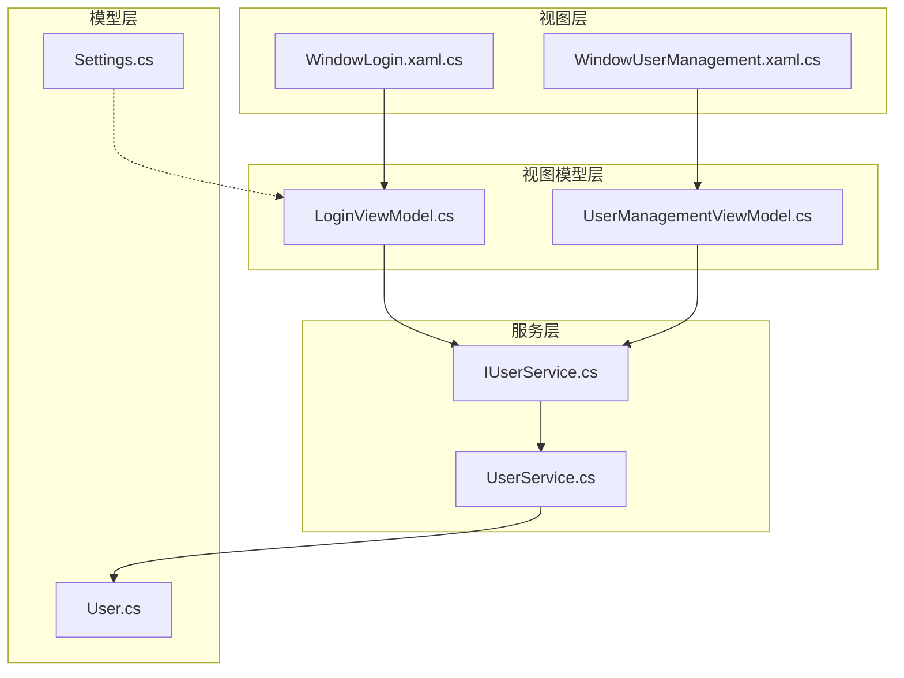
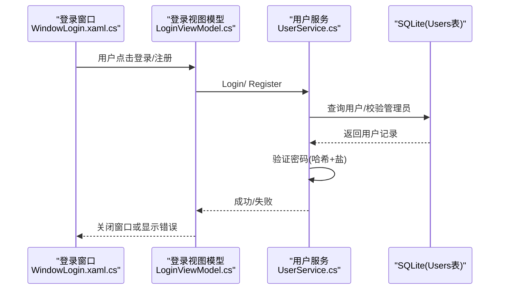
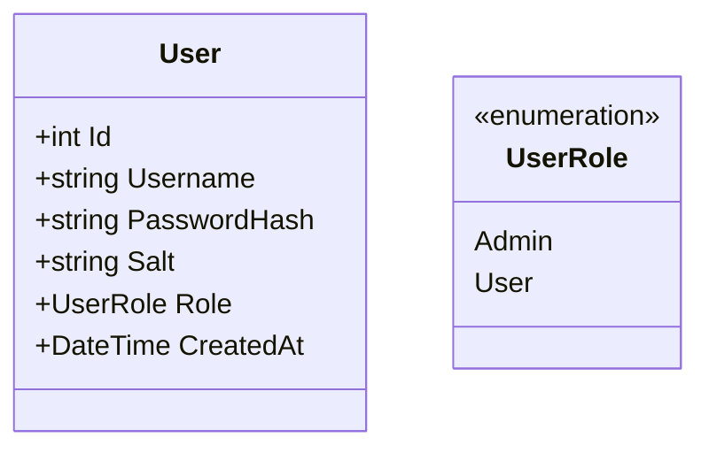
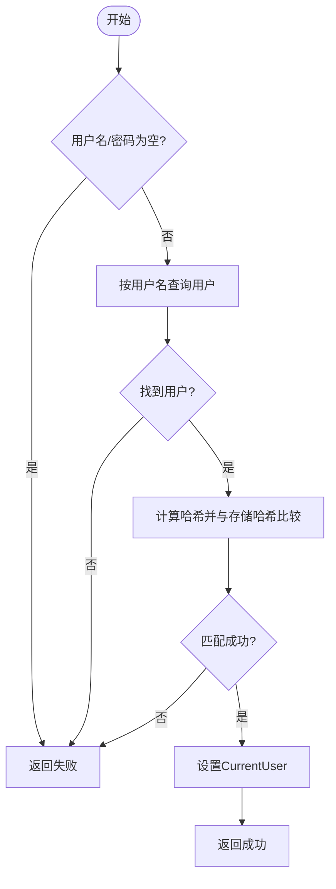
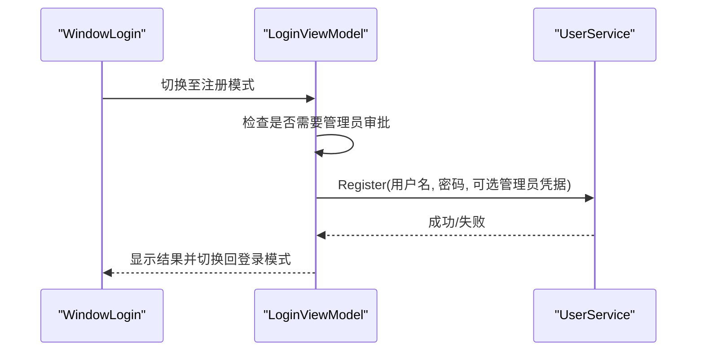
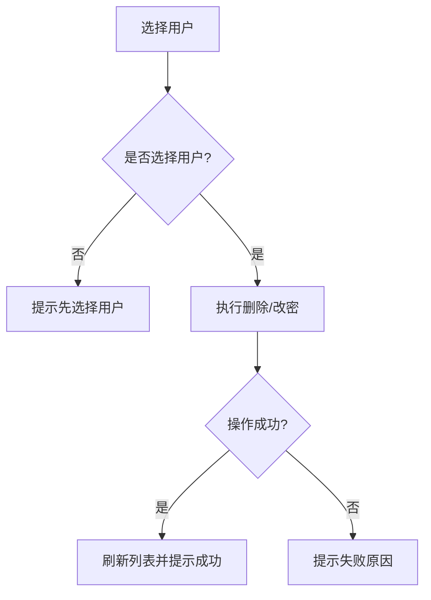
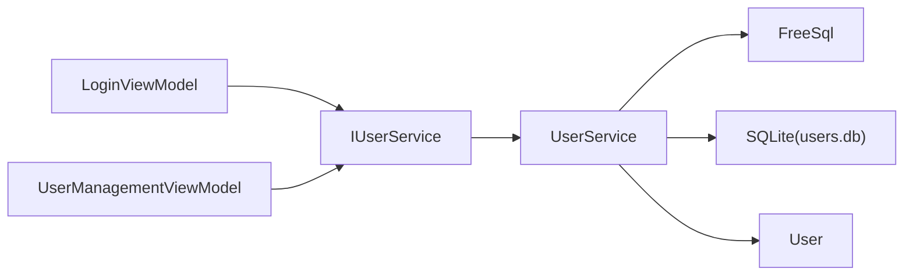

# 用户模型

<cite>
**本文引用的文件**   
- [ShaoLu/Models/User.cs](file://ShaoLu/Models/User.cs)
- [ShaoLu/Services/IUserService.cs](file://ShaoLu/Services/IUserService.cs)
- [ShaoLu/Services/UserService.cs](file://ShaoLu/Services/UserService.cs)
- [ShaoLu/Viewmodels/LoginViewModel.cs](file://ShaoLu/Viewmodels/LoginViewModel.cs)
- [ShaoLu/Views/WindowLogin.xaml.cs](file://ShaoLu/Views/WindowLogin.xaml.cs)
- [ShaoLu/Viewmodels/UserManagementViewModel.cs](file://ShaoLu/Viewmodels/UserManagementViewModel.cs)
- [ShaoLu/Views/WindowUserManagement.xaml.cs](file://ShaoLu/Views/WindowUserManagement.xaml.cs)
- [ShaoLu/Models/Settings.cs](file://ShaoLu/Models/Settings.cs)
</cite>

## 目录
1. [简介](#简介)
2. [项目结构](#项目结构)
3. [核心组件](#核心组件)
4. [架构总览](#架构总览)
5. [详细组件分析](#详细组件分析)
6. [依赖关系分析](#依赖关系分析)
7. [性能考虑](#性能考虑)
8. [故障排查指南](#故障排查指南)
9. [结论](#结论)
10. [附录：使用示例与最佳实践](#附录使用示例与最佳实践)

## 简介
本文件为 ShaoLu 的用户模型提供系统化、可操作的技术文档。内容覆盖 User 实体字段定义与数据结构设计、用户认证机制（含密码哈希与盐值）、权限控制策略（角色与管理员审批）、会话管理（当前登录用户）、持久化存储方案（SQLite + FreeSql）与安全考量，并给出用户管理与访问控制的实现说明、完整使用示例与最佳实践。

## 项目结构
围绕用户模型的相关代码分布在 Models、Services、Viewmodels 与 Views 四个层次：
- Models：定义用户实体与角色枚举，以及应用设置中的“记住用户”配置项。
- Services：封装用户服务接口与实现，负责数据库访问、密码安全、注册/登录/删除/改密等逻辑。
- Viewmodels：承载 UI 交互逻辑（登录、注册、用户管理），通过命令驱动业务调用。
- Views：XAML 窗口与后台代码，绑定 ViewModel，处理输入事件与状态回传。

图表来源
- [ShaoLu/Views/WindowLogin.xaml.cs:1-87](file://ShaoLu/Views/WindowLogin.xaml.cs#L1-L87)
- [ShaoLu/Views/WindowUserManagement.xaml.cs:1-33](file://ShaoLu/Views/WindowUserManagement.xaml.cs#L1-L33)
- [ShaoLu/Viewmodels/LoginViewModel.cs:1-251](file://ShaoLu/Viewmodels/LoginViewModel.cs#L1-L251)
- [ShaoLu/Viewmodels/UserManagementViewModel.cs:1-194](file://ShaoLu/Viewmodels/UserManagementViewModel.cs#L1-L194)
- [ShaoLu/Services/IUserService.cs:1-20](file://ShaoLu/Services/IUserService.cs#L1-L20)
- [ShaoLu/Services/UserService.cs:1-239](file://ShaoLu/Services/UserService.cs#L1-L239)
- [ShaoLu/Models/User.cs:1-33](file://ShaoLu/Models/User.cs#L1-L33)
- [ShaoLu/Models/Settings.cs:1-117](file://ShaoLu/Models/Settings.cs#L1-L117)

章节来源
- [ShaoLu/Models/User.cs:1-33](file://ShaoLu/Models/User.cs#L1-L33)
- [ShaoLu/Services/IUserService.cs:1-20](file://ShaoLu/Services/IUserService.cs#L1-L20)
- [ShaoLu/Services/UserService.cs:1-239](file://ShaoLu/Services/UserService.cs#L1-L239)
- [ShaoLu/Viewmodels/LoginViewModel.cs:1-251](file://ShaoLu/Viewmodels/LoginViewModel.cs#L1-L251)
- [ShaoLu/Views/WindowLogin.xaml.cs:1-87](file://ShaoLu/Views/WindowLogin.xaml.cs#L1-L87)
- [ShaoLu/Viewmodels/UserManagementViewModel.cs:1-194](file://ShaoLu/Viewmodels/UserManagementViewModel.cs#L1-L194)
- [ShaoLu/Views/WindowUserManagement.xaml.cs:1-33](file://ShaoLu/Views/WindowUserManagement.xaml.cs#L1-L33)
- [ShaoLu/Models/Settings.cs:1-117](file://ShaoLu/Models/Settings.cs#L1-L117)

## 核心组件
- User 实体与 UserRole 枚举：定义用户数据模型与角色类型。
- IUserService 接口与 UserService 实现：统一暴露用户相关能力（登录、注销、增删改查、注册、管理员检查）。
- LoginViewModel：登录与注册流程的 UI 逻辑，包含错误提示、模式切换、管理员审批判断。
- UserManagementViewModel：用户列表展示、新增、删除、修改密码的管理界面逻辑。
- WindowLogin / WindowUserManagement：UI 窗口与事件绑定，将密码框等控件值同步到 ViewModel。
- Settings（AppSettings.UserSettings）：支持“记住用户”与“上次用户名”的配置项。

章节来源
- [ShaoLu/Models/User.cs:1-33](file://ShaoLu/Models/User.cs#L1-L33)
- [ShaoLu/Services/IUserService.cs:1-20](file://ShaoLu/Services/IUserService.cs#L1-L20)
- [ShaoLu/Services/UserService.cs:1-239](file://ShaoLu/Services/UserService.cs#L1-L239)
- [ShaoLu/Viewmodels/LoginViewModel.cs:1-251](file://ShaoLu/Viewmodels/LoginViewModel.cs#L1-L251)
- [ShaoLu/Viewmodels/UserManagementViewModel.cs:1-194](file://ShaoLu/Viewmodels/UserManagementViewModel.cs#L1-L194)
- [ShaoLu/Views/WindowLogin.xaml.cs:1-87](file://ShaoLu/Views/WindowLogin.xaml.cs#L1-L87)
- [ShaoLu/Views/WindowUserManagement.xaml.cs:1-33](file://ShaoLu/Views/WindowUserManagement.xaml.cs#L1-L33)
- [ShaoLu/Models/Settings.cs:1-117](file://ShaoLu/Models/Settings.cs#L1-L117)

## 架构总览
下图展示了从 UI 到服务再到数据层的调用链，以及用户认证与权限判断的关键路径。

图表来源
- [ShaoLu/Views/WindowLogin.xaml.cs:1-87](file://ShaoLu/Views/WindowLogin.xaml.cs#L1-L87)
- [ShaoLu/Viewmodels/LoginViewModel.cs:1-251](file://ShaoLu/Viewmodels/LoginViewModel.cs#L1-L251)
- [ShaoLu/Services/UserService.cs:1-239](file://ShaoLu/Services/UserService.cs#L1-L239)

## 详细组件分析

### User 实体与角色
- 字段说明
  - Id：自增主键，标识用户唯一性。
  - Username：用户名，非空，长度上限 128。
  - PasswordHash：密码哈希值（PBKDF2-SHA256 输出），用于安全校验。
  - Salt：随机盐值（Base64 编码），用于增强哈希安全性。
  - Role：角色枚举，Admin 或 User。
  - CreatedAt：创建时间戳。
- 设计要点
  - 使用 FreeSql 特性标注映射到 app_user 表。
  - 密码以哈希形式存储，不保存明文。
  - 角色采用简单枚举，便于扩展与权限判断。

图表来源
- [ShaoLu/Models/User.cs:1-33](file://ShaoLu/Models/User.cs#L1-L33)

章节来源
- [ShaoLu/Models/User.cs:1-33](file://ShaoLu/Models/User.cs#L1-L33)

### 用户服务接口与实现
- 接口能力
  - CurrentUser：当前登录用户对象。
  - IsAdmin：基于当前用户角色判断是否为管理员。
  - Login/Logout：登录与注销。
  - GetAllUsers/AddUser/DeleteUser/ChangePassword：用户 CRUD 与密码修改。
  - HasAnyAdmin/Register：管理员存在性检查与注册流程（含管理员审批）。
- 实现要点
  - 使用 FreeSql 连接 SQLite，自动同步结构（建表）。
  - 密码安全：生成强随机盐，使用 PBKDF2-SHA256 迭代 10000 次计算哈希；比较时使用常量时间比较避免时序攻击。
  - 注册流程：若系统中已有管理员，则需管理员账号密码审批；否则允许直接注册（默认管理员角色）。
  - 删除保护：不允许删除最后一个管理员账户；若删除的是当前登录用户，自动注销。

图表来源
- [ShaoLu/Services/UserService.cs:1-239](file://ShaoLu/Services/UserService.cs#L1-L239)

章节来源
- [ShaoLu/Services/IUserService.cs:1-20](file://ShaoLu/Services/IUserService.cs#L1-L20)
- [ShaoLu/Services/UserService.cs:1-239](file://ShaoLu/Services/UserService.cs#L1-L239)

### 登录与注册 UI 流程
- 登录流程
  - 用户在 WindowLogin 中输入用户名与密码，触发 LoginCommand。
  - LoginViewModel 校验输入后调用 UserService.Login。
  - 成功后关闭登录窗口并返回成功状态；失败则显示错误消息。
- 注册流程
  - 切换到注册模式，根据系统是否已有管理员决定是否要求管理员审批。
  - 校验用户名、密码、确认密码及最小长度。
  - 需要管理员时，校验管理员账号密码；通过后调用 UserService.Register。
  - 注册成功后清空表单并预填用户名以便立即登录。

图表来源
- [ShaoLu/Views/WindowLogin.xaml.cs:1-87](file://ShaoLu/Views/WindowLogin.xaml.cs#L1-L87)
- [ShaoLu/Viewmodels/LoginViewModel.cs:1-251](file://ShaoLu/Viewmodels/LoginViewModel.cs#L1-L251)
- [ShaoLu/Services/UserService.cs:1-239](file://ShaoLu/Services/UserService.cs#L1-L239)

章节来源
- [ShaoLu/Viewmodels/LoginViewModel.cs:1-251](file://ShaoLu/Viewmodels/LoginViewModel.cs#L1-L251)
- [ShaoLu/Views/WindowLogin.xaml.cs:1-87](file://ShaoLu/Views/WindowLogin.xaml.cs#L1-L87)

### 用户管理功能
- 用户列表加载：调用 UserService.GetAllUsers 并按创建时间排序。
- 新增用户：校验输入后调用 AddUser，可选择角色（管理员/普通用户）。
- 删除用户：禁止删除自己；若尝试删除最后一个管理员，返回失败。
- 修改密码：校验旧密码正确后更新为新密码（重新生成盐与哈希）。

图表来源
- [ShaoLu/Viewmodels/UserManagementViewModel.cs:1-194](file://ShaoLu/Viewmodels/UserManagementViewModel.cs#L1-L194)
- [ShaoLu/Services/UserService.cs:1-239](file://ShaoLu/Services/UserService.cs#L1-L239)

章节来源
- [ShaoLu/Viewmodels/UserManagementViewModel.cs:1-194](file://ShaoLu/Viewmodels/UserManagementViewModel.cs#L1-L194)
- [ShaoLu/Views/WindowUserManagement.xaml.cs:1-33](file://ShaoLu/Views/WindowUserManagement.xaml.cs#L1-L33)

### 会话管理与权限控制
- 会话管理
  - UserService.CurrentUser 保存当前登录用户对象，生命周期随进程。
  - Logout 清空 CurrentUser，实现退出登录。
  - Settings.UserSettings.RememberUser 与 LastUsername 可用于“记住用户”功能（由上层逻辑决定如何使用）。
- 权限控制
  - IsAdmin 属性基于 CurrentUser.Role 判断是否为管理员。
  - 删除管理员保护：确保至少保留一个管理员账户。
  - 注册审批：当系统中已存在管理员时，新用户注册必须经过管理员认证。

章节来源
- [ShaoLu/Services/UserService.cs:1-239](file://ShaoLu/Services/UserService.cs#L1-L239)
- [ShaoLu/Models/Settings.cs:1-117](file://ShaoLu/Models/Settings.cs#L1-L117)

## 依赖关系分析
- 组件耦合
  - LoginViewModel 与 UserManagementViewModel 均依赖 IUserService 接口，降低与实现的耦合度。
  - UserService 依赖 FreeSql 与 SQLite 进行数据持久化。
  - User 实体被 UserService 与 UI 层共同使用。
- 外部依赖
  - FreeSql：ORM 框架，用于 SQLite 的自动建表与 CRUD。
  - .NET 加密库：RNGCryptoServiceProvider、Rfc2898DeriveBytes、SHA256。

图表来源
- [ShaoLu/Viewmodels/LoginViewModel.cs:1-251](file://ShaoLu/Viewmodels/LoginViewModel.cs#L1-L251)
- [ShaoLu/Viewmodels/UserManagementViewModel.cs:1-194](file://ShaoLu/Viewmodels/UserManagementViewModel.cs#L1-L194)
- [ShaoLu/Services/IUserService.cs:1-20](file://ShaoLu/Services/IUserService.cs#L1-L20)
- [ShaoLu/Services/UserService.cs:1-239](file://ShaoLu/Services/UserService.cs#L1-L239)
- [ShaoLu/Models/User.cs:1-33](file://ShaoLu/Models/User.cs#L1-L33)

章节来源
- [ShaoLu/Viewmodels/LoginViewModel.cs:1-251](file://ShaoLu/Viewmodels/LoginViewModel.cs#L1-L251)
- [ShaoLu/Viewmodels/UserManagementViewModel.cs:1-194](file://ShaoLu/Viewmodels/UserManagementViewModel.cs#L1-L194)
- [ShaoLu/Services/IUserService.cs:1-20](file://ShaoLu/Services/IUserService.cs#L1-L20)
- [ShaoLu/Services/UserService.cs:1-239](file://ShaoLu/Services/UserService.cs#L1-L239)
- [ShaoLu/Models/User.cs:1-33](file://ShaoLu/Models/User.cs#L1-L33)

## 性能考虑
- 数据库初始化
  - 使用 Lazy 初始化 FreeSql 实例，避免不必要的启动开销。
  - 启用自动同步结构，简化部署但可能带来首次建表开销。
- 密码哈希
  - PBKDF2 迭代次数为 10000，兼顾安全性与性能；可根据硬件升级调整。
- 内存占用
  - CurrentUser 仅持有当前用户引用，避免全量缓存用户列表。
- 建议优化
  - 对高频查询增加索引（如 Username、Role）。
  - 在批量操作时考虑事务与批处理。
  - 评估是否需要在多进程或多实例场景下引入分布式锁或更严格的并发控制。

[本节为通用性能讨论，不直接分析具体文件]

## 故障排查指南
- 登录失败
  - 检查用户名是否存在、密码是否正确。
  - 查看 UserService.Login 返回值与错误分支。
- 注册失败
  - 若需要管理员审批，确认管理员账号密码是否正确。
  - 检查用户名是否重复、密码长度与一致性。
- 删除失败
  - 尝试删除最后一个管理员会被拒绝。
  - 不能删除当前登录用户。
- 密码修改失败
  - 旧密码不正确会导致失败。
- 常见问题定位
  - 确认 users.db 所在目录存在且可写。
  - 检查 FreeSql 连接字符串与自动建表是否生效。

章节来源
- [ShaoLu/Services/UserService.cs:1-239](file://ShaoLu/Services/UserService.cs#L1-L239)
- [ShaoLu/Viewmodels/LoginViewModel.cs:1-251](file://ShaoLu/Viewmodels/LoginViewModel.cs#L1-L251)
- [ShaoLu/Viewmodels/UserManagementViewModel.cs:1-194](file://ShaoLu/Viewmodels/UserManagementViewModel.cs#L1-L194)

## 结论
ShaoLu 的用户模型以清晰的实体定义、安全的密码存储与校验、灵活的注册与管理员审批机制、以及简洁的会话管理为核心，结合 FreeSql + SQLite 实现了本地化的用户数据持久化。通过接口抽象与 MVVM 分层，系统在可维护性与可扩展性上具备良好基础。后续可在权限粒度、审计日志、跨进程会话等方面进一步增强。

[本节为总结性内容，不直接分析具体文件]

## 附录：使用示例与最佳实践

### 用户实体字段与数据结构
- 字段清单
  - Id：自增主键
  - Username：用户名（最大 128 字符）
  - PasswordHash：PBKDF2-SHA256 哈希（Base64）
  - Salt：随机盐（Base64）
  - Role：Admin 或 User
  - CreatedAt：创建时间
- 设计建议
  - 保持密码哈希与盐分离存储，避免明文泄露风险。
  - 角色枚举可扩展为更细粒度的权限集合（如 RBAC）。

章节来源
- [ShaoLu/Models/User.cs:1-33](file://ShaoLu/Models/User.cs#L1-L33)

### 用户认证机制
- 登录流程
  - 输入用户名与密码 -> 查询用户 -> 计算哈希并比较 -> 设置 CurrentUser。
- 密码安全
  - 使用强随机盐与 PBKDF2-SHA256 迭代 10000 次。
  - 比较哈希时使用常量时间比较，防止时序攻击。
- 注销流程
  - 清空 CurrentUser，结束会话。

章节来源
- [ShaoLu/Services/UserService.cs:1-239](file://ShaoLu/Services/UserService.cs#L1-L239)

### 权限控制策略
- 管理员角色
  - IsAdmin 基于 CurrentUser.Role 判断。
  - 删除保护：确保至少保留一个管理员。
- 注册审批
  - 若已有管理员，新用户注册需管理员认证。
  - 无管理员时可自由注册（默认管理员角色）。

章节来源
- [ShaoLu/Services/UserService.cs:1-239](file://ShaoLu/Services/UserService.cs#L1-L239)

### 会话管理
- CurrentUser 保存当前登录用户。
- Logout 清空会话。
- Settings.UserSettings.RememberUser 与 LastUsername 可用于“记住用户”功能（由上层逻辑决定如何应用）。

章节来源
- [ShaoLu/Services/UserService.cs:1-239](file://ShaoLu/Services/UserService.cs#L1-L239)
- [ShaoLu/Models/Settings.cs:1-117](file://ShaoLu/Models/Settings.cs#L1-L117)

### 持久化存储方案与安全性
- 存储介质
  - SQLite 文件位于 %APPDATA%\AutoShaoLu\users.db。
- 数据安全
  - 密码以哈希形式存储，不保存明文。
  - 盐值随机生成，每次改密都会更换盐。
- 建议
  - 定期备份 users.db。
  - 限制文件访问权限，避免未授权读取。

章节来源
- [ShaoLu/Services/UserService.cs:1-239](file://ShaoLu/Services/UserService.cs#L1-L239)

### 用户管理完整示例
- 新增用户
  - 打开用户管理窗口 -> 输入用户名、密码、选择角色 -> 提交 -> 刷新列表。
- 删除用户
  - 选择目标用户 -> 确认删除 -> 若为最后一个管理员则失败。
- 修改密码
  - 选择用户 -> 输入旧密码与新密码 -> 提交 -> 成功则刷新。

章节来源
- [ShaoLu/Viewmodels/UserManagementViewModel.cs:1-194](file://ShaoLu/Viewmodels/UserManagementViewModel.cs#L1-L194)
- [ShaoLu/Views/WindowUserManagement.xaml.cs:1-33](file://ShaoLu/Views/WindowUserManagement.xaml.cs#L1-L33)

### 最佳实践
- 输入校验
  - 前端（ViewModel）与后端（Service）双重校验，确保数据合法性。
- 错误提示
  - 使用本地化消息，提升用户体验。
- 安全加固
  - 定期轮换盐与哈希参数（迭代次数）。
  - 审计敏感操作（注册、删除、改密）并记录日志。
- 可扩展性
  - 角色与权限可演进为更复杂的 ACL/RBAC 模型。
  - 会话可升级为令牌机制（如 JWT）以支持跨进程/网络。

[本节为通用指导，不直接分析具体文件]