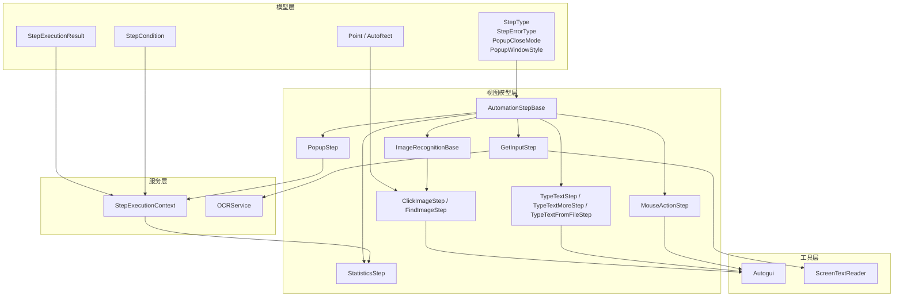
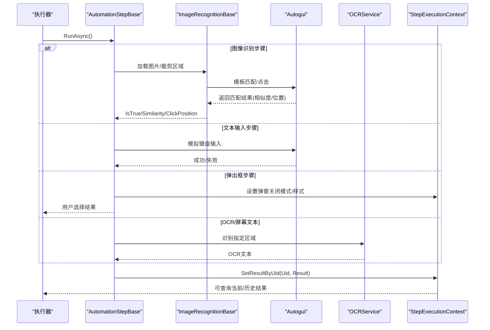
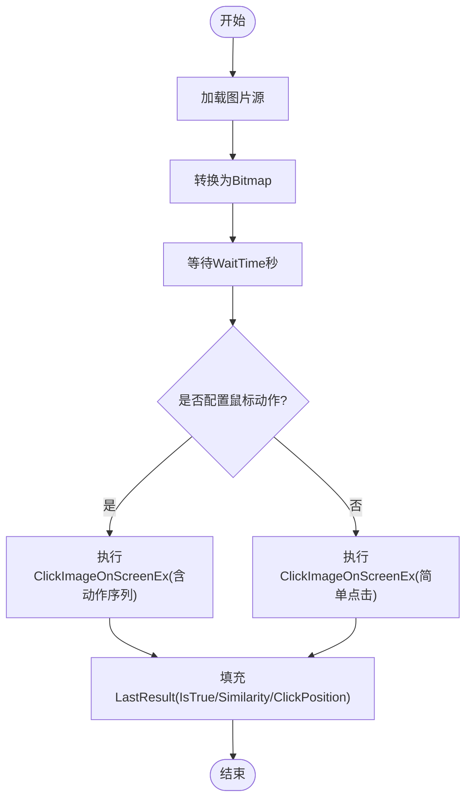

# 自动化步骤模型

<cite>
**本文引用的文件**   
- [AutomationStepModel.cs](file://ShaoLu/Models/AutomationStepModel.cs)
- [AutomationStep.cs](file://ShaoLu/Viewmodels/AutomationStep.cs)
- [ImageRecognition.cs](file://ShaoLu/Viewmodels/ImageRecognition.cs)
- [MouseActionStep.cs](file://ShaoLu/Viewmodels/MouseActionStep.cs)
- [GetInputStep.cs](file://ShaoLu/Viewmodels/GetInputStep.cs)
- [StatisticsStep.cs](file://ShaoLu/Viewmodels/StatisticsStep.cs)
- [StepExecutionContext.cs](file://ShaoLu/Services/StepExecutionContext.cs)
- [AutoguiModel.cs](file://ShaoLu/Models/AutoguiModel.cs)
- [StepExecutionResult.cs](file://ShaoLu/Models/StepExecutionResult.cs)
- [StepCondition.cs](file://ShaoLu/Models/StepCondition.cs)
- [Readme.md](file://Readme.md)
</cite>

## 目录
1. [简介](#简介)
2. [项目结构](#项目结构)
3. [核心组件](#核心组件)
4. [架构总览](#架构总览)
5. [详细组件分析](#详细组件分析)
6. [依赖关系分析](#依赖关系分析)
7. [性能考量](#性能考量)
8. [故障排查指南](#故障排查指南)
9. [结论](#结论)
10. [附录：使用示例与最佳实践](#附录使用示例与最佳实践)

## 简介
本文件系统化阐述 ShaoLu 的“自动化步骤模型”，重点包括：
- StepType 枚举的设计与用途（ClickImage、TypeText、FindImage 等）
- StepErrorType 错误类型体系（ImageNotFound、ExecutionTimeout 等）
- PopupCloseMode 与 PopupWindowStyle 的配置选项
- AutoPoint 类的设计思路与扩展机制
- 执行上下文与条件变量解析
- 具体使用示例与最佳实践

## 项目结构
ShaoLu 采用 WPF + MVVM 架构，步骤模型位于 Models 与 Viewmodels 层，服务层提供执行上下文与 OCR 能力。关键目录与职责：
- Models：枚举与数据模型（StepType、StepErrorType、PopupCloseMode、PopupWindowStyle、AutoPoint、Point、AutoRect、StepExecutionResult、StepCondition）
- Viewmodels：各步骤实现（点击识图、查找识图、输入文字、弹出框、鼠标操作、统计窗口、获取输入）
- Services：执行上下文（StepExecutionContext）、OCR、日志等
- Utils：底层 Autogui 封装、屏幕文本读取、单例定位器等

**图表来源** 
- [AutomationStepModel.cs:9-67](file://ShaoLu/Models/AutomationStepModel.cs#L9-L67)
- [AutoguiModel.cs:3-145](file://ShaoLu/Models/AutoguiModel.cs#L3-L145)
- [StepExecutionResult.cs:8-49](file://ShaoLu/Models/StepExecutionResult.cs#L8-L49)
- [StepCondition.cs:103-403](file://ShaoLu/Models/StepCondition.cs#L103-L403)
- [AutomationStep.cs:25-296](file://ShaoLu/Viewmodels/AutomationStep.cs#L25-L296)
- [ImageRecognition.cs:21-325](file://ShaoLu/Viewmodels/ImageRecognition.cs#L21-L325)
- [StepExecutionContext.cs:11-161](file://ShaoLu/Services/StepExecutionContext.cs#L11-L161)

**章节来源**
- [Readme.md:1-283](file://Readme.md#L1-L283)

## 核心组件
- 步骤基类 AutomationStepBase：统一属性（名称、描述、等待时间、跳转 UID、条件、日志开关、自引用限制）、通用执行接口 RunAsync、结果 LastResult、错误状态 ErrorType 等
- 图像识别基类 ImageRecognitionBase：图片路径、裁剪图、相似度阈值、点击点管理、图片加载与保存
- 具体步骤：ClickImageStep、FindImageStep、TypeTextStep、TypeTextMoreStep、TypeTextFromFileStep、PopupStep、MouseActionStep、GetInputStep、StatisticsStep
- 执行上下文 StepExecutionContext：记录每次步骤执行结果、运行计时、变量解析（Self_* / Step_* / Step_Triggered）
- 数据模型 Point/AutoRect：坐标与矩形封装，支持多种 Point 类型隐式转换
- 条件系统 StepCondition：变量、运算符、逻辑连接、OCR 文本提取模式

**章节来源**
- [AutomationStep.cs:25-296](file://ShaoLu/Viewmodels/AutomationStep.cs#L25-L296)
- [ImageRecognition.cs:21-325](file://ShaoLu/Viewmodels/ImageRecognition.cs#L21-L325)
- [StepExecutionContext.cs:11-161](file://ShaoLu/Services/StepExecutionContext.cs#L11-L161)
- [AutoguiModel.cs:3-145](file://ShaoLu/Models/AutoguiModel.cs#L3-L145)
- [StepCondition.cs:103-403](file://ShaoLu/Models/StepCondition.cs#L103-L403)

## 架构总览
步骤执行主流程：
- 调度器按顺序调用每个步骤的 RunAsync
- 步骤内部通过 Autogui 或 OCRService 完成实际动作
- 执行结果写入 StepExecutionResult，并缓存到 StepExecutionContext
- 条件判断基于 StepExecutionContext 解析变量，决定 TrueGotoUid/FalseGotoUid 跳转

**图表来源** 
- [ImageRecognition.cs:399-436](file://ShaoLu/Viewmodels/ImageRecognition.cs#L399-L436)
- [ImageRecognition.cs:535-599](file://ShaoLu/Viewmodels/ImageRecognition.cs#L535-L599)
- [AutomationStep.cs:345-364](file://ShaoLu/Viewmodels/AutomationStep.cs#L345-L364)
- [GetInputStep.cs:166-222](file://ShaoLu/Viewmodels/GetInputStep.cs#L166-L222)
- [StepExecutionContext.cs:39-52](file://ShaoLu/Services/StepExecutionContext.cs#L39-L52)

## 详细组件分析

### StepType 枚举设计
- Empty：占位/无效步骤
- ClickImage：在屏幕上查找目标图片并点击
- TypeText：模拟键盘输入一段文字
- FindImage：仅查找图片，不点击，用于条件判断
- ClickImages/FindImages：多图场景（依次点击/同时查找）
- TypeTextMore：前缀+中间+后缀组合，支持递增
- TypeTextFromFile：从 txt/csv/xlsx 逐行读取内容输入
- GetInput：从屏幕 OCR 或 UI Automation 读取文本
- MouseAction：在绝对坐标或当前位置执行鼠标动作序列
- Statistics：打开统计悬浮窗展示运行时指标
- Popup：弹出自定义对话框，支持按钮与关闭模式

用途说明：
- 图像类步骤（ClickImage/FindImage）适合 GUI 元素定位与交互
- 文本类步骤（TypeText*）适合表单填写、批量数据录入
- 输入类步骤（GetInput）适合动态信息抓取（如验证码、提示语）
- 控制类步骤（Popup/Statistics）适合人工确认与监控

**章节来源**
- [AutomationStepModel.cs:9-24](file://ShaoLu/Models/AutomationStepModel.cs#L9-L24)
- [Readme.md:17-202](file://Readme.md#L17-L202)

### StepErrorType 错误类型体系
- None：无错误
- ImageNotFound：未找到目标图片
- ImageLoadFailed：图片加载失败
- ImageMatchFailed：图像匹配失败
- TextEmpty：输入文本为空
- FileNotFound：文件不存在
- FileReadError：文件读取错误
- ExecutionTimeout：执行超时
- SelfReferenceLimit：自引用次数超限
- CancelledByUser：用户取消
- PopupError：弹窗相关错误
- ConversionError：类型转换错误
- IndexOutOfRange：索引越界（如文件列表耗尽）
- OCRError：OCR 识别错误
- Unknown：未知错误

使用建议：
- 图像类步骤优先检查 ImageNotFound/ImageMatchFailed
- 文本类步骤关注 TextEmpty/FileNotFound/FileReadError/IndexOutOfRange
- 控制类步骤关注 ExecutionTimeout/PopupError
- 调试时结合 StepExecutionResult.ErrorMessage 定位问题

**章节来源**
- [AutomationStepModel.cs:26-43](file://ShaoLu/Models/AutomationStepModel.cs#L26-L43)
- [ImageRecognition.cs:422-435](file://ShaoLu/Viewmodels/ImageRecognition.cs#L422-L435)
- [GetInputStep.cs:186-192](file://ShaoLu/Viewmodels/GetInputStep.cs#L186-L192)

### PopupCloseMode 与 PopupWindowStyle
- PopupCloseMode：
  - ButtonClick：用户点击按钮关闭
  - Timeout：超时自动关闭（秒数由 AutoCloseSeconds 配置）
  - StepReached：到达指定步骤 CloseOnStepUid 时关闭
- PopupWindowStyle：
  - Normal：正常窗口
  - Compact：紧凑窗口（未设置部分不占空间，边距更小）

应用场景：
- 人工确认环节：ButtonClick 模式配合“是/否”按钮
- 提醒通知：Timeout 模式自动消失
- 流程引导：StepReached 模式在特定步骤后自动关闭

**章节来源**
- [AutomationStepModel.cs:48-67](file://ShaoLu/Models/AutomationStepModel.cs#L48-L67)
- [AutomationStep.cs:714-728](file://ShaoLu/Viewmodels/AutomationStep.cs#L714-L728)

### AutoPoint 类设计与扩展机制
- AutoPoint：作为可扩展的“自动点”抽象基类，预留扩展点以支持自定义点击行为或附加信息
- Point/AutoRect：坐标与矩形封装，支持多类型隐式转换，便于跨库协作（OpenCVSharp、System.Drawing、WPF）

扩展建议：
- 继承 AutoPoint 实现特殊点击策略（如延迟、偏移、多点联动）
- 利用 Point/AutoRect 进行坐标计算与区域校验
- 在 ClickImageStep 中通过 ClickThumbs 管理多个点击点

**章节来源**
- [AutomationStepModel.cs:69-72](file://ShaoLu/Models/AutomationStepModel.cs#L69-L72)
- [AutoguiModel.cs:3-86](file://ShaoLu/Models/AutoguiModel.cs#L3-L86)
- [ImageRecognition.cs:118-123](file://ShaoLu/Viewmodels/ImageRecognition.cs#L118-L123)

### 执行上下文与条件变量
- StepExecutionContext：
  - 存储按行号与 UID 的执行结果
  - 维护执行次数与总耗时
  - 提供 ResolveVariable 解析条件变量（Self_* / Step_* / Step_Triggered）
- StepCondition：
  - 支持多种变量类型（IsTrue、Similarity、ExecutionTimeMs、ClickX/Y、OCRText、PopupResult）
  - 运算符包含等于、不等、大小比较、包含、空判断、正则匹配
  - 逻辑连接器 And/Or 支持多行组合
  - OCR 文本提取模式（Whole/Lines/FromSubstring/FromStart/FromEnd）

使用示例：
- 根据上一步相似度阈值决定是否继续
- 根据 OCR 结果中的某一行判断业务状态
- 统计某步骤触发次数（Step_Triggered）

**章节来源**
- [StepExecutionContext.cs:11-161](file://ShaoLu/Services/StepExecutionContext.cs#L11-L161)
- [StepCondition.cs:103-403](file://ShaoLu/Models/StepCondition.cs#L103-L403)

### 图像识别步骤（ClickImage/FindImage）
- ClickImageStep：
  - 参数：相似度阈值、点击次数、间隔、超时、鼠标动作序列
  - 执行：加载图片→模板匹配→点击→填充结果（相似度、点击位置）
- FindImageStep：
  - 参数：相似度阈值、查找间隔、超时、OCR 区域
  - 执行：模板匹配→可选 OCR→填充结果（相似度、点击位置、OCR 文本）

流程图（ClickImageStep.RunAsync）：

**图表来源** 
- [ImageRecognition.cs:399-436](file://ShaoLu/Viewmodels/ImageRecognition.cs#L399-L436)

**章节来源**
- [ImageRecognition.cs:329-436](file://ShaoLu/Viewmodels/ImageRecognition.cs#L329-L436)
- [ImageRecognition.cs:439-600](file://ShaoLu/Viewmodels/ImageRecognition.cs#L439-L600)

### 文本输入步骤（TypeText/TypeTextMore/TypeTextFromFile）
- TypeTextStep：直接输入固定文本，支持按键间隔与安全模式
- TypeTextMoreStep：三段组合（前缀/中间/后缀），支持递增标记，每次执行后自动递增
- TypeTextFromFileStep：从文件读取内容列表，逐行输入，支持 txt/csv/xlsx

关键点：
- 按键间隔为 0 时使用安全快速输入模式（兼容性更好）
- TypeTextFromFileStep 在索引越界时报错并重置索引

**章节来源**
- [AutomationStep.cs:300-365](file://ShaoLu/Viewmodels/AutomationStep.cs#L300-L365)
- [AutomationStep.cs:367-516](file://ShaoLu/Viewmodels/AutomationStep.cs#L367-L516)
- [AutomationStep.cs:518-680](file://ShaoLu/Viewmodels/AutomationStep.cs#L518-L680)

### 弹出框步骤（PopupStep）
- 支持标题、文本、字体、颜色、类型（Information/Warning/Error/Question）
- 自定义按钮集合，返回值 true/false
- 关闭模式：ButtonClick/Timeout/StepReached
- 窗口样式：Normal/Compact
- 运行时 ActivePopupWindow 供 StepReached 模式引用

**章节来源**
- [AutomationStep.cs:684-800](file://ShaoLu/Viewmodels/AutomationStep.cs#L684-L800)

### 鼠标操作步骤（MouseActionStep）
- PositionMode：Absolute（绝对坐标）/CurrentMouse（当前位置）
- TargetX/TargetY：目标坐标（Absolute 模式）
- MouseActions：鼠标动作序列（移动、点击、拖拽等）
- 执行：移动到目标位置→执行动作序列

**章节来源**
- [MouseActionStep.cs:15-161](file://ShaoLu/Viewmodels/MouseActionStep.cs#L15-L161)

### 获取输入步骤（GetInputStep）
- InputMode：OCR（屏幕区域识别）/ScreenText（UI Automation 读取可选择文本）
- OCRRegion：OCR 区域（绝对坐标）
- TextPoint：屏幕文本读取位置（逻辑像素）
- 执行：根据模式读取文本→填充 LastResult.OCRText

**章节来源**
- [GetInputStep.cs:15-294](file://ShaoLu/Viewmodels/GetInputStep.cs#L15-L294)

### 统计步骤（StatisticsStep）
- 统计项类型：总执行时间、步骤执行时间/次数/结果、条件计数、当前步骤
- 统计范围：All/LoggedOnly/Custom
- 条件计数：支持自定义条件规则，累计 true/false 次数
- 窗口：可置顶、背景色/透明度、自动关闭、停止时关闭

**章节来源**
- [StatisticsStep.cs:16-459](file://ShaoLu/Viewmodels/StatisticsStep.cs#L16-L459)

## 依赖关系分析
- 步骤基类依赖：
  - SingletonLocator：访问全局服务（Main、FileServices、Steps、Settings）
  - Autogui：底层屏幕操作（点击、输入、鼠标动作）
  - OCRService：OCR 识别
  - LanguageService：国际化字符串
- 执行上下文依赖：
  - StepExecutionResult：结构化结果
  - ConditionEvaluator：条件评估（在 StatisticsStep 中使用）

耦合与内聚：
- 步骤类高内聚：每个步骤封装自身逻辑与参数
- 低耦合：通过 Autogui/OCRService 抽象底层实现
- 扩展性：新增步骤只需继承 AutomationStepBase 并实现 RunAsync

潜在循环依赖：
- StepsViewModel 创建步骤实例，但步骤本身不反向依赖 ViewModel，避免循环

外部依赖：
- OpenCvSharp：图像模板匹配
- EPPlus：Excel 读取
- WPF/WinForms：UI 交互

**章节来源**
- [AutomationStep.cs:25-296](file://ShaoLu/Viewmodels/AutomationStep.cs#L25-L296)
- [ImageRecognition.cs:21-325](file://ShaoLu/Viewmodels/ImageRecognition.cs#L21-L325)
- [StepExecutionContext.cs:11-161](file://ShaoLu/Services/StepExecutionContext.cs#L11-L161)

## 性能考量
- 图像识别：
  - 裁剪区域越小越快，建议只框选关键特征
  - 相似度阈值 0.8~0.95 平衡准确率与速度
  - 多次点击时合理设置 ClickGap 与 NextClickTime
- 文本输入：
  - 按键间隔为 0 时使用安全模式，牺牲少量速度换取兼容性
  - 批量输入建议使用 TypeTextFromFileStep，减少内存占用
- OCR：
  - 合理设置 OCR 区域，避免全屏识别
  - DPI 缩放需正确处理（物理像素 vs 逻辑像素）
- 执行上下文：
  - 大量步骤时注意 Clear() 清理，避免内存泄漏
  - 统计项按需启用，减少评估开销

[本节为通用指导，无需源码引用]

## 故障排查指南
常见问题与定位方法：
- 图像未找到：
  - 检查图片路径与裁剪区域
  - 调整相似度阈值
  - 查看 StepErrorType.ImageNotFound
- 文本输入失败：
  - 检查焦点是否正确
  - 调整按键间隔
  - 查看 StepErrorType.TextEmpty/FileReadError
- OCR 识别失败：
  - 确认 OCR 区域有效
  - 检查 DPI 缩放
  - 查看 StepErrorType.OCRError
- 弹窗异常：
  - 检查关闭模式与超时设置
  - 查看 StepErrorType.PopupError
- 索引越界：
  - TypeTextFromFileStep 内容耗尽时报错，重置 Index

调试技巧：
- 启用 EnableLog 记录执行日志
- 使用 StepExecutionResult.ErrorMessage 获取详细信息
- 通过 StepExecutionContext.GetStepResult(uid) 查询历史结果

**章节来源**
- [ImageRecognition.cs:422-435](file://ShaoLu/Viewmodels/ImageRecognition.cs#L422-L435)
- [GetInputStep.cs:186-192](file://ShaoLu/Viewmodels/GetInputStep.cs#L186-L192)
- [AutomationStep.cs:651-679](file://ShaoLu/Viewmodels/AutomationStep.cs#L651-L679)

## 结论
ShaoLu 的自动化步骤模型通过清晰的枚举设计、完善的错误体系、灵活的弹出框配置以及可扩展的 AutoPoint 机制，提供了强大的 GUI 自动化能力。结合执行上下文与条件变量，可实现复杂业务流程编排。建议在实际使用中遵循最佳实践，合理配置参数，充分利用调试与统计功能提升稳定性与可维护性。

[本节为总结，无需源码引用]

## 附录：使用示例与最佳实践

### 典型用例
- 登录流程：
  - ClickImage 点击用户名输入框
  - TypeText 输入用户名
  - ClickImage 点击密码输入框
  - TypeText 输入密码
  - ClickImage 点击登录按钮
  - FindImage 验证登录成功
- 批量数据录入：
  - TypeTextFromFile 从 Excel 读取数据逐行输入
  - 配合条件跳转处理异常分支
- 人工确认：
  - Popup 弹出确认框，根据用户选择决定后续流程

### 最佳实践
- 图像识别：
  - 裁剪区域精确且最小化
  - 相似度阈值适中（0.85~0.9）
  - 多次点击时设置合理间隔
- 文本输入：
  - 中文输入建议 0.05s 以上间隔
  - 批量数据使用文件输入步骤
- OCR：
  - 明确 OCR 区域，避免全屏识别
  - 处理 DPI 缩放差异
- 条件判断：
  - 使用 Step_Triggered 统计执行次数
  - 正则匹配 OCR 结果中的关键字
- 错误处理：
  - 捕获常见错误类型并给出友好提示
  - 记录详细日志便于回溯

**章节来源**
- [Readme.md:17-202](file://Readme.md#L17-L202)
- [StepCondition.cs:103-403](file://ShaoLu/Models/StepCondition.cs#L103-L403)