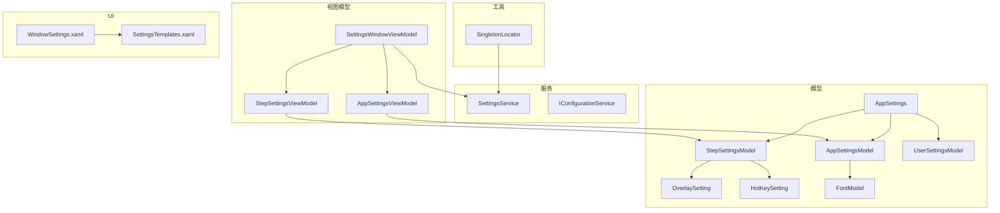
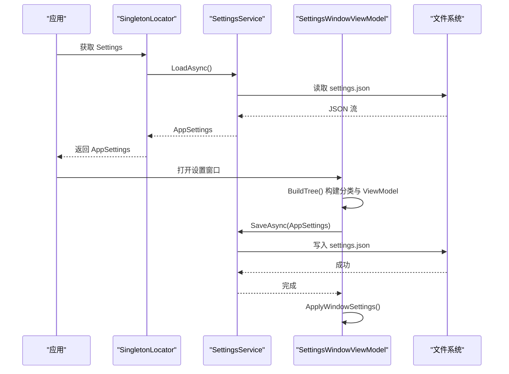
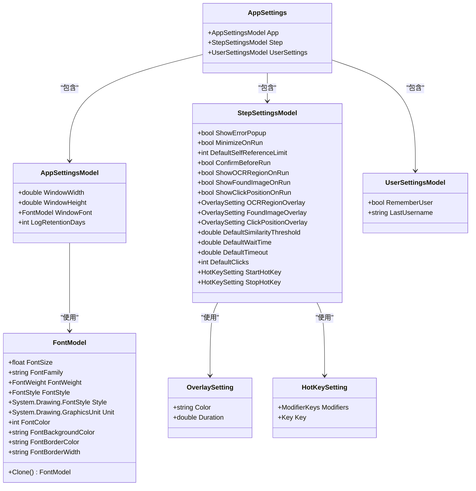
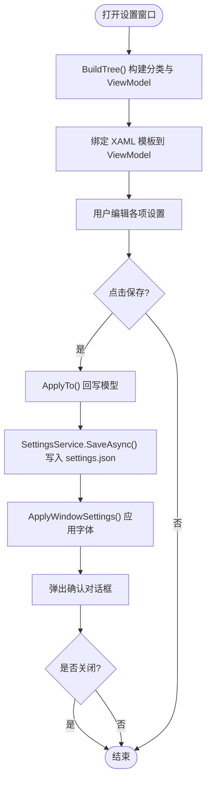
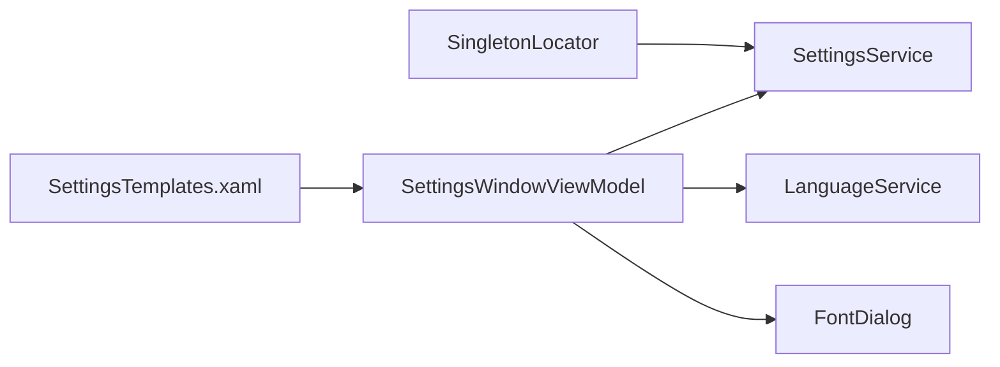

# 设置模型

<cite>
**本文引用的文件**
- [Settings.cs](file://ShaoLu/Models/Settings.cs)
- [SettingsService.cs](file://ShaoLu/Services/SettingsService.cs)
- [IConfigurationService.cs](file://ShaoLu/Services/IConfigurationService.cs)
- [SettingsViewModel.cs](file://ShaoLu/Viewmodels/SettingsViewModel.cs)
- [FontModel.cs](file://ShaoLu/Models/FontModel.cs)
- [SingletonLocator.cs](file://ShaoLu/Utils/SingletonLocator.cs)
- [SettingsTemplates.xaml](file://ShaoLu/Templates/SettingsTemplates.xaml)
- [WindowSettings.xaml](file://ShaoLu/Views/WindowSettings.xaml)
- [ModelTests.cs](file://NUnitTest/ModelTests.cs)
</cite>

## 目录
1. [简介](#简介)
2. [项目结构](#项目结构)
3. [核心组件](#核心组件)
4. [架构总览](#架构总览)
5. [详细组件分析](#详细组件分析)
6. [依赖关系分析](#依赖关系分析)
7. [性能与序列化特性](#性能与序列化特性)
8. [默认值管理与配置验证](#默认值管理与配置验证)
9. [配置文件编辑与迁移示例](#配置文件编辑与迁移示例)
10. [故障排查指南](#故障排查指南)
11. [结论](#结论)

## 简介
本文件为 ShaoLu 的设置模型提供系统化文档，重点解释 Settings 类的配置结构与参数设计，说明应用设置的分类与组织方式（界面设置、行为配置、高级选项），并阐述配置的序列化格式与版本兼容性处理策略。同时涵盖默认值管理、配置验证机制，以及配置文件的编辑与迁移实践建议。

## 项目结构
设置相关代码分布在 Models、Services、Viewmodels、Templates 与 Utils 等目录中：
- 模型层：定义 AppSettings、AppSettingsModel、StepSettingsModel、UserSettingsModel、OverlaySetting、HotKeySetting、FontModel 等数据结构。
- 服务层：SettingsService 负责 JSON 序列化/反序列化和持久化；IConfigurationService 定义了键值型配置接口（当前未实现）。
- 视图模型层：SettingsViewModel 构建设置树、绑定 UI、保存回写与窗口字体应用。
- 模板层：XAML 数据模板将 ViewModel 属性映射到界面控件。
- 工具层：SingletonLocator 暴露全局单例 Settings，供应用各处访问。

图表来源
- [Settings.cs:7-116](file://ShaoLu/Models/Settings.cs#L7-L116)
- [SettingsService.cs:7-38](file://ShaoLu/Services/SettingsService.cs#L7-L38)
- [SettingsViewModel.cs:161-260](file://ShaoLu/Viewmodels/SettingsViewModel.cs#L161-L260)
- [FontModel.cs:6-46](file://ShaoLu/Models/FontModel.cs#L6-L46)
- [SingletonLocator.cs:8-18](file://ShaoLu/Utils/SingletonLocator.cs#L8-L18)
- [WindowSettings.xaml:1-30](file://ShaoLu/Views/WindowSettings.xaml#L1-L30)
- [SettingsTemplates.xaml:1-170](file://ShaoLu/Templates/SettingsTemplates.xaml#L1-L170)

章节来源
- [Settings.cs:7-116](file://ShaoLu/Models/Settings.cs#L7-L116)
- [SettingsService.cs:7-38](file://ShaoLu/Services/SettingsService.cs#L7-L38)
- [SettingsViewModel.cs:161-260](file://ShaoLu/Viewmodels/SettingsViewModel.cs#L161-L260)
- [FontModel.cs:6-46](file://ShaoLu/Models/FontModel.cs#L6-L46)
- [SingletonLocator.cs:8-18](file://ShaoLu/Utils/SingletonLocator.cs#L8-L18)
- [WindowSettings.xaml:1-30](file://ShaoLu/Views/WindowSettings.xaml#L1-L30)
- [SettingsTemplates.xaml:1-170](file://ShaoLu/Templates/SettingsTemplates.xaml#L1-L170)

## 核心组件
- AppSettings：顶层配置容器，包含 App、Step、UserSettings 三个子配置块。
- AppSettingsModel：应用级界面与运行参数（窗口尺寸、字体、日志保留天数）。
- StepSettingsModel：步骤执行行为与调试覆盖层、默认参数、快捷键等。
- UserSettingsModel：用户登录记忆相关设置。
- OverlaySetting：调试覆盖层的颜色与显示时长。
- HotKeySetting：修饰键与主键组合。
- FontModel：字体族、大小、粗细、样式、单位及颜色等。

章节来源
- [Settings.cs:7-116](file://ShaoLu/Models/Settings.cs#L7-L116)
- [FontModel.cs:6-46](file://ShaoLu/Models/FontModel.cs#L6-L46)

## 架构总览
设置读取与保存流程如下：
- 启动时通过 SingletonLocator.Settings 获取全局 AppSettings（内部调用 SettingsService.LoadAsync）。
- 打开设置窗口时，SettingsWindowViewModel 基于全局 Settings 构建分类树与对应 ViewModel。
- 用户在界面修改后点击保存，SettingsWindowViewModel.SaveAsync 将 ViewModel 的值回写到模型，再调用 SettingsService.SaveAsync 写入 settings.json。
- 保存成功后可应用窗口字体等即时生效的配置。

图表来源
- [SingletonLocator.cs:15](file://ShaoLu/Utils/SingletonLocator.cs#L15)
- [SettingsService.cs:20-37](file://ShaoLu/Services/SettingsService.cs#L20-L37)
- [SettingsViewModel.cs:212-236](file://ShaoLu/Viewmodels/SettingsViewModel.cs#L212-L236)

章节来源
- [SingletonLocator.cs:8-18](file://ShaoLu/Utils/SingletonLocator.cs#L8-L18)
- [SettingsService.cs:7-38](file://ShaoLu/Services/SettingsService.cs#L7-L38)
- [SettingsViewModel.cs:161-260](file://ShaoLu/Viewmodels/SettingsViewModel.cs#L161-L260)

## 详细组件分析

### 设置模型类图

图表来源
- [Settings.cs:7-116](file://ShaoLu/Models/Settings.cs#L7-L116)
- [FontModel.cs:6-46](file://ShaoLu/Models/FontModel.cs#L6-L46)

章节来源
- [Settings.cs:7-116](file://ShaoLu/Models/Settings.cs#L7-L116)
- [FontModel.cs:6-46](file://ShaoLu/Models/FontModel.cs#L6-L46)

### 设置窗口与模板交互
- SettingsWindowViewModel.BuildTree 创建“App 设置”和“Step 设置”两大分类，每个分类下包含若干子节（如字体、日志保留、运行行为、默认参数、调试设置）。
- SettingsTemplates.xaml 为 AppSettingsViewModel 与 StepSettingsViewModel 提供 DataTemplate，将属性绑定到输入控件（文本框、数值框、复选框、颜色框、时间框等）。
- 保存命令 SaveAsync 将 ViewModel 的值回写到模型，然后调用 SettingsService.SaveAsync 持久化，并在确认后提示是否关闭窗口。

图表来源
- [SettingsViewModel.cs:182-209](file://ShaoLu/Viewmodels/SettingsViewModel.cs#L182-L209)
- [SettingsTemplates.xaml:10-169](file://ShaoLu/Templates/SettingsTemplates.xaml#L10-L169)
- [SettingsViewModel.cs:212-236](file://ShaoLu/Viewmodels/SettingsViewModel.cs#L212-L236)

章节来源
- [SettingsViewModel.cs:161-260](file://ShaoLu/Viewmodels/SettingsViewModel.cs#L161-L260)
- [SettingsTemplates.xaml:1-170](file://ShaoLu/Templates/SettingsTemplates.xaml#L1-L170)

### 配置分类与组织
- 界面设置（App）：窗口尺寸、字体、日志保留天数。
- 行为配置（Step）：错误弹窗、运行最小化、运行前确认、自引用次数上限、相似度阈值、等待/超时、点击次数、快捷键。
- 调试选项（Step）：OCR 区域、找到图像区域、点击位置区域的覆盖层颜色与显示时长。
- 用户设置（User）：记住用户名、上次用户名。

章节来源
- [Settings.cs:20-100](file://ShaoLu/Models/Settings.cs#L20-L100)
- [SettingsTemplates.xaml:10-169](file://ShaoLu/Templates/SettingsTemplates.xaml#L10-L169)

## 依赖关系分析
- SettingsService 依赖 System.Text.Json 进行序列化，路径固定为应用程序根目录下的 settings.json。
- SingletonLocator 在静态初始化时加载 Settings，所有模块通过该单例访问。
- SettingsWindowViewModel 依赖 LanguageService 获取本地化标题，依赖 WPF 的 FontDialog 选择字体。
- 模板层依赖 WPFDevelopers 的 NumericBox 控件用于数值输入。

图表来源
- [SingletonLocator.cs:15](file://ShaoLu/Utils/SingletonLocator.cs#L15)
- [SettingsService.cs:7-38](file://ShaoLu/Services/SettingsService.cs#L7-L38)
- [SettingsViewModel.cs:59-80](file://ShaoLu/Viewmodels/SettingsViewModel.cs#L59-L80)
- [SettingsTemplates.xaml:1-170](file://ShaoLu/Templates/SettingsTemplates.xaml#L1-L170)

章节来源
- [SingletonLocator.cs:8-18](file://ShaoLu/Utils/SingletonLocator.cs#L8-L18)
- [SettingsService.cs:7-38](file://ShaoLu/Services/SettingsService.cs#L7-L38)
- [SettingsViewModel.cs:59-80](file://ShaoLu/Viewmodels/SettingsViewModel.cs#L59-L80)
- [SettingsTemplates.xaml:1-170](file://ShaoLu/Templates/SettingsTemplates.xaml#L1-L170)

## 性能与序列化特性
- 使用 System.Text.Json 异步读写，WriteIndented=true 便于人工编辑与调试。
- 无额外转换器注册，依赖默认类型映射；对于复杂类型（如枚举、自定义结构体）需确保可序列化。
- 文件路径固定于应用根目录，避免权限问题；首次运行若不存在则返回默认对象。

章节来源
- [SettingsService.cs:9-37](file://ShaoLu/Services/SettingsService.cs#L9-L37)

## 默认值管理与配置验证
- 默认值：各模型属性在声明处赋予合理默认值（如窗口尺寸、开关状态、阈值、快捷键等），保证首次运行可用。
- 验证机制：
  - 模型层未内置校验逻辑，依赖 UI 层控件约束（如 NumericBox 的最小/最大值、精度）。
  - 单元测试覆盖默认值断言，确保新增或修改默认值时有回归保障。
- 扩展点：IConfigurationService 提供了键值型配置接口，可用于未来细粒度配置或迁移钩子。

章节来源
- [Settings.cs:20-100](file://ShaoLu/Models/Settings.cs#L20-L100)
- [SettingsTemplates.xaml:48-163](file://ShaoLu/Templates/SettingsTemplates.xaml#L48-L163)
- [ModelTests.cs:134-187](file://NUnitTest/ModelTests.cs#L134-L187)
- [IConfigurationService.cs:5-10](file://ShaoLu/Services/IConfigurationService.cs#L5-L10)

## 配置文件编辑与迁移示例
- 配置文件位置：应用程序根目录下的 settings.json。
- 编辑建议：
  - 保持 JSON 缩进可读性（由 WriteIndented=true 生成）。
  - 修改布尔、数值、字符串字段时需符合类型要求。
  - 覆盖层颜色为十六进制字符串，时长为浮点数。
- 迁移策略（建议）：
  - 在 SettingsService.LoadAsync 中增加版本号检测与迁移逻辑，例如：
    - 读取旧版字段并映射到新版字段。
    - 对缺失字段填充默认值。
    - 升级后保存为新版本结构。
  - 可使用 IConfigurationService 作为迁移钩子，按 key 存储迁移元数据。
- 示例流程（概念性）：
  - 读取 settings.json -> 解析为 AppSettings -> 检查版本 -> 执行迁移脚本 -> 保存新结构。

[本节为概念性指导，不直接分析具体文件]

## 故障排查指南
- 无法读取设置：
  - 检查 settings.json 是否存在且路径正确。
  - 确认 JSON 格式合法，无语法错误。
- 设置未生效：
  - 确认已调用 SaveAsync 并成功写入。
  - 检查 ApplyWindowSettings 是否正确应用字体等即时配置。
- 界面异常：
  - 检查 XAML 模板绑定属性名是否与 ViewModel 一致。
  - 确认 NumericBox 的取值范围与业务逻辑匹配。

章节来源
- [SettingsService.cs:20-37](file://ShaoLu/Services/SettingsService.cs#L20-L37)
- [SettingsViewModel.cs:238-258](file://ShaoLu/Viewmodels/SettingsViewModel.cs#L238-L258)
- [SettingsTemplates.xaml:10-169](file://ShaoLu/Templates/SettingsTemplates.xaml#L10-L169)

## 结论
ShaoLu 的设置模型以清晰的层次结构组织配置项，结合 JSON 序列化与单例访问模式，实现了易用、可扩展且易于维护的配置体系。通过 UI 模板与 ViewModel 的双向绑定，用户可在直观界面中调整界面、行为与调试选项。建议在后续迭代中引入版本化管理与迁移机制，增强兼容性与健壮性。