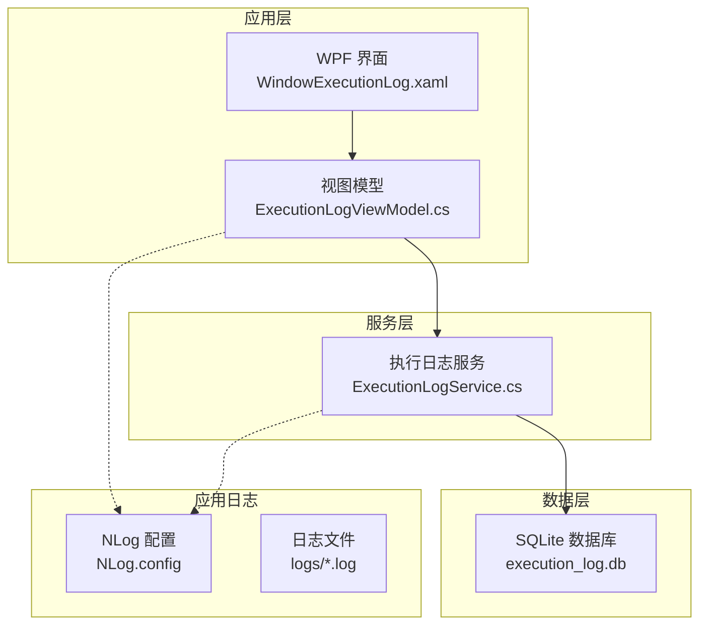
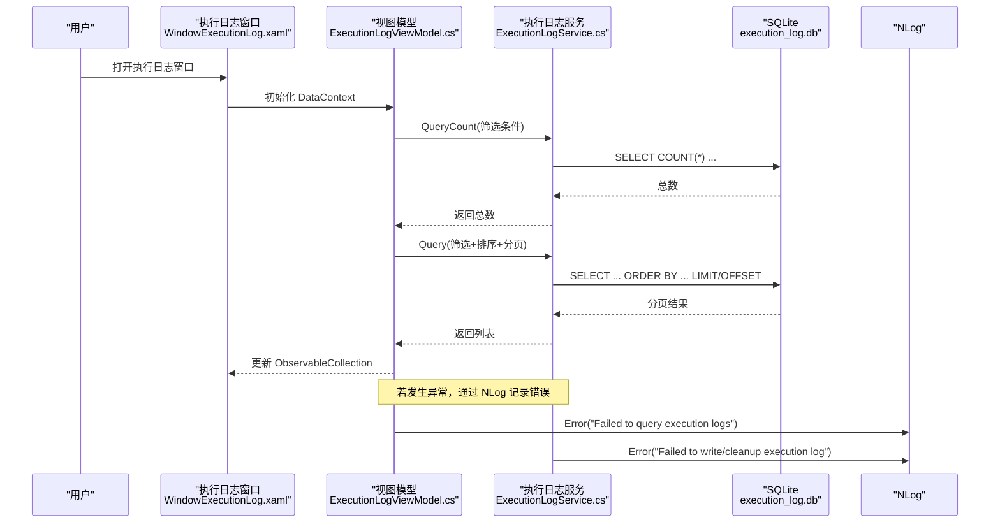
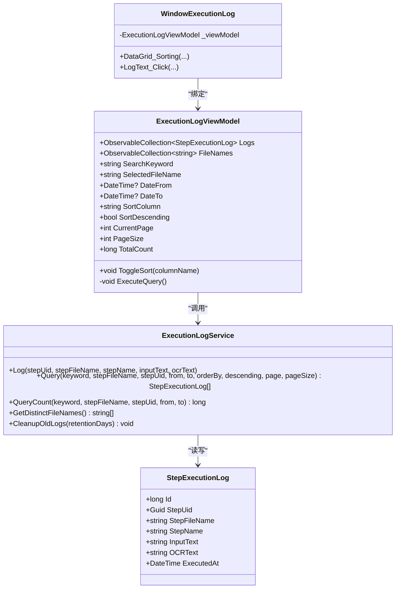

# 日志和监控

<cite>
**本文引用的文件**   
- [NLog.config](file://ShaoLu/NLog.config)
- [ExecutionLogService.cs](file://ShaoLu/Services/ExecutionLogService.cs)
- [StepExecutionLog.cs](file://ShaoLu/Models/StepExecutionLog.cs)
- [ExecutionLogViewModel.cs](file://ShaoLu/Viewmodels/ExecutionLogViewModel.cs)
- [WindowExecutionLog.xaml.cs](file://ShaoLu/Views/WindowExecutionLog.xaml.cs)
- [WindowExecutionLog.xaml](file://ShaoLu/Views/WindowExecutionLog.xaml)
- [StepsViewModel.cs](file://ShaoLu/Viewmodels/StepsViewModel.cs)
- [App.xaml.cs](file://ShaoLu/App.xaml.cs)
</cite>

## 目录
1. [简介](#简介)
2. [项目结构](#项目结构)
3. [核心组件](#核心组件)
4. [架构总览](#架构总览)
5. [详细组件分析](#详细组件分析)
6. [依赖关系分析](#依赖关系分析)
7. [性能考量](#性能考量)
8. [故障排查指南](#故障排查指南)
9. [结论](#结论)
10. [附录](#附录)

## 简介
本技术文档围绕 ShaoLu 的日志与监控系统展开，重点覆盖以下方面：
- NLog 配置选项、日志级别设置与输出格式定制
- ExecutionLogService 的执行日志记录策略、异步写入机制与性能优化
- 执行日志查看界面、过滤搜索与分页能力
- 日志分析、问题诊断与性能监控的最佳实践
- 日志配置示例与常见故障排查

## 项目结构
本项目采用 WPF + MVVM 架构，日志系统由两部分组成：
- 应用运行日志（NLog）：用于记录程序启动、异常、关键流程等运行时信息
- 执行日志（FreeSql + SQLite）：用于持久化自动化步骤的执行历史，支持查询、筛选、排序与分页

图表来源 
- [WindowExecutionLog.xaml:1-129](file://ShaoLu/Views/WindowExecutionLog.xaml#L1-L129)
- [ExecutionLogViewModel.cs:1-230](file://ShaoLu/Viewmodels/ExecutionLogViewModel.cs#L1-L230)
- [ExecutionLogService.cs:1-179](file://ShaoLu/Services/ExecutionLogService.cs#L1-L179)
- [NLog.config:1-20](file://ShaoLu/NLog.config#L1-L20)

章节来源
- [WindowExecutionLog.xaml:1-129](file://ShaoLu/Views/WindowExecutionLog.xaml#L1-L129)
- [ExecutionLogViewModel.cs:1-230](file://ShaoLu/Viewmodels/ExecutionLogViewModel.cs#L1-L230)
- [ExecutionLogService.cs:1-179](file://ShaoLu/Services/ExecutionLogService.cs#L1-L179)
- [NLog.config:1-20](file://ShaoLu/NLog.config#L1-L20)

## 核心组件
- NLog 配置：定义目标（文件与控制台）、布局与规则，启用异步写入以提升性能
- 执行日志服务：封装 FreeSql + SQLite 的增删查改，提供分页、筛选、排序与清理过期日志
- 执行日志模型：映射 step_execution_log 表结构，包含步骤 UID、文件名、名称、输入文本、OCR 结果与执行时间
- 执行日志视图模型：管理搜索、筛选、排序、分页状态，驱动 UI 与服务交互
- 执行日志窗口：绑定 ViewModel，实现服务端排序、文本预览等功能
- 应用入口：初始化语言、依赖注入、清理过期日志、全局异常捕获并记录到 NLog

章节来源
- [NLog.config:1-20](file://ShaoLu/NLog.config#L1-L20)
- [ExecutionLogService.cs:1-179](file://ShaoLu/Services/ExecutionLogService.cs#L1-L179)
- [StepExecutionLog.cs:1-47](file://ShaoLu/Models/StepExecutionLog.cs#L1-L47)
- [ExecutionLogViewModel.cs:1-230](file://ShaoLu/Viewmodels/ExecutionLogViewModel.cs#L1-L230)
- [WindowExecutionLog.xaml.cs:1-47](file://ShaoLu/Views/WindowExecutionLog.xaml.cs#L1-L47)
- [App.xaml.cs:1-112](file://ShaoLu/App.xaml.cs#L1-L112)

## 架构总览
下图展示了从 UI 到服务再到数据存储的完整调用链，以及 NLog 在异常路径中的使用。

图表来源 
- [WindowExecutionLog.xaml.cs:1-47](file://ShaoLu/Views/WindowExecutionLog.xaml.cs#L1-L47)
- [ExecutionLogViewModel.cs:188-225](file://ShaoLu/Viewmodels/ExecutionLogViewModel.cs#L188-L225)
- [ExecutionLogService.cs:60-143](file://ShaoLu/Services/ExecutionLogService.cs#L60-L143)
- [NLog.config:1-20](file://ShaoLu/NLog.config#L1-L20)

## 详细组件分析

### NLog 配置与输出格式
- 目标（Targets）
  - 文件目标：按日期生成日志文件，位于应用目录下的 logs 文件夹
  - 控制台目标：将日志输出到控制台
- 布局（Layout）
  - 包含长日期、大写级别、记录器名称、消息与异常信息
- 规则（Rules）
  - 所有记录器（name="*"）最低级别为 Debug，同时写入文件与控制台
- 异步写入
  - targets 节点启用 async="true"，提升高并发写入性能

建议与最佳实践
- 生产环境可将 minlevel 调整为 Info 或 Warn，减少无关日志
- 如需归档与压缩，可在 File 目标中启用 archive 相关属性（参考 NLog.xsd）
- 保持 autoReload="true" 便于热更新配置

章节来源
- [NLog.config:1-20](file://ShaoLu/NLog.config#L1-L20)

### ExecutionLogService：执行日志服务
职责
- 单例 IFreeSql 初始化，自动创建数据库目录与同步表结构
- 插入执行日志（步骤 UID、文件名、名称、输入文本、OCR 文本、执行时间）
- 分页查询与计数，支持关键字搜索、文件名筛选、UID 筛选、时间范围、排序
- 获取不重复的文件名列表（供筛选下拉框）
- 清理超过保留天数的旧日志

异步写入机制
- 服务本身为同步方法，但 NLog 目标已启用异步写入；对于高频写入场景，可考虑在调用方使用队列或后台任务批量写入（当前实现以简单可靠为主）

性能优化
- 使用 FreeSql 的 Select/Where/OrderBy/Page 进行服务端分页与过滤
- 避免一次性加载全量数据，合理设置 pageSize（默认 100）
- 对频繁筛选字段（如 ExecutedAt、StepFileName）建议在数据库层面建立索引（视数据量而定）

异常处理
- 写入失败时通过 NLog 记录错误，确保主流程不受影响
- 清理过期日志失败同样记录错误，不影响正常功能

章节来源
- [ExecutionLogService.cs:1-179](file://ShaoLu/Services/ExecutionLogService.cs#L1-L179)

### StepExecutionLog：执行日志模型
字段说明
- Id：自增主键
- StepUid：步骤唯一标识
- StepFileName：步骤文件名（无扩展名），用于区分不同步骤文件
- StepName：步骤名称
- InputText：本次执行的输入内容
- OCRText：OCR 识别结果（可选）
- ExecutedAt：执行时间

复杂度与存储
- 字符串字段长度较大时使用 -1（可变长度），适合存储较长文本
- 时间戳字段用于排序与范围筛选

章节来源
- [StepExecutionLog.cs:1-47](file://ShaoLu/Models/StepExecutionLog.cs#L1-L47)

### ExecutionLogViewModel：执行日志视图模型
功能要点
- 维护搜索关键字、文件名筛选、起止日期、排序列与方向、页码与大小
- 命令：搜索、重置、上一页、下一页
- 服务端排序：阻止 DataGrid 本地排序，统一在服务端执行
- 分页：先查询总数，再查询当前页数据，更新集合与命令可用性

数据流
- LoadFileNames：获取不重复文件名列表
- DoSearch/DoReset：重置或执行搜索
- ToggleSort：切换排序列与方向
- ExecuteQuery：组合筛选条件，调用服务层 QueryCount 与 Query

异常处理
- 查询失败时通过 NLog 记录错误

章节来源
- [ExecutionLogViewModel.cs:1-230](file://ShaoLu/Viewmodels/ExecutionLogViewModel.cs#L1-L230)

### WindowExecutionLog：执行日志窗口
交互逻辑
- 绑定 ViewModel，禁用 DataGrid 本地排序，改为调用 ViewModel 的服务端排序
- 点击截断文本时弹出预览窗口显示完整内容

章节来源
- [WindowExecutionLog.xaml.cs:1-47](file://ShaoLu/Views/WindowExecutionLog.xaml.cs#L1-L47)
- [WindowExecutionLog.xaml:1-129](file://ShaoLu/Views/WindowExecutionLog.xaml#L1-L129)

### 执行日志记录点：StepsViewModel
触发时机
- 每个步骤执行后，若启用日志，则记录结果、耗时、相似度与 OCR 文本
- 记录内容包含步骤 UID、文件名、名称与格式化后的日志文本

章节来源
- [StepsViewModel.cs:580-590](file://ShaoLu/Viewmodels/StepsViewModel.cs#L580-L590)

### 应用入口：App.xaml.cs
- 启动时初始化语言、依赖注入容器
- 根据设置清理过期执行日志
- 全局异常捕获（UI、AppDomain、TaskScheduler）并记录到 NLog

章节来源
- [App.xaml.cs:1-112](file://ShaoLu/App.xaml.cs#L1-L112)

## 依赖关系分析

图表来源 
- [ExecutionLogService.cs:1-179](file://ShaoLu/Services/ExecutionLogService.cs#L1-L179)
- [StepExecutionLog.cs:1-47](file://ShaoLu/Models/StepExecutionLog.cs#L1-L47)
- [ExecutionLogViewModel.cs:1-230](file://ShaoLu/Viewmodels/ExecutionLogViewModel.cs#L1-L230)
- [WindowExecutionLog.xaml.cs:1-47](file://ShaoLu/Views/WindowExecutionLog.xaml.cs#L1-L47)

章节来源
- [ExecutionLogService.cs:1-179](file://ShaoLu/Services/ExecutionLogService.cs#L1-L179)
- [StepExecutionLog.cs:1-47](file://ShaoLu/Models/StepExecutionLog.cs#L1-L47)
- [ExecutionLogViewModel.cs:1-230](file://ShaoLu/Viewmodels/ExecutionLogViewModel.cs#L1-L230)
- [WindowExecutionLog.xaml.cs:1-47](file://ShaoLu/Views/WindowExecutionLog.xaml.cs#L1-L47)

## 性能考量
- NLog 异步写入：targets 启用 async="true"，降低 IO 阻塞
- 服务端分页：默认每页 100 条，避免一次性加载大量数据
- 筛选与排序：在服务端执行，减少内存占用与网络开销（此处为本地 SQLite）
- 数据库连接：IFreeSql 使用 Lazy 初始化，避免重复创建
- 清理策略：启动时清理过期日志，控制数据库体积增长

[本节为通用指导，无需特定文件引用]

## 故障排查指南
常见问题与定位方法
- 无法写入执行日志
  - 检查数据库目录是否存在且可写
  - 查看 NLog 日志文件（logs/*.log）是否记录“写入失败”错误
  - 确认 FreeSql 连接字符串指向正确的 ApplicationData 路径
- 查询缓慢或卡顿
  - 调整 pageSize，避免过大
  - 增加常用筛选字段索引（如 ExecutedAt、StepFileName）
  - 避免在 UI 线程执行复杂查询（当前实现已在 UI 线程调用，必要时可异步化）
- 日志未输出
  - 检查 NLog.config 的 rules 是否包含对应 logger 与 minlevel
  - 确认应用程序具有写入 logs 目录的权限
- 清理过期日志失败
  - 查看 NLog 错误日志，确认删除权限与磁盘空间

章节来源
- [ExecutionLogService.cs:51-55](file://ShaoLu/Services/ExecutionLogService.cs#L51-L55)
- [ExecutionLogService.cs:172-176](file://ShaoLu/Services/ExecutionLogService.cs#L172-L176)
- [ExecutionLogViewModel.cs:221-225](file://ShaoLu/Viewmodels/ExecutionLogViewModel.cs#L221-L225)
- [NLog.config:1-20](file://ShaoLu/NLog.config#L1-L20)

## 结论
ShaoLu 的日志与监控系统通过 NLog 与应用执行日志（SQLite）双轨并行，既保证了运行时的可观测性，又提供了强大的执行历史查询与分析能力。通过合理的配置与优化策略，可以在保证稳定性的前提下获得良好的性能体验。

[本节为总结性内容，无需特定文件引用]

## 附录

### 日志配置示例（基于现有 NLog.config）
- 文件目标：按日期命名，位于应用目录 logs 子目录
- 控制台目标：开发调试时快速查看
- 规则：所有记录器最低级别为 Debug，同时输出到文件与控制台
- 异步：targets 启用 async="true"

章节来源
- [NLog.config:1-20](file://ShaoLu/NLog.config#L1-L20)

### 执行日志查看界面功能清单
- 搜索：关键字匹配输入文本或步骤名称
- 筛选：按步骤文件名、起止日期筛选
- 排序：支持多列排序（服务端执行）
- 分页：上一页/下一页，显示总页数与总记录数
- 预览：点击截断文本查看完整内容

章节来源
- [WindowExecutionLog.xaml:1-129](file://ShaoLu/Views/WindowExecutionLog.xaml#L1-L129)
- [ExecutionLogViewModel.cs:1-230](file://ShaoLu/Viewmodels/ExecutionLogViewModel.cs#L1-L230)
- [WindowExecutionLog.xaml.cs:1-47](file://ShaoLu/Views/WindowExecutionLog.xaml.cs#L1-L47)

### 执行日志导出能力
当前版本未内置导出功能。建议扩展：
- 在 ViewModel 中添加导出命令
- 支持导出为 CSV/Excel（注意大文件分块导出）
- 导出前应用相同筛选与排序条件

[本节为概念性扩展建议，无需特定文件引用]

### 日志分析、问题诊断与性能监控最佳实践
- 分层日志：应用级（NLog）与业务级（执行日志）分离，便于定位问题
- 关键指标：记录步骤执行耗时、相似度、OCR 结果，辅助性能分析
- 定期清理：根据保留天数清理过期日志，控制存储成本
- 监控告警：结合外部监控平台采集 NLog 错误率与执行失败率
- 数据治理：对高频筛选字段建立索引，优化查询性能

[本节为通用指导，无需特定文件引用]