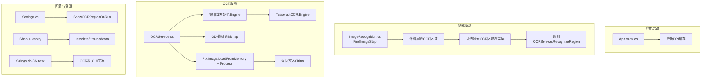
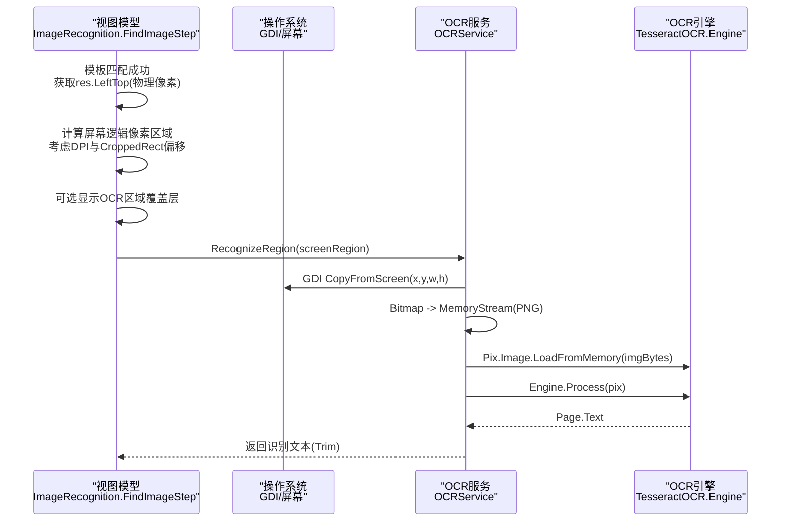
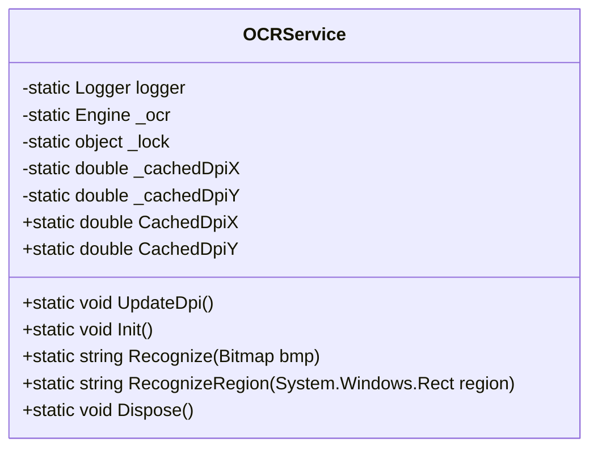
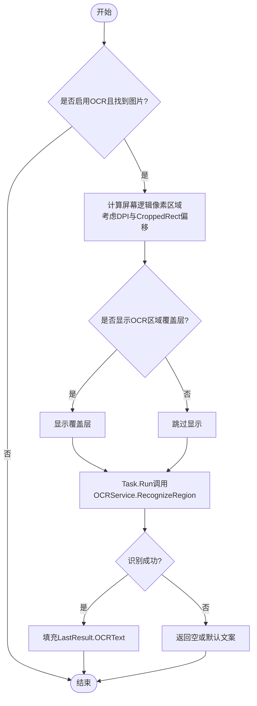
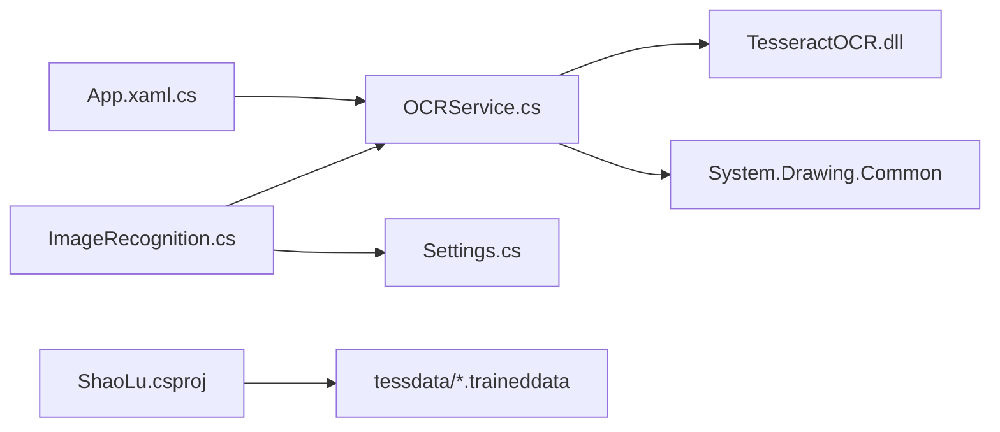

# OCR 服务 (OCRService)

<cite>
**本文引用的文件**   
- [OCRService.cs](file://ShaoLu/Services/OCRService.cs)
- [ImageRecognition.cs](file://ShaoLu/Viewmodels/ImageRecognition.cs)
- [App.xaml.cs](file://ShaoLu/App.xaml.cs)
- [Settings.cs](file://ShaoLu/Models/Settings.cs)
- [ShaoLu.csproj](file://ShaoLu/ShaoLu.csproj)
- [Strings.zh-CN.resx](file://ShaoLu/Resources/Strings.zh-CN.resx)
- [StepDetailTemplates.xaml](file://ShaoLu/Templates/StepDetailTemplates.xaml)
</cite>

## 目录
1. [简介](#简介)
2. [项目结构](#项目结构)
3. [核心组件](#核心组件)
4. [架构总览](#架构总览)
5. [详细组件分析](#详细组件分析)
6. [依赖关系分析](#依赖关系分析)
7. [性能与内存管理](#性能与内存管理)
8. [配置与调优](#配置与调优)
9. [故障排查指南](#故障排查指南)
10. [结论](#结论)

## 简介
本技术文档聚焦 ShaoLu 的 OCR 服务（OCRService），围绕 TesseractOCR 引擎集成、图像预处理、识别结果后处理、多线程安全访问、内存管理、识别精度优化等关键实现进行系统化说明。同时覆盖语言包管理、自定义训练数据加载、OCR 配置参数调优、性能优化建议与常见问题解决方案，帮助读者快速理解并高效使用 OCR 能力。

## 项目结构
OCR 功能在 ShaoLu 中的组织方式如下：
- 服务层：OCRService 封装 TesseractOCR 引擎，提供线程安全的 OCR 识别接口。
- 视图模型层：ImageRecognition 中的 FindImageStep 负责将模板匹配结果与 OCR 区域结合，计算屏幕逻辑坐标并调用 OCRService。
- 应用启动：App.xaml.cs 在 UI 线程初始化 DPI 缓存，避免后台线程访问 WPF 对象。
- 配置与资源：Settings 定义运行时覆盖层显示开关；csproj 打包 tessdata 语言包；本地化字符串用于 UI 提示。

图表来源
- [App.xaml.cs:84](file://ShaoLu/App.xaml.cs#L84)
- [ImageRecognition.cs:560-602](file://ShaoLu/Viewmodels/ImageRecognition.cs#L560-L602)
- [OCRService.cs:53-107](file://ShaoLu/Services/OCRService.cs#L53-L107)
- [Settings.cs:48-66](file://ShaoLu/Models/Settings.cs#L48-L66)
- [ShaoLu.csproj:465-489](file://ShaoLu/ShaoLu.csproj#L465-L489)
- [Strings.zh-CN.resx:827-866](file://ShaoLu/Resources/Strings.zh-CN.resx#L827-L866)

章节来源
- [App.xaml.cs:84](file://ShaoLu/App.xaml.cs#L84)
- [ImageRecognition.cs:560-602](file://ShaoLu/Viewmodels/ImageRecognition.cs#L560-L602)
- [OCRService.cs:53-107](file://ShaoLu/Services/OCRService.cs#L53-L107)
- [Settings.cs:48-66](file://ShaoLu/Models/Settings.cs#L48-L66)
- [ShaoLu.csproj:465-489](file://ShaoLu/ShaoLu.csproj#L465-L489)
- [Strings.zh-CN.resx:827-866](file://ShaoLu/Resources/Strings.zh-CN.resx#L827-L866)

## 核心组件
- OCRService：基于 TesseractOCR 的静态服务类，提供线程安全的引擎初始化、屏幕区域截图与 OCR 识别、DPI 缓存更新与释放。
- ImageRecognition.FindImageStep：在模板匹配成功后，根据物理像素坐标与裁剪偏移计算屏幕逻辑像素区域，支持运行中可视化覆盖层，并异步调用 OCRService。
- App.xaml.cs：在主窗口加载后调用 OCRService.UpdateDpi()，确保 DPI 缩放因子正确缓存。
- Settings.cs：提供 ShowOCRRegionOnRun 等运行时行为开关，控制是否显示 OCR 区域覆盖层。
- ShaoLu.csproj：打包 chi_sim、eng、equ、jpn 等多语言训练数据至输出目录，供 OCRService 读取。

章节来源
- [OCRService.cs:12-157](file://ShaoLu/Services/OCRService.cs#L12-L157)
- [ImageRecognition.cs:439-602](file://ShaoLu/Viewmodels/ImageRecognition.cs#L439-L602)
- [App.xaml.cs:84](file://ShaoLu/App.xaml.cs#L84)
- [Settings.cs:48-66](file://ShaoLu/Models/Settings.cs#L48-L66)
- [ShaoLu.csproj:465-489](file://ShaoLu/ShaoLu.csproj#L465-L489)

## 架构总览
OCR 流程从视图模型发起，经坐标转换与可选覆盖层展示，最终由 OCRService 完成截图与识别。

图表来源
- [ImageRecognition.cs:560-602](file://ShaoLu/Viewmodels/ImageRecognition.cs#L560-L602)
- [OCRService.cs:114-144](file://ShaoLu/Services/OCRService.cs#L114-L144)
- [OCRService.cs:82-107](file://ShaoLu/Services/OCRService.cs#L82-L107)

## 详细组件分析

### OCRService 组件分析
- 线程安全：使用静态锁 _lock 保护单例 Engine 的懒加载初始化，避免并发重复创建。
- DPI 缓存：通过 UpdateDpi() 在 UI 线程设置 CachedDpiX/Y，后续后台线程仅读取，避免跨线程访问 WPF 对象。
- 引擎初始化：首次调用时构造 Engine，指定 tessdata 路径与语言组合（如 chi_sim+eng）。
- 识别流程：Recognize(Bitmap) 将 Bitmap 保存为 PNG 字节流，再加载为 Pix 并调用 Process 提取文本；RecognizeRegion(Rect) 使用 GDI 截取屏幕区域并调用 Recognize。
- 异常处理：所有关键步骤捕获异常并记录日志，失败时返回空字符串，保证上层稳定性。
- 资源释放：Dispose() 释放 Engine 实例，防止内存泄漏。

图表来源
- [OCRService.cs:12-157](file://ShaoLu/Services/OCRService.cs#L12-L157)

章节来源
- [OCRService.cs:12-157](file://ShaoLu/Services/OCRService.cs#L12-L157)

### ImageRecognition.FindImageStep 组件分析
- OCR 开关与区域：EnableOCR 控制是否启用 OCR；OCRRect 定义相对于原图的识别区域。
- 坐标转换：将模板匹配得到的物理像素坐标 res.LeftTop 与 OCRRect 相对偏移结合，除以 DPI 得到屏幕逻辑像素区域。
- 可视化覆盖层：根据 Settings.Step.ShowOCRRegionOnRun 决定是否在屏幕上显示 OCR 区域。
- 异步执行：通过 Task.Run 调用 OCRService.RecognizeRegion，避免阻塞 UI 线程。
- 结果回填：将识别文本写入 LastResult.OCRText，并在 UI 上预览。

图表来源
- [ImageRecognition.cs:560-602](file://ShaoLu/Viewmodels/ImageRecognition.cs#L560-L602)
- [Settings.cs:48-66](file://ShaoLu/Models/Settings.cs#L48-L66)

章节来源
- [ImageRecognition.cs:439-602](file://ShaoLu/Viewmodels/ImageRecognition.cs#L439-L602)
- [Settings.cs:48-66](file://ShaoLu/Models/Settings.cs#L48-L66)

### 应用启动与 DPI 初始化
- App.OnStartup 中调用 OCRService.UpdateDpi()，确保 DPI 缩放因子在 UI 线程设置一次，之后被后台线程安全读取。

章节来源
- [App.xaml.cs:84](file://ShaoLu/App.xaml.cs#L84)

### 配置与资源
- Settings.Step.ShowOCRRegionOnRun：控制运行中是否显示 OCR 区域覆盖层。
- csproj 打包 tessdata：包含 chi_sim、chi_tra、eng、equ、jpn 等语言包，供 OCRService 初始化时加载。
- 本地化字符串：Strings.zh-CN.resx 提供 OCR 相关 UI 文案，如“OCR结果”、“设置OCR区域”等。

章节来源
- [Settings.cs:48-66](file://ShaoLu/Models/Settings.cs#L48-L66)
- [ShaoLu.csproj:465-489](file://ShaoLu/ShaoLu.csproj#L465-L489)
- [Strings.zh-CN.resx:827-866](file://ShaoLu/Resources/Strings.zh-CN.resx#L827-L866)

## 依赖关系分析
- OCRService 依赖 TesseractOCR 库与 System.Drawing.Common，用于图像内存加载与 GDI 截图。
- ImageRecognition 依赖 OCRService 与 Settings，用于 OCR 触发与覆盖层显示。
- App 依赖 OCRService，用于 DPI 初始化。
- csproj 依赖 TesseractOCR NuGet 包与 System.Drawing.Common，并打包 tessdata 资源。

图表来源
- [App.xaml.cs:84](file://ShaoLu/App.xaml.cs#L84)
- [ImageRecognition.cs:560-602](file://ShaoLu/Viewmodels/ImageRecognition.cs#L560-L602)
- [OCRService.cs:1-6](file://ShaoLu/Services/OCRService.cs#L1-L6)
- [ShaoLu.csproj:126-128](file://ShaoLu/ShaoLu.csproj#L126-L128)
- [ShaoLu.csproj:429-432](file://ShaoLu/ShaoLu.csproj#L429-L432)
- [ShaoLu.csproj:465-489](file://ShaoLu/ShaoLu.csproj#L465-L489)

章节来源
- [OCRService.cs:1-6](file://ShaoLu/Services/OCRService.cs#L1-L6)
- [ShaoLu.csproj:126-128](file://ShaoLu/ShaoLu.csproj#L126-L128)
- [ShaoLu.csproj:429-432](file://ShaoLu/ShaoLu.csproj#L429-L432)
- [ShaoLu.csproj:465-489](file://ShaoLu/ShaoLu.csproj#L465-L489)

## 性能与内存管理
- 懒加载与单例：OCRService.Init() 使用双重检查锁定，避免重复初始化 Engine，降低启动开销。
- 内存流与对象释放：Recognize(Bitmap) 使用 MemoryStream 与 using 语句确保 Pix、Page 等资源及时释放，减少内存占用。
- 截图优化：RecognizeRegion(Rect) 直接按目标尺寸创建 Bitmap，避免额外缩放带来的性能损耗。
- 线程安全：静态锁保护引擎初始化；DPI 缓存仅在 UI 线程写入，后台线程只读，避免竞态与跨线程异常。
- 日志与异常：关键路径记录错误日志，失败返回空字符串，提升鲁棒性。

[本节为通用指导，不直接分析具体文件]

## 配置与调优
- 语言包管理：
  - 当前默认语言组合为 chi_sim+eng，可通过修改 Engine 初始化参数切换语言包。
  - 可在 csproj 中添加/移除 tessdata/*.traineddata 以扩展语言支持。
- 自定义训练数据加载：
  - 将自定义 .traineddata 放入输出目录的 tessdata 文件夹，并确保 Engine 初始化路径指向该目录。
- OCR 区域选择：
  - 在编辑窗口中设置 OCR 区域（OCRRect），越小越精确，有助于提高识别速度与准确率。
- 运行时覆盖层：
  - 通过 Settings.Step.ShowOCRRegionOnRun 控制是否显示 OCR 区域覆盖层，便于调试定位。
- 输入模式与 UI 绑定：
  - StepDetailTemplates.xaml 中根据 InputMode=OCR 显示 OCR 区域配置项，便于用户交互。

章节来源
- [OCRService.cs:63-65](file://ShaoLu/Services/OCRService.cs#L63-L65)
- [ShaoLu.csproj:465-489](file://ShaoLu/ShaoLu.csproj#L465-L489)
- [Settings.cs:48-66](file://ShaoLu/Models/Settings.cs#L48-L66)
- [StepDetailTemplates.xaml:554-564](file://ShaoLu/Templates/StepDetailTemplates.xaml#L554-L564)

## 故障排查指南
- 引擎初始化失败：
  - 检查 tessdata 路径是否正确，语言包是否存在；查看 NLog 日志确认初始化错误信息。
- 识别结果为空：
  - 确认 OCR 区域有效（非空且有宽高）；检查 DPI 缓存是否已更新；验证截图区域是否包含可读文本。
- 多显示器/DPI 问题：
  - 确保在 UI 线程调用 UpdateDpi()，并使用 CachedDpiX/Y 进行坐标转换。
- 内存泄漏风险：
  - 确保使用 using 释放 Pix、Page、Bitmap 等资源；程序退出时调用 Dispose() 释放 Engine。
- 覆盖层不显示：
  - 检查 Settings.Step.ShowOCRRegionOnRun 是否开启；确认 Dispatcher.InvokeAsync 调用正常。

章节来源
- [OCRService.cs:53-75](file://ShaoLu/Services/OCRService.cs#L53-L75)
- [OCRService.cs:82-107](file://ShaoLu/Services/OCRService.cs#L82-L107)
- [OCRService.cs:114-144](file://ShaoLu/Services/OCRService.cs#L114-L144)
- [App.xaml.cs:84](file://ShaoLu/App.xaml.cs#L84)
- [Settings.cs:48-66](file://ShaoLu/Models/Settings.cs#L48-L66)

## 结论
OCRService 在 ShaoLu 中提供了稳定、线程安全、易于扩展的文字识别能力。通过懒加载引擎、DPI 缓存、内存流与对象释放、以及完善的异常处理，确保了在高并发与多显示器环境下的可靠性。配合 ImageRecognition 的坐标转换与覆盖层可视化，用户可以精准定位识别区域并实时反馈结果。通过合理配置语言包与训练数据，可灵活适配多语言与复杂场景。建议在生产环境中持续监控日志与性能指标，按需优化 OCR 区域与语言组合，以获得最佳识别效果与系统稳定性。