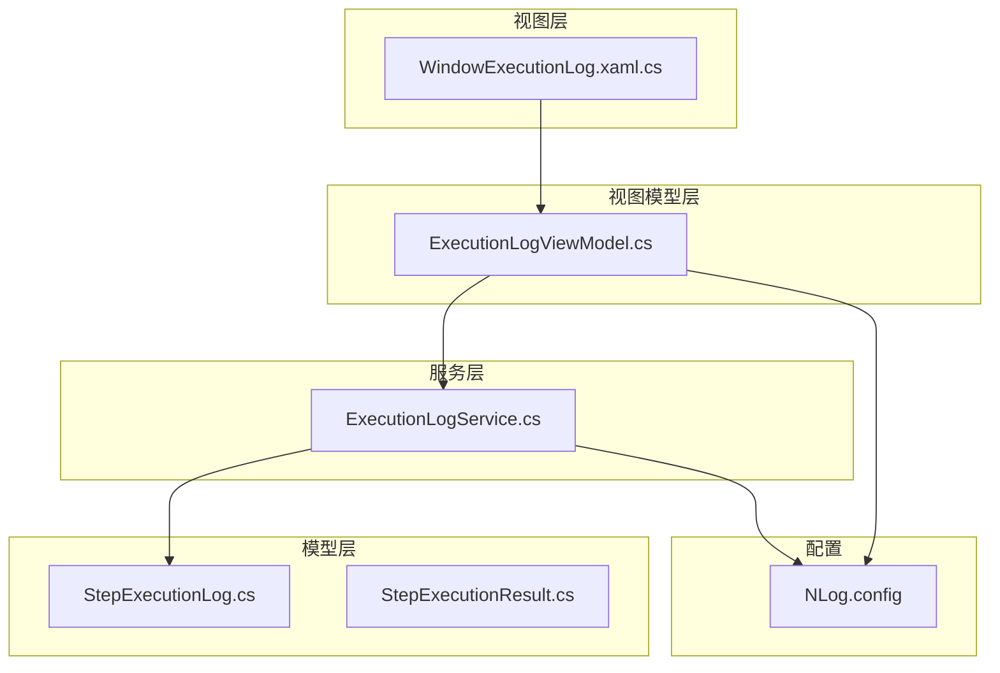
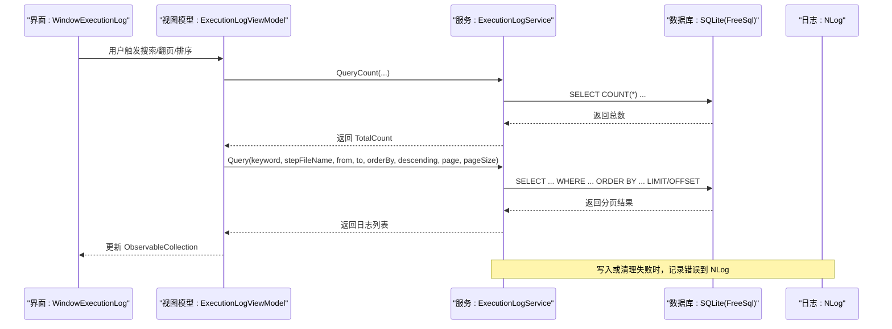
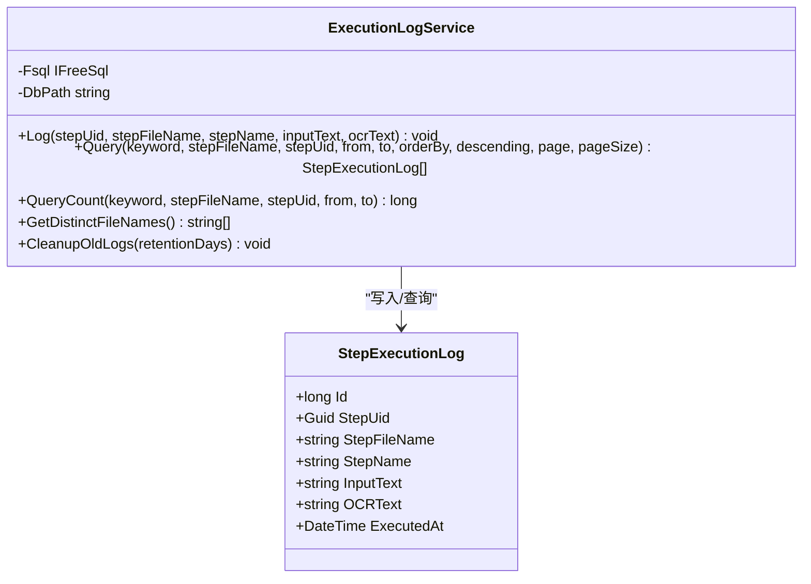
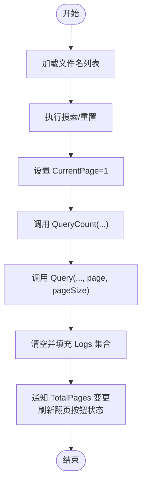
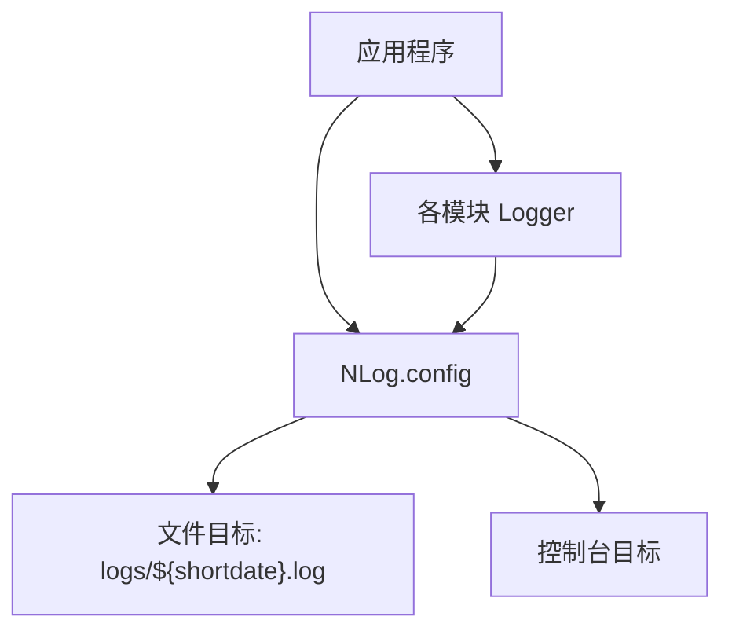
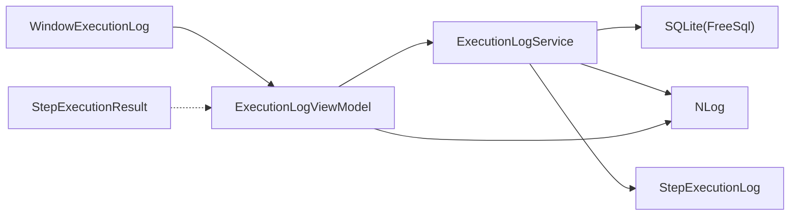

# 执行日志服务 (ExecutionLogService)

<cite>
**本文引用的文件**   
- [ShaoLu\Services\ExecutionLogService.cs](file://ShaoLu\Services\ExecutionLogService.cs)
- [ShaoLu\Models\StepExecutionLog.cs](file://ShaoLu\Models\StepExecutionLog.cs)
- [ShaoLu\Models\StepExecutionResult.cs](file://ShaoLu\Models\StepExecutionResult.cs)
- [ShaoLu\Viewmodels\ExecutionLogViewModel.cs](file://ShaoLu\Viewmodels\ExecutionLogViewModel.cs)
- [ShaoLu\Views\WindowExecutionLog.xaml.cs](file://ShaoLu\Views\WindowExecutionLog.xaml.cs)
- [ShaoLu\NLog.config](file://ShaoLu\NLog.config)
</cite>

## 目录
1. [简介](#简介)
2. [项目结构](#项目结构)
3. [核心组件](#核心组件)
4. [架构总览](#架构总览)
5. [详细组件分析](#详细组件分析)
6. [依赖关系分析](#依赖关系分析)
7. [性能考量](#性能考量)
8. [故障排查指南](#故障排查指南)
9. [结论](#结论)
10. [附录](#附录)

## 简介
本技术文档围绕 ShaoLu 的执行日志服务（ExecutionLogService）展开，系统性阐述其日志记录策略与实现细节。该服务负责记录自动化步骤的执行历史，包括步骤标识、输入文本、OCR 识别结果、执行时间等关键信息；同时提供分页查询、关键字搜索、按文件名/UID/时间范围筛选、排序以及旧日志清理等功能。日志持久化采用 FreeSql + SQLite，错误与异常通过 NLog 异步写入文件与控制台。本文还涵盖日志级别管理、异步写入、文件轮转、查询接口与过滤能力、导出格式建议及性能优化建议，帮助开发者与运维人员高效使用与维护该服务。

## 项目结构
执行日志相关代码主要分布在 Services、Models、Viewmodels 与 Views 四个层次：
- Services：ExecutionLogService 封装数据库操作与查询逻辑
- Models：StepExecutionLog、StepExecutionResult 定义数据模型
- Viewmodels：ExecutionLogViewModel 提供 UI 绑定、分页与筛选命令
- Views：WindowExecutionLog 承载界面交互与事件处理
- 配置：NLog.config 定义日志目标、规则与输出格式

图表来源
- [ShaoLu\Views\WindowExecutionLog.xaml.cs](file://ShaoLu\Views\WindowExecutionLog.xaml.cs)
- [ShaoLu\Viewmodels\ExecutionLogViewModel.cs](file://ShaoLu\Viewmodels\ExecutionLogViewModel.cs)
- [ShaoLu\Services\ExecutionLogService.cs](file://ShaoLu\Services\ExecutionLogService.cs)
- [ShaoLu\Models\StepExecutionLog.cs](file://ShaoLu\Models\StepExecutionLog.cs)
- [ShaoLu\Models\StepExecutionResult.cs](file://ShaoLu\Models\StepExecutionResult.cs)
- [ShaoLu\NLog.config](file://ShaoLu\NLog.config)

章节来源
- [ShaoLu\Services\ExecutionLogService.cs](file://ShaoLu\Services\ExecutionLogService.cs)
- [ShaoLu\Models\StepExecutionLog.cs](file://ShaoLu\Models\StepExecutionLog.cs)
- [ShaoLu\Models\StepExecutionResult.cs](file://ShaoLu\Models\StepExecutionResult.cs)
- [ShaoLu\Viewmodels\ExecutionLogViewModel.cs](file://ShaoLu\Viewmodels\ExecutionLogViewModel.cs)
- [ShaoLu\Views\WindowExecutionLog.xaml.cs](file://ShaoLu\Views\WindowExecutionLog.xaml.cs)
- [ShaoLu\NLog.config](file://ShaoLu\NLog.config)

## 核心组件
- ExecutionLogService：提供日志写入、分页查询、计数统计、去重文件名获取、旧日志清理等静态方法；内部使用 FreeSql 单例连接 SQLite 数据库，自动同步表结构。
- StepExecutionLog：持久化实体，包含 Id、StepUid、StepFileName、StepName、InputText、OCRText、ExecutedAt 等字段。
- StepExecutionResult：步骤执行结果模型，包含 IsTrue、ExecutionTimeMs、Similarity、ClickPosition、OCRText、PopupResult、ErrorMessage、ExecutedAt 等属性，用于结构化记录每次执行的指标与错误信息。
- ExecutionLogViewModel：UI 侧的查询与分页控制器，支持关键字、文件名、时间范围筛选，列头排序切换，并调用 ExecutionLogService 进行服务端分页与排序。
- WindowExecutionLog：窗口交互逻辑，拦截 DataGrid 排序事件以触发 ViewModel 的服务端排序，并提供日志文本预览功能。
- NLog.config：定义异步文件与控制台目标，按日期命名日志文件，统一布局输出级别、消息与异常信息。

章节来源
- [ShaoLu\Services\ExecutionLogService.cs](file://ShaoLu\Services\ExecutionLogService.cs)
- [ShaoLu\Models\StepExecutionLog.cs](file://ShaoLu\Models\StepExecutionLog.cs)
- [ShaoLu\Models\StepExecutionResult.cs](file://ShaoLu\Models\StepExecutionResult.cs)
- [ShaoLu\Viewmodels\ExecutionLogViewModel.cs](file://ShaoLu\Viewmodels\ExecutionLogViewModel.cs)
- [ShaoLu\Views\WindowExecutionLog.xaml.cs](file://ShaoLu\Views\WindowExecutionLog.xaml.cs)
- [ShaoLu\NLog.config](file://ShaoLu\NLog.config)

## 架构总览
下图展示从 UI 到服务再到数据库与日志的整体调用链：

图表来源
- [ShaoLu\Views\WindowExecutionLog.xaml.cs](file://ShaoLu\Views\WindowExecutionLog.xaml.cs)
- [ShaoLu\Viewmodels\ExecutionLogViewModel.cs](file://ShaoLu\Viewmodels\ExecutionLogViewModel.cs)
- [ShaoLu\Services\ExecutionLogService.cs](file://ShaoLu\Services\ExecutionLogService.cs)
- [ShaoLu\NLog.config](file://ShaoLu\NLog.config)

## 详细组件分析

### ExecutionLogService 组件分析
- 数据库初始化与连接：
  - 使用 Lazy<IFreeSql> 延迟初始化，确保应用首次访问时才创建连接。
  - 自动创建数据库目录，使用 SQLite 连接字符串指向 ApplicationData 下的 execution_log.db。
  - 启用 AutoSyncStructure(true)，在运行时自动同步表结构。
- 日志写入：
  - Log(stepUid, stepFileName, stepName, inputText, ocrText) 将 StepExecutionLog 插入数据库。
  - 捕获异常并通过 NLog 记录错误，保证写入失败不影响主流程。
- 查询与过滤：
  - Query(...) 支持关键字搜索（匹配 InputText 或 StepName）、按 StepFileName 筛选、按 StepUid 筛选、时间范围筛选、排序与分页。
  - QueryCount(...) 返回符合条件的总记录数，用于前端分页计算。
  - GetDistinctFileNames() 返回不重复的步骤文件名列表，供筛选下拉框使用。
- 旧日志清理：
  - CleanupOldLogs(retentionDays) 删除 ExecutedAt 早于截止时间的记录，retentionDays <= 0 时跳过清理。
  - 清理过程同样有异常捕获与 NLog 错误记录。

图表来源
- [ShaoLu\Services\ExecutionLogService.cs](file://ShaoLu\Services\ExecutionLogService.cs)
- [ShaoLu\Models\StepExecutionLog.cs](file://ShaoLu\Models\StepExecutionLog.cs)

章节来源
- [ShaoLu\Services\ExecutionLogService.cs](file://ShaoLu\Services\ExecutionLogService.cs)
- [ShaoLu\Models\StepExecutionLog.cs](file://ShaoLu\Models\StepExecutionLog.cs)

### ExecutionLogViewModel 组件分析
- 状态与属性：
  - Logs、FileNames 为 ObservableCollection，用于绑定 UI 显示。
  - SearchKeyword、SelectedFileName、DateFrom、DateTo、SortColumn、SortDescending、CurrentPage、PageSize、TotalCount、TotalPages 等属性驱动查询与分页。
- 命令与交互：
  - SearchCommand、ResetCommand、PrevPageCommand、NextPageCommand 分别处理搜索、重置、翻页。
  - ToggleSort(columnName) 根据列名切换排序方向或列，并重新执行查询。
- 查询执行：
  - ExecuteQuery() 先调用 QueryCount 获取总数，再调用 Query 获取当前页数据，更新集合并刷新 UI 命令可执行状态。
  - 异常通过 NLog 记录。

图表来源
- [ShaoLu\Viewmodels\ExecutionLogViewModel.cs](file://ShaoLu\Viewmodels\ExecutionLogViewModel.cs)

章节来源
- [ShaoLu\Viewmodels\ExecutionLogViewModel.cs](file://ShaoLu\Viewmodels\ExecutionLogViewModel.cs)

### WindowExecutionLog 组件分析
- 阻止 DataGrid 默认本地排序，改为调用 ViewModel 的服务端排序。
- 点击截断的日志文本时，弹出预览窗口显示完整内容，提升可读性。

章节来源
- [ShaoLu\Views\WindowExecutionLog.xaml.cs](file://ShaoLu\Views\WindowExecutionLog.xaml.cs)

### NLog 集成与配置
- 目标（Targets）：
  - 文件目标：按短日期命名日志文件，路径为 ${basedir}/logs/${shortdate}.log。
  - 控制台目标：输出到控制台。
- 规则（Rules）：
  - 所有 logger 的 Debug 及以上级别写入文件与控制台。
- 异步写入：
  - targets 节点设置 async="true"，实现异步日志写入，降低对主流程的性能影响。
- 布局（Layout）：
  - 包含长日期、大写级别、logger、消息与异常信息（Message）。

图表来源
- [ShaoLu\NLog.config](file://ShaoLu\NLog.config)

章节来源
- [ShaoLu\NLog.config](file://ShaoLu\NLog.config)

## 依赖关系分析
- ExecutionLogService 依赖 FreeSql 与 SQLite 进行数据持久化，依赖 NLog 进行错误记录。
- ExecutionLogViewModel 依赖 ExecutionLogService 进行数据查询与统计，依赖 NLog 记录异常。
- WindowExecutionLog 依赖 ExecutionLogViewModel 进行数据绑定与交互。
- StepExecutionLog 作为数据模型被 ExecutionLogService 读写。
- StepExecutionResult 作为执行结果模型，虽未直接由 ExecutionLogService 持久化，但可用于上层业务记录步骤执行指标与错误信息。

图表来源
- [ShaoLu\Viewmodels\ExecutionLogViewModel.cs](file://ShaoLu\Viewmodels\ExecutionLogViewModel.cs)
- [ShaoLu\Services\ExecutionLogService.cs](file://ShaoLu\Services\ExecutionLogService.cs)
- [ShaoLu\Models\StepExecutionLog.cs](file://ShaoLu\Models\StepExecutionLog.cs)
- [ShaoLu\Models\StepExecutionResult.cs](file://ShaoLu\Models\StepExecutionResult.cs)
- [ShaoLu\NLog.config](file://ShaoLu\NLog.config)

章节来源
- [ShaoLu\Viewmodels\ExecutionLogViewModel.cs](file://ShaoLu\Viewmodels\ExecutionLogViewModel.cs)
- [ShaoLu\Services\ExecutionLogService.cs](file://ShaoLu\Services\ExecutionLogService.cs)
- [ShaoLu\Models\StepExecutionLog.cs](file://ShaoLu\Models\StepExecutionLog.cs)
- [ShaoLu\Models\StepExecutionResult.cs](file://ShaoLu\Models\StepExecutionResult.cs)
- [ShaoLu\NLog.config](file://ShaoLu\NLog.config)

## 性能考量
- 数据库层面：
  - 使用 FreeSql 的 Page 分页与 Where 条件过滤，减少内存占用与网络传输。
  - AutoSyncStructure(true) 简化维护，但在频繁启动场景下可能带来额外开销，建议在开发环境保留，生产环境考虑预建表结构。
- 查询优化：
  - 关键字搜索使用 Contains，适合小规模数据；大数据量时可考虑全文索引或搜索引擎。
  - 排序在服务端完成，避免客户端排序带来的性能问题。
- 日志写入：
  - NLog 异步写入降低 IO 阻塞，提高响应速度。
  - 文件按日轮转，便于归档与清理。
- 资源管理：
  - Lazy<IFreeSql> 延迟初始化，避免不必要的连接开销。
  - 清理旧日志可按 retentionDays 控制，防止数据库膨胀。

[本节为通用指导，无需引用具体文件]

## 故障排查指南
- 写入失败：
  - ExecutionLogService.Log 捕获异常并记录 NLog 错误，检查 NLog 日志文件确认具体原因（如权限不足、磁盘空间不足）。
- 清理失败：
  - ExecutionLogService.CleanupOldLogs 捕获异常并记录 NLog 错误，检查数据库连接与权限。
- 查询失败：
  - ExecutionLogViewModel.ExecuteQuery 捕获异常并记录 NLog 错误，检查参数合法性与数据库状态。
- 常见问题定位：
  - 查看 NLog 日志文件（按日期命名），关注 Error 级别日志。
  - 确认 SQLite 数据库文件路径与权限。
  - 验证筛选条件与排序字段是否有效。

章节来源
- [ShaoLu\Services\ExecutionLogService.cs](file://ShaoLu\Services\ExecutionLogService.cs)
- [ShaoLu\Viewmodels\ExecutionLogViewModel.cs](file://ShaoLu\Viewmodels\ExecutionLogViewModel.cs)
- [ShaoLu\NLog.config](file://ShaoLu\NLog.config)

## 结论
ExecutionLogService 提供了稳定、可扩展的执行日志记录与查询能力，结合 FreeSql + SQLite 与 NLog 异步日志框架，实现了高性能、易维护的日志系统。通过丰富的筛选与排序功能，用户可以快速定位与分析步骤执行历史。建议在生产环境中进一步优化查询索引、调整日志级别与轮转策略，以满足大规模运行需求。

[本节为总结，无需引用具体文件]

## 附录
- 日志配置选项：
  - 文件路径：${basedir}/logs/${shortdate}.log
  - 级别：Debug 及以上
  - 异步：targets.async="true"
- 自定义日志格式：
  - 修改 NLog.config 中的 layout 字段，添加所需字段（如线程 ID、堆栈跟踪等）。
- 导出格式建议：
  - CSV：适用于 Excel 分析与报表生成。
  - JSON：适用于 API 消费与系统集成。
  - XML：适用于结构化存储与 XSLT 转换。

[本节为补充说明，无需引用具体文件]