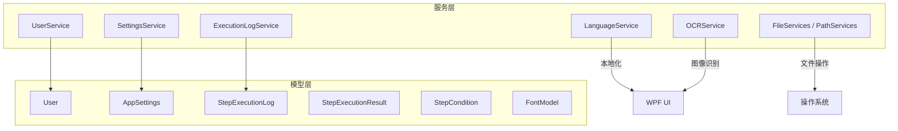
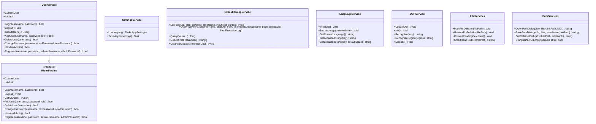
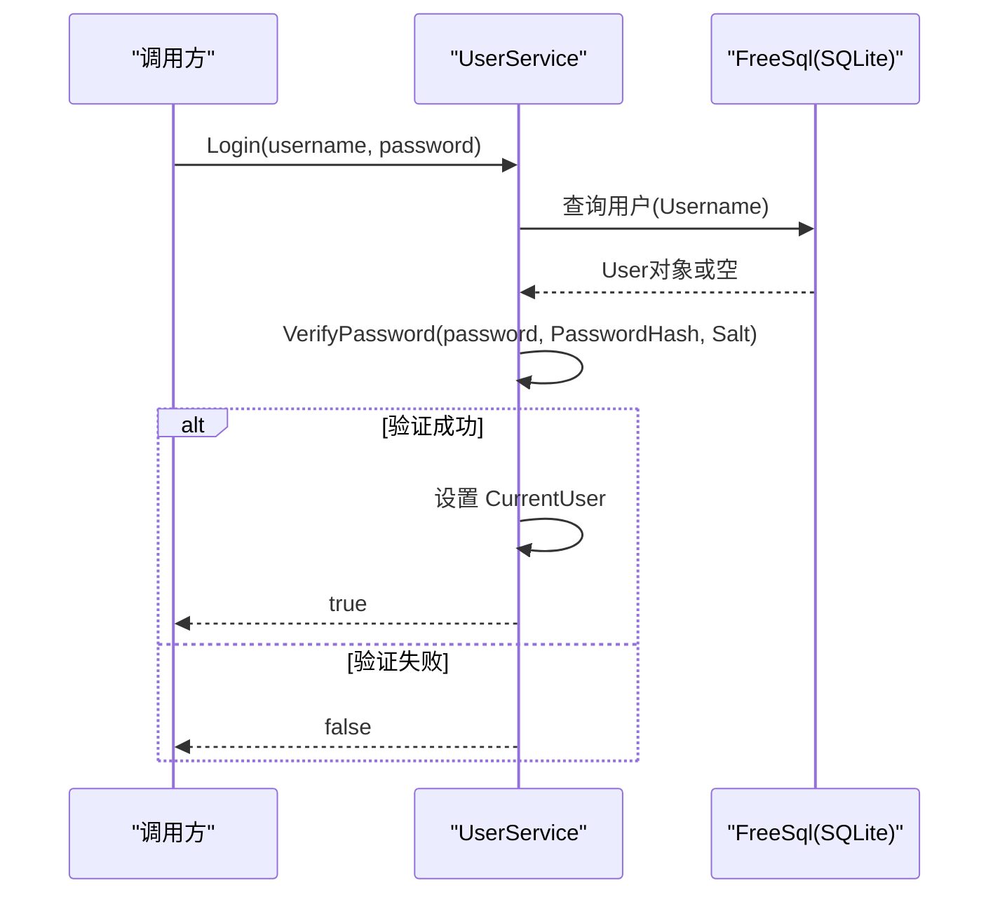
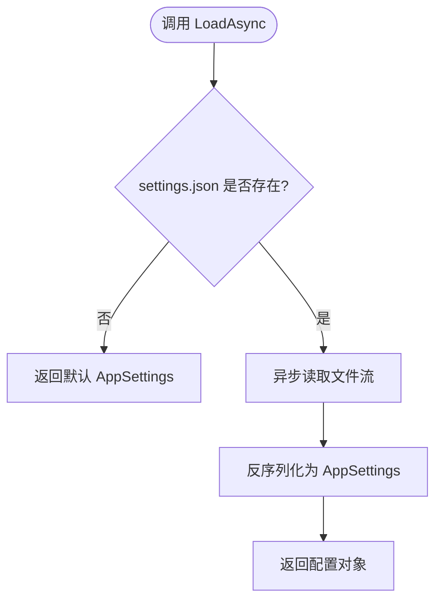
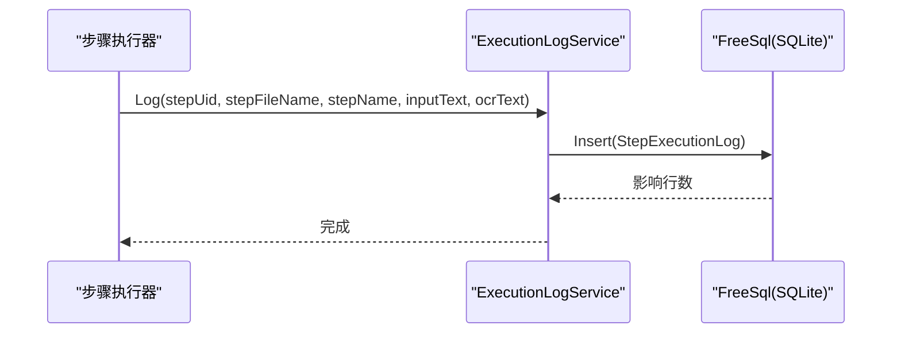
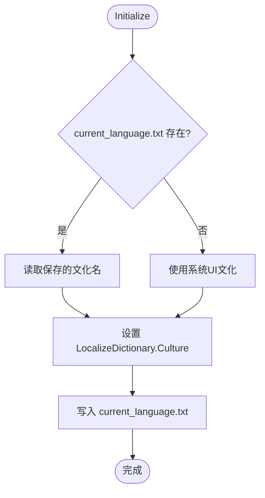
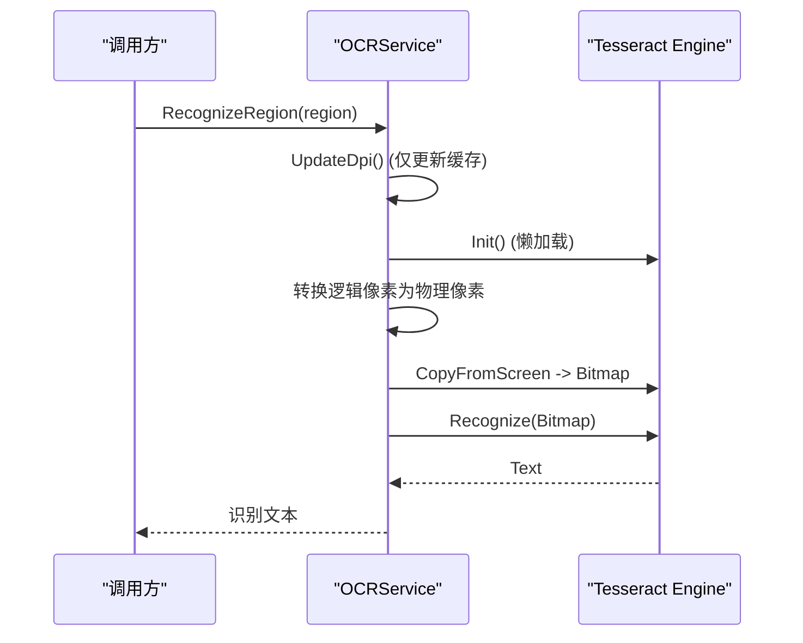
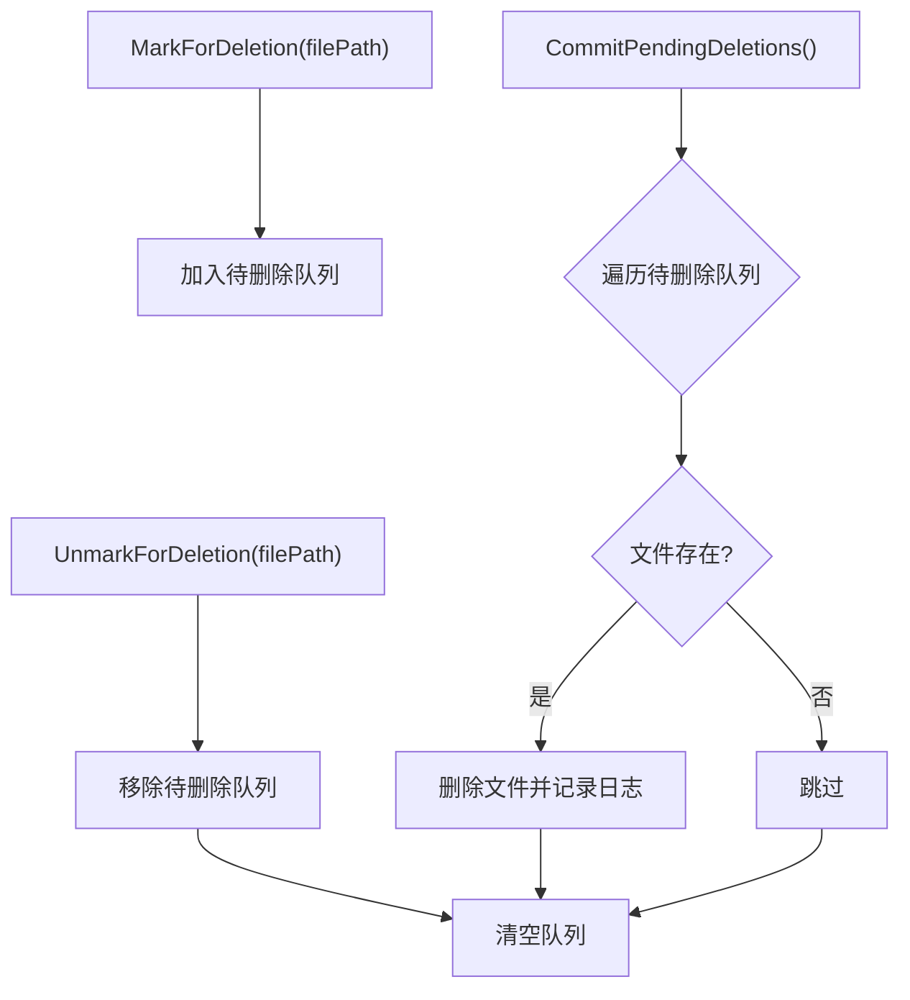
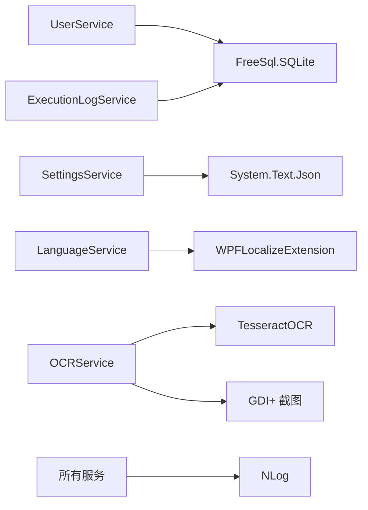

# 服务层

<cite>
**本文引用的文件**   
- [Services.cs](file://ShaoLu/Services/Services.cs)
- [UserService.cs](file://ShaoLu/Services/UserService.cs)
- [IUserService.cs](file://ShaoLu/Services/IUserService.cs)
- [SettingsService.cs](file://ShaoLu/Services/SettingsService.cs)
- [ExecutionLogService.cs](file://ShaoLu/Services/ExecutionLogService.cs)
- [LanguageService.cs](file://ShaoLu/Services/LanguageService.cs)
- [OCRService.cs](file://ShaoLu/Services/OCRService.cs)
- [User.cs](file://ShaoLu/Models/User.cs)
- [Settings.cs](file://ShaoLu/Models/Settings.cs)
- [StepExecutionLog.cs](file://ShaoLu/Models/StepExecutionLog.cs)
- [StepExecutionResult.cs](file://ShaoLu/Models/StepExecutionResult.cs)
- [StepCondition.cs](file://ShaoLu/Models/StepCondition.cs)
- [FontModel.cs](file://ShaoLu/Models/FontModel.cs)
</cite>

## 目录
1. [简介](#简介)
2. [项目结构](#项目结构)
3. [核心组件](#核心组件)
4. [架构总览](#架构总览)
5. [详细组件分析](#详细组件分析)
6. [依赖关系分析](#依赖关系分析)
7. [性能考量](#性能考量)
8. [故障排查指南](#故障排查指南)
9. [结论](#结论)
10. [附录](#附录)

## 简介
本技术文档聚焦 ShaoLu 应用的服务层，系统性阐述各服务的职责边界、接口设计与实现细节。重点覆盖：
- UserService 的认证与授权机制（用户登录、注册、密码安全、管理员权限）
- SettingsService 的配置管理（设置文件的异步读写）
- ExecutionLogService 的执行日志记录策略（SQLite + FreeSql、分页查询、清理策略）
- LanguageService 的多语言支持（本地化初始化、切换与持久化）
- OCRService 的图像处理流程（Tesseract OCR 引擎初始化、屏幕截图识别、DPI 缩放处理）
- FileServices 的资源管理机制（路径对话框、延迟删除、文本智能读取）
- 统一的服务注册、依赖注入与异常处理模式说明与建议

## 项目结构
服务层位于 ShaoLu/Services 目录下，配合 Models 中的实体模型完成数据持久化与配置序列化。关键组织方式如下：
- 服务类按职责划分：用户服务、设置服务、执行日志服务、多语言服务、OCR 服务、路径与文件服务
- 模型定义在 ShaoLu/Models 中，使用 FreeSql 特性标注数据库表结构
- 配置文件通过 JSON 序列化存储于应用目录
- 日志通过 NLog 输出

图表来源
- [UserService.cs:1-239](file://ShaoLu/Services/UserService.cs#L1-L239)
- [SettingsService.cs:1-38](file://ShaoLu/Services/SettingsService.cs#L1-L38)
- [ExecutionLogService.cs:1-179](file://ShaoLu/Services/ExecutionLogService.cs#L1-L179)
- [LanguageService.cs:1-67](file://ShaoLu/Services/LanguageService.cs#L1-L67)
- [OCRService.cs:1-159](file://ShaoLu/Services/OCRService.cs#L1-L159)
- [Services.cs:1-179](file://ShaoLu/Services/Services.cs#L1-L179)
- [User.cs:1-33](file://ShaoLu/Models/User.cs#L1-L33)
- [Settings.cs:1-117](file://ShaoLu/Models/Settings.cs#L1-L117)
- [StepExecutionLog.cs:1-47](file://ShaoLu/Models/StepExecutionLog.cs#L1-L47)
- [StepExecutionResult.cs:1-51](file://ShaoLu/Models/StepExecutionResult.cs#L1-L51)
- [StepCondition.cs:1-405](file://ShaoLu/Models/StepCondition.cs#L1-L405)
- [FontModel.cs:1-46](file://ShaoLu/Models/FontModel.cs#L1-L46)

章节来源
- [Services.cs:1-179](file://ShaoLu/Services/Services.cs#L1-L179)
- [UserService.cs:1-239](file://ShaoLu/Services/UserService.cs#L1-L239)
- [SettingsService.cs:1-38](file://ShaoLu/Services/SettingsService.cs#L1-L38)
- [ExecutionLogService.cs:1-179](file://ShaoLu/Services/ExecutionLogService.cs#L1-L179)
- [LanguageService.cs:1-67](file://ShaoLu/Services/LanguageService.cs#L1-L67)
- [OCRService.cs:1-159](file://ShaoLu/Services/OCRService.cs#L1-L159)
- [User.cs:1-33](file://ShaoLu/Models/User.cs#L1-L33)
- [Settings.cs:1-117](file://ShaoLu/Models/Settings.cs#L1-L117)
- [StepExecutionLog.cs:1-47](file://ShaoLu/Models/StepExecutionLog.cs#L1-L47)
- [StepExecutionResult.cs:1-51](file://ShaoLu/Models/StepExecutionResult.cs#L1-L51)
- [StepCondition.cs:1-405](file://ShaoLu/Models/StepCondition.cs#L1-L405)
- [FontModel.cs:1-46](file://ShaoLu/Models/FontModel.cs#L1-L46)

## 核心组件
本节概述各服务的关键职责与对外能力：
- UserService：基于 SQLite + FreeSql 的用户管理，提供登录、注册、密码变更、管理员校验等；采用 PBKDF2+Salt 进行密码哈希与常量时间比较验证
- SettingsService：以 settings.json 为配置载体，提供异步加载与保存方法
- ExecutionLogService：以 execution_log.db 记录步骤执行历史，支持关键字搜索、范围筛选、排序与分页，以及旧日志清理
- LanguageService：封装 WPF 本地化扩展，支持语言初始化、切换与持久化，并提供字符串获取方法
- OCRService：封装 Tesseract OCR 引擎，支持 Bitmap 识别与屏幕区域识别，包含 DPI 缓存与线程安全初始化
- FileServices/PathServices：提供打开/保存路径对话框、相对路径计算、延迟删除队列与文本智能编码检测读取

章节来源
- [UserService.cs:1-239](file://ShaoLu/Services/UserService.cs#L1-L239)
- [SettingsService.cs:1-38](file://ShaoLu/Services/SettingsService.cs#L1-L38)
- [ExecutionLogService.cs:1-179](file://ShaoLu/Services/ExecutionLogService.cs#L1-L179)
- [LanguageService.cs:1-67](file://ShaoLu/Services/LanguageService.cs#L1-L67)
- [OCRService.cs:1-159](file://ShaoLu/Services/OCRService.cs#L1-L159)
- [Services.cs:1-179](file://ShaoLu/Services/Services.cs#L1-L179)

## 架构总览
服务层整体采用“单一职责 + 静态工具”的组合模式：
- 业务服务（UserService、ExecutionLogService、OCRService）负责领域逻辑与外部资源交互
- 配置与本地化服务（SettingsService、LanguageService）提供跨模块的基础能力
- 文件与路径服务（FileServices、PathServices）作为通用工具支撑上层功能

图表来源
- [UserService.cs:1-239](file://ShaoLu/Services/UserService.cs#L1-L239)
- [IUserService.cs:1-20](file://ShaoLu/Services/IUserService.cs#L1-L20)
- [SettingsService.cs:1-38](file://ShaoLu/Services/SettingsService.cs#L1-L38)
- [ExecutionLogService.cs:1-179](file://ShaoLu/Services/ExecutionLogService.cs#L1-L179)
- [LanguageService.cs:1-67](file://ShaoLu/Services/LanguageService.cs#L1-L67)
- [OCRService.cs:1-159](file://ShaoLu/Services/OCRService.cs#L1-L159)
- [Services.cs:1-179](file://ShaoLu/Services/Services.cs#L1-L179)

## 详细组件分析

### UserService 认证与授权机制
- 数据存储：使用 FreeSql 连接 SQLite，自动同步表结构，用户表映射到 app_user
- 密码安全：生成随机 Salt，使用 PBKDF2(SHA256, 迭代次数 10000) 计算哈希；验证时采用常量时间比较避免时序攻击
- 登录流程：校验用户名与密码，成功后设置 CurrentUser；提供 IsAdmin 快捷属性判断角色
- 注册流程：若存在管理员则需管理员审批；否则允许直接注册并赋予管理员角色
- 权限控制：删除管理员时需保证至少保留一个管理员；删除当前登录用户将自动注销

图表来源
- [UserService.cs:76-93](file://ShaoLu/Services/UserService.cs#L76-L93)
- [UserService.cs:39-74](file://ShaoLu/Services/UserService.cs#L39-L74)
- [User.cs:12-31](file://ShaoLu/Models/User.cs#L12-L31)

章节来源
- [UserService.cs:1-239](file://ShaoLu/Services/UserService.cs#L1-L239)
- [IUserService.cs:1-20](file://ShaoLu/Services/IUserService.cs#L1-L20)
- [User.cs:1-33](file://ShaoLu/Models/User.cs#L1-L33)

### SettingsService 配置管理
- 配置文件位置：应用根目录下的 settings.json
- 数据结构：AppSettings 聚合 App、Step、UserSettings 等子配置，支持窗口尺寸、字体、热键、运行行为、覆盖层显示等
- 异步 IO：使用 System.Text.Json 进行异步序列化/反序列化，确保 UI 响应性

图表来源
- [SettingsService.cs:20-28](file://ShaoLu/Services/SettingsService.cs#L20-L28)
- [Settings.cs:7-117](file://ShaoLu/Models/Settings.cs#L7-L117)

章节来源
- [SettingsService.cs:1-38](file://ShaoLu/Services/SettingsService.cs#L1-L38)
- [Settings.cs:1-117](file://ShaoLu/Models/Settings.cs#L1-L117)

### ExecutionLogService 日志记录策略
- 存储后端：SQLite + FreeSql，自动建表，表名为 step_execution_log
- 写入策略：每次步骤执行后插入一条记录，包含步骤 UID、文件名、名称、输入文本、OCR 结果与执行时间
- 查询能力：支持关键字搜索（输入文本或步骤名）、按文件名/UID/时间范围筛选、排序与分页
- 清理策略：根据配置保留天数清理旧日志，异常被捕获并记录日志

图表来源
- [ExecutionLogService.cs:36-55](file://ShaoLu/Services/ExecutionLogService.cs#L36-L55)
- [StepExecutionLog.cs:6-45](file://ShaoLu/Models/StepExecutionLog.cs#L6-L45)

章节来源
- [ExecutionLogService.cs:1-179](file://ShaoLu/Services/ExecutionLogService.cs#L1-L179)
- [StepExecutionLog.cs:1-47](file://ShaoLu/Models/StepExecutionLog.cs#L1-L47)

### LanguageService 多语言支持
- 初始化：优先读取上次保存的语言代码，否则回退到系统 UI 文化
- 切换与持久化：设置 LocalizeDictionary 的 Culture，并将 cultureName 写入 current_language.txt
- 字符串获取：提供带默认值的重载，未找到 key 时返回 key 本身或默认值

图表来源
- [LanguageService.cs:15-22](file://ShaoLu/Services/LanguageService.cs#L15-L22)
- [LanguageService.cs:27-40](file://ShaoLu/Services/LanguageService.cs#L27-L40)

章节来源
- [LanguageService.cs:1-67](file://ShaoLu/Services/LanguageService.cs#L1-L67)

### OCRService 图像处理流程
- 引擎初始化：懒加载单例，首次调用时从 tessdata 目录加载 chi_sim+eng 语言包
- DPI 处理：在主线程更新 DPI 缓存，避免后台线程访问 WPF 对象；识别区域时将逻辑像素转换为物理像素
- 识别流程：Bitmap -> PNG 字节流 -> Pix -> Process -> Text；支持屏幕区域截图识别
- 资源释放：提供 Dispose 方法释放引擎资源

图表来源
- [OCRService.cs:31-48](file://ShaoLu/Services/OCRService.cs#L31-L48)
- [OCRService.cs:53-75](file://ShaoLu/Services/OCRService.cs#L53-L75)
- [OCRService.cs:114-144](file://ShaoLu/Services/OCRService.cs#L114-L144)

章节来源
- [OCRService.cs:1-159](file://ShaoLu/Services/OCRService.cs#L1-L159)

### FileServices 与 PathServices 资源管理
- 路径对话框：封装 Windows 打开/保存对话框，支持过滤器与初始目录
- 相对路径计算：基于公共前缀计算相对路径，兼容不同分隔符
- 延迟删除：维护待删除文件集合，支持撤销标记；提交时批量删除并记录日志
- 智能文本读取：优先 BOM 检测，无 BOM 时使用 UtfUnknown 启发式编码检测，置信度阈值 0.5

图表来源
- [Services.cs:92-140](file://ShaoLu/Services/Services.cs#L92-L140)
- [Services.cs:142-175](file://ShaoLu/Services/Services.cs#L142-L175)

章节来源
- [Services.cs:1-179](file://ShaoLu/Services/Services.cs#L1-L179)

## 依赖关系分析
- 数据持久化依赖：UserService 与 ExecutionLogService 均依赖 FreeSql + SQLite，通过 Lazy 初始化连接
- 配置序列化依赖：SettingsService 依赖 System.Text.Json
- 本地化依赖：LanguageService 依赖 WPFLocalizeExtension 的 LocalizeDictionary
- OCR 依赖：OCRService 依赖 TesseractOCR 库与系统 GDI+ 截图能力
- 日志依赖：NLog 用于错误与诊断信息输出

图表来源
- [UserService.cs:12-26](file://ShaoLu/Services/UserService.cs#L12-L26)
- [ExecutionLogService.cs:14-25](file://ShaoLu/Services/ExecutionLogService.cs#L14-L25)
- [SettingsService.cs:12-15](file://ShaoLu/Services/SettingsService.cs#L12-L15)
- [LanguageService.cs:3](file://ShaoLu/Services/LanguageService.cs#L3)
- [OCRService.cs:1-2](file://ShaoLu/Services/OCRService.cs#L1-L2)

章节来源
- [UserService.cs:1-239](file://ShaoLu/Services/UserService.cs#L1-L239)
- [ExecutionLogService.cs:1-179](file://ShaoLu/Services/ExecutionLogService.cs#L1-L179)
- [SettingsService.cs:1-38](file://ShaoLu/Services/SettingsService.cs#L1-L38)
- [LanguageService.cs:1-67](file://ShaoLu/Services/LanguageService.cs#L1-L67)
- [OCRService.cs:1-159](file://ShaoLu/Services/OCRService.cs#L1-L159)

## 性能考量
- 数据库连接：使用 Lazy 初始化与单例 IFreeSql，避免重复创建连接开销
- 密码哈希：PBKDF2 迭代次数 10000，平衡安全性与性能；常量时间比较避免侧信道
- OCR 引擎：懒加载与锁保护，避免并发初始化；DPI 缓存减少主线程访问
- 文件 IO：异步序列化/反序列化，提升 UI 响应性；延迟删除批量处理降低频繁磁盘操作
- 日志写入：异常捕获与 NLog 记录，避免阻塞主流程

[本节为通用指导，不直接分析具体文件]

## 故障排查指南
- 登录失败：检查用户名是否存在、密码是否正确、数据库是否可访问
- 注册失败：确认用户名唯一性；若已有管理员，需提供有效管理员凭据
- 配置加载失败：检查 settings.json 格式与权限；确保应用目录可写
- OCR 识别失败：确认 tessdata 目录存在且包含 chi_sim+eng 语言包；检查 DPI 缓存更新是否在主线程调用
- 日志写入失败：检查 execution_log.db 路径权限；查看 NLog 错误日志
- 文件删除失败：确认文件未被占用；查看 CommitPendingDeletions 的日志输出

章节来源
- [UserService.cs:76-93](file://ShaoLu/Services/UserService.cs#L76-L93)
- [UserService.cs:194-236](file://ShaoLu/Services/UserService.cs#L194-L236)
- [SettingsService.cs:20-37](file://ShaoLu/Services/SettingsService.cs#L20-L37)
- [OCRService.cs:53-75](file://ShaoLu/Services/OCRService.cs#L53-L75)
- [ExecutionLogService.cs:36-55](file://ShaoLu/Services/ExecutionLogService.cs#L36-L55)
- [Services.cs:118-140](file://ShaoLu/Services/Services.cs#L118-L140)

## 结论
ShaoLu 服务层通过清晰的分层与职责划分，提供了稳健的用户认证、配置管理、执行日志、多语言支持与 OCR 处理能力。结合 FreeSql、Tesseract、WPFLocalizeExtension 与 NLog 等成熟库，实现了高内聚、低耦合的服务架构。建议在生产环境中引入统一的依赖注入容器与服务注册中心，进一步提升可测试性与可维护性。

[本节为总结性内容，不直接分析具体文件]

## 附录
- 条件评估与上下文：StepCondition 与 ConditionEvaluator 提供灵活的规则表达式与变量解析，支持文本提取与正则匹配
- 执行结果模型：StepExecutionResult 结构化记录步骤执行状态、相似度、点击位置、OCR 结果与错误信息
- 字体模型：FontModel 封装 WPF 与 GDI+ 字体属性，便于跨平台渲染

章节来源
- [StepCondition.cs:1-405](file://ShaoLu/Models/StepCondition.cs#L1-L405)
- [StepExecutionResult.cs:1-51](file://ShaoLu/Models/StepExecutionResult.cs#L1-L51)
- [FontModel.cs:1-46](file://ShaoLu/Models/FontModel.cs#L1-L46)