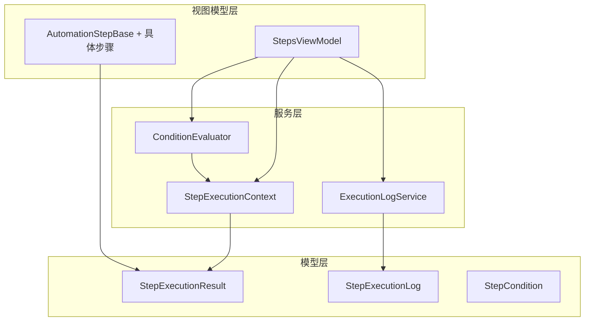
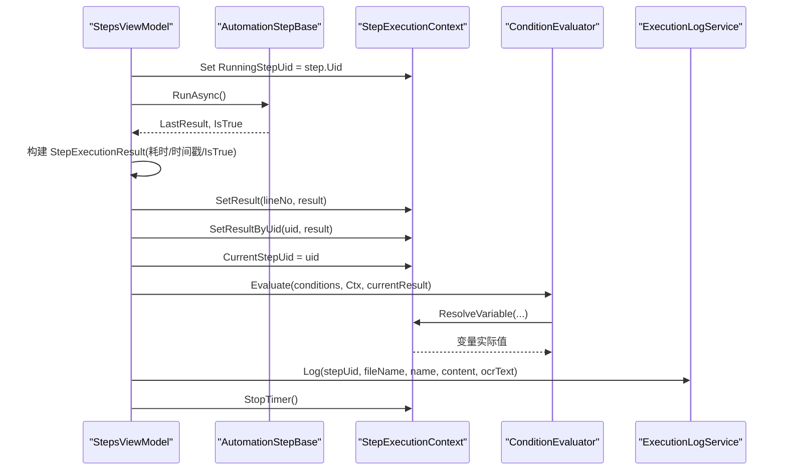
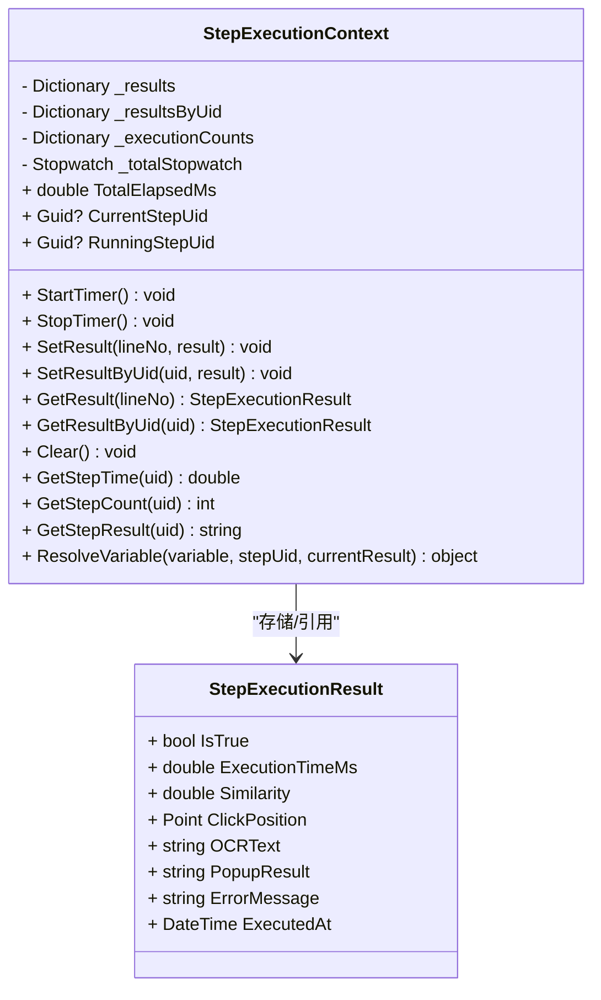
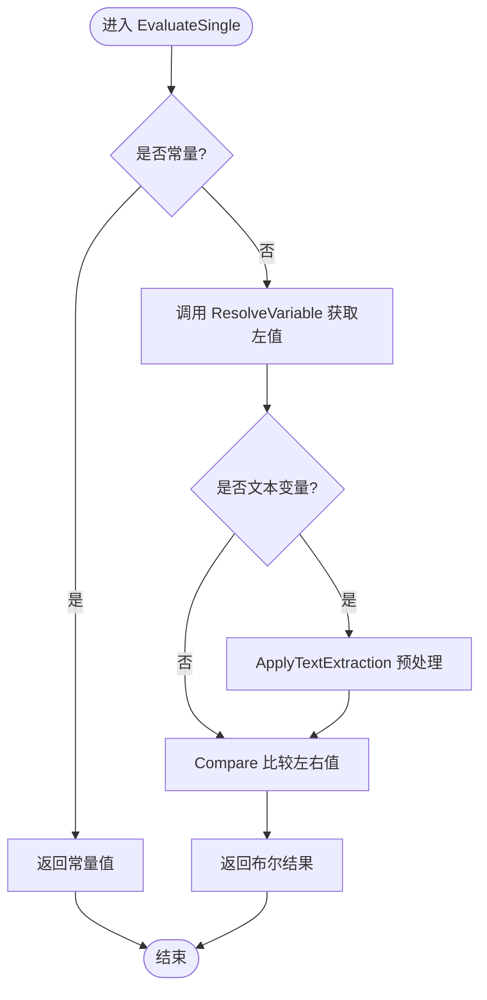
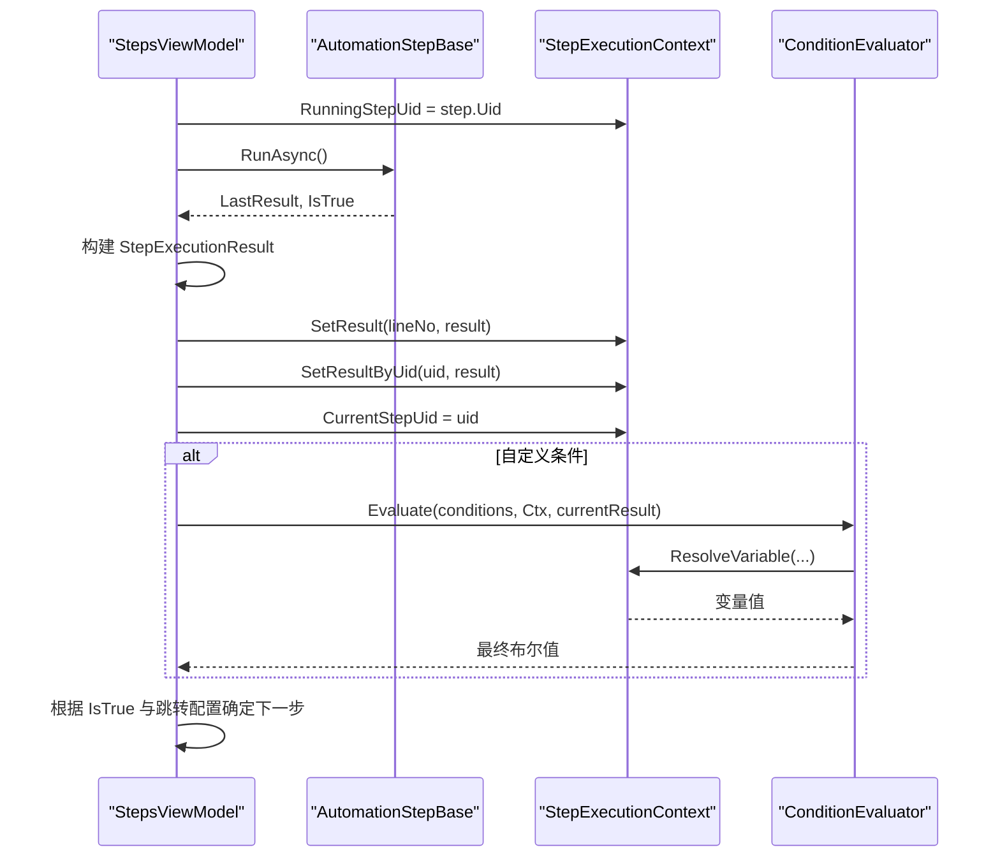
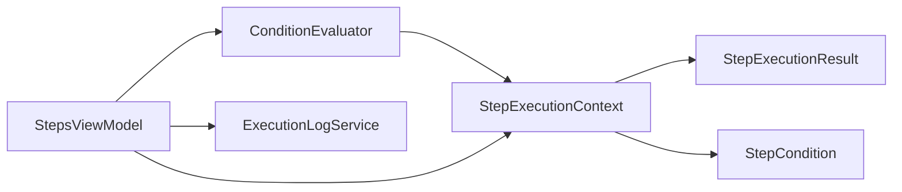

# 步骤执行上下文 (StepExecutionContext)

<cite>
**本文引用的文件**   
- [ShaoLu/Services/StepExecutionContext.cs](file://ShaoLu/Services/StepExecutionContext.cs)
- [NUnitTest/StepExecutionContextTests.cs](file://NUnitTest/StepExecutionContextTests.cs)
- [ShaoLu/Models/StepExecutionResult.cs](file://ShaoLu/Models/StepExecutionResult.cs)
- [ShaoLu/Models/StepExecutionLog.cs](file://ShaoLu/Models/StepExecutionLog.cs)
- [ShaoLu/Models/StepCondition.cs](file://ShaoLu/Models/StepCondition.cs)
- [ShaoLu/Services/ConditionEvaluator.cs](file://ShaoLu/Services/ConditionEvaluator.cs)
- [ShaoLu/Viewmodels/StepsViewModel.cs](file://ShaoLu/Viewmodels/StepsViewModel.cs)
- [ShaoLu/Viewmodels/AutomationStep.cs](file://ShaoLu/Viewmodels/AutomationStep.cs)
</cite>

## 目录
1. [简介](#简介)
2. [项目结构](#项目结构)
3. [核心组件](#核心组件)
4. [架构总览](#架构总览)
5. [详细组件分析](#详细组件分析)
6. [依赖关系分析](#依赖关系分析)
7. [性能考量](#性能考量)
8. [故障排查指南](#故障排查指南)
9. [结论](#结论)
10. [附录：最佳实践与常见陷阱](#附录最佳实践与常见陷阱)

## 简介
本技术文档围绕 ShaoLu 的“步骤执行上下文”（StepExecutionContext）展开，系统性说明其在自动化步骤执行过程中的作用与职责，包括变量传递、状态管理、异常处理、执行控制等。同时覆盖上下文的生命周期管理、线程安全性保证、内存泄漏防护、序列化支持、调试信息收集、性能监控集成等高级特性，并提供使用最佳实践与常见陷阱规避方法，帮助开发者与使用者正确、高效地使用 StepExecutionContext。

## 项目结构
StepExecutionContext 位于 Services 层，作为执行期数据共享的核心载体；与 Models 层的执行结果模型、条件模型协作，并通过 Viewmodels 层的 StepsViewModel 在步骤执行流程中被读写。关键文件组织如下：
- 服务层：StepExecutionContext、ConditionEvaluator、ExecutionLogService
- 模型层：StepExecutionResult、StepExecutionLog、StepCondition
- 视图模型层：StepsViewModel、AutomationStepBase 及其派生步骤类型

图表来源
- [ShaoLu/Services/StepExecutionContext.cs:1-163](file://ShaoLu/Services/StepExecutionContext.cs#L1-L163)
- [ShaoLu/Services/ConditionEvaluator.cs:1-294](file://ShaoLu/Services/ConditionEvaluator.cs#L1-L294)
- [ShaoLu/Services/ExecutionLogService.cs:1-179](file://ShaoLu/Services/ExecutionLogService.cs#L1-L179)
- [ShaoLu/Models/StepExecutionResult.cs:1-51](file://ShaoLu/Models/StepExecutionResult.cs#L1-L51)
- [ShaoLu/Models/StepExecutionLog.cs:1-47](file://ShaoLu/Models/StepExecutionLog.cs#L1-L47)
- [ShaoLu/Models/StepCondition.cs:1-405](file://ShaoLu/Models/StepCondition.cs#L1-L405)
- [ShaoLu/Viewmodels/StepsViewModel.cs:520-719](file://ShaoLu/Viewmodels/StepsViewModel.cs#L520-L719)
- [ShaoLu/Viewmodels/AutomationStep.cs:1-800](file://ShaoLu/Viewmodels/AutomationStep.cs#L1-L800)

章节来源
- [ShaoLu/Services/StepExecutionContext.cs:1-163](file://ShaoLu/Services/StepExecutionContext.cs#L1-L163)
- [ShaoLu/Viewmodels/StepsViewModel.cs:520-719](file://ShaoLu/Viewmodels/StepsViewModel.cs#L520-L719)

## 核心组件
- StepExecutionContext：单例执行上下文，维护步骤执行结果、运行统计、当前步骤标识、计时器，以及条件变量的解析能力。
- StepExecutionResult：步骤执行结果的数据载体，包含成功标志、耗时、相似度、点击位置、OCR 文本、弹窗选择、错误信息等。
- StepCondition：条件规则行定义，支持多种变量类型、运算符、逻辑连接器和文本提取模式。
- ConditionEvaluator：条件评估器，负责将条件规则行组合为最终布尔值，并调用上下文解析变量。
- ExecutionLogService：持久化执行日志（SQLite），用于审计与回溯。
- StepsViewModel：步骤执行编排者，负责生命周期管理、异常处理、上下文写入与读取、跳转控制、统计更新与日志记录。

章节来源
- [ShaoLu/Services/StepExecutionContext.cs:1-163](file://ShaoLu/Services/StepExecutionContext.cs#L1-L163)
- [ShaoLu/Models/StepExecutionResult.cs:1-51](file://ShaoLu/Models/StepExecutionResult.cs#L1-L51)
- [ShaoLu/Models/StepCondition.cs:1-405](file://ShaoLu/Models/StepCondition.cs#L1-L405)
- [ShaoLu/Services/ConditionEvaluator.cs:1-294](file://ShaoLu/Services/ConditionEvaluator.cs#L1-L294)
- [ShaoLu/Services/ExecutionLogService.cs:1-179](file://ShaoLu/Services/ExecutionLogService.cs#L1-L179)
- [ShaoLu/Viewmodels/StepsViewModel.cs:520-719](file://ShaoLu/Viewmodels/StepsViewModel.cs#L520-L719)

## 架构总览
StepExecutionContext 在整个执行流中扮演“运行时状态中心”的角色：
- 步骤执行前：StepsViewModel 设置 RunningStepUid，开始计时。
- 步骤执行后：构建 StepExecutionResult，写入上下文的按行号与按 Uid 两个索引，并设置 CurrentStepUid。
- 条件判断：ConditionEvaluator 通过上下文 ResolveVariable 获取 Self_* 或 Step_* 变量值进行计算。
- 统计与日志：统计步骤更新计数，ExecutionLogService 记录执行历史。
- 结束阶段：停止计时，关闭统计窗口，恢复主窗口状态。

图表来源
- [ShaoLu/Viewmodels/StepsViewModel.cs:520-719](file://ShaoLu/Viewmodels/StepsViewModel.cs#L520-L719)
- [ShaoLu/Services/StepExecutionContext.cs:1-163](file://ShaoLu/Services/StepExecutionContext.cs#L1-L163)
- [ShaoLu/Services/ConditionEvaluator.cs:1-294](file://ShaoLu/Services/ConditionEvaluator.cs#L1-L294)
- [ShaoLu/Services/ExecutionLogService.cs:1-179](file://ShaoLu/Services/ExecutionLogService.cs#L1-L179)

## 详细组件分析

### StepExecutionContext 类设计
- 单例访问：提供静态 Instance 属性，确保全局唯一实例。
- 数据存储：
  - _results：按行号存储 StepExecutionResult。
  - _resultsByUid：按 Uid 存储 StepExecutionResult。
  - _executionCounts：按 Uid 累计执行次数。
  - _totalStopwatch：总计时器。
- 状态字段：
  - CurrentStepUid：刚刚执行完成的步骤 Uid（供 Step_Triggered 变量使用）。
  - RunningStepUid：当前正在执行的步骤 Uid（供统计展示）。
- 核心方法：
  - StartTimer/StopTimer：控制总计时。
  - SetResult/SetResultByUid：写入执行结果。
  - GetResult/GetResultByUid：读取执行结果。
  - Clear：清空所有状态，用于每次运行前重置。
  - GetStepTime/GetStepCount/GetStepResult：查询统计与结果描述。
  - ResolveVariable：根据变量类型返回实际值（常量、Self_*、Step_*、Step_Triggered）。

图表来源
- [ShaoLu/Services/StepExecutionContext.cs:1-163](file://ShaoLu/Services/StepExecutionContext.cs#L1-L163)
- [ShaoLu/Models/StepExecutionResult.cs:1-51](file://ShaoLu/Models/StepExecutionResult.cs#L1-L51)

章节来源
- [ShaoLu/Services/StepExecutionContext.cs:1-163](file://ShaoLu/Services/StepExecutionContext.cs#L1-L163)
- [ShaoLu/Models/StepExecutionResult.cs:1-51](file://ShaoLu/Models/StepExecutionResult.cs#L1-L51)

### 条件变量解析与评估
- 变量类型：
  - 常量：ConstantTrue、ConstantFalse。
  - 当前步骤自身：Self_IsTrue、Self_Similarity、Self_ExecutionTimeMs、Self_ClickX、Self_ClickY、Self_OCRText、Self_PopupResult。
  - 引用其他步骤：Step_IsTrue、Step_Similarity、Step_ExecutionTimeMs、Step_ClickX、Step_ClickY、Step_OCRText、Step_PopupResult、Step_Triggered。
- Step_Triggered：仅当引用步骤是刚刚执行完成的步骤时为 true（单次有效）。
- 文本提取：对识别文本变量支持多模式预处理（整段、指定行、子串截取、从开头/末尾截取）。
- 比较逻辑：支持布尔、数字、字符串（相等、不等、包含、正则匹配）、空检查等。

图表来源
- [ShaoLu/Services/ConditionEvaluator.cs:1-294](file://ShaoLu/Services/ConditionEvaluator.cs#L1-L294)
- [ShaoLu/Services/StepExecutionContext.cs:1-163](file://ShaoLu/Services/StepExecutionContext.cs#L1-L163)
- [ShaoLu/Models/StepCondition.cs:1-405](file://ShaoLu/Models/StepCondition.cs#L1-L405)

章节来源
- [ShaoLu/Services/ConditionEvaluator.cs:1-294](file://ShaoLu/Services/ConditionEvaluator.cs#L1-L294)
- [ShaoLu/Models/StepCondition.cs:1-405](file://ShaoLu/Models/StepCondition.cs#L1-L405)

### 执行流程与上下文交互
StepsViewModel 在执行循环中：
- 设置 RunningStepUid，启动计时。
- 调用步骤 RunAsync，捕获异常并设置错误状态。
- 构建 StepExecutionResult，写入上下文（按行号与 Uid），设置 CurrentStepUid。
- 更新统计步骤的条件计数。
- 若启用自定义条件，则调用 ConditionEvaluator.Evaluate。
- 可选记录执行日志。
- 根据 IsTrue 决定跳转目标，处理自引用限制。

图表来源
- [ShaoLu/Viewmodels/StepsViewModel.cs:520-719](file://ShaoLu/Viewmodels/StepsViewModel.cs#L520-L719)
- [ShaoLu/Services/StepExecutionContext.cs:1-163](file://ShaoLu/Services/StepExecutionContext.cs#L1-L163)
- [ShaoLu/Services/ConditionEvaluator.cs:1-294](file://ShaoLu/Services/ConditionEvaluator.cs#L1-L294)

章节来源
- [ShaoLu/Viewmodels/StepsViewModel.cs:520-719](file://ShaoLu/Viewmodels/StepsViewModel.cs#L520-L719)

### 异常处理与执行控制
- 单个步骤异常被捕获，设置 IsError、ErrorMessage、ErrorType，可选择弹出错误对话框。
- 若无 FalseGotoUid，则终止执行；否则继续按 false 分支跳转。
- 自引用检测：防止无限循环，达到上限时强制结果为 false 并按 false 分支处理。
- 取消操作：OperationCanceledException 中断执行，清理上下文计时与 UI 状态。

章节来源
- [ShaoLu/Viewmodels/StepsViewModel.cs:591-694](file://ShaoLu/Viewmodels/StepsViewModel.cs#L591-L694)

### 生命周期管理与线程安全
- 生命周期：
  - 开始：StartTimer、RunningStepUid 设置。
  - 中间：SetResult/SetResultByUid、CurrentStepUid 更新。
  - 结束：StopTimer、Clear（下次运行前）。
- 线程安全：
  - 当前实现未显式加锁，Dictionary 并发写存在潜在风险。建议在多线程环境下增加同步机制（如 lock 或 ConcurrentDictionary）。
  - 单例 Instance 的初始化是线程安全的（C# 懒加载），但内部字典并发访问需额外保护。

章节来源
- [ShaoLu/Services/StepExecutionContext.cs:1-163](file://ShaoLu/Services/StepExecutionContext.cs#L1-L163)
- [ShaoLu/Viewmodels/StepsViewModel.cs:520-719](file://ShaoLu/Viewmodels/StepsViewModel.cs#L520-L719)

### 内存泄漏防护
- Clear 方法清空所有字典与计时器，避免跨次运行残留数据。
- 建议：
  - 每次运行前调用 Clear。
  - 避免长时间持有大对象引用（如 OCRText、PopupResult）。
  - 及时释放外部资源（如图片、文件句柄）。

章节来源
- [ShaoLu/Services/StepExecutionContext.cs:72-82](file://ShaoLu/Services/StepExecutionContext.cs#L72-L82)

### 序列化支持与调试信息
- StepExecutionResult 与 StepExecutionLog 具备可序列化的属性，便于持久化与传输。
- 调试信息：
  - TotalElapsedMs、ExecutionTimeMs、ExecutedAt 提供时间与时间戳。
  - ErrorMessage、ErrorType 提供错误诊断。
  - OCRText、PopupResult 提供业务上下文。
- 日志记录：ExecutionLogService 将执行结果写入 SQLite，支持分页查询与清理。

章节来源
- [ShaoLu/Models/StepExecutionResult.cs:1-51](file://ShaoLu/Models/StepExecutionResult.cs#L1-L51)
- [ShaoLu/Models/StepExecutionLog.cs:1-47](file://ShaoLu/Models/StepExecutionLog.cs#L1-L47)
- [ShaoLu/Services/ExecutionLogService.cs:1-179](file://ShaoLu/Services/ExecutionLogService.cs#L1-L179)

### 性能监控集成
- 总计时：TotalElapsedMs 提供整体执行时长。
- 单步计时：ExecutionTimeMs 提供每步耗时。
- 统计步骤：UpdateConditionCounts 累计条件命中次数，辅助性能分析。

章节来源
- [ShaoLu/Services/StepExecutionContext.cs:21-22](file://ShaoLu/Services/StepExecutionContext.cs#L21-L22)
- [ShaoLu/Models/StepExecutionResult.cs:17-18](file://ShaoLu/Models/StepExecutionResult.cs#L17-L18)
- [ShaoLu/Viewmodels/StepsViewModel.cs:567-572](file://ShaoLu/Viewmodels/StepsViewModel.cs#L567-L572)

## 依赖关系分析
StepExecutionContext 与以下组件存在直接依赖：
- StepExecutionResult：数据载体。
- StepCondition：条件变量枚举与提取模式。
- ConditionEvaluator：条件评估器。
- StepsViewModel：执行编排者。
- ExecutionLogService：日志持久化。

图表来源
- [ShaoLu/Services/StepExecutionContext.cs:1-163](file://ShaoLu/Services/StepExecutionContext.cs#L1-L163)
- [ShaoLu/Services/ConditionEvaluator.cs:1-294](file://ShaoLu/Services/ConditionEvaluator.cs#L1-L294)
- [ShaoLu/Viewmodels/StepsViewModel.cs:520-719](file://ShaoLu/Viewmodels/StepsViewModel.cs#L520-L719)

章节来源
- [ShaoLu/Services/StepExecutionContext.cs:1-163](file://ShaoLu/Services/StepExecutionContext.cs#L1-L163)
- [ShaoLu/Services/ConditionEvaluator.cs:1-294](file://ShaoLu/Services/ConditionEvaluator.cs#L1-L294)
- [ShaoLu/Viewmodels/StepsViewModel.cs:520-719](file://ShaoLu/Viewmodels/StepsViewModel.cs#L520-L719)

## 性能考量
- 数据结构复杂度：
  - SetResult/GetResult：O(1) 平均（Dictionary）。
  - SetResultByUid/GetResultByUid：O(1) 平均（Dictionary）。
  - GetStepCount：O(1) 平均。
- 内存占用：
  - 每个步骤结果包含 OCRText、PopupResult 等大对象，需注意内存增长。
- 并发访问：
  - 当前实现未加锁，多线程写入可能引发竞争条件。建议引入锁或并发集合。
- I/O 影响：
  - ExecutionLogService 异步写入 SQLite，避免阻塞主流程。

[本节为通用指导，不直接分析具体文件]

## 故障排查指南
- 常见问题：
  - 变量解析为空：检查 StepUid 是否正确设置，确认步骤已执行并写入上下文。
  - Step_Triggered 始终为 false：确认 CurrentStepUid 是否在步骤执行后被正确设置。
  - 条件评估失败：检查运算符与数据类型匹配，正则表达式是否合法。
  - 内存泄漏：确认 Clear 是否被调用，避免长期持有大对象。
- 定位手段：
  - 查看 StepExecutionResult.ErrorMessage、ErrorType。
  - 使用 ExecutionLogService 查询历史日志。
  - 通过 TotalElapsedMs、ExecutionTimeMs 分析性能瓶颈。

章节来源
- [ShaoLu/Models/StepExecutionResult.cs:41-43](file://ShaoLu/Models/StepExecutionResult.cs#L41-L43)
- [ShaoLu/Services/ExecutionLogService.cs:36-55](file://ShaoLu/Services/ExecutionLogService.cs#L36-L55)

## 结论
StepExecutionContext 是 ShaoLu 自动化执行的核心状态管理中心，提供高效的变量解析、结果存储、统计与计时功能。通过与 ConditionEvaluator、ExecutionLogService 及 StepsViewModel 的紧密协作，实现了完整的执行生命周期管理。为确保稳定性与性能，建议在生产环境中加强线程安全保护、优化内存管理，并结合日志与统计信息进行持续监控与调优。

[本节为总结性内容，不直接分析具体文件]

## 附录：最佳实践与常见陷阱
- 最佳实践：
  - 每次运行前调用 Clear，确保上下文干净。
  - 合理设置 StepUid，避免引用不存在步骤。
  - 使用 Step_Triggered 进行一次性触发逻辑，注意其单次有效性。
  - 对 OCRText、PopupResult 等大对象进行裁剪或延迟加载。
  - 启用 ExecutionLogService 记录关键执行路径，便于回溯。
- 常见陷阱：
  - 忽略线程安全导致数据竞争。
  - 忘记设置 CurrentStepUid，导致 Step_Triggered 失效。
  - 条件变量类型不匹配导致评估失败。
  - 未处理 OperationCanceledException 导致状态不一致。

[本节为通用指导，不直接分析具体文件]