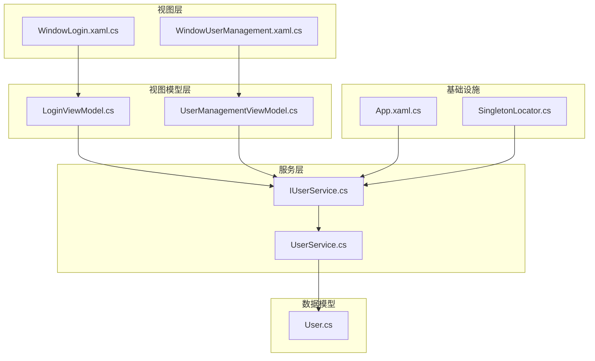
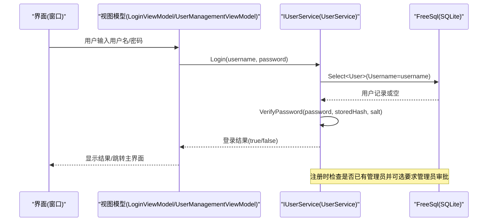
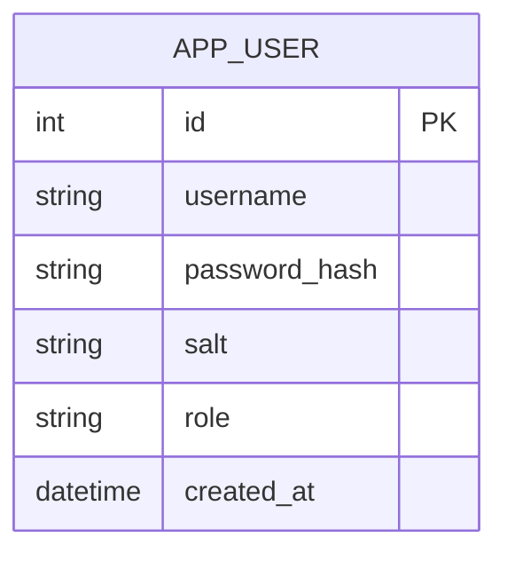
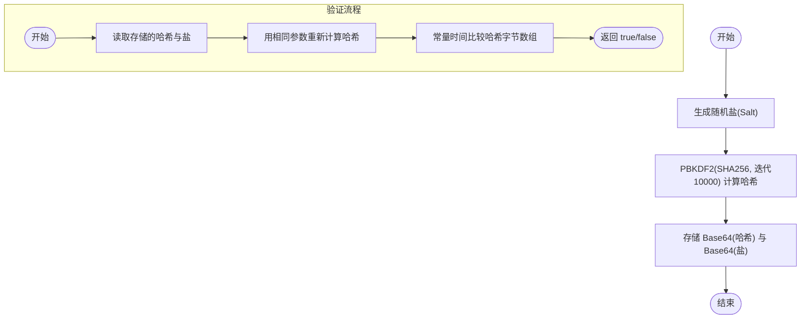
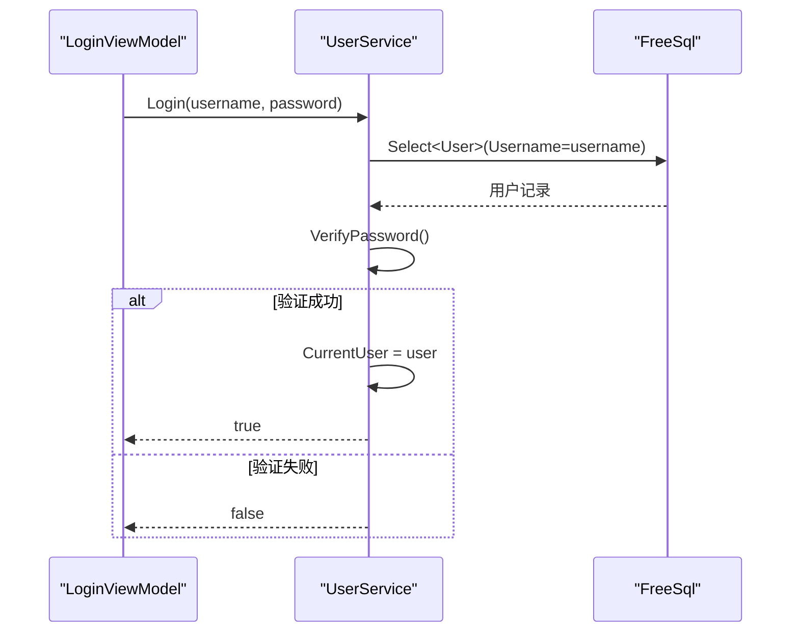
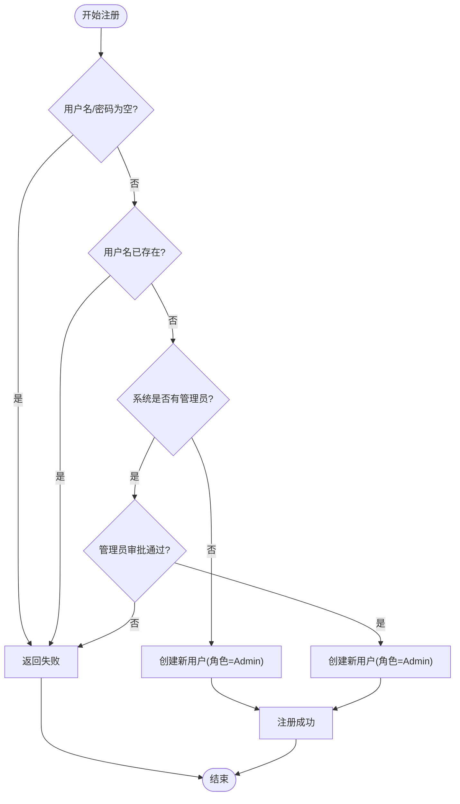
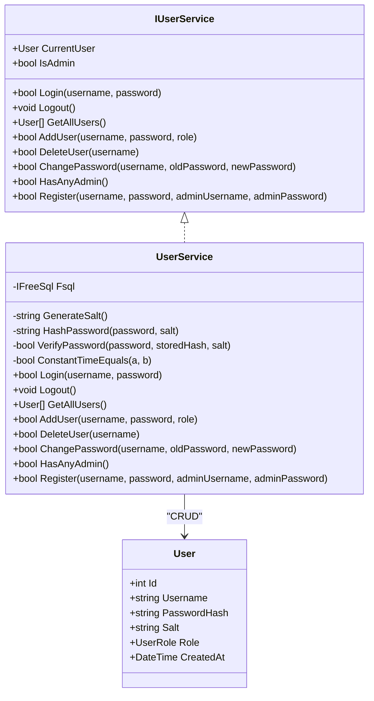
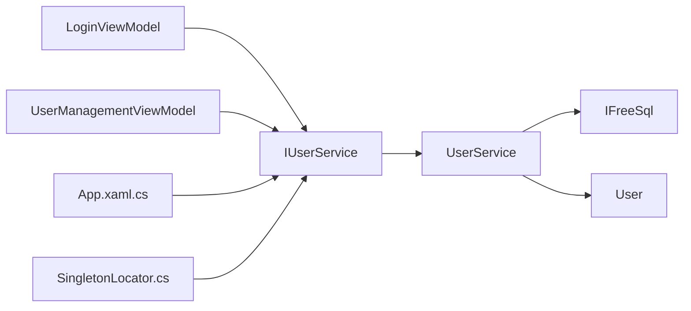

# 用户服务 (UserService)

<cite>
**本文引用的文件**   
- [ShaoLu\Services\UserService.cs](file://ShaoLu\Services\UserService.cs)
- [ShaoLu\Services\IUserService.cs](file://ShaoLu\Services\IUserService.cs)
- [ShaoLu\Models\User.cs](file://ShaoLu\Models\User.cs)
- [ShaoLu\Viewmodels\LoginViewModel.cs](file://ShaoLu\Viewmodels\LoginViewModel.cs)
- [ShaoLu\Viewmodels\UserManagementViewModel.cs](file://ShaoLu\Viewmodels\UserManagementViewModel.cs)
- [ShaoLu\Views\WindowLogin.xaml.cs](file://ShaoLu\Views\WindowLogin.xaml.cs)
- [ShaoLu\Views\WindowUserManagement.xaml.cs](file://ShaoLu\Views\WindowUserManagement.xaml.cs)
- [ShaoLu\App.xaml.cs](file://ShaoLu\App.xaml.cs)
- [ShaoLu\Utils\SingletonLocator.cs](file://ShaoLu\Utils\SingletonLocator.cs)
</cite>

## 目录
1. [简介](#简介)
2. [项目结构](#项目结构)
3. [核心组件](#核心组件)
4. [架构总览](#架构总览)
5. [详细组件分析](#详细组件分析)
6. [依赖关系分析](#依赖关系分析)
7. [性能与安全考量](#性能与安全考量)
8. [故障排查指南](#故障排查指南)
9. [结论](#结论)
10. [附录：使用示例与调用模式](#附录使用示例与调用模式)

## 简介
本技术文档围绕 ShaoLu 的用户服务（UserService）展开，系统性阐述其认证授权机制、密码加密存储（PBKDF2 + Salt）、权限控制、SQLite 数据库集成与 FreeSql ORM 使用、用户模型设计以及安全最佳实践。同时覆盖用户管理操作（增删改查）、管理员权限验证、会话管理等实现细节，并提供具体的代码示例与调用模式，帮助开发者正确实现用户认证与授权流程。

## 项目结构
用户服务相关代码主要分布在以下目录与文件中：
- 服务层：Services/UserService.cs、Services/IUserService.cs
- 数据模型：Models/User.cs
- 视图模型：Viewmodels/LoginViewModel.cs、Viewmodels/UserManagementViewModel.cs
- 视图层：Views/WindowLogin.xaml.cs、Views/WindowUserManagement.xaml.cs
- 应用启动与依赖注入：App.xaml.cs
- 单例定位器：Utils/SingletonLocator.cs

图表来源
- [ShaoLu\Views\WindowLogin.xaml.cs](file://ShaoLu\Views\WindowLogin.xaml.cs)
- [ShaoLu\Views\WindowUserManagement.xaml.cs](file://ShaoLu\Views\WindowUserManagement.xaml.cs)
- [ShaoLu\Viewmodels\LoginViewModel.cs](file://ShaoLu\Viewmodels\LoginViewModel.cs)
- [ShaoLu\Viewmodels\UserManagementViewModel.cs](file://ShaoLu\Viewmodels\UserManagementViewModel.cs)
- [ShaoLu\Services\IUserService.cs](file://ShaoLu\Services\IUserService.cs)
- [ShaoLu\Services\UserService.cs](file://ShaoLu\Services\UserService.cs)
- [ShaoLu\Models\User.cs](file://ShaoLu\Models\User.cs)
- [ShaoLu\App.xaml.cs](file://ShaoLu\App.xaml.cs)
- [ShaoLu\Utils\SingletonLocator.cs](file://ShaoLu\Utils\SingletonLocator.cs)

章节来源
- [ShaoLu\Services\UserService.cs:1-239](file://ShaoLu\Services\UserService.cs#L1-L239)
- [ShaoLu\Services\IUserService.cs:1-20](file://ShaoLu\Services\IUserService.cs#L1-L20)
- [ShaoLu\Models\User.cs:1-33](file://ShaoLu\Models\User.cs#L1-L33)
- [ShaoLu\Viewmodels\LoginViewModel.cs:1-251](file://ShaoLu\Viewmodels\LoginViewModel.cs#L1-L251)
- [ShaoLu\Viewmodels\UserManagementViewModel.cs:1-194](file://ShaoLu\Viewmodels\UserManagementViewModel.cs#L1-L194)
- [ShaoLu\Views\WindowLogin.xaml.cs:1-87](file://ShaoLu\Views\WindowLogin.xaml.cs#L1-L87)
- [ShaoLu\Views\WindowUserManagement.xaml.cs:1-33](file://ShaoLu\Views\WindowUserManagement.xaml.cs#L1-L33)
- [ShaoLu\App.xaml.cs:50-68](file://ShaoLu\App.xaml.cs#L50-L68)
- [ShaoLu\Utils\SingletonLocator.cs:1-18](file://ShaoLu\Utils\SingletonLocator.cs#L1-L18)

## 核心组件
- IUserService 接口：定义用户服务的契约，包括当前用户、管理员判断、登录/登出、用户列表获取、添加/删除用户、修改密码、注册、是否存在管理员等能力。
- UserService 实现：基于 FreeSql + SQLite 的持久化实现，包含 PBKDF2 + Salt 的密码哈希与校验、常量时间比较、会话状态维护、用户管理与注册逻辑。
- User 模型：FreeSql 注解映射到 SQLite 表 app_user，包含用户名、密码哈希、盐值、角色、创建时间等字段。
- LoginViewModel / UserManagementViewModel：UI 交互与业务编排，调用 IUserService 完成登录、注册、用户管理等功能。
- 依赖注入与单例定位：App.xaml.cs 中注册 IUserService 为单例；SingletonLocator 提供全局访问点。

章节来源
- [ShaoLu\Services\IUserService.cs:1-20](file://ShaoLu\Services\IUserService.cs#L1-L20)
- [ShaoLu\Services\UserService.cs:1-239](file://ShaoLu\Services\UserService.cs#L1-L239)
- [ShaoLu\Models\User.cs:1-33](file://ShaoLu\Models\User.cs#L1-L33)
- [ShaoLu\Viewmodels\LoginViewModel.cs:1-251](file://ShaoLu\Viewmodels\LoginViewModel.cs#L1-L251)
- [ShaoLu\Viewmodels\UserManagementViewModel.cs:1-194](file://ShaoLu\Viewmodels\UserManagementViewModel.cs#L1-L194)
- [ShaoLu\App.xaml.cs:50-68](file://ShaoLu\App.xaml.cs#L50-L68)
- [ShaoLu\Utils\SingletonLocator.cs:1-18](file://ShaoLu\Utils\SingletonLocator.cs#L1-L18)

## 架构总览
UserService 采用分层架构：
- 视图层通过 ViewModel 调用服务接口
- 服务层负责业务逻辑与数据安全（密码哈希、权限校验、数据库操作）
- 数据层通过 FreeSql ORM 与 SQLite 交互，自动同步表结构

图表来源
- [ShaoLu\Viewmodels\LoginViewModel.cs:49-75](file://ShaoLu\Viewmodels\LoginViewModel.cs#L49-L75)
- [ShaoLu\Services\UserService.cs:76-93](file://ShaoLu\Services\UserService.cs#L76-L93)
- [ShaoLu\Services\UserService.cs:194-236](file://ShaoLu\Services\UserService.cs#L194-L236)

## 详细组件分析

### 用户模型与数据库设计
- 表名：app_user
- 字段：
  - Id：自增主键
  - Username：用户名（非空，长度限制）
  - PasswordHash：密码哈希（Base64 编码）
  - Salt：随机盐值（Base64 编码）
  - Role：角色（Admin/User），以字符串形式映射
  - CreatedAt：创建时间

章节来源
- [ShaoLu\Models\User.cs:12-31](file://ShaoLu\Models\User.cs#L12-L31)

### 密码加密与验证（PBKDF2 + Salt）
- 盐值生成：使用 RNGCryptoServiceProvider 生成 16 字节随机盐，Base64 编码存储
- 哈希算法：Rfc2898DeriveBytes（PBKDF2），迭代次数 10000，SHA256，输出 32 字节哈希，Base64 编码
- 验证过程：重新计算哈希后，使用常量时间比较避免时序攻击
- 安全性要点：
  - 不存储明文密码
  - 每个用户独立盐值
  - 常量时间比较防止侧信道泄露
  - 合理迭代次数平衡安全与性能

章节来源
- [ShaoLu\Services\UserService.cs:39-74](file://ShaoLu\Services\UserService.cs#L39-L74)

### 登录与登出（会话管理）
- 登录：根据用户名查询用户，校验密码哈希，成功后设置 CurrentUser
- 登出：清空 CurrentUser
- 会话状态：CurrentUser 表示当前登录用户，IsAdmin 基于角色判断

章节来源
- [ShaoLu\Services\UserService.cs:76-98](file://ShaoLu\Services\UserService.cs#L76-L98)
- [ShaoLu\Viewmodels\LoginViewModel.cs:49-75](file://ShaoLu\Viewmodels\LoginViewModel.cs#L49-L75)

### 用户注册（含管理员审批）
- 首次注册：若系统中无管理员，则新用户直接成为管理员
- 已有管理员：需要管理员用户名与密码进行审批，通过后注册用户（默认管理员角色）
- 用户名唯一性检查：防止重复注册

章节来源
- [ShaoLu\Services\UserService.cs:194-236](file://ShaoLu\Services\UserService.cs#L194-L236)
- [ShaoLu\Viewmodels\LoginViewModel.cs:175-248](file://ShaoLu\Viewmodels\LoginViewModel.cs#L175-L248)

### 用户管理（增删改查）
- 添加用户：校验用户名与密码，生成盐与哈希，插入数据库
- 删除用户：不允许删除最后一个管理员；若删除的是当前登录用户，自动登出
- 修改密码：校验旧密码，生成新盐与哈希，更新数据库
- 查询用户：按创建时间排序返回所有用户

图表来源
- [ShaoLu\Services\IUserService.cs:6-18](file://ShaoLu\Services\IUserService.cs#L6-L18)
- [ShaoLu\Services\UserService.cs:10-239](file://ShaoLu\Services\UserService.cs#L10-L239)
- [ShaoLu\Models\User.cs:12-31](file://ShaoLu\Models\User.cs#L12-L31)

章节来源
- [ShaoLu\Services\UserService.cs:100-185](file://ShaoLu\Services\UserService.cs#L100-L185)
- [ShaoLu\Viewmodels\UserManagementViewModel.cs:86-191](file://ShaoLu\Viewmodels\UserManagementViewModel.cs#L86-L191)

### 权限控制与管理员验证
- IsAdmin：基于 CurrentUser.Role 判断
- 删除保护：确保至少保留一个管理员账户
- 注册审批：当存在管理员时，新用户注册需管理员认证

章节来源
- [ShaoLu\Services\UserService.cs:31](file://ShaoLu\Services\UserService.cs#L31)
- [ShaoLu\Services\UserService.cs:140-148](file://ShaoLu\Services\UserService.cs#L140-L148)
- [ShaoLu\Services\UserService.cs:203-220](file://ShaoLu\Services\UserService.cs#L203-L220)

### 数据库集成（FreeSql + SQLite）
- 连接字符串：Data Source={dbPath}，路径位于 ApplicationData/AutoShaoLu/users.db
- 自动建表：UseAutoSyncStructure(true)，首次运行自动创建 app_user 表
- 线程安全：Lazy<IFreeSql> 保证初始化一次且线程安全

章节来源
- [ShaoLu\Services\UserService.cs:12-28](file://ShaoLu\Services\UserService.cs#L12-L28)

## 依赖关系分析
- 视图模型依赖 IUserService 接口，解耦具体实现
- UserService 依赖 FreeSql 与 User 模型
- 应用启动时通过 ServiceCollection 注册 IUserService 为单例
- SingletonLocator 提供全局访问 IUserService

图表来源
- [ShaoLu\Viewmodels\LoginViewModel.cs:1-42](file://ShaoLu\Viewmodels\LoginViewModel.cs#L1-L42)
- [ShaoLu\Viewmodels\UserManagementViewModel.cs:1-84](file://ShaoLu\Viewmodels\UserManagementViewModel.cs#L1-L84)
- [ShaoLu\Services\UserService.cs:12-28](file://ShaoLu\Services\UserService.cs#L12-L28)
- [ShaoLu\App.xaml.cs:50-68](file://ShaoLu\App.xaml.cs#L50-L68)
- [ShaoLu\Utils\SingletonLocator.cs:10-14](file://ShaoLu\Utils\SingletonLocator.cs#L10-L14)

章节来源
- [ShaoLu\App.xaml.cs:50-68](file://ShaoLu\App.xaml.cs#L50-L68)
- [ShaoLu\Utils\SingletonLocator.cs:10-14](file://ShaoLu\Utils\SingletonLocator.cs#L10-L14)

## 性能与安全考量
- 性能
  - Lazy<IFreeSql> 延迟初始化，减少启动开销
  - 批量操作未在当前实现中使用，可按需优化
  - 查询按 CreatedAt 排序，适合小数据集；大数据集建议分页
- 安全
  - PBKDF2 迭代次数 10000，平衡安全与性能
  - 常量时间比较避免时序攻击
  - 盐值随机生成，防彩虹表攻击
  - 不存储明文密码，仅存哈希与盐
- 可扩展性
  - 可配置迭代次数与哈希算法
  - 可增加多因素认证、令牌刷新等机制

[本节为通用指导，不直接分析具体文件]

## 故障排查指南
- 登录失败
  - 检查用户名是否存在
  - 确认密码是否正确（注意大小写与空格）
  - 查看日志与服务端错误信息
- 注册失败
  - 用户名是否已存在
  - 是否需要管理员审批（HasAnyAdmin）
  - 管理员凭据是否正确
- 删除用户失败
  - 是否为最后一个管理员
  - 是否尝试删除当前登录用户（业务限制）
- 数据库问题
  - 检查 ApplicationData/AutoShaoLu 目录是否存在
  - users.db 文件权限与完整性

章节来源
- [ShaoLu\Services\UserService.cs:76-93](file://ShaoLu\Services\UserService.cs#L76-L93)
- [ShaoLu\Services\UserService.cs:194-236](file://ShaoLu\Services\UserService.cs#L194-L236)
- [ShaoLu\Services\UserService.cs:131-159](file://ShaoLu\Services\UserService.cs#L131-L159)

## 结论
UserService 提供了完整的用户认证与授权能力，结合 PBKDF2 + Salt 的安全密码存储、FreeSql + SQLite 的轻量级数据持久化、以及清晰的权限控制策略，满足桌面应用的用户管理需求。通过依赖注入与单例定位，服务易于测试与扩展。建议在后续版本中引入更细粒度的权限模型、审计日志与密码强度策略，以提升整体安全性与可维护性。

[本节为总结性内容，不直接分析具体文件]

## 附录：使用示例与调用模式
- 登录流程
  - 在 LoginViewModel 中调用 IUserService.Login(username, password)
  - 成功后设置 IsLoginSuccessful=true，触发 RequestClose(true)
  - 视图层根据 DialogResult 关闭登录窗口并进入主界面

- 注册流程
  - 在 LoginViewModel 中调用 IUserService.Register(username, password, adminUsername?, adminPassword?)
  - 若 NeedAdminApproval=true，需提供管理员凭据
  - 成功后切换至登录模式并预填用户名

- 用户管理
  - 在 UserManagementViewModel 中调用 IUserService.AddUser/DeleteUser/ChangePassword
  - 删除前检查 SelectedUser 与当前用户身份
  - 修改密码前校验旧密码

- 依赖注入与访问
  - App.xaml.cs 中注册 IUserService 为单例
  - 通过 SingletonLocator.UserService 获取实例

章节来源
- [ShaoLu\Viewmodels\LoginViewModel.cs:49-75](file://ShaoLu\Viewmodels\LoginViewModel.cs#L49-L75)
- [ShaoLu\Viewmodels\LoginViewModel.cs:175-248](file://ShaoLu\Viewmodels\LoginViewModel.cs#L175-L248)
- [ShaoLu\Viewmodels\UserManagementViewModel.cs:96-191](file://ShaoLu\Viewmodels\UserManagementViewModel.cs#L96-L191)
- [ShaoLu\App.xaml.cs:50-68](file://ShaoLu\App.xaml.cs#L50-L68)
- [ShaoLu\Utils\SingletonLocator.cs:10-14](file://ShaoLu\Utils\SingletonLocator.cs#L10-L14)