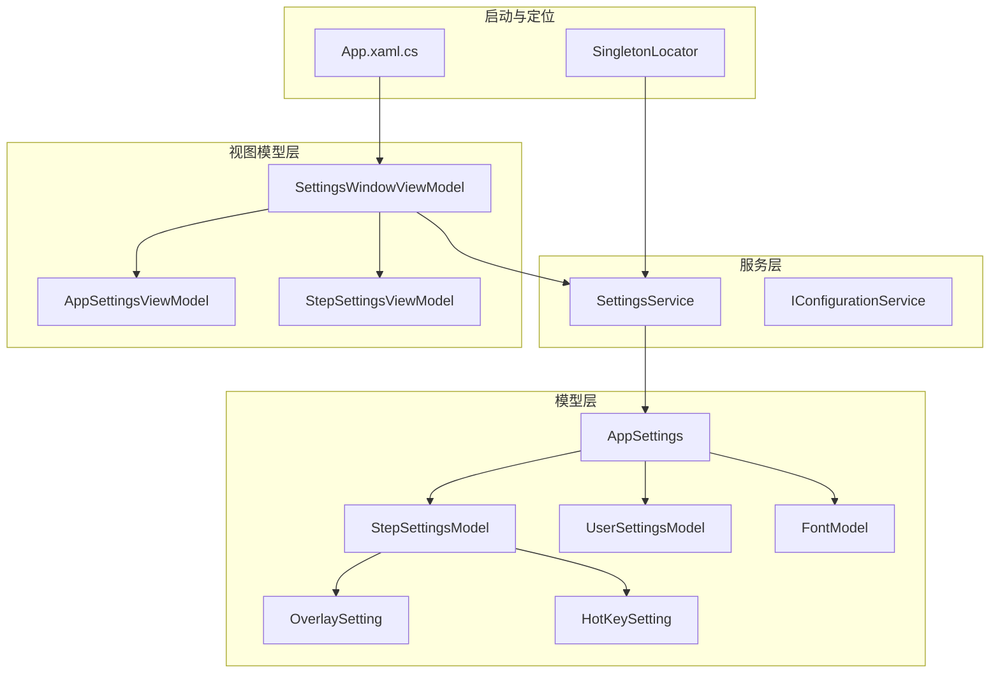
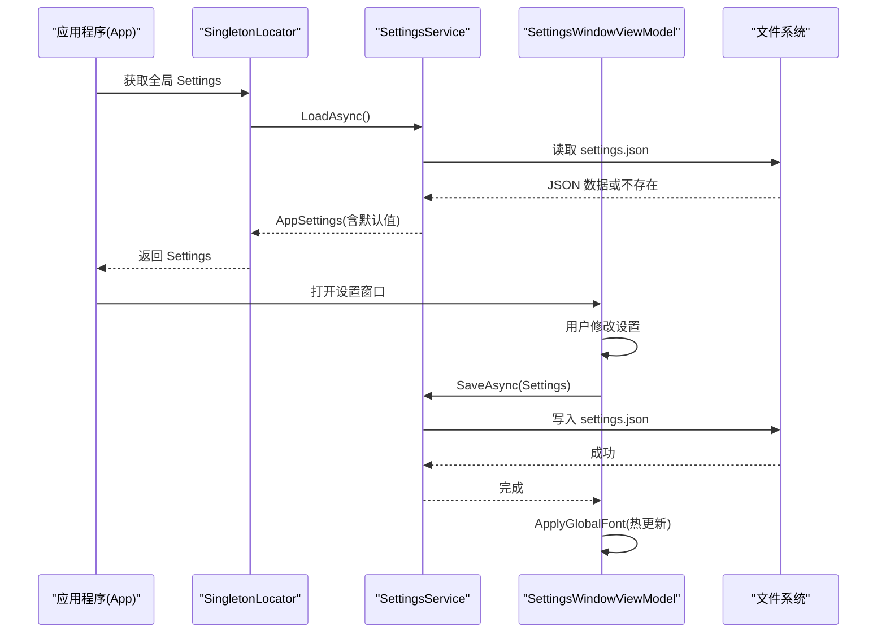
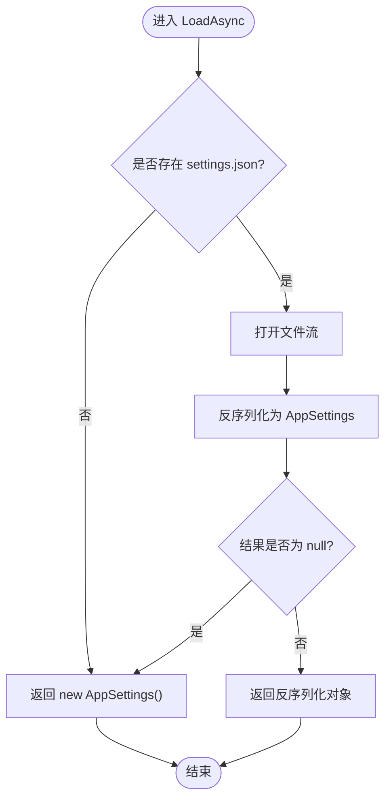
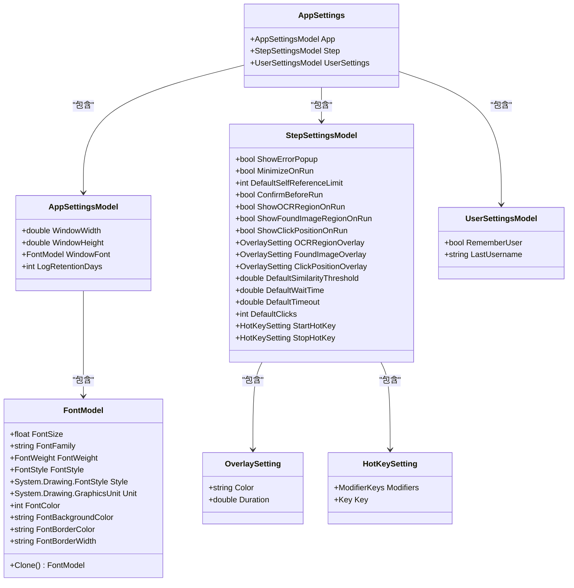
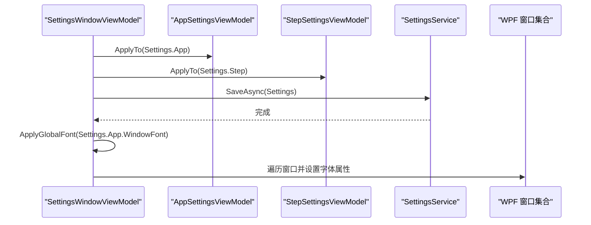
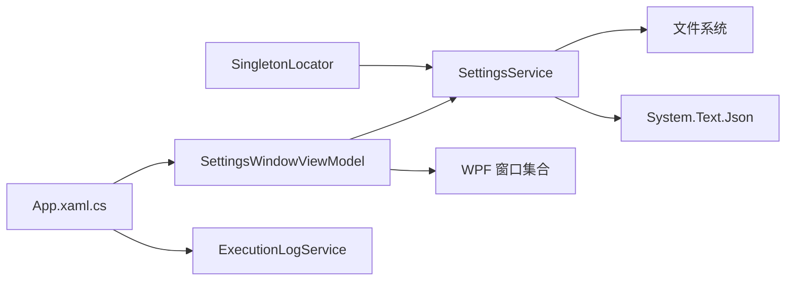

# 设置服务 (SettingsService)

<cite>
**本文引用的文件**   
- [SettingsService.cs](file://ShaoLu/Services/SettingsService.cs)
- [Settings.cs](file://ShaoLu/Models/Settings.cs)
- [FontModel.cs](file://ShaoLu/Models/FontModel.cs)
- [SettingsViewModel.cs](file://ShaoLu/Viewmodels/SettingsViewModel.cs)
- [SingletonLocator.cs](file://ShaoLu/Utils/SingletonLocator.cs)
- [App.xaml.cs](file://ShaoLu/App.xaml.cs)
- [IConfigurationService.cs](file://ShaoLu/Services/IConfigurationService.cs)
</cite>

## 目录
1. [简介](#简介)
2. [项目结构](#项目结构)
3. [核心组件](#核心组件)
4. [架构总览](#架构总览)
5. [详细组件分析](#详细组件分析)
6. [依赖关系分析](#依赖关系分析)
7. [性能考虑](#性能考虑)
8. [故障排查指南](#故障排查指南)
9. [结论](#结论)
10. [附录](#附录)

## 简介
本技术文档围绕 ShaoLu 的设置服务（SettingsService）展开，系统阐述其配置管理机制：应用设置的读取、保存、默认值处理；JSON 配置文件格式与数据类型映射；版本兼容性与扩展性建议；设置验证机制、热重载支持方案以及多环境配置管理策略。同时提供具体配置项说明、使用示例与最佳实践，帮助开发者快速理解并安全地扩展该模块。

## 项目结构
设置相关代码主要分布在以下位置：
- 服务层：SettingsService（JSON 读写）、IConfigurationService（键值配置接口）
- 模型层：AppSettings、StepSettingsModel、UserSettingsModel、FontModel、OverlaySetting、HotKeySetting
- 视图模型层：SettingsWindowViewModel、AppSettingsViewModel、StepSettingsViewModel（UI 绑定与回写）
- 启动与单例：SingletonLocator（全局 Settings 实例）、App.xaml.cs（应用启动时应用字体等）

图表来源 
- [SettingsService.cs:1-38](file://ShaoLu/Services/SettingsService.cs#L1-L38)
- [Settings.cs:1-117](file://ShaoLu/Models/Settings.cs#L1-L117)
- [SettingsViewModel.cs:1-260](file://ShaoLu/Viewmodels/SettingsViewModel.cs#L1-L260)
- [SingletonLocator.cs:1-19](file://ShaoLu/Utils/SingletonLocator.cs#L1-L19)
- [App.xaml.cs:1-112](file://ShaoLu/App.xaml.cs#L1-L112)

章节来源
- [SettingsService.cs:1-38](file://ShaoLu/Services/SettingsService.cs#L1-L38)
- [Settings.cs:1-117](file://ShaoLu/Models/Settings.cs#L1-L117)
- [SettingsViewModel.cs:1-260](file://ShaoLu/Viewmodels/SettingsViewModel.cs#L1-L260)
- [SingletonLocator.cs:1-19](file://ShaoLu/Utils/SingletonLocator.cs#L1-L19)
- [App.xaml.cs:1-112](file://ShaoLu/App.xaml.cs#L1-L112)

## 核心组件
- SettingsService：负责 settings.json 的异步加载与保存，采用 System.Text.Json 序列化，写入时启用缩进便于人工编辑。
- AppSettings 及其子模型：定义应用级、步骤级、用户级设置的数据结构与默认值。
- SettingsWindowViewModel：构建设置树、将 UI 变更回写到模型，调用 SettingsService 持久化，并在保存后即时应用部分设置（如全局字体）。
- SingletonLocator：在进程启动时通过同步等待异步方法获取全局 Settings 实例，供其他组件访问。
- IConfigurationService：预留的键值型配置接口，当前未实现，可用于未来细粒度配置或扩展。

章节来源
- [SettingsService.cs:1-38](file://ShaoLu/Services/SettingsService.cs#L1-L38)
- [Settings.cs:1-117](file://ShaoLu/Models/Settings.cs#L1-L117)
- [SettingsViewModel.cs:1-260](file://ShaoLu/Viewmodels/SettingsViewModel.cs#L1-L260)
- [SingletonLocator.cs:1-19](file://ShaoLu/Utils/SingletonLocator.cs#L1-L19)
- [IConfigurationService.cs:1-12](file://ShaoLu/Services/IConfigurationService.cs#L1-L12)

## 架构总览
设置服务的整体流程如下：
- 应用启动时，SingletonLocator 初始化全局 Settings（从 settings.json 加载或返回默认对象）。
- 主界面与设置窗口通过 ViewModel 绑定到 Settings 模型，用户修改后点击保存。
- SettingsWindowViewModel 将 ViewModel 的值回写到模型，并调用 SettingsService.SaveAsync 持久化。
- 保存成功后，立即应用部分可热更新的设置（例如全局字体），无需重启。

图表来源 
- [SingletonLocator.cs:1-19](file://ShaoLu/Utils/SingletonLocator.cs#L1-L19)
- [SettingsService.cs:1-38](file://ShaoLu/Services/SettingsService.cs#L1-L38)
- [SettingsViewModel.cs:1-260](file://ShaoLu/Viewmodels/SettingsViewModel.cs#L1-L260)

## 详细组件分析

### SettingsService：配置读写与默认值
- 文件路径：settings.json 位于应用基目录（AppDomain.CurrentDomain.BaseDirectory）。
- 加载逻辑：若文件不存在则直接返回新的 AppSettings（所有属性具有默认值）；存在则反序列化为 AppSettings，若反序列化结果为 null 也返回默认对象。
- 保存逻辑：以缩进格式序列化 AppSettings 到 settings.json。
- 线程模型：LoadAsync/SaveAsync 均为异步 IO，避免阻塞 UI 线程。

图表来源 
- [SettingsService.cs:1-38](file://ShaoLu/Services/SettingsService.cs#L1-L38)

章节来源
- [SettingsService.cs:1-38](file://ShaoLu/Services/SettingsService.cs#L1-L38)

### 模型与数据类型映射
- AppSettings：包含 App（应用设置）、Step（步骤设置）、UserSettings（用户设置）三个子段。
- AppSettingsModel：窗口尺寸、字体（FontModel）、日志保留天数（LogRetentionDays）。
- StepSettingsModel：运行行为（错误弹窗、最小化、确认运行、调试覆盖层显示开关）、默认参数（相似度阈值、等待/超时时间、点击次数）、自引用限制、快捷键（StartHotKey/StopHotKey）。
- UserSettingsModel：记住用户名、上次用户名。
- FontModel：字体族、大小、粗细、样式、单位、颜色与边框等，并提供 Clone 方法与默认构造。
- OverlaySetting：覆盖层颜色与显示时长。
- HotKeySetting：修饰键与主键组合。

图表来源 
- [Settings.cs:1-117](file://ShaoLu/Models/Settings.cs#L1-L117)
- [FontModel.cs:1-46](file://ShaoLu/Models/FontModel.cs#L1-L46)

章节来源
- [Settings.cs:1-117](file://ShaoLu/Models/Settings.cs#L1-L117)
- [FontModel.cs:1-46](file://ShaoLu/Models/FontModel.cs#L1-L46)

### SettingsWindowViewModel：设置树与保存流程
- 设置树构建：按“App”和“Step”两大分类组织，每个分类下包含若干子项（如字体、日志保留天数、运行行为、默认参数、调试设置等）。
- 数据绑定：AppSettingsViewModel 与 StepSettingsViewModel 分别持有对应模型的副本，ApplyTo 方法将 UI 值回写到模型。
- 保存流程：遍历分类节点，调用 ApplyTo 回写模型，然后调用 SettingsService.SaveAsync 持久化；保存成功后提示用户并可关闭窗口。
- 热更新：保存后立即应用全局字体设置（ApplyGlobalFont），对已打开窗口生效，无需重启。

图表来源 
- [SettingsViewModel.cs:1-260](file://ShaoLu/Viewmodels/SettingsViewModel.cs#L1-L260)

章节来源
- [SettingsViewModel.cs:1-260](file://ShaoLu/Viewmodels/SettingsViewModel.cs#L1-L260)

### 启动与全局设置应用
- SingletonLocator.Settings：在静态字段初始化时调用 SettingsService.LoadAsync().GetAwaiter().GetResult() 获取全局 Settings。
- App.xaml.cs：启动时根据 Settings.App.LogRetentionDays 清理过期执行日志，并通过 SettingsWindowViewModel.ApplyGlobalFont 应用全局字体。

章节来源
- [SingletonLocator.cs:1-19](file://ShaoLu/Utils/SingletonLocator.cs#L1-L19)
- [App.xaml.cs:1-112](file://ShaoLu/App.xaml.cs#L1-L112)

## 依赖关系分析
- SettingsService 依赖 System.Text.Json 进行序列化/反序列化，依赖文件系统读写。
- SettingsWindowViewModel 依赖 SettingsService 与 WPF 窗口集合，用于持久化与热更新。
- SingletonLocator 依赖 SettingsService 提供全局 Settings 实例。
- App.xaml.cs 依赖 ExecutionLogService（清理日志）与 SettingsWindowViewModel（应用字体）。

图表来源 
- [SettingsService.cs:1-38](file://ShaoLu/Services/SettingsService.cs#L1-L38)
- [SettingsViewModel.cs:1-260](file://ShaoLu/Viewmodels/SettingsViewModel.cs#L1-L260)
- [SingletonLocator.cs:1-19](file://ShaoLu/Utils/SingletonLocator.cs#L1-L19)
- [App.xaml.cs:1-112](file://ShaoLu/App.xaml.cs#L1-L112)

章节来源
- [SettingsService.cs:1-38](file://ShaoLu/Services/SettingsService.cs#L1-L38)
- [SettingsViewModel.cs:1-260](file://ShaoLu/Viewmodels/SettingsViewModel.cs#L1-L260)
- [SingletonLocator.cs:1-19](file://ShaoLu/Utils/SingletonLocator.cs#L1-L19)
- [App.xaml.cs:1-112](file://ShaoLu/App.xaml.cs#L1-L112)

## 性能考虑
- 序列化选项：WriteIndented = true 提升可读性，但会增加文件大小与 I/O 开销。对于频繁保存的场景，可在不要求可读性的情况下关闭缩进以提升性能。
- 异步 IO：LoadAsync/SaveAsync 使用异步 API，避免阻塞 UI 线程，适合桌面应用。
- 内存占用：AppSettings 对象较小，影响有限；若未来扩展大量配置项，建议按需加载或分片存储。
- 字体热更新：ApplyGlobalFont 遍历所有窗口并设置字体属性，窗口数量较多时可能带来短暂卡顿，建议在后台线程或批量更新时注意用户体验。

[本节为通用指导，不直接分析具体文件]

## 故障排查指南
- settings.json 缺失或损坏：
  - 现象：首次启动或文件损坏时，LoadAsync 会返回默认 AppSettings。
  - 处理：检查应用基目录下是否存在 settings.json；若损坏，删除后重新启动以重建默认配置。
- 保存失败：
  - 现象：SaveAsync 抛出异常（权限不足、磁盘不可写等）。
  - 处理：确保应用对 BaseDirectory 有写入权限；检查磁盘空间与文件占用情况。
- 热更新无效：
  - 现象：保存后字体未生效。
  - 处理：确认 ApplyGlobalFont 被调用且传入的 FontModel 有效（FontFamily 非空）；检查窗口是否已被创建。
- 快捷键冲突：
  - 现象：StartHotKey/StopHotKey 与其他程序冲突。
  - 处理：在 StepSettingsModel 中调整 Modifiers 与 Key，避免系统级冲突。

章节来源
- [SettingsService.cs:1-38](file://ShaoLu/Services/SettingsService.cs#L1-L38)
- [SettingsViewModel.cs:1-260](file://ShaoLu/Viewmodels/SettingsViewModel.cs#L1-L260)

## 结论
SettingsService 提供了简洁可靠的 JSON 配置管理能力，结合 ViewModel 实现了良好的 UI 绑定与热更新体验。通过合理的默认值与异步 IO，保证了应用的健壮性与响应性。未来可扩展 IConfigurationService 以实现更细粒度的配置管理，并引入版本迁移与校验机制以增强兼容性。

[本节为总结，不直接分析具体文件]

## 附录

### JSON 配置文件格式与字段说明
- 文件路径：settings.json（应用基目录）
- 根对象：AppSettings
  - App：应用设置
    - WindowWidth：窗口宽度（double）
    - WindowHeight：窗口高度（double）
    - WindowFont：字体设置（FontModel）
      - FontSize：字号（float）
      - FontFamily：字体族（string）
      - FontWeight：字重（FontWeight）
      - FontStyle：字形（FontStyle）
      - Style：绘图样式（System.Drawing.FontStyle）
      - Unit：单位（System.Drawing.GraphicsUnit）
      - FontColor：字体颜色（int）
      - FontBackgroundColor：背景色（string）
      - FontBorderColor：边框色（string）
      - FontBorderWidth：边框宽度（string）
    - LogRetentionDays：日志保留天数（int，0=永不清理）
  - Step：步骤设置
    - ShowErrorPopup：运行时显示错误弹窗（bool）
    - MinimizeOnRun：运行时最小化窗口（bool）
    - DefaultSelfReferenceLimit：默认自引用次数上限（int，-1=无限制，0=禁止，>0=限制）
    - ConfirmBeforeRun：运行前弹出确认对话框（bool）
    - ShowOCRRegionOnRun：OCR 识别区域可视化（bool）
    - ShowFoundImageRegionOnRun：找到图像区域可视化（bool）
    - ShowClickPositionOnRun：点击位置可视化（bool）
    - OCRRegionOverlay：OCR 覆盖层（OverlaySetting）
      - Color：颜色（string，十六进制）
      - Duration：显示时长（double，秒）
    - FoundImageOverlay：找到图像覆盖层（OverlaySetting）
    - ClickPositionOverlay：点击位置覆盖层（OverlaySetting）
    - DefaultSimilarityThreshold：默认相似度阈值（double，0~1）
    - DefaultWaitTime：默认等待时间（double，秒）
    - DefaultTimeout：默认超时时间（double，秒）
    - DefaultClicks：默认点击次数（int）
    - StartHotKey：启动快捷键（HotKeySetting）
      - Modifiers：修饰键（ModifierKeys）
      - Key：主键（Key）
    - StopHotKey：停止快捷键（HotKeySetting）
  - UserSettings：用户设置
    - RememberUser：记住用户（bool）
    - LastUsername：上次用户名（string）

章节来源
- [Settings.cs:1-117](file://ShaoLu/Models/Settings.cs#L1-L117)
- [FontModel.cs:1-46](file://ShaoLu/Models/FontModel.cs#L1-L46)

### 使用示例与最佳实践
- 首次启动：
  - 若无 settings.json，将生成默认配置；可通过设置窗口修改并保存。
- 修改字体：
  - 在“App > 字体”中选择字体，保存后即刻应用到所有窗口。
- 调整步骤默认参数：
  - 在“Step > 默认参数”中设置相似度阈值、等待/超时时间、点击次数等，新建步骤时将自动应用。
- 快捷键配置：
  - 在“Step > 调试设置”中配置 StartHotKey/StopHotKey，避免系统冲突。
- 最佳实践：
  - 保持 settings.json 的可读性，必要时关闭 WriteIndented 以提升性能。
  - 对关键配置增加校验（如阈值范围、快捷键冲突检测）。
  - 如需细粒度配置，可实现 IConfigurationService 并基于 key/value 存取。

[本节为通用指导，不直接分析具体文件]

### 版本兼容性与扩展建议
- 向后兼容：
  - 新增字段应提供默认值，避免旧版配置反序列化失败。
  - 移除字段需保留占位或迁移逻辑，防止破坏现有配置。
- 向前兼容：
  - 在读取时忽略未知字段（System.Text.Json 默认行为），或通过自定义转换器处理版本差异。
- 扩展点：
  - 实现 IConfigurationService，提供 GetSettingAsync/SaveSettingAsync/RemoveSettingAsync 能力，支持动态配置与多环境切换。
  - 引入配置迁移器（Migration），在应用启动时检测版本并升级配置结构。

[本节为通用指导，不直接分析具体文件]

### 多环境配置管理
- 环境区分：
  - 通过环境变量或命令行参数决定 settings.json 的路径或文件名（如 settings.dev.json、settings.prod.json）。
- 加载策略：
  - 在 SettingsService.LoadAsync 中根据环境选择不同文件路径；若目标文件不存在则回退到默认配置。
- 部署建议：
  - 生产环境禁用 WriteIndented，减少体积与 I/O。
  - 对敏感信息（如用户名）进行加密存储或外部化管理。

[本节为通用指导，不直接分析具体文件]