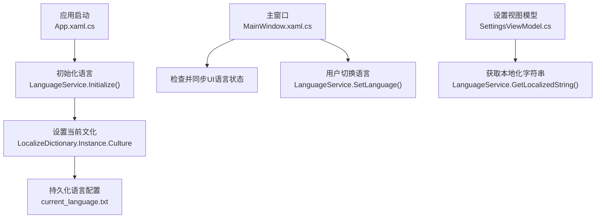
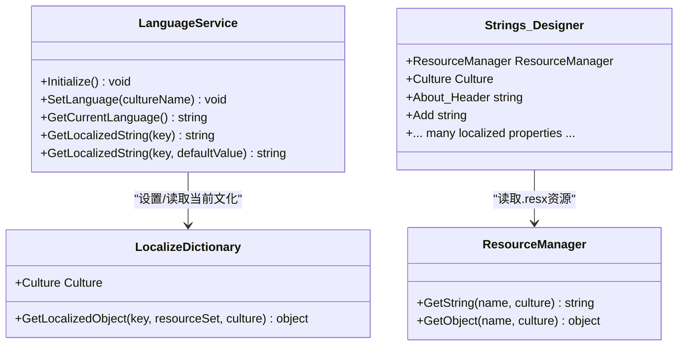
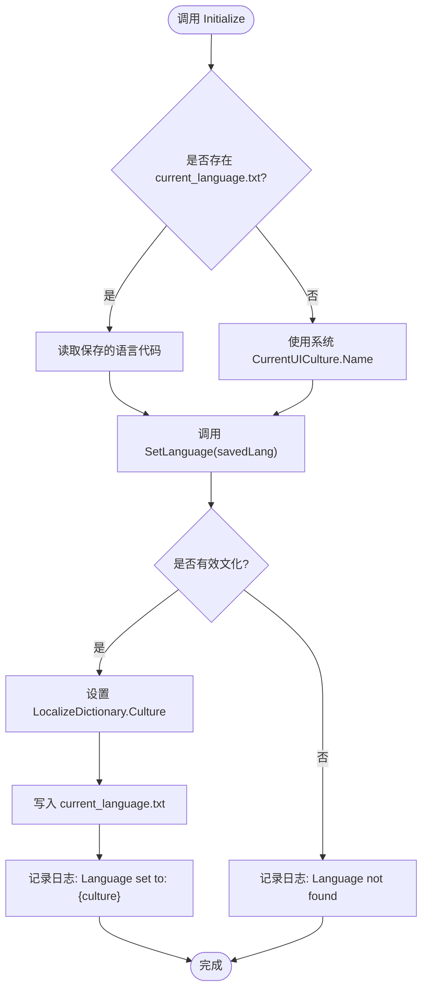
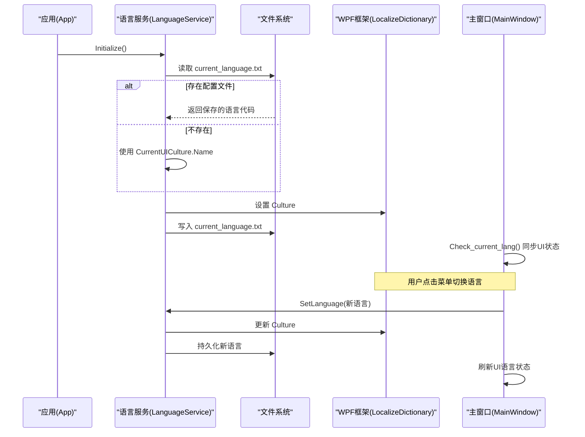
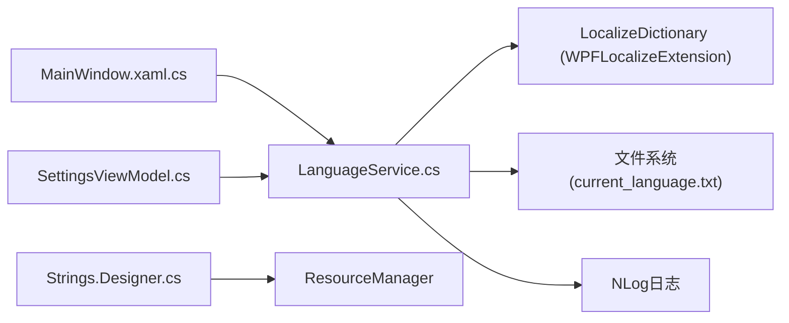

# 语言服务 (LanguageService)

<cite>
**本文引用的文件**   
- [LanguageService.cs](file://ShaoLu/Services/LanguageService.cs)
- [App.xaml.cs](file://ShaoLu/App.xaml.cs)
- [MainWindow.xaml.cs](file://ShaoLu/MainWindow.xaml.cs)
- [Strings.Designer.cs](file://ShaoLu/Resources/Strings.Designer.cs)
- [Strings.resx](file://ShaoLu/Resources/Strings.resx)
- [Strings.en-US.resx](file://ShaoLu/Resources/Strings.en-US.resx)
- [Strings.zh-CN.resx](file://ShaoLu/Resources/Strings.zh-CN.resx)
- [Strings.zh-TW.resx](file://ShaoLu/Resources/Strings.zh-TW.resx)
- [Resources.resx](file://ShaoLu/Properties/Resources.resx)
- [SettingsViewModel.cs](file://ShaoLu/Viewmodels/SettingsViewModel.cs)
</cite>

## 目录
1. [简介](#简介)
2. [项目结构](#项目结构)
3. [核心组件](#核心组件)
4. [架构总览](#架构总览)
5. [详细组件分析](#详细组件分析)
6. [依赖关系分析](#依赖关系分析)
7. [性能考量](#性能考量)
8. [故障排查指南](#故障排查指南)
9. [结论](#结论)
10. [附录](#附录)

## 简介
本技术文档围绕 ShaoLu 的“语言服务”展开，系统性说明 LanguageService 的多语言支持实现与运行机制。内容涵盖：
- 资源文件管理（.resx）与强类型生成（Designer）
- 运行时语言切换流程与持久化策略
- 本地化字符串获取与回退机制
- 语言检测算法、默认语言回退策略
- 自定义语言包扩展建议
- 多语言开发最佳实践与国际化测试方法

## 项目结构
语言相关代码与资源主要分布在以下位置：
- 服务层：ShaoLu/Services/LanguageService.cs
- 应用启动：ShaoLu/App.xaml.cs
- 主窗口交互：ShaoLu/MainWindow.xaml.cs
- 资源文件：ShaoLu/Resources/*.resx 与 ShaoLu/Properties/Resources.resx
- 强类型资源访问器：ShaoLu/Resources/Strings.Designer.cs
- 设置界面使用本地化文本：ShaoLu/Viewmodels/SettingsViewModel.cs



图表来源
- [App.xaml.cs:1-112](file://ShaoLu/App.xaml.cs#L1-L112)
- [LanguageService.cs:1-67](file://ShaoLu/Services/LanguageService.cs#L1-L67)
- [MainWindow.xaml.cs:145-173](file://ShaoLu/MainWindow.xaml.cs#L145-L173)
- [SettingsViewModel.cs:198-228](file://ShaoLu/Viewmodels/SettingsViewModel.cs#L198-L228)

章节来源
- [App.xaml.cs:1-112](file://ShaoLu/App.xaml.cs#L1-L112)
- [LanguageService.cs:1-67](file://ShaoLu/Services/LanguageService.cs#L1-L67)
- [MainWindow.xaml.cs:145-173](file://ShaoLu/MainWindow.xaml.cs#L145-L173)
- [SettingsViewModel.cs:198-228](file://ShaoLu/Viewmodels/SettingsViewModel.cs#L198-L228)

## 核心组件
- LanguageService：提供语言初始化、设置、查询与本地化字符串获取的统一入口
- Strings.Designer.cs：由 .resx 生成的强类型资源访问器，便于在代码中按属性访问本地化字符串
- .resx 资源文件：以 XML 形式存储多语言键值对，支持多种数据类型
- Resources.resx：用于嵌入二进制资源（如图标等）

章节来源
- [LanguageService.cs:1-67](file://ShaoLu/Services/LanguageService.cs#L1-L67)
- [Strings.Designer.cs:1-800](file://ShaoLu/Resources/Strings.Designer.cs#L1-L800)
- [Strings.resx:1-800](file://ShaoLu/Resources/Strings.resx#L1-L800)
- [Resources.resx:1-124](file://ShaoLu/Properties/Resources.resx#L1-L124)

## 架构总览
语言服务的整体架构围绕“运行时文化切换 + 资源查找”的双通道实现：
- 通过 WPFLocalizeExtension 的 LocalizeDictionary 设置当前文化，驱动 UI 框架进行本地化
- 通过 System.Resources.ResourceManager 读取 .resx 资源，供强类型访问器使用
- 语言配置以文本文件持久化，确保跨进程重启后仍保持用户选择



图表来源
- [LanguageService.cs:1-67](file://ShaoLu/Services/LanguageService.cs#L1-L67)
- [Strings.Designer.cs:1-800](file://ShaoLu/Resources/Strings.Designer.cs#L1-L800)

章节来源
- [LanguageService.cs:1-67](file://ShaoLu/Services/LanguageService.cs#L1-L67)
- [Strings.Designer.cs:1-800](file://ShaoLu/Resources/Strings.Designer.cs#L1-L800)

## 详细组件分析

### LanguageService 组件分析
- 功能职责
  - Initialize：优先从 current_language.txt 读取上次语言，否则使用系统 CurrentUICulture
  - SetLanguage：设置 LocalizeDictionary 的文化并持久化到 current_language.txt
  - GetCurrentLanguage：返回当前文化名称
  - GetLocalizedString：基于 LocalizeDictionary 获取本地化字符串，找不到时返回 key 或默认值
- 异常处理
  - 捕获 CultureNotFoundException，记录错误日志，避免崩溃
- 日志记录
  - 使用 NLog 记录语言设置成功与失败信息



图表来源
- [LanguageService.cs:1-67](file://ShaoLu/Services/LanguageService.cs#L1-L67)

章节来源
- [LanguageService.cs:1-67](file://ShaoLu/Services/LanguageService.cs#L1-L67)

### 资源文件与强类型访问器
- .resx 文件格式
  - XML 结构，包含 resheader 元数据与 data 键值对
  - 支持字符串、颜色、位图等多种类型，通过 TypeConverter 序列化/反序列化
- 强类型生成
  - Strings.Designer.cs 由工具自动生成，封装 ResourceManager 调用
  - 每个资源键对应一个属性，便于编译期检查与智能提示
- 多语言资源组织
  - Strings.resx（默认英文）、Strings.en-US.resx、Strings.zh-CN.resx、Strings.zh-TW.resx
  - Properties/Resources.resx 用于嵌入二进制资源（如图标）

```mermaid
erDiagram
RESX_FILE {
string name PK
string value
string type
string mimetype
}
DESIGNER_CLASS {
string ResourceManager
CultureInfo Culture
string About_Header
string Add
string ...
}
RESX_FILE ||--o{ DESIGNER_CLASS : "生成强类型属性"
```

图表来源
- [Strings.resx:1-800](file://ShaoLu/Resources/Strings.resx#L1-L800)
- [Strings.Designer.cs:1-800](file://ShaoLu/Resources/Strings.Designer.cs#L1-L800)

章节来源
- [Strings.resx:1-800](file://ShaoLu/Resources/Strings.resx#L1-L800)
- [Strings.Designer.cs:1-800](file://ShaoLu/Resources/Strings.Designer.cs#L1-L800)
- [Resources.resx:1-124](file://ShaoLu/Properties/Resources.resx#L1-L124)

### 应用启动与语言初始化流程
- 启动阶段
  - App.OnStartup 中调用 LanguageService.Initialize()
  - 随后构建依赖注入容器、显示主窗口
- 主窗口加载
  - MainWindow_Loaded 中调用 Check_current_lang() 同步 UI 语言状态
  - 菜单项点击触发 Language_Click，调用 SetLanguage 并刷新 UI



图表来源
- [App.xaml.cs:1-112](file://ShaoLu/App.xaml.cs#L1-L112)
- [LanguageService.cs:1-67](file://ShaoLu/Services/LanguageService.cs#L1-L67)
- [MainWindow.xaml.cs:145-173](file://ShaoLu/MainWindow.xaml.cs#L145-L173)

章节来源
- [App.xaml.cs:1-112](file://ShaoLu/App.xaml.cs#L1-L112)
- [MainWindow.xaml.cs:145-173](file://ShaoLu/MainWindow.xaml.cs#L145-L173)

### 本地化字符串获取与回退策略
- 获取方式
  - 通过 LanguageService.GetLocalizedString(key) 或带默认值的重载
  - 底层调用 LocalizeDictionary.GetLocalizedObject，若未找到则返回 key 或默认值
- 回退策略
  - 若指定文化下无资源，WPFLocalizeExtension 会尝试回退到默认资源（Strings.resx）
  - 强类型访问器通过 ResourceManager.GetString 也遵循相同回退规则

章节来源
- [LanguageService.cs:1-67](file://ShaoLu/Services/LanguageService.cs#L1-L67)
- [Strings.Designer.cs:1-800](file://ShaoLu/Resources/Strings.Designer.cs#L1-L800)

### 语言检测与默认回退
- 语言检测
  - 首次运行或无配置文件时，使用 CultureInfo.CurrentUICulture.Name
- 默认回退
  - 如果设置的语言无效（抛出 CultureNotFoundException），记录错误并保持原语言
  - 主窗口 UI 状态同步时，若未知语言代码，默认回退为简体中文

章节来源
- [LanguageService.cs:1-67](file://ShaoLu/Services/LanguageService.cs#L1-L67)
- [MainWindow.xaml.cs:145-173](file://ShaoLu/MainWindow.xaml.cs#L145-L173)

### 自定义语言包扩展
- 新增语言步骤
  - 复制 Strings.resx 为新语言文件（如 Strings.fr-FR.resx）
  - 翻译所有键值对，保持键名一致
  - 重新生成 Designer 文件（VS 自动处理）
- 注意事项
  - 确保文化名称符合 BCP-47 规范（如 fr-FR、de-DE）
  - 验证 LocalizeDictionary 是否支持该文化
  - 建议在设置界面增加语言选项，便于用户切换

[本节为概念性内容，不直接分析具体文件]

## 依赖关系分析
- LanguageService 依赖
  - WPFLocalizeExtension.Engine.LocalizeDictionary：运行时文化切换
  - System.IO：读写 current_language.txt
  - System.Globalization.CultureInfo：文化名称解析
  - NLog：日志记录
- 资源访问依赖
  - System.Resources.ResourceManager：读取 .resx 资源
  - 强类型访问器 Strings.Designer.cs：封装 ResourceManager 调用



图表来源
- [LanguageService.cs:1-67](file://ShaoLu/Services/LanguageService.cs#L1-L67)
- [Strings.Designer.cs:1-800](file://ShaoLu/Resources/Strings.Designer.cs#L1-L800)
- [MainWindow.xaml.cs:145-173](file://ShaoLu/MainWindow.xaml.cs#L145-L173)
- [SettingsViewModel.cs:198-228](file://ShaoLu/Viewmodels/SettingsViewModel.cs#L198-L228)

章节来源
- [LanguageService.cs:1-67](file://ShaoLu/Services/LanguageService.cs#L1-L67)
- [Strings.Designer.cs:1-800](file://ShaoLu/Resources/Strings.Designer.cs#L1-L800)
- [MainWindow.xaml.cs:145-173](file://ShaoLu/MainWindow.xaml.cs#L145-L173)
- [SettingsViewModel.cs:198-228](file://ShaoLu/Viewmodels/SettingsViewModel.cs#L198-L228)

## 性能考量
- 资源加载
  - ResourceManager 会缓存已加载的资源，减少重复 I/O
  - 建议将常用资源预加载，避免首次访问延迟
- 语言切换
  - 切换文化仅影响后续资源查找，不会重新加载所有资源
  - 频繁切换可能导致 UI 重绘开销，建议批量操作后刷新
- 文件持久化
  - current_language.txt 写入频率低，影响可忽略
  - 建议使用原子写入（临时文件+重命名）提升可靠性

[本节提供通用指导，不直接分析具体文件]

## 故障排查指南
- 常见问题
  - 语言切换无效：检查 current_language.txt 是否被正确写入，确认文化名称有效
  - 本地化字符串缺失：确认 .resx 文件中存在对应键，且 Designer 文件已重新生成
  - 程序崩溃：查看 NLog 日志，定位 CultureNotFoundException 或其他异常
- 调试建议
  - 在 LanguageService.SetLanguage 中添加断点，观察 Culture 设置过程
  - 使用 Visual Studio 资源编辑器验证 .resx 文件完整性
  - 在主窗口加载后检查 Check_current_lang 是否正确同步 UI 状态

章节来源
- [LanguageService.cs:1-67](file://ShaoLu/Services/LanguageService.cs#L1-L67)
- [MainWindow.xaml.cs:145-173](file://ShaoLu/MainWindow.xaml.cs#L145-L173)

## 结论
ShaoLu 的语言服务通过 LanguageService 统一管理多语言资源与运行时文化切换，结合 .resx 资源文件与强类型访问器，实现了灵活、可扩展的国际化方案。其设计简洁清晰，具备良好的可维护性与扩展性。建议在实际使用中遵循本文的最佳实践，确保多语言功能的稳定与高效。

[本节为总结性内容，不直接分析具体文件]

## 附录
- 多语言开发最佳实践
  - 统一资源键命名规范，避免歧义
  - 定期审查 .resx 文件，确保所有语言版本同步更新
  - 使用强类型访问器替代字符串硬编码，提高类型安全
- 国际化测试方法
  - 单元测试覆盖关键本地化字符串获取逻辑
  - UI 自动化测试验证不同语言下的界面显示
  - 模拟无效文化名称，测试回退与错误处理

[本节为概念性内容，不直接分析具体文件]