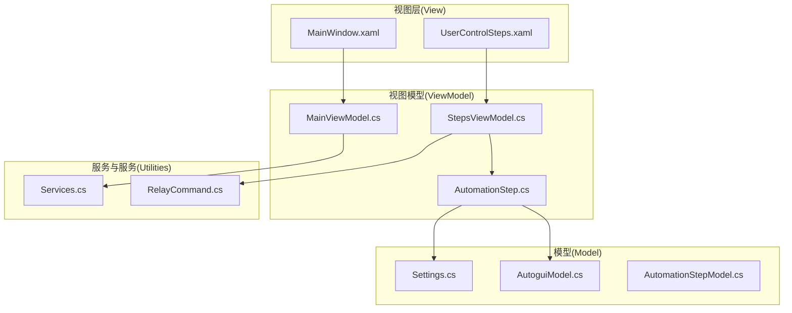
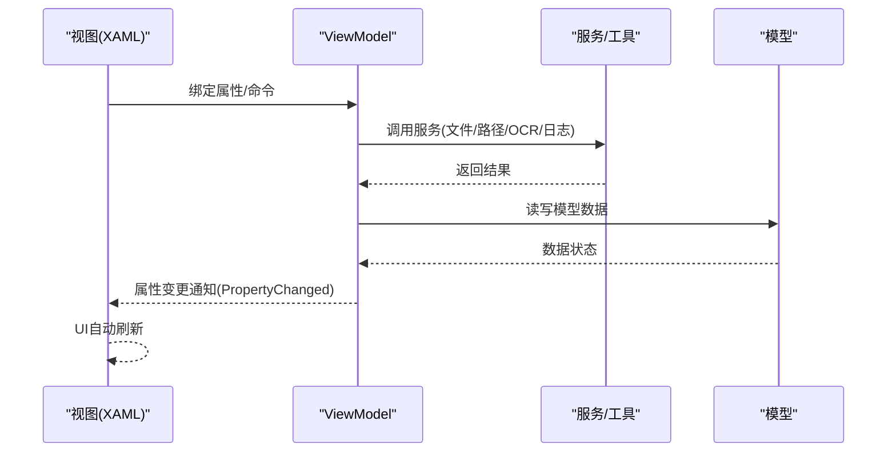
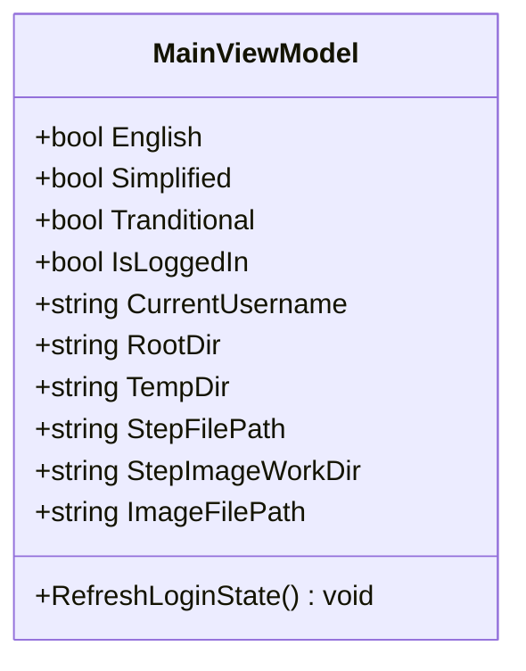
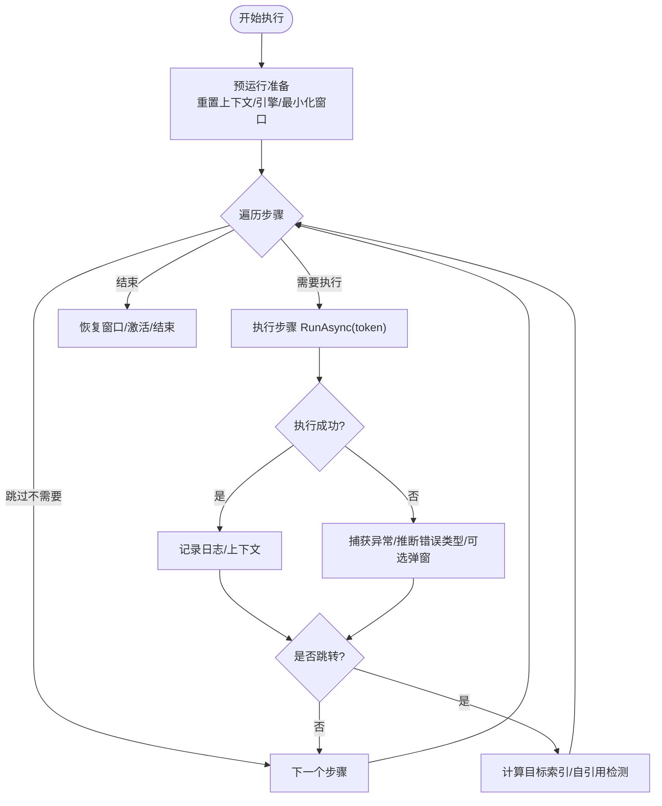
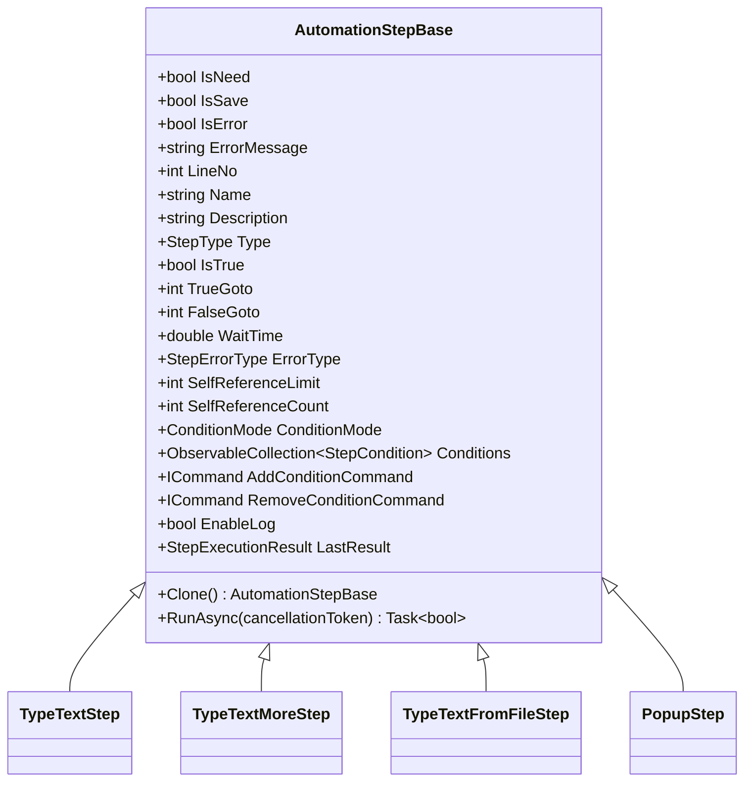
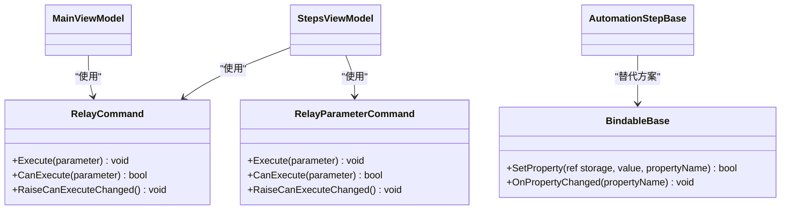
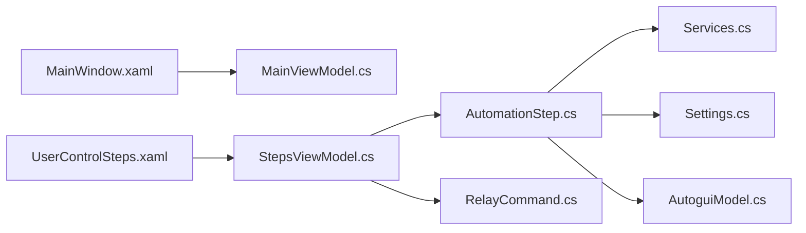

# MVVM 架构模式

<cite>
**本文引用的文件**   
- [MainViewModel.cs](file://ShaoLu/Viewmodels/MainViewModel.cs)
- [StepsViewModel.cs](file://ShaoLu/Viewmodels/StepsViewModel.cs)
- [AutomationStep.cs](file://ShaoLu/Viewmodels/AutomationStep.cs)
- [RelayCommand.cs](file://ShaoLu/Utils/RelayCommand.cs)
- [BindableBase.cs](file://ShaoLu/Tools/ImageEdit/ViewModels/BindableBase.cs)
- [MainWindow.xaml](file://ShaoLu/MainWindow.xaml)
- [App.xaml](file://ShaoLu/App.xaml)
- [Settings.cs](file://ShaoLu/Models/Settings.cs)
- [AutoguiModel.cs](file://ShaoLu/Models/AutoguiModel.cs)
- [Services.cs](file://ShaoLu/Services/Services.cs)
</cite>

## 目录
1. [简介](#简介)
2. [项目结构](#项目结构)
3. [核心组件](#核心组件)
4. [架构总览](#架构总览)
5. [详细组件分析](#详细组件分析)
6. [依赖关系分析](#依赖关系分析)
7. [性能考虑](#性能考虑)
8. [故障排查指南](#故障排查指南)
9. [结论](#结论)
10. [附录](#附录)

## 简介
本文件面向 ShaoLu 项目的 MVVM（Model-View-ViewModel）架构，系统阐述三层职责与协作方式：
- Model 层：数据模型与领域对象定义，如步骤类型、错误类型、配置项、坐标与矩形等。
- View 层：XAML 界面与绑定声明，通过 DataContext 与 ViewModel 解耦。
- ViewModel 层：业务逻辑、命令与属性变更通知，驱动 UI 更新与用户交互。

重点说明数据绑定的工作机制（双向绑定、命令绑定、属性变更通知），ObservableObject 基类的使用，PropertyChanging/PropertyChanged 事件处理，以及 View 与 ViewModel 的解耦设计。结合 MainViewModel 与 StepsViewModel 的具体实现，展示自定义属性与命令的实践。

## 项目结构
ShaoLu 采用按功能域划分的目录组织：
- Models：数据模型与配置（步骤类型、错误类型、设置、用户、几何对象等）。
- Viewmodels：MVVM 中的 ViewModel 层（主视图模型、步骤管理、各类自动化步骤的 ViewModel）。
- Views：WPF 窗口与用户控件（XAML + code-behind）。
- Services：服务层（路径、文件、OCR、执行日志、语言、条件评估等）。
- Utils：通用工具（命令实现、单例定位器等）。
- Converters/Templates/Themes：UI 转换、模板与主题资源。

图表来源
- [MainWindow.xaml:1-49](file://ShaoLu/MainWindow.xaml#L1-L49)
- [App.xaml:1-36](file://ShaoLu/App.xaml#L1-L36)
- [MainViewModel.cs:1-76](file://ShaoLu/Viewmodels/MainViewModel.cs#L1-L76)
- [StepsViewModel.cs:1-588](file://ShaoLu/Viewmodels/StepsViewModel.cs#L1-L588)
- [AutomationStep.cs:1-849](file://ShaoLu/Viewmodels/AutomationStep.cs#L1-L849)
- [Settings.cs:1-76](file://ShaoLu/Models/Settings.cs#L1-L76)
- [AutoguiModel.cs:1-145](file://ShaoLu/Models/AutoguiModel.cs#L1-L145)
- [Services.cs:1-179](file://ShaoLu/Services/Services.cs#L1-L179)
- [RelayCommand.cs:1-113](file://ShaoLu/Utils/RelayCommand.cs#L1-L113)

章节来源
- [MainWindow.xaml:1-49](file://ShaoLu/MainWindow.xaml#L1-L49)
- [App.xaml:1-36](file://ShaoLu/App.xaml#L1-L36)

## 核心组件
- MainViewModel：应用级状态与全局信息（登录状态、当前用户名、路径信息等），使用 CommunityToolkit.Mvvm 的 ObservableObject 提供属性变更通知。
- StepsViewModel：步骤集合管理与执行流程控制，包含运行/停止、增删改查、复制粘贴、跳转与自引用限制等逻辑；大量使用 RelayCommand/RelayParameterCommand 进行命令绑定。
- AutomationStepBase 及派生步骤：封装各类型自动化步骤的属性与执行逻辑（文本输入、文件读取、弹窗等），统一继承 ObservableObject 并实现 RunAsync。
- RelayCommand/RelayParameterCommand：通用的 ICommand 实现，支持 CanExecute 判断与线程安全的 CanExecuteChanged 触发。
- BindableBase：轻量化的 INotifyPropertyChanged 基类，用于非 Toolkit 场景下的属性变更通知。

章节来源
- [MainViewModel.cs:1-76](file://ShaoLu/Viewmodels/MainViewModel.cs#L1-L76)
- [StepsViewModel.cs:1-588](file://ShaoLu/Viewmodels/StepsViewModel.cs#L1-L588)
- [AutomationStep.cs:1-849](file://ShaoLu/Viewmodels/AutomationStep.cs#L1-L849)
- [RelayCommand.cs:1-113](file://ShaoLu/Utils/RelayCommand.cs#L1-L113)
- [BindableBase.cs:1-25](file://ShaoLu/Tools/ImageEdit/ViewModels/BindableBase.cs#L1-L25)

## 架构总览
MVVM 在 ShaoLu 中的职责划分与数据流如下：
- View（XAML）通过 DataContext 绑定到 ViewModel 的属性与命令，无需直接访问后台代码。
- ViewModel 暴露可绑定属性与命令，内部调用 Service/Utility 完成业务逻辑，并通过属性变更通知驱动 UI 更新。
- Model 仅承载数据与领域规则，不包含 UI 或框架相关逻辑。

图表来源
- [MainViewModel.cs:1-76](file://ShaoLu/Viewmodels/MainViewModel.cs#L1-L76)
- [StepsViewModel.cs:1-588](file://ShaoLu/Viewmodels/StepsViewModel.cs#L1-L588)
- [AutomationStep.cs:1-849](file://ShaoLu/Viewmodels/AutomationStep.cs#L1-L849)
- [Services.cs:1-179](file://ShaoLu/Services/Services.cs#L1-L179)

## 详细组件分析

### MainViewModel 分析
- 职责：维护应用级状态（是否已登录、当前用户名、根目录、临时目录、步骤文件路径、图片工作目录等），并提供刷新登录状态的方法。
- 属性变更：使用 CommunityToolkit.Mvvm 的 SetProperty 方法，自动生成 PropertyChanged 事件，确保 XAML 绑定自动更新。
- 与 View 的解耦：MainWindow 菜单项通过 IsEnabled="{Binding IsLoggedIn}" 等绑定控制可用性，避免在 code-behind 中写 UI 逻辑。

图表来源
- [MainViewModel.cs:1-76](file://ShaoLu/Viewmodels/MainViewModel.cs#L1-L76)

章节来源
- [MainViewModel.cs:1-76](file://ShaoLu/Viewmodels/MainViewModel.cs#L1-L76)
- [MainWindow.xaml:24-41](file://ShaoLu/MainWindow.xaml#L24-L41)

### StepsViewModel 分析
- 职责：管理步骤集合（AutomationStepBases）、选中步骤、错误步骤、运行状态、命令集合（Run/Stop/Add/Del/Up/Down/Copy/Cut/Paste/Select）。
- 执行流程：PreRun 初始化上下文与引擎，Run 异步遍历步骤，记录结果、处理异常、支持跳转与自引用限制，支持取消令牌与停止信号。
- 属性变更与命令：IsRunning 变化时批量触发命令的 CanExecute 重新计算；AddStep 根据参数动态创建不同步骤类型并应用默认设置。
- 与 View 的解耦：XAML 通过 ObservableCollection 与命令绑定实现 UI 列表与按钮状态的自动同步。

图表来源
- [StepsViewModel.cs:375-565](file://ShaoLu/Viewmodels/StepsViewModel.cs#L375-L565)

章节来源
- [StepsViewModel.cs:1-588](file://ShaoLu/Viewmodels/StepsViewModel.cs#L1-L588)

### AutomationStepBase 与具体步骤
- 基类：AutomationStepBase 继承 ObservableObject，提供通用属性（名称、描述、类型、行号、等待时间、错误类型、条件、日志开关、执行结果等），并定义抽象 Clone 与 RunAsync。
- 具体步骤：TypeTextStep、TypeTextMoreStep、TypeTextFromFileStep、PopupStep 等，各自实现 RunAsync 与克隆逻辑，部分步骤内嵌命令（如 OpenFile、AddContent、DelContent、ResetIndex）。
- 属性变更：所有属性均通过 SetProperty 触发 PropertyChanged，保证 XAML 绑定实时更新。

图表来源
- [AutomationStep.cs:25-205](file://ShaoLu/Viewmodels/AutomationStep.cs#L25-L205)
- [AutomationStep.cs:209-279](file://ShaoLu/Viewmodels/AutomationStep.cs#L209-L279)
- [AutomationStep.cs:281-435](file://ShaoLu/Viewmodels/AutomationStep.cs#L281-L435)
- [AutomationStep.cs:437-602](file://ShaoLu/Viewmodels/AutomationStep.cs#L437-L602)
- [AutomationStep.cs:606-800](file://ShaoLu/Viewmodels/AutomationStep.cs#L606-L800)

章节来源
- [AutomationStep.cs:1-849](file://ShaoLu/Viewmodels/AutomationStep.cs#L1-L849)

### 命令与属性变更通知机制
- RelayCommand/RelayParameterCommand：封装 execute 与 canExecute 委托，支持参数传递与线程安全的 CanExecuteChanged 触发（在 WPF 要求下确保 UI 线程更新）。
- BindableBase：提供 SetProperty 与 OnPropertyChanged 的基础实现，适用于未使用 CommunityToolkit 的场景。
- CommunityToolkit.Mvvm：MainViewModel 与 AutomationStepBase 使用其生成的 SetProperty 与 [RelayCommand] 特性，简化样板代码。

图表来源
- [RelayCommand.cs:1-113](file://ShaoLu/Utils/RelayCommand.cs#L1-L113)
- [BindableBase.cs:1-25](file://ShaoLu/Tools/ImageEdit/ViewModels/BindableBase.cs#L1-L25)

章节来源
- [RelayCommand.cs:1-113](file://ShaoLu/Utils/RelayCommand.cs#L1-L113)
- [BindableBase.cs:1-25](file://ShaoLu/Tools/ImageEdit/ViewModels/BindableBase.cs#L1-L25)

### 数据绑定与 UI 自动更新
- 双向绑定：XAML 中使用 IsChecked="{Binding English/Simplified/Tranditional}" 等绑定，用户操作直接更新 ViewModel 属性。
- 命令绑定：菜单项 Click 事件可通过 Command 绑定到 ViewModel 的命令，或通过 IsEnabled="{Binding IsLoggedIn}" 控制可用性。
- 属性变更通知：ViewModel 属性通过 SetProperty 触发 PropertyChanged，XAML 自动刷新显示。

章节来源
- [MainWindow.xaml:24-41](file://ShaoLu/MainWindow.xaml#L24-L41)
- [MainViewModel.cs:1-76](file://ShaoLu/Viewmodels/MainViewModel.cs#L1-L76)

### 模型与配置
- Settings：应用与步骤的配置项（主题、窗口尺寸、字体、日志保留天数、相似度阈值、超时、点击次数、热键等）。
- AutoguiModel：Point 与 AutoRect 几何对象，支持多坐标系隐式转换与相似性得分。
- AutomationStepModel：步骤类型与错误类型枚举，供 ViewModel 与 UI 显示使用。

章节来源
- [Settings.cs:1-76](file://ShaoLu/Models/Settings.cs#L1-L76)
- [AutoguiModel.cs:1-145](file://ShaoLu/Models/AutoguiModel.cs#L1-L145)
- [AutomationStepModel.cs:1-47](file://ShaoLu/Models/AutomationStepModel.cs#L1-L47)

## 依赖关系分析
- View 依赖 ViewModel：MainWindow 与 UserControlSteps 通过 DataContext 绑定到 MainViewModel 与 StepsViewModel。
- ViewModel 依赖 Service/Utility：StepsViewModel 调用 Autogui、WindowAsyncPopup、LanguageService、ExecutionLogService 等；AutomationStep 使用 FileServices、PathServices。
- ViewModel 依赖 Model：步骤执行结果、配置项、几何对象均来自 Model 层。

图表来源
- [MainWindow.xaml:1-49](file://ShaoLu/MainWindow.xaml#L1-L49)
- [MainViewModel.cs:1-76](file://ShaoLu/Viewmodels/MainViewModel.cs#L1-L76)
- [StepsViewModel.cs:1-588](file://ShaoLu/Viewmodels/StepsViewModel.cs#L1-L588)
- [AutomationStep.cs:1-849](file://ShaoLu/Viewmodels/AutomationStep.cs#L1-L849)
- [Services.cs:1-179](file://ShaoLu/Services/Services.cs#L1-L179)
- [RelayCommand.cs:1-113](file://ShaoLu/Utils/RelayCommand.cs#L1-L113)
- [Settings.cs:1-76](file://ShaoLu/Models/Settings.cs#L1-L76)
- [AutoguiModel.cs:1-145](file://ShaoLu/Models/AutoguiModel.cs#L1-L145)

章节来源
- [MainWindow.xaml:1-49](file://ShaoLu/MainWindow.xaml#L1-L49)
- [StepsViewModel.cs:1-588](file://ShaoLu/Viewmodels/StepsViewModel.cs#L1-L588)
- [AutomationStep.cs:1-849](file://ShaoLu/Viewmodels/AutomationStep.cs#L1-L849)

## 性能考虑
- 异步执行：StepsViewModel.Run 使用 async/await 与 CancellationToken，避免阻塞 UI 线程，支持取消与停止。
- 集合变更优化：AutomationStepBases 使用 ObservableCollection，仅在必要时触发集合变更通知；UpdateAutomationStepBases 批量更新行号。
- 命令 CanExecute：在关键属性（如 IsRunning）变化时批量触发 RaiseCanExecuteChanged，减少不必要的 UI 重绘。
- 日志与 I/O：执行日志与文件读取通过服务层集中处理，避免在 ViewModel 中重复实现。

[本节为通用指导，不直接分析具体文件]

## 故障排查指南
- 步骤执行失败：检查 StepErrorType 与 ErrorMessage，确认异常类型映射是否正确（如 FileNotFoundException、TimeoutException）。
- 自引用限制：当步骤跳转到自身超过 SelfReferenceLimit 时，标记错误并继续下一步，避免死循环。
- 弹窗取消：PopupStep 支持取消令牌，若用户点击停止则关闭弹窗并返回 false。
- 文件读取失败：FileServices.SmartReadTextFile 对编码进行检测，失败时抛出异常，需检查文件内容与编码。

章节来源
- [StepsViewModel.cs:487-512](file://ShaoLu/Viewmodels/StepsViewModel.cs#L487-L512)
- [StepsViewModel.cs:522-545](file://ShaoLu/Viewmodels/StepsViewModel.cs#L522-L545)
- [AutomationStep.cs:693-752](file://ShaoLu/Viewmodels/AutomationStep.cs#L693-L752)
- [Services.cs:142-175](file://ShaoLu/Services/Services.cs#L142-L175)

## 结论
ShaoLu 的 MVVM 架构清晰分离了 View、ViewModel 与 Model 的职责，通过属性变更通知与命令绑定实现了 UI 与业务逻辑的解耦。CommunityToolkit.Mvvm 与 RelayCommand 的组合简化了样板代码，提升了可维护性与可读性。StepsViewModel 的异步执行流程与错误处理机制确保了应用的健壮性。建议在实际开发中继续遵循此模式，保持各层职责单一，提升整体架构的可扩展性与稳定性。

[本节为总结，不直接分析具体文件]

## 附录
- 数据绑定最佳实践：优先使用 CommunityToolkit.Mvvm 的 SetProperty 与 [RelayCommand] 特性，减少手动事件处理。
- 命令设计：将复杂逻辑封装在 ViewModel 的命令方法中，保持 XAML 简洁。
- 模型设计：Model 层保持纯数据与领域规则，避免耦合 UI 或框架细节。
- 服务层：将 I/O、网络、OCR 等外部依赖集中在服务层，便于测试与替换。

[本节为补充内容，不直接分析具体文件]