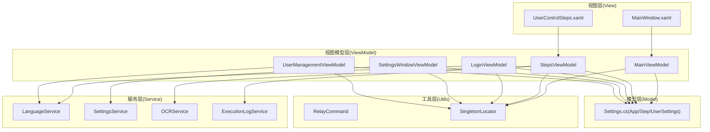
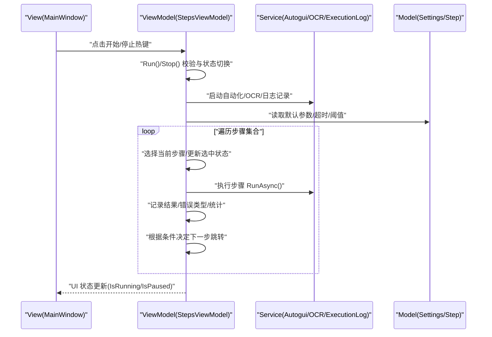
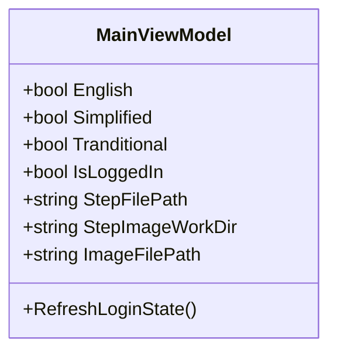
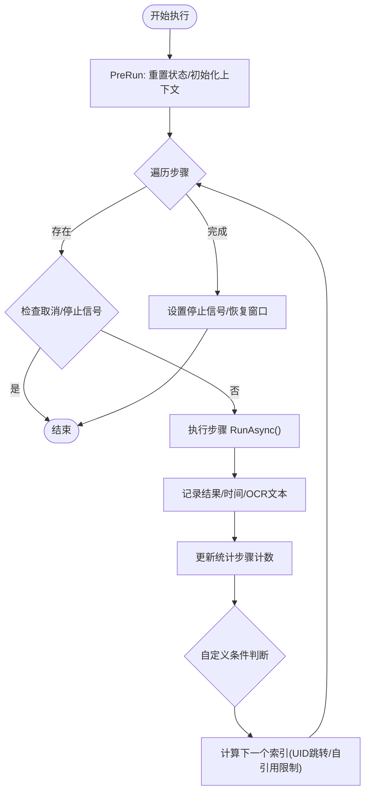
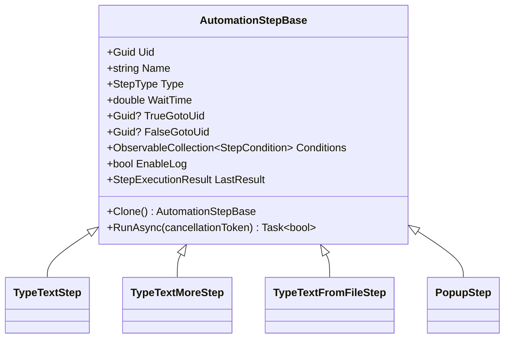
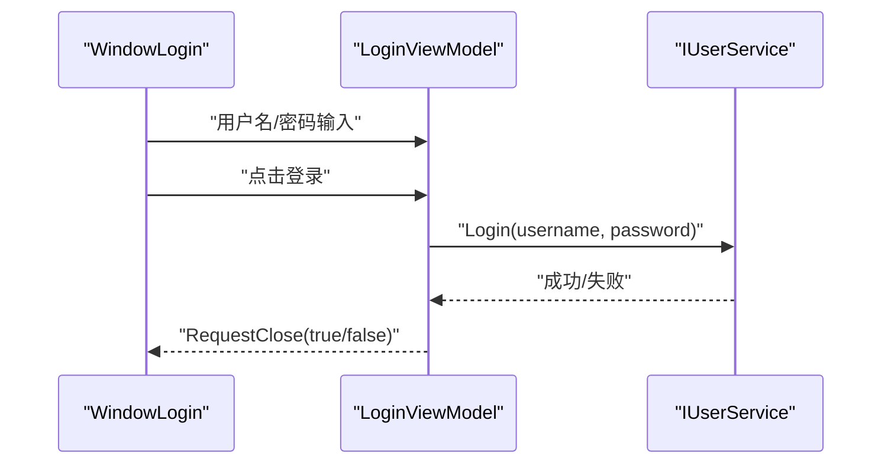
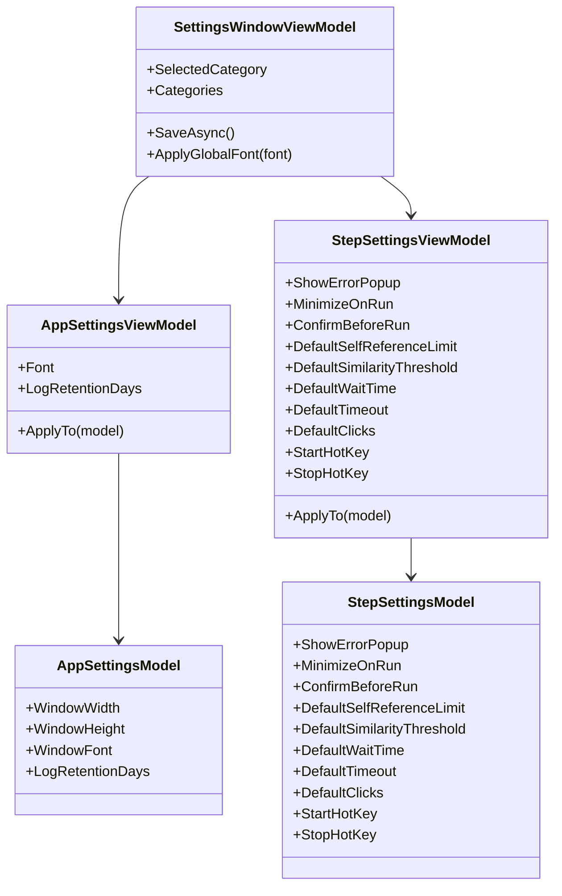
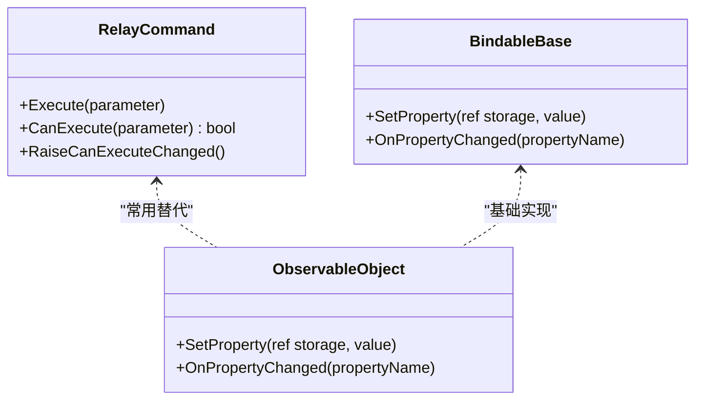
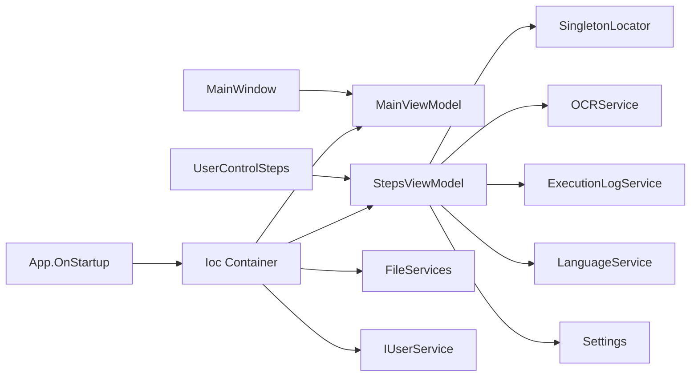

# MVVM 模式实现

<cite>
**本文引用的文件**   
- [App.xaml.cs](file://ShaoLu/App.xaml.cs)
- [MainWindow.xaml.cs](file://ShaoLu/MainWindow.xaml.cs)
- [MainWindow.xaml](file://ShaoLu/MainWindow.xaml)
- [MainViewModel.cs](file://ShaoLu/Viewmodels/MainViewModel.cs)
- [StepsViewModel.cs](file://ShaoLu/Viewmodels/StepsViewModel.cs)
- [AutomationStep.cs](file://ShaoLu/Viewmodels/AutomationStep.cs)
- [LoginViewModel.cs](file://ShaoLu/Viewmodels/LoginViewModel.cs)
- [SettingsViewModel.cs](file://ShaoLu/Viewmodels/SettingsViewModel.cs)
- [UserManagementViewModel.cs](file://ShaoLu/Viewmodels/UserManagementViewModel.cs)
- [RelayCommand.cs](file://ShaoLu/Utils/RelayCommand.cs)
- [BindableBase.cs](file://ShaoLu/Tools/ImageEdit/ViewModels/BindableBase.cs)
- [SingletonLocator.cs](file://ShaoLu/Utils/SingletonLocator.cs)
- [Settings.cs](file://ShaoLu/Models/Settings.cs)
</cite>

## 目录
1. [简介](#简介)
2. [项目结构](#项目结构)
3. [核心组件](#核心组件)
4. [架构总览](#架构总览)
5. [详细组件分析](#详细组件分析)
6. [依赖关系分析](#依赖关系分析)
7. [性能考虑](#性能考虑)
8. [故障排查指南](#故障排查指南)
9. [结论](#结论)
10. [附录：数据绑定与命令示例路径](#附录数据绑定与命令示例路径)

## 简介
本文件为 ShaoLu 应用的 MVVM（Model-View-ViewModel）模式实现提供系统化、可操作的文档。内容涵盖三层架构设计原理、数据绑定机制、命令模式使用、属性变更通知的实现方式，以及 ViewModel 与 View 的交互流程。同时给出 WPF 中 MVVM 的最佳实践与性能优化建议，帮助读者快速理解并扩展该项目的 MVVM 实现。

## 项目结构
ShaoLu 采用典型的 WPF 分层组织：
- Model：业务数据模型与配置（如 Settings 相关类）。
- View：WPF 窗口与用户控件（XAML + code-behind），负责展示与用户交互。
- ViewModel：承载 UI 状态与行为，通过属性与命令暴露给 View 进行双向绑定。
- Services：业务逻辑与外部能力封装（OCR、日志、语言、设置等）。
- Utils：通用工具（命令、定位器、辅助方法）。

图表来源
- [MainWindow.xaml:1-50](file://ShaoLu/MainWindow.xaml#L1-L50)
- [MainViewModel.cs:1-76](file://ShaoLu/Viewmodels/MainViewModel.cs#L1-L76)
- [StepsViewModel.cs:1-747](file://ShaoLu/Viewmodels/StepsViewModel.cs#L1-L747)
- [LoginViewModel.cs:1-251](file://ShaoLu/Viewmodels/LoginViewModel.cs#L1-L251)
- [SettingsViewModel.cs:1-260](file://ShaoLu/Viewmodels/SettingsViewModel.cs#L1-L260)
- [UserManagementViewModel.cs:1-194](file://ShaoLu/Viewmodels/UserManagementViewModel.cs#L1-L194)
- [Settings.cs:1-117](file://ShaoLu/Models/Settings.cs#L1-L117)
- [RelayCommand.cs:1-113](file://ShaoLu/Utils/RelayCommand.cs#L1-L113)
- [SingletonLocator.cs:1-19](file://ShaoLu/Utils/SingletonLocator.cs#L1-L19)

章节来源
- [App.xaml.cs:19-91](file://ShaoLu/App.xaml.cs#L19-L91)
- [MainWindow.xaml:1-50](file://ShaoLu/MainWindow.xaml#L1-L50)

## 核心组件
- MainViewModel：主界面状态（登录态、当前语言、文件路径等），通过属性变更通知驱动 UI 更新。
- StepsViewModel：步骤集合与执行控制（运行、停止、暂停、增删改查、复制粘贴、条件跳转等），集中管理自动化流程。
- AutomationStepBase 及派生类：每个“步骤”即一个 ViewModel，具备属性、命令、异步执行逻辑与结果记录。
- LoginViewModel / UserManagementViewModel / SettingsWindowViewModel：各自负责登录、用户管理、设置窗口的状态与交互。
- RelayCommand：通用的 ICommand 实现，支持 CanExecute 与线程安全的 RaiseCanExecuteChanged。
- BindableBase：INotifyPropertyChanged 的基础实现，提供 SetProperty 与 OnPropertyChanged 便捷方法。
- SingletonLocator：基于 Ioc 容器的单例定位器，统一获取 MainViewModel、StepsViewModel、UserService、Settings 等。

章节来源
- [MainViewModel.cs:1-76](file://ShaoLu/Viewmodels/MainViewModel.cs#L1-L76)
- [StepsViewModel.cs:1-747](file://ShaoLu/Viewmodels/StepsViewModel.cs#L1-L747)
- [AutomationStep.cs:1-800](file://ShaoLu/Viewmodels/AutomationStep.cs#L1-L800)
- [LoginViewModel.cs:1-251](file://ShaoLu/Viewmodels/LoginViewModel.cs#L1-L251)
- [SettingsViewModel.cs:1-260](file://ShaoLu/Viewmodels/SettingsViewModel.cs#L1-L260)
- [UserManagementViewModel.cs:1-194](file://ShaoLu/Viewmodels/UserManagementViewModel.cs#L1-L194)
- [RelayCommand.cs:1-113](file://ShaoLu/Utils/RelayCommand.cs#L1-L113)
- [BindableBase.cs:1-25](file://ShaoLu/Tools/ImageEdit/ViewModels/BindableBase.cs#L1-L25)
- [SingletonLocator.cs:1-19](file://ShaoLu/Utils/SingletonLocator.cs#L1-L19)

## 架构总览
MVVM 在 ShaoLu 中的职责划分清晰：
- View（XAML）仅负责展示与事件转发，不持有业务逻辑。
- ViewModel 暴露属性与命令，处理用户输入、调用 Service、维护 UI 状态。
- Model 表示持久化或领域数据（如设置项、用户信息）。
- Service 封装外部能力（OCR、日志、语言、设置读写）。
- Ioc 容器与 SingletonLocator 提供统一的依赖解析与访问入口。

图表来源
- [MainWindow.xaml.cs:34-76](file://ShaoLu/MainWindow.xaml.cs#L34-L76)
- [StepsViewModel.cs:493-694](file://ShaoLu/Viewmodels/StepsViewModel.cs#L493-L694)
- [AutomationStep.cs:288-295](file://ShaoLu/Viewmodels/AutomationStep.cs#L288-L295)
- [Settings.cs:33-100](file://ShaoLu/Models/Settings.cs#L33-L100)

## 详细组件分析

### MainViewModel 分析
- 职责：维护主界面语言选择、登录状态、当前文件路径与工作目录等。
- 属性变更：使用 CommunityToolkit.Mvvm 的 ObservableObject 提供的 SetProperty 触发 PropertyChanged。
- 登录刷新：RefreshLoginState 更新 IsLoggedIn 并通知 CurrentUsername 变化。

图表来源
- [MainViewModel.cs:1-76](file://ShaoLu/Viewmodels/MainViewModel.cs#L1-L76)

章节来源
- [MainViewModel.cs:1-76](file://ShaoLu/Viewmodels/MainViewModel.cs#L1-L76)

### StepsViewModel 分析
- 职责：管理步骤集合、执行流程、暂停/停止、复制/粘贴、删除保护、条件跳转、自引用限制、统计与日志。
- 属性变更：IsRunning 变化时批量触发多个命令的 CanExecute 更新。
- 命令封装：RunCommand、StopCommand、PauseCommand、AddStepCommand、DelStepCommand、UpStepCommand、DownStepCommand、SelectStepCommand、CopyStepCommand、CutStepCommand、PasteStepCommand。
- 执行流程：Run() 异步执行每个步骤，捕获异常并分类错误类型，支持取消令牌与暂停等待。

图表来源
- [StepsViewModel.cs:493-694](file://ShaoLu/Viewmodels/StepsViewModel.cs#L493-L694)
- [StepsViewModel.cs:130-156](file://ShaoLu/Viewmodels/StepsViewModel.cs#L130-L156)
- [StepsViewModel.cs:79-128](file://ShaoLu/Viewmodels/StepsViewModel.cs#L79-L128)

章节来源
- [StepsViewModel.cs:1-747](file://ShaoLu/Viewmodels/StepsViewModel.cs#L1-L747)

### AutomationStepBase 与具体步骤
- 基类：AutomationStepBase 继承 ObservableObject，定义通用属性（Uid、Name、Type、WaitTime、TrueGotoUid、FalseGotoUid、Conditions、EnableLog、LastResult 等）与抽象方法 Clone()、RunAsync()。
- 派生步骤：TypeTextStep、TypeTextMoreStep、TypeTextFromFileStep、PopupStep 等，各自实现 RunAsync 与克隆逻辑。
- 条件与跳转：支持自定义条件列表与 UID 跳转；运行时根据 IsTrue 决定 TrueGotoUid 或 FalseGotoUid。

图表来源
- [AutomationStep.cs:25-295](file://ShaoLu/Viewmodels/AutomationStep.cs#L25-L295)
- [AutomationStep.cs:300-365](file://ShaoLu/Viewmodels/AutomationStep.cs#L300-L365)
- [AutomationStep.cs:367-516](file://ShaoLu/Viewmodels/AutomationStep.cs#L367-L516)
- [AutomationStep.cs:518-680](file://ShaoLu/Viewmodels/AutomationStep.cs#L518-L680)
- [AutomationStep.cs:684-800](file://ShaoLu/Viewmodels/AutomationStep.cs#L684-L800)

章节来源
- [AutomationStep.cs:1-800](file://ShaoLu/Viewmodels/AutomationStep.cs#L1-L800)

### LoginViewModel 与用户管理
- LoginViewModel：处理登录/注册表单、密码校验、管理员审批、关闭请求事件。
- UserManagementViewModel：用户列表、添加/删除/修改密码、状态消息提示。

图表来源
- [LoginViewModel.cs:49-75](file://ShaoLu/Viewmodels/LoginViewModel.cs#L49-L75)
- [LoginViewModel.cs:1-251](file://ShaoLu/Viewmodels/LoginViewModel.cs#L1-L251)

章节来源
- [LoginViewModel.cs:1-251](file://ShaoLu/Viewmodels/LoginViewModel.cs#L1-L251)
- [UserManagementViewModel.cs:1-194](file://ShaoLu/Viewmodels/UserManagementViewModel.cs#L1-L194)

### SettingsViewModel 与设置模型
- SettingsWindowViewModel：构建设置树（App/Step）、保存回写模型、应用全局字体。
- AppSettingsViewModel / StepSettingsViewModel：分别映射 AppSettingsModel 与 StepSettingsModel 的属性。

图表来源
- [SettingsViewModel.cs:1-260](file://ShaoLu/Viewmodels/SettingsViewModel.cs#L1-L260)
- [Settings.cs:1-117](file://ShaoLu/Models/Settings.cs#L1-L117)

章节来源
- [SettingsViewModel.cs:1-260](file://ShaoLu/Viewmodels/SettingsViewModel.cs#L1-L260)
- [Settings.cs:1-117](file://ShaoLu/Models/Settings.cs#L1-L117)

### 命令模式与属性变更通知
- RelayCommand：提供无参/有参版本与线程安全的 RaiseCanExecuteChanged，确保 UI 按钮状态正确。
- BindableBase：实现 INotifyPropertyChanged，简化属性变更通知。
- CommunityToolkit.Mvvm：ObservableObject 与 [RelayCommand] 特性广泛用于 ViewModel 属性与命令声明。

图表来源
- [RelayCommand.cs:1-113](file://ShaoLu/Utils/RelayCommand.cs#L1-L113)
- [BindableBase.cs:1-25](file://ShaoLu/Tools/ImageEdit/ViewModels/BindableBase.cs#L1-L25)

章节来源
- [RelayCommand.cs:1-113](file://ShaoLu/Utils/RelayCommand.cs#L1-L113)
- [BindableBase.cs:1-25](file://ShaoLu/Tools/ImageEdit/ViewModels/BindableBase.cs#L1-L25)

## 依赖关系分析
- 启动阶段：App.OnStartup 配置 Ioc 容器，注册 MainViewModel、StepsViewModel、FileServices、UserService 等，并显示 MainWindow。
- 视图与 ViewModel：MainWindow 通过 DataContext 绑定 MainViewModel；UserControlSteps 绑定 StepsViewModel。
- 依赖定位：SingletonLocator 通过 Ioc.Default 获取 MainViewModel、StepsViewModel、UserService、Settings。
- 服务依赖：StepsViewModel 依赖 Autogui、OCRService、ExecutionLogService、LanguageService、Settings。

图表来源
- [App.xaml.cs:19-91](file://ShaoLu/App.xaml.cs#L19-L91)
- [SingletonLocator.cs:1-19](file://ShaoLu/Utils/SingletonLocator.cs#L1-L19)
- [MainWindow.xaml.cs:24-86](file://ShaoLu/MainWindow.xaml.cs#L24-L86)

章节来源
- [App.xaml.cs:19-91](file://ShaoLu/App.xaml.cs#L19-L91)
- [SingletonLocator.cs:1-19](file://ShaoLu/Utils/SingletonLocator.cs#L1-L19)
- [MainWindow.xaml.cs:24-86](file://ShaoLu/MainWindow.xaml.cs#L24-L86)

## 性能考虑
- 属性变更通知优化：使用 SetProperty 避免重复赋值与无效通知；对频繁更新的集合（如步骤集合）谨慎使用全量替换，优先增量操作。
- 命令 CanExecute 批量更新：在 IsRunning 变化时一次性触发多个命令的 CanExecute 更新，减少 UI 重绘次数。
- 异步执行与取消令牌：RunAsync 使用 CancellationTokenSource，避免阻塞 UI 线程，提升响应性。
- 资源释放：在 App.OnExit 中释放图像识别资源与待提交删除的文件，防止内存泄漏。
- 字体与应用范围：保存设置后通过 ApplyGlobalFont 一次性更新所有窗口字体，降低重复样式计算。

[本节为通用指导，无需特定文件来源]

## 故障排查指南
- 未处理异常兜底：App.OnStartup 订阅 DispatcherUnhandledException、AppDomain.UnhandledException、TaskScheduler.UnobservedTaskException，统一记录日志并提示用户。
- 步骤执行异常分类：InferErrorType 将常见异常映射到错误类型（文件不存在、超时、索引越界等），便于 UI 展示与后续处理。
- 弹窗确认与取消：Run() 支持运行前确认与用户取消，避免误操作导致长时间任务。
- 热键冲突与清理：MainWindow 在 OnClosed 中注销热键并移除 Hook，防止资源泄漏。

章节来源
- [App.xaml.cs:27-43](file://ShaoLu/App.xaml.cs#L27-L43)
- [StepsViewModel.cs:699-710](file://ShaoLu/Viewmodels/StepsViewModel.cs#L699-L710)
- [MainWindow.xaml.cs:87-100](file://ShaoLu/MainWindow.xaml.cs#L87-L100)

## 结论
ShaoLu 的 MVVM 实现遵循清晰的职责分离与良好的解耦原则：
- View 保持简洁，仅做展示与事件转发。
- ViewModel 通过属性与命令暴露状态与行为，使用 CommunityToolkit.Mvvm 简化属性变更与命令实现。
- Model 与 Service 封装领域逻辑与外部能力，保证 ViewModel 的纯粹性。
- Ioc 与 SingletonLocator 提供统一的依赖管理与访问入口，便于测试与维护。
结合异步执行、取消令牌、批量 CanExecute 更新与资源释放策略，整体具备良好的性能与可维护性。

[本节为总结性内容，无需特定文件来源]

## 附录：数据绑定与命令示例路径
- XAML 数据绑定示例（菜单项启用状态与语言选择）：
  - [MainWindow.xaml:24-46](file://ShaoLu/MainWindow.xaml#L24-L46)
- ViewModel 属性变更通知（CommunityToolkit.Mvvm SetProperty）：
  - [MainViewModel.cs:19-22](file://ShaoLu/Viewmodels/MainViewModel.cs#L19-L22)
  - [StepsViewModel.cs:30-56](file://ShaoLu/Viewmodels/StepsViewModel.cs#L30-L56)
  - [LoginViewModel.cs:12-24](file://ShaoLu/Viewmodels/LoginViewModel.cs#L12-L24)
- 命令封装与使用（RelayCommand 与 [RelayCommand] 特性）：
  - [RelayCommand.cs:7-49](file://ShaoLu/Utils/RelayCommand.cs#L7-L49)
  - [StepsViewModel.cs:80-128](file://ShaoLu/Viewmodels/StepsViewModel.cs#L80-L128)
  - [AutomationStep.cs:595-621](file://ShaoLu/Viewmodels/AutomationStep.cs#L595-L621)
- 属性变更通知基础实现（INotifyPropertyChanged）：
  - [BindableBase.cs:7-22](file://ShaoLu/Tools/ImageEdit/ViewModels/BindableBase.cs#L7-L22)

章节来源
- [MainWindow.xaml:24-46](file://ShaoLu/MainWindow.xaml#L24-L46)
- [MainViewModel.cs:19-22](file://ShaoLu/Viewmodels/MainViewModel.cs#L19-L22)
- [StepsViewModel.cs:80-128](file://ShaoLu/Viewmodels/StepsViewModel.cs#L80-L128)
- [LoginViewModel.cs:12-24](file://ShaoLu/Viewmodels/LoginViewModel.cs#L12-L24)
- [RelayCommand.cs:7-49](file://ShaoLu/Utils/RelayCommand.cs#L7-L49)
- [AutomationStep.cs:595-621](file://ShaoLu/Viewmodels/AutomationStep.cs#L595-L621)
- [BindableBase.cs:7-22](file://ShaoLu/Tools/ImageEdit/ViewModels/BindableBase.cs#L7-L22)