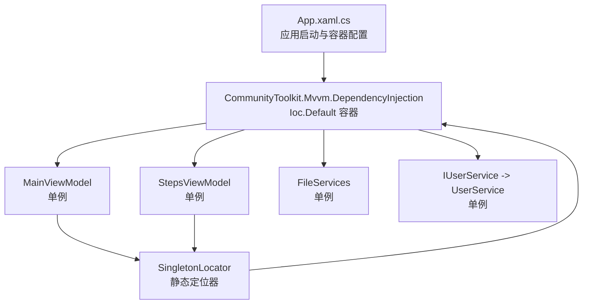
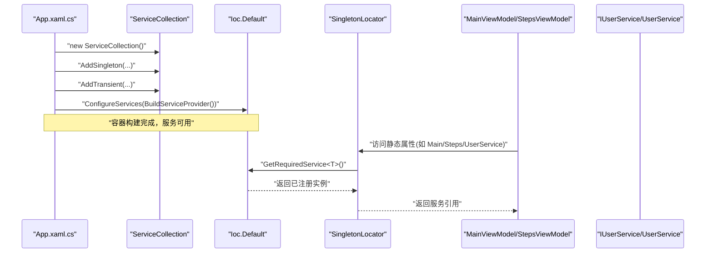
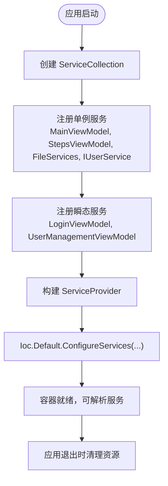
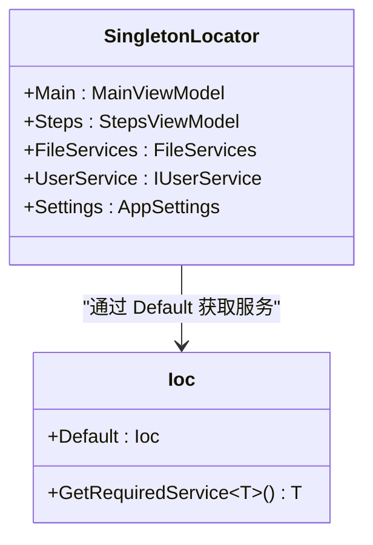
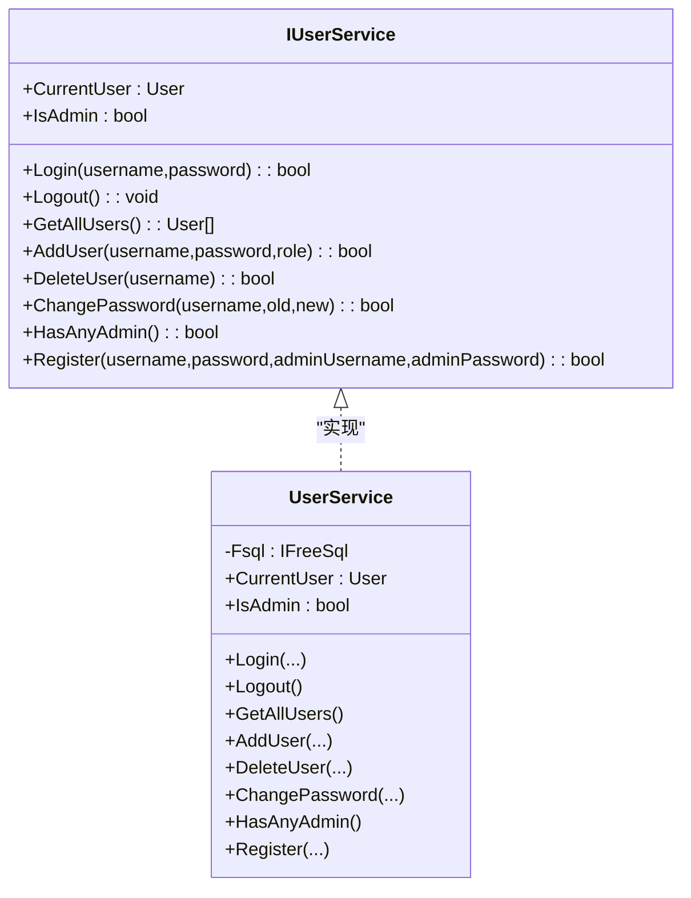
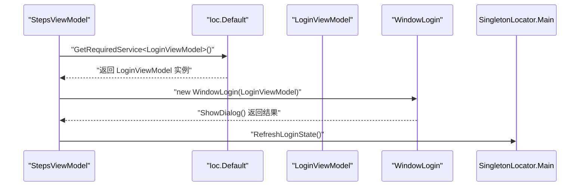
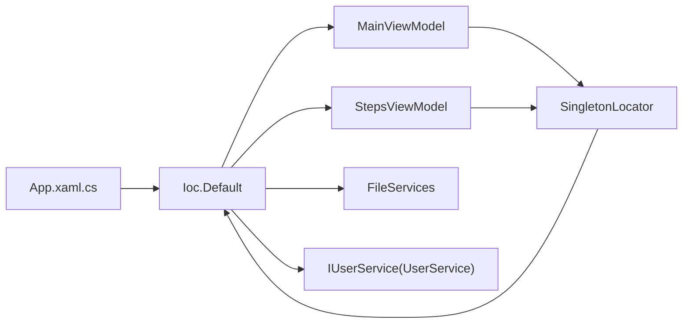

# 依赖注入容器

<cite>
**本文引用的文件**   
- [App.xaml.cs](file://ShaoLu/App.xaml.cs)
- [SingletonLocator.cs](file://ShaoLu/Utils/SingletonLocator.cs)
- [MainViewModel.cs](file://ShaoLu/Viewmodels/MainViewModel.cs)
- [StepsViewModel.cs](file://ShaoLu/Viewmodels/StepsViewModel.cs)
- [IUserService.cs](file://ShaoLu/Services/IUserService.cs)
- [UserService.cs](file://ShaoLu/Services/UserService.cs)
- [SettingsService.cs](file://ShaoLu/Services/SettingsService.cs)
- [User.cs](file://ShaoLu/Models/User.cs)
</cite>

## 目录
1. [简介](#简介)
2. [项目结构](#项目结构)
3. [核心组件](#核心组件)
4. [架构总览](#架构总览)
5. [详细组件分析](#详细组件分析)
6. [依赖关系分析](#依赖关系分析)
7. [性能与生命周期](#性能与生命周期)
8. [故障排查指南](#故障排查指南)
9. [结论](#结论)
10. [附录：配置与使用模式](#附录配置与使用模式)

## 简介
本文件面向 ShaoLu 应用的依赖注入（DI）容器，聚焦 CommunityToolkit.Mvvm.DependencyInjection 框架在应用中的配置与使用。文档将详细说明服务注册、生命周期管理、单例模式的实现，解释 SingletonLocator 类的作用与设计原理，以及通过 Ioc.Default 获取服务实例的方式。同时涵盖接口抽象的设计原则、跨组件共享服务实例的模式，以及 DI 在解耦和提高可测试性方面的优势。

## 项目结构
ShaoLu 的依赖注入集中在应用启动阶段完成，随后通过统一的定位器访问服务。关键位置如下：
- 应用启动与容器配置：App.xaml.cs
- 服务定位器：Utils/SingletonLocator.cs
- ViewModel 与服务：Viewmodels/*, Services/*
- 模型与枚举：Models/*

**图表来源** 
- [App.xaml.cs:53-67](file://ShaoLu/App.xaml.cs#L53-L67)
- [SingletonLocator.cs:10-13](file://ShaoLu/Utils/SingletonLocator.cs#L10-L13)

**章节来源**
- [App.xaml.cs:19-91](file://ShaoLu/App.xaml.cs#L19-L91)
- [SingletonLocator.cs:1-18](file://ShaoLu/Utils/SingletonLocator.cs#L1-L18)

## 核心组件
- 容器初始化与配置：在应用启动时创建 ServiceCollection，注册所有服务，构建 ServiceProvider 并注入到 Ioc.Default。
- 服务定位器：SingletonLocator 提供静态属性，内部通过 Ioc.Default.GetRequiredService<T>() 返回已注册的单例服务或实现类。
- 服务与接口：以 IUserService 为例，展示“面向接口编程”的服务设计；UserService 为具体实现。
- ViewModel：MainViewModel、StepsViewModel 等作为 UI 层的核心对象，通常注册为单例以便全局共享状态。

**章节来源**
- [App.xaml.cs:53-67](file://ShaoLu/App.xaml.cs#L53-L67)
- [SingletonLocator.cs:10-13](file://ShaoLu/Utils/SingletonLocator.cs#L10-L13)
- [IUserService.cs:5-18](file://ShaoLu/Services/IUserService.cs#L5-L18)
- [UserService.cs:10-37](file://ShaoLu/Services/UserService.cs#L10-L37)
- [MainViewModel.cs:8-40](file://ShaoLu/Viewmodels/MainViewModel.cs#L8-L40)
- [StepsViewModel.cs:20-30](file://ShaoLu/Viewmodels/StepsViewModel.cs#L20-L30)

## 架构总览
下图展示了从应用启动到服务解析的关键流程，包括容器配置、服务注册、以及通过定位器获取服务的调用链。

**图表来源** 
- [App.xaml.cs:53-67](file://ShaoLu/App.xaml.cs#L53-L67)
- [SingletonLocator.cs:10-13](file://ShaoLu/Utils/SingletonLocator.cs#L10-L13)

## 详细组件分析

### 容器配置与生命周期管理（App.xaml.cs）
- 在 OnStartup 中创建 ServiceCollection，统一注册所有服务。
- 单例注册：MainViewModel、StepsViewModel、FileServices、IUserService（映射到 UserService）。
- 瞬态注册：LoginViewModel、UserManagementViewModel（每次请求/构造时新建）。
- 构建 ServiceProvider 并通过 Ioc.Default.ConfigureServices 设置到全局容器。
- 应用退出时通过 Ioc.Default.GetService<T>() 获取服务进行清理（如提交待删除文件、释放资源）。

**图表来源** 
- [App.xaml.cs:53-67](file://ShaoLu/App.xaml.cs#L53-L67)
- [App.xaml.cs:92-109](file://ShaoLu/App.xaml.cs#L92-L109)

**章节来源**
- [App.xaml.cs:53-67](file://ShaoLu/App.xaml.cs#L53-L67)
- [App.xaml.cs:92-109](file://ShaoLu/App.xaml.cs#L92-L109)

### 服务定位器（SingletonLocator.cs）
- 提供静态属性 Main、Steps、FileServices、UserService，内部通过 Ioc.Default.GetRequiredService<T>() 获取实例。
- 优点：简化跨层调用，避免显式传递依赖；缺点：引入静态耦合，需谨慎使用。
- Settings 属性直接加载配置，注释指出实际项目中应通过 DI 容器或单例获取。

**图表来源** 
- [SingletonLocator.cs:10-13](file://ShaoLu/Utils/SingletonLocator.cs#L10-L13)

**章节来源**
- [SingletonLocator.cs:1-18](file://ShaoLu/Utils/SingletonLocator.cs#L1-L18)

### 用户服务（IUserService 与 UserService）
- IUserService 定义用户登录、注销、增删改查、角色判断等能力。
- UserService 实现 IUserService，内部使用 FreeSql 操作 SQLite 数据库，包含密码哈希、盐值生成与安全比较。
- 该服务被注册为单例，确保用户会话状态在全局一致。

**图表来源** 
- [IUserService.cs:5-18](file://ShaoLu/Services/IUserService.cs#L5-L18)
- [UserService.cs:10-37](file://ShaoLu/Services/UserService.cs#L10-L37)

**章节来源**
- [IUserService.cs:5-18](file://ShaoLu/Services/IUserService.cs#L5-L18)
- [UserService.cs:10-37](file://ShaoLu/Services/UserService.cs#L10-L37)
- [User.cs:6-31](file://ShaoLu/Models/User.cs#L6-L31)

### ViewModel 与依赖注入的使用
- MainViewModel：暴露登录状态、当前用户名等属性，通过 SingletonLocator.UserService 读取当前用户信息。
- StepsViewModel：在需要登录时通过 Ioc.Default.GetRequiredService<LoginViewModel>() 动态获取登录窗口 ViewModel，并显示窗口。
- 两者均受益于单例注册，保证状态在整个应用生命周期内唯一且可共享。

**图表来源** 
- [StepsViewModel.cs:170-184](file://ShaoLu/Viewmodels/StepsViewModel.cs#L170-L184)
- [MainViewModel.cs:45-54](file://ShaoLu/Viewmodels/MainViewModel.cs#L45-L54)

**章节来源**
- [StepsViewModel.cs:170-184](file://ShaoLu/Viewmodels/StepsViewModel.cs#L170-L184)
- [MainViewModel.cs:45-54](file://ShaoLu/Viewmodels/MainViewModel.cs#L45-L54)

### 配置服务（SettingsService.cs）
- SettingsService 提供异步加载和保存设置的静态方法，用于应用配置持久化。
- SingletonLocator.Settings 直接调用 LoadAsync().GetAwaiter().GetResult() 同步获取配置，注释建议未来改为通过 DI 容器或单例获取。

**章节来源**
- [SettingsService.cs:20-37](file://ShaoLu/Services/SettingsService.cs#L20-L37)
- [SingletonLocator.cs:15-16](file://ShaoLu/Utils/SingletonLocator.cs#L15-L16)

## 依赖关系分析
- App.xaml.cs 负责容器配置，是依赖注入的入口点。
- SingletonLocator 作为静态定位器，封装对 Ioc.Default 的调用，降低各组件对容器的直接依赖。
- ViewModel 与服务之间通过接口解耦，便于替换实现与单元测试。
- 服务间依赖清晰：UserService 依赖 FreeSql（数据库），不直接依赖 UI 层。

**图表来源** 
- [App.xaml.cs:53-67](file://ShaoLu/App.xaml.cs#L53-L67)
- [SingletonLocator.cs:10-13](file://ShaoLu/Utils/SingletonLocator.cs#L10-L13)

**章节来源**
- [App.xaml.cs:53-67](file://ShaoLu/App.xaml.cs#L53-L67)
- [SingletonLocator.cs:10-13](file://ShaoLu/Utils/SingletonLocator.cs#L10-L13)

## 性能与生命周期
- 单例服务（MainViewModel、StepsViewModel、FileServices、IUserService）：在应用启动时创建一次，贯穿整个应用生命周期，适合持有全局状态或昂贵资源。
- 瞬态服务（LoginViewModel、UserManagementViewModel）：每次解析时新建，适合轻量、无状态的对象。
- 资源清理：在 OnExit 中通过 Ioc.Default.GetService<T>() 获取服务执行清理逻辑（如提交待删除文件、释放图像识别资源）。

**章节来源**
- [App.xaml.cs:53-67](file://ShaoLu/App.xaml.cs#L53-L67)
- [App.xaml.cs:92-109](file://ShaoLu/App.xaml.cs#L92-L109)

## 故障排查指南
- 未注册服务导致解析失败：检查 App.xaml.cs 中的 AddSingleton/AddTransient 是否遗漏。
- 单例状态异常：确认服务确实注册为单例，避免误用瞬态导致状态不一致。
- 静态定位器空引用：确保在 Ioc.Default.ConfigureServices 之后才访问 SingletonLocator 的属性。
- 配置加载阻塞：SingletonLocator.Settings 使用 GetAwaiter().GetResult() 同步等待异步任务，可能阻塞 UI 线程，建议改为异步或延迟加载。

**章节来源**
- [App.xaml.cs:53-67](file://ShaoLu/App.xaml.cs#L53-L67)
- [SingletonLocator.cs:15-16](file://ShaoLu/Utils/SingletonLocator.cs#L15-L16)

## 结论
ShaoLu 应用通过 CommunityToolkit.Mvvm.DependencyInjection 实现了清晰的依赖注入架构。容器在应用启动时集中配置，服务按生命周期注册，SingletonLocator 提供便捷的静态访问方式。接口抽象与单例模式有效提升了代码的可维护性与可测试性。建议在后续迭代中将配置加载改为异步/延迟策略，并减少静态定位器的使用，以进一步降低耦合度。

## 附录：配置与使用模式
- 服务注册示例路径：
  - 单例注册：[App.xaml.cs:56-61](file://ShaoLu/App.xaml.cs#L56-L61)
  - 瞬态注册：[App.xaml.cs:62-63](file://ShaoLu/App.xaml.cs#L62-L63)
- 获取服务实例示例路径：
  - 通过定位器：[SingletonLocator.cs:10-13](file://ShaoLu/Utils/SingletonLocator.cs#L10-L13)
  - 直接通过容器：[StepsViewModel.cs:174](file://ShaoLu/Viewmodels/StepsViewModel.cs#L174)
- 接口抽象设计原则：
  - 面向接口编程：[IUserService.cs:5-18](file://ShaoLu/Services/IUserService.cs#L5-L18)
  - 实现类隐藏细节：[UserService.cs:10-37](file://ShaoLu/Services/UserService.cs#L10-L37)
- 跨组件共享服务实例：
  - 主窗口与步骤视图共享用户状态：[MainViewModel.cs:45-54](file://ShaoLu/Viewmodels/MainViewModel.cs#L45-L54), [StepsViewModel.cs:170-184](file://ShaoLu/Viewmodels/StepsViewModel.cs#L170-L184)