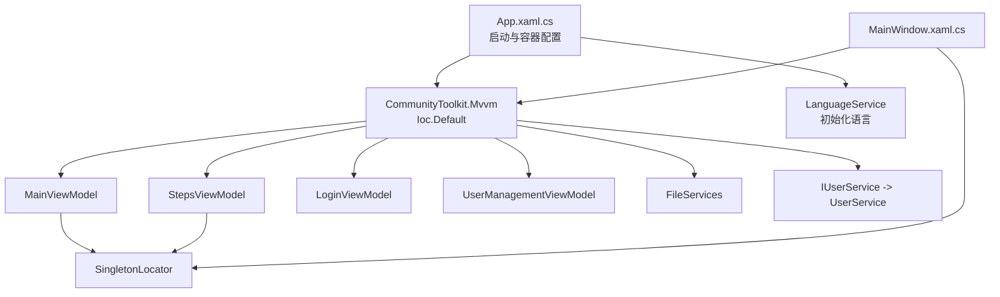
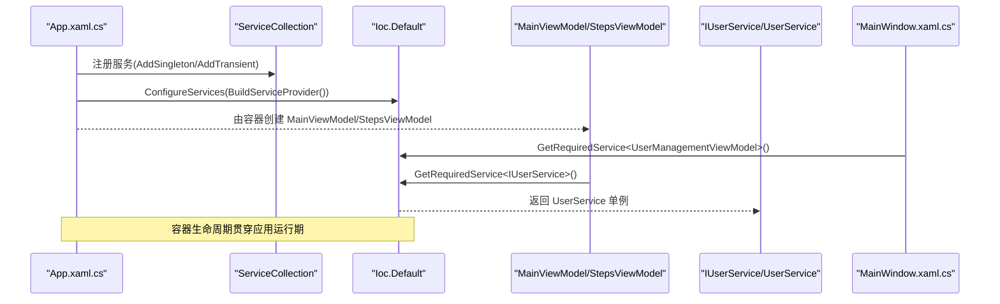
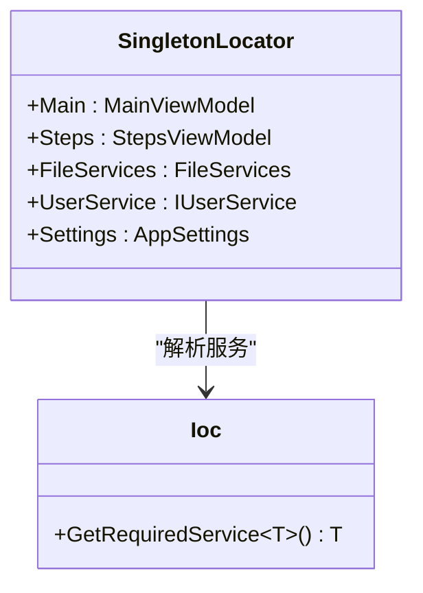
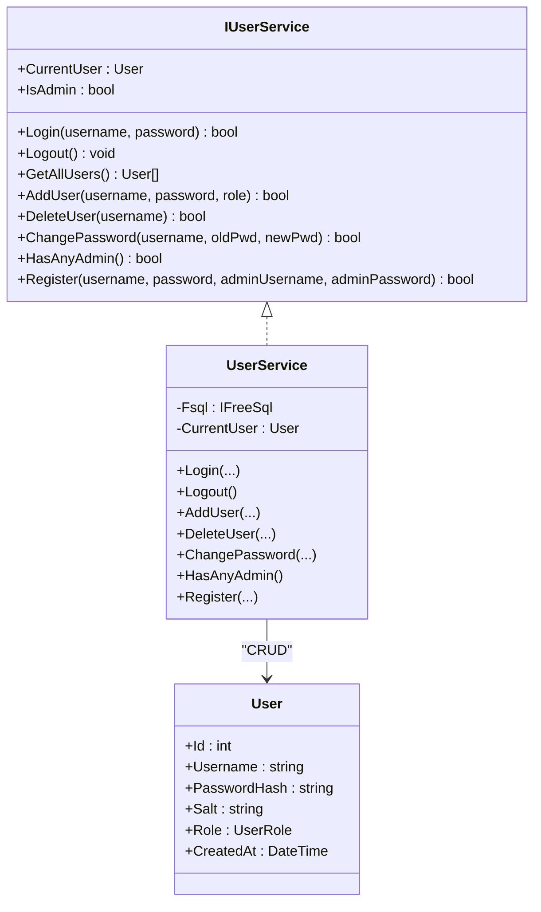
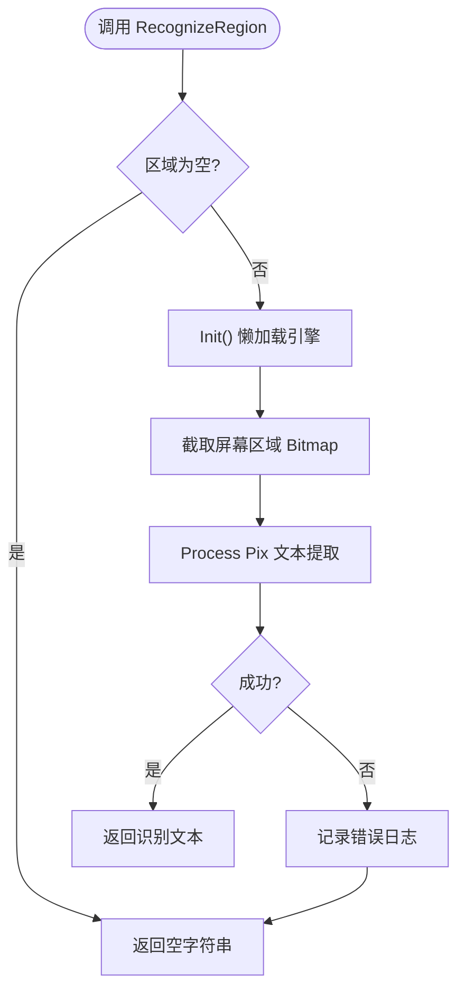
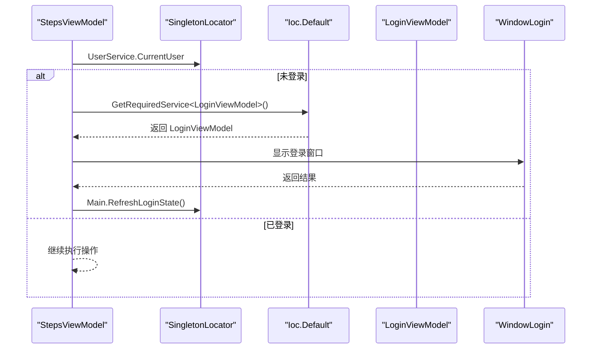
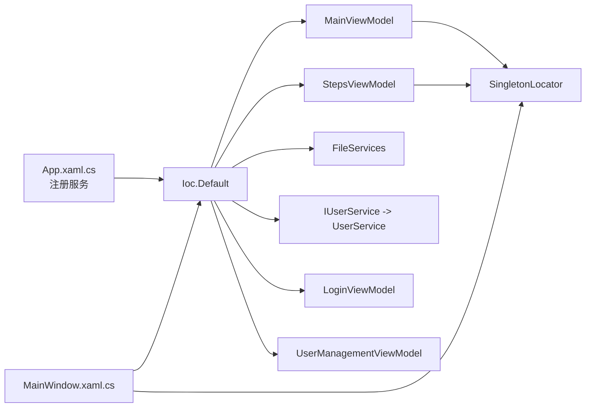

# 依赖注入模式

<cite>
**本文引用的文件**   
- [App.xaml.cs](file://ShaoLu/App.xaml.cs)
- [SingletonLocator.cs](file://ShaoLu/Utils/SingletonLocator.cs)
- [IUserService.cs](file://ShaoLu/Services/IUserService.cs)
- [UserService.cs](file://ShaoLu/Services/UserService.cs)
- [SettingsService.cs](file://ShaoLu/Services/SettingsService.cs)
- [OCRService.cs](file://ShaoLu/Services/OCRService.cs)
- [LanguageService.cs](file://ShaoLu/Services/LanguageService.cs)
- [MainViewModel.cs](file://ShaoLu/Viewmodels/MainViewModel.cs)
- [LoginViewModel.cs](file://ShaoLu/Viewmodels/LoginViewModel.cs)
- [StepsViewModel.cs](file://ShaoLu/Viewmodels/StepsViewModel.cs)
- [MainWindow.xaml.cs](file://ShaoLu/MainWindow.xaml.cs)
- [User.cs](file://ShaoLu/Models/User.cs)
- [Settings.cs](file://ShaoLu/Models/Settings.cs)
</cite>

## 目录
1. [简介](#简介)
2. [项目结构](#项目结构)
3. [核心组件](#核心组件)
4. [架构总览](#架构总览)
5. [详细组件分析](#详细组件分析)
6. [依赖关系分析](#依赖关系分析)
7. [性能考量](#性能考量)
8. [故障排查指南](#故障排查指南)
9. [结论](#结论)
10. [附录：扩展新服务指南](#附录扩展新服务指南)

## 简介
本文件面向 ShaoLu 项目的依赖注入（DI）模式，系统性阐述基于 CommunityToolkit.Mvvm 的 DI 容器使用方式、服务注册与解析机制、单例定位器 SingletonLocator 的实现原理与服务生命周期管理。文档还覆盖 UserService、SettingsService、OCRService 等关键服务在应用中的使用方式，并给出扩展新服务的步骤与示例路径，帮助读者理解 DI 带来的松耦合、可测试性与可维护性提升。

## 项目结构
ShaoLu 采用分层组织：
- 启动与容器配置：App.xaml.cs 负责初始化语言、构建 ServiceCollection、注册服务、构建 Ioc 容器，并在退出时释放资源。
- 服务层 Services：业务服务如 IUserService/UserService、SettingsService、OCRService、LanguageService 等。
- 视图模型 Viewmodels：MainViewModel、LoginViewModel、StepsViewModel 等通过构造函数或容器获取服务。
- 工具 Utils：SingletonLocator 提供静态访问点以解析容器中的服务实例。
- 模型 Models：User、AppSettings 等数据模型。

**图表来源** 
- [App.xaml.cs:18-47](file://ShaoLu/App.xaml.cs#L18-L47)
- [SingletonLocator.cs:8-17](file://ShaoLu/Utils/SingletonLocator.cs#L8-L17)
- [MainWindow.xaml.cs:253-313](file://ShaoLu/MainWindow.xaml.cs#L253-L313)

**章节来源**
- [App.xaml.cs:18-47](file://ShaoLu/App.xaml.cs#L18-L47)
- [SingletonLocator.cs:8-17](file://ShaoLu/Utils/SingletonLocator.cs#L8-L17)

## 核心组件
- 容器与注册
  - 使用 Microsoft.Extensions.DependencyInjection.ServiceCollection 进行服务注册，并通过 CommunityToolkit.Mvvm.DependencyInjection.Ioc.Default.ConfigureServices 将容器注入到全局 Ioc 中。
  - 注册策略：
    - 单例：MainViewModel、StepsViewModel、FileServices、IUserService(UserService)。
    - 瞬态：LoginViewModel、UserManagementViewModel。
- 单例定位器
  - SingletonLocator 暴露静态属性，内部通过 Ioc.Default.GetRequiredService<T>() 解析服务，便于非构造注入场景（如 XAML 绑定、事件回调）快速获取服务。
- 服务示例
  - IUserService/UserService：用户认证、权限判断、用户管理，持久化至 SQLite（FreeSql）。
  - SettingsService：异步加载/保存 settings.json 配置。
  - OCRService：封装 Tesseract OCR 引擎，懒加载与线程安全初始化。
  - LanguageService：本地化设置与字符串获取。

**章节来源**
- [App.xaml.cs:33-47](file://ShaoLu/App.xaml.cs#L33-L47)
- [SingletonLocator.cs:8-17](file://ShaoLu/Utils/SingletonLocator.cs#L8-L17)
- [IUserService.cs:6-18](file://ShaoLu/Services/IUserService.cs#L6-L18)
- [UserService.cs:10-37](file://ShaoLu/Services/UserService.cs#L10-L37)
- [SettingsService.cs:7-38](file://ShaoLu/Services/SettingsService.cs#L7-L38)
- [OCRService.cs:12-43](file://ShaoLu/Services/OCRService.cs#L12-L43)
- [LanguageService.cs:7-22](file://ShaoLu/Services/LanguageService.cs#L7-L22)

## 架构总览
下图展示了从应用启动到服务解析的关键流程，以及各组件之间的依赖关系。

**图表来源** 
- [App.xaml.cs:33-47](file://ShaoLu/App.xaml.cs#L33-L47)
- [MainWindow.xaml.cs:253-313](file://ShaoLu/MainWindow.xaml.cs#L253-L313)
- [SingletonLocator.cs:8-17](file://ShaoLu/Utils/SingletonLocator.cs#L8-L17)

## 详细组件分析

### 容器配置与生命周期管理（App.xaml.cs）
- 启动阶段：
  - 初始化 LanguageService。
  - 构建 ServiceCollection，注册 ViewModel 与服务。
  - 调用 Ioc.Default.ConfigureServices 完成容器装配。
- 退出阶段：
  - 从容器解析 FileServices 与 StepsViewModel，遍历步骤执行 Dispose，提交待删除文件清理。
- 生命周期说明：
  - AddSingleton：容器启动后创建一次，整个进程内共享（如 MainViewModel、StepsViewModel、FileServices、IUserService）。
  - AddTransient：每次请求创建新实例（如 LoginViewModel、UserManagementViewModel），适合轻量、无状态对象。

**章节来源**
- [App.xaml.cs:18-47](file://ShaoLu/App.xaml.cs#L18-L47)
- [App.xaml.cs:66-83](file://ShaoLu/App.xaml.cs#L66-L83)

### 单例定位器（SingletonLocator）
- 作用：为 UI 层与非构造注入场景提供便捷的服务访问入口。
- 实现要点：
  - 通过 Ioc.Default.GetRequiredService<T>() 解析服务，确保容器已配置。
  - 暴露 Main、Steps、FileServices、UserService 等静态属性。
  - Settings 字段直接调用 SettingsService.LoadAsync() 同步阻塞加载（注意：实际项目中建议改为异步与容器管理）。

**图表来源** 
- [SingletonLocator.cs:8-17](file://ShaoLu/Utils/SingletonLocator.cs#L8-L17)

**章节来源**
- [SingletonLocator.cs:8-17](file://ShaoLu/Utils/SingletonLocator.cs#L8-L17)

### 用户服务（IUserService / UserService）
- 接口定义：包含登录、注销、用户增删改查、管理员校验等能力。
- 实现要点：
  - 使用 FreeSql 连接 SQLite，Lazy 初始化数据库连接。
  - 密码加盐与哈希（PBKDF2+SHA256），常量时间比较防止时序攻击。
  - CurrentUser 表示当前登录用户，IsAdmin 用于权限判断。
- 使用场景：
  - LoginViewModel 通过构造函数注入 IUserService 完成登录与注册逻辑。
  - MainWindow 与 StepsViewModel 通过 SingletonLocator.UserService 检查登录状态。

**图表来源** 
- [IUserService.cs:6-18](file://ShaoLu/Services/IUserService.cs#L6-L18)
- [UserService.cs:10-37](file://ShaoLu/Services/UserService.cs#L10-L37)
- [User.cs:6-31](file://ShaoLu/Models/User.cs#L6-L31)

**章节来源**
- [IUserService.cs:6-18](file://ShaoLu/Services/IUserService.cs#L6-L18)
- [UserService.cs:10-37](file://ShaoLu/Services/UserService.cs#L10-L37)
- [User.cs:6-31](file://ShaoLu/Models/User.cs#L6-L31)

### 设置服务（SettingsService）
- 功能：异步加载/保存 settings.json，默认值回退。
- 使用方式：
  - SingletonLocator.Settings 在启动时同步加载（注意阻塞风险）。
  - 建议在后续版本中将 SettingsService 纳入容器并以单例形式提供，避免阻塞主线程。

**章节来源**
- [SettingsService.cs:7-38](file://ShaoLu/Services/SettingsService.cs#L7-L38)
- [Settings.cs:7-76](file://ShaoLu/Models/Settings.cs#L7-L76)

### OCR 服务（OCRService）
- 功能：封装 Tesseract OCR 引擎，支持图像识别与屏幕区域识别。
- 关键点：
  - 懒加载 Init() 保证首次使用时才初始化引擎。
  - 线程安全的 double-check 锁保护引擎实例。
  - RecognizeRegion 考虑 DPI 缩放，确保坐标转换正确。
  - Dispose() 释放引擎资源。

**图表来源** 
- [OCRService.cs:21-43](file://ShaoLu/Services/OCRService.cs#L21-L43)
- [OCRService.cs:82-118](file://ShaoLu/Services/OCRService.cs#L82-L118)

**章节来源**
- [OCRService.cs:12-43](file://ShaoLu/Services/OCRService.cs#L12-L43)
- [OCRService.cs:82-118](file://ShaoLu/Services/OCRService.cs#L82-L118)

### 语言服务（LanguageService）
- 功能：读取上次语言设置或系统语言，设置 LocalizeDictionary 文化，并提供字符串获取方法。
- 使用场景：
  - App 启动时初始化语言。
  - 界面文案通过 LanguageService.GetLocalizedString(key) 获取。

**章节来源**
- [LanguageService.cs:7-22](file://ShaoLu/Services/LanguageService.cs#L7-L22)
- [LanguageService.cs:27-40](file://ShaoLu/Services/LanguageService.cs#L27-L40)

### 视图模型与服务集成
- MainViewModel：通过 SingletonLocator.UserService 获取当前用户信息，刷新登录状态。
- LoginViewModel：构造函数注入 IUserService，处理登录与注册逻辑。
- StepsViewModel：在需要编辑操作前调用 EnsureLoggedIn()，未登录则弹出登录窗口；必要时通过 Ioc 解析 LoginViewModel。

**图表来源** 
- [StepsViewModel.cs:150-168](file://ShaoLu/Viewmodels/StepsViewModel.cs#L150-L168)
- [MainWindow.xaml.cs:297-313](file://ShaoLu/MainWindow.xaml.cs#L297-L313)
- [LoginViewModel.cs:39-42](file://ShaoLu/Viewmodels/LoginViewModel.cs#L39-L42)

**章节来源**
- [MainViewModel.cs:44-54](file://ShaoLu/Viewmodels/MainViewModel.cs#L44-L54)
- [LoginViewModel.cs:39-42](file://ShaoLu/Viewmodels/LoginViewModel.cs#L39-L42)
- [StepsViewModel.cs:150-168](file://ShaoLu/Viewmodels/StepsViewModel.cs#L150-L168)
- [MainWindow.xaml.cs:297-313](file://ShaoLu/MainWindow.xaml.cs#L297-L313)

## 依赖关系分析
- 容器注册关系：
  - MainViewModel、StepsViewModel、FileServices、IUserService(UserService) 为单例。
  - LoginViewModel、UserManagementViewModel 为瞬态。
- 解析路径：
  - 视图模型通过构造函数注入或 Ioc.Default.GetRequiredService<T>() 解析。
  - 非构造场景通过 SingletonLocator 静态属性获取。

**图表来源** 
- [App.xaml.cs:33-47](file://ShaoLu/App.xaml.cs#L33-L47)
- [SingletonLocator.cs:8-17](file://ShaoLu/Utils/SingletonLocator.cs#L8-L17)
- [MainWindow.xaml.cs:253-313](file://ShaoLu/MainWindow.xaml.cs#L253-L313)

**章节来源**
- [App.xaml.cs:33-47](file://ShaoLu/App.xaml.cs#L33-L47)
- [SingletonLocator.cs:8-17](file://ShaoLu/Utils/SingletonLocator.cs#L8-L17)

## 性能考量
- 单例服务：MainViewModel、StepsViewModel、FileServices、UserService 作为单例减少重复创建开销，适合持有状态或昂贵资源。
- 瞬态服务：LoginViewModel、UserManagementViewModel 按需创建，避免不必要的状态保持。
- OCR 引擎懒加载：OCRService 仅在首次识别时初始化，降低启动成本。
- 设置加载：SettingsService.LoadAsync 异步设计良好，但 SingletonLocator.Settings 同步阻塞，建议后续优化为异步与容器管理。

[本节为通用指导，不直接分析具体文件]

## 故障排查指南
- 容器未配置：
  - 现象：GetRequiredService 抛出异常。
  - 排查：确认 App.OnStartup 是否调用 Ioc.Default.ConfigureServices。
- 服务未注册：
  - 现象：解析失败。
  - 排查：检查 ServiceCollection 中是否正确 AddSingleton/AddTransient。
- 登录状态不同步：
  - 现象：UI 未更新。
  - 排查：确保调用 SingletonLocator.Main.RefreshLoginState() 并触发属性变更通知。
- OCR 初始化失败：
  - 现象：RecognizeRegion 返回空或抛异常。
  - 排查：检查 tessdata 路径与权限，查看日志输出。

**章节来源**
- [App.xaml.cs:18-47](file://ShaoLu/App.xaml.cs#L18-L47)
- [OCRService.cs:21-43](file://ShaoLu/Services/OCRService.cs#L21-L43)
- [MainViewModel.cs:44-54](file://ShaoLu/Viewmodels/MainViewModel.cs#L44-L54)

## 结论
ShaoLu 通过 CommunityToolkit.Mvvm 的 DI 容器实现了清晰的服务注册与解析机制，结合 SingletonLocator 提供了便捷的静态访问点。UserService、SettingsService、OCRService 等服务在应用中各司其职，配合视图模型形成松耦合架构。遵循本文档的扩展指南，可快速添加新服务并融入现有生命周期管理，进一步提升可测试性与可维护性。

[本节为总结，不直接分析具体文件]

## 附录：扩展新服务指南
- 步骤概览
  1. 定义接口（可选）：在 Services 下新建接口文件，声明服务契约。
  2. 实现类：在 Services 下新建实现类，实现接口逻辑。
  3. 注册服务：在 App.OnStartup 中通过 ServiceCollection 注册（单例或瞬态）。
  4. 使用服务：在视图模型中通过构造函数注入或 Ioc.Default.GetRequiredService<T>() 解析。
  5. 生命周期管理：如需释放资源，在 App.OnExit 中统一处理。

- 示例路径参考
  - 接口定义：[IUserService.cs:6-18](file://ShaoLu/Services/IUserService.cs#L6-L18)
  - 实现类：[UserService.cs:10-37](file://ShaoLu/Services/UserService.cs#L10-L37)
  - 容器注册：[App.xaml.cs:33-47](file://ShaoLu/App.xaml.cs#L33-L47)
  - 视图模型注入：[LoginViewModel.cs:39-42](file://ShaoLu/Viewmodels/LoginViewModel.cs#L39-L42)
  - 静态解析：[SingletonLocator.cs:8-17](file://ShaoLu/Utils/SingletonLocator.cs#L8-L17)

- 最佳实践
  - 优先使用构造函数注入，避免静态耦合。
  - 对昂贵资源（如 OCR 引擎、数据库连接）使用单例或懒加载。
  - 对无状态、轻量对象使用瞬态，避免内存泄漏。
  - 在 App.OnExit 中集中释放资源，确保清理顺序合理。

[本节为通用指导，不直接分析具体文件]