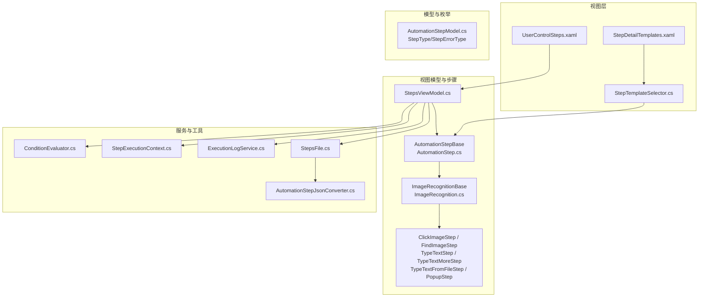
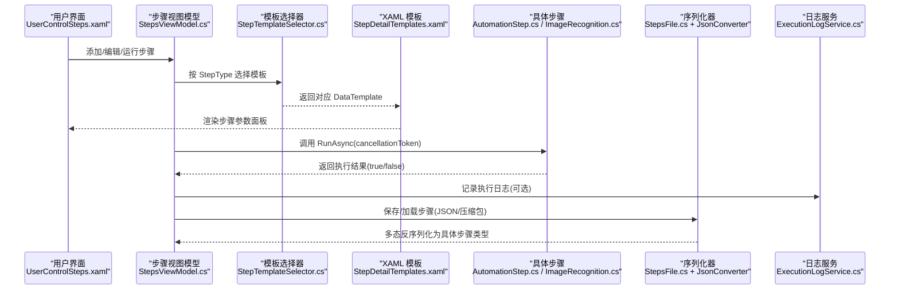
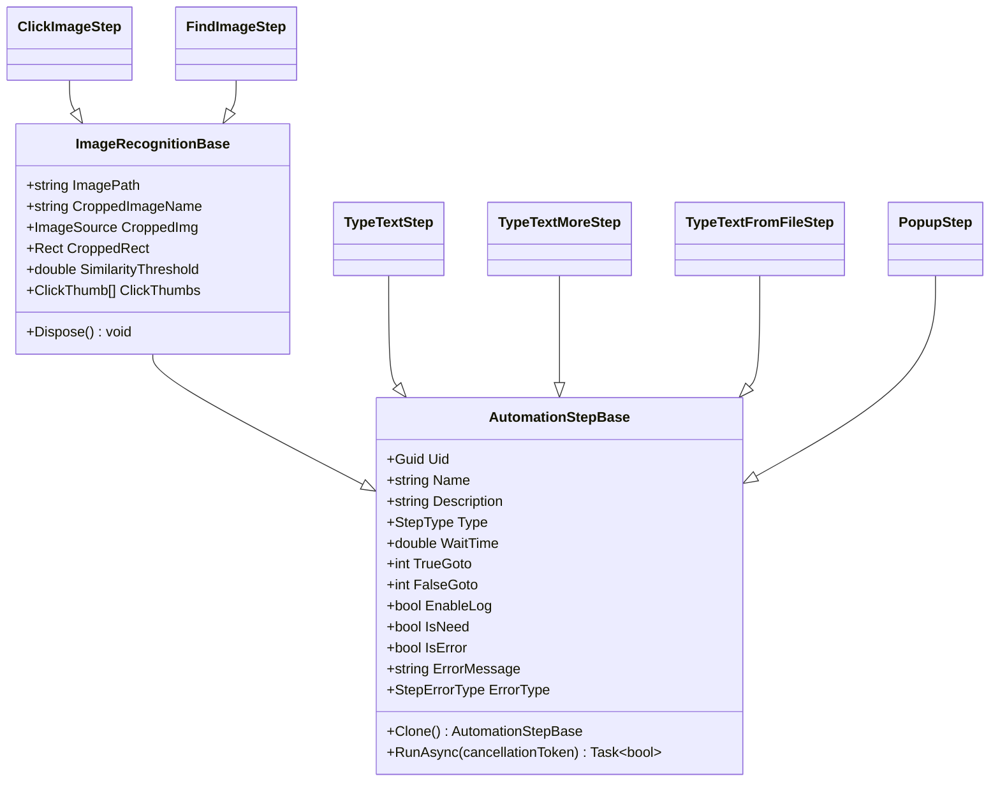
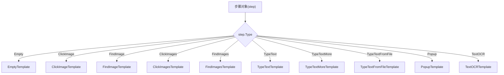
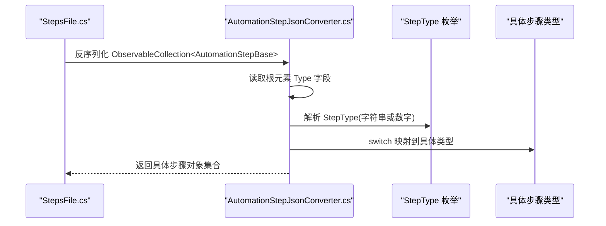
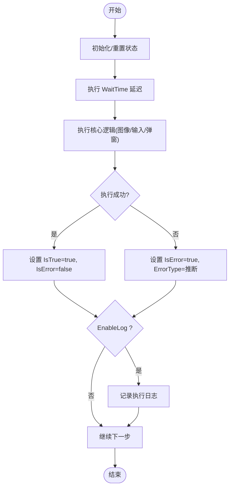
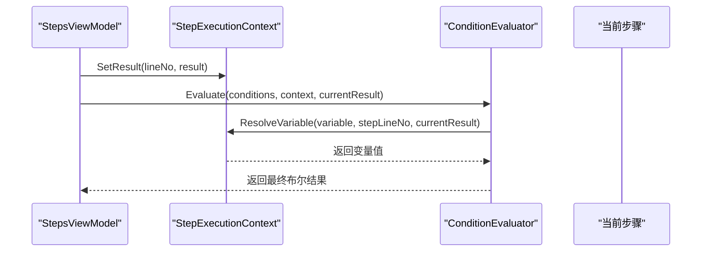
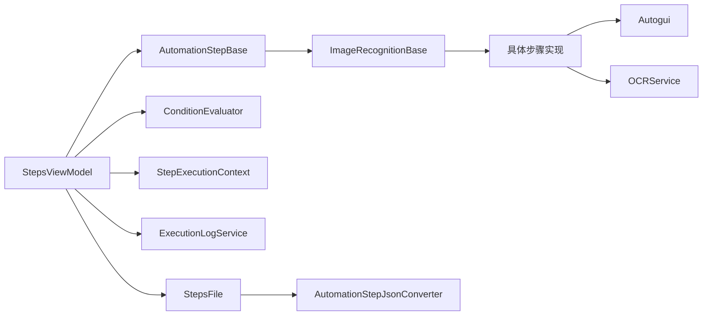

# 插件化架构

<cite>
**本文引用的文件**   
- [AutomationStep.cs](file://ShaoLu/Viewmodels/AutomationStep.cs)
- [ImageRecognition.cs](file://ShaoLu/Viewmodels/ImageRecognition.cs)
- [ImagesRecognition.cs](file://ShaoLu/Viewmodels/ImagesRecognition.cs)
- [AutomationStepModel.cs](file://ShaoLu/Models/AutomationStepModel.cs)
- [StepTemplateSelector.cs](file://ShaoLu/Converters/StepTemplateSelector.cs)
- [StepDetailTemplates.xaml](file://ShaoLu/Templates/StepDetailTemplates.xaml)
- [StepsFile.cs](file://ShaoLu/Utils/StepsFile.cs)
- [AutomationStepJsonConverter.cs](file://ShaoLu/Converters/AutomationStepJsonConverter.cs)
- [ConditionEvaluator.cs](file://ShaoLu/Services/ConditionEvaluator.cs)
- [StepExecutionContext.cs](file://ShaoLu/Services/StepExecutionContext.cs)
- [ExecutionLogService.cs](file://ShaoLu/Services/ExecutionLogService.cs)
- [StepsViewModel.cs](file://ShaoLu/Viewmodels/StepsViewModel.cs)
- [MainWindow.xaml.cs](file://ShaoLu/MainWindow.xaml.cs)
- [App.xaml.cs](file://ShaoLu/App.xaml.cs)
- [UserControlSteps.xaml](file://ShaoLu/Views/UserControlSteps.xaml)
- [Readme.md](file://Readme.md)
</cite>

## 目录
1. [简介](#简介)
2. [项目结构](#项目结构)
3. [核心组件](#核心组件)
4. [架构总览](#架构总览)
5. [详细组件分析](#详细组件分析)
6. [依赖关系分析](#依赖关系分析)
7. [性能考量](#性能考量)
8. [故障排查指南](#故障排查指南)
9. [结论](#结论)
10. [附录：自定义步骤开发流程与示例](#附录自定义步骤开发流程与示例)

## 简介
本文件面向 ShaoLu 的插件化架构，围绕基于 AutomationStepBase 的自定义步骤扩展机制展开，系统阐述步骤类型注册、UI 模板绑定、执行逻辑实现、工厂式动态实例化、生命周期管理（初始化、执行、错误处理、资源清理），以及自定义步骤的开发流程与发布方式。文档同时给出可视化图示，帮助读者从高层到代码层全面理解该架构。

## 项目结构
ShaoLu 采用 WPF + MVVM 架构，自动化步骤以“基类 + 派生类”的方式组织，UI 通过 DataTemplate 与模板选择器进行绑定，序列化通过自定义转换器支持多态反序列化，执行引擎由 ViewModel 驱动，服务层提供 OCR、日志等能力。

**图表来源** 
- [UserControlSteps.xaml:104-121](file://ShaoLu/Views/UserControlSteps.xaml#L104-L121)
- [StepDetailTemplates.xaml:598-608](file://ShaoLu/Templates/StepDetailTemplates.xaml#L598-L608)
- [StepTemplateSelector.cs:1-44](file://ShaoLu/Converters/StepTemplateSelector.cs#L1-L44)
- [AutomationStepModel.cs:1-47](file://ShaoLu/Models/AutomationStepModel.cs#L1-L47)
- [StepsViewModel.cs:103-500](file://ShaoLu/Viewmodels/StepsViewModel.cs#L103-L500)
- [AutomationStep.cs:1-205](file://ShaoLu/Viewmodels/AutomationStep.cs#L1-L205)
- [ImageRecognition.cs:1-120](file://ShaoLu/Viewmodels/ImageRecognition.cs#L1-L120)
- [StepsFile.cs:1-217](file://ShaoLu/Utils/StepsFile.cs#L1-L217)
- [AutomationStepJsonConverter.cs:1-89](file://ShaoLu/Converters/AutomationStepJsonConverter.cs#L1-L89)

**章节来源**
- [Readme.md:1-283](file://Readme.md#L1-L283)
- [UserControlSteps.xaml:104-121](file://ShaoLu/Views/UserControlSteps.xaml#L104-L121)
- [StepDetailTemplates.xaml:598-608](file://ShaoLu/Templates/StepDetailTemplates.xaml#L598-L608)
- [StepTemplateSelector.cs:1-44](file://ShaoLu/Converters/StepTemplateSelector.cs#L1-L44)
- [AutomationStepModel.cs:1-47](file://ShaoLu/Models/AutomationStepModel.cs#L1-L47)
- [StepsViewModel.cs:103-500](file://ShaoLu/Viewmodels/StepsViewModel.cs#L103-L500)
- [AutomationStep.cs:1-205](file://ShaoLu/Viewmodels/AutomationStep.cs#L1-L205)
- [ImageRecognition.cs:1-120](file://ShaoLu/Viewmodels/ImageRecognition.cs#L1-L120)
- [StepsFile.cs:1-217](file://ShaoLu/Utils/StepsFile.cs#L1-L217)
- [AutomationStepJsonConverter.cs:1-89](file://ShaoLu/Converters/AutomationStepJsonConverter.cs#L1-L89)

## 核心组件
- 步骤基类与抽象契约：定义通用属性（名称、描述、等待时间、跳转行号、条件模式、日志开关）、唯一标识、克隆接口与异步执行入口。
- 图像识别基类：在基类基础上增加图片路径、裁剪图、相似度阈值、点击点集合、OCR 区域等能力，并实现资源释放。
- 具体步骤实现：点击识图、查找识图、多图点击/查找、输入文字、多次输入、从文件输入、弹出框、文本 OCR 等。
- 模板选择器与 XAML 模板：根据 StepType 动态选择 UI 模板，实现“同构数据、异构界面”。
- JSON 多态序列化：通过自定义转换器将 StepType 映射为具体类型，完成跨进程/文件的持久化与加载。
- 条件评估与执行上下文：统一解析变量、比较运算、组合逻辑，支撑复杂条件分支。
- 执行引擎与生命周期：StepsViewModel 负责运行前准备、逐条执行、异常捕获、结果记录、取消与资源清理。

**章节来源**
- [AutomationStep.cs:1-205](file://ShaoLu/Viewmodels/AutomationStep.cs#L1-L205)
- [ImageRecognition.cs:1-120](file://ShaoLu/Viewmodels/ImageRecognition.cs#L1-L120)
- [ImagesRecognition.cs:1-183](file://ShaoLu/Viewmodels/ImagesRecognition.cs#L1-L183)
- [StepTemplateSelector.cs:1-44](file://ShaoLu/Converters/StepTemplateSelector.cs#L1-L44)
- [StepDetailTemplates.xaml:115-596](file://ShaoLu/Templates/StepDetailTemplates.xaml#L115-L596)
- [AutomationStepJsonConverter.cs:1-89](file://ShaoLu/Converters/AutomationStepJsonConverter.cs#L1-L89)
- [ConditionEvaluator.cs:1-187](file://ShaoLu/Services/ConditionEvaluator.cs#L1-L187)
- [StepExecutionContext.cs:1-88](file://ShaoLu/Services/StepExecutionContext.cs#L1-L88)
- [StepsViewModel.cs:103-500](file://ShaoLu/Viewmodels/StepsViewModel.cs#L103-L500)

## 架构总览
下图展示从 UI 到执行引擎再到具体步骤实现的调用链，以及 JSON 序列化/反序列化的关键节点。

**图表来源** 
- [UserControlSteps.xaml:104-121](file://ShaoLu/Views/UserControlSteps.xaml#L104-L121)
- [StepTemplateSelector.cs:1-44](file://ShaoLu/Converters/StepTemplateSelector.cs#L1-L44)
- [StepDetailTemplates.xaml:598-608](file://ShaoLu/Templates/StepDetailTemplates.xaml#L598-L608)
- [StepsViewModel.cs:404-500](file://ShaoLu/Viewmodels/StepsViewModel.cs#L404-L500)
- [AutomationStep.cs:197-205](file://ShaoLu/Viewmodels/AutomationStep.cs#L197-L205)
- [StepsFile.cs:1-217](file://ShaoLu/Utils/StepsFile.cs#L1-L217)
- [AutomationStepJsonConverter.cs:1-89](file://ShaoLu/Converters/AutomationStepJsonConverter.cs#L1-L89)
- [ExecutionLogService.cs:37-74](file://ShaoLu/Services/ExecutionLogService.cs#L37-L74)

## 详细组件分析

### 步骤基类与继承体系
- 基类职责：统一元数据（名称、描述、类型、等待时间、跳转行号、条件模式、日志开关）、运行时状态（是否成功、错误信息、错误类型、最近执行结果）、克隆与异步执行契约。
- 图像识别基类：扩展图片相关属性、裁剪图保存、点击点管理、OCR 区域、资源释放（IDisposable）。
- 具体步骤：各自实现 RunAsync 业务逻辑，设置 IsTrue/IsError/ErrorType，并在启用日志时写入执行日志。

**图表来源** 
- [AutomationStep.cs:1-205](file://ShaoLu/Viewmodels/AutomationStep.cs#L1-L205)
- [ImageRecognition.cs:1-120](file://ShaoLu/Viewmodels/ImageRecognition.cs#L1-L120)
- [ImagesRecognition.cs:1-183](file://ShaoLu/Viewmodels/ImagesRecognition.cs#L1-L183)

**章节来源**
- [AutomationStep.cs:1-205](file://ShaoLu/Viewmodels/AutomationStep.cs#L1-L205)
- [ImageRecognition.cs:1-120](file://ShaoLu/Viewmodels/ImageRecognition.cs#L1-L120)
- [ImagesRecognition.cs:1-183](file://ShaoLu/Viewmodels/ImagesRecognition.cs#L1-L183)

### 步骤类型注册与 UI 模板绑定
- 类型枚举：StepType 集中定义所有步骤类型，作为“类型标识”。
- 模板选择器：根据 step.Type 返回对应的 DataTemplate，实现“类型→界面”的解耦。
- XAML 模板：每个步骤类型拥有独立的 Detail 模板，包含参数控件与通用条件面板。

**图表来源** 
- [AutomationStepModel.cs:1-47](file://ShaoLu/Models/AutomationStepModel.cs#L1-L47)
- [StepTemplateSelector.cs:1-44](file://ShaoLu/Converters/StepTemplateSelector.cs#L1-L44)
- [StepDetailTemplates.xaml:115-596](file://ShaoLu/Templates/StepDetailTemplates.xaml#L115-L596)

**章节来源**
- [AutomationStepModel.cs:1-47](file://ShaoLu/Models/AutomationStepModel.cs#L1-L47)
- [StepTemplateSelector.cs:1-44](file://ShaoLu/Converters/StepTemplateSelector.cs#L1-L44)
- [StepDetailTemplates.xaml:115-596](file://ShaoLu/Templates/StepDetailTemplates.xaml#L115-L596)

### 步骤工厂模式（JSON 多态反序列化）
- 使用自定义 JsonConverter，读取 JSON 中的 Type 字段，映射到具体步骤类型，再反序列化为对象。
- StepsFile 封装读写选项，确保一致性与性能；支持 .autostep 压缩包格式（steps.json + images/）。

**图表来源** 
- [StepsFile.cs:1-217](file://ShaoLu/Utils/StepsFile.cs#L1-L217)
- [AutomationStepJsonConverter.cs:1-89](file://ShaoLu/Converters/AutomationStepJsonConverter.cs#L1-L89)
- [AutomationStepModel.cs:1-47](file://ShaoLu/Models/AutomationStepModel.cs#L1-L47)

**章节来源**
- [StepsFile.cs:1-217](file://ShaoLu/Utils/StepsFile.cs#L1-L217)
- [AutomationStepJsonConverter.cs:1-89](file://ShaoLu/Converters/AutomationStepJsonConverter.cs#L1-L89)
- [AutomationStepModel.cs:1-47](file://ShaoLu/Models/AutomationStepModel.cs#L1-L47)

### 步骤生命周期管理
- 初始化：创建步骤时分配 Uid、默认属性；运行前重置自引用计数、错误状态、索引等。
- 执行：RunAsync 中先等待 WaitTime，再执行核心逻辑（图像识别/输入/弹窗等），设置 IsTrue/IsError/ErrorType，必要时记录日志。
- 错误处理：捕获异常，推断错误类型，支持用户中断（OperationCanceledException），可弹出错误提示。
- 资源清理：图像识别基类实现 IDisposable，应用退出时遍历释放；文件服务提交待删除项。

**图表来源** 
- [StepsViewModel.cs:386-500](file://ShaoLu/Viewmodels/StepsViewModel.cs#L386-L500)
- [AutomationStep.cs:253-278](file://ShaoLu/Viewmodels/AutomationStep.cs#L253-L278)
- [ImageRecognition.cs:382-416](file://ShaoLu/Viewmodels/ImageRecognition.cs#L382-L416)
- [App.xaml.cs:67-85](file://ShaoLu/App.xaml.cs#L67-L85)

**章节来源**
- [StepsViewModel.cs:386-500](file://ShaoLu/Viewmodels/StepsViewModel.cs#L386-L500)
- [AutomationStep.cs:253-278](file://ShaoLu/Viewmodels/AutomationStep.cs#L253-L278)
- [ImageRecognition.cs:382-416](file://ShaoLu/Viewmodels/ImageRecognition.cs#L382-L416)
- [App.xaml.cs:67-85](file://ShaoLu/App.xaml.cs#L67-L85)

### 条件判断与执行上下文
- 执行上下文：维护各步骤执行结果，供条件变量解析（自身或他步结果）。
- 条件评估器：支持常量、数值、字符串、布尔比较，AND/OR 组合，空值检查等。

**图表来源** 
- [StepExecutionContext.cs:1-88](file://ShaoLu/Services/StepExecutionContext.cs#L1-L88)
- [ConditionEvaluator.cs:1-187](file://ShaoLu/Services/ConditionEvaluator.cs#L1-L187)

**章节来源**
- [StepExecutionContext.cs:1-88](file://ShaoLu/Services/StepExecutionContext.cs#L1-L88)
- [ConditionEvaluator.cs:1-187](file://ShaoLu/Services/ConditionEvaluator.cs#L1-L187)

### UI 模板与交互
- UserControlSteps 绑定 AutomationStepBases 集合，支持多选、复制粘贴、插入、删除等操作。
- StepDetailTemplates 为每种步骤提供专属参数面板，并嵌入通用条件面板。
- StepTemplateSelector 根据类型选择模板，保证新增步骤无需修改 UI 框架。

**章节来源**
- [UserControlSteps.xaml:104-121](file://ShaoLu/Views/UserControlSteps.xaml#L104-L121)
- [StepDetailTemplates.xaml:115-596](file://ShaoLu/Templates/StepDetailTemplates.xaml#L115-L596)
- [StepTemplateSelector.cs:1-44](file://ShaoLu/Converters/StepTemplateSelector.cs#L1-L44)

## 依赖关系分析
- 低耦合：步骤类型通过枚举与模板选择器解耦，新增类型不影响现有 UI 框架。
- 高内聚：每个步骤类封装自身参数与执行逻辑，基类提供公共能力。
- 外部依赖：Autogui（屏幕操作）、OCRService（OCR）、NLog（日志）、EPPlus（Excel）、WPF 本地化等。

**图表来源** 
- [StepsViewModel.cs:103-500](file://ShaoLu/Viewmodels/StepsViewModel.cs#L103-L500)
- [AutomationStep.cs:1-205](file://ShaoLu/Viewmodels/AutomationStep.cs#L1-L205)
- [ImageRecognition.cs:1-120](file://ShaoLu/Viewmodels/ImageRecognition.cs#L1-L120)
- [StepsFile.cs:1-217](file://ShaoLu/Utils/StepsFile.cs#L1-L217)
- [AutomationStepJsonConverter.cs:1-89](file://ShaoLu/Converters/AutomationStepJsonConverter.cs#L1-L89)
- [ConditionEvaluator.cs:1-187](file://ShaoLu/Services/ConditionEvaluator.cs#L1-L187)
- [StepExecutionContext.cs:1-88](file://ShaoLu/Services/StepExecutionContext.cs#L1-L88)
- [ExecutionLogService.cs:37-74](file://ShaoLu/Services/ExecutionLogService.cs#L37-L74)

**章节来源**
- [StepsViewModel.cs:103-500](file://ShaoLu/Viewmodels/StepsViewModel.cs#L103-L500)
- [AutomationStep.cs:1-205](file://ShaoLu/Viewmodels/AutomationStep.cs#L1-L205)
- [ImageRecognition.cs:1-120](file://ShaoLu/Viewmodels/ImageRecognition.cs#L1-L120)
- [StepsFile.cs:1-217](file://ShaoLu/Utils/StepsFile.cs#L1-L217)
- [AutomationStepJsonConverter.cs:1-89](file://ShaoLu/Converters/AutomationStepJsonConverter.cs#L1-L89)
- [ConditionEvaluator.cs:1-187](file://ShaoLu/Services/ConditionEvaluator.cs#L1-L187)
- [StepExecutionContext.cs:1-88](file://ShaoLu/Services/StepExecutionContext.cs#L1-L88)
- [ExecutionLogService.cs:37-74](file://ShaoLu/Services/ExecutionLogService.cs#L37-L74)

## 性能考量
- 异步执行：RunAsync 避免阻塞 UI 线程，支持 CancellationToken 取消。
- 图像缓存：BitmapSource 冻结提升跨线程访问性能。
- 序列化优化：静态 JsonSerializerOptions 复用，减少开销。
- 列表虚拟化：大量条目时使用 VirtualizingStackPanel。
- 资源释放：IDisposable 及时释放图像资源，应用退出统一清理。

[本节为通用指导，不直接分析具体文件]

## 故障排查指南
- 常见问题定位：
  - 步骤未找到图片：检查图像路径、工作目录、裁剪图是否存在。
  - 输入失败：确认按键间隔、目标窗口焦点、输入法状态。
  - 弹窗中断：确认用户是否点击了停止按钮或弹窗被取消。
- 日志与错误：
  - 启用 EnableLog 后查看 ExecutionLogService 输出。
  - 错误类型推断：根据异常自动设置 ErrorType，便于快速定位。
- 资源泄漏：
  - 图像基类实现 Dispose，应用退出时统一释放。
  - 文件服务提交待删除项，避免残留。

**章节来源**
- [ExecutionLogService.cs:37-74](file://ShaoLu/Services/ExecutionLogService.cs#L37-L74)
- [App.xaml.cs:67-85](file://ShaoLu/App.xaml.cs#L67-L85)
- [StepsViewModel.cs:476-500](file://ShaoLu/Viewmodels/StepsViewModel.cs#L476-L500)

## 结论
ShaoLu 的插件化架构以 AutomationStepBase 为核心，结合枚举类型、模板选择器与 JSON 多态序列化，实现了“类型即插件”的扩展机制。通过清晰的职责划分与生命周期管理，开发者可以低成本地新增步骤类型，第三方也可轻松集成。该设计兼顾了可扩展性、可维护性与用户体验。

[本节为总结，不直接分析具体文件]

## 附录：自定义步骤开发流程与示例

### 开发流程
1. 需求分析
   - 明确步骤功能、输入参数、输出结果、是否需要图像/OCR/文件 IO。
2. 定义类型
   - 在 StepType 枚举中添加新类型（如 MyCustomStep）。
3. 创建步骤类
   - 继承 AutomationStepBase（或 ImageRecognitionBase 如需图像处理）。
   - 实现 Clone() 与 RunAsync(CancellationToken)。
   - 设置 Type、WaitTime、IsTrue/IsError/ErrorType，按需记录日志。
4. 绑定 UI 模板
   - 在 StepTemplateSelector 中为新类型添加模板映射。
   - 在 StepDetailTemplates.xaml 中定义 DataTemplate，包含参数控件与通用条件面板。
5. 序列化支持
   - 在 AutomationStepJsonConverter 的 switch 映射中添加新类型。
6. 测试与调试
   - 单元测试验证序列化/反序列化与执行逻辑。
   - 启用日志，观察执行过程与错误类型。
7. 打包与分发
   - 使用 StepsFile.SaveAsAutoStepPackage 生成 .autostep 包（含 steps.json 与 images/）。
   - 或通过 JSON 导出/导入步骤集，便于分享与版本管理。

### 完整示例：新增“滚动截图”步骤
- 类型定义：在 StepType 中添加 ScrollScreenshot = 300。
- 步骤类：
  - 继承 AutomationStepBase。
  - 属性：ScrollCount、IntervalMs、TargetRegion（可选）。
  - RunAsync：循环截取屏幕指定区域，合成滚动截图，返回成功标志。
- UI 模板：
  - 在 StepDetailTemplates.xaml 中定义 ScrollScreenshotStepTemplate，包含滚动次数、间隔、区域选择按钮。
  - 在 StepTemplateSelector 中映射 ScrollScreenshot → ScrollScreenshotStepTemplate。
- 序列化：
  - 在 AutomationStepJsonConverter 的 switch 中添加 StepType.ScrollScreenshot → typeof(ScrollScreenshotStep)。
- 测试：
  - 编写单元测试验证 JSON 往返与执行结果。
- 发布：
  - 导出 .autostep 包，附使用说明与截图样例。

**章节来源**
- [AutomationStepModel.cs:1-47](file://ShaoLu/Models/AutomationStepModel.cs#L1-L47)
- [AutomationStep.cs:197-205](file://ShaoLu/Viewmodels/AutomationStep.cs#L197-L205)
- [StepTemplateSelector.cs:1-44](file://ShaoLu/Converters/StepTemplateSelector.cs#L1-L44)
- [StepDetailTemplates.xaml:598-608](file://ShaoLu/Templates/StepDetailTemplates.xaml#L598-L608)
- [AutomationStepJsonConverter.cs:1-89](file://ShaoLu/Converters/AutomationStepJsonConverter.cs#L1-L89)
- [StepsFile.cs:34-110](file://ShaoLu/Utils/StepsFile.cs#L34-L110)

### 插件化架构优势
- 功能扩展性：新增步骤只需扩展类型与模板，无需改动核心框架。
- 第三方集成：通过 JSON 协议与枚举类型，第三方模块可无缝接入。
- 社区贡献：统一的基类与模板约定降低贡献门槛，便于协作与评审。
- 可维护性：职责清晰、易于测试与重构，支持持续演进。

[本节为概念说明，不直接分析具体文件]

### 发布与分发自定义步骤插件
- 导出步骤集：使用 StepsFile.SaveAsAutoStepPackage 生成 .autostep 包。
- 共享与版本控制：将 .autostep 纳入仓库或发布平台，附带 README 说明用法与依赖。
- 安装与使用：在主界面打开 .autostep 文件，即可加载步骤集并运行。

**章节来源**
- [StepsFile.cs:34-110](file://ShaoLu/Utils/StepsFile.cs#L34-L110)
- [MainWindow.xaml.cs:185-210](file://ShaoLu/MainWindow.xaml.cs#L185-L210)