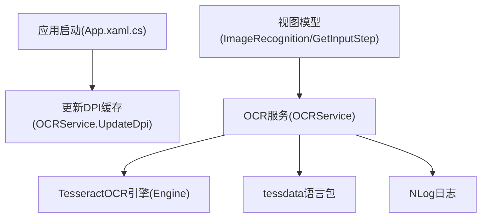
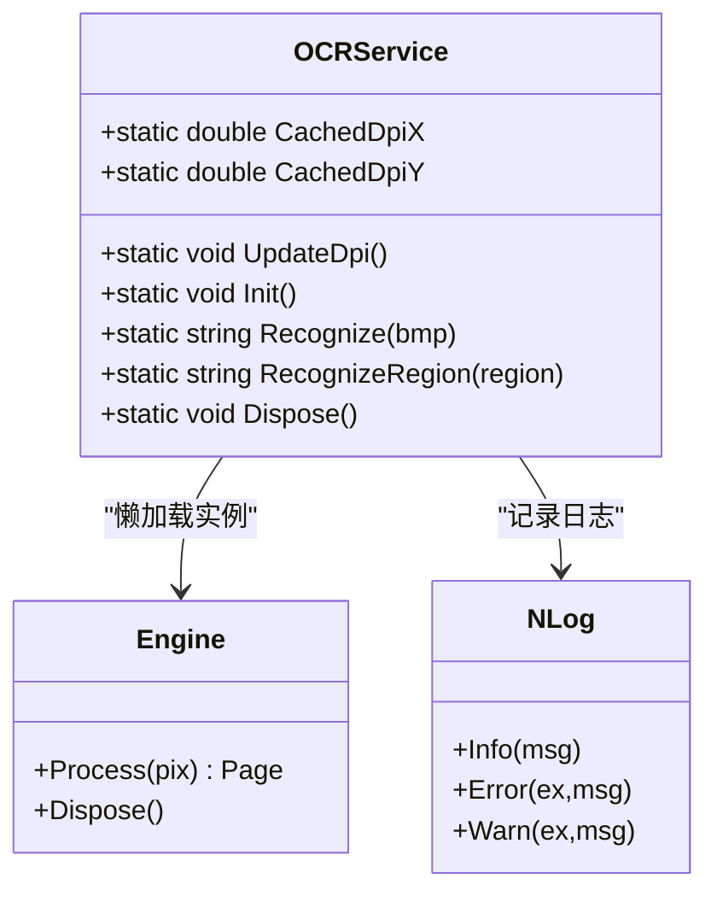
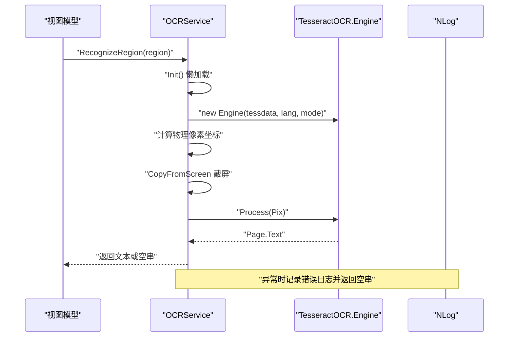
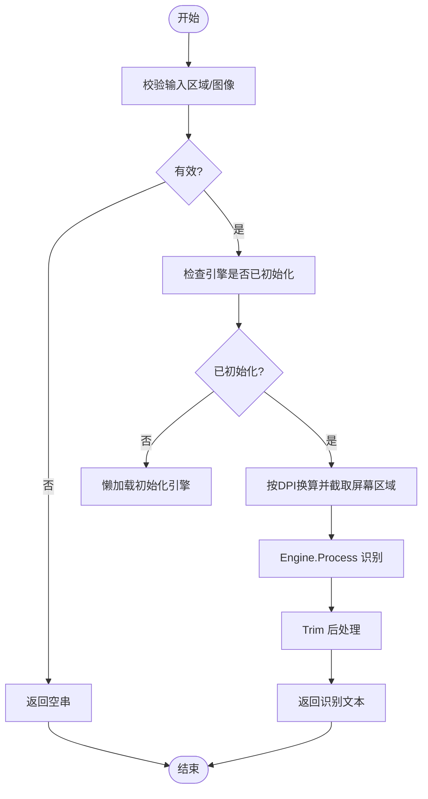
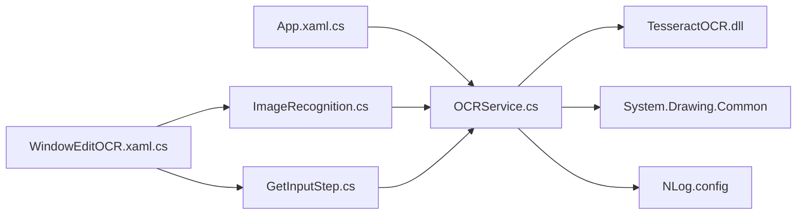

# OCR 服务 (OCRService)

<cite>
**本文引用的文件**   
- [OCRService.cs](file://ShaoLu/Services/OCRService.cs)
- [App.xaml.cs](file://ShaoLu/App.xaml.cs)
- [ImageRecognition.cs](file://ShaoLu/Viewmodels/ImageRecognition.cs)
- [GetInputStep.cs](file://ShaoLu/Viewmodels/GetInputStep.cs)
- [WindowEditOCR.xaml.cs](file://ShaoLu/Views/WindowEditOCR.xaml.cs)
- [ShaoLu.csproj](file://ShaoLu/ShaoLu.csproj)
- [NLog.config](file://ShaoLu/NLog.config)
</cite>

## 目录
1. [简介](#简介)
2. [项目结构](#项目结构)
3. [核心组件](#核心组件)
4. [架构总览](#架构总览)
5. [详细组件分析](#详细组件分析)
6. [依赖关系分析](#依赖关系分析)
7. [性能考量](#性能考量)
8. [故障排查指南](#故障排查指南)
9. [结论](#结论)
10. [附录](#附录)

## 简介
本文件为 ShaoLu 应用的 OCR 服务提供完整技术文档，重点围绕 OCRService 类的设计与 TesseractOCR 引擎集成，说明文字区域检测、字符识别、结果后处理等关键流程；阐述多线程安全访问机制，确保高并发场景下的稳定性；给出 OCR 引擎配置选项（语言包管理、识别参数调优、性能优化策略）；并完善错误处理与异常恢复机制（含重试策略建议）。文末提供调用示例路径，便于读者快速上手。

## 项目结构
OCR 能力由 Services 层的 OCRService 统一封装，上层 ViewModels 通过静态方法调用完成屏幕截图与识别；应用启动时在主线程缓存 DPI 缩放因子，避免后台线程访问 WPF 对象；TesseractOCR 引擎懒加载初始化，使用 tessdata 目录中的语言包。

图表来源 
- [App.xaml.cs:83-85](file://ShaoLu/App.xaml.cs#L83-L85)
- [OCRService.cs:31-48](file://ShaoLu/Services/OCRService.cs#L31-L48)
- [OCRService.cs:53-75](file://ShaoLu/Services/OCRService.cs#L53-L75)
- [ShaoLu.csproj:465-489](file://ShaoLu/ShaoLu.csproj#L465-L489)

章节来源
- [App.xaml.cs:1-112](file://ShaoLu/App.xaml.cs#L1-L112)
- [OCRService.cs:1-159](file://ShaoLu/Services/OCRService.cs#L1-L159)
- [ShaoLu.csproj:416-489](file://ShaoLu/ShaoLu.csproj#L416-L489)

## 核心组件
- OCRService：对外暴露静态 API，负责 OCR 引擎懒加载、图像识别、屏幕区域截取、DPI 缓存与资源释放。
- TesseractOCR 引擎：通过 NuGet 引入的 TesseractOCR 库，使用 Engine 进行识别。
- 视图模型层：ImageRecognition 与 GetInputStep 在异步任务中调用 OCRService，实现 UI 不阻塞的识别流程。
- 区域选择窗口：WindowEditOCR 用于用户选择 OCR 区域，返回逻辑像素坐标供 OCRService 使用。

章节来源
- [OCRService.cs:12-159](file://ShaoLu/Services/OCRService.cs#L12-L159)
- [ImageRecognition.cs:560-602](file://ShaoLu/Viewmodels/ImageRecognition.cs#L560-L602)
- [GetInputStep.cs:200-294](file://ShaoLu/Viewmodels/GetInputStep.cs#L200-L294)
- [WindowEditOCR.xaml.cs:1-46](file://ShaoLu/Views/WindowEditOCR.xaml.cs#L1-L46)

## 架构总览
OCR 服务采用“单例式静态封装 + 懒加载引擎”的模式，结合 NLog 记录运行状态与异常；上层业务以 Task.Run 将识别工作卸载到后台线程，避免阻塞 UI。DPI 缩放因子在 UI 线程初始化一次，后续仅读取，保证线程安全。

图表来源 
- [OCRService.cs:12-159](file://ShaoLu/Services/OCRService.cs#L12-L159)

章节来源
- [OCRService.cs:12-159](file://ShaoLu/Services/OCRService.cs#L12-L159)

## 详细组件分析

### OCRService 设计与实现
- 线程安全：使用双重检查锁（_lock）确保 Engine 单例只初始化一次；所有对外方法均为静态，避免实例化带来的竞争条件。
- DPI 缓存：CachedDpiX/CachedDpiY 在 UI 线程设置一次，后台线程仅读取，避免跨线程访问 WPF 对象。
- 懒加载初始化：首次调用 Recognize/RecognizeRegion 时触发 Init，自动定位 tessdata 目录并加载语言包。
- 识别流程：
  - 输入 Bitmap：内存流转 PNG -> Pix.Image.LoadFromMemory -> Engine.Process -> 提取文本并 Trim。
  - 输入屏幕区域：根据 DPI 换算物理像素 -> CopyFromScreen 截屏 -> 调用 Recognize(Bitmap)。
- 资源释放：Dispose 释放 Engine 并置空引用，防止内存泄漏。

图表来源 
- [OCRService.cs:53-107](file://ShaoLu/Services/OCRService.cs#L53-L107)
- [OCRService.cs:114-144](file://ShaoLu/Services/OCRService.cs#L114-L144)

章节来源
- [OCRService.cs:12-159](file://ShaoLu/Services/OCRService.cs#L12-L159)

### 多线程安全与并发控制
- 单例引擎：_ocr 为静态字段，Init 中使用 lock(_lock) 保护，避免重复创建。
- 无状态操作：Recognize/RecognizeRegion 内部不持有可变共享状态，仅读取 DPI 缓存与调用 Engine。
- 后台执行：上层通过 Task.Run 将识别放入线程池，UI 保持响应。
- 异常隔离：识别过程 try/catch 捕获异常并记录日志，返回空字符串，避免上层崩溃。

章节来源
- [OCRService.cs:53-75](file://ShaoLu/Services/OCRService.cs#L53-L75)
- [OCRService.cs:82-107](file://ShaoLu/Services/OCRService.cs#L82-L107)
- [ImageRecognition.cs:583](file://ShaoLu/Viewmodels/ImageRecognition.cs#L583)
- [GetInputStep.cs:202-206](file://ShaoLu/Viewmodels/GetInputStep.cs#L202-L206)

### 文字区域检测与字符识别流程
- 区域检测：由上层（如 WindowEditOCR）获取用户选择的逻辑像素区域，转换为屏幕物理像素坐标。
- 字符识别：Engine.Process 对 Pix 图像进行识别，返回 Page.Text。
- 结果后处理：Trim 去除首尾空白；若为空则视为未识别到文本。

图表来源 
- [OCRService.cs:82-107](file://ShaoLu/Services/OCRService.cs#L82-L107)
- [OCRService.cs:114-144](file://ShaoLu/Services/OCRService.cs#L114-L144)

章节来源
- [OCRService.cs:82-144](file://ShaoLu/Services/OCRService.cs#L82-L144)

### 错误处理与异常恢复机制
- 识别失败：try/catch 捕获异常，记录错误日志，返回空字符串，避免上层崩溃。
- 初始化失败：Init 抛出异常并记录错误，调用方需感知并处理（当前上层未显式重试）。
- 建议的重试策略：
  - 指数退避重试：最多重试 2-3 次，间隔递增（例如 100ms、300ms、600ms）。
  - 降级策略：若连续失败，回退到点读模式（GetInputStep 支持 ScreenText），或提示用户重新选择区域。
  - 可观测性：记录失败次数与耗时，辅助定位问题。

章节来源
- [OCRService.cs:67-71](file://ShaoLu/Services/OCRService.cs#L67-L71)
- [OCRService.cs:102-106](file://ShaoLu/Services/OCRService.cs#L102-L106)
- [GetInputStep.cs:284-288](file://ShaoLu/Viewmodels/GetInputStep.cs#L284-L288)

### OCR 引擎配置与性能优化
- 语言包管理：
  - 路径：应用根目录下的 tessdata。
  - 默认语言：chi_sim+eng（简体中文+英文）。
  - 可用语言包：中文简体/繁体及竖排、英文、日文、数学符号等（见项目文件内容项）。
- 识别参数调优：
  - 当前使用 EngineMode.Default，可根据场景切换为更精确或更快的模式（如 OcrEngineMode.LstmOnly 或 OcrEngineMode.TesseractOnly）。
  - 可通过 Pix 预处理提升识别率（二值化、去噪、放大分辨率）。
- 性能优化策略：
  - 复用 Engine 单例，避免重复初始化开销。
  - 限制识别区域大小，减少图像处理时间。
  - 使用 Task.Run 异步执行，避免阻塞 UI。
  - 合理设置 DPI 缓存，避免多次查询系统 DPI。

章节来源
- [OCRService.cs:63-65](file://ShaoLu/Services/OCRService.cs#L63-L65)
- [ShaoLu.csproj:465-489](file://ShaoLu/ShaoLu.csproj#L465-L489)

### 代码示例与调用方式
- 图片文字识别（Bitmap）：
  - 入口：OCRService.Recognize(Bitmap bmp)
  - 适用：已有位图数据，直接识别。
- 屏幕区域识别：
  - 入口：OCRService.RecognizeRegion(System.Windows.Rect region)
  - 适用：从屏幕指定区域截取并识别。
- 视图模型调用示例：
  - ImageRecognition：在找到目标图像后，计算 OCR 区域并异步识别。
  - GetInputStep：根据用户选择的区域或点位置进行 OCR 测试与结果展示。

章节来源
- [OCRService.cs:82-107](file://ShaoLu/Services/OCRService.cs#L82-L107)
- [OCRService.cs:114-144](file://ShaoLu/Services/OCRService.cs#L114-L144)
- [ImageRecognition.cs:560-602](file://ShaoLu/Viewmodels/ImageRecognition.cs#L560-L602)
- [GetInputStep.cs:200-294](file://ShaoLu/Viewmodels/GetInputStep.cs#L200-L294)

## 依赖关系分析
- 外部依赖：
  - TesseractOCR：OCR 引擎库，版本 5.5.2。
  - System.Drawing.Common：用于 Bitmap、Graphics 等图像处理。
  - NLog：日志记录。
- 内部依赖：
  - App.xaml.cs：启动时调用 OCRService.UpdateDpi() 缓存 DPI。
  - ViewModels：ImageRecognition、GetInputStep 调用 OCRService 进行识别。
  - Views：WindowEditOCR 提供区域选择交互。

图表来源 
- [App.xaml.cs:83-85](file://ShaoLu/App.xaml.cs#L83-L85)
- [OCRService.cs:1-6](file://ShaoLu/Services/OCRService.cs#L1-L6)
- [ShaoLu.csproj:429-432](file://ShaoLu/ShaoLu.csproj#L429-L432)
- [NLog.config:1-20](file://ShaoLu/NLog.config#L1-L20)

章节来源
- [ShaoLu.csproj:416-489](file://ShaoLu/ShaoLu.csproj#L416-L489)
- [NLog.config:1-20](file://ShaoLu/NLog.config#L1-L20)

## 性能考量
- 引擎初始化开销：懒加载确保仅在首次使用时初始化，避免启动延迟。
- 图像处理成本：截屏与内存流转换存在 CPU/内存开销，建议限制区域尺寸与频率。
- 并发控制：单例引擎避免重复创建；后台线程执行避免 UI 卡顿。
- DPI 缓存：一次性读取系统 DPI，减少系统调用。
- 日志级别：生产环境可降低日志级别以减少 I/O 压力。

[本节为通用指导，不直接分析具体文件]

## 故障排查指南
- 常见问题：
  - 识别结果为空：检查区域是否有效、DPI 是否正确、tessdata 是否存在且包含所需语言包。
  - 初始化失败：确认 tessdata 路径正确、语言包名称匹配（如 chi_sim+eng）。
  - 性能缓慢：缩小识别区域、降低分辨率、减少频繁调用。
- 诊断手段：
  - 查看 NLog 日志文件（logs 目录下按日期命名），关注错误与警告信息。
  - 使用视图模型的“测试 OCR”功能验证区域与结果。
  - 启用运行时显示 OCR 区域，确认区域选择准确。

章节来源
- [NLog.config:1-20](file://ShaoLu/NLog.config#L1-L20)
- [GetInputStep.cs:272-288](file://ShaoLu/Viewmodels/GetInputStep.cs#L272-L288)

## 结论
OCRService 以简洁稳定的静态 API 封装了 TesseractOCR 引擎，结合 DPI 缓存与懒加载机制，在高并发场景下具备良好的线程安全性与性能表现。上层通过异步调用与可视化区域选择，实现了易用性与可靠性兼顾的 OCR 体验。建议在现有基础上引入重试与降级策略，进一步提升鲁棒性。

[本节为总结性内容，不直接分析具体文件]

## 附录
- 相关配置文件：
  - NLog 配置：输出到文件与控制台，便于调试与监控。
  - 项目文件：包含 TesseractOCR 与 System.Drawing.Common 引用，以及 tessdata 语言包内容项。
- 扩展建议：
  - 增加识别参数配置界面（如 EngineMode、Pix 预处理选项）。
  - 引入重试与熔断机制，提升异常恢复能力。
  - 增加识别质量评估指标（置信度、耗时统计）。

章节来源
- [NLog.config:1-20](file://ShaoLu/NLog.config#L1-L20)
- [ShaoLu.csproj:416-489](file://ShaoLu/ShaoLu.csproj#L416-L489)